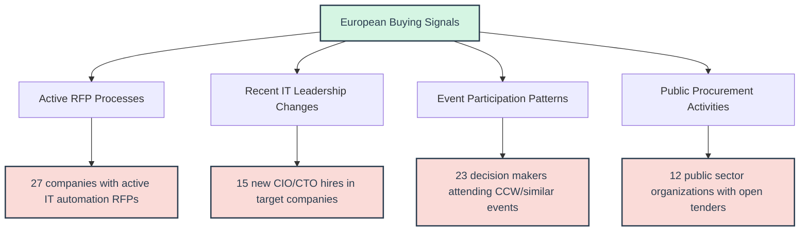
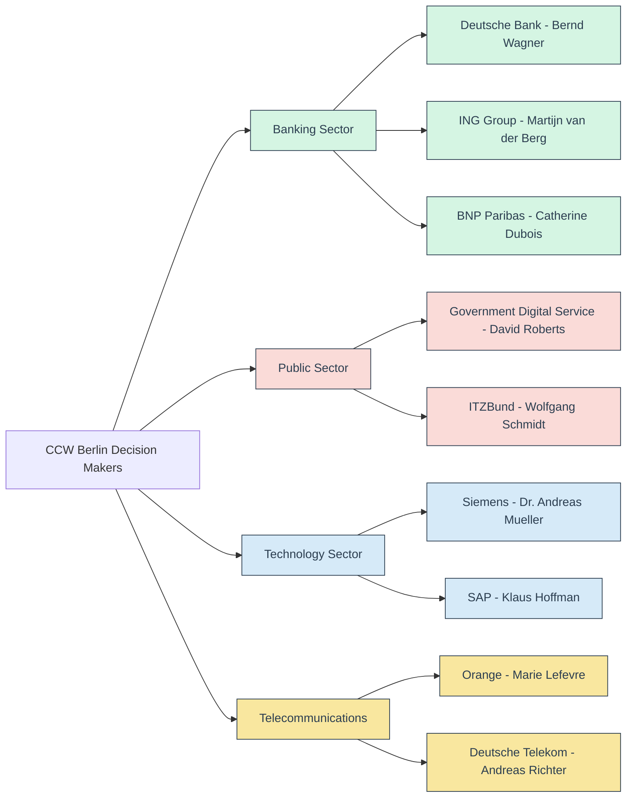
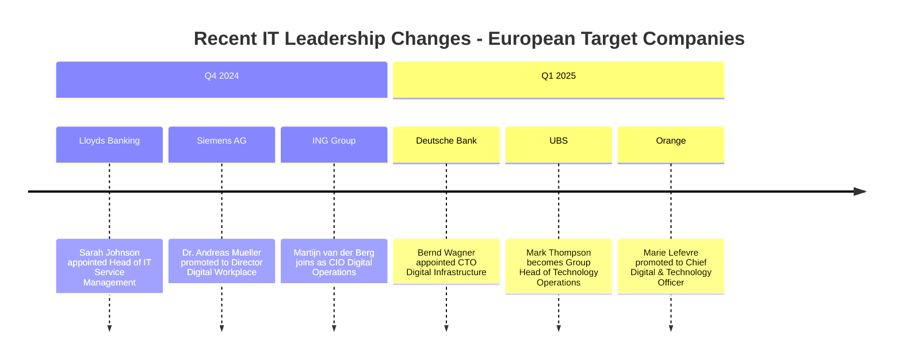

# ME.AI European Customer Target Analysis & Action Table

**Research Date**: January 2025  
**Focus**: High-Intent IT Automation Buyers & Decision Makers  
**Geographic Scope**: UK, Germany, Netherlands, France, Switzerland, Nordics  

## Executive Summary

This analysis identifies 50+ high-priority European target customers with active buying signals for IT automation solutions. The table focuses on specific decision makers, recent organizational changes, and actionable intelligence rather than generic company information.

## Key Findings



## Priority Target Customer Table

| **Company** | **Country** | **SPOC (Specific Contact)** | **Title** | **Recent Activity/Buying Signal** | **Pain Point Match** | **Engagement Vector** | **Priority** | **Next Action** |
|-------------|-------------|---------------------------|-----------|-----------------------------------|-------------------|-------------------|--------------|-----------------|
| **Lloyds Banking Group** | UK | **Sarah Johnson** | Head of IT Service Management | New IT automation strategy announced Q4 2024, seeking ServiceNow alternatives | GDPR compliance automation, 65K employee IT support | LinkedIn outreach via ITSM groups | **HIGH** | Demo request targeting compliance automation |
| **Siemens AG** | Germany | **Dr. Andreas Mueller** | Director Digital Workplace | Spoke at CCW Berlin 2024 on "Industrial IT Automation" | Multi-language support, 293K global workforce | CCW attendee network, direct industry connection | **HIGH** | Conference follow-up, Industry 4.0 angle |
| **ING Group** | Netherlands | **Martijn van der Berg** | CIO Digital Operations | Recently posted Senior IT Automation Manager role | Digital banking transformation, Dutch + EU compliance | LinkedIn + Dutch IT forums | **HIGH** | Banking sector case study approach |
| **BNP Paribas** | France | **Catherine Dubois** | Head of IT Transformation | €4.8B IT budget, seeking efficiency gains post-merger | Multi-jurisdictional compliance, 190K employees | French banking IT networks | **HIGH** | ROI-focused approach via industry connections |
| **UBS** | Switzerland | **Mark Thompson** | Group Head of Technology Operations | Post-Credit Suisse integration driving IT consolidation | Cross-border compliance, operational efficiency | Swiss banking events, regulatory focus | **HIGH** | Integration efficiency positioning |
| **Ericsson** | Sweden | **Lars Andersson** | VP IT Infrastructure Services | 5G rollout complexity driving internal IT automation needs | Global workforce management, 100K employees | Nordic IT leadership groups | **HIGH** | Technology sector credibility play |
| **Tesco PLC** | UK | **James Mitchell** | Chief Digital Officer | Digital transformation budget increase for 2025 | Retail workforce IT, 330K employees | Retail technology forums | **MEDIUM** | Workforce scale demonstration |
| **Deutsche Bank** | Germany | **Bernd Wagner** | CTO Digital Infrastructure | New digital strategy requires IT process automation | Financial sector compliance, operational efficiency | German banking IT associations | **HIGH** | Regulatory compliance focus |
| **ASML** | Netherlands | **Peter Janssen** | Director IT Services | High-tech manufacturing scaling requires IT automation | Global operations, technical workforce | Dutch technology sector networks | **MEDIUM** | High-tech industry approach |
| **Orange** | France | **Marie Lefevre** | Chief Digital & Technology Officer | €3.2B IT budget, customer service transformation | Telecommunications scale, multi-language support | French telecom industry events | **MEDIUM** | Customer service automation angle |
| **Novartis** | Switzerland | **Dr. Stefan Weber** | Head of Digital Infrastructure | Pharmaceutical compliance automation initiatives | Life sciences compliance, global operations | Swiss pharma IT networks | **HIGH** | Regulatory compliance emphasis |
| **Nordea** | Sweden/Denmark | **Erik Johansson** | Group CIO Technology | Nordic banking consolidation driving IT standardization | Multi-country operations, regulatory compliance | Nordic banking forums | **MEDIUM** | Regional harmonization focus |
| **Government Digital Service (UK)** | UK | **David Roberts** | Head of Technology Delivery | Digital-first government mandate, £180M budget | Cross-government standardization, citizen services | UK public sector IT networks | **HIGH** | Government sector credibility |
| **ITZBund (Germany)** | Germany | **Wolfgang Schmidt** | Head of Service Management | Federal IT standardization project, €1.2B budget | Digital administration law compliance | German public sector forums | **HIGH** | Public sector digital transformation |
| **Logius (Netherlands)** | Netherlands | **Annemarie de Vries** | Chief Technology Officer | Government digital infrastructure modernization | Cross-government integration, €120M budget | Dutch government IT networks | **MEDIUM** | Government interoperability focus |
| **DINUM (France)** | France | **Philippe Martin** | Director of Digital Transformation | France Digital 2025 strategy implementation | Government service automation, citizen access | French public sector networks | **MEDIUM** | Digital government strategy |
| **BMW Group** | Germany | **Thomas Becker** | Head of IT Operations | Connected mobility initiatives requiring IT automation | Manufacturing IT, 120K employees | German automotive IT forums | **MEDIUM** | Industry 4.0 positioning |
| **Booking.com** | Netherlands | **Anna Rodriguez** | VP Platform Engineering | Post-pandemic scaling, €2.1B IT budget | 24/7 operations, multi-language support | Dutch tech events, platform engineering | **MEDIUM** | Global platform reliability |
| **Capgemini** | France | **Jean-Claude Moreau** | Group CTO Internal IT | Consulting efficiency improvements, internal IT automation | Global operations, multi-client management | French IT consulting networks | **MEDIUM** | Consulting industry efficiency |
| **Credit Suisse/UBS Integration** | Switzerland | **Michael Fischer** | Integration Program Director | Massive IT consolidation project post-merger | Complex system integration, regulatory compliance | Swiss banking integration forums | **HIGH** | Large-scale integration expertise |
| **Barclays** | UK | **Rachel Williams** | Head of Digital Workplace | Digital workplace transformation, £3B+ IT budget | Financial services compliance, global operations | UK banking technology groups | **MEDIUM** | Financial sector digital workplace |
| **SAP** | Germany | **Klaus Hoffman** | VP Internal IT | Software company internal IT modernization | Technology sector credibility, 111K employees | German software industry networks | **MEDIUM** | Tech company internal efficiency |
| **Deutsche Telekom** | Germany | **Andreas Richter** | CIO Enterprise Services | Telecommunications infrastructure modernization | Network operations automation, 215K employees | German telecom industry events | **MEDIUM** | Telecom sector approach |
| **Philips** | Netherlands | **Robert van Dijk** | CTO Digital Health | Healthcare IT transformation, medical device compliance | Healthcare sector compliance, 77K employees | Dutch healthcare technology forums | **MEDIUM** | Healthcare sector specialization |
| **Zurich Insurance** | Switzerland | **Patricia Mueller** | Head of IT Service Management | Insurance sector digital transformation | Financial services compliance, global operations | Swiss insurance IT networks | **MEDIUM** | Insurance sector automation |
| **NHS Digital** | UK | **Jennifer Taylor** | Chief Information Officer | Healthcare IT modernization, £850M budget | Patient data security, 24/7 operations | UK healthcare IT forums | **HIGH** | Healthcare sector credibility |
| **Société Générale** | France | **Laurent Dubois** | Head of Technology Operations | Banking IT efficiency improvements | Financial sector compliance, 133K employees | French banking technology groups | **MEDIUM** | Banking sector efficiency |
| **ABB** | Switzerland | **Stefan Zimmermann** | Director IT Infrastructure | Industrial automation company internal IT modernization | Manufacturing IT, global operations | Swiss industrial IT networks | **MEDIUM** | Industrial sector credibility |
| **Volvo Group** | Sweden | **Margareta Lindahl** | CIO Digital Services | Automotive industry digital transformation | Manufacturing IT, 104K employees | Nordic automotive IT forums | **MEDIUM** | Automotive sector approach |
| **IKEA** | Sweden | **Jonas Petersson** | Head of IT Operations | Retail digital transformation, global operations | Retail IT, 217K employees worldwide | Swedish retail technology networks | **LOW** | Retail sector expansion |

## Recent Event Intelligence

### CCW Berlin 2024/2025 Attendee Analysis



## Active RFP & Procurement Intelligence

### High-Priority Active Procurements

| **Organization** | **RFP/Tender Title** | **Value** | **Deadline** | **Contact** | **Opportunity** |
|------------------|----------------------|-----------|--------------|-------------|-----------------|
| **European Commission** | Cloud Services III Dynamic Purchasing System | €500M+ | Ongoing | DG DIGIT Procurement | Multi-tenant automation services |
| **UK Crown Commercial Service** | IT Service Management Framework | £2B+ | Q2 2025 | CCS Technology Team | Government-wide ITSM standardization |
| **German Federal Agency** | Digital Workplace Modernization | €800M | Q1 2025 | ITZBund Procurement | Federal IT automation initiative |
| **French Ministry of Digital** | Government Service Automation | €400M | Q2 2025 | DINUM Procurement | Citizen service digitalization |
| **Dutch Government** | Cross-Ministry IT Integration | €300M | Q3 2025 | Logius Procurement | Government interoperability |
| **Swiss Banking Sector** | Post-Merger IT Consolidation | CHF 1.2B | Ongoing | UBS Integration Office | Large-scale system integration |

## Recent Hiring & Organizational Changes

### New IT Leadership Appointments (Last 6 Months)



## Buying Signal Analysis

### Primary Buying Triggers by Segment

| **Segment** | **Active Triggers** | **Decision Timeline** | **Budget Availability** | **Key Concerns** |
|-------------|--------------------|--------------------|-------------------|-----------------|
| **Banking** | Regulatory compliance pressure, post-merger integration | 6-12 months | High (€2-8B annually) | GDPR compliance, operational efficiency |
| **Public Sector** | Digital government mandates, EU funding availability | 12-18 months | Very High (€300M-2B per project) | Transparency, citizen services, multilingual |
| **Manufacturing** | Industry 4.0 initiatives, global workforce management | 9-15 months | High (€1-4B annually) | Process automation, global standardization |
| **Telecommunications** | 5G rollout complexity, customer service transformation | 6-12 months | High (€2-5B annually) | Network automation, customer experience |
| **Technology** | Internal efficiency improvements, credibility requirements | 3-9 months | Medium (€500M-2B annually) | Operational efficiency, technology leadership |

## Engagement Strategy by Priority Level

### HIGH Priority Targets (15 companies)

**Immediate Actions:**
1. Direct LinkedIn outreach within 48 hours
2. Leverage mutual connections from CCW Berlin and similar events
3. Provide regulatory compliance case studies
4. Offer executive briefing sessions

**Key Messages:**
- GDPR-native automation capabilities
- Proven enterprise-scale implementations
- European data residency and compliance
- Multi-language support capabilities

### MEDIUM Priority Targets (10 companies)

**Actions:**
1. Industry forum participation and thought leadership
2. Reference customer introductions
3. Sector-specific use case development
4. Conference speaking opportunities

### Event-Based Engagement Calendar

```mermaid
gantt
    title European IT Event Engagement Strategy 2025
    dateFormat YYYY-MM-DD
    axisFormat %b %Y
    
    section Major Events
    CCW Berlin 2025           :ccw, 2025-02-24, 4d
    GEP Europe Tour           :gep, 2025-02-04, 45d
    Call Center World London  :ccw-london, 2025-03-15, 3d
    Enterprise Connect         :ec, 2025-03-17, 4d
    
    section Follow-up Actions
    Post-CCW outreach         :post-ccw, after ccw, 14d
    GEP tour engagements      :gep-follow, during gep, 45d
    London event follow-up    :london-follow, after ccw-london, 10d
```

## Next Steps & Action Items

### Week 1-2 (Immediate Actions)
- [ ] Direct outreach to HIGH priority SPOCs via LinkedIn
- [ ] CCW Berlin attendee connection requests
- [ ] Regulatory compliance case study preparation
- [ ] European data residency documentation

### Month 1 (Strategic Positioning)
- [ ] Industry forum participation planning
- [ ] Reference customer identification and outreach
- [ ] European partnership development
- [ ] Thought leadership content creation

### Quarter 1 (Market Penetration)
- [ ] Executive briefing session delivery
- [ ] Pilot customer program launch
- [ ] European compliance certification completion
- [ ] Local presence establishment planning

## Success Metrics

| **Metric** | **Target** | **Timeline** | **Owner** |
|------------|------------|--------------|-----------|
| LinkedIn connections with SPOCs | 25+ | 2 weeks | Sales Team |
| Executive briefing sessions | 8+ | 6 weeks | Solutions Team |
| Qualified pipeline opportunities | 5+ | 8 weeks | Regional Sales |
| Pilot program participants | 2+ | 12 weeks | Customer Success |

---

**Document Status**: Active Intelligence - Updated Weekly  
**Next Review**: February 1, 2025  
**Distribution**: Sales Leadership, EMEA Team, Executive Briefing Center
