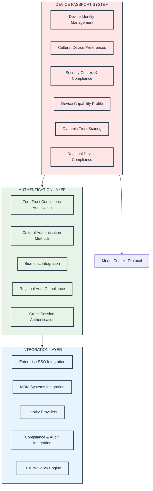
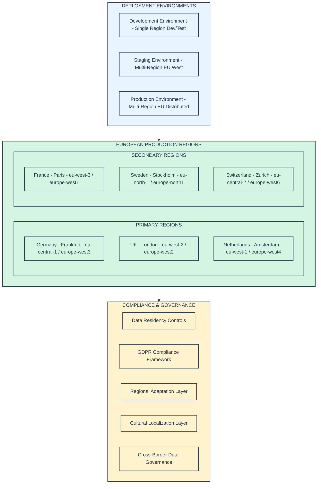

# ME.AI Technical Stack and Architecture - Year 1 v16

**Version:** 2.0.0  
**Date:** January 2025  
**Architecture Alignment:** ME.AI Neural Core Platform Architecture v16

## Table of Contents

1. [Introduction](#1-introduction)
2. [Guiding Architectural Principles](#2-guiding-architectural-principles-for-year-1)
3. [Year 1 Core Platform Architecture](#3-year-1-core-platform-architecture)
4. [Year 1 IT Support Product Architecture](#4-year-1-it-support-product-architecture)
5. [Overall Year 1 System Architecture](#5-overall-year-1-system-architecture)
6. [Deployment Architecture](#6-deployment-architecture-year-1)
7. [Security Architecture](#7-security-architecture-year-1)
8. [European Market Readiness](#8-european-market-readiness)

## 1. Introduction

### 1.1 Purpose

This document outlines the technical stack and architecture for Year 1 of the ME.AI v16 platform. It focuses on the foundational Core Platform and the initial Agentic Product, IT Support, as defined by the MVP scope and feasibility analysis. The architecture aims to be robust, scalable, and provide a solid base for future enhancements while delivering tangible business value within the first year.

The v16 architecture introduces the **System of Context** philosophy and **Four Strategic Pillars** while maintaining practical implementation focus for Year 1 delivery.

### 1.2 Year 1 Scope Summary

Based on the feasibility analysis of the implementation strategy documents, the Year 1 scope will prioritize:

**Core Platform:** Establishing stable foundational capabilities for conversation processing, cross-session memory management, cultural intelligence, UI interaction, and inter-service communication. This includes features planned up to Release 2, with a focus on robustness and scalability. Advanced mesh concepts and AI features (like full semantic negotiation and dynamic coalition formation) will be initiated but with a more constrained scope, aiming for specific use-case support rather than generalized capabilities in Year 1.

**IT Support Product:** Delivering high-value IT automation for:
- Password resets (90% automation - 13,950 incidents)
- Account unlocks (95% automation - 7,790 incidents)  
- Basic software installation (30% automation - 2,220 incidents)
- Network issue diagnosis and device diagnostics (20% automation - 2,520 incidents)

**European Market Focus:** Cultural intelligence, GDPR compliance, multi-language support, and data residency requirements built into the foundation.

The emphasis is on delivering a functional, reliable, and valuable system in Year 1, deferring some of the most complex R&D-heavy features for more thorough development and stabilization in Year 2.

### 1.3 v16 System of Context Philosophy

The ME.AI v16 platform operates as a **System of Context** where every interaction contributes to a growing understanding of users, devices, organizational culture, and business processes. This approach transforms traditional reactive IT support into proactive, intelligent assistance that anticipates needs and delivers personalized experiences.

**Core Context Principles:**
- **Context Accumulation**: Every user interaction, device authentication, and system integration adds layers of understanding
- **Context Preservation**: Through the Model Context Protocol, contextual understanding persists across sessions, channels, and agent interactions  
- **Context Distribution**: Agent-to-Agent communication ensures relevant context reaches every component
- **Cultural Context Intelligence**: Understanding enterprises operate across cultures and languages, preserving linguistic differences, cultural communication styles, and regulatory compliance requirements

## 2. Guiding Architectural Principles for Year 1

**System of Context Principles (v16):**
- **Context-First Design**: Every component designed to accumulate and preserve contextual understanding
- **Cultural Intelligence Integration**: Cultural awareness and adaptation built into every interaction layer
- **Cross-Session Continuity**: User experience that builds understanding and relationships over time
- **Agent Collaboration**: AI agents work together through shared context protocols (MCP and A2A)

**Technical Implementation Principles:**
- **Modularity and Decoupling**: Design components with clear interfaces to allow for independent development, testing, and cultural adaptation
- **Iterative Development**: Build a strong foundation and incrementally add complexity and cultural intelligence features
- **Pragmatism over Premature Complexity**: For Year 1, favor proven technologies enhanced with cultural intelligence and simpler architectural patterns where they meet requirements, especially for advanced mesh and AI concepts. Build towards the full vision iteratively
- **European-First Scalability**: Design for horizontal scalability from the outset with European data residency and cultural requirements
- **Security by Cultural Design**: Integrate security and cultural sensitivity considerations into every layer of the architecture
- **Observability with Cultural Metrics**: Implement comprehensive logging, monitoring, and tracing including cultural adaptation effectiveness
- **API-First with Cultural Context**: Define clear APIs for inter-service communication and cultural adaptation that enable potential external integrations

## 3. Year 1 Core Platform Architecture

### 3.1 High-Level Core Platform Architecture (Year 1)

```mermaid
flowchart TD
    ChatWeb[Web Chat Client]
    ChatMobile[Mobile Chat Client]
    MSTeams[MS Teams Integration]
    VoiceInt[Voice Interface]
    
    subgraph OCUI["OMNI-CHANNEL UNIVERSAL INTERFACE"]
        UIAgentFramework[UI Agent Framework]
        UIPersonalization[UI Personalization & Accessibility]
        MultiModal[Multi-Modal Input Processing]
        DevicePassport[Device Passport System]
        ChannelAdapter[Channel Adapters]
    end
    
    subgraph MLSP["MULTI-LINGUAL SUPPORT PLATFORM"]
        CulturalIntelEngine[Cultural Intelligence Engine]
        LanguageDetection[Language Detection & Processing]
        CulturalAdaptation[Cultural Adaptation Service]
        RegionalCompliance[Regional Compliance Framework]
        MultiLangKB[Multi-Language Knowledge Base]
    end
    
    subgraph NC["NEURAL CORE"]
        ConvProc[Conversation Processing Engine]
        CrossSessionMem[Cross-Session Memory Management]
        UserSemanticEvol[User Semantic Evolution]
        WorkflowEngine[Workflow Engine]
        SemanticEngine[Semantic Engine]
        EmpathyEngine[Empathy & Cultural Response Engine]
    end
    
    subgraph AAO["AGENTIC AI ORCHESTRATION"]
        MCP[Model Context Protocol - MCP]
        A2AComm[Agent-to-Agent Communication]
        CoalitionFormation[Dynamic Coalition Formation]
        ServiceDiscovery[Enhanced Service Discovery]
        TrustReputation[Trust & Reputation System]
        MEAgents[ME.AI Agent Ecosystem]
    end
    
    subgraph DataLayer["DATA LAYER"]
        UserProfileDB[(User Profile & Cultural Context DB)]
        ConversationDB[(Cross-Session Conversation DB)]
        WorkflowStateDB[(Workflow State DB)]
        CulturalKnowledgeDB[(Cultural Knowledge Graph DB)]
        VectorEmbeddingDB[(Vector Embedding DB)]
        DevicePassportDB[(Device Passport DB)]
        ComplianceAuditDB[(Compliance & Audit DB)]
    end
    
    subgraph ExtInt["EXTERNAL INTEGRATIONS"]
        ITSM_API[ITSM System APIs]
        AD_API[Active Directory APIs]
        MDM_API[MDM System APIs]
        CloudServices[Cloud Service APIs]
        ExternalAI[External AI Services]
        RegionalServices[Regional Compliance Services]
    end
    
    ChatWeb --> OCUI
    ChatMobile --> OCUI
    MSTeams --> OCUI
    VoiceInt --> OCUI
    
    OCUI --> MLSP
    MLSP --> NC
    NC --> AAO
    
    AAO <--> DataLayer
    NC <--> DataLayer
    MLSP <--> DataLayer
    OCUI <--> DataLayer
    
    AAO <--> ExtInt
    NC <--> ExtInt
    
    classDef interfaceStyle fill:#E8F4FD,stroke:#2C3E50,stroke-width:2px,color:#2C3E50
    classDef omnichannelStyle fill:#D5F5E3,stroke:#2C3E50,stroke-width:2px,color:#2C3E50
    classDef multilingualStyle fill:#FFF2CC,stroke:#2C3E50,stroke-width:2px,color:#2C3E50
    classDef neuralStyle fill:#FFE6CC,stroke:#2C3E50,stroke-width:2px,color:#2C3E50
    classDef agenticStyle fill:#E1D5E7,stroke:#2C3E50,stroke-width:2px,color:#2C3E50
    classDef dataStyle fill:#FADBD8,stroke:#2C3E50,stroke-width:2px,color:#2C3E50
    classDef extStyle fill:#F5CBA7,stroke:#2C3E50,stroke-width:2px,color:#2C3E50
    
    class ChatWeb,ChatMobile,MSTeams,VoiceInt interfaceStyle
    class OCUI,UIAgentFramework,UIPersonalization,MultiModal,DevicePassport,ChannelAdapter omnichannelStyle
    class MLSP,CulturalIntelEngine,LanguageDetection,CulturalAdaptation,RegionalCompliance,MultiLangKB multilingualStyle
    class NC,ConvProc,CrossSessionMem,UserSemanticEvol,WorkflowEngine,SemanticEngine,EmpathyEngine neuralStyle
    class AAO,MCP,A2AComm,CoalitionFormation,ServiceDiscovery,TrustReputation,MEAgents agenticStyle
    class DataLayer,UserProfileDB,ConversationDB,WorkflowStateDB,CulturalKnowledgeDB,VectorEmbeddingDB,DevicePassportDB,ComplianceAuditDB dataStyle
    class ExtInt,ITSM_API,AD_API,MDM_API,CloudServices,ExternalAI,RegionalServices extStyle
```



### 3.2 Key Core Platform Components (Year 1 Focus)

#### 3.2.1 Omni-Channel Universal Interface (Year 1)

**UI Agent Framework (Enhanced for v16):**
- **Cultural UI Adaptation**: UI components that adapt to cultural preferences and regional expectations
- **Cross-Session UI State**: UI state that persists and evolves across sessions and devices
- **Device Passport Integration**: Deep integration with device authentication and capability detection
- **Accessibility with Cultural Awareness**: Universal accessibility that respects cultural interaction patterns

**Device Passport System (Core v16 Component):**



**Multi-Modal Input Processing:**
- **Cultural Voice Processing**: Voice interaction with cultural accent and language adaptation
- **Cross-Modal Context Preservation**: Context maintained across chat, voice, and gesture inputs
- **Cultural Gesture Recognition**: Understanding culturally-specific interaction patterns
- **Accessibility Integration**: Multi-modal accessibility with cultural sensitivity

#### 3.2.2 Multi-Lingual Support Platform (NEW in v16)

**Cultural Intelligence Engine (Core v16 Innovation):**

```mermaid
flowchart TD
    subgraph CulturalIntelligence["CULTURAL INTELLIGENCE ENGINE"]
        CulturalDetection[Cultural Context Detection]
        CulturalModeling[Cultural Behavior Modeling]
        CulturalAdaptation[Dynamic Cultural Adaptation]
        CulturalLearning[Continuous Cultural Learning]
        CulturalValidation[Cultural Response Validation]
    end
    
    subgraph LanguageProcessing["LANGUAGE PROCESSING"]
        LanguageDetection[Multi-Language Detection]
        ContextualTranslation[Contextual Translation Engine]
        CulturalIdiomHandling[Cultural Idiom Processing]
        FormalityAdaptation[Formality Level Adaptation]
        RegionalDialects[Regional Dialect Support]
    end
    
    subgraph CulturalKnowledge["CULTURAL KNOWLEDGE"]
        CulturalNorms[Cultural Norms Database]
        BusinessEtiquette[Business Etiquette Rules]
        RegionalPreferences[Regional Preferences]
        CulturalCommunicationPatterns[Communication Patterns]
        CulturalComplianceRules[Cultural Compliance Rules]
    end
    
    subgraph CulturalAdaptationService["CULTURAL ADAPTATION SERVICE"]
        MessageAdaptation[Message Cultural Adaptation]
        WorkflowAdaptation[Workflow Cultural Adaptation]
        TimingAdaptation[Cultural Timing Adaptation]
        EscalationAdaptation[Cultural Escalation Adaptation]
        FeedbackAdaptation[Cultural Feedback Adaptation]
    end
    
    CulturalIntelligence --> LanguageProcessing
    LanguageProcessing --> CulturalKnowledge
    CulturalKnowledge --> CulturalAdaptationService
    CulturalAdaptationService --> NeuralCore[Neural Core Integration]
    
    classDef culturalIntelStyle fill:#FFF2CC,stroke:#2C3E50,stroke-width:2px,color:#2C3E50
    classDef languageStyle fill:#E8F6F3,stroke:#2C3E50,stroke-width:2px,color:#2C3E50
    classDef knowledgeStyle fill:#EBF5FB,stroke:#2C3E50,stroke-width:2px,color:#2C3E50
    classDef adaptationStyle fill:#FEF9E7,stroke:#2C3E50,stroke-width:2px,color:#2C3E50
    
    class CulturalIntelligence,CulturalDetection,CulturalModeling,CulturalAdaptation,CulturalLearning,CulturalValidation culturalIntelStyle
    class LanguageProcessing,LanguageDetection,ContextualTranslation,CulturalIdiomHandling,FormalityAdaptation,RegionalDialects languageStyle
    class CulturalKnowledge,CulturalNorms,BusinessEtiquette,RegionalPreferences,CulturalCommunicationPatterns,CulturalComplianceRules knowledgeStyle
    class CulturalAdaptationService,MessageAdaptation,WorkflowAdaptation,TimingAdaptation,EscalationAdaptation,FeedbackAdaptation adaptationStyle
```



#### 3.2.3 Neural Core (Enhanced for v16)

**Cross-Session Memory Management (Major v16 Enhancement):**

```mermaid
flowchart TD
    subgraph CrossSessionMemory["CROSS-SESSION MEMORY MANAGEMENT"]
        ContextAccumulation[Context Accumulation Engine]
        ContextPreservation[Context Preservation Service]
        ContextEvolution[Context Evolution Tracking]
        ContextDistribution[Context Distribution via MCP]
        ContextValidation[Context Validation & Cleanup]
    end
    
    subgraph MemoryTypes["MEMORY TYPES"]
        ConversationMemory[Conversation Memory]
        SemanticMemory[Semantic Memory]
        EpisodicMemory[Episodic Memory]
        CulturalMemory[Cultural Interaction Memory]
        ProblemSolvingMemory[Problem-Solving Memory]
    end
    
    subgraph MemoryOperations["MEMORY OPERATIONS"]
        MemoryRetrieval[Intelligent Memory Retrieval]
        MemoryConsolidation[Memory Consolidation]
        MemoryForgetting[Selective Memory Forgetting]
        MemorySharing[Cross-User Memory Sharing]
        MemoryPrivacy[Memory Privacy Protection]
    end
    
    subgraph ContextIntegration["CONTEXT INTEGRATION"]
        UserContextIntegration[User Context Integration]
        OrganizationalContext[Organizational Context]
        CulturalContextIntegration[Cultural Context Integration]
        DeviceContextIntegration[Device Context Integration]
        WorkflowContextIntegration[Workflow Context Integration]
    end
    
    CrossSessionMemory --> MemoryTypes
    MemoryTypes --> MemoryOperations
    MemoryOperations --> ContextIntegration
    ContextIntegration --> MCPProtocol[MCP Protocol Distribution]
    
    classDef memoryStyle fill:#FFE6CC,stroke:#2C3E50,stroke-width:2px,color:#2C3E50
    classDef typeStyle fill:#E8F6F3,stroke:#2C3E50,stroke-width:2px,color:#2C3E50
    classDef operationStyle fill:#EBF5FB,stroke:#2C3E50,stroke-width:2px,color:#2C3E50
    classDef integrationStyle fill:#FEF9E7,stroke:#2C3E50,stroke-width:2px,color:#2C3E50
    
    class CrossSessionMemory,ContextAccumulation,ContextPreservation,ContextEvolution,ContextDistribution,ContextValidation memoryStyle
    class MemoryTypes,ConversationMemory,SemanticMemory,EpisodicMemory,CulturalMemory,ProblemSolvingMemory typeStyle
    class MemoryOperations,MemoryRetrieval,MemoryConsolidation,MemoryForgetting,MemorySharing,MemoryPrivacy operationStyle
    class ContextIntegration,UserContextIntegration,OrganizationalContext,CulturalContextIntegration,DeviceContextIntegration,WorkflowContextIntegration integrationStyle
```



**Conversation Processing Engine (Enhanced):**
- **Cultural NLU Service**: Intent recognition with cultural context and regional communication patterns
- **Empathetic Dialogue Management**: State-based dialogue flow enhanced with empathy and cultural awareness
- **Cultural NLG Service**: Response generation that adapts to cultural communication styles and business etiquette
- **Cross-Session Conversation Continuity**: Conversations that build on previous interactions and learned preferences

**User Semantic Evolution (NEW in v16):**
- **Personal Semantic Profile Development**: Understanding how users' technical knowledge and cultural preferences evolve
- **Cultural Adaptation Learning**: Learning individual cultural preferences and communication effectiveness
- **Organizational Semantic Integration**: Balancing personal preferences with organizational cultural norms
- **Cross-Cultural Semantic Negotiation**: Bridging differences between user and organizational semantic models

#### 3.2.4 Agentic AI Orchestration (Core v16 Component)

**Model Context Protocol (MCP) Implementation:**

```mermaid
flowchart TD
    subgraph MCP["MODEL CONTEXT PROTOCOL"]
        ContextStandardization[Context Standardization Layer]
        ContextSerialization[Context Serialization/Deserialization]
        ContextVersioning[Context Versioning & History]
        ContextSecurity[Context Security & Privacy]
        ContextSync[Real-time Context Synchronization]
    end
    
    subgraph ContextTypes["CONTEXT TYPES"]
        UserContext[User Context]
        ConversationContext[Conversation Context]
        CulturalContext[Cultural Context]
        DeviceContext[Device Context]
        WorkflowContext[Workflow Context]
        OrganizationalContext[Organizational Context]
    end
    
    subgraph ContextOperations["CONTEXT OPERATIONS"]
        ContextCapture[Context Capture]
        ContextEnrichment[Context Enrichment]
        ContextDistribution[Context Distribution]
        ContextMerging[Context Merging]
        ContextValidation[Context Validation]
    end
    
    subgraph MCPIntegration["MCP INTEGRATION"]
        AgentMCPClients[Agent MCP Clients]
        ServiceMCPClients[Service MCP Clients]
        DatabaseMCPClients[Database MCP Clients]
        ExternalMCPClients[External System MCP Clients]
        MCPGateway[MCP Gateway & Routing]
    end
    
    MCP --> ContextTypes
    ContextTypes --> ContextOperations
    ContextOperations --> MCPIntegration
    MCPIntegration --> A2ACommunication[A2A Communication Layer]
    
    classDef mcpStyle fill:#E1D5E7,stroke:#2C3E50,stroke-width:2px,color:#2C3E50
    classDef contextStyle fill:#D5F5E3,stroke:#2C3E50,stroke-width:2px,color:#2C3E50
    classDef operationStyle fill:#FFE6CC,stroke:#2C3E50,stroke-width:2px,color:#2C3E50
    classDef integrationStyle fill:#E8F6F3,stroke:#2C3E50,stroke-width:2px,color:#2C3E50
    
    class MCP,ContextStandardization,ContextSerialization,ContextVersioning,ContextSecurity,ContextSync mcpStyle
    class ContextTypes,UserContext,ConversationContext,CulturalContext,DeviceContext,WorkflowContext,OrganizationalContext contextStyle
    class ContextOperations,ContextCapture,ContextEnrichment,ContextDistribution,ContextMerging,ContextValidation operationStyle
    class MCPIntegration,AgentMCPClients,ServiceMCPClients,DatabaseMCPClients,ExternalMCPClients,MCPGateway integrationStyle
```



**Agent-to-Agent Communication (A2A):**
- **Dynamic Agent Discovery**: Agents discovering each other's capabilities and cultural competencies
- **Coalition Formation Protocol**: Temporary coalitions for complex problem-solving with cultural awareness
- **Trust and Reputation Management**: Agent reliability and cultural competency tracking
- **Collaborative Task Execution**: Multi-agent problem solving with context sharing via MCP

**Enhanced Service Discovery (Year 1 Focus):**
- **Kubernetes DNS Integration**: Leverage Kubernetes service discovery for internal service communication
- **Cultural Capability Advertisement**: Services advertising their cultural intelligence capabilities
- **Regional Service Discovery**: Discovery of region-specific services for compliance and cultural adaptation
- **Load-Based Service Selection**: Service selection based on load, capability, and cultural competency

### 3.3 Core Platform Technical Stack (Year 1)

| Category | Recommended Technologies | Alternative Options Considered | Implementation Rationale |
|----------|-------------------------|------------------------------|-------------------------|
| **Frontend Framework** | React 18+ with TypeScript 5.x | Vue.js 3.x, Angular 16+, Svelte 4.x | React's mature ecosystem, TypeScript for type safety, extensive component libraries for accessibility and internationalization |
| **UI Technologies** | HTML5, CSS3, Progressive Web App (PWA) | Native mobile apps, Flutter Web, Electron | PWA provides cross-platform compatibility with near-native performance, reduces development overhead |
| **Backend Services** | Python 3.11+ with FastAPI | Node.js with Express, Go with Gin, Rust with Actix, Java Spring Boot | FastAPI provides automatic API documentation, async support, and excellent performance for AI/ML integration |
| **Secondary Backend** | Node.js 20+ with Express | Python Django, .NET Core, Ruby on Rails | Node.js for real-time features, excellent npm ecosystem, and shared JavaScript/TypeScript knowledge |
| **AI/ML Framework** | Hugging Face Transformers with PyTorch | TensorFlow, JAX, OpenAI API, Anthropic Claude API | Hugging Face provides extensive pre-trained models, active community, and European language support |
| **NLP Processing** | spaCy 3.6+ | NLTK, Stanford CoreNLP, AllenNLP, Stanza | spaCy offers production-ready performance, multilingual support, and excellent integration with ML pipelines |
| **Containerization** | Docker 24+ | Podman, Buildah, LXC | Docker's industry standard adoption, extensive tooling ecosystem, and Kubernetes integration |
| **Container Orchestration** | Kubernetes 1.28+ (EKS/GKE/AKS) | Docker Swarm, Nomad, OpenShift | Kubernetes' market dominance, managed service availability, and extensive operator ecosystem |
| **API Gateway** | Kong 3.x | NGINX Plus, Istio Gateway, AWS API Gateway, Traefik, Envoy Proxy | Kong's plugin ecosystem, rate limiting capabilities, and multi-protocol support |
| **Load Balancing** | NGINX Plus | HAProxy, AWS ALB, Cloudflare Load Balancer, Traefik | NGINX's proven performance, configuration flexibility, and geographic routing capabilities |
| **MCP Implementation** | Custom Python/TypeScript SDK | Protocol Buffers with gRPC, Apache Avro, MessagePack | Custom implementation allows optimization for ME.AI specific context types and cultural data structures |
| **Context Serialization** | Protocol Buffers with gRPC | JSON with REST, Apache Avro, MessagePack, FlatBuffers | Protocol Buffers provide schema evolution, compact serialization, and multi-language support |
| **Workflow Orchestration** | Temporal.io | Apache Airflow, Camunda, Zeebe, AWS Step Functions, Prefect | Temporal's reliability guarantees, state management, and ability to handle long-running processes |
| **Workflow Definition** | Custom ME.SLAM DSL | BPMN 2.0, Workflow Definition Language (WDL), YAML-based | Custom DSL allows cultural adaptation expressions and ME.AI specific context handling |
| **Relational Database** | PostgreSQL 15+ | MySQL 8.0+, MariaDB 10.x, CockroachDB, Amazon Aurora | PostgreSQL's JSON support, ACID compliance, extension ecosystem, and European data center availability |
| **Key-Value Store** | Redis 7+ | Memcached, Amazon ElastiCache, Apache Ignite, Hazelcast | Redis' data structure variety, clustering capabilities, and pub/sub functionality for real-time updates |
| **Vector Database** | Weaviate 1.21+ | Pinecone, Chroma, Qdrant, pgvector extension, Milvus | Weaviate's semantic search capabilities, GraphQL API, and multi-modal vector support |
| **Knowledge Graph** | Neo4j 5.x (Current Infrastructure) | Amazon Neptune, ArangoDB, TigerGraph, Apache Jena | Neo4j's Cypher query language, ACID transactions, and extensive tooling ecosystem. **Existing infrastructure advantage** |
| **Time Series Database** | InfluxDB 2.7+ | TimescaleDB, Prometheus TSDB, OpenTSDB, Amazon Timestream | InfluxDB's purpose-built time series optimization, flux query language, and retention policies |
| **Message Queue** | Apache Kafka 3.5+ | RabbitMQ, Amazon SQS/SNS, Google Pub/Sub, Apache Pulsar, NATS | Kafka's durability, horizontal scaling, and event sourcing capabilities for context preservation |
| **Service Mesh** | Istio 1.19+ (Phase 2/3) | Linkerd, Consul Connect, AWS App Mesh, Envoy Service Mesh | Istio's comprehensive feature set, observability, and security policies (considered for later phases) |
| **Monitoring** | Prometheus 2.45+ | Datadog, New Relic, Dynatrace, Amazon CloudWatch, Grafana Cloud | Prometheus' pull-based model, PromQL query language, and Kubernetes integration |
| **Visualization** | Grafana 10+ | Kibana, Datadog Dashboards, New Relic Charts, Amazon QuickSight | Grafana's dashboard flexibility, alerting capabilities, and data source variety |
| **Log Management** | Elasticsearch with Logstash and Kibana (ELK) | Splunk, Fluentd with OpenSearch, Datadog Logs, Loki | ELK stack's search capabilities, real-time analysis, and cost-effectiveness for log volume |
| **Distributed Tracing** | OpenTelemetry | Jaeger, Zipkin, AWS X-Ray, Datadog APM | OpenTelemetry's vendor neutrality, standardization, and comprehensive instrumentation |
| **Identity Management** | Keycloak 22+ | Auth0, Amazon Cognito, Azure Active Directory B2C, Okta | Keycloak's open source nature, protocol support (OAuth 2.0/OIDC), and European data residency |
| **Authentication Protocols** | OAuth 2.0/OIDC with JWT | SAML 2.0, LDAP, Kerberos, Custom session management | OAuth 2.0/OIDC's modern standard adoption, mobile support, and API-first design |
| **Secrets Management** | HashiCorp Vault | AWS Secrets Manager, Azure Key Vault, Google Secret Manager, Kubernetes Secrets | Vault's encryption as a service, dynamic secrets, and audit capabilities |
| **CI/CD Platform** | GitLab CI | Jenkins, GitHub Actions, Azure DevOps, CircleCI, TeamCity | GitLab CI's integrated approach, Kubernetes deployment, and built-in security scanning |
| **Infrastructure as Code** | Terraform | AWS CloudFormation, Pulumi, Azure ARM Templates, Kubernetes YAML | Terraform's multi-cloud support, state management, and extensive provider ecosystem |
| **Cloud Provider** | Multi-cloud (AWS + Azure + GCP) | Single cloud provider, Hybrid cloud, On-premises | Multi-cloud approach provides data residency flexibility, vendor independence, and European compliance options |

### 3.4 Core Platform Data Management (Year 1)

**Enhanced Database Architecture with Cultural Intelligence:**

The data management layer incorporates sophisticated cultural intelligence and cross-session context preservation capabilities:

**Cultural Context Database (NEW in v16):**
- **Cultural Profile Store**: User and organizational cultural preferences, communication styles, regional requirements
- **Cultural Knowledge Graph**: Relationships between cultural concepts, business etiquette, regional compliance requirements
- **Language Localization Data**: Translation rules, cultural idioms, regional business communication patterns
- **Cultural Learning History**: How cultural adaptations have performed and evolved over time

**Cross-Session Memory Database (Enhanced in v16):**
- **Context Accumulation Store**: Rich contextual information preserved across sessions, channels, and time
- **User Journey Memory**: Understanding how users' needs, preferences, and technical knowledge evolve
- **Problem-Solving Context**: Incomplete problems and their contextual history for future reference
- **Cultural Interaction Memory**: How cultural adaptations have worked for specific users and contexts

**User Semantic Profile Database (Enhanced):**
- **Semantic Evolution Tracking**: How users' understanding of technical concepts develops with cultural context
- **Personal vs. Organizational Semantics**: Balancing individual preferences with organizational standards
- **Cultural Communication Preferences**: How users prefer to communicate within their cultural context
- **Cross-Cultural Adaptation History**: Successful cultural adaptation patterns for each user

**Device Passport Database (Enhanced):**
- **Cultural Device Preferences**: Device-specific cultural settings, language preferences, accessibility needs
- **Regional Compliance Status**: Device compliance with European and regional requirements (GDPR, etc.)
- **Trust and Security Context**: Device authentication history, trust scores, security incident tracking
- **Cross-Session Device Context**: Device behavior patterns and preferences preserved across sessions

**Compliance and Audit Framework:**
- **GDPR Compliance Tracking**: Automated compliance monitoring and reporting for European requirements
- **Cultural Compliance Monitoring**: Ensuring cultural adaptations meet regional expectations and requirements
- **Security Audit Trail**: Comprehensive security event tracking with cultural context preservation
- **Regional Requirement Tracking**: Monitoring compliance with country-specific requirements (German privacy laws, French data sovereignty, etc.)

## 4. Year 1 IT Support Product Architecture

### 4.1 High-Level IT Support Product Architecture (Year 1)

```mermaid
flowchart TD
    subgraph ITSP["IT SUPPORT PRODUCT v16"]
        subgraph API["IT SUPPORT API LAYER"]
            ITSupportAPI[Cultural IT Support API Gateway]
            CulturalRoutingEngine[Cultural Request Routing Engine]
            ComplianceGateway[Regional Compliance Gateway]
            MultiLanguageAPI[Multi-Language API Interface]
        end
        
        subgraph MODULES["IT SUPPORT MODULES"]
            PasswordResetModule[Password Reset Module]
            AccountUnlockModule[Account Unlock Module]
            SoftwareInstallModule[Software Installation Module]
            DeviceDiagModule[Device Diagnostics Module]
            NetworkTroubleshootModule[Network Troubleshooting Module]
        end
        
        subgraph CULTURAL["CULTURAL ADAPTATION LAYER"]
            CulturalContextAgent[Cultural Context Agent]
            LanguageAdaptationService[Language Adaptation Service]
            RegionalComplianceService[Regional Compliance Service]
            BusinessEtiquetteEngine[Business Etiquette Engine]
            CulturalWorkflowAdapter[Cultural Workflow Adapter]
        end
        
        subgraph ORCHESTRATION["WORKFLOW ORCHESTRATION"]
            ITWorkflowEngine[IT Workflow Engine with MCP]
            AgentCoordinationService[Agent Coordination Service (A2A)]
            ContextPreservationService[Context Preservation Service]
            CoalitionManagementService[Coalition Management Service]
            ITKnowledgeIntegration[IT Knowledge Integration Service]
        end
        
        subgraph INTEGRATIONS["IT SYSTEM INTEGRATIONS"]
            ITSMIntegration[ITSM System Integration]
            ActiveDirectoryIntegration[Active Directory Integration]
            MDMIntegration[MDM System Integration]
            CloudServiceIntegration[Cloud Service Integration]
            SecurityToolIntegration[Security Tool Integration]
        end
    end
    
    subgraph COREPLATFORM["CORE PLATFORM INTEGRATION"]
        NeuralCoreInterface[Neural Core Interface]
        MCPContextSharing[MCP Context Sharing]
        DevicePassportInterface[Device Passport Interface]
        CulturalIntelligenceInterface[Cultural Intelligence Interface]
        CrossSessionMemoryInterface[Cross-Session Memory Interface]
    end
    
    API --> MODULES
    MODULES --> CULTURAL
    CULTURAL --> ORCHESTRATION
    ORCHESTRATION --> INTEGRATIONS
    
    ORCHESTRATION --> COREPLATFORM
    CULTURAL --> COREPLATFORM
    API --> COREPLATFORM
    
    classDef itspStyle fill:#A9DFBF,stroke:#2C3E50,stroke-width:2px,color:#2C3E50
    classDef culturalStyle fill:#F9E79F,stroke:#2C3E50,stroke-width:2px,color:#2C3E50
    classDef orchestrationStyle fill:#D6EAF8,stroke:#2C3E50,stroke-width:2px,color:#2C3E50
    classDef integrationStyle fill:#FADBD8,stroke:#2C3E50,stroke-width:2px,color:#2C3E50
    classDef coreStyle fill:#E1D5E7,stroke:#2C3E50,stroke-width:2px,color:#2C3E50
    
    class API,MODULES,ITSupportAPI,CulturalRoutingEngine,ComplianceGateway,MultiLanguageAPI,PasswordResetModule,AccountUnlockModule,SoftwareInstallModule,DeviceDiagModule,NetworkTroubleshootModule itspStyle
    class CULTURAL,CulturalContextAgent,LanguageAdaptationService,RegionalComplianceService,BusinessEtiquetteEngine,CulturalWorkflowAdapter culturalStyle
    class ORCHESTRATION,ITWorkflowEngine,AgentCoordinationService,ContextPreservationService,CoalitionManagementService,ITKnowledgeIntegration orchestrationStyle
    class INTEGRATIONS,ITSMIntegration,ActiveDirectoryIntegration,MDMIntegration,CloudServiceIntegration,SecurityToolIntegration integrationStyle
    class COREPLATFORM,NeuralCoreInterface,MCPContextSharing,DevicePassportInterface,CulturalIntelligenceInterface,CrossSessionMemoryInterface coreStyle
```

### 4.2 Key IT Support Product Modules (Year 1)

#### 4.2.1 Password Reset Module (Enhanced for v16)

**Cultural Intelligence Integration:**



```mermaid
flowchart TD
    subgraph PasswordResetFlow["PASSWORD RESET FLOW v16"]
        UserRequest[User Password Reset Request]
        CulturalDetection[Cultural Context Detection]
        SecurityVerification[Cultural Security Verification]
        PasswordGuidance[Cultural Password Guidance]
        ResetExecution[Password Reset Execution]
        SuccessConfirmation[Cultural Success Confirmation]
        ContextUpdate[Cross-Session Context Update]
    end
    
    subgraph CulturalAdaptations["CULTURAL ADAPTATIONS"]
        LanguageAdaptation[Language-Specific Instructions]
        SecurityCulturalNorms[Cultural Security Norms]
        CommunicationStyle[Cultural Communication Style]
        PrivacyExpectations[Cultural Privacy Expectations]
        BusinessEtiquette[Cultural Business Etiquette]
    end
    
    subgraph ComplianceIntegration["COMPLIANCE INTEGRATION"]
        GDPRCompliance[GDPR Compliance Checks]
        RegionalPrivacyLaws[Regional Privacy Laws]
        DataResidencyCompliance[Data Residency Compliance]
        AuditTrailGeneration[Audit Trail Generation]
        ConsentManagement[Cultural Consent Management]
    end
    
    PasswordResetFlow --> CulturalAdaptations
    CulturalAdaptations --> ComplianceIntegration
    ComplianceIntegration --> MCPContextSharing[MCP Context Sharing]
    
    classDef flowStyle fill:#A9DFBF,stroke:#2C3E50,stroke-width:2px,color:#2C3E50
    classDef culturalStyle fill:#F9E79F,stroke:#2C3E50,stroke-width:2px,color:#2C3E50
    classDef complianceStyle fill:#FADBD8,stroke:#2C3E50,stroke-width:2px,color:#2C3E50
    
    class PasswordResetFlow,UserRequest,CulturalDetection,SecurityVerification,PasswordGuidance,ResetExecution,SuccessConfirmation,ContextUpdate flowStyle
    class CulturalAdaptations,LanguageAdaptation,SecurityCulturalNorms,CommunicationStyle,PrivacyExpectations,BusinessEtiquette culturalStyle
    class ComplianceIntegration,GDPRCompliance,RegionalPrivacyLaws,DataResidencyCompliance,AuditTrailGeneration,ConsentManagement complianceStyle
```

**Enhanced Capabilities (v16):**
- **Cultural Security Verification**: Security questions and verification methods adapted to cultural norms and expectations
- **Multi-Language Password Policy**: Password policies explained in user's preferred language with cultural context
- **Cultural Communication Patterns**: Error messages and guidance adapted to cultural communication styles
- **Cross-Session Learning**: Learning user preferences for future password reset interactions
- **Regional Compliance**: Automated compliance with European password security requirements

**Year 1 Implementation Targets:**
- **90% Automation Rate**: 13,950 of 15,500 annual password reset incidents automated
- **Cultural Languages**: German, French, Dutch, English with cultural adaptation
- **Average Resolution Time**: Reduced from 25 minutes to 3 minutes
- **User Satisfaction**: Target 85%+ satisfaction with cultural appropriateness

#### 4.2.2 Account Unlock Module (Enhanced for v16)

**Cultural Security Framework:**
- **Cultural Identity Verification**: Identity verification methods that respect cultural privacy expectations
- **Regional Privacy Compliance**: Account unlock processes meeting European privacy requirements
- **Cultural Business Etiquette**: Professional communication styles adapted to regional expectations
- **Multi-Language Security Communication**: Security communications in culturally-appropriate language

**Year 1 Implementation Targets:**
- **95% Automation Rate**: 7,790 of 8,200 annual account unlock incidents automated
- **Cultural Adaptation**: Region-specific security verification approaches
- **Cross-Session Security Context**: Security preferences preserved across sessions
- **Compliance Integration**: Full GDPR and regional compliance for account access

#### 4.2.3 Software Installation Module (Enhanced for v16)

**Cultural Software Guidance:**
- **Cultural Installation Preferences**: Installation guidance adapted to cultural technical communication styles
- **Multi-Language Installation Support**: Step-by-step installation instructions in preferred language
- **Regional Software Compliance**: Software installation compliance with European regulations
- **Cultural Knowledge Integration**: Software recommendations considering cultural and regional preferences

**Year 1 Implementation Targets:**
- **30% Automation Rate**: 2,220 of 7,400 annual software installation requests automated
- **Cultural Languages**: Installation guidance in 5 European languages
- **Success Rate**: 95%+ successful automated installations
- **User Guidance**: Cultural-appropriate technical guidance and support

#### 4.2.4 Device Diagnostics Module (Enhanced for v16)

**Cultural Diagnostic Framework:**
- **Cultural Permission Requests**: Diagnostic permission requests respecting cultural privacy expectations
- **Cultural Results Communication**: Diagnostic results presented in culturally-appropriate manner
- **Regional Compliance Diagnostics**: Device diagnostics complying with European privacy requirements
- **Cultural Technical Guidance**: Technical recommendations adapted to cultural communication styles

**Year 1 Implementation Targets:**
- **20% Automation Rate**: 2,520 of 12,600 annual hardware issues automated
- **Device Passport Integration**: Full integration with device authentication and trust system
- **Cultural Diagnostic Communication**: Diagnostic results and recommendations in preferred language
- **Cross-Session Device Memory**: Device diagnostic history and preferences preserved

### 4.3 Interaction with Core Platform

**Enhanced Integration Patterns (v16):**

**Model Context Protocol Integration:**
- **Seamless Context Flow**: IT Support modules receive full user, cultural, and device context through MCP
- **Cultural Context Preservation**: Cultural preferences and adaptations maintained throughout IT support interactions
- **Cross-Session IT Context**: IT support history and preferences preserved across multiple sessions and channels
- **Agent Coalition Context**: IT agents receive context from dynamic coalition formation and collaboration

**Cultural Intelligence Integration:**
- **Dynamic Cultural Adaptation**: IT support responses adapted in real-time based on cultural context and user preferences
- **Cultural Learning Loop**: IT support interactions continuously improve cultural intelligence and adaptation effectiveness
- **Regional Compliance Integration**: IT support processes automatically adapt to regional compliance requirements
- **Cultural Knowledge Graph Integration**: IT support leverages cultural knowledge for improved user experiences

**Cross-Session Memory Integration:**
- **IT Support Memory**: Previous IT support interactions inform current and future requests
- **Problem-Solving Context**: Incomplete IT issues and their context preserved for future resolution
- **User Preference Learning**: IT support preferences and successful patterns learned and applied
- **Cultural Communication Memory**: Successful cultural communication patterns preserved and reused

### 4.4 IT Support Product Technical Stack (Year 1)

**IT Support-Specific Technical Enhancements:**

| Component | Technology | Cultural Integration | Implementation Notes |
|-----------|------------|---------------------|---------------------|
| **Cultural IT Knowledge Base** | Neo4j + PostgreSQL + Multi-language vectors | IT support content curated for European cultural contexts | Start with 5 core languages, expand to 12+ |
| **Multi-Language IT Workflows** | Temporal.io + Custom cultural workflow definitions | Workflow definitions supporting cultural adaptation | Cultural workflow templates for common IT tasks |
| **Cultural ITSM Integration** | REST/GraphQL APIs + Cultural context preservation | Integration with ServiceNow, Remedy, Jira Service Management | Maintain cultural context through ITSM integration |
| **Regional Compliance Automation** | Custom compliance engine + Regional rule sets | Automated compliance with GDPR, regional IT requirements | Automated compliance checking and reporting |
| **Cultural IT Agent Training** | Custom NLP models + European IT support data | AI agents trained on culturally-appropriate IT support interactions | Continuous learning from cultural interaction effectiveness |

## 5. Overall Year 1 System Architecture

```mermaid
flowchart TB
    subgraph UserLayer["USER INTERACTION LAYER"]
        User([End User with Cultural Context])
        MultiChannel([Web/Mobile/Voice/Teams Channels])
    end
    
    subgraph EntryLayer["ENTRY & ROUTING LAYER"]
        CulturalAPIGateway[Cultural API Gateway]
        LoadBalancer[Cultural Load Balancer]
        AuthGateway[Authentication Gateway]
    end
    
    subgraph OmnichannelLayer["OMNI-CHANNEL UNIVERSAL INTERFACE"]
        DevicePassportAuth[Device Passport Authentication]
        CulturalContextDetection[Cultural Context Detection]
        ChannelAdaptation[Channel Adaptation Service]
        UniversalAccessibility[Universal Accessibility Service]
    end
    
    subgraph MultilingualLayer["MULTI-LINGUAL SUPPORT PLATFORM"]
        CulturalIntelligenceEngine[Cultural Intelligence Engine]
        LanguageDetectionService[Language Detection Service]
        CulturalAdaptationService[Cultural Adaptation Service]
        RegionalComplianceService[Regional Compliance Service]
    end
    
    subgraph NeuralCoreLayer["NEURAL CORE"]
        ConversationProcessingEngine[Conversation Processing Engine]
        CrossSessionMemoryManager[Cross-Session Memory Manager]
        UserSemanticEvolutionEngine[User Semantic Evolution Engine]
        EmpathyAndCulturalResponseEngine[Empathy & Cultural Response Engine]
        ITSupportKnowledgeEngine[IT Support Knowledge Engine]
    end
    
    subgraph AgenticLayer["AGENTIC AI ORCHESTRATION"]
        MCPProtocolImplementation[Model Context Protocol (MCP)]
        A2ACommunicationLayer[Agent-to-Agent Communication (A2A)]
        DynamicCoalitionFormation[Dynamic Coalition Formation]
        TrustAndReputationSystem[Trust & Reputation System]
        MEAgentEcosystem[ME.AI Agent Ecosystem]
    end
    
    subgraph ITSupportLayer["IT SUPPORT PRODUCT"]
        PasswordResetAgent[Password Reset Agent]
        AccountUnlockAgent[Account Unlock Agent]
        SoftwareInstallationAgent[Software Installation Agent]
        DeviceDiagnosticsAgent[Device Diagnostics Agent]
        NetworkTroubleshootingAgent[Network Troubleshooting Agent]
    end
    
    subgraph DataPersistenceLayer["DATA PERSISTENCE LAYER"]
        CulturalContextDB[(Cultural Context Database)]
        CrossSessionMemoryDB[(Cross-Session Memory Database)]
        UserSemanticProfileDB[(User Semantic Profile Database)]
        ConversationMemoryDB[(Conversation Memory Database)]
        DevicePassportDB[(Device Passport Database)]
        WorkflowStateDB[(Workflow State Database)]
        ComplianceAuditDB[(Compliance & Audit Database)]
        ITSupportKnowledgeDB[(IT Support Knowledge Database)]
    end
    
    subgraph ExternalIntegrationLayer["EXTERNAL INTEGRATION LAYER"]
        ITSMSystems[ITSM Systems - ServiceNow, Remedy]
        IdentityProviders[Identity Providers - Active Directory, Azure AD]
        MDMSystems[MDM Systems - Intune, VMware]
        CloudServices[Cloud Services - AWS, Azure, GCP]
        RegionalComplianceServices[Regional Compliance Services - GDPR, Local regulations]
    end
    
    subgraph ObservabilityLayer["OBSERVABILITY & MONITORING"]
        CulturalMetricsMonitoring[Cultural Metrics Monitoring]
        PerformanceMonitoring[Performance Monitoring]
        SecurityMonitoring[Security Monitoring]
        ComplianceMonitoring[Compliance Monitoring]
        BusinessValueTracking[Business Value Tracking]
    end
    
    UserLayer --> EntryLayer
    EntryLayer --> OmnichannelLayer
    OmnichannelLayer --> MultilingualLayer
    MultilingualLayer --> NeuralCoreLayer
    NeuralCoreLayer --> AgenticLayer
    AgenticLayer --> ITSupportLayer
    
    OmnichannelLayer --> DataPersistenceLayer
    MultilingualLayer --> DataPersistenceLayer
    NeuralCoreLayer --> DataPersistenceLayer
    AgenticLayer --> DataPersistenceLayer
    ITSupportLayer --> DataPersistenceLayer
    
    ITSupportLayer --> ExternalIntegrationLayer
    AgenticLayer --> ExternalIntegrationLayer
    OmnichannelLayer --> ExternalIntegrationLayer
    
    ObservabilityLayer -.-> OmnichannelLayer
    ObservabilityLayer -.-> MultilingualLayer
    ObservabilityLayer -.-> NeuralCoreLayer
    ObservabilityLayer -.-> AgenticLayer
    ObservabilityLayer -.-> ITSupportLayer
    
    classDef userStyle fill:#D5DBDB,stroke:#2C3E50,stroke-width:2px,color:#2C3E50
    classDef entryStyle fill:#E8F4FD,stroke:#2C3E50,stroke-width:2px,color:#2C3E50
    classDef omnichannelStyle fill:#D5F5E3,stroke:#2C3E50,stroke-width:2px,color:#2C3E50
    classDef multilingualStyle fill:#FFF2CC,stroke:#2C3E50,stroke-width:2px,color:#2C3E50
    classDef neuralStyle fill:#FFE6CC,stroke:#2C3E50,stroke-width:2px,color:#2C3E50
    classDef agenticStyle fill:#E1D5E7,stroke:#2C3E50,stroke-width:2px,color:#2C3E50
    classDef itSupportStyle fill:#A9DFBF,stroke:#2C3E50,stroke-width:2px,color:#2C3E50
    classDef dataStyle fill:#FADBD8,stroke:#2C3E50,stroke-width:2px,color:#2C3E50
    classDef externalStyle fill:#F5CBA7,stroke:#2C3E50,stroke-width:2px,color:#2C3E50
    classDef observabilityStyle fill:#D2B4DE,stroke:#2C3E50,stroke-width:2px,color:#2C3E50
    
    class UserLayer,User,MultiChannel userStyle
    class EntryLayer,CulturalAPIGateway,LoadBalancer,AuthGateway entryStyle
    class OmnichannelLayer,DevicePassportAuth,CulturalContextDetection,ChannelAdaptation,UniversalAccessibility omnichannelStyle
    class MultilingualLayer,CulturalIntelligenceEngine,LanguageDetectionService,CulturalAdaptationService,RegionalComplianceService multilingualStyle
    class NeuralCoreLayer,ConversationProcessingEngine,CrossSessionMemoryManager,UserSemanticEvolutionEngine,EmpathyAndCulturalResponseEngine,ITSupportKnowledgeEngine neuralStyle
    class AgenticLayer,MCPProtocolImplementation,A2ACommunicationLayer,DynamicCoalitionFormation,TrustAndReputationSystem,MEAgentEcosystem agenticStyle
    class ITSupportLayer,PasswordResetAgent,AccountUnlockAgent,SoftwareInstallationAgent,DeviceDiagnosticsAgent,NetworkTroubleshootingAgent itSupportStyle
    class DataPersistenceLayer,CulturalContextDB,CrossSessionMemoryDB,UserSemanticProfileDB,ConversationMemoryDB,DevicePassportDB,WorkflowStateDB,ComplianceAuditDB,ITSupportKnowledgeDB dataStyle
    class ExternalIntegrationLayer,ITSMSystems,IdentityProviders,MDMSystems,CloudServices,RegionalComplianceServices externalStyle
    class ObservabilityLayer,CulturalMetricsMonitoring,PerformanceMonitoring,SecurityMonitoring,ComplianceMonitoring,BusinessValueTracking observabilityStyle
```

## 6. Deployment Architecture (Year 1)

### 6.1 Multi-Environment European Deployment Strategy



### 6.2 Kubernetes Production Deployment

```mermaid
flowchart TD
    subgraph KubernetesProduction["KUBERNETES PRODUCTION DEPLOYMENT"]
        subgraph IngressLayer["INGRESS LAYER"]
            CulturalLoadBalancer[Cultural-Aware Load Balancer - NGINX Ingress + Geographic Routing]
            CulturalAPIGateway[Cultural API Gateway - Kong + Cultural Request Routing]
            DDoSProtection[DDoS Protection - CloudFlare + Regional WAF]
            CertificateManagement[Certificate Management - Let's Encrypt + Cultural Domain Routing]
        end
        
        subgraph ServiceMeshLayer["SERVICE MESH LAYER"]
            ServiceMeshComponents[Service Mesh Components - Istio 1.19+ (Phase 2/3)]
            MCPServiceMesh[MCP Service Mesh - Custom MCP Protocol Implementation]
            A2AServiceMesh[A2A Service Mesh - Agent-to-Agent Communication]
            CulturalRoutingMesh[Cultural Routing Mesh - Cultural Intelligence Routing]
        end
        
        subgraph ApplicationServicesLayer["APPLICATION SERVICES LAYER"]
            AuthenticationService[Authentication Service - Keycloak + Cultural Auth Methods]
            ConversationProcessingService[Conversation Processing - FastAPI + Cultural NLP]
            CulturalIntelligenceService[Cultural Intelligence Service - Custom AI + Multi-language Models]
            AgentOrchestrationService[Agent Orchestration - A2A + MCP Implementation]
            WorkflowEngineService[Workflow Engine - Temporal.io + Cultural Workflows]
            MCPCoordinationService[MCP Coordination Service - Context Protocol Implementation]
            ITSupportServices[IT Support Services - FastAPI + Cultural IT Agents]
        end
        
        subgraph DataServicesLayer["DATA SERVICES LAYER"]
            PostgreSQLMultiMaster[PostgreSQL Multi-Master - Cultural + User + Compliance Data]
            RedisClusterCultural[Redis Cluster - Cultural Context Caching]
            Neo4jClusterKnowledge[Neo4j Cluster - Cultural + IT Knowledge Graph]
            ElasticsearchLogging[Elasticsearch - Multi-language Log Analysis]
            VectorDatabaseCultural[Vector Database - Cultural + Semantic Embeddings]
            InfluxDBMetrics[InfluxDB - Cultural Intelligence Metrics]
        end
        
        subgraph PlatformServicesLayer["PLATFORM SERVICES LAYER"]
            MonitoringCultural[Cultural Intelligence Monitoring - Prometheus + Grafana + Custom Dashboards]
            LoggingMultiLanguage[Multi-Language Logging - ELK Stack + Cultural Log Processing]
            CICDPipelineCultural[Cultural CI/CD Pipeline - GitLab CI + Cultural Compliance Testing]
            SecurityScanningCultural[Cultural Security Scanning - Custom Security + Compliance Validation]
            BackupRecoveryCultural[Backup & Recovery - Cultural Data + Cross-Region Replication]
        end
    end
    
    IngressLayer --> ServiceMeshLayer
    ServiceMeshLayer --> ApplicationServicesLayer
    ApplicationServicesLayer --> DataServicesLayer
    DataServicesLayer --> PlatformServicesLayer
    
    classDef ingressStyle fill:#FFE6CC,stroke:#2C3E50,stroke-width:2px,color:#2C3E50
    classDef meshStyle fill:#E1D5E7,stroke:#2C3E50,stroke-width:2px,color:#2C3E50
    classDef appStyle fill:#A9DFBF,stroke:#2C3E50,stroke-width:2px,color:#2C3E50
    classDef dataStyle fill:#FADBD8,stroke:#2C3E50,stroke-width:2px,color:#2C3E50
    classDef platformStyle fill:#D2B4DE,stroke:#2C3E50,stroke-width:2px,color:#2C3E50
    
    class IngressLayer,CulturalLoadBalancer,CulturalAPIGateway,DDoSProtection,CertificateManagement ingressStyle
    class ServiceMeshLayer,ServiceMeshComponents,MCPServiceMesh,A2AServiceMesh,CulturalRoutingMesh meshStyle
    class ApplicationServicesLayer,AuthenticationService,ConversationProcessingService,CulturalIntelligenceService,AgentOrchestrationService,WorkflowEngineService,MCPCoordinationService,ITSupportServices appStyle
    class DataServicesLayer,PostgreSQLMultiMaster,RedisClusterCultural,Neo4jClusterKnowledge,ElasticsearchLogging,VectorDatabaseCultural,InfluxDBMetrics dataStyle
    class PlatformServicesLayer,MonitoringCultural,LoggingMultiLanguage,CICDPipelineCultural,SecurityScanningCultural,BackupRecoveryCultural platformStyle
```

### 6.3 European Data Residency and Cultural Compliance

**Data Residency Strategy:**
- **Strict EU Boundaries**: All personal and cultural data stored within EU/EEA regions
- **Regional Data Affinity**: Cultural context data stored in culturally-relevant regions (German cultural data in Germany, etc.)
- **Cross-Border Transfer Controls**: Automated compliance with GDPR transfer requirements
- **Data Sovereignty Compliance**: Meeting national requirements for data sovereignty

**Cultural Deployment Features:**
- **Cultural Context Replication**: Cultural intelligence models distributed to appropriate regional clusters
- **Language Pack Distribution**: Multi-language resources optimized for regional deployment
- **Cultural Performance Optimization**: Regional optimization for cultural intelligence workloads
- **Cultural-Aware Failover**: Intelligent failover preserving cultural context and regional compliance

**Regional Compliance Automation:**
- **GDPR Automated Compliance**: Real-time compliance monitoring and automated reporting
- **Cultural Compliance Validation**: Ensuring cultural adaptations meet regional expectations
- **Regional Security Standards**: Compliance with regional cybersecurity frameworks
- **Cross-Border Audit Trails**: Comprehensive audit trails for cross-border data processing

## 7. Security Architecture (Year 1)

### 7.1 Cultural-Aware Zero Trust Security Model

```mermaid
flowchart TD
    subgraph ZeroTrustCultural["CULTURAL ZERO TRUST SECURITY MODEL"]
        subgraph Identity["CULTURAL IDENTITY VERIFICATION"]
            UserIdentityWithCulture[User Identity + Cultural Context]
            DevicePassportIdentity[Device Passport Identity Verification]
            CulturalProfileVerification[Cultural Profile Verification]
            RegionalComplianceIdentityCheck[Regional Compliance Identity Check]
            CrossSessionIdentityValidation[Cross-Session Identity Validation]
        end
        
        subgraph AccessControl["CULTURAL ACCESS CONTROL"]
            CulturalRoleBasedAccessControl[Cultural RBAC]
            RegionalAttributeBasedAccessControl[Regional ABAC]
            ContextualAuthorizationEngine[Contextual Authorization Engine]
            CulturalSessionManagement[Cultural Session Management]
            DeviceCapabilityBasedAccess[Device Capability-Based Access]
        end
        
        subgraph NetworkSecurity["CULTURAL NETWORK SECURITY"]
            CulturalDataSegmentation[Cultural Data Segmentation]
            RegionalNetworkIsolation[Regional Network Isolation]
            CulturalDataEncryption[Cultural Data Encryption]
            CrossBorderTransferSecurity[Cross-Border Transfer Security]
            MCPSecurityProtocol[MCP Security Protocol]
        end
        
        subgraph MonitoringAndResponse["CULTURAL SECURITY MONITORING"]
            CulturalAnomalyDetection[Cultural Anomaly Detection]
            RegionalThreatIntelligence[Regional Threat Intelligence]
            CulturalIncidentResponse[Cultural Incident Response]
            ComplianceSecurityMonitoring[Compliance Security Monitoring]
            CulturalForensics[Cultural Digital Forensics]
        end
    end
    
    Identity --> AccessControl
    AccessControl --> NetworkSecurity
    NetworkSecurity --> MonitoringAndResponse
    
    classDef identityStyle fill:#E8F6F3,stroke:#2C3E50,stroke-width:2px,color:#2C3E50
    classDef accessStyle fill:#EBF5FB,stroke:#2C3E50,stroke-width:2px,color:#2C3E50
    classDef networkStyle fill:#FEF9E7,stroke:#2C3E50,stroke-width:2px,color:#2C3E50
    classDef monitoringStyle fill:#FDEDEC,stroke:#2C3E50,stroke-width:2px,color:#2C3E50
    
    class Identity,UserIdentityWithCulture,DevicePassportIdentity,CulturalProfileVerification,RegionalComplianceIdentityCheck,CrossSessionIdentityValidation identityStyle
    class AccessControl,CulturalRoleBasedAccessControl,RegionalAttributeBasedAccessControl,ContextualAuthorizationEngine,CulturalSessionManagement,DeviceCapabilityBasedAccess accessStyle
    class NetworkSecurity,CulturalDataSegmentation,RegionalNetworkIsolation,CulturalDataEncryption,CrossBorderTransferSecurity,MCPSecurityProtocol networkStyle
    class MonitoringAndResponse,CulturalAnomalyDetection,RegionalThreatIntelligence,CulturalIncidentResponse,ComplianceSecurityMonitoring,CulturalForensics monitoringStyle
```



### 7.2 GDPR and Cultural Privacy Implementation

```mermaid
flowchart TD
    subgraph PrivacyByCulturalDesign["PRIVACY BY CULTURAL DESIGN"]
        subgraph DataMinimization["CULTURAL DATA MINIMIZATION"]
            CulturalDataClassification[Cultural Data Classification]
            PurposeLimitationCultural[Cultural Purpose Limitation]
            CulturalDataRetentionPolicies[Cultural Data Retention Policies]
            CulturalAnonymization[Cultural Anonymization Techniques]
        end
        
        subgraph ConsentManagement["CULTURAL CONSENT MANAGEMENT"]
            CulturalConsentMechanisms[Cultural Consent Mechanisms]
            RegionalConsentRequirements[Regional Consent Requirements]
            CulturalConsentValidation[Cultural Consent Validation]
            ConsentWithdrawalCultural[Cultural Consent Withdrawal]
        end
        
        subgraph DataSubjectRights["CULTURAL DATA SUBJECT RIGHTS"]
            CulturalAccessRights[Cultural Access Rights Implementation]
            CulturalRectificationRights[Cultural Rectification Rights]
            CulturalErasureRights[Cultural Erasure Rights]
            CulturalPortabilityRights[Cultural Portability Rights]
        end
        
        subgraph ComplianceAutomation["CULTURAL COMPLIANCE AUTOMATION"]
            GDPRComplianceEngine[GDPR Compliance Engine]
            RegionalComplianceEngine[Regional Compliance Engine]
            CulturalAuditTrailGeneration[Cultural Audit Trail Generation]
            ComplianceReportingCultural[Cultural Compliance Reporting]
        end
    end
    
    DataMinimization --> ConsentManagement
    ConsentManagement --> DataSubjectRights
    DataSubjectRights --> ComplianceAutomation
    
    classDef minimizationStyle fill:#E8F6F3,stroke:#2C3E50,stroke-width:2px,color:#2C3E50
    classDef consentStyle fill:#EBF5FB,stroke:#2C3E50,stroke-width:2px,color:#2C3E50
    classDef rightsStyle fill:#FEF9E7,stroke:#2C3E50,stroke-width:2px,color:#2C3E50
    classDef complianceStyle fill:#FDEDEC,stroke:#2C3E50,stroke-width:2px,color:#2C3E50
    
    class DataMinimization,CulturalDataClassification,PurposeLimitationCultural,CulturalDataRetentionPolicies,CulturalAnonymization minimizationStyle
    class ConsentManagement,CulturalConsentMechanisms,RegionalConsentRequirements,CulturalConsentValidation,ConsentWithdrawalCultural consentStyle
    class DataSubjectRights,CulturalAccessRights,CulturalRectificationRights,CulturalErasureRights,CulturalPortabilityRights rightsStyle
    class ComplianceAutomation,GDPRComplianceEngine,RegionalComplianceEngine,CulturalAuditTrailGeneration,ComplianceReportingCultural complianceStyle
```



**Key Security Components Implementation:**

**Device Passport Security (Enhanced):**
- **Zero Trust Device Authentication**: Continuous verification of device identity and cultural context
- **Cultural Device Policies**: Device access policies that respect cultural privacy expectations
- **Regional Device Compliance**: Device compliance with European cybersecurity frameworks
- **Cross-Session Device Trust**: Device trust scores that evolve with cultural interaction history

**Cultural Data Protection:**
- **Cultural Data Encryption**: Encryption protocols that account for cultural data sensitivity
- **Cultural Access Controls**: Access controls that understand cultural hierarchy and communication patterns
- **Cultural Incident Response**: Incident response procedures adapted to cultural notification expectations
- **Cultural Forensics**: Digital forensics that preserves cultural context and respects regional privacy laws

## 8. European Market Readiness

### 8.1 European Compliance Framework Implementation

**GDPR-Native Architecture Features:**
- **Privacy by Design Integration**: Cultural privacy protection built into every architectural component
- **Automated Data Subject Rights**: Automated implementation of access, rectification, erasure, and portability rights with cultural sensitivity
- **Cultural Consent Management**: Sophisticated consent management adapted to European cultural and regional variations
- **Breach Detection and Cultural Notification**: Automated breach detection with culturally-appropriate notification mechanisms

**Regional Compliance Adaptation:**
- **Country-Specific Implementation**: Technical adaptation to Germany (BDSG), France (CNIL requirements), Netherlands (AVG), UK (UK GDPR)
- **Cultural Business Etiquette Compliance**: Technical implementation ensuring all interactions comply with regional business communication norms
- **Automated Regulatory Reporting**: Technical systems for automated compliance reporting to regional authorities
- **Cultural Audit Trail Management**: Technical implementation of comprehensive audit trails meeting regional requirements

### 8.2 Cultural Intelligence Technical Implementation

**Multi-Cultural Communication Technical Framework:**
- **European Language Support**: Technical implementation of native support for German, French, Dutch, English, Spanish, Italian, Swedish, Danish, Norwegian, Finnish
- **Cultural Context Adaptation Engine**: Real-time technical adaptation of communication based on detected cultural context
- **Regional Business Etiquette Engine**: Technical integration of regional business communication norms and expectations
- **Cultural Learning Loop**: Technical implementation of continuous cultural intelligence improvement

**Cultural Knowledge Technical Integration:**
- **European Cultural Knowledge Graph**: Technical implementation of comprehensive European cultural knowledge graph
- **Cultural Workflow Adaptation Engine**: Technical implementation of IT support workflows that adapt to cultural expectations
- **Cultural Performance Metrics**: Technical monitoring and optimization systems for cultural adaptation effectiveness
- **Cultural Agent Training**: Technical implementation of cultural competency for AI agents

### 8.3 European Market Technical Readiness Checklist

**Phase 1 - Foundation (Months 1-4):**
- [ ] **Multi-Region European Deployment**: Technical deployment across Germany, UK, Netherlands data centers
- [ ] **GDPR Technical Compliance**: Complete technical implementation of GDPR requirements
- [ ] **Basic Cultural Intelligence**: Technical implementation of German, French, Dutch, English cultural adaptation
- [ ] **Device Passport Security**: Technical implementation of European security and privacy requirements
- [ ] **IT Support Module Implementation**: Technical implementation of core IT support modules with cultural adaptation

**Phase 2 - Enhancement (Months 5-8):**
- [ ] **Extended Language Support**: Technical implementation of 8+ European languages
- [ ] **Advanced Cultural Intelligence**: Technical implementation of advanced cultural adaptation and learning
- [ ] **Cross-Session Memory**: Technical implementation of context preservation across sessions and channels
- [ ] **Regional Compliance Automation**: Technical automation of regional compliance monitoring and reporting
- [ ] **European Enterprise Integration**: Technical integration with major European enterprise systems

**Phase 3 - Market Launch (Months 9-12):**
- [ ] **Cultural Performance Validation**: Technical validation of cultural adaptation effectiveness across target European markets
- [ ] **Full European Compliance**: Technical compliance with all target European regional requirements
- [ ] **Enterprise Security Validation**: Technical validation of security implementation meeting European enterprise standards
- [ ] **Business Value Demonstration**: Technical systems delivering measured business value (74% IT issue automation, cultural satisfaction targets)
- [ ] **Scalability Validation**: Technical validation of system scalability for European enterprise deployment

This comprehensive v16 technical architecture ensures ME.AI is technically prepared for successful European market entry while delivering the transformative business value identified in the implementation strategy, with full cultural intelligence and European compliance built into the technical foundation.
