# ME.AI Data Architecture and Flows v16 - System of Context Edition

**Version:** 2.2.0  
**Date:** January 2025  
**Architecture Alignment:** ME.AI Neural Core Platform Architecture v16

## 1. Executive Summary

The ME.AI v16 Data Architecture represents a fundamental evolution toward a comprehensive **System of Context** that enables intelligent, empathetic, and culturally-aware AI interactions across enterprise environments. This architecture supports the four strategic pillars: **Omni-Channel Universal Interface**, **Multi-Lingual Support Platform**, **Neural Core**, and **Agentic AI Orchestration**.

The data architecture focuses on context accumulation, preservation, and distribution while maintaining strict European compliance standards (GDPR), cultural sensitivity, and enterprise security requirements.

## 2. System of Context Data Philosophy

### 2.1 Context Accumulation Architecture

The v16 data architecture is built around the principle that every interaction contributes to a growing, shared understanding that transcends individual conversations or sessions.

```mermaid
flowchart TD
    subgraph CAL["CONTEXT ACCUMULATION LAYERS"]
        subgraph IL["INTERACTION LAYER"]
            UI[User Interactions]
            DI[Device Interactions]
            SI[System Integrations]
            AI[Agent Interactions]
        end
        
        subgraph CL["CONTEXT LAYER"]
            UC[User Context]
            CC[Cultural Context]
            OC[Organizational Context]
            TC[Technical Context]
        end
        
        subgraph PL["PRESERVATION LAYER"]
            SM[Session Memory]
            LM[Long-term Memory]
            DM[Distributed Memory]
            CM[Cultural Memory]
        end
        
        subgraph DL["DISTRIBUTION LAYER"]
            CS[Context Sharing]
            CP[Context Propagation]
            CA[Context Adaptation]
            CT[Context Translation]
        end
    end
    
    IL --> CL
    CL --> PL
    PL --> DL
    DL --> IL
    
    classDef interaction fill:#E8F6F3,stroke:#2C3E50,stroke-width:2px,color:#2C3E50
    classDef context fill:#EBF5FB,stroke:#2C3E50,stroke-width:2px,color:#2C3E50
    classDef preservation fill:#FEF9E7,stroke:#2C3E50,stroke-width:2px,color:#2C3E50
    classDef distribution fill:#FDEDEC,stroke:#2C3E50,stroke-width:2px,color:#2C3E50
    
    class IL,UI,DI,SI,AI interaction
    class CL,UC,CC,OC,TC context
    class PL,SM,LM,DM,CM preservation
    class DL,CS,CP,CA,CT distribution
```

### 2.2 Context Distribution Through MCP

The Model Context Protocol ensures contextual understanding travels seamlessly across agents, channels, and sessions.

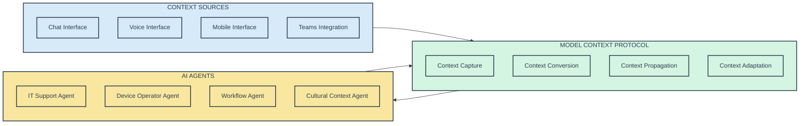

## 3. Enhanced Database Architecture Overview

### 3.1 Four-Pillar Database Structure

The database architecture is organized around the four strategic pillars of the v16 platform:

```mermaid
flowchart TD
    subgraph OUI["OMNI-CHANNEL UNIVERSAL INTERFACE"]
        subgraph UIDB["UI STATE DATABASE"]
            UIS[UserInterfaceState]
            MIS[MultiModalInteractionSession]
            DCS[DeviceChannelState]
            PES[PersonalizationEngineState]
        end
    end
    
    subgraph MLS["MULTI-LINGUAL SUPPORT PLATFORM"]
        subgraph CCDB["CULTURAL CONTEXT DATABASE"]
            CCP[CulturalContextProfile]
            LLP[LanguageLocalizationProfile]
            CCM[CulturalCommunicationModel]
            RCP[RegionalComplianceProfile]
            TZI[TimeZoneIntelligence]
        end
    end
    
    subgraph NC["NEURAL CORE"]
        subgraph USPDB["USER SEMANTIC PROFILE DATABASE"]
            DUP[DistributedUserProfile]
            USP[UserSemanticProfile]
            EF[EntityFamiliarity]
            UKN[UserKnowledgeNode]
        end
        
        subgraph CMDB["CONVERSATION MEMORY DATABASE"]
            CS[ConversationSession]
            CCM2[ContextualCrossSessionMemory]
            SM[SemanticMemory]
            EM[EpisodicMemory]
        end
    end
    
    subgraph AAO["AGENTIC AI ORCHESTRATION"]
        subgraph CODB["COALITION DATABASE"]
            AF[AgentFormation]
            TRM[TrustReputationMatrix]
            CAH[CollaborationHistory]
            CGM[CoalitionGovernanceModel]
        end
        
        subgraph WFDB["WORKFLOW STATE DATABASE"]
            DWD[DistributedWorkflowDefinition]
            DWI[DistributedWorkflowInstance]
            DTE[DistributedTaskExecution]
            CP[CoalitionParticipation]
        end
    end
    
    subgraph SHARED["SHARED INFRASTRUCTURE"]
        subgraph SCDB["SECURITY & COMPLIANCE DATABASE"]
            DP[DevicePassport]
            GCP[GDPRComplianceProfile]
            SAL[SecurityAuditLog]
            ECR[EuropeanComplianceRecord]
        end
        
        subgraph KGB["KNOWLEDGE GRAPH DATABASE"]
            CKG[CulturalKnowledgeGraph]
            OKG[OrganizationalKnowledgeGraph]
            TKG[TechnicalKnowledgeGraph]
            IKG[IntegratedKnowledgeGraph]
        end
    end
    
    classDef oui fill:#E8F6F3,stroke:#2C3E50,stroke-width:2px,color:#2C3E50
    classDef mls fill:#EBF5FB,stroke:#2C3E50,stroke-width:2px,color:#2C3E50
    classDef nc fill:#FEF9E7,stroke:#2C3E50,stroke-width:2px,color:#2C3E50
    classDef aao fill:#FDEDEC,stroke:#2C3E50,stroke-width:2px,color:#2C3E50
    classDef shared fill:#F4F6F7,stroke:#2C3E50,stroke-width:2px,color:#2C3E50
    
    class OUI,UIDB,UIS,MIS,DCS,PES oui
    class MLS,CCDB,CCP,LLP,CCM,RCP,TZI mls
    class NC,USPDB,DUP,USP,EF,UKN,CMDB,CS,CCM2,SM,EM nc
    class AAO,CODB,AF,TRM,CAH,CGM,WFDB,DWD,DWI,DTE,CP aao
    class SHARED,SCDB,DP,GCP,SAL,ECR,KGB,CKG,OKG,TKG,IKG shared
```

## 4. Cultural Context Database (NEW in v16)

### 4.1 Cultural Context Architecture

The Cultural Context Database represents the most significant addition in v16, supporting the Multi-Lingual Support Platform pillar.

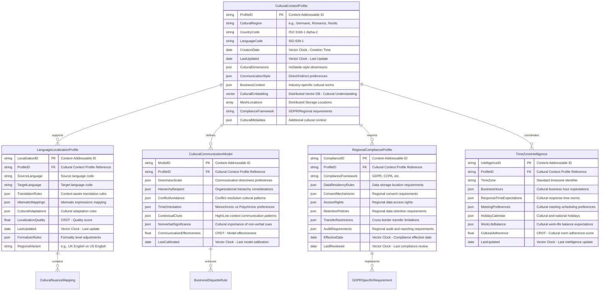

### 4.2 Cultural Intelligence Implementation

The cultural context system provides sophisticated cultural adaptation capabilities:

```mermaid
flowchart TD
    subgraph CI["CULTURAL INTELLIGENCE PIPELINE"]
        subgraph CD["CULTURAL DETECTION"]
            LD[Language Detection]
            RD[Regional Detection]
            CD2[Cultural Cue Detection]
            BD[Business Context Detection]
        end
        
        subgraph CA["CULTURAL ANALYSIS"]
            CS[Communication Style Analysis]
            CC[Cultural Competency Assessment]
            EE[Etiquette Expectation Mapping]
            CN[Cultural Norm Identification]
        end
        
        subgraph CAD["CULTURAL ADAPTATION"]
            TA[Tone Adaptation]
            MA[Message Adaptation]
            FA[Formality Adaptation]
            RA[Response Adaptation]
        end
        
        subgraph CV["CULTURAL VALIDATION"]
            EV[Effectiveness Validation]
            FB[Feedback Integration]
            CL[Continuous Learning]
            QA[Quality Assurance]
        end
    end
    
    CD --> CA
    CA --> CAD
    CAD --> CV
    CV --> CD
    
    classDef detection fill:#E8F6F3,stroke:#2C3E50,stroke-width:2px,color:#2C3E50
    classDef analysis fill:#EBF5FB,stroke:#2C3E50,stroke-width:2px,color:#2C3E50
    classDef adaptation fill:#FEF9E7,stroke:#2C3E50,stroke-width:2px,color:#2C3E50
    classDef validation fill:#FDEDEC,stroke:#2C3E50,stroke-width:2px,color:#2C3E50
    
    class CD,LD,RD,CD2,BD detection
    class CA,CS,CC,EE,CN analysis
    class CAD,TA,MA,FA,RA adaptation
    class CV,EV,FB,CL,QA validation
```

## 5. Enhanced User Semantic Profile Database

### 5.1 System of Context User Profiles

The User Semantic Profile Database has been enhanced to support comprehensive context accumulation and cultural adaptation:

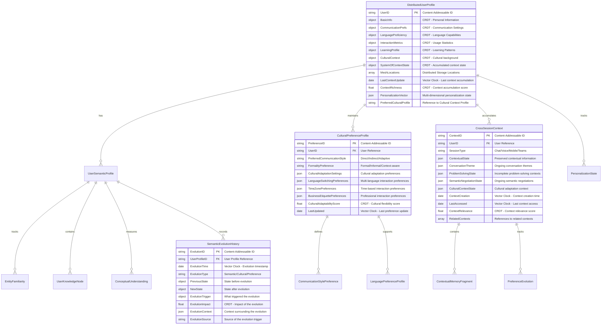

## 6. Enhanced Conversation Memory Database

### 6.1 Cross-Session Context Preservation

The Conversation Memory Database now supports sophisticated cross-session context preservation:

## 7. Coalition and Trust Database (NEW in v16)

### 7.1 Enhanced Agent Collaboration Architecture

The Coalition Database supports sophisticated agent collaboration with trust and reputation mechanisms:

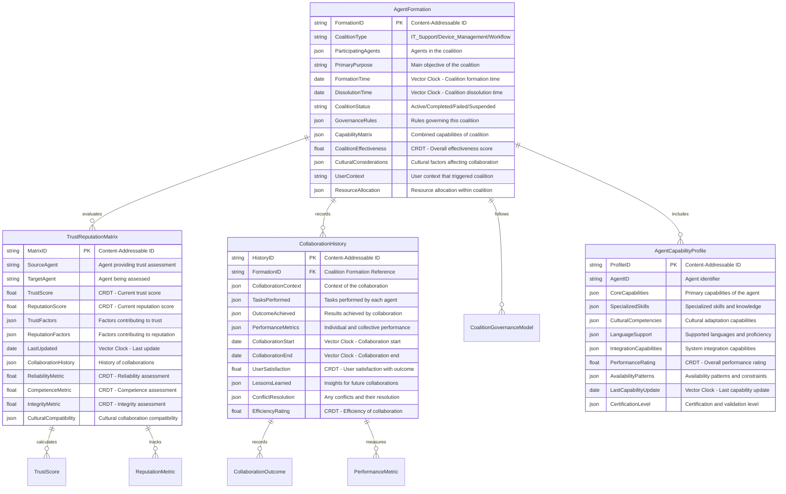

## 8. European Compliance and Security Database

### 8.1 Enhanced GDPR and Regional Compliance

The Security & Compliance Database has been significantly enhanced for European market requirements:

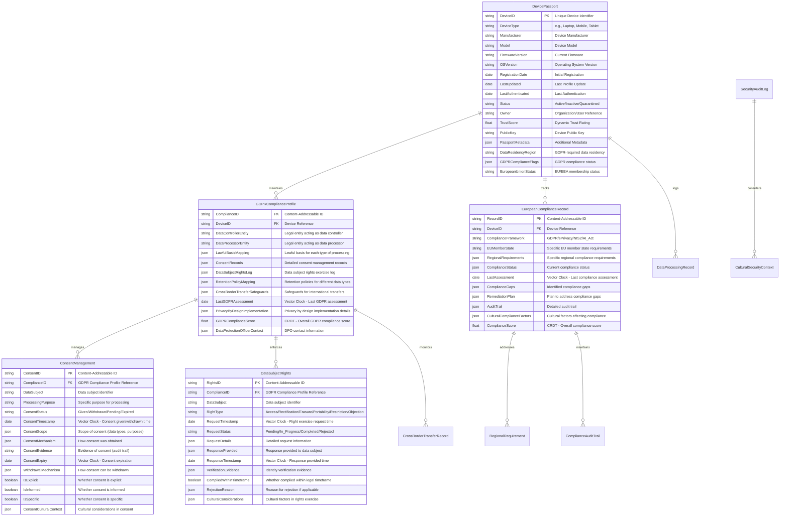

## 9. Enhanced Knowledge Graph Database

### 9.1 Cultural and Contextual Knowledge Integration

The Knowledge Graph Database now incorporates cultural intelligence and contextual understanding:

```mermaid
erDiagram
    CulturalKnowledgeGraph ||--o{ CulturalConcept : contains
    CulturalKnowledgeGraph ||--o{ CulturalRelationship : defines
    CulturalKnowledgeGraph ||--o{ CulturalNorm : maintains
    
    OrganizationalKnowledgeGraph ||--o{ OrganizationalEntity : includes
    OrganizationalKnowledgeGraph ||--o{ ProcessKnowledge : captures
    OrganizationalKnowledgeGraph ||--o{ CulturalOrganizationalNorm : enforces
    
    TechnicalKnowledgeGraph ||--o{ TechnicalConcept : contains
    TechnicalKnowledgeGraph ||--o{ TechnicalRelationship : defines
    TechnicalKnowledgeGraph ||--o{ CulturalTechnicalAdaptation : supports
    
    IntegratedKnowledgeGraph ||--o{ CrossDomainRelationship : bridges
    IntegratedKnowledgeGraph ||--o{ ContextualKnowledgeCluster : organizes
    
    CulturalKnowledgeGraph {
        string GraphID PK "Content-Addressable ID"
        string CulturalDomain "Germanic/Romance/Nordic/Asian/etc"
        json GraphMetadata "Cultural knowledge graph metadata"
        date LastUpdated "Vector Clock - Last graph update"
        float CulturalCoverage "CRDT - Cultural coverage completeness"
        json CulturalDimensions "Cultural dimension mappings"
        array SupportedRegions "Regions covered by this graph"
        json ValidationSources "Sources used for cultural validation"
        string GraphVersion "Cultural knowledge graph version"
    }
    
    CulturalConcept {
        string ConceptID PK "Content-Addressable ID"
        string GraphID FK "Cultural Knowledge Graph Reference"
        string ConceptName "Cultural concept name"
        json ConceptDefinition "Detailed concept definition"
        json CulturalContext "Cultural context for the concept"
        json RegionalVariations "Regional variations of the concept"
        vector ConceptEmbedding "Distributed Vector DB - Concept representation"
        json BusinessImplications "Business implications of the concept"
        json CommunicationImpact "Impact on communication patterns"
        float ConceptImportance "CRDT - Importance of concept in culture"
        json RelatedConcepts "Related cultural concepts"
        date LastValidated "Vector Clock - Last cultural validation"
    }
    
    CulturalNorm {
        string NormID PK "Content-Addressable ID"
        string GraphID FK "Cultural Knowledge Graph Reference"
        string NormType "Communication/Business/Social/Technical"
        string NormDescription "Detailed norm description"
        json ApplicabilityContext "When and where norm applies"
        json ExpectedBehavior "Expected behavior according to norm"
        json ViolationConsequences "Consequences of norm violation"
        float NormStrength "CRDT - Strength of cultural norm"
        json RegionalVariations "Regional variations in norm"
        json BusinessContext "Business context for norm application"
        date LastUpdated "Vector Clock - Last norm update"
    }
    
    CulturalOrganizationalNorm {
        string OrgNormID PK "Content-Addressable ID"
        string OrganizationID "Organization Reference"
        string CulturalNormID FK "Cultural Norm Reference"
        json OrganizationalAdaptation "How organization adapts cultural norm"
        json ImplementationGuidelines "Implementation guidelines"
        json ComplianceExpectations "Compliance expectations"
        float AdoptionLevel "CRDT - Level of organizational adoption"
        json TrainingRequirements "Training requirements for norm"
        date ImplementationDate "Vector Clock - Implementation date"
        json MonitoringMechanisms "How compliance is monitored"
    }
    
    ContextualKnowledgeCluster {
        string ClusterID PK "Content-Addressable ID"
        string ClusterType "Problem/Domain/Cultural/Temporal"
        json ClusterContent "Knowledge contained in cluster"
        json ContextualTriggers "Context that activates cluster"
        json KnowledgeRelationships "Relationships within cluster"
        vector ClusterEmbedding "Distributed Vector DB - Cluster representation"
        float ClusterRelevance "CRDT - Current relevance of cluster"
        date LastAccessed "Vector Clock - Last cluster access"
        json CulturalContext "Cultural context of knowledge cluster"
        array RelatedClusters "Related knowledge clusters"
    }
```

## 10. Key Data Flows and Functional Processes

### 10.1 Cultural Context-Aware Conversation Flow

This enhanced flow demonstrates how cultural intelligence integrates throughout the conversation process:

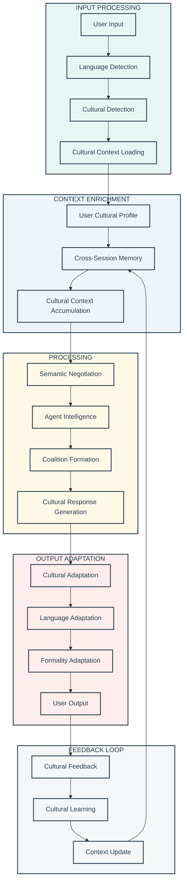

### 10.2 Cross-Session Context Preservation Flow

This flow shows how context accumulates and persists across multiple sessions:

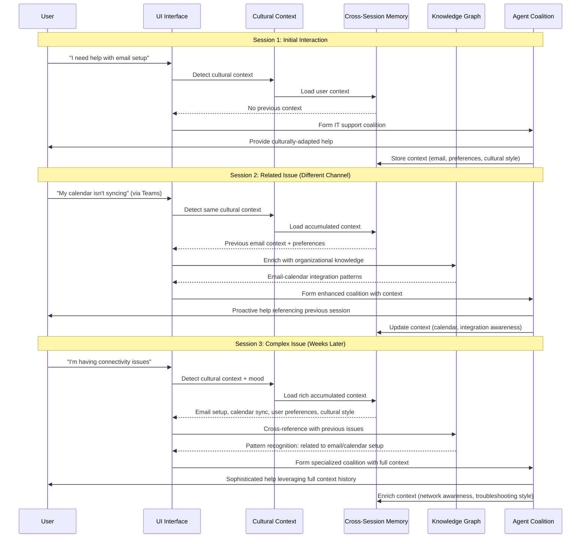

### 10.3 Cultural Intelligence Evolution Flow

This flow demonstrates how the system learns and evolves cultural understanding:

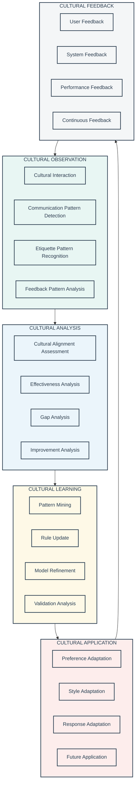

## 11. Implementation Roadmap and Migration Strategy

### 11.1 V16 Database Implementation Timeline

The implementation follows a structured approach to deliver the System of Context capabilities:

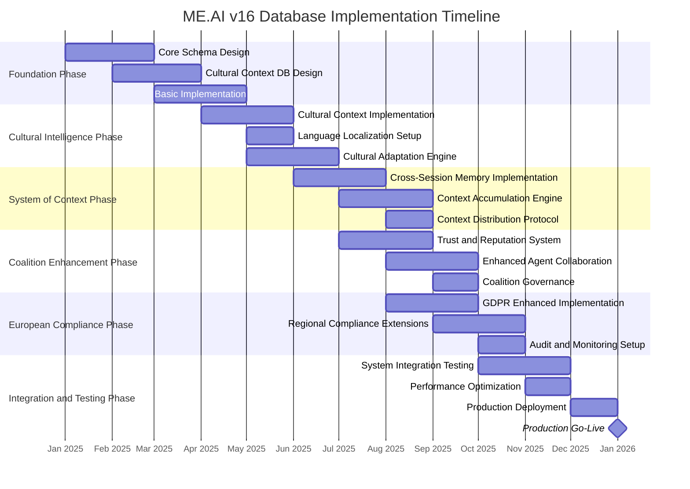

### 11.2 Migration Strategy from Previous Versions

The migration from previous architecture versions to v16 requires careful planning to preserve existing data while adding new capabilities:

```mermaid
flowchart TD
    subgraph ASSESS["ASSESSMENT PHASE"]
        DA[Data Assessment]
        SA[Schema Analysis]
        IA[Integration Analysis]
        RA[Risk Analysis]
    end
    
    subgraph PREP["PREPARATION PHASE"]
        SM[Schema Migration Scripts]
        DM[Data Migration Tools]
        TM[Testing Migration Procedures]
        BM[Backup and Recovery Plans]
    end
    
    subgraph EXEC["EXECUTION PHASE"]
        BD[Base Data Migration]
        CD[Cultural Data Integration]
        CSM[Cross-Session Memory Setup]
        CAD[Coalition Data Migration]
    end
    
    subgraph VAL["VALIDATION PHASE"]
        DV[Data Validation]
        FV[Functional Validation]
        PV[Performance Validation]
        CV[Cultural Validation]
    end
    
    subgraph OPT["OPTIMIZATION PHASE"]
        PO[Performance Optimization]
        CO[Cultural Optimization]
        IO[Integration Optimization]
        MO[Monitoring Optimization]
    end
    
    ASSESS --> PREP
    PREP --> EXEC
    EXEC --> VAL
    VAL --> OPT
    
    classDef assess fill:#E8F6F3,stroke:#2C3E50,stroke-width:2px,color:#2C3E50
    classDef prep fill:#EBF5FB,stroke:#2C3E50,stroke-width:2px,color:#2C3E50
    classDef exec fill:#FEF9E7,stroke:#2C3E50,stroke-width:2px,color:#2C3E50
    classDef val fill:#FDEDEC,stroke:#2C3E50,stroke-width:2px,color:#2C3E50
    classDef opt fill:#F4F6F7,stroke:#2C3E50,stroke-width:2px,color:#2C3E50
    
    class ASSESS,DA,SA,IA,RA assess
    class PREP,SM,DM,TM,BM prep
    class EXEC,BD,CD,CSM,CAD exec
    class VAL,DV,FV,PV,CV val
    class OPT,PO,CO,IO,MO opt
```

## 12. Operational Excellence and Monitoring

### 12.1 Cultural Intelligence Monitoring

The v16 architecture includes sophisticated monitoring capabilities for cultural intelligence effectiveness:

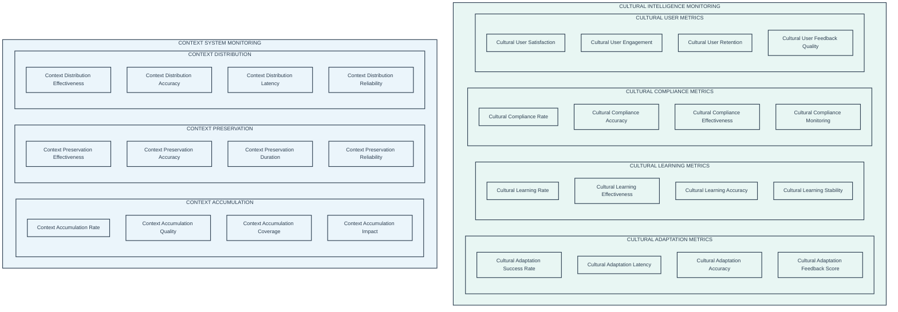

### 12.2 Performance and Scalability Considerations

The v16 architecture is designed for enterprise-scale deployment with sophisticated performance optimization:

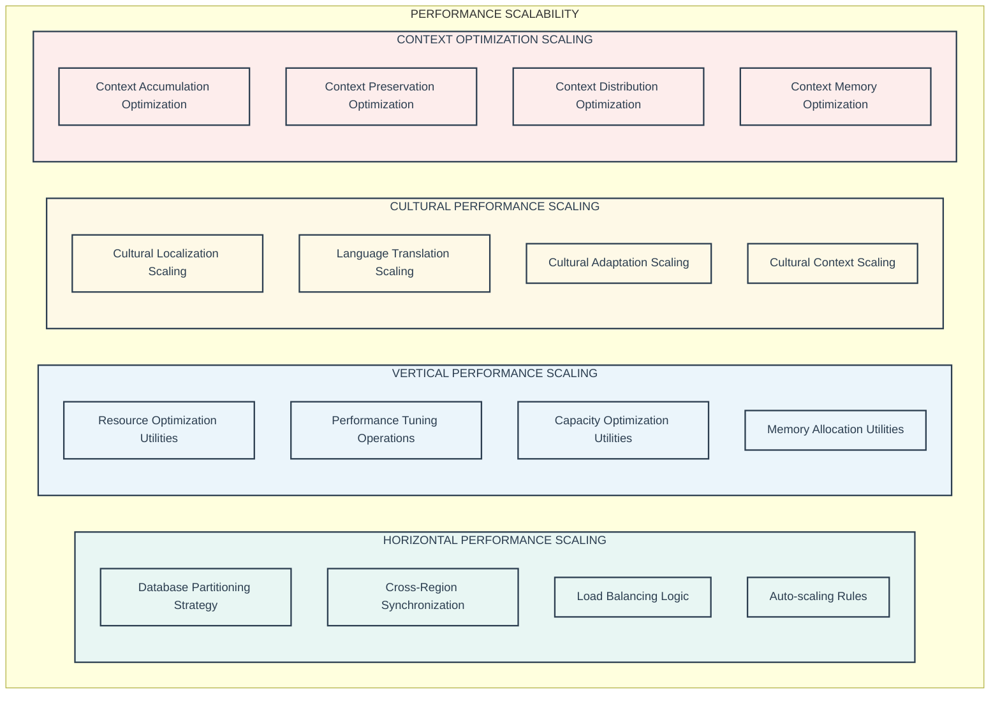

## 13. Security and Privacy Architecture

### 13.1 Enhanced Privacy-by-Design for Cultural Data

The v16 architecture implements sophisticated privacy protection for sensitive cultural and personal data:

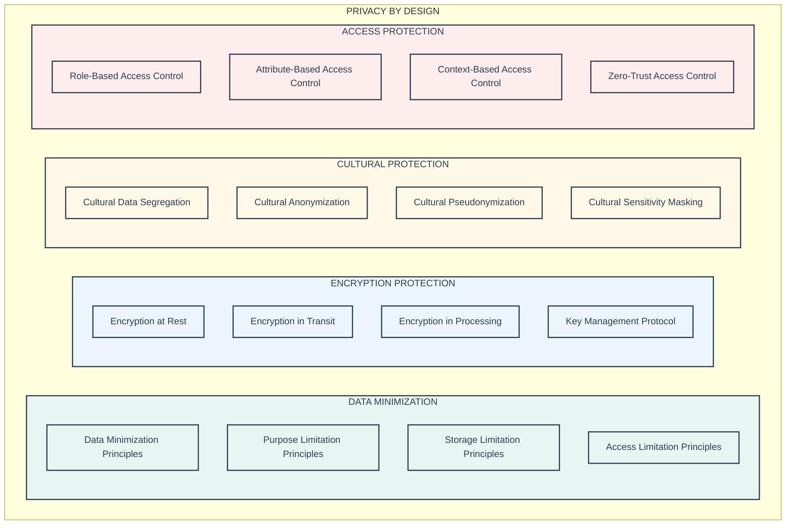

## 14. Conclusion

The ME.AI v16 Data Architecture represents a comprehensive evolution toward a System of Context that enables sophisticated cultural intelligence, enhanced user experience, and robust enterprise integration. The architecture successfully addresses the four strategic pillars while maintaining strict European compliance standards and providing measurable business value.

Key architectural achievements include:

**Cultural Intelligence Foundation**: The new Cultural Context Database and associated intelligence systems enable sophisticated multi-cultural communication and adaptation.

**System of Context Implementation**: Enhanced cross-session memory and context accumulation capabilities transform isolated interactions into continuous, evolving relationships.

**European Market Readiness**: Comprehensive GDPR compliance and regional adaptation capabilities position the platform for successful European deployment.

**Enhanced Agent Collaboration**: Trust and reputation mechanisms enable sophisticated coalition formation and collaborative problem-solving.

**Enterprise Integration**: Robust security, compliance, and integration capabilities ensure enterprise-grade deployment readiness.

This architecture provides the foundation for delivering transformative AI capabilities while respecting cultural diversity, ensuring regulatory compliance, and maintaining the highest standards of security and privacy protection.

The implementation roadmap ensures systematic delivery of capabilities while maintaining operational excellence and providing clear migration paths from previous versions. The result is a comprehensive, culturally-intelligent AI platform ready for enterprise deployment across diverse European markets.
