# ME.AI Data Architecture and Flows v16 - System of Context Edition

**Version:** 2.2.0  
**Date:** January 2025  
**Architecture Alignment:** ME.AI Neural Core Platform Architecture v16

## 1. Executive Summary

The ME.AI v16 Data Architecture represents a fundamental evolution toward a comprehensive **System of Context** that enables intelligent, empathetic, and culturally-aware AI interactions across enterprise environments. This architecture supports the four strategic pillars: **Omni-Channel Universal Interface**, **Multi-Lingual Support Platform**, **Neural Core**, and **Agentic AI Orchestration**.

The data architecture focuses on context accumulation, preservation, and distribution while maintaining strict European compliance standards (GDPR), cultural sensitivity, and enterprise security requirements.

## 2. System of Context Data Philosophy

### 2.1 Context Accumulation Architecture

The v16 data architecture is built around the principle that every interaction contributes to a growing, shared understanding that transcends individual conversations or sessions.

```mermaid
flowchart TD
    subgraph CAL["CONTEXT ACCUMULATION LAYERS"]
        subgraph IL["INTERACTION LAYER"]
            UI[User Interactions]
            DI[Device Interactions]
            SI[System Integrations]
            AI[Agent Interactions]
        end
        
        subgraph CL["CONTEXT LAYER"]
            UC[User Context]
            CC[Cultural Context]
            OC[Organizational Context]
            TC[Technical Context]
        end
        
        subgraph PL["PRESERVATION LAYER"]
            SM[Session Memory]
            LM[Long-term Memory]
            DM[Distributed Memory]
            CM[Cultural Memory]
        end
        
        subgraph DL["DISTRIBUTION LAYER"]
            CS[Context Sharing]
            CP[Context Propagation]
            CA[Context Adaptation]
            CT[Context Translation]
        end
    end
    
    IL --> CL
    CL --> PL
    PL --> DL
    DL --> IL
    
    classDef interaction fill:#E8F6F3,stroke:#2C3E50,stroke-width:2px,color:#2C3E50
    classDef context fill:#EBF5FB,stroke:#2C3E50,stroke-width:2px,color:#2C3E50
    classDef preservation fill:#FEF9E7,stroke:#2C3E50,stroke-width:2px,color:#2C3E50
    classDef distribution fill:#FDEDEC,stroke:#2C3E50,stroke-width:2px,color:#2C3E50
    
    class IL,UI,DI,SI,AI interaction
    class CL,UC,CC,OC,TC context
    class PL,SM,LM,DM,CM preservation
    class DL,CS,CP,CA,CT distribution
```

### 2.2 Context Distribution Through MCP

The Model Context Protocol ensures contextual understanding travels seamlessly across agents, channels, and sessions.

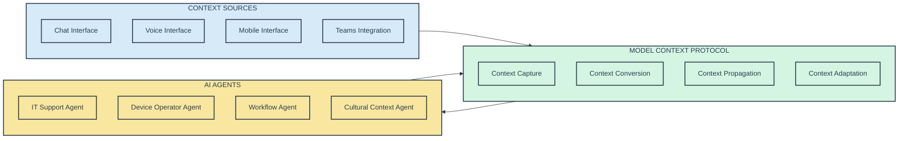

## 3. Enhanced Database Architecture Overview

### 3.1 Four-Pillar Database Structure

The database architecture is organized around the four strategic pillars of the v16 platform:

```mermaid
flowchart TD
    subgraph OUI["OMNI-CHANNEL UNIVERSAL INTERFACE"]
        subgraph UIDB["UI STATE DATABASE"]
            UIS[UserInterfaceState]
            MIS[MultiModalInteractionSession]
            DCS[DeviceChannelState]
            PES[PersonalizationEngineState]
        end
    end
    
    subgraph MLS["MULTI-LINGUAL SUPPORT PLATFORM"]
        subgraph CCDB["CULTURAL CONTEXT DATABASE"]
            CCP[CulturalContextProfile]
            LLP[LanguageLocalizationProfile]
            CCM[CulturalCommunicationModel]
            RCP[RegionalComplianceProfile]
            TZI[TimeZoneIntelligence]
        end
    end
    
    subgraph NC["NEURAL CORE"]
        subgraph USPDB["USER SEMANTIC PROFILE DATABASE"]
            DUP[DistributedUserProfile]
            USP[UserSemanticProfile]
            EF[EntityFamiliarity]
            UKN[UserKnowledgeNode]
        end
        
        subgraph CMDB["CONVERSATION MEMORY DATABASE"]
            CS[ConversationSession]
            CCM2[ContextualCrossSessionMemory]
            SM[SemanticMemory]
            EM[EpisodicMemory]
        end
    end
    
    subgraph AAO["AGENTIC AI ORCHESTRATION"]
        subgraph CODB["COALITION DATABASE"]
            AF[AgentFormation]
            TRM[TrustReputationMatrix]
            CAH[CollaborationHistory]
            CGM[CoalitionGovernanceModel]
        end
        
        subgraph WFDB["WORKFLOW STATE DATABASE"]
            DWD[DistributedWorkflowDefinition]
            DWI[DistributedWorkflowInstance]
            DTE[DistributedTaskExecution]
            CP[CoalitionParticipation]
        end
    end
    
    subgraph SHARED["SHARED INFRASTRUCTURE"]
        subgraph SCDB["SECURITY & COMPLIANCE DATABASE"]
            DP[DevicePassport]
            GCP[GDPRComplianceProfile]
            SAL[SecurityAuditLog]
            ECR[EuropeanComplianceRecord]
        end
        
        subgraph KGB["KNOWLEDGE GRAPH DATABASE"]
            CKG[CulturalKnowledgeGraph]
            OKG[OrganizationalKnowledgeGraph]
            TKG[TechnicalKnowledgeGraph]
            IKG[IntegratedKnowledgeGraph]
        end
    end
    
    classDef oui fill:#E8F6F3,stroke:#2C3E50,stroke-width:2px,color:#2C3E50
    classDef mls fill:#EBF5FB,stroke:#2C3E50,stroke-width:2px,color:#2C3E50
    classDef nc fill:#FEF9E7,stroke:#2C3E50,stroke-width:2px,color:#2C3E50
    classDef aao fill:#FDEDEC,stroke:#2C3E50,stroke-width:2px,color:#2C3E50
    classDef shared fill:#F4F6F7,stroke:#2C3E50,stroke-width:2px,color:#2C3E50
    
    class OUI,UIDB,UIS,MIS,DCS,PES oui
    class MLS,CCDB,CCP,LLP,CCM,RCP,TZI mls
    class NC,USPDB,DUP,USP,EF,UKN,CMDB,CS,CCM2,SM,EM nc
    class AAO,CODB,AF,TRM,CAH,CGM,WFDB,DWD,DWI,DTE,CP aao
    class SHARED,SCDB,DP,GCP,SAL,ECR,KGB,CKG,OKG,TKG,IKG shared
```

## 4. Cultural Context Database (NEW in v16)

### 4.1 Cultural Context Architecture

The Cultural Context Database represents the most significant addition in v16, supporting the Multi-Lingual Support Platform pillar.

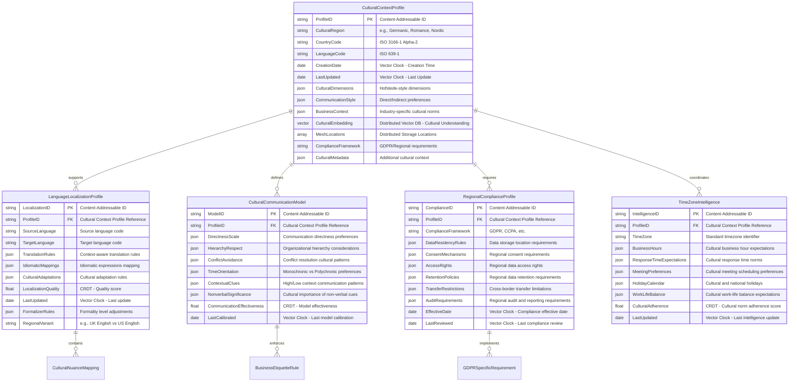

### 4.2 Cultural Intelligence Implementation

The cultural context system provides sophisticated cultural adaptation capabilities:

```mermaid
flowchart TD
    subgraph CI["CULTURAL INTELLIGENCE PIPELINE"]
        subgraph CD["CULTURAL DETECTION"]
            LD[Language Detection]
            RD[Regional Detection]
            CD2[Cultural Cue Detection]
            BD[Business Context Detection]
        end
        
        subgraph CA["CULTURAL ANALYSIS"]
            CS[Communication Style Analysis]
            CC[Cultural Competency Assessment]
            EE[Etiquette Expectation Mapping]
            CN[Cultural Norm Identification]
        end
        
        subgraph CAD["CULTURAL ADAPTATION"]
            TA[Tone Adaptation]
            MA[Message Adaptation]
            FA[Formality Adaptation]
            RA[Response Adaptation]
        end
        
        subgraph CV["CULTURAL VALIDATION"]
            EV[Effectiveness Validation]
            FB[Feedback Integration]
            CL[Continuous Learning]
            QA[Quality Assurance]
        end
    end
    
    CD --> CA
    CA --> CAD
    CAD --> CV
    CV --> CD
    
    classDef detection fill:#E8F6F3,stroke:#2C3E50,stroke-width:2px,color:#2C3E50
    classDef analysis fill:#EBF5FB,stroke:#2C3E50,stroke-width:2px,color:#2C3E50
    classDef adaptation fill:#FEF9E7,stroke:#2C3E50,stroke-width:2px,color:#2C3E50
    classDef validation fill:#FDEDEC,stroke:#2C3E50,stroke-width:2px,color:#2C3E50
    
    class CD,LD,RD,CD2,BD detection
    class CA,CS,CC,EE,CN analysis
    class CAD,TA,MA,FA,RA adaptation
    class CV,EV,FB,CL,QA validation
```

## 5. Enhanced User Semantic Profile Database

### 5.1 System of Context User Profiles

The User Semantic Profile Database has been enhanced to support comprehensive context accumulation and cultural adaptation:

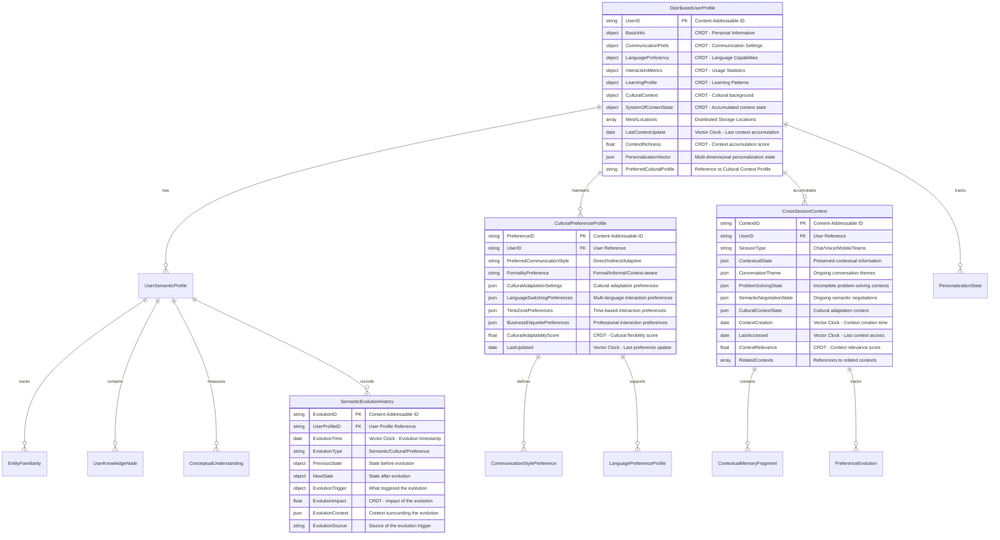

## 6. Enhanced Conversation Memory Database

### 6.1 Cross-Session Context Preservation

The Conversation Memory Database now supports sophisticated cross-session context preservation:

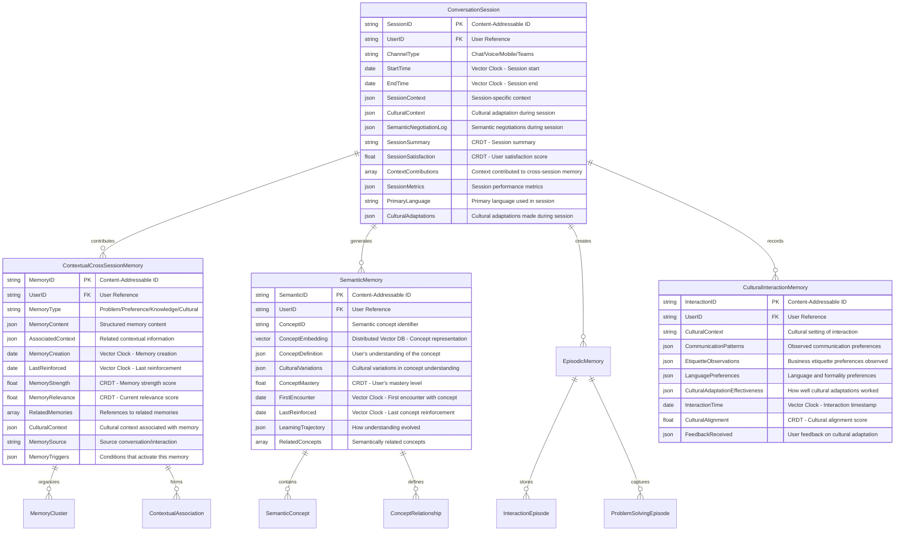

## 7. Coalition and Trust Database (NEW in v16)

### 7.1 Enhanced Agent Collaboration Architecture

The Coalition Database supports sophisticated agent collaboration with trust and reputation mechanisms:

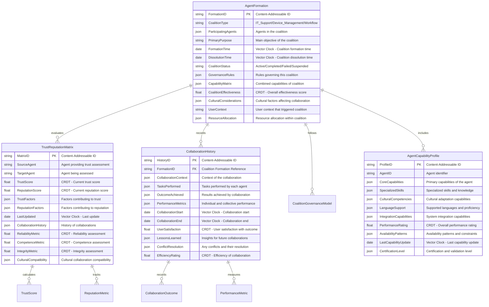

## 8. European Compliance and Security Database

### 8.1 Enhanced GDPR and Regional Compliance

The Security & Compliance Database has been significantly enhanced for European market requirements:


## 9. Enhanced Knowledge Graph Database

### 9.1 Cultural and Contextual Knowledge Integration

The Knowledge Graph Database now incorporates cultural intelligence and contextual understanding:

```mermaid
erDiagram
    CulturalKnowledgeGraph ||--o{ CulturalConcept : contains
    CulturalKnowledgeGraph ||--o{ CulturalRelationship : defines
    CulturalKnowledgeGraph ||--o{ CulturalNorm : maintains
    
    OrganizationalKnowledgeGraph ||--o{ OrganizationalEntity : includes
    OrganizationalKnowledgeGraph ||--o{ ProcessKnowledge : captures
    OrganizationalKnowledgeGraph ||--o{ CulturalOrganizationalNorm : enforces
    
    TechnicalKnowledgeGraph ||--o{ TechnicalConcept : contains
    TechnicalKnowledgeGraph ||--o{ TechnicalRelationship : defines
    TechnicalKnowledgeGraph ||--o{ CulturalTechnicalAdaptation : supports
    
    IntegratedKnowledgeGraph ||--o{ CrossDomainRelationship : bridges
    IntegratedKnowledgeGraph ||--o{ ContextualKnowledgeCluster : organizes
    
    CulturalKnowledgeGraph {
        string GraphID PK "Content-Addressable ID"
        string CulturalDomain "Germanic/Romance/Nordic/Asian/etc"
        json GraphMetadata "Cultural knowledge graph metadata"
        date LastUpdated "Vector Clock - Last graph update"
        float CulturalCoverage "CRDT - Cultural coverage completeness"
        json CulturalDimensions "Cultural dimension mappings"
        array SupportedRegions "Regions covered by this graph"
        json ValidationSources "Sources used for cultural validation"
        string GraphVersion "Cultural knowledge graph version"
    }
    
    CulturalConcept {
        string ConceptID PK "Content-Addressable ID"
        string GraphID FK "Cultural Knowledge Graph Reference"
        string ConceptName "Cultural concept name"
        json ConceptDefinition "Detailed concept definition"
        json CulturalContext "Cultural context for the concept"
        json RegionalVariations "Regional variations of the concept"
        vector ConceptEmbedding "Distributed Vector DB - Concept representation"
        json BusinessImplications "Business implications of the concept"
        json CommunicationImpact "Impact on communication patterns"
        float ConceptImportance "CRDT - Importance of concept in culture"
        json RelatedConcepts "Related cultural concepts"
        date LastValidated "Vector Clock - Last cultural validation"
    }
    
    CulturalNorm {
        string NormID PK "Content-Addressable ID"
        string GraphID FK "Cultural Knowledge Graph Reference"
        string NormType "Communication/Business/Social/Technical"
        string NormDescription "Detailed norm description"
        json ApplicabilityContext "When and where norm applies"
        json ExpectedBehavior "Expected behavior according to norm"
        json ViolationConsequences "Consequences of norm violation"
        float NormStrength "CRDT - Strength of cultural norm"
        json RegionalVariations "Regional variations in norm"
        json BusinessContext "Business context for norm application"
        date LastUpdated "Vector Clock - Last norm update"
    }
    
    CulturalOrganizationalNorm {
        string OrgNormID PK "Content-Addressable ID"
        string OrganizationID "Organization Reference"
        string CulturalNormID FK "Cultural Norm Reference"
        json OrganizationalAdaptation "How organization adapts cultural norm"
        json ImplementationGuidelines "Implementation guidelines"
        json ComplianceExpectations "Compliance expectations"
        float AdoptionLevel "CRDT - Level of organizational adoption"
        json TrainingRequirements "Training requirements for norm"
        date ImplementationDate "Vector Clock - Implementation date"
        json MonitoringMechanisms "How compliance is monitored"
    }
    
    ContextualKnowledgeCluster {
        string ClusterID PK "Content-Addressable ID"
        string ClusterType "Problem/Domain/Cultural/Temporal"
        json ClusterContent "Knowledge contained in cluster"
        json ContextualTriggers "Context that activates cluster"
        json KnowledgeRelationships "Relationships within cluster"
        vector ClusterEmbedding "Distributed Vector DB - Cluster representation"
        float ClusterRelevance "CRDT - Current relevance of cluster"
        date LastAccessed "Vector Clock - Last cluster access"
        json CulturalContext "Cultural context of knowledge cluster"
        array RelatedClusters "Related knowledge clusters"
    }
```

## 10. IT Support MVP Detailed Data Flows

The IT Support MVP focuses on four primary use cases as defined in the implementation strategy, now enhanced with v16 cultural intelligence and System of Context capabilities:

1. **Password Reset Automation** - Enhanced with cultural adaptation and cross-session context
2. **Account Unlock Automation** - Enhanced with cultural security verification and context preservation
3. **Basic Software Installation** - Enhanced with cultural guidance and multi-language support
4. **Basic Device Authentication & Diagnostics** - Enhanced with cultural compliance and regional requirements

### 10.1 Conversation-Based Data Flow - Password Reset Automation

This use case enables self-service password reset for common systems with cultural adaptation, identity verification, and success confirmation through a conversational interface that preserves context across sessions.

#### 10.1.1 Enhanced Conversation Flow Overview

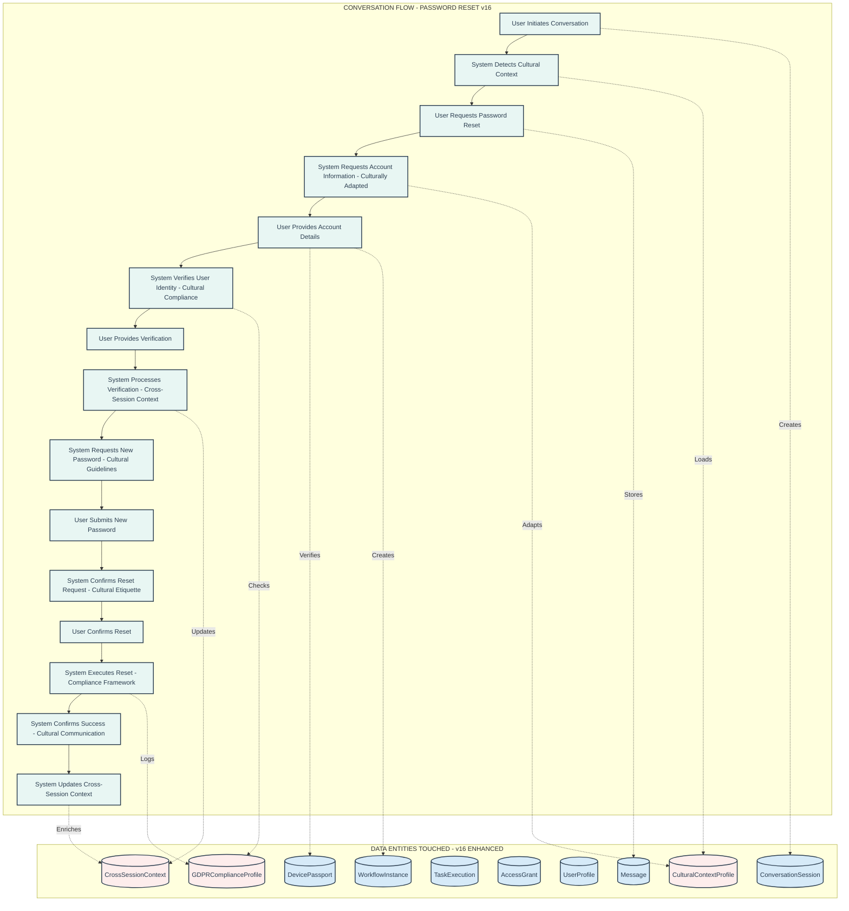

#### 10.1.2 Enhanced Detailed Data Flow with Cultural Intelligence

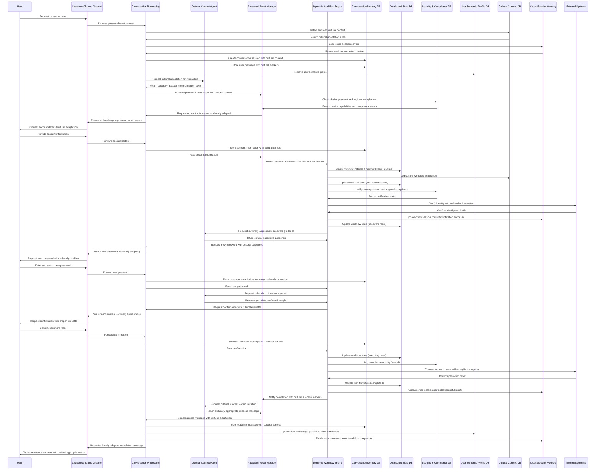

#### 10.1.3 Database Operations for Password Reset with Cultural Enhancement

| Step | Conversation Stage | Database | Operation | Description |
|------|-------------------|----------|-----------|-------------|
| 1 | Conversation Initiation | CMDB | Insert | Create `ConversationSession` with cultural context markers |
| 2 | Cultural Context Loading | CCDB | Select | Retrieve `CulturalContextProfile` for user adaptation |
| 3 | Cross-Session Context | CSM | Select | Load `CrossSessionContext` for continuity |
| 4 | Password Reset Request | CMDB | Insert | Store initial `Message` with cultural markers |
| 5 | Password Reset Request | USPDB | Select | Retrieve `UserSemanticProfile` for personalized interaction |
| 6 | Cultural Adaptation | CCDB | Select | Retrieve cultural communication patterns |
| 7 | Device Verification | SCDB | Select | Verify `DevicePassport` with regional compliance |
| 8 | Workflow Creation | DSDB | Insert | Create `DistributedWorkflowInstance` with cultural context |
| 9 | Identity Verification | SCDB | Insert | Create `SecurityAudit` record with cultural compliance |
| 10 | Identity Verification | DSDB | Update | Update workflow state to identity verification |
| 11 | Verification Storage | CMDB | Insert | Store verification request `Message` with cultural adaptation |
| 12 | Verification Response | CMDB | Insert | Store user verification response with cultural context |
| 13 | Context Update | CSM | Update | Update `CrossSessionContext` with verification progress |
| 14 | Verification Processing | DSDB | Update | Update workflow state to verification processing |
| 15 | Cultural Password Guidelines | CCDB | Select | Retrieve cultural password requirements |
| 16 | Password Entry Request | DSDB | Update | Update workflow state to password reset execution |
| 17 | Password Entry | CMDB | Insert | Store password submission with cultural security |
| 18 | Cultural Confirmation | CCDB | Select | Retrieve cultural confirmation etiquette |
| 19 | Reset Confirmation | CMDB | Insert | Store confirmation request with cultural appropriateness |
| 20 | Reset Confirmation | CMDB | Insert | Store user confirmation with cultural context |
| 21 | Reset Execution | DSDB | Update | Update workflow state to executing reset |
| 22 | Compliance Logging | SCDB | Insert | Log compliance activity in `GDPRComplianceProfile` |
| 23 | Reset Completion | DSDB | Update | Update workflow state to completed |
| 24 | Cultural Success Message | CCDB | Select | Retrieve cultural success communication patterns |
| 25 | Reset Completion | CMDB | Insert | Store outcome `Message` with cultural success markers |
| 26 | Knowledge Update | USPDB | Update | Update `EntityFamiliarity` for password reset concepts |
| 27 | Context Enrichment | CSM | Update | Enrich `CrossSessionContext` with successful completion |
| 28 | Reset Completion | DSDB | Insert | Create `DistributedEvent` for successful completion with cultural logging |

### 10.2 Conversation-Based Data Flow - Account Unlock Automation

This use case enables self-service account unlock with cultural security verification, regional compliance, and access restoration through a conversational interface that maintains cross-session context.

#### 10.2.1 Enhanced Account Unlock Flow

```mermaid
flowchart TD
    subgraph CF["CONVERSATION FLOW - ACCOUNT UNLOCK v16"]
        I1[User Initiates Conversation] --> I2[System Detects Cultural Context]
        I2 --> I3[User Requests Account Unlock]
        I3 --> I4[System Requests Account Information - Culturally Adapted]
        I4 --> I5[User Provides Account Details]
        I5 --> I6[System Performs Cultural Security Verification]
        I6 --> I7[User Provides Cultural-Appropriate Verification]
        I7 --> I8[System Processes Verification - Regional Compliance]
        I8 --> I9[System Confirms Unlock Request - Cultural Etiquette]
        I9 --> I10[User Confirms Unlock]
        I10 --> I11[System Executes Unlock - Compliance Framework]
        I11 --> I12[System Confirms Success - Cultural Communication]
        I12 --> I13[System Updates Cross-Session Security Context]
    end
    
    classDef convStep fill:#E8F6F3,stroke:#2C3E50,stroke-width:2px,color:#2C3E50
    class I1,I2,I3,I4,I5,I6,I7,I8,I9,I10,I11,I12,I13 convStep
```

#### 10.2.2 Database Operations for Account Unlock with Cultural Enhancement

| Step | Conversation Stage | Database | Operation | Description |
|------|-------------------|----------|-----------|-------------|
| 1 | Conversation Initiation | CMDB | Insert | Create `ConversationSession` with cultural security context |
| 2 | Cultural Context Loading | CCDB | Select | Retrieve `CulturalContextProfile` for security adaptation |
| 3 | Cross-Session Security Context | CSM | Select | Load security-related `CrossSessionContext` |
| 4 | Account Unlock Request | CMDB | Insert | Store initial `Message` with cultural security markers |
| 5 | Account Unlock Request | USPDB | Select | Retrieve `UserSemanticProfile` for security personalization |
| 6 | Cultural Security Adaptation | CCDB | Select | Retrieve cultural security verification patterns |
| 7 | Account Unlock Request | DSDB | Insert | Create `DistributedWorkflowInstance` for account unlock with cultural context |
| 8 | Security Verification | SCDB | Select | Verify `DevicePassport` and `DeviceAttestation` with regional compliance |
| 9 | Cultural Security Check | CCDB | Select | Retrieve cultural security verification requirements |
| 10 | Security Verification | DSDB | Update | Update workflow state to cultural security verification |
| 11 | Security Verification | CMDB | Insert | Store verification request with cultural security adaptation |
| 12 | Verification Response | CMDB | Insert | Store user verification response with cultural context |
| 13 | Regional Compliance Check | SCDB | Select | Verify regional compliance requirements |
| 14 | Verification Processing | DSDB | Update | Update workflow state to verification processing |
| 15 | Cultural Unlock Confirmation | CCDB | Select | Retrieve cultural unlock confirmation etiquette |
| 16 | Unlock Confirmation | DSDB | Update | Update workflow state to account unlock execution |
| 17 | Unlock Confirmation | CMDB | Insert | Store confirmation request with cultural appropriateness |
| 18 | Unlock Confirmation | CMDB | Insert | Store user confirmation with cultural context |
| 19 | Unlock Execution | DSDB | Update | Update workflow state to executing unlock |
| 20 | Compliance Logging | SCDB | Insert | Log security compliance activity |
| 21 | Unlock Completion | DSDB | Update | Update workflow state to completed |
| 22 | Cultural Success Communication | CCDB | Select | Retrieve cultural success communication patterns |
| 23 | Unlock Completion | CMDB | Insert | Store outcome `Message` with cultural success markers |
| 24 | Knowledge Update | USPDB | Update | Update `EntityFamiliarity` for account unlock concepts |
| 25 | Security Context Update | CSM | Update | Update cross-session security context |
| 26 | Unlock Completion | DSDB | Insert | Create `DistributedEvent` for successful completion |
| 27 | Unlock Completion | SCDB | Insert | Create `AccessGrant` for restored access with cultural logging |

### 10.3 Conversation-Based Data Flow - Basic Software Installation

This use case provides culturally-adapted guidance for common application installation and deployment automation through a conversational interface with multi-language support.

#### 10.3.1 Enhanced Software Installation Flow

```mermaid
flowchart TD
    subgraph CF["CONVERSATION FLOW - SOFTWARE INSTALLATION v16"]
        I1[User Initiates Conversation] --> I2[System Detects Cultural & Language Context]
        I2 --> I3[User Requests Software Installation]
        I3 --> I4[System Presents Cultural Software Options]
        I4 --> I5[User Selects Software - Cultural Preferences]
        I5 --> I6[System Checks Eligibility - Regional Compliance]
        I6 --> I7[System Provides Cultural Installation Guidance]
        I7 --> I8[User Confirms Installation - Cultural Communication]
        I8 --> I9[System Executes Installation - Multi-Language Support]
        I9 --> I10[System Provides Cultural Progress Updates]
        I10 --> I11[System Verifies Installation - Cultural Validation]
        I11 --> I12[System Updates Cross-Session Software Context]
    end
    
    classDef convStep fill:#E8F6F3,stroke:#2C3E50,stroke-width:2px,color:#2C3E50
    class I1,I2,I3,I4,I5,I6,I7,I8,I9,I10,I11,I12 convStep
```

#### 10.3.2 Enhanced Detailed Software Installation Data Flow

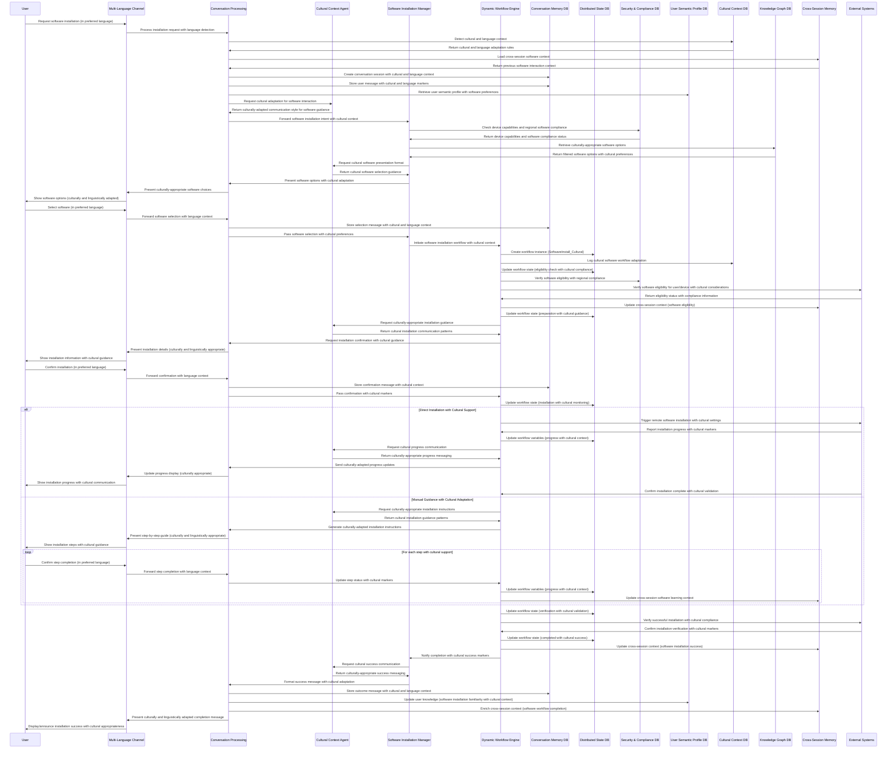

#### 10.3.3 Database Operations for Software Installation with Cultural Enhancement

| Step | Conversation Stage | Database | Operation | Description |
|------|-------------------|----------|-----------|-------------|
| 1 | Conversation Initiation | CMDB | Insert | Create `ConversationSession` with cultural and language context |
| 2 | Cultural & Language Context | CCDB | Select | Retrieve `CulturalContextProfile` and `LanguageLocalizationProfile` |
| 3 | Cross-Session Software Context | CSM | Select | Load software-related `CrossSessionContext` |
| 4 | Software Installation Request | CMDB | Insert | Store initial `Message` with cultural and language markers |
| 5 | Software Installation Request | USPDB | Select | Retrieve `UserSemanticProfile` with software preferences |
| 6 | Cultural Software Adaptation | CCDB | Select | Retrieve cultural software guidance patterns |
| 7 | Device Capability Check | SCDB | Select | Check `DeviceCapability` with regional software compliance |
| 8 | Cultural Software Options | KGDB | Select | Retrieve culturally-appropriate software from `KnowledgeNode` |
| 9 | Software Selection | CMDB | Insert | Store software selection with cultural and language context |
| 10 | Workflow Creation | DSDB | Insert | Create `DistributedWorkflowInstance` with cultural software context |
| 11 | Cultural Workflow Logging | CCDB | Insert | Log cultural software workflow adaptation |
| 12 | Eligibility Check | DSDB | Update | Update workflow state to eligibility check with cultural compliance |
| 13 | Regional Compliance Check | SCDB | Select | Verify regional software compliance requirements |
| 14 | Installation Preparation | DSDB | Update | Update workflow state to preparation with cultural guidance |
| 15 | Cultural Installation Guidance | CCDB | Select | Retrieve cultural installation communication patterns |
| 16 | Installation Confirmation | CMDB | Insert | Store installation confirmation with cultural appropriateness |
| 17 | Installation Confirmation | CMDB | Insert | Store user confirmation with cultural and language context |
| 18 | Installation Execution | DSDB | Update | Update workflow state to installation with cultural monitoring |
| 19 | Cultural Progress Updates | DSDB | Update | Update `DistributedVariable` for progress with cultural context |
| 20 | Progress Communication | CMDB | Insert | Store culturally-adapted progress updates |
| 21 | Cross-Session Learning | CSM | Update | Update software learning context across sessions |
| 22 | Installation Verification | DSDB | Update | Update workflow state to verification with cultural validation |
| 23 | Cultural Completion | DSDB | Update | Update workflow state to completed with cultural success |
| 24 | Cultural Success Communication | CCDB | Select | Retrieve cultural success communication patterns |
| 25 | Installation Completion | CMDB | Insert | Store outcome with cultural and language success markers |
| 26 | Knowledge Update | USPDB | Update | Update `EntityFamiliarity` with cultural software installation context |
| 27 | Context Enrichment | CSM | Update | Enrich cross-session software context |
| 28 | Installation Completion | DSDB | Insert | Create `DistributedEvent` for successful completion with cultural logging |

### 10.4 Conversation-Based Data Flow - Basic Device Authentication & Diagnostics

This use case enables secure device identification, verification, and basic hardware diagnostics through a conversational interface with cultural compliance and regional requirements.

#### 10.4.1 Enhanced Device Authentication & Diagnostics Flow

```mermaid
flowchart TD
    subgraph CF["CONVERSATION FLOW - DEVICE AUTH & DIAGNOSTICS v16"]
        I1[User Initiates Conversation] --> I2[System Detects Cultural & Regional Context]
        I2 --> I3[User Requests Device Diagnostics]
        I3 --> I4[System Performs Cultural Device Authentication]
        I4 --> I5[System Requests Diagnostic Permission - Cultural Etiquette]
        I5 --> I6[User Grants Permission - Cultural Communication]
        I6 --> I7[System Executes Diagnostics - Regional Compliance]
        I7 --> I8[System Analyzes Results - Cultural Interpretation]
        I8 --> I9[System Provides Cultural Recommendations]
        I9 --> I10[System Updates Cross-Session Device Context]
    end
    
    classDef convStep fill:#E8F6F3,stroke:#2C3E50,stroke-width:2px,color:#2C3E50
    class I1,I2,I3,I4,I5,I6,I7,I8,I9,I10 convStep
```

#### 10.4.2 Database Operations for Device Authentication & Diagnostics with Cultural Enhancement

| Step | Conversation Stage | Database | Operation | Description |
|------|-------------------|----------|-----------|-------------|
| 1 | Conversation Initiation | CMDB | Insert | Create `ConversationSession` with cultural and regional context |
| 2 | Cultural & Regional Context | CCDB | Select | Retrieve `CulturalContextProfile` and `RegionalComplianceProfile` |
| 3 | Cross-Session Device Context | CSM | Select | Load device-related `CrossSessionContext` |
| 4 | Device Diagnostics Request | CMDB | Insert | Store initial `Message` with cultural and regional markers |
| 5 | Device Diagnostics Request | USPDB | Select | Retrieve `UserSemanticProfile` with device preferences |
| 6 | Cultural Device Authentication | CCDB | Select | Retrieve cultural device authentication patterns |
| 7 | Device Authentication | SCDB | Select | Authenticate device using `DevicePassport` with regional compliance |
| 8 | Regional Compliance Check | SCDB | Select | Verify regional device compliance requirements |
| 9 | Cultural Security Audit | SCDB | Insert | Create `SecurityAudit` record with cultural compliance markers |
| 10 | Device Authentication Status | CMDB | Insert | Store authentication status with cultural context |
| 11 | Cultural Permission Request | CCDB | Select | Retrieve cultural diagnostic permission etiquette |
| 12 | Diagnostics Permission | CMDB | Insert | Store permission request with cultural appropriateness |
| 13 | Permission Grant | CMDB | Insert | Store user permission response with cultural context |
| 14 | Workflow Creation | DSDB | Insert | Create `DistributedWorkflowInstance` with cultural device context |
| 15 | Cultural Workflow Logging | CCDB | Insert | Log cultural device workflow adaptation |
| 16 | Diagnostics Execution | DSDB | Update | Update workflow state to diagnostics execution with regional compliance |
| 17 | Regional Diagnostics Compliance | SCDB | Select | Verify regional diagnostics compliance requirements |
| 18 | Diagnostics Progress | DSDB | Update | Update `DistributedVariable` with cultural diagnostics progress |
| 19 | Cultural Progress Updates | CMDB | Insert | Store culturally-adapted diagnostics progress |
| 20 | Cross-Session Device Learning | CSM | Update | Update device learning context across sessions |
| 21 | Diagnostics Results Analysis | DSDB | Update | Update workflow state to results analysis with cultural interpretation |
| 22 | Cultural Results Interpretation | CCDB | Select | Retrieve cultural results communication patterns |
| 23 | Diagnostics Completion | DSDB | Update | Update workflow state to completed with cultural success |
| 24 | Cultural Recommendations | CCDB | Select | Retrieve cultural recommendation communication patterns |
| 25 | Diagnostics Completion | CMDB | Insert | Store outcome with cultural and regional success markers |
| 26 | Knowledge Update | USPDB | Update | Update `EntityFamiliarity` with cultural device diagnostics context |
| 27 | Device Context Enrichment | CSM | Update | Enrich cross-session device context |
| 28 | Security Audit Completion | SCDB | Insert | Complete security audit with cultural compliance logging |
| 29 | Diagnostics Completion | DSDB | Insert | Create `DistributedEvent` for successful completion with cultural logging |

## 11. Key Data Flows and Functional Processes

### 10.1 Cultural Context-Aware Conversation Flow

This enhanced flow demonstrates how cultural intelligence integrates throughout the conversation process:

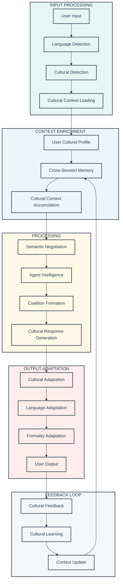

### 10.2 Cross-Session Context Preservation Flow

This flow shows how context accumulates and persists across multiple sessions:

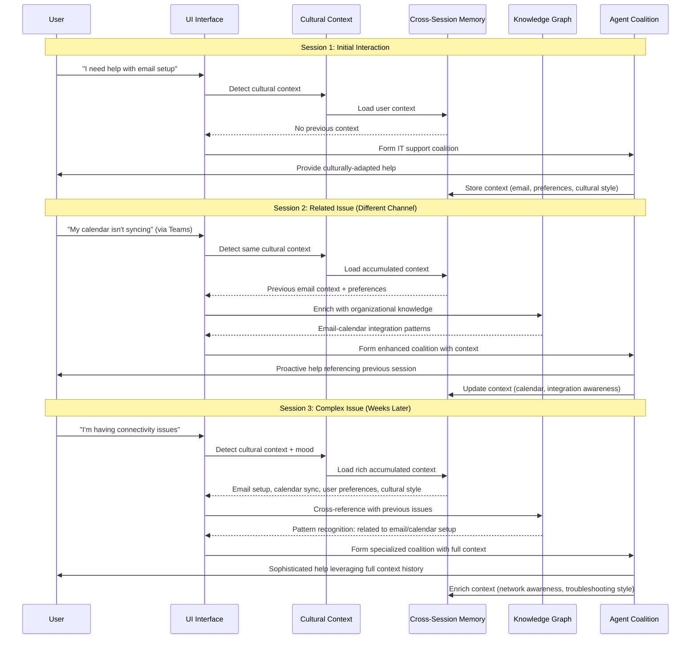

### 10.3 Cultural Intelligence Evolution Flow

This flow demonstrates how the system learns and evolves cultural understanding:

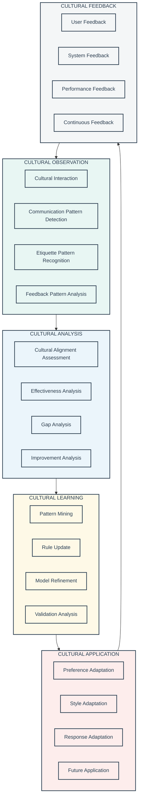

## 11. Implementation Roadmap and Migration Strategy

### 11.1 V16 Database Implementation Timeline

The implementation follows a structured approach to deliver the System of Context capabilities:

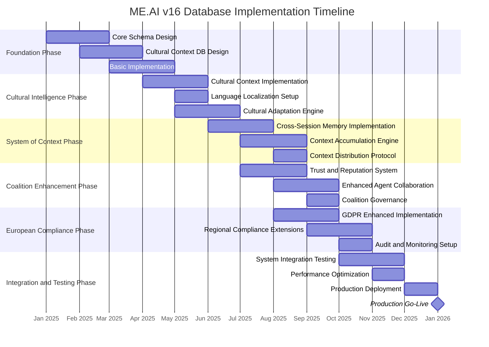

### 11.2 Migration Strategy from Previous Versions

The migration from previous architecture versions to v16 requires careful planning to preserve existing data while adding new capabilities:

```mermaid
flowchart TD
    subgraph ASSESS["ASSESSMENT PHASE"]
        DA[Data Assessment]
        SA[Schema Analysis]
        IA[Integration Analysis]
        RA[Risk Analysis]
    end
    
    subgraph PREP["PREPARATION PHASE"]
        SM[Schema Migration Scripts]
        DM[Data Migration Tools]
        TM[Testing Migration Procedures]
        BM[Backup and Recovery Plans]
    end
    
    subgraph EXEC["EXECUTION PHASE"]
        BD[Base Data Migration]
        CD[Cultural Data Integration]
        CSM[Cross-Session Memory Setup]
        CAD[Coalition Data Migration]
    end
    
    subgraph VAL["VALIDATION PHASE"]
        DV[Data Validation]
        FV[Functional Validation]
        PV[Performance Validation]
        CV[Cultural Validation]
    end
    
    subgraph OPT["OPTIMIZATION PHASE"]
        PO[Performance Optimization]
        CO[Cultural Optimization]
        IO[Integration Optimization]
        MO[Monitoring Optimization]
    end
    
    ASSESS --> PREP
    PREP --> EXEC
    EXEC --> VAL
    VAL --> OPT
    
    classDef assess fill:#E8F6F3,stroke:#2C3E50,stroke-width:2px,color:#2C3E50
    classDef prep fill:#EBF5FB,stroke:#2C3E50,stroke-width:2px,color:#2C3E50
    classDef exec fill:#FEF9E7,stroke:#2C3E50,stroke-width:2px,color:#2C3E50
    classDef val fill:#FDEDEC,stroke:#2C3E50,stroke-width:2px,color:#2C3E50
    classDef opt fill:#F4F6F7,stroke:#2C3E50,stroke-width:2px,color:#2C3E50
    
    class ASSESS,DA,SA,IA,RA assess
    class PREP,SM,DM,TM,BM prep
    class EXEC,BD,CD,CSM,CAD exec
    class VAL,DV,FV,PV,CV val
    class OPT,PO,CO,IO,MO opt
```

## 12. Query Performance Optimization

### 12.1 IT Support-Specific Query Patterns

The database architecture implements specialized query optimization techniques for the IT Support MVP, focusing on common patterns and performance characteristics:

```mermaid
flowchart TD
    subgraph QPO["QUERY PERFORMANCE OPTIMIZATION"]
        subgraph QR["QUERY ROUTING"]
            LR[Locality-Based Routing]
            CR[Capability-Based Routing]
            LBR[Load-Based Routing]
            FR[Fallback Routing]
        end
        
        subgraph IP["INDEX PATTERNS"]
            CI[Composite Indexes]
            PI[Partial Indexes]
            SI[Specialized Indexes]
            VI[Vector Indexes]
        end
        
        subgraph EE["EXECUTION ENHANCEMENT"]
            PC[Plan Caching]
            PH[Predicate Pushdown]
            PE[Parallel Execution]
            QR2[Query Restructuring]
        end
        
        subgraph QA["QUERY ANALYSIS"]
            PB[Pattern-Based Optimization]
            TD[Temporal Dependencies]
            SU[Statistical Usage Analysis]
            CBO[Cost-Based Optimization]
        end
    end
    
    QPO --> RP[Responsive Performance]
    
    classDef qr fill:#D5F5E3,stroke:#2C3E50,stroke-width:2px,color:#2C3E50
    classDef ip fill:#D6EAF8,stroke:#2C3E50,stroke-width:2px,color:#2C3E50
    classDef ee fill:#F9E79F,stroke:#2C3E50,stroke-width:2px,color:#2C3E50
    classDef qa fill:#FADBD8,stroke:#2C3E50,stroke-width:2px,color:#2C3E50
    classDef outcome fill:#D2B4DE,stroke:#2C3E50,stroke-width:2px,color:#2C3E50
    
    class QR,LR,CR,LBR,FR qr
    class IP,CI,PI,SI,VI ip
    class EE,PC,PH,PE,QR2 ee
    class QA,PB,TD,SU,CBO qa
    class RP outcome
```

#### 12.1.1 IT Support-Specific Query Patterns

**Password Reset Flow Optimization**:
- Composite indexes on (UserID, DeviceID) for rapid verification
- Pre-computed authorization status for immediate access checks
- Optimized workflow state retrieval paths that minimize database hops
- Cultural context indexes for rapid localization lookup

**Account Unlock Flow Optimization**:
- Security verification fast-path indexes combining authentication status
- Combined workflow state and device capability lookups
- Device capability verification optimizations for rapid decision-making
- Cross-session context indexes for user preference preservation

**Software Installation Optimization**:
- Software compatibility matrix indexing for rapid compatibility checks
- Device capability vs. software requirements composite indexes
- Installation workflow state tracking with cultural preferences
- Multi-language software documentation retrieval optimization

**Device Diagnostics Optimization**:
- Device passport quick lookup paths with cultural context
- Diagnostic history retrieval optimization across sessions
- Hardware capability verification indexes with regional compliance
- Cross-session diagnostic pattern recognition for proactive support

#### 12.1.2 Query Routing Strategies

**Locality-Based Routing**:
- Route queries to nodes with data locality to minimize cross-node transfers
- Geo-aware query distribution considering cultural data residency requirements
- Cultural context routing to nodes with regional expertise
- Session affinity routing for context preservation

**Capability-Based Routing**:
- Route specialized queries to optimized nodes with relevant capabilities
- Agent capability matching for cultural and technical query handling
- Resource allocation based on query complexity and cultural sensitivity
- Language-specific routing for translation and localization queries

**Load-Balanced Routing**:
- Dynamic query routing based on node capacity and cultural workload
- Background vs. foreground query separation with priority handling
- Query prioritization by business impact and cultural urgency
- Adaptive routing based on real-time performance metrics

#### 12.1.3 Query Path Optimization

**Path Optimization for Common Access Patterns**:
- IT Support workflow traversal paths optimized for cultural context
- User profile access patterns including cultural preferences
- Device capability lookups with regional compliance verification
- Security verification flows with cultural sensitivity considerations

**Compound Indexes for Common Query Predicates**:
- (UserID, ConversationTime, CulturalContext) for conversation retrieval
- (DeviceID, CapabilityType, RegionalCompliance) for capability verification
- (WorkflowType, Status, CulturalAdaptation) for workflow monitoring
- (CulturalRegion, LanguageCode, ComplianceFramework) for cultural queries

**Query Plan Caching for Repeated Patterns**:
- Parameterized plan reuse for cultural adaptation queries
- Plan invalidation on schema changes with cultural context updates
- Adaptive plan selection based on cultural data distribution
- Cultural-specific query templates for common interaction patterns

### 12.2 Advanced Caching Strategy

The ME.AI v16 database architecture implements a sophisticated multi-layered caching strategy that balances performance with cultural consistency requirements:

```mermaid
flowchart TD
    subgraph CS["CACHING STRATEGY"]
        subgraph AC["APPLICATION-LEVEL CACHING"]
            LC[Local Cache]
            SC[Session Cache]
            PC[Process Cache]
            CC[Cultural Context Cache]
        end
        
        subgraph DC["DISTRIBUTED CACHE LAYER"]
            DM[Distributed Memory]
            GC[Geo-distributed Cache]
            NC[Near Cache]
            RC[Regional Cultural Cache]
        end
        
        subgraph DNC["DATABASE-NATIVE CACHING"]
            BC[Buffer Cache]
            QC[Query Cache]
            RC2[Result Cache]
            CPC[Cultural Pattern Cache]
        end
        
        subgraph CM["CACHE MANAGEMENT"]
            CI[Cache Invalidation]
            CS2[Cache Synchronization]
            CP[Cache Partitioning]
            CCM[Cultural Cache Management]
        end
    end
    
    AC --> WF[Workflow Engine]
    AC --> CP2[Conversation Processing]
    DC --> MS[Mesh Services]
    DC --> AG[Agentic Products]
    DNC --> DB[(Database Layer)]
    CM --> ALL[All Caching Layers]
    
    classDef ac fill:#D5F5E3,stroke:#2C3E50,stroke-width:2px,color:#2C3E50
    classDef dc fill:#D6EAF8,stroke:#2C3E50,stroke-width:2px,color:#2C3E50
    classDef dnc fill:#F9E79F,stroke:#2C3E50,stroke-width:2px,color:#2C3E50
    classDef cm fill:#FADBD8,stroke:#2C3E50,stroke-width:2px,color:#2C3E50
    classDef comp fill:#D2B4DE,stroke:#2C3E50,stroke-width:2px,color:#2C3E50
    
    class AC,LC,SC,PC,CC ac
    class DC,DM,GC,NC,RC dc
    class DNC,BC,QC,RC2,CPC dnc
    class CM,CI,CS2,CP,CCM cm
    class WF,CP2,MS,AG,DB,ALL comp
```

#### 12.2.1 Cache Consistency Mechanisms

**Event-Based Invalidation Through the Mesh Protocol**:
- State changes publish invalidation events to affected components
- Content-addressable cache keys for deterministic invalidation
- Versioned cache entries to detect stale cultural context data
- Distributed consistency protocol for cultural data coordination

**Time-to-Live (TTL) Policies Based on Data Volatility**:
- Short TTLs for rapidly changing workflow state (30-60 seconds)
- Medium TTLs for user semantic profiles and cultural preferences (5-15 minutes)
- Long TTLs for cultural templates and compliance frameworks (1-4 hours)
- Adaptive TTLs based on cultural change frequency monitoring

**Vector Timestamp Synchronization**:
- Vector clocks for causality-preserving cultural cache consistency
- Concurrent cultural update detection and resolution
- Background reconciliation for eventually consistent cultural data
- Bloom filter-based efficiency for large cultural datasets

#### 12.2.2 Cache Partitioning Strategies

**User-Based Partitioning**:
- User-specific cultural data cached close to likely access points
- Session-bound caching for active cultural conversations
- Organization-bound caching for shared cultural resources
- Cultural profile clustering for efficient batch operations

**Function-Based Partitioning**:
- IT support function-specific caches with cultural awareness
- Cultural workflow-specific caching boundaries
- Agent capability-aligned cache segments with language support
- Multi-lingual content caching with regional optimization

**Geographic Partitioning**:
- Region-specific cache instances for cultural compliance
- Cache locality to minimize cultural context latency
- Cross-region replication for global cultural data
- Cultural data residency compliance through strategic partitioning

#### 12.2.3 Cache Warming Techniques

**Predictive Prefetching Based on Usage Patterns**:
- Cultural workflow stage prediction for advance caching
- User cultural behavior modeling for likely next cultural interactions
- Temporal pattern recognition for cyclical cultural access patterns
- Cultural event-driven warming for seasonal or regional requirements

**Intent-Based Warming**:
- Detected cultural intents trigger related cultural data prefetching
- Cultural context-aware resource preloading
- Semantic relationship traversal for related cultural content
- Cultural knowledge graph traversal for comprehensive warming

## 13. Data Resilience and Availability

### 13.1 Enhanced Data Resilience for Cultural Context

The ME.AI v16 database architecture implements comprehensive resilience strategies that account for cultural data sensitivity and regional compliance requirements:

```mermaid
flowchart TD
    subgraph DRS["DATA RESILIENCE STRATEGIES"]
        subgraph RM["REPLICATION MODELS"]
            SR[Synchronous Replication]
            AR[Asynchronous Replication]
            QR[Quorum-Based Replication]
            CR[Cultural Region Replication]
        end
        
        subgraph FT["FAULT TOLERANCE"]
            PC[Partition Containment]
            HA[Hot-Standby Activation]
            RF[Read Failover]
            CRF[Cultural Region Failover]
        end
        
        subgraph R["RECOVERY"]
            SP[Snapshot Processing]
            IR[Incremental Recovery]
            RB[Rollback Support]
            CR2[Cultural Recovery]
        end
        
        subgraph HGM["HEALTH & GOVERNANCE"]
            HM[Health Monitoring]
            AM[Availability Metrics]
            CG[Consistency Guarantees]
            CCG[Cultural Compliance Governance]
        end
    end
    
    DRS --> HA2[High Availability]
    
    classDef rm fill:#D5F5E3,stroke:#2C3E50,stroke-width:2px,color:#2C3E50
    classDef ft fill:#D6EAF8,stroke:#2C3E50,stroke-width:2px,color:#2C3E50
    classDef r fill:#F9E79F,stroke:#2C3E50,stroke-width:2px,color:#2C3E50
    classDef hgm fill:#FADBD8,stroke:#2C3E50,stroke-width:2px,color:#2C3E50
    classDef outcome fill:#D2B4DE,stroke:#2C3E50,stroke-width:2px,color:#2C3E50
    
    class RM,SR,AR,QR,CR rm
    class FT,PC,HA,RF,CRF ft
    class R,SP,IR,RB,CR2 r
    class HGM,HM,AM,CG,CCG hgm
    class HA2 outcome
```

#### 13.1.1 Replication Models

**Multiple Replication Strategies Based on Data Criticality**:
- Synchronous replication for critical workflow state and cultural security data
- Asynchronous replication for conversation history with cultural context
- Quorum-based writes for cultural compliance and GDPR data
- Chain replication for cultural knowledge graph updates

**Geographic Distribution Requirements**:
- N+2 replication across regions for critical cultural data
- N+1 replication for standard operational cultural data
- Regional preference for local cultural data access
- Cross-region replication with minimal latency impact for cultural queries

#### 13.1.2 Fault Tolerance Mechanisms

**Partition Containment**:
- Cultural data partitioning to limit failure impact
- Regional isolation for cultural compliance failures
- Cultural workflow isolation to prevent cross-contamination
- Graceful degradation for cultural services during failures

**Recovery Procedures**:
- Snapshot-based recovery with cultural context preservation
- Content-addressed snapshot storage for cultural data integrity
- Incremental snapshot differentials for cultural updates
- Point-in-time recovery capabilities for cultural compliance audits

### 13.2 Operational Excellence and Monitoring

#### 13.2.1 Monitoring & Observability

**Key Metrics Collection**:
- Query performance statistics by cultural pattern and region
- Storage utilization and growth trends for cultural data
- Cache effectiveness measurements for cultural content
- Replication health and latency for cross-cultural data synchronization
- Cultural adaptation success rates and user satisfaction metrics

**Alerting Framework**:
- Threshold-based alerts for critical cultural metrics
- Anomaly detection for unusual cultural access patterns
- Predictive alerts for cultural capacity planning
- Correlation-based complex event detection for cultural compliance

**Operational Dashboards**:
- Real-time cultural operational status across regions
- Cultural capacity utilization and forecasting
- Cultural performance trend analysis
- Cultural compliance and security status monitoring

#### 13.2.2 Backup & Recovery

**Comprehensive Backup Strategy**:
- Full database snapshots on scheduled intervals with cultural context preservation
- Incremental backups for rapid recovery of cultural data
- Transaction log shipping for point-in-time recovery of cultural events
- Cross-region backup replication for cultural compliance requirements

**Recovery Testing**:
- Regular recovery drills including cultural data validation
- Simulated disaster scenarios with cultural compliance verification
- Recovery time objective validation for cultural services
- Cultural data integrity verification across language variants

#### 13.2.3 Capacity Management

**Proactive Scaling Procedures**:
- Horizontal scaling automation for cultural workloads
- Vertical scaling decision trees considering cultural data growth
- Scaling trigger definition for cultural event surges
- Non-disruptive scaling execution preserving cultural context

**Resource Optimization**:
- Cultural data archival procedures maintaining compliance
- Storage optimization routines for multi-language content
- Index maintenance automation for cultural search patterns
- Resource allocation right-sizing for regional cultural demands

## 14. Database Training and Knowledge Transfer

### 14.1 Comprehensive Training Program

To ensure effective utilization and management of the v16 database architecture, the implementation includes a comprehensive training and knowledge transfer program that addresses both technical and cultural competency requirements:

#### 14.1.1 Database Administrator Training

**Architecture Overview**:
- Distributed mesh concepts with cultural intelligence integration
- CRDT-based data management for cultural consistency
- Vector clock synchronization across cultural regions
- Content-addressable storage principles for cultural data
- Cultural context database management and optimization

**Operational Procedures**:
- Performance monitoring and troubleshooting for cultural queries
- Scaling and capacity management for multi-cultural workloads
- Backup and recovery operations preserving cultural context
- Security administration with cultural sensitivity requirements
- Cultural compliance monitoring and audit procedures

#### 14.1.2 Developer Training

**Database Interaction Patterns**:
- Effective query construction for cultural data retrieval
- Workflow state management with cultural context preservation
- Device passport integration with regional compliance
- Coalition-based data access with cultural awareness
- Cross-session context management for cultural continuity

**Performance Optimization**:
- Query optimization techniques for cultural patterns
- Caching strategies for multi-language content
- Cultural data access patterns and optimization
- Schema design principles for cultural extensibility

#### 14.1.3 Operations Team Training

**Monitoring and Alerting**:
- Cultural dashboard interpretation and analysis
- Cultural alert response procedures and escalation
- Cultural performance trend analysis and capacity planning
- Cultural compliance monitoring and reporting

**Incident Management**:
- Cultural troubleshooting methodologies and best practices
- Cultural escalation procedures and communication protocols
- Cultural recovery operations and business continuity
- Post-incident analysis including cultural impact assessment

#### 14.1.4 Knowledge Repository Development

**Comprehensive Documentation**:
- Cultural architecture design documents and specifications
- Cultural schema reference guides and data dictionaries
- Cultural operational procedures and standard operating procedures
- Cultural integration patterns and best practices

**Knowledge Base**:
- Common cultural issues and their resolutions
- Cultural best practices and optimization techniques
- Cultural performance tuning guidance and recommendations
- Cultural security hardening recommendations and procedures

## 15. Future Evolution and Enhancement Paths

### 15.1 Expanded Cultural Intelligence Capabilities

The ME.AI v16 database architecture is designed to support future evolution beyond the current cultural intelligence implementation:

#### 15.1.1 Advanced Cultural Learning

**Continuous Cultural Model Improvement**:
- Real-time cultural adaptation learning from user interactions
- Cross-cultural pattern recognition and modeling
- Cultural preference evolution tracking and prediction
- Cultural communication effectiveness optimization

**Cross-Cultural Knowledge Integration**:
- Multi-cultural knowledge graph expansion and refinement
- Cultural norm evolution tracking and adaptation
- Cross-cultural communication pattern analysis
- Cultural bridge-building conversation facilitation

#### 15.1.2 Enhanced Agent Cultural Collaboration

**Cross-Cultural Coalition Formation**:
- Cultural competency-based agent selection and collaboration
- Multi-cultural problem-solving coalition optimization
- Cultural context preservation across agent handoffs
- Cultural sensitivity training for AI agent interactions

**Global Cultural Intelligence**:
- Worldwide cultural intelligence expansion beyond European focus
- Cultural intelligence API for third-party integrations
- Cultural adaptation marketplace for specialized cultural modules
- Cultural intelligence as a service for external organizations

### 15.2 Advanced System of Context Evolution

#### 15.2.1 Contextual Intelligence Expansion

**Deep Context Understanding**:
- Emotional context preservation and adaptation across sessions
- Situational context modeling for proactive assistance
- Temporal context patterns for predictive user support
- Environmental context integration for comprehensive understanding

**Context-Driven Automation**:
- Context-triggered workflow automation and optimization
- Predictive context modeling for anticipatory assistance
- Context-based resource allocation and optimization
- Context-driven personalization beyond current capabilities

## 16. Operational Excellence and Monitoring

### 16.1 Cultural Intelligence Monitoring

The v16 architecture includes sophisticated monitoring capabilities for cultural intelligence effectiveness:

```mermaid
flowchart TD
    subgraph CIM["CULTURAL INTELLIGENCE MONITORING"]
        subgraph CAM["CULTURAL ADAPTATION METRICS"]
            CAS[Cultural Adaptation Success Rate]
            CAL[Cultural Adaptation Latency]
            CAA[Cultural Adaptation Accuracy]
            CAF[Cultural Adaptation Feedback Score]
        end
        
        subgraph CLM["CULTURAL LEARNING METRICS"]
            CLR[Cultural Learning Rate]
            CLE[Cultural Learning Effectiveness]
            CLA[Cultural Learning Accuracy]
            CLS[Cultural Learning Stability]
        end
        
        subgraph CCM["CULTURAL COMPLIANCE METRICS"]
            CCR[Cultural Compliance Rate]
            CCA2[Cultural Compliance Accuracy]
            CCE[Cultural Compliance Effectiveness]
            CCM2[Cultural Compliance Monitoring]
        end
        
        subgraph CUM["CULTURAL USER METRICS"]
            CUS[Cultural User Satisfaction]
            CUE[Cultural User Engagement]
            CUR[Cultural User Retention]
            CUF[Cultural User Feedback Quality]
        end
    end
    
    subgraph CSM["CONTEXT SYSTEM MONITORING"]
        subgraph CAC["CONTEXT ACCUMULATION"]
            CAR[Context Accumulation Rate]
            CAQ[Context Accumulation Quality]
            CAC2[Context Accumulation Coverage]
            CAI[Context Accumulation Impact]
        end
        
        subgraph CPR["CONTEXT PRESERVATION"]
            CPE[Context Preservation Effectiveness]
            CPA[Context Preservation Accuracy]
            CPD[Context Preservation Duration]
            CPR2[Context Preservation Reliability]
        end
        
        subgraph CDI["CONTEXT DISTRIBUTION"]
            CDD[Context Distribution Effectiveness]
            CDA[Context Distribution Accuracy]
            CDL[Context Distribution Latency]
            CDR[Context Distribution Reliability]
        end
    end
    
    classDef cultural fill:#E8F6F3,stroke:#2C3E50,stroke-width:2px,color:#2C3E50
    classDef context fill:#EBF5FB,stroke:#2C3E50,stroke-width:2px,color:#2C3E50
    
    class CIM,CAM,CLM,CCM,CUM,CAS,CAL,CAA,CAF,CLR,CLE,CLA,CLS,CCR,CCA2,CCE,CCM2,CUS,CUE,CUR,CUF cultural
    class CSM,CAC,CPR,CDI,CAR,CAQ,CAC2,CAI,CPE,CPA,CPD,CPR2,CDD,CDA,CDL,CDR context
```

### 12.2 Performance and Scalability Considerations

The v16 architecture is designed for enterprise-scale deployment with sophisticated performance optimization:

```mermaid
flowchart TD
    subgraph PS["PERFORMANCE SCALABILITY"]
        subgraph HPS["HORIZONTAL PERFORMANCE SCALING"]
            DPS[Database Partitioning Strategy]
            CRS[Cross-Region Synchronization]
            LBL[Load Balancing Logic]
            ARS[Auto-scaling Rules]
        end
        
        subgraph VPS["VERTICAL PERFORMANCE SCALING"]
            ROU[Resource Optimization Utilities]
            PTO[Performance Tuning Operations]
            COU[Capacity Optimization Utilities]
            MAU[Memory Allocation Utilities]
        end
        
        subgraph CPS["CULTURAL PERFORMANCE SCALING"]
            CLS[Cultural Localization Scaling]
            LTS[Language Translation Scaling]
            CAS[Cultural Adaptation Scaling]
            CCS[Cultural Context Scaling]
        end
        
        subgraph COS["CONTEXT OPTIMIZATION SCALING"]
            CAO[Context Accumulation Optimization]
            CPO[Context Preservation Optimization]
            CDO[Context Distribution Optimization]
            CMO[Context Memory Optimization]
        end
    end
    
    classDef horizontal fill:#E8F6F3,stroke:#2C3E50,stroke-width:2px,color:#2C3E50
    classDef vertical fill:#EBF5FB,stroke:#2C3E50,stroke-width:2px,color:#2C3E50
    classDef cultural fill:#FEF9E7,stroke:#2C3E50,stroke-width:2px,color:#2C3E50
    classDef context fill:#FDEDEC,stroke:#2C3E50,stroke-width:2px,color:#2C3E50
    
    class HPS,DPS,CRS,LBL,ARS horizontal
    class VPS,ROU,PTO,COU,MAU vertical
    class CPS,CLS,LTS,CAS,CCS cultural
    class COS,CAO,CPO,CDO,CMO context
```

## 13. Security and Privacy Architecture

### 13.1 Enhanced Privacy-by-Design for Cultural Data

The v16 architecture implements sophisticated privacy protection for sensitive cultural and personal data:

```mermaid
flowchart TD
    subgraph PBD["PRIVACY BY DESIGN"]
        subgraph DM["DATA MINIMIZATION"]
            DMP[Data Minimization Principles]
            PLP[Purpose Limitation Principles]
            SAP[Storage Limitation Principles]
            AAP[Access Limitation Principles]
        end
        
        subgraph EP["ENCRYPTION PROTECTION"]
            EAR[Encryption at Rest]
            EIT[Encryption in Transit]
            EIP[Encryption in Processing]
            KMP[Key Management Protocol]
        end
        
        subgraph CP["CULTURAL PROTECTION"]
            CDS[Cultural Data Segregation]
            CAN[Cultural Anonymization]
            CPS2[Cultural Pseudonymization]
            CSM[Cultural Sensitivity Masking]
        end
        
        subgraph AP["ACCESS PROTECTION"]
            RBAC[Role-Based Access Control]
            ABAC[Attribute-Based Access Control]
            CBAC[Context-Based Access Control]
            ZBAC[Zero-Trust Access Control]
        end
    end
    
    classDef minimization fill:#E8F6F3,stroke:#2C3E50,stroke-width:2px,color:#2C3E50
    classDef encryption fill:#EBF5FB,stroke:#2C3E50,stroke-width:2px,color:#2C3E50
    classDef cultural fill:#FEF9E7,stroke:#2C3E50,stroke-width:2px,color:#2C3E50
    classDef access fill:#FDEDEC,stroke:#2C3E50,stroke-width:2px,color:#2C3E50
    
    class DM,DMP,PLP,SAP,AAP minimization
    class EP,EAR,EIT,EIP,KMP encryption
    class CP,CDS,CAN,CPS2,CSM cultural
    class AP,RBAC,ABAC,CBAC,ZBAC access
```

## 14. Conclusion

The ME.AI v16 Data Architecture represents a comprehensive evolution toward a System of Context that enables sophisticated cultural intelligence, enhanced user experience, and robust enterprise integration. The architecture successfully addresses the four strategic pillars while maintaining strict European compliance standards and providing measurable business value.

Key architectural achievements include:

**Cultural Intelligence Foundation**: The new Cultural Context Database and associated intelligence systems enable sophisticated multi-cultural communication and adaptation.

**System of Context Implementation**: Enhanced cross-session memory and context accumulation capabilities transform isolated interactions into continuous, evolving relationships.

**European Market Readiness**: Comprehensive GDPR compliance and regional adaptation capabilities position the platform for successful European deployment.

**Enhanced Agent Collaboration**: Trust and reputation mechanisms enable sophisticated coalition formation and collaborative problem-solving.

**Enterprise Integration**: Robust security, compliance, and integration capabilities ensure enterprise-grade deployment readiness.

This architecture provides the foundation for delivering transformative AI capabilities while respecting cultural diversity, ensuring regulatory compliance, and maintaining the highest standards of security and privacy protection.

The implementation roadmap ensures systematic delivery of capabilities while maintaining operational excellence and providing clear migration paths from previous versions. The result is a comprehensive, culturally-intelligent AI platform ready for enterprise deployment across diverse European markets.
