# ME.AI Data Architecture and Use Case Data Flows

## 1. ME.AI Database Architecture Overview

The ME.AI Neural Core Mesh Architecture utilizes a distributed database approach that spans multiple functional layers. This document focuses on the database architecture supporting the IT Support Product MVP, examining the relevant database components, their structure, and the data flows that enable key use cases.

### 1.1 Database Layer Architecture

The ME.AI database architecture consists of multiple interconnected database systems that operate as a distributed mesh, supporting the neural core platform, mesh control protocol, and agentic products.

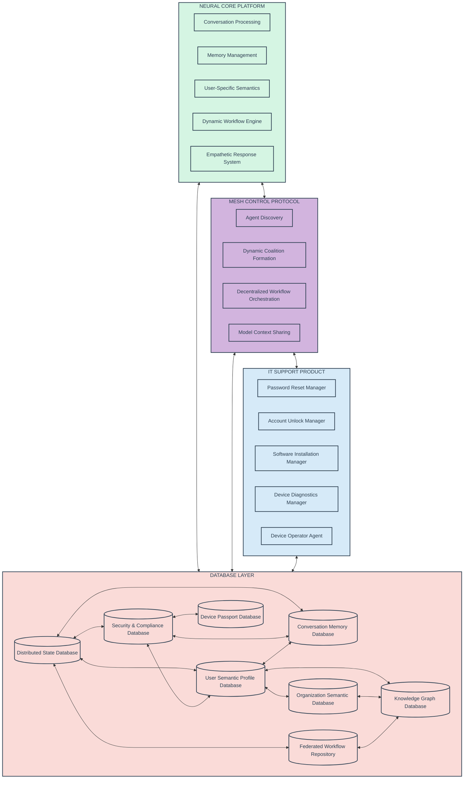
```mermaid
flowchart TD
    subgraph DL["DATABASE LAYER"]
        DSDB[(Distributed State Database)]
        SCDB[(Security & Compliance Database)]
        USPDB[(User Semantic Profile Database)]
        CMDB[(Conversation Memory Database)]
        OSDB[(Organization Semantic Database)]
        FWRDB[(Federated Workflow Repository)]
        DPD[(Device Passport Database)]
        KGB[(Knowledge Graph Database)]
        
        DSDB <--> SCDB
        DSDB <--> USPDB
        DSDB <--> CMDB
        DSDB <--> FWRDB
        SCDB <--> USPDB
        SCDB <--> CMDB
        SCDB <--> DPD
        USPDB <--> CMDB
        USPDB <--> OSDB
        USPDB <--> KGB
        OSDB <--> KGB
        FWRDB <--> KGB
    end
    
    subgraph NCP["NEURAL CORE PLATFORM"]
        CP[Conversation Processing]
        MMS[Memory Management]
        USE[User-Specific Semantics]
        DWE[Dynamic Workflow Engine]
        ERS[Empathetic Response System]
    end
    
    subgraph MCP["MESH CONTROL PROTOCOL"]
        AD[Agent Discovery]
        DCF[Dynamic Coalition Formation]
        DWO[Decentralized Workflow Orchestration]
        MCS[Model Context Sharing]
    end
    
    subgraph ITSM["IT SUPPORT PRODUCT"]
        PRM[Password Reset Manager]
        ALM[Account Unlock Manager]
        SIM[Software Installation Manager]
        DDM[Device Diagnostics Manager]
        DOA[Device Operator Agent]
    end
    
    NCP <--> DL
    MCP <--> DL
    ITSM <--> DL
    NCP <--> MCP
    MCP <--> ITSM
    
    classDef dbLayer fill:#FADBD8,stroke:#2C3E50,stroke-width:2px,color:#2C3E50
    classDef ncpLayer fill:#D5F5E3,stroke:#2C3E50,stroke-width:2px,color:#2C3E50
    classDef mcpLayer fill:#D2B4DE,stroke:#2C3E50,stroke-width:2px,color:#2C3E50
    classDef itsmLayer fill:#D6EAF8,stroke:#2C3E50,stroke-width:2px,color:#2C3E50
    
    class DL,DSDB,SCDB,USPDB,CMDB,OSDB,FWRDB,DPD,KGB dbLayer
    class NCP,CP,MMS,USE,DWE,ERS ncpLayer
    class MCP,AD,DCF,DWO,MCS mcpLayer
    class ITSM,PRM,ALM,SIM,DDM,DOA itsmLayer
```

#### 1.1.1 Database Layer Mapping to Platform Components

```mermaid
flowchart TD
    subgraph UL["UI AGENTIC LAYER"]
        UIA[UI Agent Framework]
        UIP[UI Personalization]
    end
    
    subgraph NCM["NEURAL CORE MESH"]
        CP[Conversation Processing]
        MM[Memory Management]
        USE[User Semantic Evolution]
        DWE[Dynamic Workflow Engine]
    end
    
    subgraph MCP["MESH CONTROL PROTOCOL"]
        DWO[Decentralized Workflow Orchestration]
        SM[State Management]
        MC[Model Context Protocol]
    end
    
    subgraph APL["AGENTIC PRODUCTS LAYER"]
        ITS[IT Support Product]
        DOA[Device Operator Agent]
        DPD[Device Passport Database]
    end
    
    subgraph DB["DATABASE SCHEMAS"]
        subgraph WFDB["WORKFLOW STATE DB"]
            WD[DistributedWorkflowDefinition]
            WI[DistributedWorkflowInstance]
            TE[DistributedTaskExecution]
            SV[DistributedVariable]
            CP1[CoalitionParticipation]
        end
        
        subgraph USDB["USER SEMANTIC DB"]
            DUP[DistributedUserProfile]
            USP[UserSemanticProfile]
            EF[EntityFamiliarity]
            UKN[UserKnowledgeNode]
            UKR[UserKnowledgeRelationship]
            CU[ConceptualUnderstanding]
        end
        
        subgraph OSDB["ORGANIZATION SEMANTIC DB"]
            OSP[OrganizationSemanticProfile]
            SD[SemanticDomain]
            SO[StandardOntology]
            SNR[SemanticNegotiationRecord]
            OAR[OntologyAlignmentResult]
        end
        
        subgraph CMDB["CONVERSATION MEMORY DB"]
            CS[ConversationSession]
            MSG[Message]
            CM[ContextualMemory]
            CST[ConversationState]
            CSM[ConversationSummary]
            ER[EntityReference]
            IC[IntentClassification]
            ES[EmotionalState]
        end
        
        subgraph SCDB["SECURITY & COMPLIANCE DB"]
            DP[DevicePassport]
            DC[DeviceCapability]
            DA[DeviceAttestation]
            AG[AccessGrant]
            SP[SecurityPolicy]
            CR[ComplianceRequirement]
            SA[SecurityAudit]
            CF[ComplianceFramework]
            CA[ComplianceAudit]
        end
        
        subgraph KGDB["KNOWLEDGE GRAPH DB"]
            KGN[KnowledgeNode]
            KGR[KnowledgeRelationship]
            KGD[DomainKnowledge]
            KGE[EntityDefinition]
        end
        
        subgraph FWRDB["FEDERATED WORKFLOW REPOSITORY"]
            WTC[WorkflowTemplateDefinition]
            WTM[WorkflowTemplateMetadata]
            WTD[WorkflowTestData]
            WSC[WorkflowSecurityConstraint]
        end
    end
    
    DWE --> WFDB
    DWO --> WFDB
    
    USE --> USDB
    UIP --> USDB
    
    CP --> CMDB
    MM --> CMDB
    
    DPD --> SCDB
    DOA --> SCDB
    
    USE --> OSDB
    
    DWE --> FWRDB
    ITS --> FWRDB
    
    USE --> KGDB
    CP --> KGDB
    
    MC -.-> USDB
    MC -.-> OSDB
    MC -.-> CMDB
    
    SM -.-> WFDB
    SM -.-> CMDB
    SM -.-> USDB
    SM -.-> SCDB
    
    classDef uiLayer fill:#F9E79F,stroke:#2C3E50,stroke-width:2px,color:#2C3E50
    classDef coreLayer fill:#D5F5E3,stroke:#2C3E50,stroke-width:2px,color:#2C3E50
    classDef mcpLayer fill:#D6EAF8,stroke:#2C3E50,stroke-width:2px,color:#2C3E50
    classDef productLayer fill:#D2B4DE,stroke:#2C3E50,stroke-width:2px,color:#2C3E50
    
    classDef wfdb fill:#FADBD8,stroke:#2C3E50,stroke-width:2px,color:#2C3E50
    classDef usdb fill:#A9DFBF,stroke:#2C3E50,stroke-width:2px,color:#2C3E50
    classDef osdb fill:#F5CBA7,stroke:#2C3E50,stroke-width:2px,color:#2C3E50
    classDef cmdb fill:#AED6F1,stroke:#2C3E50,stroke-width:2px,color:#2C3E50
    classDef scdb fill:#E8DAEF,stroke:#2C3E50,stroke-width:2px,color:#2C3E50
    classDef kgdb fill:#FDEDEC,stroke:#2C3E50,stroke-width:2px,color:#2C3E50
    classDef fwrdb fill:#FCF3CF,stroke:#2C3E50,stroke-width:2px,color:#2C3E50
    
    class UL,UIA,UIP uiLayer
    class NCM,CP,MM,USE,DWE coreLayer
    class MCP,DWO,SM,MC mcpLayer
    class APL,ITS,DOA,DPD productLayer
    
    class WFDB,WD,WI,TE,SV,CP1 wfdb
    class USDB,DUP,USP,EF,UKN,UKR,CU usdb
    class OSDB,OSP,SD,SO,SNR,OAR osdb
    class CMDB,CS,MSG,CM,CST,CSM,ER,IC,ES cmdb
    class SCDB,DP,DC,DA,AG,SP,CR,SA,CF,CA scdb
    class KGDB,KGN,KGR,KGD,KGE kgdb
    class FWRDB,WTC,WTM,WTD,WSC fwrdb
```

### 1.2 Database Components Relevant to IT Support MVP

For the IT Support Product MVP, the following database components are most relevant:

#### 1.2.1 Distributed State Database

A critical component of the mesh architecture that manages workflow state, task execution, and coordination for IT support processes.

Key Tables:
- `DistributedWorkflowDefinition`: Templates for password reset, account unlock, and other IT workflows
- `DistributedWorkflowInstance`: Active instances of IT support workflows
- `DistributedTaskExecution`: Individual tasks within IT workflows
- `StateTransition`: Records of state changes within workflows
- `DistributedVariable`: Variables maintained across workflow execution
- `DistributedEvent`: Events triggered during workflow execution
- `CoalitionParticipation`: Agent participation in IT support coalitions

Schema:
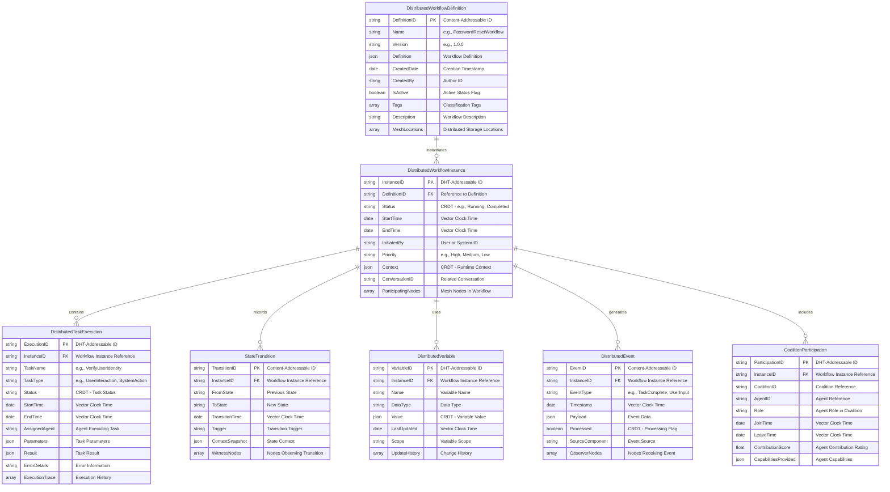
```mermaid
erDiagram
    DistributedWorkflowDefinition ||--o{ DistributedWorkflowInstance : instantiates
    DistributedWorkflowInstance ||--o{ DistributedTaskExecution : contains
    DistributedWorkflowInstance ||--o{ StateTransition : records
    DistributedWorkflowInstance ||--o{ DistributedVariable : uses
    DistributedWorkflowInstance ||--o{ DistributedEvent : generates
    DistributedWorkflowInstance ||--o{ CoalitionParticipation : includes
    
    DistributedWorkflowDefinition {
        string DefinitionID PK "Content-Addressable ID"
        string Name "e.g., PasswordResetWorkflow"
        string Version "e.g., 1.0.0"
        json Definition "Workflow Definition"
        date CreatedDate "Creation Timestamp"
        string CreatedBy "Author ID"
        boolean IsActive "Active Status Flag"
        array Tags "Classification Tags"
        string Description "Workflow Description"
        array MeshLocations "Distributed Storage Locations"
    }
    
    DistributedWorkflowInstance {
        string InstanceID PK "DHT-Addressable ID"
        string DefinitionID FK "Reference to Definition"
        string Status "CRDT - e.g., Running, Completed"
        date StartTime "Vector Clock Time"
        date EndTime "Vector Clock Time"
        string InitiatedBy "User or System ID"
        string Priority "e.g., High, Medium, Low"
        json Context "CRDT - Runtime Context"
        string ConversationID "Related Conversation"
        array ParticipatingNodes "Mesh Nodes in Workflow"
    }
    
    DistributedTaskExecution {
        string ExecutionID PK "DHT-Addressable ID"
        string InstanceID FK "Workflow Instance Reference"
        string TaskName "e.g., VerifyUserIdentity"
        string TaskType "e.g., UserInteraction, SystemAction"
        string Status "CRDT - Task Status"
        date StartTime "Vector Clock Time"
        date EndTime "Vector Clock Time"
        string AssignedAgent "Agent Executing Task"
        json Parameters "Task Parameters"
        json Result "Task Result"
        string ErrorDetails "Error Information"
        array ExecutionTrace "Execution History"
    }
    
    StateTransition {
        string TransitionID PK "Content-Addressable ID"
        string InstanceID FK "Workflow Instance Reference"
        string FromState "Previous State"
        string ToState "New State"
        date TransitionTime "Vector Clock Time"
        string Trigger "Transition Trigger"
        json ContextSnapshot "State Context"
        array WitnessNodes "Nodes Observing Transition"
    }
    
    DistributedVariable {
        string VariableID PK "DHT-Addressable ID"
        string InstanceID FK "Workflow Instance Reference"
        string Name "Variable Name"
        string DataType "Data Type"
        json Value "CRDT - Variable Value"
        date LastUpdated "Vector Clock Time"
        string Scope "Variable Scope"
        array UpdateHistory "Change History"
    }
    
    DistributedEvent {
        string EventID PK "Content-Addressable ID"
        string InstanceID FK "Workflow Instance Reference"
        string EventType "e.g., TaskComplete, UserInput"
        date Timestamp "Vector Clock Time"
        json Payload "Event Data"
        boolean Processed "CRDT - Processing Flag"
        string SourceComponent "Event Source"
        array ObserverNodes "Nodes Receiving Event"
    }
    
    CoalitionParticipation {
        string ParticipationID PK "DHT-Addressable ID"
        string InstanceID FK "Workflow Instance Reference"
        string CoalitionID "Coalition Reference"
        string AgentID "Agent Reference"
        string Role "Agent Role in Coalition"
        date JoinTime "Vector Clock Time"
        date LeaveTime "Vector Clock Time"
        float ContributionScore "Agent Contribution Rating"
        json CapabilitiesProvided "Agent Capabilities"
    }
```

#### 1.2.2 Security & Compliance Database

Critical for the IT Support MVP as it manages device identification, authentication, and authorization required for secure operations. This is closely integrated with the Device Passport Database.

Key Tables:
- `DevicePassport`: Device identity and authorization profile
- `DeviceCapability`: Capabilities of registered devices
- `DeviceAttestation`: Verification of device authenticity
- `AccessGrant`: Authorization for specific resources
- `SecurityPolicy`: Policies governing access control
- `ComplianceRequirement`: Compliance rules and requirements
- `SecurityAudit`: Security audit records
- `ComplianceFramework`: Compliance frameworks
- `ComplianceAudit`: Compliance audit results

Schema:

```mermaid
erDiagram
    DevicePassport ||--o{ DeviceCapability : has
    DevicePassport ||--o{ DeviceAttestation : verifies
    DevicePassport ||--o{ AccessGrant : authorizes
    DevicePassport ||--o{ SecurityAudit : records
    
    SecurityPolicy ||--o{ AccessGrant : governs
    SecurityPolicy ||--o{ ComplianceRequirement : enforces
    SecurityPolicy ||--o{ SecurityAudit : validates
    
    ComplianceFramework ||--o{ ComplianceRequirement : defines
    ComplianceFramework ||--o{ ComplianceAudit : assesses
    
    DevicePassport {
        string DeviceID PK "Unique Device Identifier"
        string DeviceType "e.g., Laptop, Mobile"
        string Manufacturer "Device Manufacturer"
        string Model "Device Model"
        string FirmwareVersion "Current Firmware"
        string OSVersion "Operating System Version"
        date RegistrationDate "Initial Registration"
        date LastUpdated "Last Profile Update"
        date LastAuthenticated "Last Authentication"
        string Status "Active/Inactive/Quarantined"
        string Owner "Organization/User Reference"
        float TrustScore "Dynamic Trust Rating"
        string PublicKey "Device Public Key"
        json PassportMetadata "Additional Metadata"
    }
    
    DeviceCapability {
        string CapabilityID PK "Capability Identifier"
        string DeviceID FK "Device Reference"
        string CapabilityName "e.g., RemoteControl, Diagnostics"
        string CapabilityType "Capability Classification"
        json CapabilityMetadata "Capability Details"
        date VerificationDate "Verification Timestamp"
        string VerificationMethod "How Verified"
        boolean IsActive "Active Status"
    }
    
    DeviceAttestation {
        string AttestationID PK "Attestation Identifier"
        string DeviceID FK "Device Reference"
        date AttestationTime "Timestamp"
        string AttestationType "Attestation Method"
        json AttestationResult "Verification Result"
        string AttestationAuthority "Verifying Authority"
        string BlockchainReference "Immutable Reference"
        string ProofHash "Cryptographic Proof"
    }
    
    AccessGrant {
        string GrantID PK "Grant Identifier"
        string DeviceID FK "Device Reference"
        string SecurityPolicyID FK "Policy Reference"
        string ResourceType "e.g., System, Application"
        string ResourceID "Specific Resource"
        string AccessLevel "e.g., Read, Write, Execute"
        date GrantStart "Grant Start Time"
        date GrantEnd "Grant Expiration"
        string GrantReason "Justification"
        string ApprovedBy "Approver ID"
        boolean IsActive "Active Status"
    }
    
    SecurityPolicy {
        string PolicyID PK "Policy Identifier"
        string PolicyName "Policy Name"
        string PolicyVersion "Version Number"
        date CreationDate "Creation Timestamp"
        date EffectiveDate "Effective From"
        date ExpirationDate "Valid Until"
        string Status "Policy Status"
        string Author "Author ID"
        string ApprovedBy "Approver ID"
        json PolicyRules "Policy Rules"
        string Scope "Global/Organization/Team"
    }
    
    ComplianceRequirement {
        string RequirementID PK "Requirement Identifier"
        string SecurityPolicyID FK "Policy Reference"
        string FrameworkID FK "Framework Reference"
        string RequirementCode "Requirement Code"
        string Description "Description"
        string ControlType "Type of Control"
        string VerificationMethod "Verification Method"
        string Priority "Requirement Priority"
        boolean IsActive "Active Status"
    }
    
    SecurityAudit {
        string AuditID PK "Audit Identifier"
        string DeviceID FK "Device Reference"
        string PolicyID FK "Policy Reference"
        date AuditTime "Audit Timestamp"
        string AuditType "Audit Type"
        string AuditResult "Audit Result"
        string AuditorID "Auditor Reference"
        json AuditDetails "Detailed Results"
        string RemediationStatus "Remediation Status"
        json RemediationDetails "Remediation Information"
    }
    
    ComplianceFramework {
        string FrameworkID PK "Framework Identifier"
        string FrameworkName "Framework Name"
        string Version "Version Number"
        string Issuer "Issuing Organization"
        date PublicationDate "Publication Date"
        date AdoptionDate "Adoption Date"
        string Status "Framework Status"
        string Scope "Application Scope"
        string IndustryFocus "Industry Focus"
    }
    
    ComplianceAudit {
        string AuditID PK "Audit Identifier"
        string FrameworkID FK "Framework Reference"
        date AuditDate "Audit Date"
        string AuditScope "Audit Scope"
        string AuditorOrganization "Auditor Organization"
        string AuditorName "Auditor Name"
        string AuditResult "Audit Result"
        float ComplianceScore "Compliance Score"
        json FindingDetails "Finding Details"
        string RemediationPlan "Remediation Plan"
        date NextAuditDue "Next Audit Due"
    }
```

#### 1.2.3 User Semantic Profile Database

A crucial component that enables personalized IT support interactions by storing and evolving user-specific semantics, preferences, and knowledge patterns.

Key Tables:
- `DistributedUserProfile`: Core user information and preferences
- `UserSemanticProfile`: User's semantic understanding profile
- `EntityFamiliarity`: User's familiarity with IT concepts and terms
- `UserKnowledgeNode`: User's knowledge of specific IT entities
- `UserKnowledgeRelationship`: Relationships between knowledge entities
- `ConceptualUnderstanding`: User's understanding of concepts
- `SemanticLearningEvent`: Events that update semantic understanding

Schema:
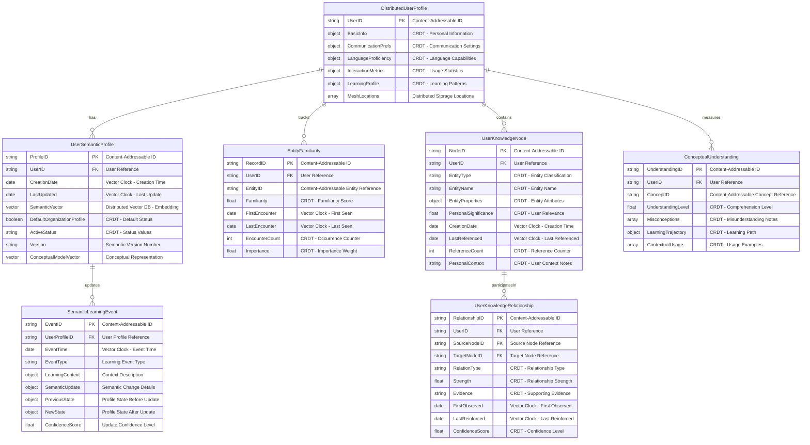
```mermaid
erDiagram
    DistributedUserProfile ||--o{ UserSemanticProfile : has
    DistributedUserProfile ||--o{ EntityFamiliarity : tracks
    DistributedUserProfile ||--o{ UserKnowledgeNode : contains
    UserKnowledgeNode ||--o{ UserKnowledgeRelationship : participatesIn
    DistributedUserProfile ||--o{ ConceptualUnderstanding : measures
    UserSemanticProfile ||--o{ SemanticLearningEvent : updates
    
    DistributedUserProfile {
        string UserID PK "Content-Addressable ID"
        object BasicInfo "CRDT - Personal Information"
        object CommunicationPrefs "CRDT - Communication Settings"
        object LanguageProficiency "CRDT - Language Capabilities"
        object InteractionMetrics "CRDT - Usage Statistics"
        object LearningProfile "CRDT - Learning Patterns"
        array MeshLocations "Distributed Storage Locations"
    }
    
    UserSemanticProfile {
        string ProfileID PK "Content-Addressable ID"
        string UserID FK "User Reference"
        date CreationDate "Vector Clock - Creation Time"
        date LastUpdated "Vector Clock - Last Update"
        vector SemanticVector "Distributed Vector DB - Embedding"
        boolean DefaultOrganizationProfile "CRDT - Default Status"
        string ActiveStatus "CRDT - Status Values"
        string Version "Semantic Version Number"
        vector ConceptualModelVector "Conceptual Representation"
    }
    
    EntityFamiliarity {
        string RecordID PK "Content-Addressable ID"
        string UserID FK "User Reference"
        string EntityID "Content-Addressable Entity Reference"
        float Familiarity "CRDT - Familiarity Score"
        date FirstEncounter "Vector Clock - First Seen"
        date LastEncounter "Vector Clock - Last Seen"
        int EncounterCount "CRDT - Occurrence Counter"
        float Importance "CRDT - Importance Weight"
    }
    
    UserKnowledgeNode {
        string NodeID PK "Content-Addressable ID"
        string UserID FK "User Reference"
        string EntityType "CRDT - Entity Classification"
        string EntityName "CRDT - Entity Name"
        object EntityProperties "CRDT - Entity Attributes"
        float PersonalSignificance "CRDT - User Relevance"
        date CreationDate "Vector Clock - Creation Time"
        date LastReferenced "Vector Clock - Last Referenced"
        int ReferenceCount "CRDT - Reference Counter"
        string PersonalContext "CRDT - User Context Notes"
    }
    
    UserKnowledgeRelationship {
        string RelationshipID PK "Content-Addressable ID"
        string UserID FK "User Reference"
        string SourceNodeID FK "Source Node Reference"
        string TargetNodeID FK "Target Node Reference"
        string RelationType "CRDT - Relationship Type"
        float Strength "CRDT - Relationship Strength"
        string Evidence "CRDT - Supporting Evidence"
        date FirstObserved "Vector Clock - First Observed"
        date LastReinforced "Vector Clock - Last Reinforced"
        float ConfidenceScore "CRDT - Confidence Level"
    }
    
    ConceptualUnderstanding {
        string UnderstandingID PK "Content-Addressable ID"
        string UserID FK "User Reference"
        string ConceptID "Content-Addressable Concept Reference"
        float UnderstandingLevel "CRDT - Comprehension Level"
        array Misconceptions "CRDT - Misunderstanding Notes"
        object LearningTrajectory "CRDT - Learning Path"
        array ContextualUsage "CRDT - Usage Examples"
    }
    
    SemanticLearningEvent {
        string EventID PK "Content-Addressable ID"
        string UserProfileID FK "User Profile Reference"
        date EventTime "Vector Clock - Event Time"
        string EventType "Learning Event Type"
        object LearningContext "Context Description"
        object SemanticUpdate "Semantic Change Details"
        object PreviousState "Profile State Before Update"
        object NewState "Profile State After Update"
        float ConfidenceScore "Update Confidence Level"
    }
```

#### 1.2.4 Organization Semantic Database

Stores organization-wide semantic profiles, domains, and ontologies that provide the baseline for user semantics and knowledge organization.

Key Tables:
- `OrganizationSemanticProfile`: Organization-level semantic profile
- `SemanticDomain`: Domain-specific semantic context
- `StandardOntology`: Standardized ontologies for the organization
- `SemanticNegotiationRecord`: Records of semantic negotiations
- `OntologyAlignmentResult`: Results of ontology alignments

Schema:
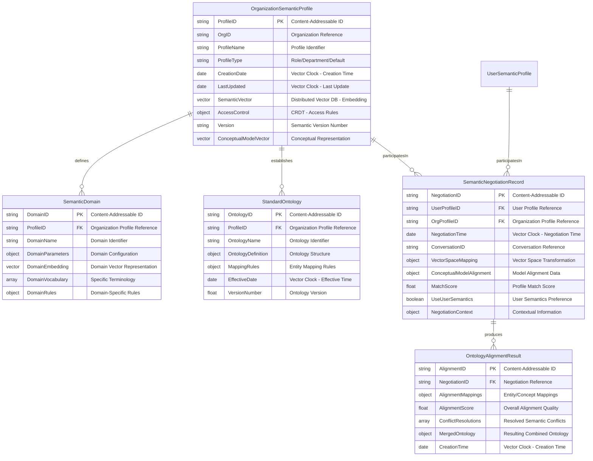
```mermaid
erDiagram
    OrganizationSemanticProfile ||--o{ SemanticDomain : defines
    OrganizationSemanticProfile ||--o{ StandardOntology : establishes
    
    UserSemanticProfile ||--o{ SemanticNegotiationRecord : participatesIn
    OrganizationSemanticProfile ||--o{ SemanticNegotiationRecord : participatesIn
    SemanticNegotiationRecord ||--o{ OntologyAlignmentResult : produces
    
    OrganizationSemanticProfile {
        string ProfileID PK "Content-Addressable ID"
        string OrgID "Organization Reference"
        string ProfileName "Profile Identifier"
        string ProfileType "Role/Department/Default"
        date CreationDate "Vector Clock - Creation Time"
        date LastUpdated "Vector Clock - Last Update"
        vector SemanticVector "Distributed Vector DB - Embedding"
        object AccessControl "CRDT - Access Rules"
        string Version "Semantic Version Number"
        vector ConceptualModelVector "Conceptual Representation"
    }
    
    SemanticDomain {
        string DomainID PK "Content-Addressable ID"
        string ProfileID FK "Organization Profile Reference"
        string DomainName "Domain Identifier"
        object DomainParameters "Domain Configuration"
        vector DomainEmbedding "Domain Vector Representation"
        array DomainVocabulary "Specific Terminology"
        object DomainRules "Domain-Specific Rules"
    }
    
    StandardOntology {
        string OntologyID PK "Content-Addressable ID"
        string ProfileID FK "Organization Profile Reference"
        string OntologyName "Ontology Identifier"
        object OntologyDefinition "Ontology Structure"
        object MappingRules "Entity Mapping Rules"
        date EffectiveDate "Vector Clock - Effective Time"
        float VersionNumber "Ontology Version"
    }
    
    SemanticNegotiationRecord {
        string NegotiationID PK "Content-Addressable ID" 
        string UserProfileID FK "User Profile Reference"
        string OrgProfileID FK "Organization Profile Reference"
        date NegotiationTime "Vector Clock - Negotiation Time"
        string ConversationID "Conversation Reference"
        object VectorSpaceMapping "Vector Space Transformation"
        object ConceptualModelAlignment "Model Alignment Data"
        float MatchScore "Profile Match Score"
        boolean UseUserSemantics "User Semantics Preference"
        object NegotiationContext "Contextual Information"
    }
    
    OntologyAlignmentResult {
        string AlignmentID PK "Content-Addressable ID"
        string NegotiationID FK "Negotiation Reference"
        object AlignmentMappings "Entity/Concept Mappings"
        float AlignmentScore "Overall Alignment Quality"
        array ConflictResolutions "Resolved Semantic Conflicts"
        object MergedOntology "Resulting Combined Ontology"
        date CreationTime "Vector Clock - Creation Time"
    }
```

#### 1.2.5 Conversation Memory Database

A critical component that manages the conversational context and history for IT support interactions, enabling context-aware responses and long-term memory.

Key Tables:
- `ConversationSession`: IT support conversation sessions
- `Message`: Individual messages in IT support conversations
- `ContextualMemory`: Memory related to IT support conversations
- `ConversationState`: State tracking for conversations
- `ConversationSummary`: Summaries of conversations
- `EntityReference`: References to entities in conversations
- `IntentClassification`: Classification of IT support intents
- `EmotionalState`: Emotional state detection

Schema:

```mermaid
erDiagram
    ConversationSession ||--o{ Message : contains
    ConversationSession ||--o{ ContextualMemory : maintains
    ConversationSession ||--o{ ConversationState : tracks
    ConversationSession ||--o{ ConversationSummary : summarizes
    
    Message ||--o{ EntityReference : mentions
    Message ||--o{ IntentClassification : classified_as
    Message ||--o{ EmotionalState : expresses
    
    ConversationSession {
        string SessionID PK "Content-Addressable ID"
        string UserID FK "User Reference"
        date StartTime "Vector Clock - Start Time"
        date EndTime "Vector Clock - End Time"
        string Channel "Communication Channel"
        string Context "Initial Context"
        array TopicChain "Topic Progression"
        string Status "Active/Inactive/Archived"
        float Satisfaction "User Satisfaction Score"
        array MeshLocations "Distributed Storage Locations"
    }
    
    Message {
        string MessageID PK "Content-Addressable ID"
        string SessionID FK "Session Reference"
        string SenderType "User/System/Agent"
        string SenderID "ID of Specific Sender"
        date Timestamp "Vector Clock - Message Time"
        string Content "Message Content"
        object Metadata "Message Properties"
        string ContentType "Text/Voice/Image/etc"
        array ProcessingNodes "Processing History"
    }
    
    ContextualMemory {
        string MemoryID PK "Content-Addressable ID"
        string SessionID FK "Session Reference"
        string MemoryType "Working/Short-term/Long-term"
        string Content "Memory Content"
        date CreationTime "Vector Clock - Creation Time"
        date ExpirationTime "Vector Clock - Expiration Time"
        float Importance "Memory Significance"
        float AccessFrequency "Usage Pattern"
        string ProcessingState "CRDT - Processing Status"
    }
    
    ConversationState {
        string StateID PK "Content-Addressable ID"
        string SessionID FK "Session Reference"
        date Timestamp "Vector Clock - State Time"
        object SemanticContext "Current Understanding"
        array ActiveEntities "Entities in Context"
        array ActiveIntents "Detected Intents"
        string ConversationPhase "Greeting/Discussion/Conclusion"
        object EmotionalContext "Emotional State"
        float Engagement "User Engagement Level"
    }
    
    ConversationSummary {
        string SummaryID PK "Content-Addressable ID"
        string SessionID FK "Session Reference"
        date GenerationTime "Vector Clock - Creation Time"
        string Summary "Conversation Summary"
        array KeyTopics "Main Topics Discussed"
        array KeyEntities "Important Entities"
        array KeyActions "Actions Taken"
        array KeyInsights "Discovered Insights"
        object UserFeedback "Summary Feedback"
    }
    
    EntityReference {
        string ReferenceID PK "Content-Addressable ID"
        string MessageID FK "Message Reference"
        string EntityID "Entity Identifier"
        string EntityType "Person/Place/Organization/etc"
        string MentionType "Direct/Indirect/Anaphoric"
        int PositionStart "Start Position in Text"
        int PositionEnd "End Position in Text"
        float ConfidenceScore "Entity Recognition Confidence"
        object Resolution "Entity Resolution Data"
    }
    
    IntentClassification {
        string ClassificationID PK "Content-Addressable ID"
        string MessageID FK "Message Reference"
        string IntentType "Intent Category"
        string IntentName "Specific Intent"
        float ConfidenceScore "Intent Detection Confidence"
        object Parameters "Intent Parameters"
        object Context "Context Contributing to Classification"
        array AlternativeIntents "Other Possible Intents"
    }
    
    EmotionalState {
        string StateID PK "Content-Addressable ID"
        string MessageID FK "Message Reference"
        object EmotionVector "Emotion Distribution"
        string DominantEmotion "Primary Emotion"
        float Intensity "Emotional Intensity"
        float Valence "Positive/Negative Value"
        float Arousal "Activation Level"
        string DetectionMethod "Analysis Method"
        float ConfidenceScore "Emotion Detection Confidence"
    }
```

#### 1.2.6 Federated Workflow Repository

Stores and manages workflow templates and related metadata for the IT support product, enabling reuse and customization of standard processes.

Key Tables:
- `WorkflowTemplateDefinition`: Core workflow template definitions
- `WorkflowTemplateMetadata`: Metadata about workflow templates
- `WorkflowTestData`: Test data for workflows
- `WorkflowSecurityConstraint`: Security constraints for workflows

Schema:
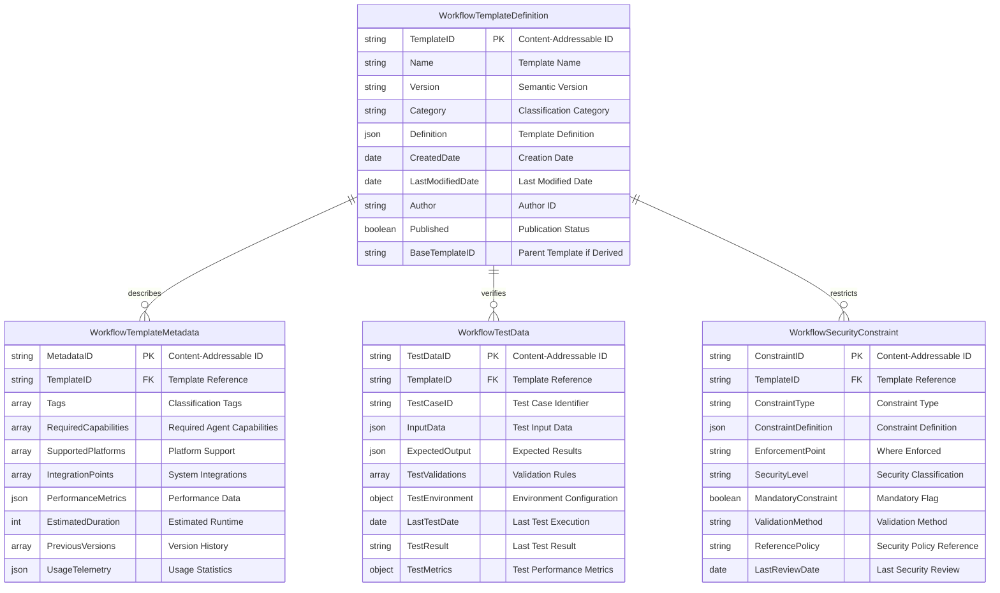
```mermaid
erDiagram
    WorkflowTemplateDefinition ||--o{ WorkflowTemplateMetadata : describes
    WorkflowTemplateDefinition ||--o{ WorkflowTestData : verifies
    WorkflowTemplateDefinition ||--o{ WorkflowSecurityConstraint : restricts
    
    WorkflowTemplateDefinition {
        string TemplateID PK "Content-Addressable ID"
        string Name "Template Name"
        string Version "Semantic Version"
        string Category "Classification Category"
        json Definition "Template Definition"
        date CreatedDate "Creation Date"
        date LastModifiedDate "Last Modified Date"
        string Author "Author ID"
        boolean Published "Publication Status"
        string BaseTemplateID "Parent Template if Derived"
    }
    
    WorkflowTemplateMetadata {
        string MetadataID PK "Content-Addressable ID"
        string TemplateID FK "Template Reference"
        array Tags "Classification Tags"
        array RequiredCapabilities "Required Agent Capabilities"
        array SupportedPlatforms "Platform Support"
        array IntegrationPoints "System Integrations"
        json PerformanceMetrics "Performance Data"
        int EstimatedDuration "Estimated Runtime"
        array PreviousVersions "Version History"
        json UsageTelemetry "Usage Statistics"
    }
    
    WorkflowTestData {
        string TestDataID PK "Content-Addressable ID"
        string TemplateID FK "Template Reference"
        string TestCaseID "Test Case Identifier"
        json InputData "Test Input Data"
        json ExpectedOutput "Expected Results"
        array TestValidations "Validation Rules"
        object TestEnvironment "Environment Configuration"
        date LastTestDate "Last Test Execution"
        string TestResult "Last Test Result"
        object TestMetrics "Test Performance Metrics"
    }
    
    WorkflowSecurityConstraint {
        string ConstraintID PK "Content-Addressable ID"
        string TemplateID FK "Template Reference"
        string ConstraintType "Constraint Type"
        json ConstraintDefinition "Constraint Definition"
        string EnforcementPoint "Where Enforced"
        string SecurityLevel "Security Classification"
        boolean MandatoryConstraint "Mandatory Flag"
        string ValidationMethod "Validation Method"
        string ReferencePolicy "Security Policy Reference"
        date LastReviewDate "Last Security Review"
    }
```

#### 1.2.7 Knowledge Graph Database

Stores structured knowledge about IT systems, concepts, and their relationships to support intelligent IT support operations.

Key Tables:
- `KnowledgeNode`: Nodes in the knowledge graph
- `KnowledgeRelationship`: Relationships between nodes
- `DomainKnowledge`: Domain-specific knowledge structures
- `EntityDefinition`: Definitions of entities in the knowledge graph

Schema:
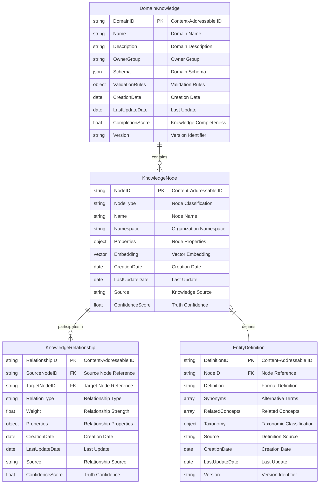
```mermaid
erDiagram
    KnowledgeNode ||--o{ KnowledgeRelationship : participatesIn
    KnowledgeNode }|--|| EntityDefinition : defines
    DomainKnowledge ||--o{ KnowledgeNode : contains
    
    KnowledgeNode {
        string NodeID PK "Content-Addressable ID"
        string NodeType "Node Classification"
        string Name "Node Name"
        string Namespace "Organization Namespace"
        object Properties "Node Properties"
        vector Embedding "Vector Embedding"
        date CreationDate "Creation Date"
        date LastUpdateDate "Last Update"
        string Source "Knowledge Source"
        float ConfidenceScore "Truth Confidence"
    }
    
    KnowledgeRelationship {
        string RelationshipID PK "Content-Addressable ID"
        string SourceNodeID FK "Source Node Reference"
        string TargetNodeID FK "Target Node Reference"
        string RelationType "Relationship Type"
        float Weight "Relationship Strength"
        object Properties "Relationship Properties"
        date CreationDate "Creation Date"
        date LastUpdateDate "Last Update"
        string Source "Relationship Source"
        float ConfidenceScore "Truth Confidence"
    }
    
    DomainKnowledge {
        string DomainID PK "Content-Addressable ID"
        string Name "Domain Name"
        string Description "Domain Description"
        string OwnerGroup "Owner Group"
        json Schema "Domain Schema"
        object ValidationRules "Validation Rules"
        date CreationDate "Creation Date"
        date LastUpdateDate "Last Update"
        float CompletionScore "Knowledge Completeness"
        string Version "Version Identifier"
    }
    
    EntityDefinition {
        string DefinitionID PK "Content-Addressable ID"
        string NodeID FK "Node Reference"
        string Definition "Formal Definition"
        array Synonyms "Alternative Terms"
        array RelatedConcepts "Related Concepts"
        object Taxonomy "Taxonomic Classification"
        string Source "Definition Source"
        date CreationDate "Creation Date"
        date LastUpdateDate "Last Update"
        string Version "Version Identifier"
    }
```

## 2. IT Support MVP Use Cases and Data Flows

The IT Support MVP focuses on four primary use cases as defined in the implementation strategy:

1. Password Reset Automation
2. Account Unlock Automation
3. Basic Software Installation
4. Basic Device Authentication & Diagnostics

### 2.1 UI Screens and Data Flow - Password Reset Automation

This use case enables self-service password reset for common systems with identity verification and success confirmation.

#### 2.1.1 UI Screen Flow

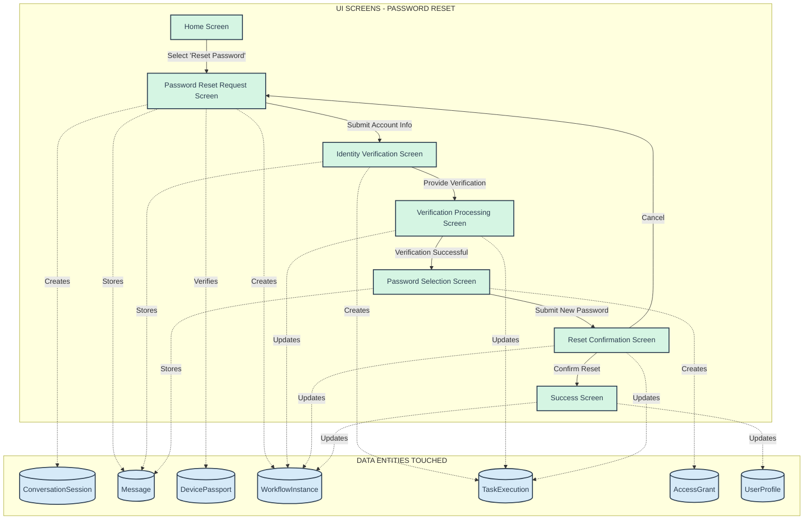
```mermaid
flowchart TD
    subgraph UI_FLOW["UI SCREENS - PASSWORD RESET"]
        S1[Home Screen]
        S2[Password Reset Request Screen]
        S3[Identity Verification Screen]
        S4[Verification Processing Screen]
        S5[Password Selection Screen]
        S6[Reset Confirmation Screen]
        S7[Success Screen]
        
        S1 -->|"Select 'Reset Password'"| S2
        S2 -->|"Submit Account Info"| S3
        S3 -->|"Provide Verification"| S4
        S4 -->|"Verification Successful"| S5
        S5 -->|"Submit New Password"| S6
        S6 -->|"Confirm Reset"| S7
        S6 -->|"Cancel"| S2
    end
    
    subgraph DATA_FLOW["DATA ENTITIES TOUCHED"]
        D1[(ConversationSession)]
        D2[(Message)]
        D3[(DevicePassport)]
        D4[(WorkflowInstance)]
        D5[(TaskExecution)]
        D6[(AccessGrant)]
        D7[(UserProfile)]
        
        S2 -.->|"Creates"| D1
        S2 -.->|"Stores"| D2
        S2 -.->|"Verifies"| D3
        S2 -.->|"Creates"| D4
        
        S3 -.->|"Stores"| D2
        S3 -.->|"Creates"| D5
        
        S4 -.->|"Updates"| D4
        S4 -.->|"Updates"| D5
        
        S5 -.->|"Stores"| D2
        S5 -.->|"Creates"| D6
        
        S6 -.->|"Updates"| D4
        S6 -.->|"Updates"| D5
        
        S7 -.->|"Updates"| D4
        S7 -.->|"Updates"| D7
    end
    
    classDef uiScreen fill:#D5F5E3,stroke:#2C3E50,stroke-width:2px,color:#2C3E50
    classDef dataEntity fill:#D6EAF8,stroke:#2C3E50,stroke-width:2px,color:#2C3E50
    
    class S1,S2,S3,S4,S5,S6,S7 uiScreen
    class D1,D2,D3,D4,D5,D6,D7 dataEntity
```

#### 2.1.2 Detailed Data Flow

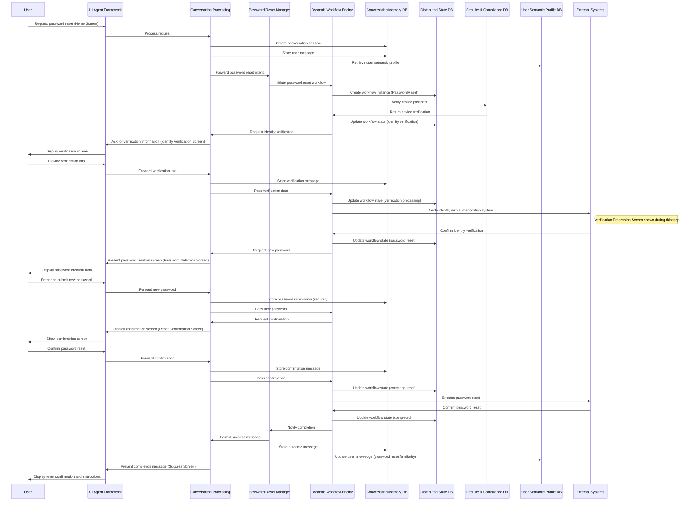
```mermaid
sequenceDiagram
    participant User
    participant UI as UI Agent Framework
    participant CP as Conversation Processing
    participant PRM as Password Reset Manager
    participant DWE as Dynamic Workflow Engine
    participant CMDB as Conversation Memory DB
    participant DSDB as Distributed State DB
    participant SCDB as Security & Compliance DB
    participant USPDB as User Semantic Profile DB
    participant ES as External Systems

    User->>UI: Request password reset (Home Screen)
    UI->>CP: Process request
    CP->>CMDB: Create conversation session
    CP->>CMDB: Store user message
    CP->>USPDB: Retrieve user semantic profile
    
    CP->>PRM: Forward password reset intent
    PRM->>DWE: Initiate password reset workflow
    
    DWE->>DSDB: Create workflow instance (PasswordReset)
    
    DWE->>SCDB: Verify device passport
    SCDB->>DWE: Return device verification
    
    DWE->>DSDB: Update workflow state (identity verification)
    DWE->>CP: Request identity verification
    CP->>UI: Ask for verification information (Identity Verification Screen)
    UI->>User: Display verification screen
    
    User->>UI: Provide verification info
    UI->>CP: Forward verification info
    CP->>CMDB: Store verification message
    CP->>DWE: Pass verification data
    
    DWE->>DSDB: Update workflow state (verification processing)
    DWE->>ES: Verify identity with authentication system
    Note right of ES: Verification Processing Screen shown during this step
    ES->>DWE: Confirm identity verification
    
    DWE->>DSDB: Update workflow state (password reset)
    DWE->>CP: Request new password
    CP->>UI: Present password creation screen (Password Selection Screen)
    UI->>User: Display password creation form

    User->>UI: Enter and submit new password
    UI->>CP: Forward new password
    CP->>CMDB: Store password submission (securely)
    CP->>DWE: Pass new password
    
    DWE->>CP: Request confirmation
    CP->>UI: Display confirmation screen (Reset Confirmation Screen)
    UI->>User: Show confirmation screen
    
    User->>UI: Confirm password reset
    UI->>CP: Forward confirmation
    CP->>CMDB: Store confirmation message
    CP->>DWE: Pass confirmation
    
    DWE->>DSDB: Update workflow state (executing reset)
    DWE->>ES: Execute password reset
    ES->>DWE: Confirm password reset
    
    DWE->>DSDB: Update workflow state (completed)
    DWE->>PRM: Notify completion
    PRM->>CP: Format success message
    
    CP->>CMDB: Store outcome message
    CP->>USPDB: Update user knowledge (password reset familiarity)
    
    CP->>UI: Present completion message (Success Screen)
    UI->>User: Display reset confirmation and instructions
```

#### 2.1.3 Database Operations for Password Reset

| Step | UI Screen | Database | Operation | Description |
|------|-----------|----------|-----------|-------------|
| 1 | Password Reset Request | CMDB | Insert | Create `ConversationSession` for password reset interaction |
| 2 | Password Reset Request | CMDB | Insert | Store initial `Message` with password reset request |
| 3 | Password Reset Request | USPDB | Select | Retrieve `UserSemanticProfile` for personalized interaction |
| 4 | Password Reset Request | DSDB | Insert | Create `DistributedWorkflowInstance` for password reset |
| 5 | Password Reset Request | SCDB | Select | Verify `DevicePassport` and `DeviceAttestation` |
| 6 | Identity Verification | DSDB | Update | Update workflow state to identity verification |
| 7 | Identity Verification | CMDB | Insert | Store verification request `Message` |
| 8 | Verification Processing | CMDB | Insert | Store user verification response `Message` |
| 9 | Verification Processing | DSDB | Update | Update workflow state to verification processing |
| 10 | Password Selection | DSDB | Update | Update workflow state to password reset execution |
| 11 | Password Selection | CMDB | Insert | Store password submission `Message` (securely) |
| 12 | Reset Confirmation | CMDB | Insert | Store confirmation `Message` |
| 13 | Reset Confirmation | DSDB | Update | Update workflow state to executing reset |
| 14 | Success | DSDB | Update | Update workflow state to completed |
| 15 | Success | CMDB | Insert | Store outcome `Message` |
| 16 | Success | USPDB | Update | Update `EntityFamiliarity` for password reset concepts |
| 17 | Success | DSDB | Insert | Create `DistributedEvent` for successful completion |

### 2.2 UI Screens and Data Flow - Account Unlock Automation

This use case enables self-service account unlock with security verification and access restoration.

#### 2.2.1 UI Screen Flow

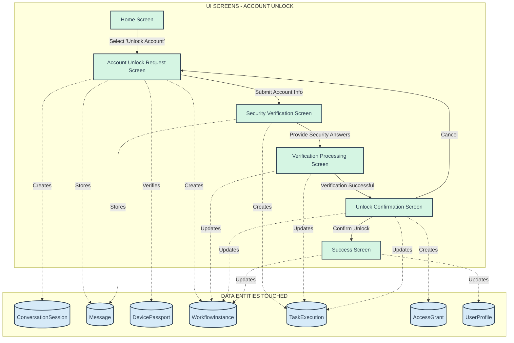
```mermaid
flowchart TD
    subgraph UI_FLOW["UI SCREENS - ACCOUNT UNLOCK"]
        S1[Home Screen]
        S2[Account Unlock Request Screen]
        S3[Security Verification Screen]
        S4[Verification Processing Screen]
        S5[Unlock Confirmation Screen]
        S6[Success Screen]
        
        S1 -->|"Select 'Unlock Account'"| S2
        S2 -->|"Submit Account Info"| S3
        S3 -->|"Provide Security Answers"| S4
        S4 -->|"Verification Successful"| S5
        S5 -->|"Confirm Unlock"| S6
        S5 -->|"Cancel"| S2
    end
    
    subgraph DATA_FLOW["DATA ENTITIES TOUCHED"]
        D1[(ConversationSession)]
        D2[(Message)]
        D3[(DevicePassport)]
        D4[(WorkflowInstance)]
        D5[(TaskExecution)]
        D6[(AccessGrant)]
        D7[(UserProfile)]
        
        S2 -.->|"Creates"| D1
        S2 -.->|"Stores"| D2
        S2 -.->|"Verifies"| D3
        S2 -.->|"Creates"| D4
        
        S3 -.->|"Stores"| D2
        S3 -.->|"Creates"| D5
        
        S4 -.->|"Updates"| D4
        S4 -.->|"Updates"| D5
        
        S5 -.->|"Updates"| D4
        S5 -.->|"Updates"| D5
        S5 -.->|"Creates"| D6
        
        S6 -.->|"Updates"| D4
        S6 -.->|"Updates"| D7
    end
    
    classDef uiScreen fill:#D5F5E3,stroke:#2C3E50,stroke-width:2px,color:#2C3E50
    classDef dataEntity fill:#D6EAF8,stroke:#2C3E50,stroke-width:2px,color:#2C3E50
    
    class S1,S2,S3,S4,S5,S6 uiScreen
    class D1,D2,D3,D4,D5,D6,D7 dataEntity
```

#### 2.2.2 Detailed Data Flow

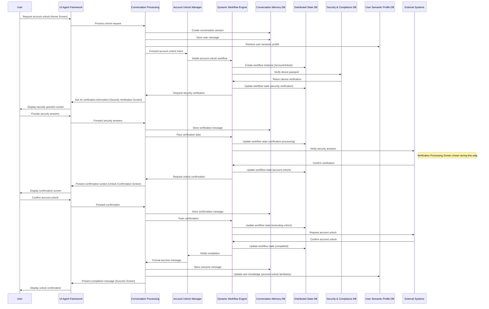
```mermaid
sequenceDiagram
    participant User
    participant UI as UI Agent Framework
    participant CP as Conversation Processing
    participant ALM as Account Unlock Manager
    participant DWE as Dynamic Workflow Engine
    participant CMDB as Conversation Memory DB
    participant DSDB as Distributed State DB
    participant SCDB as Security & Compliance DB
    participant USPDB as User Semantic Profile DB
    participant ES as External Systems

    User->>UI: Request account unlock (Home Screen)
    UI->>CP: Process unlock request
    CP->>CMDB: Create conversation session
    CP->>CMDB: Store user message
    CP->>USPDB: Retrieve user semantic profile
    
    CP->>ALM: Forward account unlock intent
    ALM->>DWE: Initiate account unlock workflow
    
    DWE->>DSDB: Create workflow instance (AccountUnlock)
    
    DWE->>SCDB: Verify device passport
    SCDB->>DWE: Return device verification
    
    DWE->>DSDB: Update workflow state (security verification)
    DWE->>CP: Request security verification
    CP->>UI: Ask for verification information (Security Verification Screen)
    UI->>User: Display security question screen
    
    User->>UI: Provide security answers
    UI->>CP: Forward security answers
    CP->>CMDB: Store verification message
    CP->>DWE: Pass verification data
    
    DWE->>DSDB: Update workflow state (verification processing)
    DWE->>ES: Verify security answers
    Note right of ES: Verification Processing Screen shown during this step
    ES->>DWE: Confirm verification
    
    DWE->>DSDB: Update workflow state (account unlock)
    DWE->>CP: Request unlock confirmation
    CP->>UI: Present confirmation screen (Unlock Confirmation Screen)
    UI->>User: Display confirmation screen
    
    User->>UI: Confirm account unlock
    UI->>CP: Forward confirmation
    CP->>CMDB: Store confirmation message
    CP->>DWE: Pass confirmation
    
    DWE->>DSDB: Update workflow state (executing unlock)
    DWE->>ES: Request account unlock
    ES->>DWE: Confirm account unlock
    
    DWE->>DSDB: Update workflow state (completed)
    DWE->>ALM: Notify completion
    ALM->>CP: Format success message
    
    CP->>CMDB: Store outcome message
    CP->>USPDB: Update user knowledge (account unlock familiarity)
    
    CP->>UI: Present completion message (Success Screen)
    UI->>User: Display unlock confirmation
```

#### 2.2.3 Database Operations for Account Unlock

| Step | UI Screen | Database | Operation | Description |
|------|-----------|----------|-----------|-------------|
| 1 | Account Unlock Request | CMDB | Insert | Create `ConversationSession` for account unlock interaction |
| 2 | Account Unlock Request | CMDB | Insert | Store initial `Message` with account unlock request |
| 3 | Account Unlock Request | USPDB | Select | Retrieve `UserSemanticProfile` for personalized interaction |
| 4 | Account Unlock Request | DSDB | Insert | Create `DistributedWorkflowInstance` for account unlock |
| 5 | Account Unlock Request | SCDB | Select | Verify `DevicePassport` and `DeviceAttestation` |
| 6 | Security Verification | DSDB | Update | Update workflow state to security verification |
| 7 | Security Verification | CMDB | Insert | Store verification request `Message` |
| 8 | Verification Processing | CMDB | Insert | Store user verification response `Message` |
| 9 | Verification Processing | DSDB | Update | Update workflow state to verification processing |
| 10 | Unlock Confirmation | DSDB | Update | Update workflow state to account unlock execution |
| 11 | Unlock Confirmation | CMDB | Insert | Store confirmation `Message` |
| 12 | Unlock Confirmation | DSDB | Update | Update workflow state to executing unlock |
| 13 | Success | DSDB | Update | Update workflow state to completed |
| 14 | Success | CMDB | Insert | Store outcome `Message` |
| 15 | Success | USPDB | Update | Update `EntityFamiliarity` for account unlock concepts |
| 16 | Success | DSDB | Insert | Create `DistributedEvent` for successful completion |
| 17 | Success | SCDB | Insert | Create `AccessGrant` for restored access |

### 2.3 UI Screens and Data Flow - Basic Software Installation

This use case provides guidance for common application installation and deployment automation.

#### 2.3.1 UI Screen Flow

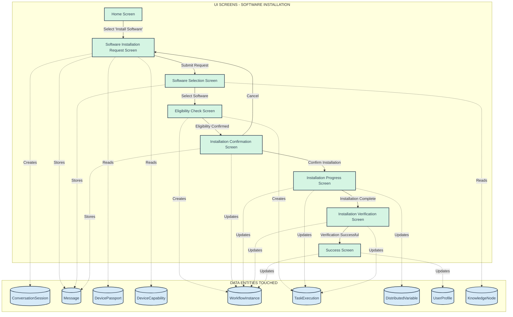
```mermaid
flowchart TD
    subgraph UI_FLOW["UI SCREENS - SOFTWARE INSTALLATION"]
        S1[Home Screen]
        S2[Software Installation Request Screen]
        S3[Software Selection Screen]
        S4[Eligibility Check Screen]
        S5[Installation Confirmation Screen]
        S6[Installation Progress Screen]
        S7[Installation Verification Screen]
        S8[Success Screen]
        
        S1 -->|"Select 'Install Software'"| S2
        S2 -->|"Submit Request"| S3
        S3 -->|"Select Software"| S4
        S4 -->|"Eligibility Confirmed"| S5
        S5 -->|"Confirm Installation"| S6
        S6 -->|"Installation Complete"| S7
        S7 -->|"Verification Successful"| S8
        S5 -->|"Cancel"| S2
    end
    
    subgraph DATA_FLOW["DATA ENTITIES TOUCHED"]
        D1[(ConversationSession)]
        D2[(Message)]
        D3[(DevicePassport)]
        D4[(DeviceCapability)]
        D5[(WorkflowInstance)]
        D6[(TaskExecution)]
        D7[(DistributedVariable)]
        D8[(UserProfile)]
        D9[(KnowledgeNode)]
        
        S2 -.->|"Creates"| D1
        S2 -.->|"Stores"| D2
        S2 -.->|"Reads"| D3
        S2 -.->|"Reads"| D4
        
        S3 -.->|"Stores"| D2
        S3 -.->|"Reads"| D9
        
        S4 -.->|"Creates"| D5
        S4 -.->|"Creates"| D6
        
        S5 -.->|"Stores"| D2
        S5 -.->|"Updates"| D5
        
        S6 -.->|"Updates"| D5
        S6 -.->|"Updates"| D6
        S6 -.->|"Updates"| D7
        
        S7 -.->|"Updates"| D5
        S7 -.->|"Updates"| D6
        
        S8 -.->|"Updates"| D5
        S8 -.->|"Updates"| D8
    end
    
    classDef uiScreen fill:#D5F5E3,stroke:#2C3E50,stroke-width:2px,color:#2C3E50
    classDef dataEntity fill:#D6EAF8,stroke:#2C3E50,stroke-width:2px,color:#2C3E50
    
    class S1,S2,S3,S4,S5,S6,S7,S8 uiScreen
    class D1,D2,D3,D4,D5,D6,D7,D8,D9 dataEntity
```

#### 2.3.2 Detailed Data Flow

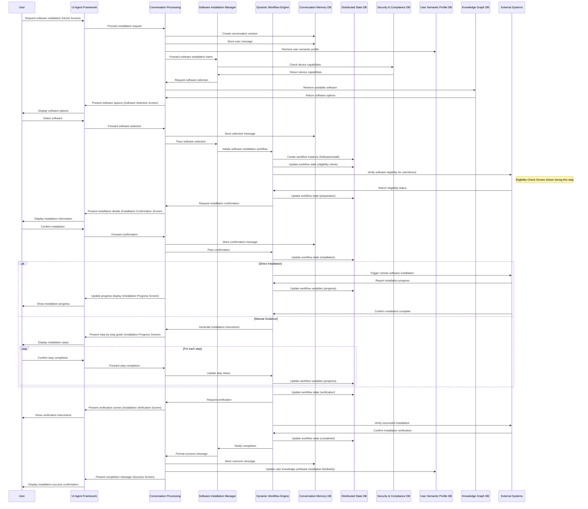
```mermaid
sequenceDiagram
    participant User
    participant UI as UI Agent Framework
    participant CP as Conversation Processing
    participant SIM as Software Installation Manager
    participant DWE as Dynamic Workflow Engine
    participant CMDB as Conversation Memory DB
    participant DSDB as Distributed State DB
    participant SCDB as Security & Compliance DB
    participant USPDB as User Semantic Profile DB
    participant KGDB as Knowledge Graph DB
    participant ES as External Systems

    User->>UI: Request software installation (Home Screen)
    UI->>CP: Process installation request
    CP->>CMDB: Create conversation session
    CP->>CMDB: Store user message
    CP->>USPDB: Retrieve user semantic profile
    
    CP->>SIM: Forward software installation intent
    SIM->>SCDB: Check device capabilities
    SCDB->>SIM: Return device capabilities
    
    SIM->>CP: Request software selection
    CP->>KGDB: Retrieve available software
    KGDB->>CP: Return software options
    CP->>UI: Present software options (Software Selection Screen)
    UI->>User: Display software options
    
    User->>UI: Select software
    UI->>CP: Forward software selection
    CP->>CMDB: Store selection message
    CP->>SIM: Pass software selection
    
    SIM->>DWE: Initiate software installation workflow
    DWE->>DSDB: Create workflow instance (SoftwareInstall)
    
    DWE->>DSDB: Update workflow state (eligibility check)
    DWE->>ES: Verify software eligibility for user/device
    Note right of ES: Eligibility Check Screen shown during this step
    ES->>DWE: Return eligibility status
    
    DWE->>DSDB: Update workflow state (preparation)
    DWE->>CP: Request installation confirmation
    CP->>UI: Present installation details (Installation Confirmation Screen)
    UI->>User: Display installation information
    
    User->>UI: Confirm installation
    UI->>CP: Forward confirmation
    CP->>CMDB: Store confirmation message
    CP->>DWE: Pass confirmation
    
    DWE->>DSDB: Update workflow state (installation)
    
    alt Direct Installation
        DWE->>ES: Trigger remote software installation
        ES->>DWE: Report installation progress
        DWE->>DSDB: Update workflow variables (progress)
        CP->>UI: Update progress display (Installation Progress Screen)
        UI->>User: Show installation progress
        ES->>DWE: Confirm installation complete
    else Manual Guidance
        DWE->>CP: Generate installation instructions
        CP->>UI: Present step-by-step guide (Installation Progress Screen)
        UI->>User: Display installation steps
        
        loop For each step
            User->>UI: Confirm step completion
            UI->>CP: Forward step completion
            CP->>DWE: Update step status
            DWE->>DSDB: Update workflow variables (progress)
        end
    end
    
    DWE->>DSDB: Update workflow state (verification)
    DWE->>CP: Request verification
    CP->>UI: Present verification screen (Installation Verification Screen)
    UI->>User: Show verification instructions
    
    DWE->>ES: Verify successful installation
    ES->>DWE: Confirm installation verification
    
    DWE->>DSDB: Update workflow state (completed)
    DWE->>SIM: Notify completion
    SIM->>CP: Format success message
    
    CP->>CMDB: Store outcome message
    CP->>USPDB: Update user knowledge (software installation familiarity)
    
    CP->>UI: Present completion message (Success Screen)
    UI->>User: Display installation success confirmation
```

#### 2.3.3 Database Operations for Software Installation

| Step | UI Screen | Database | Operation | Description |
|------|-----------|----------|-----------|-------------|
| 1 | Software Installation Request | CMDB | Insert | Create `ConversationSession` for software installation |
| 2 | Software Installation Request | CMDB | Insert | Store initial `Message` with installation request |
| 3 | Software Installation Request | USPDB | Select | Retrieve `UserSemanticProfile` for personalized interaction |
| 4 | Software Installation Request | SCDB | Select | Check `DeviceCapability` for installation eligibility |
| 5 | Software Selection | KGDB | Select | Retrieve software options from `KnowledgeNode` |
| 6 | Software Selection | CMDB | Insert | Store software selection `Message` |
| 7 | Eligibility Check | DSDB | Insert | Create `DistributedWorkflowInstance` for software installation |
| 8 | Eligibility Check | DSDB | Update | Update workflow state to eligibility check |
| 9 | Installation Confirmation | DSDB | Update | Update workflow state to preparation |
| 10 | Installation Confirmation | CMDB | Insert | Store installation confirmation request `Message` |
| 11 | Installation Confirmation | CMDB | Insert | Store user confirmation response `Message` |
| 12 | Installation Progress | DSDB | Update | Update workflow state to installation |
| 13 | Installation Progress | DSDB | Update | Update `DistributedVariable` for installation progress |
| 14 | Installation Verification | DSDB | Update | Update workflow state to verification |
| 15 | Success | DSDB | Update | Update workflow state to completed |
| 16 | Success | CMDB | Insert | Store outcome `Message` |
| 17 | Success | USPDB | Update | Update `EntityFamiliarity` for software installation concepts |
| 18 | Success | DSDB | Insert | Create `DistributedEvent` for successful completion |

### 2.4 UI Screens and Data Flow - Basic Device Authentication & Diagnostics

This use case enables secure device identification, verification, and basic hardware diagnostics.

#### 2.4.1 UI Screen Flow

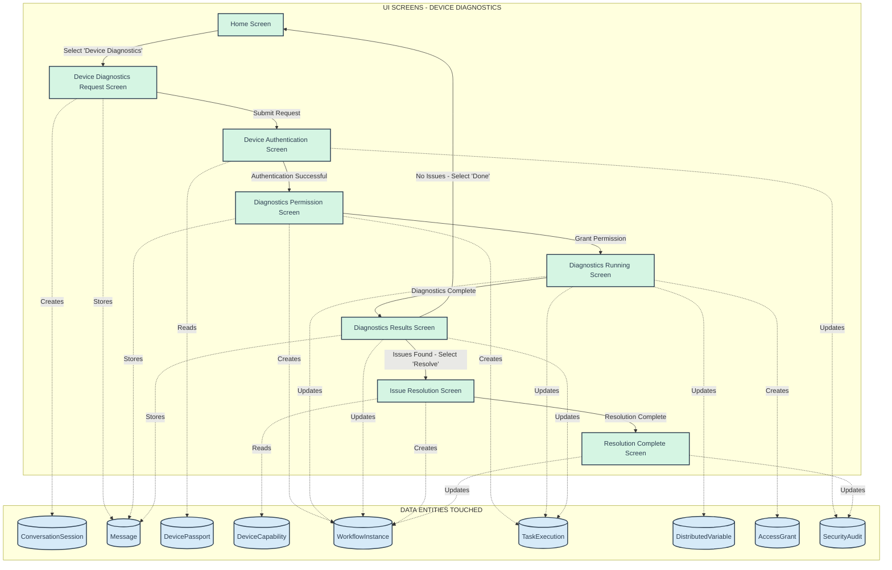
```mermaid
flowchart TD
    subgraph UI_FLOW["UI SCREENS - DEVICE DIAGNOSTICS"]
        S1[Home Screen]
        S2[Device Diagnostics Request Screen]
        S3[Device Authentication Screen]
        S4[Diagnostics Permission Screen]
        S5[Diagnostics Running Screen]
        S6[Diagnostics Results Screen]
        S7[Issue Resolution Screen]
        S8[Resolution Complete Screen]
        
        S1 -->|"Select 'Device Diagnostics'"| S2
        S2 -->|"Submit Request"| S3
        S3 -->|"Authentication Successful"| S4
        S4 -->|"Grant Permission"| S5
        S5 -->|"Diagnostics Complete"| S6
        S6 -->|"Issues Found - Select 'Resolve'"| S7
        S7 -->|"Resolution Complete"| S8
        S6 -->|"No Issues - Select 'Done'"| S1
    end
    
    subgraph DATA_FLOW["DATA ENTITIES TOUCHED"]
        D1[(ConversationSession)]
        D2[(Message)]
        D3[(DevicePassport)]
        D4[(DeviceCapability)]
        D5[(WorkflowInstance)]
        D6[(TaskExecution)]
        D7[(DistributedVariable)]
        D8[(AccessGrant)]
        D9[(SecurityAudit)]
        
        S2 -.->|"Creates"| D1
        S2 -.->|"Stores"| D2
        
        S3 -.->|"Reads"| D3
        S3 -.->|"Updates"| D9
        
        S4 -.->|"Stores"| D2
        S4 -.->|"Creates"| D5
        S4 -.->|"Creates"| D6
        
        S5 -.->|"Creates"| D8
        S5 -.->|"Updates"| D5
        S5 -.->|"Updates"| D6
        S5 -.->|"Updates"| D7
        
        S6 -.->|"Updates"| D5
        S6 -.->|"Updates"| D6
        S6 -.->|"Stores"| D2
        
        S7 -.->|"Creates"| D5
        S7 -.->|"Reads"| D4
        
        S8 -.->|"Updates"| D5
        S8 -.->|"Updates"| D9
    end
    
    classDef uiScreen fill:#D5F5E3,stroke:#2C3E50,stroke-width:2px,color:#2C3E50
    classDef dataEntity fill:#D6EAF8,stroke:#2C3E50,stroke-width:2px,color:#2C3E50
    
    class S1,S2,S3,S4,S5,S6,S7,S8 uiScreen
    class D1,D2,D3,D4,D5,D6,D7,D8,D9 dataEntity
```

#### 2.4.2 Detailed Data Flow

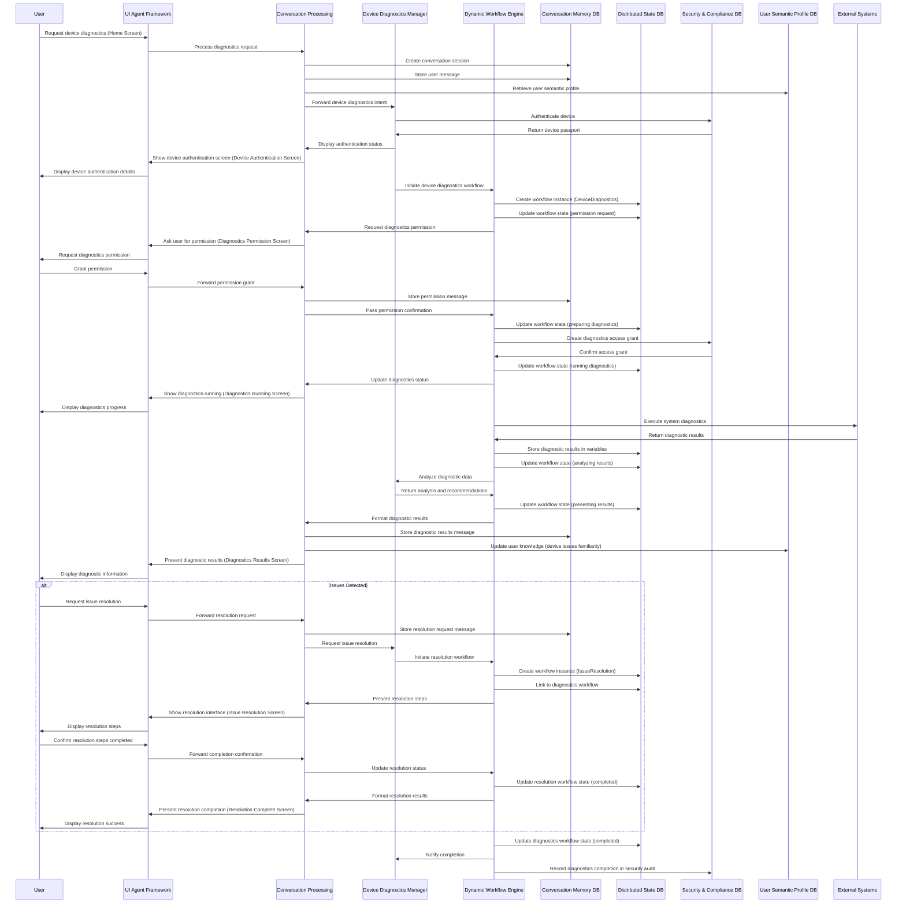
```mermaid
sequenceDiagram
    participant User
    participant UI as UI Agent Framework
    participant CP as Conversation Processing
    participant DDM as Device Diagnostics Manager
    participant DWE as Dynamic Workflow Engine
    participant CMDB as Conversation Memory DB
    participant DSDB as Distributed State DB
    participant SCDB as Security & Compliance DB
    participant USPDB as User Semantic Profile DB
    participant ES as External Systems

    User->>UI: Request device diagnostics (Home Screen)
    UI->>CP: Process diagnostics request
    CP->>CMDB: Create conversation session
    CP->>CMDB: Store user message
    CP->>USPDB: Retrieve user semantic profile
    
    CP->>DDM: Forward device diagnostics intent
    
    DDM->>SCDB: Authenticate device
    SCDB->>DDM: Return device passport
    
    DDM->>CP: Display authentication status
    CP->>UI: Show device authentication screen (Device Authentication Screen)
    UI->>User: Display device authentication details
    
    DDM->>DWE: Initiate device diagnostics workflow
    
    DWE->>DSDB: Create workflow instance (DeviceDiagnostics)
    
    DWE->>DSDB: Update workflow state (permission request)
    DWE->>CP: Request diagnostics permission
    CP->>UI: Ask user for permission (Diagnostics Permission Screen)
    UI->>User: Request diagnostics permission
    
    User->>UI: Grant permission
    UI->>CP: Forward permission grant
    CP->>CMDB: Store permission message
    CP->>DWE: Pass permission confirmation
    
    DWE->>DSDB: Update workflow state (preparing diagnostics)
    DWE->>SCDB: Create diagnostics access grant
    SCDB->>DWE: Confirm access grant
    
    DWE->>DSDB: Update workflow state (running diagnostics)
    DWE->>CP: Update diagnostics status
    CP->>UI: Show diagnostics running (Diagnostics Running Screen)
    UI->>User: Display diagnostics progress
    
    DWE->>ES: Execute system diagnostics
    ES->>DWE: Return diagnostic results
    
    DWE->>DSDB: Store diagnostic results in variables
    DWE->>DSDB: Update workflow state (analyzing results)
    
    DWE->>DDM: Analyze diagnostic data
    DDM->>DWE: Return analysis and recommendations
    
    DWE->>DSDB: Update workflow state (presenting results)
    DWE->>CP: Format diagnostic results
    
    CP->>CMDB: Store diagnostic results message
    CP->>USPDB: Update user knowledge (device issues familiarity)
    
    CP->>UI: Present diagnostic results (Diagnostics Results Screen)
    UI->>User: Display diagnostic information
    
    alt Issues Detected
        User->>UI: Request issue resolution
        UI->>CP: Forward resolution request
        CP->>CMDB: Store resolution request message
        CP->>DDM: Request issue resolution
        DDM->>DWE: Initiate resolution workflow
        DWE->>DSDB: Create workflow instance (IssueResolution)
        DWE->>DSDB: Link to diagnostics workflow
        
        DWE->>CP: Present resolution steps
        CP->>UI: Show resolution interface (Issue Resolution Screen)
        UI->>User: Display resolution steps
        
        User->>UI: Confirm resolution steps completed
        UI->>CP: Forward completion confirmation
        CP->>DWE: Update resolution status
        
        DWE->>DSDB: Update resolution workflow state (completed)
        DWE->>CP: Format resolution results
        CP->>UI: Present resolution completion (Resolution Complete Screen)
        UI->>User: Display resolution success
    end
    
    DWE->>DSDB: Update diagnostics workflow state (completed)
    DWE->>DDM: Notify completion
    DWE->>SCDB: Record diagnostics completion in security audit
```

#### 2.4.3 Database Operations for Device Authentication & Diagnostics

| Step | UI Screen | Database | Operation | Description |
|------|-----------|----------|-----------|-------------|
| 1 | Device Diagnostics Request | CMDB | Insert | Create `ConversationSession` for device diagnostics |
| 2 | Device Diagnostics Request | CMDB | Insert | Store initial `Message` with diagnostics request |
| 3 | Device Diagnostics Request | USPDB | Select | Retrieve `UserSemanticProfile` for personalized interaction |
| 4 | Device Authentication | SCDB | Select | Authenticate device using `DevicePassport` |
| 5 | Device Authentication | SCDB | Insert | Create `SecurityAudit` record for authentication |
| 6 | Diagnostics Permission | DSDB | Insert | Create `DistributedWorkflowInstance` for device diagnostics |
| 7 | Diagnostics Permission | DSDB | Update | Update workflow state to permission request |
| 8 | Diagnostics Permission | CMDB | Insert | Store permission request `Message` |
| 9 | Diagnostics Permission | CMDB | Insert | Store user permission response `Message` |
| 10 | Diagnostics Running | DSDB | Update | Update workflow state to preparing diagnostics |
| 11 | Diagnostics Running | SCDB | Insert | Create temporary `AccessGrant` for diagnostics |
| 12 | Diagnostics Running | DSDB | Update | Update workflow state to running diagnostics |
| 13 | Diagnostics Running | DSDB | Insert | Store diagnostic results in `DistributedVariable` |
| 14 | Diagnostics Results | DSDB | Update | Update workflow state to analyzing results |
| 15 | Diagnostics Results | DSDB | Update | Update workflow state to presenting results |
| 16 | Diagnostics Results | CMDB | Insert | Store diagnostic results `Message` |
| 17 | Diagnostics Results | USPDB | Update | Update `EntityFamiliarity` for device-related concepts |
| 18 | Issue Resolution | DSDB | Insert | Create `DistributedWorkflowInstance` for issue resolution (if needed) |
| 19 | Issue Resolution | SCDB | Select | Read `DeviceCapability` for resolution options |
| 20 | Resolution Complete | DSDB | Update | Update workflow state to completed |
| 21 | Resolution Complete | SCDB | Update | Update `SecurityAudit` with diagnostics results |
| 22 | Resolution Complete | DSDB | Insert | Create `DistributedEvent` for successful completion |

## 3. Database Cross-Component Data Flows

The ME.AI architecture relies on cross-component data flows between database systems. These flows are critical to enable the distributed mesh architecture where multiple components interact in a peer-to-peer manner rather than through a centralized orchestrator. Here are the key data flows relevant to the IT Support MVP:

### 3.1 User Profile and Conversation Context Flow

This flow shows how the system manages user profiles and conversation context to deliver personalized IT support interactions.

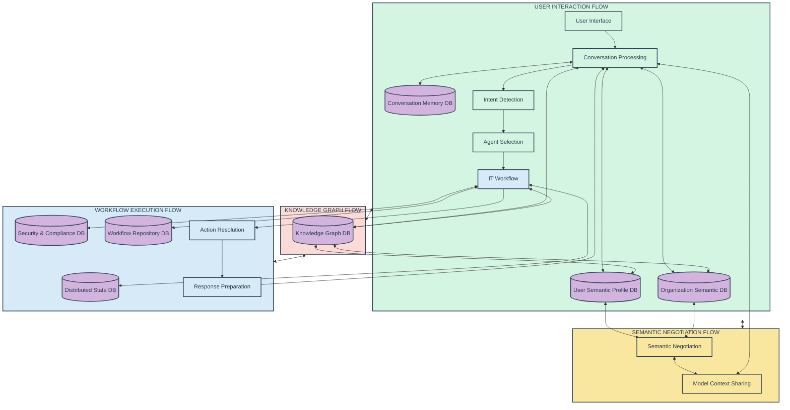
```mermaid
flowchart TD
    subgraph UIF["USER INTERACTION FLOW"]
        UI[User Interface] --> CP[Conversation Processing]
        CP <--> CMDB[(Conversation Memory DB)]
        CP <--> USPDB[(User Semantic Profile DB)]
        CP <--> OSDB[(Organization Semantic DB)]
        CP --> PD[Intent Detection]
        PD --> AS[Agent Selection]
        AS --> IWF[IT Workflow]
    end
    
    subgraph SNF["SEMANTIC NEGOTIATION FLOW"]
        USPDB <--> SN[Semantic Negotiation]
        OSDB <--> SN
        SN <--> MCS[Model Context Sharing]
        MCS <--> CP
    end
    
    subgraph WFF["WORKFLOW EXECUTION FLOW"]
        IWF[IT Workflow] <--> DSDB[(Distributed State DB)]
        IWF <--> SCDB[(Security & Compliance DB)]
        IWF <--> FWRDB[(Workflow Repository DB)]
        IWF --> AR[Action Resolution]
        AR --> RP[Response Preparation]
        RP --> CP
    end
    
    subgraph KGF["KNOWLEDGE GRAPH FLOW"]
        CP <--> KGDB[(Knowledge Graph DB)]
        IWF <--> KGDB
        KGDB <--> USPDB
        KGDB <--> OSDB
    end
    
    SNF <--> UIF
    KGF <--> UIF
    KGF <--> WFF
    
    classDef uiFlow fill:#D5F5E3,stroke:#2C3E50,stroke-width:2px,color:#2C3E50
    classDef snFlow fill:#F9E79F,stroke:#2C3E50,stroke-width:2px,color:#2C3E50
    classDef wfFlow fill:#D6EAF8,stroke:#2C3E50,stroke-width:2px,color:#2C3E50
    classDef kgFlow fill:#FADBD8,stroke:#2C3E50,stroke-width:2px,color:#2C3E50
    classDef dbNode fill:#D2B4DE,stroke:#2C3E50,stroke-width:2px,color:#2C3E50
    
    class UIF,UI,CP,PD,AS uiFlow
    class SNF,SN,MCS snFlow
    class WFF,IWF,AR,RP wfFlow
    class KGF kgFlow
    class CMDB,USPDB,OSDB,DSDB,SCDB,FWRDB,KGDB dbNode
```

### 3.2 Device Authentication and Passport Flow

The Device Passport infrastructure is essential to the IT Support MVP, enabling secure device authentication and management.

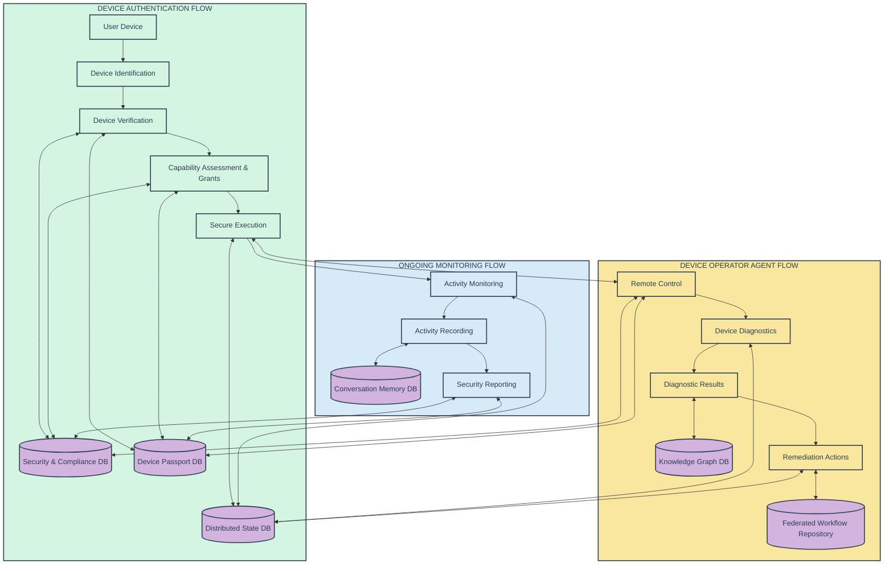
```mermaid
flowchart TD
    subgraph DAF["DEVICE AUTHENTICATION FLOW"]
        UI[User Device] --> DID[Device Identification]
        DID --> DV[Device Verification]
        DV <--> SCDB[(Security & Compliance DB)]
        DV <--> DPD[(Device Passport DB)]
        DV --> CAG[Capability Assessment & Grants]
        CAG <--> SCDB
        CAG <--> DPD
        CAG --> SE[Secure Execution]
        SE <--> DSDB[(Distributed State DB)]
    end
    
    subgraph OMF["ONGOING MONITORING FLOW"]
        SE --> AM[Activity Monitoring]
        AM <--> DSDB
        AM --> AR[Activity Recording]
        AR <--> CMDB[(Conversation Memory DB)]
        AR --> SR[Security Reporting]
        SR <--> SCDB
        SR <--> DPD
    end
    
    subgraph DOA["DEVICE OPERATOR AGENT FLOW"]
        SE <--> RC[Remote Control]
        RC <--> DPD
        RC <--> SCDB
        RC --> DD[Device Diagnostics]
        DD <--> DSDB
        DD --> DR[Diagnostic Results]
        DR <--> KGDB[(Knowledge Graph DB)]
        DR --> RA[Remediation Actions]
        RA <--> DSDB
        RA <--> FWRDB[(Federated Workflow Repository)]
    end
    
    classDef authFlow fill:#D5F5E3,stroke:#2C3E50,stroke-width:2px,color:#2C3E50
    classDef monFlow fill:#D6EAF8,stroke:#2C3E50,stroke-width:2px,color:#2C3E50
    classDef doaFlow fill:#F9E79F,stroke:#2C3E50,stroke-width:2px,color:#2C3E50
    classDef dbNode fill:#D2B4DE,stroke:#2C3E50,stroke-width:2px,color:#2C3E50
    
    class DAF,UI,DID,DV,CAG,SE authFlow
    class OMF,AM,AR,SR monFlow
    class DOA,RC,DD,DR,RA doaFlow
    class CMDB,DSDB,SCDB,DPD,KGDB,FWRDB dbNode
```

### 3.3 Semantic Learning and Personalization Flow

This flow demonstrates how the system learns from user interactions to personalize IT support and evolve semantic understanding.

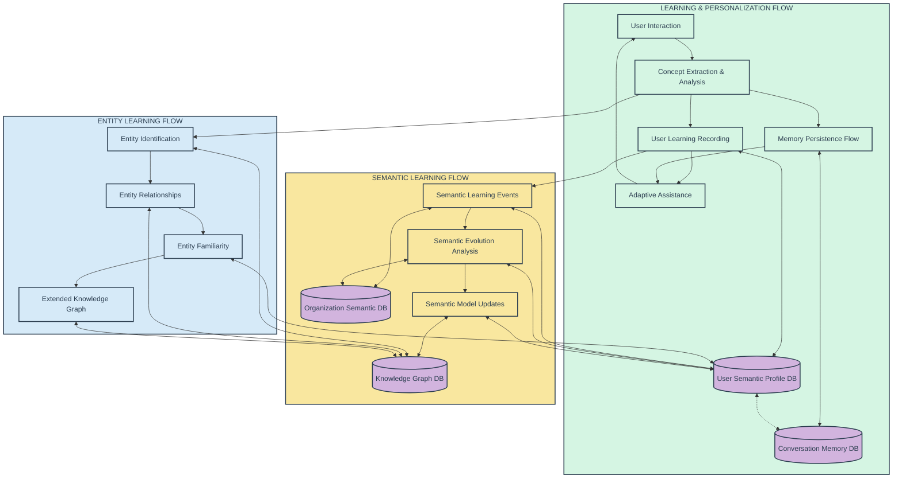
```mermaid
flowchart TD
    subgraph LPF["LEARNING & PERSONALIZATION FLOW"]
        UI[User Interaction] --> CEA[Concept Extraction & Analysis]
        CEA --> ULR[User Learning Recording]
        ULR <--> USPDB[(User Semantic Profile DB)]
        CEA --> MPF[Memory Persistence Flow]
        MPF <--> CMDB[(Conversation Memory DB)]
        ULR --> AA[Adaptive Assistance]
        MPF --> AA
        AA --> UI
    end
    
    subgraph SLF["SEMANTIC LEARNING FLOW"]
        ULR --> SLE[Semantic Learning Events]
        SLE <--> USPDB
        SLE <--> OSDB[(Organization Semantic DB)]
        SLE --> SEA[Semantic Evolution Analysis]
        SEA <--> USPDB
        SEA <--> OSDB
        SEA --> SMU[Semantic Model Updates]
        SMU <--> USPDB
        SMU <--> KGDB[(Knowledge Graph DB)]
    end
    
    subgraph ELF["ENTITY LEARNING FLOW"]
        CEA --> EI[Entity Identification]
        EI <--> KGDB
        EI --> ER[Entity Relationships]
        ER <--> KGDB
        ER --> EF[Entity Familiarity]
        EF <--> USPDB
        EF --> EKG[Extended Knowledge Graph]
        EKG <--> KGDB
    end
    
    USPDB <-.-> CMDB
    
    classDef learnFlow fill:#D5F5E3,stroke:#2C3E50,stroke-width:2px,color:#2C3E50
    classDef semFlow fill:#F9E79F,stroke:#2C3E50,stroke-width:2px,color:#2C3E50
    classDef entFlow fill:#D6EAF8,stroke:#2C3E50,stroke-width:2px,color:#2C3E50
    classDef dbNode fill:#D2B4DE,stroke:#2C3E50,stroke-width:2px,color:#2C3E50
    
    class LPF,UI,CEA,ULR,MPF,AA learnFlow
    class SLF,SLE,SEA,SMU semFlow
    class ELF,EI,ER,EF,EKG entFlow
    class USPDB,CMDB,OSDB,KGDB dbNode
```

### 3.4 Coalition-Based Workflow State Management Flow

This flow shows how the distributed mesh architecture enables coalition-based workflow execution through the Mesh Control Protocol.

```mermaid
flowchart TD
    subgraph WSMF["WORKFLOW STATE MANAGEMENT FLOW"]
        WI[Workflow Initiation] --> WSC[Workflow State Creation]
        WSC <--> DSDB[(Distributed State DB)]
        WSC <--> FWRDB[(Federated Workflow Repository)]
        WSC --> TS[Task Sequencing]
        TS <--> DSDB
        TS --> TE[Task Execution]
        TE <--> SCDB[(Security & Compliance DB)]
        TE --> EU[Event Updates]
        EU <--> DSDB
        EU --> WC[Workflow Completion]
        WC <--> DSDB
        WC --> OR[Outcome Recording]
        OR <--> CMDB[(Conversation Memory DB)]
        OR <--> USPDB[(User Semantic Profile DB)]
    end
    
    subgraph MCPF["MESH CONTROL PROTOCOL FLOW"]
        WSC <--> AD[Agent Discovery]
        TS <--> CF[Coalition Formation]
        CF <--> TR[Trust & Reputation]
        TR <--> SCDB
        TE <--> MCS[Model Context Sharing]
        MCS <--> USPDB
        MCS <--> OSDB[(Organization Semantic DB)]
        EU <--> DWO[Decentralized Workflow Orchestration]
        DWO <--> DSDB
    end
    
    classDef wfFlow fill:#D5F5E3,stroke:#2C3E50,stroke-width:2px,color:#2C3E50
    classDef mcpFlow fill:#F9E79F,stroke:#2C3E50,stroke-width:2px,color:#2C3E50
    classDef dbNode fill:#D2B4DE,stroke:#2C3E50,stroke-width:2px,color:#2C3E50
    
    class WSMF,WI,WSC,TS,TE,EU,WC,OR wfFlow
    class MCPF,AD,CF,TR,MCS,DWO mcpFlow
    class DSDB,SCDB,CMDB,USPDB,FWRDB,OSDB dbNode
```

### 3.5 Mesh Architecture Event Flow

This flow illustrates how events propagate through the mesh architecture, enabling decentralized coordination without centralized orchestration.

```mermaid
flowchart TD
    subgraph EGF["EVENT GENERATION FLOW"]
        UI[User Interface] --> UE[User Event]
        UE --> EG[Event Generation]
        EG <--> DSDB[(Distributed State DB)]
        EG --> EP[Event Processing]
        SE[System Event] --> EG
        WE[Workflow Event] --> EG
        AE[Agent Event] --> EG
    end
    
    subgraph EPF["EVENT PROPAGATION FLOW"]
        EP --> EC[Event Classification]
        EC --> ER[Event Routing]
        ER --> WS[Workflow Subscribers]
        ER --> AS[Agent Subscribers]
        ER --> SS[System Subscribers]
        ER --> US[UI Subscribers]
    end
    
    subgraph EHF["EVENT HANDLING FLOW"]
        WS --> WEH[Workflow Event Handler]
        WEH <--> DSDB
        WEH <--> FWRDB[(Federated Workflow Repository)]
        
        AS --> AEH[Agent Event Handler]
        AEH <--> DSDB
        AEH <--> SCDB[(Security & Compliance DB)]
        
        SS --> SEH[System Event Handler]
        SEH <--> CMDB[(Conversation Memory DB)]
        
        US --> UEH[UI Event Handler]
        UEH <--> CMDB
        UEH <--> USPDB[(User Semantic Profile DB)]
    end
    
    classDef egFlow fill:#D5F5E3,stroke:#2C3E50,stroke-width:2px,color:#2C3E50
    classDef epFlow fill:#F9E79F,stroke:#2C3E50,stroke-width:2px,color:#2C3E50
    classDef ehFlow fill:#D6EAF8,stroke:#2C3E50,stroke-width:2px,color:#2C3E50
    classDef dbNode fill:#D2B4DE,stroke:#2C3E50,stroke-width:2px,color:#2C3E50
    
    class EGF,UI,UE,EG,EP,SE,WE,AE egFlow
    class EPF,EC,ER,WS,AS,SS,US epFlow
    class EHF,WEH,AEH,SEH,UEH ehFlow
    class DSDB,SCDB,CMDB,USPDB,FWRDB dbNode
```

## 4. IT Support MVP Database Design Considerations

### 4.1 Data Distribution Strategy

The ME.AI architecture utilizes a distributed database approach with these key considerations for the IT Support MVP:

1. **Content-Addressable Storage**
   - Workflow definitions, user profiles, and long-term memory are content-addressed
   - Enables distributed storage and retrieval without centralized coordination
   - Supports immutability and versioning for workflow templates
   - Uses cryptographic hashing to generate unique identifiers based on content
   - Facilitates deduplication and integrity verification across the mesh

2. **Distributed Hash Table (DHT) Addressing**
   - Active workflow instances, tasks, and variables use DHT addressing
   - Enables efficient lookup and distributed storage of runtime state
   - Supports mesh-based execution across multiple nodes
   - Provides location-independence for data storage and retrieval
   - Facilitates self-healing through automated data replication

3. **Vector Clock Timestamping**
   - All temporal data is timestamped using vector clocks
   - Enables consistent ordering of events in distributed environment
   - Supports eventual consistency model across mesh nodes
   - Allows detection and resolution of causality violations
   - Facilitates reconciliation of concurrent updates

4. **Conflict-Free Replicated Data Types (CRDTs)**
   - State variables, profiles, and workflow status use CRDT structures
   - Enables concurrent updates without centralized coordination
   - Supports automatic conflict resolution for distributed updates
   - Ensures convergence to a consistent state regardless of update order
   - Reduces coordination overhead in the distributed mesh

### 4.2 Database Technology Recommendations

For the IT Support MVP implementation, the following database technologies are recommended:

```mermaid
flowchart TD
    subgraph Technology_Stack["DATABASE TECHNOLOGY STACK"]
        subgraph DSDB["DISTRIBUTED STATE DATABASE"]
            CRDT[CRDT-enabled Document DB]
            MC[Distributed Cache]
            TS[Time-Series DB]
            PS[Pub/Sub System]
        end
        
        subgraph SCDB["SECURITY & COMPLIANCE DATABASE"]
            DL[Distributed Ledger]
            PKI[PKI Infrastructure]
            IM[Identity Management]
            AM[Audit Management]
        end
        
        subgraph SDB["SEMANTIC DATABASES"]
            VDB[Vector Database]
            GDB[Graph Database]
            KGDB[Knowledge Graph DB]
            OSDB[Ontology Storage]
        end
        
        subgraph CMDB["CONVERSATION MEMORY DATABASE"]
            TSS[Time-Series Storage]
            MP[Message Persistence]
            VDT[Vector Data Types]
        end
    end
    
    DSDB --> T1[Fauna/AntidoteDB]
    DSDB --> T2[Redis Cluster]
    DSDB --> T3[TimescaleDB]
    DSDB --> T4[NATS/Kafka]
    
    SCDB --> T5[Hyperledger/BigchainDB]
    SCDB --> T6[Vault/HSM]
    SCDB --> T7[Keycloak/Auth0]
    SCDB --> T8[Audit-DB/OpenSearch]
    
    SDB --> T9[Weaviate/Pinecone]
    SDB --> T10[Neo4j/TigerGraph]
    SDB --> T11[Amazon Neptune/Stardog]
    SDB --> T12[GraphDB/Virtuoso]
    
    CMDB --> T13[InfluxDB/QuestDB]
    CMDB --> T14[CrateDB/MongoDB]
    CMDB --> T15[Milvus/Qdrant]
    
    classDef dsdb fill:#D5F5E3,stroke:#2C3E50,stroke-width:2px,color:#2C3E50
    classDef scdb fill:#D6EAF8,stroke:#2C3E50,stroke-width:2px,color:#2C3E50
    classDef sdb fill:#F9E79F,stroke:#2C3E50,stroke-width:2px,color:#2C3E50
    classDef cmdb fill:#FADBD8,stroke:#2C3E50,stroke-width:2px,color:#2C3E50
    classDef tech fill:#D2B4DE,stroke:#2C3E50,stroke-width:2px,color:#2C3E50
    
    class DSDB,CRDT,MC,TS,PS dsdb
    class SCDB,DL,PKI,IM,AM scdb
    class SDB,VDB,GDB,KGDB,OSDB sdb
    class CMDB,TSS,MP,VDT cmdb
    class T1,T2,T3,T4,T5,T6,T7,T8,T9,T10,T11,T12,T13,T14,T15 tech
```

1. **Distributed State Database**
   - Technology: Distributed document database with CRDT support (e.g., AntidoteDB, Fauna)
   - Key features: Multi-region replication, CRDT data types, causal consistency
   - Performance considerations: Low latency for workflow state updates
   - Scalability: Horizontal scaling through consistent hashing and sharding
   - Resilience: No single point of failure, automatic failover

2. **Security & Compliance Database**
   - Technology: Distributed ledger or blockchain-based database (e.g., BigchainDB, Hyperledger)
   - Key features: Immutability, cryptographic verification, audit trail
   - Performance considerations: High read throughput for device verification
   - Scalability: Partitioned consensus groups for transaction validation
   - Resilience: Distributed consensus protocols ensuring data integrity

3. **User Semantic Profile Database**
   - Technology: Vector database with graph capabilities (e.g., Weaviate, Pinecone + Neo4j)
   - Key features: Vector similarity search, semantic embedding storage
   - Performance considerations: Fast retrieval of semantic profiles
   - Scalability: Distributed vector indexes with approximate nearest neighbor algorithms
   - Resilience: Replicated storage with read-everywhere, write-local approach

4. **Organization Semantic Database**
   - Technology: RDF/OWL-compatible graph database (e.g., GraphDB, Stardog)
   - Key features: Ontology management, semantic inference, SPARQL support
   - Performance considerations: Optimized query patterns for ontology traversal
   - Scalability: Partitioned storage based on semantic domains
   - Resilience: Replicated storage with versioned ontologies

5. **Conversation Memory Database**
   - Technology: Time-series database with CRDT capabilities (e.g., TimescaleDB + custom CRDT layer)
   - Key features: Time-based queries, efficient append operations
   - Performance considerations: High write throughput for conversation logging
   - Scalability: Automated data tiering for hot/warm/cold storage
   - Resilience: Multi-node replication with configurable consistency levels

6. **Knowledge Graph Database**
   - Technology: Property graph database (e.g., Neo4j, TigerGraph)
   - Key features: Rich relationship modeling, traversal queries, inference support
   - Performance considerations: Optimized path queries and pattern matching
   - Scalability: Graph partitioning based on domain boundaries
   - Resilience: Replicated clusters with read-slave architecture

7. **Federated Workflow Repository**
   - Technology: Content-addressable storage (e.g., IPFS/Filecoin + metadata DB)
   - Key features: Immutable content storage, distributed replication, versioning
   - Performance considerations: Caching of frequently accessed templates
   - Scalability: Content-based addressing allows infinite horizontal scaling
   - Resilience: Natural redundancy through content replication

### 4.3 Data Synchronization Patterns

For the IT Support MVP, the following synchronization patterns are implemented to maintain data consistency across the distributed mesh:

```mermaid
flowchart TD
    subgraph DSP["DATA SYNCHRONIZATION PATTERNS"]
        subgraph EBS["EVENT-BASED SYNCHRONIZATION"]
            EP[Event Publishing]
            ES[Event Subscription]
            EH[Event Handling]
            EPR[Event Processing]
        end
        
        subgraph CRDTS["CRDT-BASED SYNCHRONIZATION"]
            MO[Merge Operation]
            CR[Conflict Resolution]
            SS[State Synchronization]
            DO[Delta Operations]
        end
        
        subgraph PSR["PERIODIC STATE RECONCILIATION"]
            AD[Anomaly Detection]
            SR[State Repair]
            MI[Metadata Indexing]
            CV[Consistency Verification]
        end
        
        subgraph CCE["CAUSAL CONSISTENCY ENFORCEMENT"]
            VC[Vector Clocks]
            DG[Dependency Graphs]
            CO[Causal Ordering]
            DT[Dependency Tracking]
        end
    end
    
    EBS --> DSDB[(Distributed State DB)]
    CRDTS --> USPDB[(User Semantic Profile DB)]
    PSR --> CMDB[(Conversation Memory DB)]
    CCE --> SCDB[(Security & Compliance DB)]
    
    classDef ebs fill:#D5F5E3,stroke:#2C3E50,stroke-width:2px,color:#2C3E50
    classDef crdts fill:#D6EAF8,stroke:#2C3E50,stroke-width:2px,color:#2C3E50
    classDef psr fill:#F9E79F,stroke:#2C3E50,stroke-width:2px,color:#2C3E50
    classDef cce fill:#FADBD8,stroke:#2C3E50,stroke-width:2px,color:#2C3E50
    classDef db fill:#D2B4DE,stroke:#2C3E50,stroke-width:2px,color:#2C3E50
    
    class EBS,EP,ES,EH,EPR ebs
    class CRDTS,MO,CR,SS,DO crdts
    class PSR,AD,SR,MI,CV psr
    class CCE,VC,DG,CO,DT cce
    class DSDB,USPDB,CMDB,SCDB db
```

1. **Event-based Synchronization**
   - Components publish events upon state changes
   - Interested components subscribe to relevant event types
   - Enables loose coupling between system components
   - Utilizes content-based routing for efficient delivery
   - Implements exactly-once delivery semantics for critical events
   - Leverages mesh-based gossip protocols for event propagation

2. **CRDT-based State Synchronization**
   - State changes utilize CRDTs for automatic conflict resolution
   - Updates propagate through the mesh using gossip protocols
   - Enables concurrent updates without locking or coordination
   - Supports operation-based and state-based CRDT approaches
   - Implements efficient delta-based synchronization mechanisms
   - Provides bounded storage overhead for CRDT metadata

3. **Periodic State Reconciliation**
   - Background processes periodically verify state consistency
   - Detects and repairs any inconsistencies in distributed data
   - Ensures long-term data integrity across the mesh
   - Implements Merkle tree-based differential synchronization
   - Provides adaptive reconciliation frequency based on change rates
   - Enables partition tolerance with automated healing

4. **Causal Consistency Enforcement**
   - Updates include causal dependencies (vector clocks)
   - Ensures updates are applied in causal order
   - Prevents logical inconsistencies in distributed workflow execution
   - Implements minimum-size vector clock compression
   - Provides causality tracking with bounded metadata
   - Enables detection of concurrent operations

### 4.4 Coalition-Based Workflow Data Management

The IT Support MVP leverages the mesh architecture to implement coalition-based workflow execution, where multiple agents collaborate to fulfill IT tasks:

```mermaid
flowchart TD
    subgraph CBWF["COALITION-BASED WORKFLOW"]
        subgraph CF["COALITION FORMATION"]
            TP[Task Processing]
            CD[Capability Discovery]
            AM[Agent Matching]
            CN[Coalition Negotiation]
            RC[Role Configuration]
        end
        
        subgraph DS["DATA SHARING"]
            CS[Context Sharing]
            SSS[Shared State Storage]
            PS[Progressive Synchronization]
            CB[Context Boundaries]
        end
        
        subgraph CM["COORDINATION MECHANICS"]
            PM[Progress Monitoring]
            CC[Capability Coordination]
            DR[Decision Recording]
            WR[Work Reconciliation]
        end
        
        subgraph CD["COALITION DISSOLUTION"]
            CCD[Completion Detection]
            SR[State Recording]
            CL[Coalition Logging]
            RL[Relationship Learning]
        end
    end
    
    CF -.-> DS
    DS -.-> CM
    CM -.-> CD
    CD -.-> CF
    
    CF --> DSDB[(Distributed State DB)]
    DS --> DSDB
    DS --> CMDB[(Conversation Memory DB)]
    CM --> DSDB
    CM --> KGDB[(Knowledge Graph DB)]
    CD --> DSDB
    CD --> USPDB[(User Semantic Profile DB)]
    
    classDef cf fill:#D5F5E3,stroke:#2C3E50,stroke-width:2px,color:#2C3E50
    classDef ds fill:#D6EAF8,stroke:#2C3E50,stroke-width:2px,color:#2C3E50
    classDef cm fill:#F9E79F,stroke:#2C3E50,stroke-width:2px,color:#2C3E50
    classDef cd fill:#FADBD8,stroke:#2C3E50,stroke-width:2px,color:#2C3E50
    classDef db fill:#D2B4DE,stroke:#2C3E50,stroke-width:2px,color:#2C3E50
    
    class CF,TP,CD,AM,CN,RC cf
    class DS,CS,SSS,PS,CB ds
    class CM,PM,CC,DR,WR cm
    class CD,CCD,SR,CL,RL cd
    class DSDB,CMDB,KGDB,USPDB db
```

Key aspects of coalition-based workflow data management include:

1. **Coalition Formation Data Flow**
   - Task decomposition generates capability requirements
   - Capability discovery locates potential coalition members
   - Agent matching identifies optimal team composition
   - Coalition negotiation establishes shared context and goals
   - Role configuration assigns responsibilities and permissions

2. **Data Sharing Within Coalitions**
   - Context sharing establishes common understanding
   - Shared state storage provides coordination substrate
   - Progressive synchronization optimizes data transfer
   - Context boundaries define information visibility rules

3. **Coordination Mechanics**
   - Progress monitoring tracks task completion state
   - Capability coordination optimizes resource utilization
   - Decision recording maintains action justifications
   - Work reconciliation handles duplicate or conflicting efforts

4. **Coalition Dissolution**
   - Completion detection identifies finished workflows
   - State recording preserves final workflow outcomes
   - Coalition logging archives collaboration patterns
   - Relationship learning improves future coalition formation

### 4.5 Data Lifecycle Management

The IT Support MVP implements a comprehensive data lifecycle management approach to ensure efficient resource utilization and compliance with data governance requirements:

```mermaid
flowchart TD
    subgraph DLM["DATA LIFECYCLE MANAGEMENT"]
        subgraph DC["DATA CREATION"]
            ND[New Data]
            VS[Validation & Sanitization]
            SC[Schema Conformance]
            CM[Classification & Metadata]
        end
        
        subgraph DU["DATA USAGE"]
            DA[Data Access]
            DP[Data Processing]
            DM[Data Monitoring]
            DT[Data Transformation]
        end
        
        subgraph DS["DATA STORAGE"]
            HD[Hot Data]
            WD[Warm Data]
            CD[Cold Data]
            AD[Archived Data]
        end
        
        subgraph DDD["DATA DELETION"]
            LB[Logical Deletion]
            PO[Physical Obliteration]
            CR[Compliance Reporting]
            CE[Cryptographic Erasure]
        end
    end
    
    DC --> DU
    DU --> DS
    DS --> DDD
    DDD -.-> DC
    
    DC --> CMDB[(Conversation Memory DB)]
    DC --> DSDB[(Distributed State DB)]
    DU --> USPDB[(User Semantic Profile DB)]
    DU --> KGDB[(Knowledge Graph DB)]
    DS --> CMDB
    DS --> DSDB
    DDD --> SCDB[(Security & Compliance DB)]
    DDD --> CMDB
    
    classDef dc fill:#D5F5E3,stroke:#2C3E50,stroke-width:2px,color:#2C3E50
    classDef du fill:#D6EAF8,stroke:#2C3E50,stroke-width:2px,color:#2C3E50
    classDef ds fill:#F9E79F,stroke:#2C3E50,stroke-width:2px,color:#2C3E50
    classDef ddd fill:#FADBD8,stroke:#2C3E50,stroke-width:2px,color:#2C3E50
    classDef db fill:#D2B4DE,stroke:#2C3E50,stroke-width:2px,color:#2C3E50
    
    class DC,ND,VS,SC,CM dc
    class DU,DA,DP,DM,DT du
    class DS,HD,WD,CD,AD ds
    class DDD,LB,PO,CR,CE ddd
    class CMDB,DSDB,USPDB,KGDB,SCDB db
```

Key aspects of data lifecycle management include:

1. **Data Creation**
   - New data ingestion with validation and sanitization
   - Schema conformance checking against data models
   - Automatic classification and metadata tagging
   - Data quality assessment and enrichment

2. **Data Usage**
   - Access control based on Device Passport authorization
   - Processing logs for accountability and traceability
   - Continuous monitoring for security and compliance
   - Transformation services for format adaptation

3. **Data Storage Stages**
   - Hot data: Frequently accessed, high-performance storage
   - Warm data: Recent but less frequently accessed storage
   - Cold data: Infrequently accessed, cost-optimized storage
   - Archived data: Long-term immutable storage for compliance

4. **Data Deletion**
   - Logical deletion: Marking data as deleted while preserving
   - Physical obliteration: Complete removal from storage
   - Compliance reporting: Documentation of deletion events
   - Cryptographic erasure: Key deletion for encrypted data

## 5. Database Scaling and Performance Optimization

### 5.1 Horizontal Scaling Strategy

The ME.AI database architecture supports horizontal scaling through a comprehensive strategy that aligns with the distributed mesh architecture:

```mermaid
flowchart TD
    subgraph HSS["HORIZONTAL SCALING STRATEGY"]
        subgraph SC["SHARDING CONSIDERATIONS"]
            SK[Sharding Keys]
            SP[Sharding Policies]
            SS[Shard Selection]
            SR[Shard Rebalancing]
        end
        
        subgraph RC["REPLICATION CONSIDERATIONS"]
            RD[Replication Degree]
            RM[Replication Method]
            RT[Replication Topology]
            RR[Read Routing]
        end
        
        subgraph LD["LOAD DISTRIBUTION"]
            LB[Load Balancing]
            RTP[Request Throughput]
            CS[Connection Scaling]
            RA[Resource Allocation]
        end
        
        subgraph EM["EXPANSION MECHANICS"]
            NS[Node Scaling]
            JD[Join/Departure Protocol]
            DR[Data Redistribution]
            RV[Ring Versioning]
        end
    end
    
    SC --> DB1[(User-related Data)]
    SC --> DB2[(Workflow-related Data)]
    RC --> DB3[(Read-heavy Data)]
    RC --> DB4[(Write-heavy Data)]
    LD --> DB5[(Query-intensive Data)]
    LD --> DB6[(Storage-intensive Data)]
    EM --> DB7[(Elastic Components)]
    EM --> DB8[(Stable Components)]
    
    classDef sc fill:#D5F5E3,stroke:#2C3E50,stroke-width:2px,color:#2C3E50
    classDef rc fill:#D6EAF8,stroke:#2C3E50,stroke-width:2px,color:#2C3E50
    classDef ld fill:#F9E79F,stroke:#2C3E50,stroke-width:2px,color:#2C3E50
    classDef em fill:#FADBD8,stroke:#2C3E50,stroke-width:2px,color:#2C3E50
    classDef db fill:#D2B4DE,stroke:#2C3E50,stroke-width:2px,color:#2C3E50
    
    class SC,SK,SP,SS,SR sc
    class RC,RD,RM,RT,RR rc
    class LD,LB,RTP,CS,RA ld
    class EM,NS,JD,DR,RV em
    class DB1,DB2,DB3,DB4,DB5,DB6,DB7,DB8 db
```

Key implementation approaches include:

1. **Sharding by Domain Boundaries**
   - Primary sharding keys for conversation and workflow data:
     - ConversationID: For conversation-related data
     - WorkflowInstanceID: For workflow-related data
     - UserID: For user profile and preference data
     - DeviceID: For device-related data
   - Consistent hashing for shard assignment to minimize redistribution
   - Virtual node approach to handle node heterogeneity
   - Adaptive resharding based on load patterns and data growth

2. **Multi-Tier Replication Strategy**
   - Read-heavy data employs higher replication factors:
     - Workflow templates: N+2 replication (N regions + 2 additional copies)
     - Device passports: N+1 replication with local caching
     - Knowledge graph: Graph partitioning with overlapping replicas
   - Write-heavy data uses conflict-free data types:
     - Conversation messages: CRDT-based append-only logs
     - Workflow state: CRDT-based distributed variables
     - User interactions: Event-sourced with causal consistency
   - Geographic distribution based on access patterns
   - Read-local, write-global strategy for latency optimization

3. **Mesh-based Load Distribution**
   - Dynamic query routing through the mesh network:
     - Request targeting based on data locality
     - Adaptive load balancing based on node capacity
     - Query decomposition for parallel execution
   - Connection pooling across mesh nodes
   - Request throttling with backpressure mechanisms
   - Resource utilization monitoring and adaptive allocation

4. **Elastic Scaling Mechanics**
   - Automated node addition and removal:
     - Gradual data migration during scaling events
     - Version-aware ring topology updates
     - Metadata propagation via gossip protocol
   - Consistent hashing minimizes data movement during scaling
   - Virtual nodes per physical node for balanced distribution
   - Controlled handover protocol for graceful node departures

### 5.2 Query Optimization

For the IT Support MVP, the database architecture implements these query optimization patterns:

```mermaid
flowchart TD
    subgraph QOP["QUERY OPTIMIZATION PATTERNS"]
        subgraph QPO["QUERY PATH OPTIMIZATION"]
            PD[Path Definition]
            PI[Path Indexing]
            PS[Path Selection]
            PP[Path Pruning]
        end
        
        subgraph MV["MATERIALIZED VIEWS"]
            MVG[View Generation]
            MVS[View Selection]
            MVU[View Updates]
            MVC[View Composition]
        end
        
        subgraph DQE["DENORMALIZATION FOR EFFICIENCY"]
            DD[Data Duplication]
            CR[Consistency Rules]
            PG[Property Groups]
            UC[Update Cascades]
        end
        
        subgraph QA["QUERY ANALYSIS"]
            PC[Pattern Classification]
            QH[Query History]
            AP[Access Patterns]
            QC[Query Costs]
        end
    end
    
    QPO --> DSDB[(Distributed State DB)]
    QPO --> SCDB[(Security & Compliance DB)]
    MV --> USPDB[(User Semantic Profile DB)]
    MV --> CMDB[(Conversation Memory DB)]
    DQE --> KGDB[(Knowledge Graph DB)]
    DQE --> FWRDB[(Federated Workflow Repository)]
    QA --> MSL[Mesh Status Layer]
    
    classDef qpo fill:#D5F5E3,stroke:#2C3E50,stroke-width:2px,color:#2C3E50
    classDef mv fill:#D6EAF8,stroke:#2C3E50,stroke-width:2px,color:#2C3E50
    classDef dqe fill:#F9E79F,stroke:#2C3E50,stroke-width:2px,color:#2C3E50
    classDef qa fill:#FADBD8,stroke:#2C3E50,stroke-width:2px,color:#2C3E50
    classDef db fill:#D2B4DE,stroke:#2C3E50,stroke-width:2px,color:#2C3E50
    
    class QPO,PD,PI,PS,PP qpo
    class MV,MVG,MVS,MVU,MVC mv
    class DQE,DD,CR,PG,UC dqe
    class QA,PC,QH,AP,QC qa
    class DSDB,SCDB,USPDB,CMDB,KGDB,FWRDB,MSL db
```

Key query optimization implementations include:

1. **Query Path Optimization**
   - Path optimization for common access patterns:
     - IT Support workflow traversal paths
     - User profile access patterns
     - Device capability lookups
     - Security verification flows
   - Compound indexes for common query predicates:
     - (UserID, ConversationTime) for conversation retrieval
     - (DeviceID, CapabilityType) for capability verification
     - (WorkflowType, Status) for workflow monitoring
   - Query plan caching for repeated patterns
   - Dynamic index creation based on query patterns

2. **Materialized Views**
   - Pre-computed views for common query patterns:
     - Active workflow instances by user
     - Device status summary by organization
     - User activity timeline
     - Support agent performance metrics
   - Incremental view maintenance:
     - Event-based updates for real-time views
     - Periodic refresh for dashboard views
     - Query-time merging for changing data
   - View selection based on query frequency and computation cost
   - Composite views combining multiple data sources

3. **Strategic Denormalization**
   - Controlled duplication for query efficiency:
     - Latest workflow state embedded in conversation context
     - Device capabilities duplicated with device passport
     - User preferences embedded in conversation sessions
     - Common entity attributes duplicated in knowledge nodes
   - Update consistency rules:
     - Primary-copy updates with propagation
     - CRDT-based mergeable values
     - Versioned references for consistency checking
   - Property groups based on access patterns
   - Update cascades with causal consistency

4. **Query Analysis and Optimization**
   - Pattern detection and classification:
     - Conversation access patterns by user segment
     - Workflow query patterns by support case type
     - Knowledge graph traversal patterns
     - Device authentication sequences
   - Historical query analysis for optimization
   - Access pattern-based optimization
   - Cost-based query planning and execution

### 5.3 Caching Strategy

The database architecture incorporates multi-level caching to optimize performance while maintaining consistency:

```mermaid
flowchart TD
    subgraph CS["CACHING STRATEGY"]
        subgraph AC["APPLICATION-LEVEL CACHING"]
            LC[Local Cache]
            SC[Session Cache]
            PC[Process Cache]
            TC[Thread Cache]
        end
        
        subgraph DC["DISTRIBUTED CACHE LAYER"]
            DM[Distributed Memory]
            GC[Geo-distributed Cache]
            NC[Near Cache]
            RC[Remote Cache]
        end
        
        subgraph DNC["DATABASE-NATIVE CACHING"]
            BC[Buffer Cache]
            QC[Query Cache]
            RC2[Result Cache]
            PC2[Procedure Cache]
        end
        
        subgraph CM["CACHE MANAGEMENT"]
            CI[Cache Invalidation]
            CS2[Cache Synchronization]
            CP[Cache Partitioning]
            CM2[Cache Metrics]
        end
    end
    
    AC --> WF[Workflow Engine]
    AC --> CP[Conversation Processing]
    DC --> MS[Mesh Services]
    DC --> AG[Agentic Products]
    DNC --> DB[(Database Layer)]
    CM --> ALL[All Caching Layers]
    
    classDef ac fill:#D5F5E3,stroke:#2C3E50,stroke-width:2px,color:#2C3E50
    classDef dc fill:#D6EAF8,stroke:#2C3E50,stroke-width:2px,color:#2C3E50
    classDef dnc fill:#F9E79F,stroke:#2C3E50,stroke-width:2px,color:#2C3E50
    classDef cm fill:#FADBD8,stroke:#2C3E50,stroke-width:2px,color:#2C3E50
    classDef comp fill:#D2B4DE,stroke:#2C3E50,stroke-width:2px,color:#2C3E50
    
    class AC,LC,SC,PC,TC ac
    class DC,DM,GC,NC,RC dc
    class DNC,BC,QC,RC2,PC2 dnc
    class CM,CI,CS2,CP,CM2 cm
    class WF,CP,MS,AG,DB,ALL comp
```

Key caching implementations include:

1. **Application-Level Caching**
   - In-memory caching for active entities:
     - Active workflow state during execution
     - User semantic profiles during conversations
     - Device passport information during sessions
     - Conversation context for active interactions
   - Thread-local caching for request-scoped data
   - Process-level caching for shared components
   - Session-scoped caching for user interactions

2. **Distributed Cache Layer**
   - Shared cache for frequently accessed data:
     - Workflow templates and definitions
     - Organization semantic profiles
     - Security policies and access rules
     - Knowledge graph core components
   - Geo-distributed caching based on access locations
   - Near caching for reduced latency
   - Remote caching for shared resources

3. **Database-Native Caching**
   - Database buffer cache optimization:
     - Right-sizing for workload patterns
     - Prioritization for hot data paths
     - Retention policies for cache entries
   - Query result caching:
     - Parameterized query plans
     - Common aggregation results
     - Lookup table results
   - Stored procedure caching
   - Adaptive buffer management

4. **Cache Management**
   - Event-based invalidation:
     - Consistent hashing for distributed coordination
     - Change data capture for update events
     - Vector clock-based synchronization
   - TTL-based expiration policies:
     - Access-frequency adjusted TTLs
     - Data-type specific policies
     - Consistency-level dependent expiration
   - Cache partitioning aligned with data sharding
   - Performance metrics for cache effectiveness

## 6. Data Security and Compliance

### 6.1 Data Encryption Strategy

The IT Support MVP implements comprehensive encryption to protect sensitive data:

```mermaid
flowchart TD
    subgraph DES["DATA ENCRYPTION STRATEGY"]
        subgraph DAR["DATA-AT-REST ENCRYPTION"]
            FE[File Encryption]
            VE[Volume Encryption]
            DB[Database Encryption]
            BU[Backup Encryption]
        end
        
        subgraph DIT["DATA-IN-TRANSIT ENCRYPTION"]
            TLS[TLS 1.3]
            MTL[Mutual TLS]
            SM[Secure Mesh]
            PE[Payload Encryption]
        end
        
        subgraph FLE["FIELD-LEVEL ENCRYPTION"]
            CE[Credential Encryption]
            PII[PII Protection]
            TPE[Transparent Encryption]
            ABE[Attribute-Based Encryption]
        end
        
        subgraph KM["KEY MANAGEMENT"]
            HSM[Hardware Security Modules]
            KR[Key Rotation]
            KV[Key Vaulting]
            KP[Key Partitioning]
        end
    end
    
    DAR --> DL[Data Layer]
    DIT --> CL[Communication Layer]
    FLE --> AL[Application Layer]
    KM --> SL[Security Layer]
    
    classDef dar fill:#D5F5E3,stroke:#2C3E50,stroke-width:2px,color:#2C3E50
    classDef dit fill:#D6EAF8,stroke:#2C3E50,stroke-width:2px,color:#2C3E50
    classDef fle fill:#F9E79F,stroke:#2C3E50,stroke-width:2px,color:#2C3E50
    classDef km fill:#FADBD8,stroke:#2C3E50,stroke-width:2px,color:#2C3E50
    classDef layer fill:#D2B4DE,stroke:#2C3E50,stroke-width:2px,color:#2C3E50
    
    class DAR,FE,VE,DB,BU dar
    class DIT,TLS,MTL,SM,PE dit
    class FLE,CE,PII,TPE,ABE fle
    class KM,HSM,KR,KV,KP km
    class DL,CL,AL,SL layer
```

Key encryption implementations include:

1. **Data-at-Rest Encryption**
   - Storage level encryption:
     - AES-256 for all database storage
     - Full-volume encryption for persistence layers
     - Separate keys per database instance
     - Backup encryption with independent key sets
   - Transparent database encryption:
     - Column-level encryption for sensitive fields
     - Tablespace encryption for full dataset protection
     - Index encryption for query confidentiality
   - Key storage in hardware security modules
   - Quarterly key rotation schedule

2. **Data-in-Transit Encryption**
   - TLS 1.3 for all network communication:
     - Perfect forward secrecy for all connections
     - Strong cipher suite configuration
     - Certificate pinning for critical services
   - Mutual TLS for service-to-service authentication:
     - Client and server certificate validation
     - Certificate authority controls
     - Certificate lifecycle management
   - Secure mesh communication protocols:
     - End-to-end encryption for mesh traffic
     - Post-quantum cryptography readiness
   - Payload encryption for sensitive data channels

3. **Field-Level Encryption**
   - Application-level encryption for sensitive fields:
     - Authentication credentials
     - Personal identifiable information
     - Financial data
     - Health-related information
   - Different encryption keys for different data categories:
     - Data classification-based key assignment
     - Purpose-limited encryption keys
     - Context-dependent key selection
   - Homomorphic encryption for specific operations:
     - Privacy-preserving analytics
     - Zero-knowledge workflow verification
   - Format-preserving encryption for structured data

4. **Key Management Infrastructure**
   - Hardware Security Module integration:
     - FIPS 140-2 Level 3 certified modules
     - Cloud HSM services for distributed deployment
     - On-premises HSM for sensitive environments
   - Comprehensive key rotation procedures:
     - Automated rotation for high-value keys
     - Graceful key transition without downtime
     - Historical key preservation for data recovery
   - Secure key vaulting with access controls
   - Hierarchical key management with domain separation

### 6.2 Access Control Architecture

The database architecture implements fine-grained access control:

```mermaid
flowchart TD
    subgraph ACA["ACCESS CONTROL ARCHITECTURE"]
        subgraph RBAC["ROLE-BASED ACCESS CONTROL"]
            RM[Role Management]
            RP[Role Permissions]
            RH[Role Hierarchy]
            RS[Role Separation]
        end
        
        subgraph ABAC["ATTRIBUTE-BASED ACCESS CONTROL"]
            AP[Attribute Policies]
            AC[Attribute Collection]
            AE[Attribute Evaluation]
            AR[Attribute Rules]
        end
        
        subgraph DBA["DEVICE-BASED AUTHENTICATION"]
            DP[Device Passport]
            DC[Device Credentials]
            DCA[Device Capability Attestation]
            DCI[Device Context Identification]
        end
        
        subgraph CZ["CONTEXT-AWARE AUTHORIZATION"]
            LB[Location-Based]
            TB[Time-Based]
            PB[Pattern-Based]
            RB[Risk-Based]
        end
    end
    
    RBAC --> SL[Service Layer]
    ABAC --> DL[Data Layer]
    DBA --> DPL[Device Passport Layer]
    CZ --> ML[Mesh Layer]
    
    classDef rbac fill:#D5F5E3,stroke:#2C3E50,stroke-width:2px,color:#2C3E50
    classDef abac fill:#D6EAF8,stroke:#2C3E50,stroke-width:2px,color:#2C3E50
    classDef dba fill:#F9E79F,stroke:#2C3E50,stroke-width:2px,color:#2C3E50
    classDef cz fill:#FADBD8,stroke:#2C3E50,stroke-width:2px,color:#2C3E50
    classDef layer fill:#D2B4DE,stroke:#2C3E50,stroke-width:2px,color:#2C3E50
    
    class RBAC,RM,RP,RH,RS rbac
    class ABAC,AP,AC,AE,AR abac
    class DBA,DP,DC,DCA,DCI dba
    class CZ,LB,TB,PB,RB cz
    class SL,DL,DPL,ML layer
```

Key access control implementations include:

1. **Role-Based Access Control (RBAC)**
   - Comprehensive role management:
     - IT support agent roles
     - System administrator roles
     - DevOps roles
     - User roles
   - Fine-grained permission assignment:
     - Operation-level permissions
     - Resource-level access controls
     - Time-bound authorizations
   - Role hierarchy for inheritance:
     - Base roles with common permissions
     - Specialized roles with additional capabilities
   - Separation of duties enforcement:
     - Mutually exclusive role assignments
     - Administrative separation controls

2. **Attribute-Based Access Control (ABAC)**
   - Dynamic access decisions based on attributes:
     - User attributes (department, clearance)
     - Resource attributes (classification, sensitivity)
     - Environmental attributes (location, time)
     - Action attributes (operation type, arguments)
   - Context-aware permission evaluation:
     - Policy evaluation engines
     - Decision caching for performance
     - Policy conflict resolution
   - Policy-based access rules:
     - Centralized policy administration
     - Distributed policy enforcement
     - Versioned policy management

3. **Device-Based Authentication**
   - Device Passport integration:
     - Hardware-bound cryptographic identity
     - Device capability verification
     - Trust level assessment
     - Continuous device attestation
   - Multi-factor device authentication:
     - Device certificates
     - TPM/secure enclave integration
     - Biometric factors where available
   - Capability-based authorization:
     - Device capability mapping to permitted operations
     - Capability-based access tokens
     - Granular capability verification

4. **Context-Aware Authorization**
   - Location-based authorization controls:
     - Geofencing for sensitive operations
     - Network context validation
     - Location verification for critical tasks
   - Time-based access restrictions:
     - Time-of-day limitations
     - Duration-based access windows
     - Schedule-aware permissions
   - Behavioral pattern analysis:
     - Usage pattern matching
     - Anomaly detection
     - Continuous authorization assessment
   - Risk-based access decisions:
     - Real-time risk scoring
     - Adaptive authentication requirements
     - Progressive access elevation

### 6.3 Audit and Compliance Framework

The database architecture supports comprehensive auditing:

```mermaid
flowchart TD
    subgraph ACF["AUDIT & COMPLIANCE FRAMEWORK"]
        subgraph AL["AUDIT LOGGING"]
            AE[Audit Events]
            AM[Audit Metadata]
            ACo[Audit Collection]
            AS[Audit Storage]
        end
        
        subgraph CR["COMPLIANCE REPORTING"]
            CD[Compliance Dashboards]
            CCh[Compliance Checks]
            CCe[Compliance Certification]
            CE[Compliance Evidence]
        end
        
        subgraph DL["DATA LINEAGE"]
            DO[Data Origin]
            DT[Data Transformations]
            DC[Data Custody]
            DI[Data Impact]
        end
        
        subgraph PT["PRIVACY TOOLS"]
            DSAR[Data Subject Access Requests]
            DP[Data Portability]
            RtF[Right to Forget]
            PIA[Privacy Impact Assessment]
        end
    end
    
    AL --> SCDB[(Security & Compliance DB)]
    CR --> SCDB
    DL --> KGDB[(Knowledge Graph DB)]
    PT --> ALL[All Databases]
    
    classDef al fill:#D5F5E3,stroke:#2C3E50,stroke-width:2px,color:#2C3E50
    classDef cr fill:#D6EAF8,stroke:#2C3E50,stroke-width:2px,color:#2C3E50
    classDef dl fill:#F9E79F,stroke:#2C3E50,stroke-width:2px,color:#2C3E50
    classDef pt fill:#FADBD8,stroke:#2C3E50,stroke-width:2px,color:#2C3E50
    classDef db fill:#D2B4DE,stroke:#2C3E50,stroke-width:2px,color:#2C3E50
    
    class AL,AE,AM,ACo,AS al
    class CR,CD,CCh,CCe,CE cr
    class DL,DO,DT,DC,DI dl
    class PT,DSAR,DP,RtF,PIA pt
    class SCDB,KGDB,ALL db
```

Key audit and compliance implementations include:

1. **Immutable Audit Logging**
   - Comprehensive event capture:
     - Data access and modification
     - Authentication and authorization
     - Administrative actions
     - System configuration changes
   - Rich metadata collection:
     - Actor identity (user and device)
     - Action details (what, when, how)
     - Context information (where, why)
     - Outcome recording
   - Tamper-evident storage:
     - Append-only logging
     - Cryptographic chaining of records
     - Distributed verification
     - Independent witness nodes

2. **Compliance Reporting**
   - Automated compliance dashboards:
     - Real-time compliance status
     - Historical compliance trends
     - Violation alerting
     - Control effectiveness
   - Continuous compliance checking:
     - Policy adherence verification
     - Configuration compliance
     - Data handling practices
     - Exception management
   - Evidence collection and preservation:
     - Audit trail packaging
     - Control testing evidence
     - Configuration snapshots
     - Compliance artifacts

3. **Data Lineage Tracking**
   - Origin tracking:
     - Source attribution
     - Input validation records
     - Original custody documentation
   - Transformation documentation:
     - Processing history
     - Transformation rules
     - Quality checks
   - Chain of custody:
     - Transfer records
     - Access history
     - Responsibility transitions
   - Impact analysis capabilities:
     - Upstream tracing
     - Downstream tracking
     - Cross-system dependencies

4. **Privacy Tooling**
   - Data subject access request handling:
     - Data discovery across databases
     - Subject data compilation
     - Response generation
   - Data portability implementation:
     - Standardized export formats
     - Complete dataset extraction
     - Relationship preservation
   - Right to forget mechanisms:
     - Targeted data deletion
     - Reference cleanup
     - Verification of removal
   - Privacy impact assessment support:
     - Data processing inventory
     - Risk evaluation tooling
     - Mitigation tracking

## 7. Implementation Roadmap for Database Architecture

### 7.1 Phased Implementation Approach

The database implementation follows a phased approach aligned with the overall ME.AI implementation strategy:

```mermaid
gantt
    title Database Architecture Implementation Roadmap
    dateFormat YYYY-MM
    axisFormat %b %Y
    
    section Foundation Layer
    Database Architecture Design      :a1, 2025-01, 2M
    Core Schema Implementation        :a2, after a1, 3M
    Basic Data Distribution           :a3, after a2, 2M
    Release 1 Ready                   :milestone, m1, 2025-06, 0M
    
    section Enhanced Capabilities
    Advanced CRDT Implementation      :b1, after a3, 2M
    Coalition-Based Data Management   :b2, after b1, 2M
    Extended Schema Implementation    :b3, after b1, 3M
    Release 2 Ready                   :milestone, m2, 2025-09, 0M
    
    section Complete Architecture
    Full Mesh Data Synchronization    :c1, after b2, 3M
    Advanced Security Implementation  :c2, after b3, 2M
    Comprehensive Auditing            :c3, after c2, 1M
    Release 3 Ready                   :milestone, m3, 2026-01, 0M
```

### 7.2 Database Implementation Priorities by Release

The following table outlines the progressive implementation of database components across the three primary releases:

| Database Component | Release 1 (Jun 2025) | Release 2 (Sep 2025) | Release 3 (Jan 2026) |
|-------------------|----------------------|----------------------|----------------------|
| **Distributed State DB** | Basic workflow state tracking Simple task execution Local variable storage | Enhanced workflow state Distributed task execution CRDT-based variables | Full coalition support Complete event system Advanced state distribution |
| **Security & Compliance DB** | Basic device passport Simple capability tracking Essential access grants | Enhanced device security Advanced capability verification Policy-based access control | Complete audit trails Compliance reporting Risk-based authorization |
| **User Semantic DB** | Basic user profiles Simple preferences Initial knowledge tracking | Enhanced semantic profiles Knowledge relationships Learning event tracking | Complete semantic evolution Advanced knowledge modeling Full learning adaptation |
| **Organization Semantic DB** | Basic organization profiles Initial domains Simple ontologies | Enhanced domain definitions Improved ontologies Basic semantic negotiation | Complete semantic negotiation Advanced ontology alignment Full contextual adaptation |
| **Conversation Memory DB** | Session tracking Message storage Basic memory | Enhanced session context Advanced memory types Context maintenance | Full distributed memory Cross-session continuity Complete sentiment tracking |
| **Knowledge Graph DB** | Basic entity definitions Simple relationships Core concepts | Enhanced relationships Domain knowledge Knowledge integration | Complete knowledge modeling Advanced reasoning support Full semantic graph |
| **Federated Workflow DB** | Template storage Basic metadata Simple versioning | Enhanced templates Improved metadata Better versioning | Complete federation Template exchange Advanced workflow libraries |

### 7.3 Technical Challenges and Mitigation Strategies

| Challenge | Impact | Mitigation Strategy | Implementation Timing |
|-----------|--------|---------------------|------------------------|
| **Distributed Consistency** | Potential data inconsistencies across mesh | CRDT implementation for automatic conflict resolution Vector clock synchronization Eventual consistency with causality preservation | Phase 1: Basic consistency Phase 2: Enhanced CRDTs Phase 3: Full vector clocks |
| **Performance at Scale** | Latency increase with data volume growth | Layered caching strategy Data locality optimization Query path optimization Predictive prefetching | Phase 1: Local caching Phase 2: Distributed cache Phase 3: Predictive systems |
| **Security Management** | Complex security in distributed environment | Zero-trust architecture Attribute-based access control Device passport integration Continuous verification | Phase 1: Basic security Phase 2: Enhanced controls Phase 3: Continuous verification |
| **Schema Evolution** | Managing schema changes without disruption | Schema versioning Forward/backward compatibility Schema migration utilities Dual-write during transitions | Phase 1: Simple versioning Phase 2: Compatibility layers Phase 3: Seamless evolution |
| **Query Complexity** | Complex queries across distributed data | Query decomposition Distributed execution Result aggregation Query optimization | Phase 1: Basic queries Phase 2: Enhanced patterns Phase 3: Full optimization |

## 8. Conclusion

The ME.AI database architecture for the IT Support MVP provides a robust, scalable, and secure foundation for automated IT support capabilities. The distributed mesh design enables resilient operation while maintaining data consistency and providing the performance needed for real-time interaction.

### 8.1 Key Architectural Strengths

1. **Distributed Resilience**: The mesh-based architecture eliminates single points of failure and enables continued operation even when components are unavailable. The CRDT-based state management ensures data consistency without requiring centralized coordination.

2. **Coalition-Based Data Management**: The architecture supports dynamic formation of agent coalitions with shared data contexts, enabling complex problem-solving through collaborative workflows without rigid, predefined processes.

3. **Scalable Performance**: The horizontal scaling approach supports growth from small deployments to enterprise-scale operations without architectural changes. The multi-tier caching strategy ensures consistent performance across scales.

4. **Secure by Design**: Comprehensive security controls embedded in the architecture at all levels ensure protection of sensitive IT support data, from device authentication through the Device Passport to field-level encryption and fine-grained access control.

5. **Semantic Intelligence**: The combination of user semantic profiles and organization semantic databases enables increasingly personalized interactions as the system learns from user interactions, while maintaining organization-specific knowledge boundaries.

6. **Workflow Flexibility**: The distributed workflow state management supports complex IT support processes while enabling dynamic adaptation to changing conditions, without requiring predefined process definitions for every scenario.

7. **Future Extensibility**: The foundation established for the MVP readily supports the addition of new IT support capabilities in future releases without major architectural changes, through the modular, component-based design.

### 8.2 Implementation Success Factors

To ensure successful implementation of the database architecture, these critical factors must be addressed:

1. **Expertise in Distributed Systems**: The team must include experts in distributed databases, CRDT implementation, and mesh architectures to handle the complexity of the distributed data layer.

2. **Incremental Implementation**: Follow the phased approach to build capabilities progressively, validating each component before moving to more advanced features.

3. **Comprehensive Testing**: Implement extensive testing for distributed scenarios, including chaos engineering approaches to validate resilience under various failure conditions.

4. **Performance Monitoring**: Establish comprehensive observability from the start to ensure performance objectives are met and to quickly identify bottlenecks.

5. **Security Validation**: Conduct regular security assessments of the database architecture to ensure the distributed nature doesn't introduce vulnerability gaps.

This database architecture and data flow design provides a comprehensive blueprint for implementing the IT Support MVP while establishing the foundation for future expansion of the ME.AI platform, ensuring alignment with the mesh architecture principles defined in the original specification.
