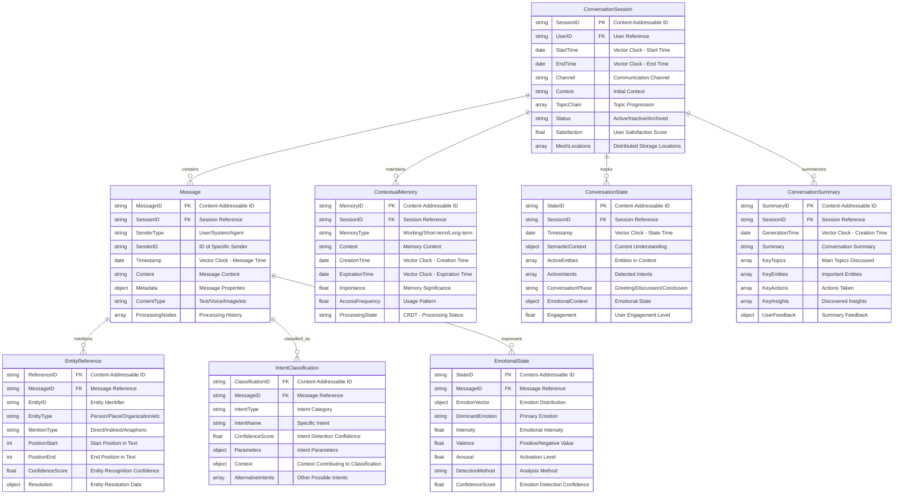

# ME.AI Data Architecture and Use Case Data Flows

## 1. ME.AI Database Architecture Overview

The ME.AI Neural Core Mesh Architecture utilizes a distributed database approach that spans multiple functional layers. This document focuses on the database architecture supporting the IT Support Product MVP, examining the relevant database components, their structure, and the data flows that enable key use cases.

### 1.1 Database Layer Architecture

The ME.AI database architecture consists of multiple interconnected database systems that operate as a distributed mesh, supporting the neural core platform, mesh control protocol, and agentic products.


#### 1.1.1 Database Layer Mapping to Platform Components


### 1.2 Database Components Relevant to IT Support MVP

For the IT Support Product MVP, the following database components are most relevant:

#### 1.2.1 Distributed State Database

A critical component of the mesh architecture that manages workflow state, task execution, and coordination for IT support processes.

Key Tables:
- `DistributedWorkflowDefinition`: Templates for password reset, account unlock, and other IT workflows
- `DistributedWorkflowInstance`: Active instances of IT support workflows
- `DistributedTaskExecution`: Individual tasks within IT workflows
- `StateTransition`: Records of state changes within workflows
- `DistributedVariable`: Variables maintained across workflow execution
- `DistributedEvent`: Events triggered during workflow execution
- `CoalitionParticipation`: Agent participation in IT support coalitions

Schema:


#### 1.2.2 Security & Compliance Database

Critical for the IT Support MVP as it manages device identification, authentication, and authorization required for secure operations. This is closely integrated with the Device Passport Database.

Key Tables:
- `DevicePassport`: Device identity and authorization profile
- `DeviceCapability`: Capabilities of registered devices
- `DeviceAttestation`: Verification of device authenticity
- `AccessGrant`: Authorization for specific resources
- `SecurityPolicy`: Policies governing access control
- `ComplianceRequirement`: Compliance rules and requirements
- `SecurityAudit`: Security audit records
- `ComplianceFramework`: Compliance frameworks
- `ComplianceAudit`: Compliance audit results

Schema:


```mermaid
erDiagram
    DevicePassport ||--o{ DeviceCapability : has
    DevicePassport ||--o{ DeviceAttestation : verifies
    DevicePassport ||--o{ AccessGrant : authorizes
    DevicePassport ||--o{ SecurityAudit : records
    
    SecurityPolicy ||--o{ AccessGrant : governs
    SecurityPolicy ||--o{ ComplianceRequirement : enforces
    SecurityPolicy ||--o{ SecurityAudit : validates
    
    ComplianceFramework ||--o{ ComplianceRequirement : defines
    ComplianceFramework ||--o{ ComplianceAudit : assesses
    
    DevicePassport {
        string DeviceID PK "Unique Device Identifier"
        string DeviceType "e.g., Laptop, Mobile"
        string Manufacturer "Device Manufacturer"
        string Model "Device Model"
        string FirmwareVersion "Current Firmware"
        string OSVersion "Operating System Version"
        date RegistrationDate "Initial Registration"
        date LastUpdated "Last Profile Update"
        date LastAuthenticated "Last Authentication"
        string Status "Active/Inactive/Quarantined"
        string Owner "Organization/User Reference"
        float TrustScore "Dynamic Trust Rating"
        string PublicKey "Device Public Key"
        json PassportMetadata "Additional Metadata"
    }
    
    DeviceCapability {
        string CapabilityID PK "Capability Identifier"
        string DeviceID FK "Device Reference"
        string CapabilityName "e.g., RemoteControl, Diagnostics"
        string CapabilityType "Capability Classification"
        json CapabilityMetadata "Capability Details"
        date VerificationDate "Verification Timestamp"
        string VerificationMethod "How Verified"
        boolean IsActive "Active Status"
    }
    
    DeviceAttestation {
        string AttestationID PK "Attestation Identifier"
        string DeviceID FK "Device Reference"
        date AttestationTime "Timestamp"
        string AttestationType "Attestation Method"
        json AttestationResult "Verification Result"
        string AttestationAuthority "Verifying Authority"
        string BlockchainReference "Immutable Reference"
        string ProofHash "Cryptographic Proof"
    }
    
    AccessGrant {
        string GrantID PK "Grant Identifier"
        string DeviceID FK "Device Reference"
        string SecurityPolicyID FK "Policy Reference"
        string ResourceType "e.g., System, Application"
        string ResourceID "Specific Resource"
        string AccessLevel "e.g., Read, Write, Execute"
        date GrantStart "Grant Start Time"
        date GrantEnd "Grant Expiration"
        string GrantReason "Justification"
        string ApprovedBy "Approver ID"
        boolean IsActive "Active Status"
    }
    
    SecurityPolicy {
        string PolicyID PK "Policy Identifier"
        string PolicyName "Policy Name"
        string PolicyVersion "Version Number"
        date CreationDate "Creation Timestamp"
        date EffectiveDate "Effective From"
        date ExpirationDate "Valid Until"
        string Status "Policy Status"
        string Author "Author ID"
        string ApprovedBy "Approver ID"
        json PolicyRules "Policy Rules"
        string Scope "Global/Organization/Team"
    }
    
    ComplianceRequirement {
        string RequirementID PK "Requirement Identifier"
        string SecurityPolicyID FK "Policy Reference"
        string FrameworkID FK "Framework Reference"
        string RequirementCode "Requirement Code"
        string Description "Description"
        string ControlType "Type of Control"
        string VerificationMethod "Verification Method"
        string Priority "Requirement Priority"
        boolean IsActive "Active Status"
    }
    
    SecurityAudit {
        string AuditID PK "Audit Identifier"
        string DeviceID FK "Device Reference"
        string PolicyID FK "Policy Reference"
        date AuditTime "Audit Timestamp"
        string AuditType "Audit Type"
        string AuditResult "Audit Result"
        string AuditorID "Auditor Reference"
        json AuditDetails "Detailed Results"
        string RemediationStatus "Remediation Status"
        json RemediationDetails "Remediation Information"
    }
    
    ComplianceFramework {
        string FrameworkID PK "Framework Identifier"
        string FrameworkName "Framework Name"
        string Version "Version Number"
        string Issuer "Issuing Organization"
        date PublicationDate "Publication Date"
        date AdoptionDate "Adoption Date"
        string Status "Framework Status"
        string Scope "Application Scope"
        string IndustryFocus "Industry Focus"
    }
    
    ComplianceAudit {
        string AuditID PK "Audit Identifier"
        string FrameworkID FK "Framework Reference"
        date AuditDate "Audit Date"
        string AuditScope "Audit Scope"
        string AuditorOrganization "Auditor Organization"
        string AuditorName "Auditor Name"
        string AuditResult "Audit Result"
        float ComplianceScore "Compliance Score"
        json FindingDetails "Finding Details"
        string RemediationPlan "Remediation Plan"
        date NextAuditDue "Next Audit Due"
    }
```

#### 1.2.3 User Semantic Profile Database

A crucial component that enables personalized IT support interactions by storing and evolving user-specific semantics, preferences, and knowledge patterns.

Key Tables:
- `DistributedUserProfile`: Core user information and preferences
- `UserSemanticProfile`: User's semantic understanding profile
- `EntityFamiliarity`: User's familiarity with IT concepts and terms
- `UserKnowledgeNode`: User's knowledge of specific IT entities
- `UserKnowledgeRelationship`: Relationships between knowledge entities
- `ConceptualUnderstanding`: User's understanding of concepts
- `SemanticLearningEvent`: Events that update semantic understanding

Schema:


#### 1.2.4 Organization Semantic Database

Stores organization-wide semantic profiles, domains, and ontologies that provide the baseline for user semantics and knowledge organization.

Key Tables:
- `OrganizationSemanticProfile`: Organization-level semantic profile
- `SemanticDomain`: Domain-specific semantic context
- `StandardOntology`: Standardized ontologies for the organization
- `SemanticNegotiationRecord`: Records of semantic negotiations
- `OntologyAlignmentResult`: Results of ontology alignments

Schema:


#### 1.2.5 Conversation Memory Database

A critical component that manages the conversational context and history for IT support interactions, enabling context-aware responses and long-term memory.

Key Tables:
- `ConversationSession`: IT support conversation sessions
- `Message`: Individual messages in IT support conversations
- `ContextualMemory`: Memory related to IT support conversations
- `ConversationState`: State tracking for conversations
- `ConversationSummary`: Summaries of conversations
- `EntityReference`: References to entities in conversations
- `IntentClassification`: Classification of IT support intents
- `EmotionalState`: Emotional state detection

Schema:


#### 1.2.6 Federated Workflow Repository

Stores and manages workflow templates and related metadata for the IT support product, enabling reuse and customization of standard processes.

Key Tables:
- `WorkflowTemplateDefinition`: Core workflow template definitions
- `WorkflowTemplateMetadata`: Metadata about workflow templates
- `WorkflowTestData`: Test data for workflows
- `WorkflowSecurityConstraint`: Security constraints for workflows

Schema:


#### 1.2.7 Knowledge Graph Database

Stores structured knowledge about IT systems, concepts, and their relationships to support intelligent IT support operations.

Key Tables:
- `KnowledgeNode`: Nodes in the knowledge graph
- `KnowledgeRelationship`: Relationships between nodes
- `DomainKnowledge`: Domain-specific knowledge structures
- `EntityDefinition`: Definitions of entities in the knowledge graph

Schema:


## 2. IT Support MVP Use Cases and Data Flows

The IT Support MVP focuses on four primary use cases as defined in the implementation strategy:

1. Password Reset Automation
2. Account Unlock Automation
3. Basic Software Installation
4. Basic Device Authentication & Diagnostics

### 2.1 Conversation-Based Data Flow - Password Reset Automation

This use case enables self-service password reset for common systems with identity verification and success confirmation through a conversational interface.

#### 2.1.1 Conversation Flow Overview


#### 2.1.2 Detailed Data Flow


#### 2.1.3 Database Operations for Password Reset

| Step | Conversation Stage | Database | Operation | Description |
|------|-------------------|----------|-----------|-------------|
| 1 | Conversation Initiation | CMDB | Insert | Create `ConversationSession` for password reset interaction |
| 2 | Password Reset Request | CMDB | Insert | Store initial `Message` with password reset request |
| 3 | Password Reset Request | USPDB | Select | Retrieve `UserSemanticProfile` for personalized interaction |
| 4 | Password Reset Request | DSDB | Insert | Create `DistributedWorkflowInstance` for password reset |
| 5 | Identity Verification | SCDB | Select | Verify `DevicePassport` and `DeviceAttestation` |
| 6 | Identity Verification | DSDB | Update | Update workflow state to identity verification |
| 7 | Identity Verification | CMDB | Insert | Store verification request `Message` |
| 8 | Verification Response | CMDB | Insert | Store user verification response `Message` |
| 9 | Verification Processing | DSDB | Update | Update workflow state to verification processing |
| 10 | Password Entry | DSDB | Update | Update workflow state to password reset execution |
| 11 | Password Entry | CMDB | Insert | Store password submission `Message` (securely) |
| 12 | Reset Confirmation | CMDB | Insert | Store confirmation request `Message` |
| 13 | Reset Confirmation | CMDB | Insert | Store user confirmation `Message` |
| 14 | Reset Execution | DSDB | Update | Update workflow state to executing reset |
| 15 | Reset Completion | DSDB | Update | Update workflow state to completed |
| 16 | Reset Completion | CMDB | Insert | Store outcome `Message` |
| 17 | Reset Completion | USPDB | Update | Update `EntityFamiliarity` for password reset concepts |
| 18 | Reset Completion | DSDB | Insert | Create `DistributedEvent` for successful completion |

### 2.2 Conversation-Based Data Flow - Account Unlock Automation

This use case enables self-service account unlock with security verification and access restoration through a conversational interface.

#### 2.2.1 Conversation Flow Overview


#### 2.2.2 Detailed Data Flow


#### 2.2.3 Database Operations for Account Unlock

| Step | Conversation Stage | Database | Operation | Description |
|------|-------------------|----------|-----------|-------------|
| 1 | Conversation Initiation | CMDB | Insert | Create `ConversationSession` for account unlock interaction |
| 2 | Account Unlock Request | CMDB | Insert | Store initial `Message` with account unlock request |
| 3 | Account Unlock Request | USPDB | Select | Retrieve `UserSemanticProfile` for personalized interaction |
| 4 | Account Unlock Request | DSDB | Insert | Create `DistributedWorkflowInstance` for account unlock |
| 5 | Security Verification | SCDB | Select | Verify `DevicePassport` and `DeviceAttestation` |
| 6 | Security Verification | DSDB | Update | Update workflow state to security verification |
| 7 | Security Verification | CMDB | Insert | Store verification request `Message` |
| 8 | Verification Response | CMDB | Insert | Store user verification response `Message` |
| 9 | Verification Processing | DSDB | Update | Update workflow state to verification processing |
| 10 | Unlock Confirmation | DSDB | Update | Update workflow state to account unlock execution |
| 11 | Unlock Confirmation | CMDB | Insert | Store confirmation request `Message` |
| 12 | Unlock Confirmation | CMDB | Insert | Store user confirmation `Message` |
| 13 | Unlock Execution | DSDB | Update | Update workflow state to executing unlock |
| 14 | Unlock Completion | DSDB | Update | Update workflow state to completed |
| 15 | Unlock Completion | CMDB | Insert | Store outcome `Message` |
| 16 | Unlock Completion | USPDB | Update | Update `EntityFamiliarity` for account unlock concepts |
| 17 | Unlock Completion | DSDB | Insert | Create `DistributedEvent` for successful completion |
| 18 | Unlock Completion | SCDB | Insert | Create `AccessGrant` for restored access |

### 2.3 Conversation-Based Data Flow - Basic Software Installation

This use case provides guidance for common application installation and deployment automation through a conversational interface.

#### 2.3.1 Conversation Flow Overview


#### 2.3.2 Detailed Data Flow


#### 2.3.3 Database Operations for Software Installation

| Step | Conversation Stage | Database | Operation | Description |
|------|-------------------|----------|-----------|-------------|
| 1 | Conversation Initiation | CMDB | Insert | Create `ConversationSession` for software installation |
| 2 | Software Installation Request | CMDB | Insert | Store initial `Message` with installation request |
| 3 | Software Installation Request | USPDB | Select | Retrieve `UserSemanticProfile` for personalized interaction |
| 4 | Software Installation Request | SCDB | Select | Check `DeviceCapability` for installation eligibility |
| 5 | Software Selection | KGDB | Select | Retrieve software options from `KnowledgeNode` |
| 6 | Software Selection | CMDB | Insert | Store software selection `Message` |
| 7 | Eligibility Check | DSDB | Insert | Create `DistributedWorkflowInstance` for software installation |
| 8 | Eligibility Check | DSDB | Update | Update workflow state to eligibility check |
| 9 | Installation Confirmation | DSDB | Update | Update workflow state to preparation |
| 10 | Installation Confirmation | CMDB | Insert | Store installation confirmation request `Message` |
| 11 | Installation Confirmation | CMDB | Insert | Store user confirmation response `Message` |
| 12 | Installation Execution | DSDB | Update | Update workflow state to installation |
| 13 | Installation Progress | DSDB | Update | Update `DistributedVariable` for installation progress |
| 14 | Installation Progress | CMDB | Insert | Store progress update `Message` |
| 15 | Installation Verification | DSDB | Update | Update workflow state to verification |
| 16 | Installation Completion | DSDB | Update | Update workflow state to completed |
| 17 | Installation Completion | CMDB | Insert | Store outcome `Message` |
| 18 | Installation Completion | USPDB | Update | Update `EntityFamiliarity` for software installation concepts |
| 19 | Installation Completion | DSDB | Insert | Create `DistributedEvent` for successful completion |

### 2.4 Conversation-Based Data Flow - Basic Device Authentication & Diagnostics

This use case enables secure device identification, verification, and basic hardware diagnostics through a conversational interface.

#### 2.4.1 Conversation Flow Overview


#### 2.4.2 Detailed Data Flow


#### 2.4.3 Database Operations for Device Authentication & Diagnostics

| Step | Conversation Stage | Database | Operation | Description |
|------|-------------------|----------|-----------|-------------|
| 1 | Conversation Initiation | CMDB | Insert | Create `ConversationSession` for device diagnostics |
| 2 | Device Diagnostics Request | CMDB | Insert | Store initial `Message` with diagnostics request |
| 3 | Device Diagnostics Request | USPDB | Select | Retrieve `UserSemanticProfile` for personalized interaction |
| 4 | Device Authentication | SCDB | Select | Authenticate device using `DevicePassport` |
| 5 | Device Authentication | SCDB | Insert | Create `SecurityAudit` record for authentication |
| 6 | Device Authentication | CMDB | Insert | Store authentication status `Message` |
| 7 | Diagnostics Permission | CMDB | Insert | Store permission request `Message` |
| 8 | Permission Grant | CMDB | Insert | Store user permission response `Message` |
| 9 | Permission Grant | DSDB | Insert | Create `DistributedWorkflowInstance` for device diagnostics |
| 10 | Diagnostics Preparation | DSDB | Update | Update workflow state to preparing diagnostics |
| 11 | Diagnostics Preparation | SCDB | Insert | Create temporary `AccessGrant` for diagnostics |
| 12 | Diagnostics Execution | DSDB | Update | Update workflow state to running diagnostics |
| 13 | Diagnostics Execution | CMDB | Insert | Store diagnostics running `Message` |
| 14 | Diagnostics Progress | DSDB | Update | Update `DistributedVariable` with progress |
| 15 | Diagnostics Progress | CMDB | Insert | Store progress update `Message` |
| 16 | Diagnostics Results | DSDB | Insert | Store diagnostic results in `DistributedVariable` |
| 17 | Diagnostics Results | DSDB | Update | Update workflow state to analyzing results |
| 18 | Diagnostics Results | DSDB | Update | Update workflow state to presenting results |
| 19 | Diagnostics Results | CMDB | Insert | Store diagnostic results `Message` |
| 20 | Issue Resolution (if needed) | DSDB | Insert | Create `DistributedWorkflowInstance` for issue resolution |
| 21 | Issue Resolution (if needed) | SCDB | Select | Read `DeviceCapability` for resolution options |
| 22 | Issue Resolution (if needed) | CMDB | Insert | Store resolution steps `Message` |
| 23 | Resolution Completion (if needed) | DSDB | Update | Update workflow state to completed |
| 24 | Resolution Completion (if needed) | CMDB | Insert | Store resolution completion `Message` |
| 25 | Workflow Completion | DSDB | Update | Update workflow state to completed |
| 26 | Workflow Completion | SCDB | Update | Update `SecurityAudit` with diagnostics results |
| 27 | Workflow Completion | DSDB | Insert | Create `DistributedEvent` for successful completion |

### 2.5 UI-Based Data Flow - Admin and Analytics

This section covers the administrative UI data flows for platform configuration, monitoring, and analytics.

#### 2.5.1 Admin Console UI Flow


#### 2.5.2 Detailed Admin Console Data Flow


#### 2.5.3 Developer SDK UI Flow


## 3. Database Cross-Component Data Flows

The ME.AI architecture relies on cross-component data flows between database systems. These flows are critical to enable the distributed mesh architecture where multiple components interact in a peer-to-peer manner rather than through a centralized orchestrator. Here are the key data flows relevant to the IT Support MVP:

### 3.1 User Profile and Conversation Context Flow

This flow shows how the system manages user profiles and conversation context to deliver personalized IT support interactions.

```mermaid
flowchart TD
    subgraph UIF["USER INTERACTION FLOW"]
        UI[User Interface] --> CP[Conversation Processing]
        CP <--> CMDB[(Conversation Memory DB)]
        CP <--> USPDB[(User Semantic Profile DB)]
        CP <--> OSDB[(Organization Semantic DB)]
        CP --> PD[Intent Detection]
        PD --> AS[Agent Selection]
        AS --> IWF[IT Workflow]
    end
    
    subgraph SNF["SEMANTIC NEGOTIATION FLOW"]
        USPDB <--> SN[Semantic Negotiation]
        OSDB <--> SN
        SN <--> MCS[Model Context Sharing]
        MCS <--> CP
    end
    
    subgraph WFF["WORKFLOW EXECUTION FLOW"]
        IWF[IT Workflow] <--> DSDB[(Distributed State DB)]
        IWF <--> SCDB[(Security & Compliance DB)]
        IWF <--> FWRDB[(Workflow Repository DB)]
        IWF --> AR[Action Resolution]
        AR --> RP[Response Preparation]
        RP --> CP
    end
    
    subgraph KGF["KNOWLEDGE GRAPH FLOW"]
        CP <--> KGDB[(Knowledge Graph DB)]
        IWF <--> KGDB
        KGDB <--> USPDB
        KGDB <--> OSDB
    end
    
    SNF <--> UIF
    KGF <--> UIF
    KGF <--> WFF
    
    classDef uiFlow fill:#D5F5E3,stroke:#2C3E50,stroke-width:2px,color:#2C3E50
    classDef snFlow fill:#F9E79F,stroke:#2C3E50,stroke-width:2px,color:#2C3E50
    classDef wfFlow fill:#D6EAF8,stroke:#2C3E50,stroke-width:2px,color:#2C3E50
    classDef kgFlow fill:#FADBD8,stroke:#2C3E50,stroke-width:2px,color:#2C3E50
    classDef dbNode fill:#D2B4DE,stroke:#2C3E50,stroke-width:2px,color:#2C3E50
    
    class UIF,UI,CP,PD,AS uiFlow
    class SNF,SN,MCS snFlow
    class WFF,IWF,AR,RP wfFlow
    class KGF kgFlow
    class CMDB,USPDB,OSDB,DSDB,SCDB,FWRDB,KGDB dbNode
```

### 3.2 Device Authentication and Passport Flow

The Device Passport infrastructure is essential to the IT Support MVP, enabling secure device authentication and management.

```mermaid
flowchart TD
    subgraph DAF["DEVICE AUTHENTICATION FLOW"]
        UI[User Device] --> DID[Device Identification]
        DID --> DV[Device Verification]
        DV <--> SCDB[(Security & Compliance DB)]
        DV <--> DPD[(Device Passport DB)]
        DV --> CAG[Capability Assessment & Grants]
        CAG <--> SCDB
        CAG <--> DPD
        CAG --> SE[Secure Execution]
        SE <--> DSDB[(Distributed State DB)]
    end
    
    subgraph OMF["ONGOING MONITORING FLOW"]
        SE --> AM[Activity Monitoring]
        AM <--> DSDB
        AM --> AR[Activity Recording]
        AR <--> CMDB[(Conversation Memory DB)]
        AR --> SR[Security Reporting]
        SR <--> SCDB
        SR <--> DPD
    end
    
    subgraph DOA["DEVICE OPERATOR AGENT FLOW"]
        SE <--> RC[Remote Control]
        RC <--> DPD
        RC <--> SCDB
        RC --> DD[Device Diagnostics]
        DD <--> DSDB
        DD --> DR[Diagnostic Results]
        DR <--> KGDB[(Knowledge Graph DB)]
        DR --> RA[Remediation Actions]
        RA <--> DSDB
        RA <--> FWRDB[(Federated Workflow Repository)]
    end
    
    classDef authFlow fill:#D5F5E3,stroke:#2C3E50,stroke-width:2px,color:#2C3E50
    classDef monFlow fill:#D6EAF8,stroke:#2C3E50,stroke-width:2px,color:#2C3E50
    classDef doaFlow fill:#F9E79F,stroke:#2C3E50,stroke-width:2px,color:#2C3E50
    classDef dbNode fill:#D2B4DE,stroke:#2C3E50,stroke-width:2px,color:#2C3E50
    
    class DAF,UI,DID,DV,CAG,SE authFlow
    class OMF,AM,AR,SR monFlow
    class DOA,RC,DD,DR,RA doaFlow
    class CMDB,DSDB,SCDB,DPD,KGDB,FWRDB dbNode
```

### 3.3 Semantic Learning and Personalization Flow

This flow demonstrates how the system learns from user interactions to personalize IT support and evolve semantic understanding.

```mermaid
flowchart TD
    subgraph LPF["LEARNING & PERSONALIZATION FLOW"]
        UI[User Interaction] --> CEA[Concept Extraction & Analysis]
        CEA --> ULR[User Learning Recording]
        ULR <--> USPDB[(User Semantic Profile DB)]
        CEA --> MPF[Memory Persistence Flow]
        MPF <--> CMDB[(Conversation Memory DB)]
        ULR --> AA[Adaptive Assistance]
        MPF --> AA
        AA --> UI
    end
    
    subgraph SLF["SEMANTIC LEARNING FLOW"]
        ULR --> SLE[Semantic Learning Events]
        SLE <--> USPDB
        SLE <--> OSDB[(Organization Semantic DB)]
        SLE --> SEA[Semantic Evolution Analysis]
        SEA <--> USPDB
        SEA <--> OSDB
        SEA --> SMU[Semantic Model Updates]
        SMU <--> USPDB
        SMU <--> KGDB[(Knowledge Graph DB)]
    end
    
    subgraph ELF["ENTITY LEARNING FLOW"]
        CEA --> EI[Entity Identification]
        EI <--> KGDB
        EI --> ER[Entity Relationships]
        ER <--> KGDB
        ER --> EF[Entity Familiarity]
        EF <--> USPDB
        EF --> EKG[Extended Knowledge Graph]
        EKG <--> KGDB
    end
    
    USPDB <-.-> CMDB
    
    classDef learnFlow fill:#D5F5E3,stroke:#2C3E50,stroke-width:2px,color:#2C3E50
    classDef semFlow fill:#F9E79F,stroke:#2C3E50,stroke-width:2px,color:#2C3E50
    classDef entFlow fill:#D6EAF8,stroke:#2C3E50,stroke-width:2px,color:#2C3E50
    classDef dbNode fill:#D2B4DE,stroke:#2C3E50,stroke-width:2px,color:#2C3E50
    
    class LPF,UI,CEA,ULR,MPF,AA learnFlow
    class SLF,SLE,SEA,SMU semFlow
    class ELF,EI,ER,EF,EKG entFlow
    class USPDB,CMDB,OSDB,KGDB dbNode
```

### 3.4 Coalition-Based Workflow State Management Flow

This flow shows how the distributed mesh architecture enables coalition-based workflow execution through the Mesh Control Protocol.

```mermaid
flowchart TD
    subgraph WSMF["WORKFLOW STATE MANAGEMENT FLOW"]
        WI[Workflow Initiation] --> WSC[Workflow State Creation]
        WSC <--> DSDB[(Distributed State DB)]
        WSC <--> FWRDB[(Federated Workflow Repository)]
        WSC --> TS[Task Sequencing]
        TS <--> DSDB
        TS --> TE[Task Execution]
        TE <--> SCDB[(Security & Compliance DB)]
        TE --> EU[Event Updates]
        EU <--> DSDB
        EU --> WC[Workflow Completion]
        WC <--> DSDB
        WC --> OR[Outcome Recording]
        OR <--> CMDB[(Conversation Memory DB)]
        OR <--> USPDB[(User Semantic Profile DB)]
    end
    
    subgraph MCPF["MESH CONTROL PROTOCOL FLOW"]
        WSC <--> AD[Agent Discovery]
        TS <--> CF[Coalition Formation]
        CF <--> TR[Trust & Reputation]
        TR <--> SCDB
        TE <--> MCS[Model Context Sharing]
        MCS <--> USPDB
        MCS <--> OSDB[(Organization Semantic DB)]
        EU <--> DWO[Decentralized Workflow Orchestration]
        DWO <--> DSDB
    end
    
    classDef wfFlow fill:#D5F5E3,stroke:#2C3E50,stroke-width:2px,color:#2C3E50
    classDef mcpFlow fill:#F9E79F,stroke:#2C3E50,stroke-width:2px,color:#2C3E50
    classDef dbNode fill:#D2B4DE,stroke:#2C3E50,stroke-width:2px,color:#2C3E50
    
    class WSMF,WI,WSC,TS,TE,EU,WC,OR wfFlow
    class MCPF,AD,CF,TR,MCS,DWO mcpFlow
    class DSDB,SCDB,CMDB,USPDB,FWRDB,OSDB dbNode
```

### 3.5 Mesh Architecture Event Flow

This flow illustrates how events propagate through the mesh architecture, enabling decentralized coordination without centralized orchestration.

```mermaid
flowchart TD
    subgraph EGF["EVENT GENERATION FLOW"]
        UI[User Interface] --> UE[User Event]
        UE --> EG[Event Generation]
        EG <--> DSDB[(Distributed State DB)]
        EG --> EP[Event Processing]
        SE[System Event] --> EG
        WE[Workflow Event] --> EG
        AE[Agent Event] --> EG
    end
    
    subgraph EPF["EVENT PROPAGATION FLOW"]
        EP --> EC[Event Classification]
        EC --> ER[Event Routing]
        ER --> WS[Workflow Subscribers]
        ER --> AS[Agent Subscribers]
        ER --> SS[System Subscribers]
        ER --> US[UI Subscribers]
    end
    
    subgraph EHF["EVENT HANDLING FLOW"]
        WS --> WEH[Workflow Event Handler]
        WEH <--> DSDB
        WEH <--> FWRDB[(Federated Workflow Repository)]
        
        AS --> AEH[Agent Event Handler]
        AEH <--> DSDB
        AEH <--> SCDB[(Security & Compliance DB)]
        
        SS --> SEH[System Event Handler]
        SEH <--> CMDB[(Conversation Memory DB)]
        
        US --> UEH[UI Event Handler]
        UEH <--> CMDB
        UEH <--> USPDB[(User Semantic Profile DB)]
    end
    
    classDef egFlow fill:#D5F5E3,stroke:#2C3E50,stroke-width:2px,color:#2C3E50
    classDef epFlow fill:#F9E79F,stroke:#2C3E50,stroke-width:2px,color:#2C3E50
    classDef ehFlow fill:#D6EAF8,stroke:#2C3E50,stroke-width:2px,color:#2C3E50
    classDef dbNode fill:#D2B4DE,stroke:#2C3E50,stroke-width:2px,color:#2C3E50
    
    class EGF,UI,UE,EG,EP,SE,WE,AE egFlow
    class EPF,EC,ER,WS,AS,SS,US epFlow
    class EHF,WEH,AEH,SEH,UEH ehFlow
    class DSDB,SCDB,CMDB,USPDB,FWRDB dbNode
```

## 4. IT Support MVP Database Design Considerations

### 4.1 Data Distribution Strategy

The ME.AI architecture utilizes a distributed database approach with these key considerations for the IT Support MVP:

1. **Content-Addressable Storage**
   - Workflow definitions, user profiles, and long-term memory are content-addressed
   - Enables distributed storage and retrieval without centralized coordination
   - Supports immutability and versioning for workflow templates
   - Uses cryptographic hashing to generate unique identifiers based on content
   - Facilitates deduplication and integrity verification across the mesh

2. **Distributed Hash Table (DHT) Addressing**
   - Active workflow instances, tasks, and variables use DHT addressing
   - Enables efficient lookup and distributed storage of runtime state
   - Supports mesh-based execution across multiple nodes
   - Provides location-independence for data storage and retrieval
   - Facilitates self-healing through automated data replication

3. **Vector Clock Timestamping**
   - All temporal data is timestamped using vector clocks
   - Enables consistent ordering of events in distributed environment
   - Supports eventual consistency model across mesh nodes
   - Allows detection and resolution of causality violations
   - Facilitates reconciliation of concurrent updates

4. **Conflict-Free Replicated Data Types (CRDTs)**
   - State variables, profiles, and workflow status use CRDT structures
   - Enables concurrent updates without centralized coordination
   - Supports automatic conflict resolution for distributed updates
   - Ensures convergence to a consistent state regardless of update order
   - Reduces coordination overhead in the distributed mesh

### 4.2 Database Technology Recommendations

For the IT Support MVP implementation, the following database technologies are recommended:

```mermaid
flowchart TD
    subgraph Technology_Stack["DATABASE TECHNOLOGY STACK"]
        subgraph DSDB["DISTRIBUTED STATE DATABASE"]
            CRDT[CRDT-enabled Document DB]
            MC[Distributed Cache]
            TS[Time-Series DB]
            PS[Pub/Sub System]
        end
        
        subgraph SCDB["SECURITY & COMPLIANCE DATABASE"]
            DL[Distributed Ledger]
            PKI[PKI Infrastructure]
            IM[Identity Management]
            AM[Audit Management]
        end
        
        subgraph SDB["SEMANTIC DATABASES"]
            VDB[Vector Database]
            GDB[Graph Database]
            KGDB[Knowledge Graph DB]
            OSDB[Ontology Storage]
        end
        
        subgraph CMDB["CONVERSATION MEMORY DATABASE"]
            TSS[Time-Series Storage]
            MP[Message Persistence]
            VDT[Vector Data Types]
        end
    end
    
    DSDB --> T1[Fauna/AntidoteDB]
    DSDB --> T2[Redis Cluster]
    DSDB --> T3[TimescaleDB]
    DSDB --> T4[NATS/Kafka]
    
    SCDB --> T5[Hyperledger/BigchainDB]
    SCDB --> T6[Vault/HSM]
    SCDB --> T7[Keycloak/Auth0]
    SCDB --> T8[Audit-DB/OpenSearch]
    
    SDB --> T9[Weaviate/Pinecone]
    SDB --> T10[Neo4j/TigerGraph]
    SDB --> T11[Amazon Neptune/Stardog]
    SDB --> T12[GraphDB/Virtuoso]
    
    CMDB --> T13[InfluxDB/QuestDB]
    CMDB --> T14[CrateDB/MongoDB]
    CMDB --> T15[Milvus/Qdrant]
    
    classDef dsdb fill:#D5F5E3,stroke:#2C3E50,stroke-width:2px,color:#2C3E50
    classDef scdb fill:#D6EAF8,stroke:#2C3E50,stroke-width:2px,color:#2C3E50
    classDef sdb fill:#F9E79F,stroke:#2C3E50,stroke-width:2px,color:#2C3E50
    classDef cmdb fill:#FADBD8,stroke:#2C3E50,stroke-width:2px,color:#2C3E50
    classDef tech fill:#D2B4DE,stroke:#2C3E50,stroke-width:2px,color:#2C3E50
    
    class DSDB,CRDT,MC,TS,PS dsdb
    class SCDB,DL,PKI,IM,AM scdb
    class SDB,VDB,GDB,KGDB,OSDB sdb
    class CMDB,TSS,MP,VDT cmdb
    class T1,T2,T3,T4,T5,T6,T7,T8,T9,T10,T11,T12,T13,T14,T15 tech
```

1. **Distributed State Database**
   - Technology: Distributed document database with CRDT support (e.g., AntidoteDB, Fauna)
   - Key features: Multi-region replication, CRDT data types, causal consistency
   - Performance considerations: Low latency for workflow state updates
   - Scalability: Horizontal scaling through consistent hashing and sharding
   - Resilience: No single point of failure, automatic failover

2. **Security & Compliance Database**
   - Technology: Distributed ledger or blockchain-based database (e.g., BigchainDB, Hyperledger)
   - Key features: Immutability, cryptographic verification, audit trail
   - Performance considerations: High read throughput for device verification
   - Scalability: Partitioned consensus groups for transaction validation
   - Resilience: Distributed consensus protocols ensuring data integrity

3. **User Semantic Profile Database**
   - Technology: Vector database with graph capabilities (e.g., Weaviate, Pinecone + Neo4j)
   - Key features: Vector similarity search, semantic embedding storage
   - Performance considerations: Fast retrieval of semantic profiles
   - Scalability: Distributed vector indexes with approximate nearest neighbor algorithms
   - Resilience: Replicated storage with read-everywhere, write-local approach

4. **Organization Semantic Database**
   - Technology: RDF/OWL-compatible graph database (e.g., GraphDB, Stardog)
   - Key features: Ontology management, semantic inference, SPARQL support
   - Performance considerations: Optimized query patterns for ontology traversal
   - Scalability: Partitioned storage based on semantic domains
   - Resilience: Replicated storage with versioned ontologies

5. **Conversation Memory Database**
   - Technology: Time-series database with CRDT capabilities (e.g., TimescaleDB + custom CRDT layer)
   - Key features: Time-based queries, efficient append operations
   - Performance considerations: High write throughput for conversation logging
   - Scalability: Automated data tiering for hot/warm/cold storage
   - Resilience: Multi-node replication with configurable consistency levels

6. **Knowledge Graph Database**
   - Technology: Property graph database (e.g., Neo4j, TigerGraph)
   - Key features: Rich relationship modeling, traversal queries, inference support
   - Performance considerations: Optimized path queries and pattern matching
   - Scalability: Graph partitioning based on domain boundaries
   - Resilience: Replicated clusters with read-slave architecture

7. **Federated Workflow Repository**
   - Technology: Content-addressable storage (e.g., IPFS/Filecoin + metadata DB)
   - Key features: Immutable content storage, distributed replication, versioning
   - Performance considerations: Caching of frequently accessed templates
   - Scalability: Content-based addressing allows infinite horizontal scaling
   - Resilience: Natural redundancy through content replication

### 4.3 Data Synchronization Patterns

For the IT Support MVP, the following synchronization patterns are implemented to maintain data consistency across the distributed mesh:

```mermaid
flowchart TD
    subgraph DSP["DATA SYNCHRONIZATION PATTERNS"]
        subgraph EBS["EVENT-BASED SYNCHRONIZATION"]
            EP[Event Publishing]
            ES[Event Subscription]
            EH[Event Handling]
            EPR[Event Processing]
        end
        
        subgraph CRDTS["CRDT-BASED SYNCHRONIZATION"]
            MO[Merge Operation]
            CR[Conflict Resolution]
            SS[State Synchronization]
            DO[Delta Operations]
        end
        
        subgraph PSR["PERIODIC STATE RECONCILIATION"]
            AD[Anomaly Detection]
            SR[State Repair]
            MI[Metadata Indexing]
            CV[Consistency Verification]
        end
        
        subgraph CCE["CAUSAL CONSISTENCY ENFORCEMENT"]
            VC[Vector Clocks]
            DG[Dependency Graphs]
            CO[Causal Ordering]
            DT[Dependency Tracking]
        end
    end
    
    EBS --> DSDB[(Distributed State DB)]
    CRDTS --> USPDB[(User Semantic Profile DB)]
    PSR --> CMDB[(Conversation Memory DB)]
    CCE --> SCDB[(Security & Compliance DB)]
    
    classDef ebs fill:#D5F5E3,stroke:#2C3E50,stroke-width:2px,color:#2C3E50
    classDef crdts fill:#D6EAF8,stroke:#2C3E50,stroke-width:2px,color:#2C3E50
    classDef psr fill:#F9E79F,stroke:#2C3E50,stroke-width:2px,color:#2C3E50
    classDef cce fill:#FADBD8,stroke:#2C3E50,stroke-width:2px,color:#2C3E50
    classDef db fill:#D2B4DE,stroke:#2C3E50,stroke-width:2px,color:#2C3E50
    
    class EBS,EP,ES,EH,EPR ebs
    class CRDTS,MO,CR,SS,DO crdts
    class PSR,AD,SR,MI,CV psr
    class CCE,VC,DG,CO,DT cce
    class DSDB,USPDB,CMDB,SCDB db
```

1. **Event-based Synchronization**
   - Components publish events upon state changes
   - Interested components subscribe to relevant event types
   - Enables loose coupling between system components
   - Utilizes content-based routing for efficient delivery
   - Implements exactly-once delivery semantics for critical events
   - Leverages mesh-based gossip protocols for event propagation

2. **CRDT-based State Synchronization**
   - State changes utilize CRDTs for automatic conflict resolution
   - Updates propagate through the mesh using gossip protocols
   - Enables concurrent updates without locking or coordination
   - Supports operation-based and state-based CRDT approaches
   - Implements efficient delta-based synchronization mechanisms
   - Provides bounded storage overhead for CRDT metadata

3. **Periodic State Reconciliation**
   - Background processes periodically verify state consistency
   - Detects and repairs any inconsistencies in distributed data
   - Ensures long-term data integrity across the mesh
   - Implements Merkle tree-based differential synchronization
   - Provides adaptive reconciliation frequency based on change rates
   - Enables partition tolerance with automated healing

4. **Causal Consistency Enforcement**
   - Updates include causal dependencies (vector clocks)
   - Ensures updates are applied in causal order
   - Prevents logical inconsistencies in distributed workflow execution
   - Implements minimum-size vector clock compression
   - Provides causality tracking with bounded metadata
   - Enables detection of concurrent operations

### 4.4 Coalition-Based Workflow Data Management

The IT Support MVP leverages the mesh architecture to implement coalition-based workflow execution, where multiple agents collaborate to fulfill IT tasks:

```mermaid
flowchart TD
    subgraph CBWF["COALITION-BASED WORKFLOW"]
        subgraph CF["COALITION FORMATION"]
            TP[Task Processing]
            CD[Capability Discovery]
            AM[Agent Matching]
            CN[Coalition Negotiation]
            RC[Role Configuration]
        end
        
        subgraph DS["DATA SHARING"]
            CS[Context Sharing]
            SSS[Shared State Storage]
            PS[Progressive Synchronization]
            CB[Context Boundaries]
        end
        
        subgraph CM["COORDINATION MECHANICS"]
            PM[Progress Monitoring]
            CC[Capability Coordination]
            DR[Decision Recording]
            WR[Work Reconciliation]
        end
        
        subgraph CD["COALITION DISSOLUTION"]
            CCD[Completion Detection]
            SR[State Recording]
            CL[Coalition Logging]
            RL[Relationship Learning]
        end
    end
    
    CF -.-> DS
    DS -.-> CM
    CM -.-> CD
    CD -.-> CF
    
    CF --> DSDB[(Distributed State DB)]
    DS --> DSDB
    DS --> CMDB[(Conversation Memory DB)]
    CM --> DSDB
    CM --> KGDB[(Knowledge Graph DB)]
    CD --> DSDB
    CD --> USPDB[(User Semantic Profile DB)]
    
    classDef cf fill:#D5F5E3,stroke:#2C3E50,stroke-width:2px,color:#2C3E50
    classDef ds fill:#D6EAF8,stroke:#2C3E50,stroke-width:2px,color:#2C3E50
    classDef cm fill:#F9E79F,stroke:#2C3E50,stroke-width:2px,color:#2C3E50
    classDef cd fill:#FADBD8,stroke:#2C3E50,stroke-width:2px,color:#2C3E50
    classDef db fill:#D2B4DE,stroke:#2C3E50,stroke-width:2px,color:#2C3E50
    
    class CF,TP,CD,AM,CN,RC cf
    class DS,CS,SSS,PS,CB ds
    class CM,PM,CC,DR,WR cm
    class CD,CCD,SR,CL,RL cd
    class DSDB,CMDB,KGDB,USPDB db
```

Key aspects of coalition-based workflow data management include:

1. **Coalition Formation Data Flow**
   - Task decomposition generates capability requirements
   - Capability discovery locates potential coalition members
   - Agent matching identifies optimal team composition
   - Coalition negotiation establishes shared context and goals
   - Role configuration assigns responsibilities and permissions

2. **Data Sharing Within Coalitions**
   - Context sharing establishes common understanding
   - Shared state storage provides coordination substrate
   - Progressive synchronization optimizes data transfer
   - Context boundaries define information visibility rules

3. **Coordination Mechanics**
   - Progress monitoring tracks task completion state
   - Capability coordination optimizes resource utilization
   - Decision recording maintains action justifications
   - Work reconciliation handles duplicate or conflicting efforts

4. **Coalition Dissolution**
   - Completion detection identifies finished workflows
   - State recording preserves final workflow outcomes
   - Coalition logging archives collaboration patterns
   - Relationship learning improves future coalition formation

### 4.5 Data Lifecycle Management

The IT Support MVP implements a comprehensive data lifecycle management approach to ensure efficient resource utilization and compliance with data governance requirements:

```mermaid
flowchart TD
    subgraph DLM["DATA LIFECYCLE MANAGEMENT"]
        subgraph DC["DATA CREATION"]
            ND[New Data]
            VS[Validation & Sanitization]
            SC[Schema Conformance]
            CM[Classification & Metadata]
        end
        
        subgraph DU["DATA USAGE"]
            DA[Data Access]
            DP[Data Processing]
            DM[Data Monitoring]
            DT[Data Transformation]
        end
        
        subgraph DS["DATA STORAGE"]
            HD[Hot Data]
            WD[Warm Data]
            CD[Cold Data]
            AD[Archived Data]
        end
        
        subgraph DDD["DATA DELETION"]
            LB[Logical Deletion]
            PO[Physical Obliteration]
            CR[Compliance Reporting]
            CE[Cryptographic Erasure]
        end
    end
    
    DC --> DU
    DU --> DS
    DS --> DDD
    DDD -.-> DC
    
    DC --> CMDB[(Conversation Memory DB)]
    DC --> DSDB[(Distributed State DB)]
    DU --> USPDB[(User Semantic Profile DB)]
    DU --> KGDB[(Knowledge Graph DB)]
    DS --> CMDB
    DS --> DSDB
    DDD --> SCDB[(Security & Compliance DB)]
    DDD --> CMDB
    
    classDef dc fill:#D5F5E3,stroke:#2C3E50,stroke-width:2px,color:#2C3E50
    classDef du fill:#D6EAF8,stroke:#2C3E50,stroke-width:2px,color:#2C3E50
    classDef ds fill:#F9E79F,stroke:#2C3E50,stroke-width:2px,color:#2C3E50
    classDef ddd fill:#FADBD8,stroke:#2C3E50,stroke-width:2px,color:#2C3E50
    classDef db fill:#D2B4DE,stroke:#2C3E50,stroke-width:2px,color:#2C3E50
    
    class DC,ND,VS,SC,CM dc
    class DU,DA,DP,DM,DT du
    class DS,HD,WD,CD,AD ds
    class DDD,LB,PO,CR,CE ddd
    class CMDB,DSDB,USPDB,KGDB,SCDB db
```

Key aspects of data lifecycle management include:

1. **Data Creation**
   - New data ingestion with validation and sanitization
   - Schema conformance checking against data models
   - Automatic classification and metadata tagging
   - Data quality assessment and enrichment

2. **Data Usage**
   - Access control based on Device Passport authorization
   - Processing logs for accountability and traceability
   - Continuous monitoring for security and compliance
   - Transformation services for format adaptation

3. **Data Storage Stages**
   - Hot data: Frequently accessed, high-performance storage
   - Warm data: Recent but less frequently accessed storage
   - Cold data: Infrequently accessed, cost-optimized storage
   - Archived data: Long-term immutable storage for compliance

4. **Data Deletion**
   - Logical deletion: Marking data as deleted while preserving
   - Physical obliteration: Complete removal from storage
   - Compliance reporting: Documentation of deletion events
   - Cryptographic erasure: Key deletion for encrypted data

## 5. Database Scaling and Performance Optimization

### 5.1 Horizontal Scaling Strategy

The ME.AI database architecture supports horizontal scaling through a comprehensive strategy that aligns with the distributed mesh architecture:

```mermaid
flowchart TD
    subgraph HSS["HORIZONTAL SCALING STRATEGY"]
        subgraph SC["SHARDING CONSIDERATIONS"]
            SK[Sharding Keys]
            SP[Sharding Policies]
            SS[Shard Selection]
            SR[Shard Rebalancing]
        end
        
        subgraph RC["REPLICATION CONSIDERATIONS"]
            RD[Replication Degree]
            RM[Replication Method]
            RT[Replication Topology]
            RR[Read Routing]
        end
        
        subgraph LD["LOAD DISTRIBUTION"]
            LB[Load Balancing]
            RTP[Request Throughput]
            CS[Connection Scaling]
            RA[Resource Allocation]
        end
        
        subgraph EM["EXPANSION MECHANICS"]
            NS[Node Scaling]
            JD[Join/Departure Protocol]
            DR[Data Redistribution]
            RV[Ring Versioning]
        end
    end
    
    SC --> DB1[(User-related Data)]
    SC --> DB2[(Workflow-related Data)]
    RC --> DB3[(Read-heavy Data)]
    RC --> DB4[(Write-heavy Data)]
    LD --> DB5[(Query-intensive Data)]
    LD --> DB6[(Storage-intensive Data)]
    EM --> DB7[(Elastic Components)]
    EM --> DB8[(Stable Components)]
    
    classDef sc fill:#D5F5E3,stroke:#2C3E50,stroke-width:2px,color:#2C3E50
    classDef rc fill:#D6EAF8,stroke:#2C3E50,stroke-width:2px,color:#2C3E50
    classDef ld fill:#F9E79F,stroke:#2C3E50,stroke-width:2px,color:#2C3E50
    classDef em fill:#FADBD8,stroke:#2C3E50,stroke-width:2px,color:#2C3E50
    classDef db fill:#D2B4DE,stroke:#2C3E50,stroke-width:2px,color:#2C3E50
    
    class SC,SK,SP,SS,SR sc
    class RC,RD,RM,RT,RR rc
    class LD,LB,RTP,CS,RA ld
    class EM,NS,JD,DR,RV em
    class DB1,DB2,DB3,DB4,DB5,DB6,DB7,DB8 db
```

Key implementation approaches include:

1. **Sharding by Domain Boundaries**
   - Primary sharding keys for conversation and workflow data:
     - ConversationID: For conversation-related data
     - WorkflowInstanceID: For workflow-related data
     - UserID: For user profile and preference data
     - DeviceID: For device-related data
   - Consistent hashing for shard assignment to minimize redistribution
   - Virtual node approach to handle node heterogeneity
   - Adaptive resharding based on load patterns and data growth

2. **Multi-Tier Replication Strategy**
   - Read-heavy data employs higher replication factors:
     - Workflow templates: N+2 replication (N regions + 2 additional copies)
     - Device passports: N+1 replication with local caching
     - Knowledge graph: Graph partitioning with overlapping replicas
   - Write-heavy data uses conflict-free data types:
     - Conversation messages: CRDT-based append-only logs
     - Workflow state: CRDT-based distributed variables
     - User interactions: Event-sourced with causal consistency
   - Geographic distribution based on access patterns
   - Read-local, write-global strategy for latency optimization

3. **Mesh-based Load Distribution**
   - Dynamic query routing through the mesh network:
     - Request targeting based on data locality
     - Adaptive load balancing based on node capacity
     - Query decomposition for parallel execution
   - Connection pooling across mesh nodes
   - Request throttling with backpressure mechanisms
   - Resource utilization monitoring and adaptive allocation

4. **Elastic Scaling Mechanics**
   - Automated node addition and removal:
     - Gradual data migration during scaling events
     - Version-aware ring topology updates
     - Metadata propagation via gossip protocol
   - Consistent hashing minimizes data movement during scaling
   - Virtual nodes per physical node for balanced distribution
   - Controlled handover protocol for graceful node departures

### 5.2 Query Optimization

For the IT Support MVP, the database architecture implements these query optimization patterns:

```mermaid
flowchart TD
    subgraph QOP["QUERY OPTIMIZATION PATTERNS"]
        subgraph QPO["QUERY PATH OPTIMIZATION"]
            PD[Path Definition]
            PI[Path Indexing]
            PS[Path Selection]
            PP[Path Pruning]
        end
        
        subgraph MV["MATERIALIZED VIEWS"]
            MVG[View Generation]
            MVS[View Selection]
            MVU[View Updates]
            MVC[View Composition]
        end
        
        subgraph DQE["DENORMALIZATION FOR EFFICIENCY"]
            DD[Data Duplication]
            CR[Consistency Rules]
            PG[Property Groups]
            UC[Update Cascades]
        end
        
        subgraph QA["QUERY ANALYSIS"]
            PC[Pattern Classification]
            QH[Query History]
            AP[Access Patterns]
            QC[Query Costs]
        end
    end
    
    QPO --> DSDB[(Distributed State DB)]
    QPO --> SCDB[(Security & Compliance DB)]
    MV --> USPDB[(User Semantic Profile DB)]
    MV --> CMDB[(Conversation Memory DB)]
    DQE --> KGDB[(Knowledge Graph DB)]
    DQE --> FWRDB[(Federated Workflow Repository)]
    QA --> MSL[Mesh Status Layer]
    
    classDef qpo fill:#D5F5E3,stroke:#2C3E50,stroke-width:2px,color:#2C3E50
    classDef mv fill:#D6EAF8,stroke:#2C3E50,stroke-width:2px,color:#2C3E50
    classDef dqe fill:#F9E79F,stroke:#2C3E50,stroke-width:2px,color:#2C3E50
    classDef qa fill:#FADBD8,stroke:#2C3E50,stroke-width:2px,color:#2C3E50
    classDef db fill:#D2B4DE,stroke:#2C3E50,stroke-width:2px,color:#2C3E50
    
    class QPO,PD,PI,PS,PP qpo
    class MV,MVG,MVS,MVU,MVC mv
    class DQE,DD,CR,PG,UC dqe
    class QA,PC,QH,AP,QC qa
    class DSDB,SCDB,USPDB,CMDB,KGDB,FWRDB,MSL db
```

Key query optimization implementations include:

1. **Query Path Optimization**
   - Path optimization for common access patterns:
     - IT Support workflow traversal paths
     - User profile access patterns
     - Device capability lookups
     - Security verification flows
   - Compound indexes for common query predicates:
     - (UserID, ConversationTime) for conversation retrieval
     - (DeviceID, CapabilityType) for capability verification
     - (WorkflowType, Status) for workflow monitoring
   - Query plan caching for repeated patterns
   - Dynamic index creation based on query patterns

2. **Materialized Views**
   - Pre-computed views for common query patterns:
     - Active workflow instances by user
     - Device status summary by organization
     - User activity timeline
     - Support agent performance metrics
   - Incremental view maintenance:
     - Event-based updates for real-time views
     - Periodic refresh for dashboard views
     - Query-time merging for changing data
   - View selection based on query frequency and computation cost
   - Composite views combining multiple data sources

3. **Strategic Denormalization**
   - Controlled duplication for query efficiency:
     - Latest workflow state embedded in conversation context
     - Device capabilities duplicated with device passport
     - User preferences embedded in conversation sessions
     - Common entity attributes duplicated in knowledge nodes
   - Update consistency rules:
     - Primary-copy updates with propagation
     - CRDT-based mergeable values
     - Versioned references for consistency checking
   - Property groups based on access patterns
   - Update cascades with causal consistency

4. **Query Analysis and Optimization**
   - Pattern detection and classification:
     - Conversation access patterns by user segment
     - Workflow query patterns by support case type
     - Knowledge graph traversal patterns
     - Device authentication sequences
   - Historical query analysis for optimization
   - Access pattern-based optimization
   - Cost-based query planning and execution

### 5.3 Caching Strategy

The ME.AI database architecture implements a multi-layered caching strategy that balances performance with consistency requirements across the distributed mesh:

5. **Cache Consistency Mechanisms**:
   - Event-based invalidation through the mesh protocol:
     - State changes publish invalidation events to affected components
     - Content-addressable cache keys for deterministic invalidation
     - Versioned cache entries to detect stale data
     - Distributed consistency protocol for coordination
   - Time-to-live (TTL) policies based on data volatility:
     - Short TTLs for rapidly changing workflow state (30-60 seconds)
     - Medium TTLs for user semantic profiles (5-15 minutes)
     - Long TTLs for workflow templates and device capabilities (1-4 hours)
     - Adaptive TTLs based on change frequency monitoring
   - Vector timestamp synchronization:
     - Vector clocks for causality-preserving cache consistency
     - Concurrent update detection and resolution
     - Background reconciliation for eventually consistent data
     - Bloom filter-based efficiency for large datasets

6. **Cache Partitioning Strategies**:
   - User-based partitioning:
     - User-specific data cached close to likely access points
     - Session-bound caching for active conversations
     - Organization-bound caching for shared resources
   - Function-based partitioning:
     - IT support function-specific caches
     - Workflow-specific caching boundaries
     - Agent capability-aligned cache segments
   - Workflow-based partitioning:
     - Active workflow instance state cached together
     - Workflow definition caching separate from instances
     - Task-specific caching for frequently accessed components
   - Geographic partitioning:
     - Region-specific cache instances
     - Cache locality to minimize latency
     - Cross-region replication for global data

7. **Cache Warming Techniques**:
   - Predictive prefetching based on usage patterns:
     - Workflow stage prediction for advance caching
     - User behavior modeling for likely next actions
     - Temporal pattern recognition for cyclical access
   - Intent-based warming:
     - Detected intents trigger related data prefetching
     - Context-aware resource preloading
     - Semantic relationship traversal for related content
   - Background warming processes:
     - Low-priority cache population during idle periods
     - Gradual cache rebuilding after invalidation
     - Incremental warming of large datasets

### 5.4 Data Resilience and Availability

The ME.AI database architecture implements comprehensive resilience strategies to ensure data availability and integrity across the distributed mesh:

```mermaid
flowchart TD
    subgraph DRS["DATA RESILIENCE STRATEGIES"]
        subgraph RM["REPLICATION MODELS"]
            SR[Synchronous Replication]
            AR[Asynchronous Replication]
            QR[Quorum-Based Replication]
            CR[Chain Replication]
        end
        
        subgraph FT["FAULT TOLERANCE"]
            PC[Partition Containment]
            HA[Hot-Standby Activation]
            RF[Read Failover]
            OS[Operational Switching]
        end
        
        subgraph R["RECOVERY"]
            SP[Snapshot Processing]
            IR[Incremental Recovery]
            RB[Rollback Support]
            LC[Log Compaction]
        end
        
        subgraph HGM["HEALTH & GOVERNANCE"]
            HM[Health Monitoring]
            AM[Availability Metrics]
            CG[Consistency Guarantees]
            DG[Data Governance]
        end
    end
    
    DRS --> HA[High Availability]
    
    classDef rm fill:#D5F5E3,stroke:#2C3E50,stroke-width:2px,color:#2C3E50
    classDef ft fill:#D6EAF8,stroke:#2C3E50,stroke-width:2px,color:#2C3E50
    classDef r fill:#F9E79F,stroke:#2C3E50,stroke-width:2px,color:#2C3E50
    classDef hgm fill:#FADBD8,stroke:#2C3E50,stroke-width:2px,color:#2C3E50
    classDef outcome fill:#D2B4DE,stroke:#2C3E50,stroke-width:2px,color:#2C3E50
    
    class RM,SR,AR,QR,CR rm
    class FT,PC,HA,RF,OS ft
    class R,SP,IR,RB,LC r
    class HGM,HM,AM,CG,DG hgm
    class HA outcome
```

1. **Replication Models**:
   - Multiple replication strategies based on data criticality:
     - Synchronous replication for critical workflow state
     - Asynchronous replication for conversation history
     - Quorum-based writes for security and compliance data
     - Chain replication for knowledge graph updates
   - Geographic distribution requirements:
     - N+2 replication across regions for critical data
     - N+1 replication for standard operational data
     - Regional preference for local data access
     - Cross-region replication with minimal latency impact

2. **Fault Tolerance Mechanisms**:
   - Partition containment strategies:
     - Isolated partition handling with clear boundaries
     - Feature degradation rather than complete failure
     - Partition-aware client libraries with fallback logic
   - Automated failover processes:
     - Hot-standby activation for critical components
     - Read failover to replicas for continuous availability
     - Write buffering during temporary outages
     - Operational switching with minimal disruption

3. **Recovery Procedures**:
   - Snapshot-based recovery:
     - Periodic snapshots of database state
     - Content-addressed snapshot storage
     - Incremental snapshot differentials
     - Point-in-time recovery capabilities
   - Event log recovery:
     - Event sourcing for complete state reconstruction
     - Log compaction for efficiency
     - Causality-preserving event replay
     - Partial recovery for targeted restoration

4. **Health Monitoring & Governance**:
   - Comprehensive health monitoring:
     - Real-time mesh node health tracking
     - Probabilistic failure detection
     - Heartbeat mechanisms with adaptive timing
     - Load and capacity monitoring
   - Availability metrics and SLA tracking:
     - Database-specific SLA monitoring
     - Component-level availability tracking
     - CRDT merge success rate monitoring
     - Read/write latency tracking by region
   - Data governance enforcement:
     - Access policy verification
     - Retention policy enforcement
     - Regulatory compliance monitoring
     - Cross-border data transfer controls

### 5.5 Query Performance Optimization

The database architecture implements specialized query optimization techniques for the IT Support MVP, focusing on common patterns and performance characteristics:

```mermaid
flowchart TD
    subgraph QPO["QUERY PERFORMANCE OPTIMIZATION"]
        subgraph QR["QUERY ROUTING"]
            LR[Locality-Based Routing]
            CR[Capability-Based Routing]
            LBR[Load-Based Routing]
            FR[Fallback Routing]
        end
        
        subgraph IP["INDEX PATTERNS"]
            CI[Composite Indexes]
            PI[Partial Indexes]
            SI[Specialized Indexes]
            VI[Vector Indexes]
        end
        
        subgraph EE["EXECUTION ENHANCEMENT"]
            PC[Plan Caching]
            PH[Predicate Pushdown]
            PE[Parallel Execution]
            QR[Query Restructuring]
        end
        
        subgraph QA["QUERY ANALYSIS"]
            PB[Pattern-Based Optimization]
            TD[Temporal Dependencies]
            SU[Statistical Usage Analysis]
            CBO[Cost-Based Optimization]
        end
    end
    
    QPO --> RP[Responsive Performance]
    
    classDef qr fill:#D5F5E3,stroke:#2C3E50,stroke-width:2px,color:#2C3E50
    classDef ip fill:#D6EAF8,stroke:#2C3E50,stroke-width:2px,color:#2C3E50
    classDef ee fill:#F9E79F,stroke:#2C3E50,stroke-width:2px,color:#2C3E50
    classDef qa fill:#FADBD8,stroke:#2C3E50,stroke-width:2px,color:#2C3E50
    classDef outcome fill:#D2B4DE,stroke:#2C3E50,stroke-width:2px,color:#2C3E50
    
    class QR,LR,CR,LBR,FR qr
    class IP,CI,PI,SI,VI ip
    class EE,PC,PH,PE,QR ee
    class QA,PB,TD,SU,CBO qa
    class RP outcome
```

1. **IT Support-Specific Query Patterns**:
   - Password reset flow optimization:
     - Composite indexes on (UserID, DeviceID) for verification
     - Pre-computed authorization status for rapid checks
     - Optimized workflow state retrieval path
   - Account unlock flow optimization:
     - Security verification fast-path indexes
     - Combined workflow state and authentication status
     - Device capability lookup optimizations
   - Software installation optimization:
     - Software compatibility matrix indexing
     - Device capability vs. software requirements indexes
     - Installation workflow state tracking optimization
   - Device diagnostics optimization:
     - Device passport quick lookup paths
     - Diagnostic history retrieval optimization
     - Hardware capability verification indexes

2. **Query Routing Strategies**:
   - Locality-based routing:
     - Route queries to nodes with data locality
     - Minimize cross-node data transfer
     - Geo-aware query distribution
   - Capability-based routing:
     - Route specialized queries to optimized nodes
     - Agent capability matching for query handling
     - Resource allocation based on query complexity
   - Load-balanced routing:
     - Dynamic query routing based on node capacity
     - Background vs. foreground query separation
     - Query prioritization by business impact

3. **Execution Enhancement Techniques**:
   - Query plan caching:
     - Parameterized plan reuse
     - Plan invalidation on schema changes
     - Adaptive plan selection based on data distribution
   - Predicate pushdown:
     - Early filtering at data source
     - Distributed predicate evaluation
     - Bloom filter utilization for joins
   - Parallel execution:
     - Multi-node parallel processing
     - Intra-node parallelism for complex queries
     - Resource-aware execution planning

4. **Performance Monitoring & Tuning**:
   - Real-time query performance monitoring:
     - Per-query latency tracking
     - Resource utilization correlation
     - Execution path analysis
   - Adaptive optimization:
     - Automatic index suggestion
     - Workload-based configuration tuning
     - Storage format optimization
   - Pattern-based enhancements:
     - Query pattern recognition
     - Aggregate query optimization
     - Read/write pattern separation

## 6. Data Security and Compliance (continued)

### 6.3 Audit and Compliance Framework (continued)

5. **Regulatory Compliance Support**:
   - Comprehensive regulatory mapping:
     - GDPR compliance capabilities
     - HIPAA-aligned data protection
     - SOC 2 control implementation
     - ISO 27001 alignment
   - Jurisdictional data governance:
     - Regional data residency controls
     - Cross-border transfer limitations
     - Jurisdictional access restrictions
     - Data sovereignty enforcement
   - Retention management:
     - Configurable retention policies
     - Legal hold implementation
     - Automatic expiration enforcement
     - Selective data purging

### 6.4 Zero Trust Security Model

The ME.AI database architecture implements a zero trust security model to protect data across the distributed mesh:

```mermaid
flowchart TD
    subgraph ZTM["ZERO TRUST MODEL"]
        subgraph CP["CORE PRINCIPLES"]
            NA[Never Trust, Always Verify]
            LP[Least Privilege Access]
            AP[Assume Breach Posture]
            CM[Continuous Monitoring]
        end
        
        subgraph ZC["ZERO TRUST COMPONENTS"]
            IDV[Identity Verification]
            DAA[Device Authentication & Authorization]
            NM[Network Microsegmentation]
            DP[Data Protection]
        end
        
        subgraph ZI["IMPLEMENTATION"]
            AC[Access Controls]
            ME[Monitoring & Enforcement]
            DA[Dynamic Authorization]
            PA[Policy Administration]
        end
        
        subgraph OZ["OPERATIONAL ZERO TRUST"]
            AD[Anomaly Detection]
            IR[Incident Response]
            TA[Threat Analytics]
            ZP[Zero Trust Posture]
        end
    end
    
    ZTM --> SD[Secure Data Environment]
    
    classDef cp fill:#D5F5E3,stroke:#2C3E50,stroke-width:2px,color:#2C3E50
    classDef zc fill:#D6EAF8,stroke:#2C3E50,stroke-width:2px,color:#2C3E50
    classDef zi fill:#F9E79F,stroke:#2C3E50,stroke-width:2px,color:#2C3E50
    classDef oz fill:#FADBD8,stroke:#2C3E50,stroke-width:2px,color:#2C3E50
    classDef outcome fill:#D2B4DE,stroke:#2C3E50,stroke-width:2px,color:#2C3E50
    
    class CP,NA,LP,AP,CM cp
    class ZC,IDV,DAA,NM,DP zc
    class ZI,AC,ME,DA,PA zi
    class OZ,AD,IR,TA,ZP oz
    class SD outcome
```

1. **Identity-Centric Security**:
   - Comprehensive identity verification:
     - Multi-factor authentication for all database access
     - Privileged access management for administrative functions
     - Just-in-time access provisioning with limited duration
     - Continuous authentication throughout sessions
   - Zero trust authentication flows:
     - Authentication for every request, no session persistence
     - Contextual authentication factors (location, time, device)
     - Risk-based authentication requirements
     - Cryptographic identity verification

2. **Device Passport Integration**:
   - Device-aware access control:
     - Device identity as a primary security factor
     - Hardware-bound cryptographic attestation
     - Device compliance status verification
     - Continuous device trust evaluation
   - Device capability constraints:
     - Access limited by verified device capabilities
     - Hardware security requirements enforcement
     - Operating system patching status verification
     - Security posture assessment

3. **Data-Centric Protection**:
   - Data classification-driven controls:
     - Security controls based on data sensitivity
     - Field-level encryption for sensitive attributes
     - Attribute-based access control for fine-grained rights
     - Dynamic masking based on access context
   - Protection persistence:
     - Security controls that travel with the data
     - End-to-end encryption across the mesh
     - Key rotation without data re-encryption
     - Cryptographic erasure capabilities

4. **Zero Trust Monitoring**:
   - Behavioral analytics:
     - User behavior baseline establishment
     - Device access pattern monitoring
     - Query pattern anomaly detection
     - Contextual risk scoring
   - Real-time policy enforcement:
     - Continuous policy evaluation during access
     - Dynamic privilege adjustment based on behavior
     - Automatic session termination for violations
     - Credential invalidation upon suspicious activity

### 6.5 Privacy by Design

The ME.AI database architecture incorporates privacy by design principles to ensure compliance with global privacy regulations:

```mermaid
flowchart TD
    subgraph PBD["PRIVACY BY DESIGN"]
        subgraph PP["PRIVACY PRINCIPLES"]
            PIA[Proactive not Reactive]
            PD[Privacy as Default]
            PIS[Privacy in System Design]
            PP2[Positive-Sum Approach]
        end
        
        subgraph PI["PRIVACY IMPLEMENTATION"]
            DP[Data Minimization]
            PC[Purpose Limitation]
            LS[Lawful & Secure Processing]
            TD[Transparency & Documentation]
        end
        
        subgraph PDR["PRIVACY DATA RIGHTS"]
            DSAR[Data Subject Access Rights]
            DP2[Data Portability]
            RTF[Right to be Forgotten]
            ROO[Right to Object]
        end
        
        subgraph PG["PRIVACY GOVERNANCE"]
            DPIA[Data Protection Impact Assessment]
            DP3[Data Protection Officer Support]
            PB[Privacy Breach Management]
            PCF[Privacy Control Framework]
        end
    end
    
    PBD --> PP3[Privacy-Preserving Platform]
    
    classDef pp fill:#D5F5E3,stroke:#2C3E50,stroke-width:2px,color:#2C3E50
    classDef pi fill:#D6EAF8,stroke:#2C3E50,stroke-width:2px,color:#2C3E50
    classDef pdr fill:#F9E79F,stroke:#2C3E50,stroke-width:2px,color:#2C3E50
    classDef pg fill:#FADBD8,stroke:#2C3E50,stroke-width:2px,color:#2C3E50
    classDef outcome fill:#D2B4DE,stroke:#2C3E50,stroke-width:2px,color:#2C3E50
    
    class PP,PIA,PD,PIS,PP2 pp
    class PI,DP,PC,LS,TD pi
    class PDR,DSAR,DP2,RTF,ROO pdr
    class PG,DPIA,DP3,PB,PCF pg
    class PP3 outcome
```

1. **Data Minimization**:
   - Collection limitation:
     - Only collecting data necessary for specified purposes
     - Contextual data collection based on active workflows
     - Automatic purging of unnecessary attributes
     - Anonymization where full identity not required
   - Storage limitation:
     - Automated retention policy enforcement
     - Purpose-linked storage duration
     - Differential retention by data category
     - Secure deletion verification

2. **Privacy-Preserving Processing**:
   - Purpose limitation:
     - Purpose specification for all data collections
     - Purpose-bound processing restrictions
     - Secondary use limitations and controls
     - Explicit consent management for purpose changes
   - User control mechanisms:
     - Granular privacy preferences
     - Opt-in/opt-out capabilities at attribute level
     - Privacy preference synchronization across mesh
     - Self-service privacy management

3. **Privacy Rights Support**:
   - Data subject access request automation:
     - Cross-database subject data discovery
     - Automated data compilation
     - Standardized response format
     - Request tracking and SLA management
   - Right to be forgotten implementation:
     - Cross-mesh erasure coordination
     - Complete relationship cleanup
     - Verification of removal
     - Retention exemption handling

4. **Privacy Governance**:
   - Privacy impact assessment support:
     - Automated PIA workflows
     - Data flow modeling
     - Risk identification and scoring
     - Mitigation recommendation
   - Privacy monitoring:
     - Privacy control effectiveness measurement
     - Policy compliance verification
     - Processing activity recording
     - Cross-border transfer monitoring

## 7. Implementation Roadmap for Database Architecture

### 7.4 Database Implementation Critical Path

The IT Support MVP database implementation follows a critical path that balances immediate functionality needs with long-term architectural goals:

```mermaid
gantt
    title Database Implementation Critical Path
    dateFormat YYYY-MM
    axisFormat %b %Y
    
    section Foundation Architecture
    Database Schema Design           :a1, 2025-01, 1M
    Core Table Implementation        :a2, after a1, 1M
    Basic Query Patterns             :a3, after a2, 1M
    Initial Security Controls        :a4, after a2, 1M
    
    section Password Reset & Account Unlock
    User Authentication Tables       :b1, after a3, 1M
    Workflow State Tables            :b2, after a3, 1M
    Basic Device Authentication      :b3, after a4, 1M
    Password/Account Flow Storage    :b4, after b1, 1M
    
    section Device Management Foundation
    Device Passport Schema           :c1, after b3, 1M
    Basic Device Capability Storage  :c2, after c1, 1M
    Software Installation Tables     :c3, after b2, 1M
    Device Diagnostics Storage       :c4, after c2, 1M
    
    section Release 1 Readiness
    Data Migration Scripts           :d1, after c3, 1M
    Performance Optimization         :d2, after c4, 1M
    Security Hardening               :d3, after c4, 1M
    Release 1 Testing & Validation   :d4, after d1, 1M
    Release 1 Go-Live                :milestone, m1, 2025-06, 0M
    
    section Release 2 Preparation
    Schema Extensions for R2         :e1, 2025-06, 1M
    Enhanced Query Patterns          :e2, after e1, 1M
    Advanced Security Features       :e3, after e1, 1M
    Network Diagnostics Storage      :e4, after e2, 1M
    Release 2 Testing & Validation   :e5, after e4, 1M
    Release 2 Go-Live                :milestone, m2, 2025-09, 0M
    
    section Release 3 Preparation
    Schema Extensions for R3         :f1, 2025-09, 1M
    Full Coalition Support           :f2, after f1, 1M
    Advanced Device Management       :f3, after f1, 1M
    Specialized Software Tables      :f4, after f2, 1M
    Release 3 Testing & Validation   :f5, after f4, 1M
    Release 3 Go-Live                :milestone, m3, 2026-01, 0M
```

### 7.5 Database Operational Readiness Plan

The operational readiness plan ensures the database architecture is production-ready and can be effectively managed throughout its lifecycle:

1. **Monitoring & Observability**:
   - Key metrics collection:
     - Query performance statistics by pattern
     - Storage utilization and growth trends
     - Cache effectiveness measurements
     - Replication health and latency
   - Alerting framework:
     - Threshold-based alerts for critical metrics
     - Anomaly detection for unusual patterns
     - Predictive alerts for capacity planning
     - Correlation-based complex event detection
   - Operational dashboards:
     - Real-time operational status
     - Capacity utilization and forecasting
     - Performance trend analysis
     - Security and compliance status

2. **Backup & Recovery**:
   - Comprehensive backup strategy:
     - Full database snapshots on scheduled intervals
     - Incremental backups for rapid recovery
     - Transaction log shipping for point-in-time recovery
     - Cross-region backup replication
   - Recovery testing:
     - Regular recovery drills
     - Simulated disaster scenarios
     - Recovery time objective validation
     - Data integrity verification

3. **Capacity Management**:
   - Proactive scaling procedures:
     - Horizontal scaling automation
     - Vertical scaling decision trees
     - Scaling trigger definition
     - Non-disruptive scaling execution
   - Resource optimization:
     - Data archival procedures
     - Storage optimization routines
     - Index maintenance automation
     - Resource allocation right-sizing

4. **Change Management**:
   - Schema evolution procedures:
     - Non-disruptive schema updates
     - Backward compatibility enforcement
     - Schema versioning management
     - Automated schema validation
   - Deployment pipeline:
     - Continuous integration for database changes
     - Automated testing for schema modifications
     - Blue/green deployment support
     - Rollback capabilities for failed changes

### 7.6 Database Training and Knowledge Transfer

To ensure effective utilization and management of the database architecture, the implementation includes a comprehensive training and knowledge transfer program:

1. **Database Administrator Training**:
   - Architecture overview:
     - Distributed mesh concepts
     - CRDT-based data management
     - Vector clock synchronization
     - Content-addressable storage principles
   - Operational procedures:
     - Performance monitoring and troubleshooting
     - Scaling and capacity management
     - Backup and recovery operations
     - Security administration

2. **Developer Training**:
   - Database interaction patterns:
     - Effective query construction
     - Workflow state management
     - Device passport integration
     - Coalition-based data access
   - Performance optimization:
     - Query optimization techniques
     - Caching strategies
     - Data access patterns
     - Schema design principles

3. **Operations Team Training**:
   - Monitoring and alerting:
     - Dashboard interpretation
     - Alert response procedures
     - Performance trend analysis
     - Capacity planning
   - Incident management:
     - Troubleshooting methodologies
     - Escalation procedures
     - Recovery operations
     - Post-incident analysis

4. **Knowledge Repository Development**:
   - Comprehensive documentation:
     - Architecture design documents
     - Schema reference guides
     - Operational procedures
     - Integration patterns
   - Knowledge base:
     - Common issues and resolutions
     - Best practices
     - Performance tuning guidance
     - Security hardening recommendations

## 8. Conclusion (continued)

### 8.3 Future Evolution Paths

The ME.AI database architecture is designed to support future evolution beyond the IT Support MVP, with several key expansion paths:

1. **Expanded Agent Coalitions**:
   - Cross-domain coalition formation:
     - IT Support and Customer Service agent collaboration
     - IT Support and Security Operations integration
     - Multi-specialty problem resolution
   - Enhanced coalition intelligence:
     - Learning from successful coalitions
     - Optimal coalition composition prediction
     - Dynamic capability discovery and integration
     - Cross-organizational coalition formation

2. **Advanced Device Management**:
   - Comprehensive device lifecycle management:
     - Automated device provisioning
     - Continuous security posture assessment
     - Proactive performance optimization
     - End-of-life transition management
   - Extended device ecosystem:
     - IoT device integration
     - Mobile device management
     - Specialized hardware support
     - Virtual/cloud resource management

3. **Enhanced Semantic Intelligence**:
   - Organization-wide knowledge graph:
     - Cross-domain knowledge integration
     - Automated knowledge extraction
     - Expert knowledge modeling
     - Collective intelligence harvesting
   - Advanced semantic personalization:
     - Deep user preference modeling
     - Contextual interaction adaptation
     - Multi-dimensional user profiling
     - Empathy-driven response generation

4. **Multi-Modal Interaction**:
   - Enhanced voice interaction:
     - Natural conversation support
     - Voice biometric authentication
     - Emotional tone recognition
     - Context-aware voice interaction
   - Visual interaction:
     - Visual problem diagnosis
     - Image-based guidance
     - Augmented reality support
     - Visual workflow assistance

5. **Enterprise Integration Expansion**:
   - Deeper business system integration:
     - ERP system connectivity
     - CRM system integration
     - HRIS data utilization
     - Financial systems connectivity
   - Cross-system workflow orchestration:
     - End-to-end business process automation
     - Cross-system data consistency
     - Multi-system transaction support
     - Distributed workflow management

### 8.4 Final Recommendations

To maximize the business value and technical success of the ME.AI database architecture implementation, we recommend the following key actions:

1. **Begin with Focused MVP Implementation**:
   - Prioritize the database components needed for password reset and account unlock
   - Establish the device passport foundation as a key enabling technology
   - Build a solid foundation for the mesh architecture with minimal initial complexity
   - Validate the architecture with real-world usage before expanding

2. **Invest in Operational Excellence**:
   - Develop comprehensive monitoring from day one
   - Establish automated scaling procedures before production deployment
   - Create robust backup and recovery processes
   - Build operational runbooks for common scenarios

3. **Prioritize Security and Compliance**:
   - Implement zero trust security principles from the beginning
   - Establish comprehensive audit trails for all sensitive operations
   - Build privacy controls into the initial schema design
   - Conduct regular security assessments throughout implementation

4. **Plan for Continuous Evolution**:
   - Design database components for extensibility
   - Implement schema versioning from the start
   - Create clear processes for schema evolution
   - Build data migration utilities as part of the initial deployment

5. **Focus on Knowledge Transfer**:
   - Develop comprehensive documentation throughout implementation
   - Create training programs for administrators and developers
   - Establish a center of excellence for ongoing knowledge sharing
   - Build internal expertise to support long-term sustainability

By following these recommendations and implementing the database architecture as outlined in this document, the ME.AI Neural Core Mesh Platform will achieve its business objectives while establishing a foundation for future growth and innovation.
