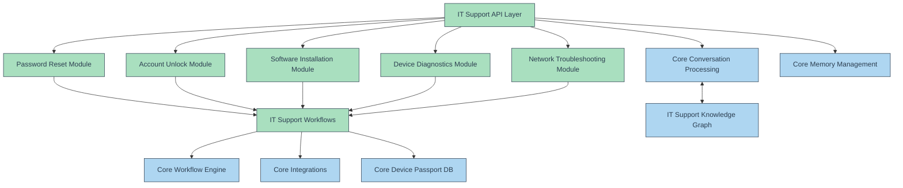
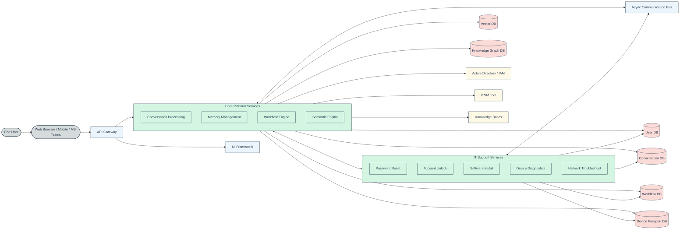

# ME.AI Technical Stack and Architecture - Year 1

**Version:** 1.0  
**Date:** May 13, 2025

## Table of Contents

1. [Introduction](#1-introduction)
   - 1.1 [Purpose](#11-purpose)
   - 1.2 [Year 1 Scope Summary](#12-year-1-scope-summary)
2. [Guiding Architectural Principles for Year 1](#2-guiding-architectural-principles-for-year-1)
3. [Year 1 Core Platform Architecture](#3-year-1-core-platform-architecture)
   - 3.1 [High-Level Core Platform Architecture (Year 1)](#31-high-level-core-platform-architecture-year-1)
   - 3.2 [Key Core Platform Components (Year 1 Focus)](#32-key-core-platform-components-year-1-focus)
     - 3.2.1 [UI Agentic Layer (Year 1)](#321-ui-agentic-layer-year-1)
     - 3.2.2 [Neural Core (Year 1)](#322-neural-core-year-1)
     - 3.2.3 [Mesh Control Protocol (Simplified - Year 1)](#323-mesh-control-protocol-simplified---year-1)
   - 3.3 [Core Platform Technical Stack (Year 1)](#33-core-platform-technical-stack-year-1)
   - 3.4 [Core Platform Data Management (Year 1)](#34-core-platform-data-management-year-1)
4. [Year 1 IT Support Product Architecture](#4-year-1-it-support-product-architecture)
   - 4.1 [High-Level IT Support Product Architecture (Year 1)](#41-high-level-it-support-product-architecture-year-1)
   - 4.2 [Key IT Support Product Modules (Year 1)](#42-key-it-support-product-modules-year-1)
   - 4.3 [Interaction with Core Platform](#43-interaction-with-core-platform)
   - 4.4 [IT Support Product Technical Stack (Year 1)](#44-it-support-product-technical-stack-year-1)
5. [Overall Year 1 System Architecture](#5-overall-year-1-system-architecture)
6. [Deployment Architecture (Year 1)](#6-deployment-architecture-year-1)
7. [Security Architecture (Year 1)](#7-security-architecture-year-1)

## 1. Introduction

### 1.1 Purpose

This document outlines the proposed technical stack and architecture for Year 1 of the ME.AI platform. It focuses on the foundational Core Platform and the initial Agentic Product, IT Support, as defined by the MVP scope and feasibility analysis. The architecture aims to be robust, scalable, and provide a solid base for future enhancements while delivering tangible business value within the first year.

### 1.2 Year 1 Scope Summary

Based on the feasibility analysis of the "ME.ai_FDD_Impl Strategy & Business Value.md" document, the Year 1 scope will prioritize:

*   **Core Platform:** Establishing stable foundational capabilities for conversation processing, memory management, UI interaction, and inter-service communication. This includes features planned up to Release 2, with a focus on robustness and scalability. Advanced mesh concepts and AI features (like full semantic negotiation and dynamic coalition formation) will be initiated but with a more constrained scope, aiming for specific use-case support rather than generalized capabilities in Year 1.
*   **IT Support Product:** Delivering high-value IT automation for password resets, account unlocks, basic software installation, network issue diagnosis, and device diagnostics. The product features will align closely with the realistically achievable Core Platform capabilities within Year 1.

The emphasis is on delivering a functional, reliable, and valuable system in Year 1, deferring some of the most complex R&D-heavy features for more thorough development and stabilization in Year 2.

## 2. Guiding Architectural Principles for Year 1

*   **Modularity and Decoupling:** Design components with clear interfaces to allow for independent development, testing, and scaling.
*   **Iterative Development:** Build a strong foundation and incrementally add complexity and features.
*   **Pragmatism over Premature Complexity:** For Year 1, favor proven technologies and simpler architectural patterns where they meet requirements, especially for advanced mesh and AI concepts. Build towards the full vision iteratively.
*   **Scalability:** Design for horizontal scalability from the outset, particularly for stateless services.
*   **Security by Design:** Integrate security considerations into every layer of the architecture.
*   **Observability:** Implement comprehensive logging, monitoring, and tracing to ensure system health and facilitate troubleshooting.
*   **API-First:** Define clear APIs for inter-service communication and potential external integrations.

## 3. Year 1 Core Platform Architecture

### 3.1 High-Level Core Platform Architecture (Year 1)

```mermaid
flowchart TD
    %% User Interfaces
    ChatWeb[Web Chat Client]
    ChatMobile[Mobile Chat Client]
    MSTeams[MS Teams Integration]
    
    %% UI Layer
    UIAgentFramework[UI Agent Framework]
    UIPersonalization[UI Personalization]
    MultiModal[Multi-Modal Input]
    
    %% Neural Core
    ConvProc[Conversation Processing]
    MemMgmt[Memory Management]
    WorkflowEngine[Workflow Engine]
    SemanticEngine[Semantic Engine]
    
    %% MCP Simplified
    ServiceDiscovery[Service Discovery]
    APIGateway[API Gateway]
    AsyncComm[Async Communication Bus]
    BasicStateSync[Basic State Sync]
    
    %% Data Stores
    UserDB[(User Profile DB)]
    ConvDB[(Conversation DB)]
    WorkflowDB[(Workflow State DB)]
    VectorDB[(Vector DB)]
    KnowledgeGraphDB[(Knowledge Graph DB)]
    DevicePassportDB[(Device Passport DB)]
    
    %% Integrations
    ITSM_API[ITSM System API]
    AD_API[Active Directory API]
    ExternalAI[External AI Services]
    
    %% Connections between interfaces and layers
    ChatWeb & ChatMobile & MSTeams --> UIAgentFramework
    ChatWeb & ChatMobile & MSTeams --> UIPersonalization
    ChatWeb & ChatMobile & MSTeams --> MultiModal
    
    UIAgentFramework & UIPersonalization & MultiModal --> APIGateway
    
    APIGateway --> ConvProc
    APIGateway --> WorkflowEngine
    
    ConvProc --> MemMgmt
    ConvProc --> SemanticEngine
    ConvProc --> WorkflowEngine
    ConvProc --> AsyncComm
    
    MemMgmt --> UserDB
    MemMgmt --> ConvDB
    MemMgmt --> VectorDB
    
    SemanticEngine --> VectorDB
    SemanticEngine --> KnowledgeGraphDB
    
    WorkflowEngine --> WorkflowDB
    WorkflowEngine --> AsyncComm
    WorkflowEngine --> ITSM_API
    WorkflowEngine --> AD_API
    WorkflowEngine --> ExternalAI
    
    ServiceDiscovery --- APIGateway
    ServiceDiscovery --- AsyncComm
    BasicStateSync --- ConvProc
    BasicStateSync --- WorkflowEngine
    
    ConvProc --> DevicePassportDB
    WorkflowEngine --> DevicePassportDB
    
    %% Style classes
    classDef interfaces fill:#F9E79F,stroke:#2C3E50,stroke-width:1px,color:#2C3E50
    classDef uiLayer fill:#D5F5E3,stroke:#2C3E50,stroke-width:1px,color:#2C3E50
    classDef neuralCore fill:#D6EAF8,stroke:#2C3E50,stroke-width:1px,color:#2C3E50
    classDef mcpLayer fill:#D2B4DE,stroke:#2C3E50,stroke-width:1px,color:#2C3E50
    classDef dataStores fill:#FADBD8,stroke:#2C3E50,stroke-width:1px,color:#2C3E50
    classDef integrations fill:#F5CBA7,stroke:#2C3E50,stroke-width:1px,color:#2C3E50
    
    %% Apply classes
    class ChatWeb,ChatMobile,MSTeams interfaces
    class UIAgentFramework,UIPersonalization,MultiModal uiLayer
    class ConvProc,MemMgmt,WorkflowEngine,SemanticEngine neuralCore
    class ServiceDiscovery,APIGateway,AsyncComm,BasicStateSync mcpLayer
    class UserDB,ConvDB,WorkflowDB,VectorDB,KnowledgeGraphDB,DevicePassportDB dataStores
    class ITSM_API,AD_API,ExternalAI integrations
```

### 3.2 Key Core Platform Components (Year 1 Focus)

#### 3.2.1 UI Agentic Layer (Year 1)
*   **UI Agent Framework (Simplified):** Focus on modular, reusable UI components for chat interfaces. True agent autonomy will be deferred. Emphasis on responsive design for web and mobile.
*   **UI Personalization (Basic):** Store and retrieve basic user preferences (e.g., language, theme). Adaptive UI elements based on simple rules or explicit settings.
*   **Multi-Modal Input:** Primarily text-based chat. Basic Speech-to-Text (STT) for voice input can be integrated via cloud services if prioritized, with text being the primary internal processing format.

#### 3.2.2 Neural Core (Year 1)
*   **Conversation Processing Engine:**
    *   **NLU Service:** Intent recognition, entity extraction, sentiment analysis (basic). Utilize pre-trained models (e.g., from Hugging Face Transformers) fine-tuned on IT support data.
    *   **Dialogue Management:** State-based or simple rule-based dialogue flow for guided conversations, especially for IT support workflows.
    *   **NLG Service:** Template-based and simple generative responses. More advanced NLG for empathetic responses will be iterative.
*   **Memory Management:**
    *   **Session Memory:** Store conversation history and context for the current interaction (e.g., in Redis).
    *   **User Profile Store:** Persist user preferences, basic identity information, and links to semantic profiles.
    *   **Short-Term Semantic Cache:** Cache relevant semantic vectors or knowledge graph snippets for active conversations.
*   **Workflow Engine (Orchestration):**
    *   A centralized or service-oriented workflow engine (e.g., using Python libraries like Camunda Zeebe client, Prefect, or a simpler state machine implementation) to manage IT support processes.
    *   Define workflows for password reset, account unlock, etc.
    *   Integrate with external systems (ITSM, AD) via APIs.
*   **Semantic Engine (User/Org Basics):**
    *   **User Semantic Profile (Basic):** Store vector embeddings of user utterances or key concepts to begin building a semantic understanding. Focus on IT-related terminology familiarity.
    *   **Organizational Knowledge (Basic):** Ingest and index IT support knowledge base articles into a vector database and a basic knowledge graph for retrieval and RAG (Retrieval Augmented Generation) patterns.

#### 3.2.3 Mesh Control Protocol (Simplified - Year 1)
*   **Service Discovery:** Leverage Kubernetes DNS for internal service discovery.
*   **API Gateway:** A central entry point for UI clients and potentially external services (e.g., Kong, Spring Cloud Gateway, or cloud provider's native API Gateway).
*   **Asynchronous Communication Bus:** Use a message queue (e.g., RabbitMQ, Kafka, or cloud provider's native service) for decoupling services and handling asynchronous tasks (e.g., long-running workflow steps, notifications).
*   **Basic State Synchronization:** For critical shared state that cannot be fully managed by individual services or databases, explore solutions like etcd or Consul, but aim to minimize distributed state complexity in Year 1.
*   **No full P2P or dynamic coalition formation protocol in Year 1.** Focus on robust service-oriented communication.

### 3.3 Core Platform Technical Stack (Year 1)

| Category             | Technologies (Examples)                                       |
|----------------------|---------------------------------------------------------------|
| **Frontend**         | React, TypeScript, HTML5, CSS3, PWA (for mobile-like chat)    |
| **Backend Services** | Python (Flask/FastAPI), Node.js (Express)                     |
| **Containerization** | Docker                                                        |
| **Orchestration**    | Kubernetes (managed service like EKS, GKE, AKS recommended)     |
| **API Gateway**      | Kong, NGINX Plus, Cloud Provider Native (e.g., AWS API Gateway) |
| **NLU/NLP**          | Hugging Face Transformers, spaCy, NLTK; Fine-tuning on IT data |
| **Workflow Engine**  | Python libraries (e.g., Prefect, Dagster), or Camunda (self-hosted/cloud) for more complex needs if budget allows. Start simple. |
| **Databases**        |                                                               |
|  - Relational        | PostgreSQL (for user profiles, workflow state, structured data) |
|  - Key-Value/Cache   | Redis (for session management, caching)                       |
|  - Vector            | Weaviate, Pinecone, Qdrant, or pgvector extension for PostgreSQL |
|  - Knowledge Graph   | Neo4j (Community Edition), Amazon Neptune (if on AWS), or RDFLib for simpler needs |
|  - Device Passport   | PostgreSQL (initially, with strong encryption and audit)      |
| **Messaging Bus**    | RabbitMQ, Kafka (if high throughput needed), or Cloud Native (e.g., AWS SQS/SNS, Google Pub/Sub) |
| **Service Mesh**     | Istio or Linkerd (consider for Release 2/3 for mTLS, advanced routing, observability if complexity is manageable) |
| **Observability**    | Prometheus, Grafana, ELK Stack (Elasticsearch, Logstash, Kibana) or OpenTelemetry based solutions |
| **Security**         | OAuth 2.0/OIDC (Keycloak), JWT, HTTPS/TLS, HashiCorp Vault (for secrets) |
| **CI/CD**            | Jenkins, GitLab CI, GitHub Actions                            |

### 3.4 Core Platform Data Management (Year 1)

*   **User Profile Database (PostgreSQL):** Stores user identity, authentication details (hashed passwords or identity provider links), roles, basic preferences.
*   **Conversation Database (PostgreSQL or NoSQL like MongoDB if schema is very flexible):** Stores conversation logs, message details, timestamps, user IDs, session IDs.
*   **Workflow State Database (PostgreSQL):** Stores workflow definitions, instance states, task statuses, audit trails for IT support processes.
*   **Vector Database (e.g., Weaviate, Pinecone):** Stores embeddings for user utterances, IT knowledge base articles, and basic semantic profiles.
*   **Knowledge Graph Database (e.g., Neo4j CE):** Stores structured IT knowledge, relationships between CIs, software, users, and known issues. Start with a focused IT support domain model.
*   **Device Passport Database (PostgreSQL):** Securely stores device identifiers, ownership, basic configuration, authentication status, and a link to security policies. Strong encryption for sensitive data and detailed audit logging are paramount.
*   **Data Privacy & Security:** Implement encryption at rest and in transit. Role-based access control (RBAC) for data access. Anonymization/pseudonymization for analytics data where appropriate.

## 4. Year 1 IT Support Product Architecture

### 4.1 High-Level IT Support Product Architecture (Year 1)

### 4.2 Key IT Support Product Modules (Year 1)

*   **Password Reset Module:** Handles self-service password reset requests. Integrates with Active Directory/IAM via Core Integrations. Uses workflows for identity verification (e.g., MFA, security questions) and password update.
*   **Account Unlock Module:** Handles self-service account unlock requests. Similar integration and workflow patterns as password reset.
*   **Software Installation Module (Basic):** Provides guided installation for common, approved software. May involve serving knowledge base articles or triggering very simple, pre-approved automated deployment scripts (if feasible and secure in Year 1).
*   **Device Diagnostics Module (Basic):** Gathers basic diagnostic information from user devices (with user consent and secure agent if applicable, or through user-provided information). Leverages Device Passport DB for device identification. Focus on common issues (disk space, CPU/memory usage, basic connectivity checks).
*   **Network Troubleshooting Module (Basic):** Guides users through common network troubleshooting steps (e.g., checking Wi-Fi, VPN settings, DNS flush). May involve simple automated checks if a secure agent or integration is feasible.

### 4.3 Interaction with Core Platform

*   The IT Support Product heavily relies on the Core Platform:
    *   **Conversation Processing Engine:** For understanding user requests related to IT support.
    *   **Memory Management:** To maintain conversation context and access user profiles.
    *   **Workflow Engine:** To execute the defined IT support processes.
    *   **Semantic Engine:** To access the IT domain knowledge graph and vector DB for providing information and improving NLU.
    *   **Device Passport DB:** For device identification, authentication, and retrieving device-specific information.
    *   **Integrations Layer:** To connect with backend systems like Active Directory and ITSM tools.

### 4.4 IT Support Product Technical Stack (Year 1)

*   The IT Support Product will primarily be a set of services/modules built using the same backend technologies as the Core Platform (e.g., Python/Flask/FastAPI or Node.js/Express).
*   Workflow definitions will be created using the chosen Core Workflow Engine's specification (e.g., BPMN if Camunda is used, or Python code if Prefect/Dagster).
*   Knowledge specific to IT support (FAQs, troubleshooting guides, policies) will be curated and loaded into the Core Knowledge Graph DB and Vector DB.

## 5. Overall Year 1 System Architecture

## 6. Deployment Architecture (Year 1)

*   **Cloud-Native Deployment:** Recommended on a major cloud provider (AWS, Azure, GCP) to leverage managed services (Kubernetes, Databases, Messaging Queues, API Gateway).
*   **Containerization:** All services will be containerized using Docker.
*   **Orchestration:** Kubernetes will be used for deploying, scaling, and managing containerized applications.
*   **Environments:** Separate environments for Development, Staging/QA, and Production.
*   **CI/CD Pipeline:** Automated build, test, and deployment pipelines (e.g., Jenkins, GitLab CI, GitHub Actions).
*   **Scalability:** Stateless services will be designed to scale horizontally. Stateful services and databases will leverage cloud provider scalability features.

## 7. Security Architecture (Year 1)

*   **Authentication:** OAuth 2.0 / OpenID Connect for user authentication. Consider using an identity provider like Keycloak or cloud provider's IAM.
*   **Authorization:** Role-Based Access Control (RBAC) for APIs and data access. Potentially Attribute-Based Access Control (ABAC) for more granular needs later.
*   **Transport Security:** HTTPS/TLS for all external communication. mTLS for inter-service communication within the Kubernetes cluster (can be facilitated by a service mesh like Istio/Linkerd, or implemented at the application/gateway level initially).
*   **Data Security:**
    *   Encryption at rest for all sensitive data in databases (using managed database encryption features).
    *   Encryption in transit for data moving between services and to/from databases.
    *   Secrets management using tools like HashiCorp Vault or cloud provider's secret manager.
*   **API Security:** Input validation, rate limiting, and authentication/authorization at the API Gateway and service levels.
*   **Device Passport Security:** This is critical. Device identity must be strongly verified. Communication with devices for diagnostics or operations must be over secure channels, and actions must be strictly permissioned and audited.
*   **Logging and Auditing:** Comprehensive audit trails for all sensitive operations, especially those involving PII, device access, or system changes.
*   **Vulnerability Management:** Regular security scanning of code, containers, and infrastructure.
*   **Compliance:** Design with relevant compliance standards in mind from the start (e.g., GDPR, CCPA if applicable). Data residency considerations if required.

This document provides a foundational technical architecture for Year 1. It will evolve as the platform matures and new requirements emerge. Continuous review and refinement will be essential.

