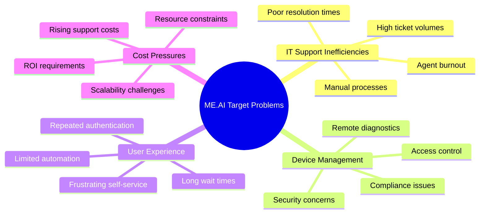
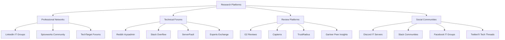
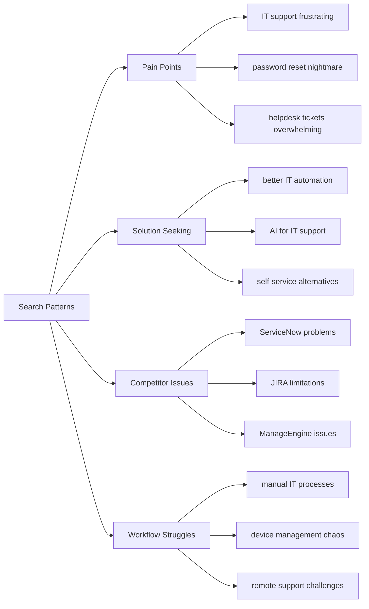
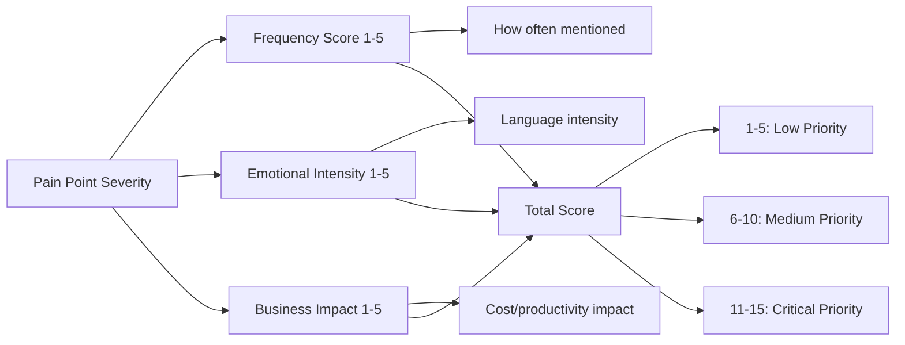
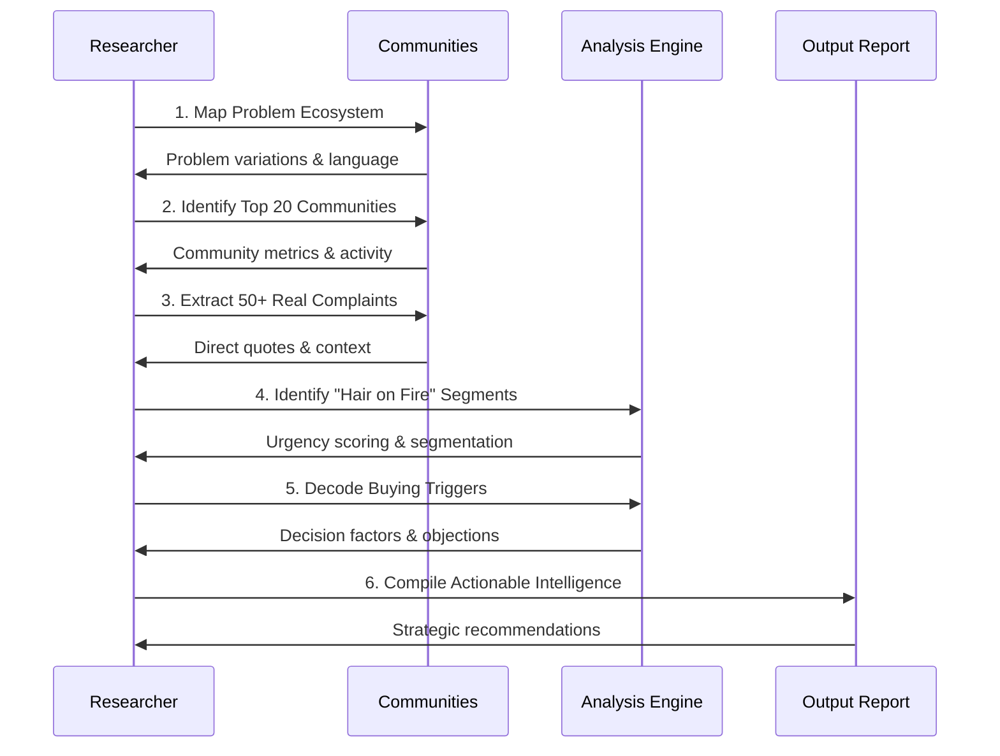
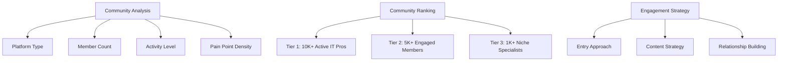
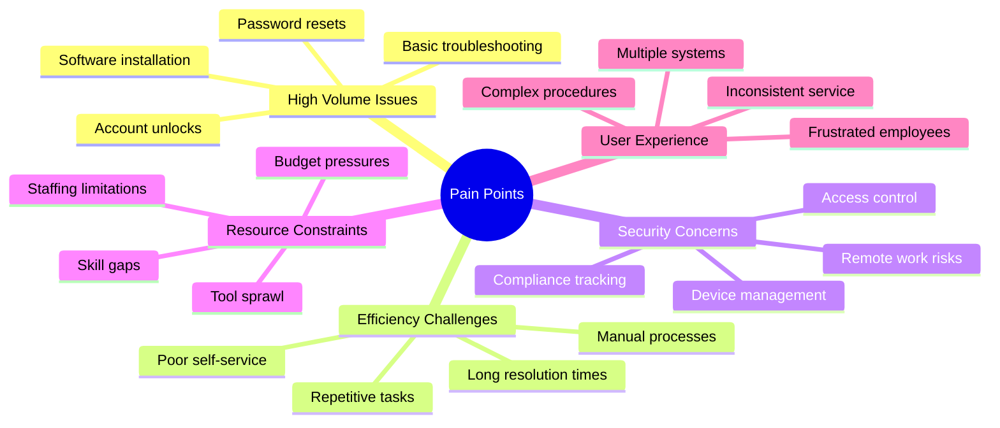
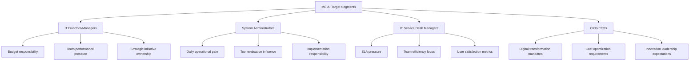
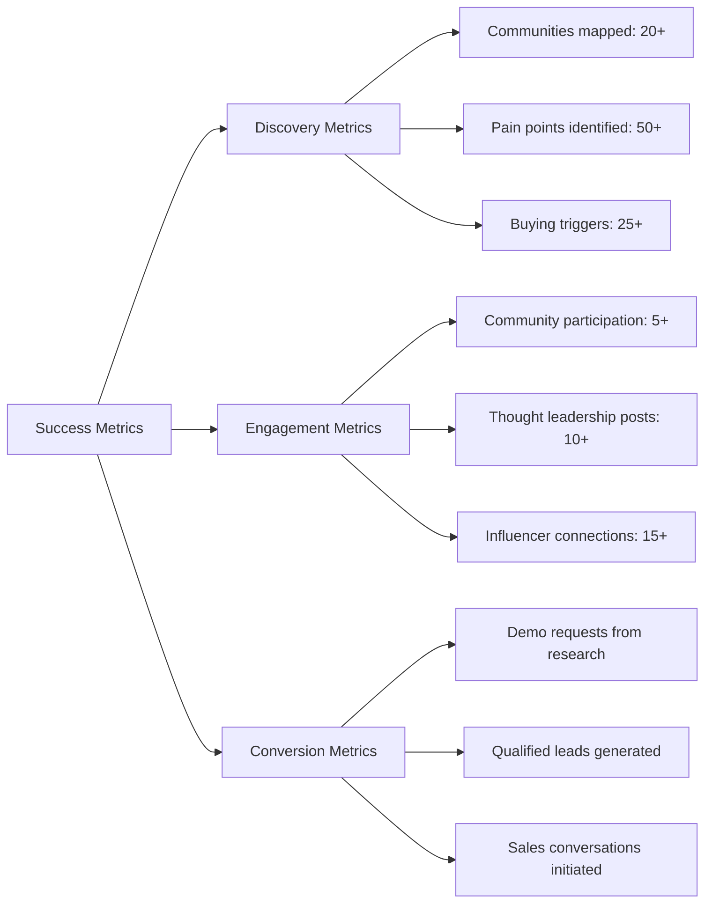

# ME.AI Customer Intelligence Research Framework

## 🎯 Research Mission

**Role**: Elite customer intelligence specialist for ME.AI Neural Core Mesh Platform  
**Goal**: Discover where IT professionals, system administrators, and enterprise decision-makers actively discuss IT support automation challenges and extract their exact pain points, language patterns, and buying triggers.

## 🔍 Research Target

### Problem Space
Organizations struggling with:
- High-volume IT support ticket management
- Password reset and account unlock inefficiencies  
- Manual device management and diagnostics
- Lack of intelligent automation in IT operations
- Poor user experience in IT self-service
- Security challenges in distributed work environments
- Rising IT support costs and resource constraints

## 🔬 Research Protocol

### Search Depth
Conduct exhaustive research across **100+ sources minimum** focusing on:
- Enterprise IT communities
- System administrator forums
- DevOps and infrastructure groups
- Security professional networks
- CIO and IT leadership discussions

### Target Platforms

### Platform-Specific Focus Areas

**Reddit Communities:**
- r/sysadmin (2.1M members)
- r/ITCareerQuestions (400K members)  
- r/networking (300K members)
- r/cybersecurity (500K members)
- r/k12sysadmin (50K members)

**LinkedIn Groups:**
- IT Service Management Professionals
- System Administrators
- CIO/CTO Networks
- DevOps Engineers

**Specialized Forums:**
- Spiceworks Community
- ManageEngine Forums
- ServiceNow Community
- Microsoft TechNet

**Review Platforms:**
- G2 (IT Service Management category)
- Capterra (Help Desk Software)
- TrustRadius (ITSM Tools)

### Search Pattern Templates

**Specific Search Queries:**
- "IT support automation + frustrating/overwhelming/broken"
- "why is password reset so complicated"  
- "alternatives to traditional helpdesk software"
- "I wish there was intelligent IT automation"
- "ServiceNow/JIRA/Remedy problems and limitations"
- "how to reduce IT support tickets without hiring"
- "remote device management security concerns"
- "AI chatbot for IT support experiences"

### Recency Priority
Focus on discussions from **last 6 months** to capture:
- Current remote work challenges
- Recent security incident responses  
- Latest automation tool feedback
- Emerging AI/ML adoption concerns

## 📊 Analysis Framework

### Pain Point Severity Scoring

### Buyer Readiness Indicators

**High Intent Signals:**
- Actively requesting vendor recommendations
- Mentioning budget allocations
- Discussing implementation timelines
- Comparing specific solutions
- Seeking ROI justification help

**Medium Intent Signals:**
- Expressing general frustration
- Asking for best practices
- Researching market options
- Attending to compliance requirements

**Low Intent Signals:**
- General complaints without action
- Theoretical discussions
- Academic interest only

## 🎯 Research Workflow

## 📋 Expected Deliverables Structure

### 1. Hottest Communities Analysis

### 2. Pain Point Intelligence Map

### 3. Language Pattern Analysis

**Customer Language vs. Internal Language:**
- "Our helpdesk is drowning" → High ticket volume
- "Password reset hell" → Authentication friction  
- "IT always says no" → Service delivery challenges
- "Can't get anything done remotely" → Remote work barriers
- "Security is blocking everything" → Security vs. productivity tension

### 4. Buying Trigger Framework

```mermaid
graph LR
    A[Buying Triggers] --> B[Urgency Drivers]
    A --> C[Economic Factors]
    A --> D[Competitive Pressure]
    A --> E[Compliance Requirements]
    
    B --> B1[System outages]
    B --> B2[Security incidents]
    B --> B3[Staff turnover]
    
    C --> C1[Cost reduction mandates]
    C --> C2[Efficiency targets]
    C --> C3[ROI requirements]
    
    D --> D1[Peer implementations]
    D --> D2[Industry benchmarks]
    D --> D3[Vendor evaluations]
    
    E --> E1[Audit findings]
    E --> E2[Regulatory changes]
    E --> E3[Risk assessments]
```

## 🎯 Strategic Application for ME.AI

### Primary Target Segments

### Competitive Intelligence Focus

**Direct Competitors to Monitor:**
- ServiceNow (IT Service Management)
- Microsoft System Center
- ManageEngine ServiceDesk Plus
- Freshservice
- Jira Service Management

**Adjacent Competitors:**
- Traditional chatbot platforms
- RPA tools in IT operations
- Custom automation solutions
- Legacy ITSM implementations

### Value Proposition Validation

Use community intelligence to validate ME.AI's core value propositions:

1. **74% automation rate** - Compare against current manual processes
2. **65% faster resolution** - Benchmark against existing tools
3. **$8M annual savings potential** - Validate against real cost discussions
4. **Neural mesh architecture** - Assess technical differentiation appeal
5. **Device passport security** - Evaluate security concern alignment

## 🚀 Implementation Roadmap

### Phase 1: Intelligence Gathering (Weeks 1-2)
- Map top 20 communities
- Extract 100+ pain point discussions
- Identify key influencers and champions
- Analyze competitor sentiment

### Phase 2: Deep Analysis (Weeks 3-4)  
- Score and prioritize pain points
- Map buyer journey stages
- Identify content gaps and opportunities
- Develop persona-specific messaging

### Phase 3: Engagement Strategy (Weeks 5-6)
- Create community-specific engagement plans
- Develop thought leadership content calendar
- Identify partnership and speaking opportunities
- Launch targeted community participation

### Success Metrics

## 📝 Research Execution Checklist

- [ ] **1**: Complete platform mapping and initial community identification
- [ ] **2**: Extract first 25 pain point discussions with direct quotes
- [ ] **3**: Identify top 10 most active communities for ME.AI targets
- [ ] **4**: Complete competitive sentiment analysis across platforms  
- [ ] **5**: Analyze language patterns and create customer vocabulary guide
- [ ] **6**: Map buyer journey stages and decision-making processes
- [ ] **7**: Develop community-specific engagement strategies
- [ ] **8**: Create content calendar aligned with discovered pain points
- [ ] **9**: Begin strategic community participation and relationship building
- [ ] **10**: Launch thought leadership content distribution
- [ ] **Ongoing**: Monitor, measure, and optimize based on engagement results

---

**Note**: This framework should be executed by someone with deep understanding of both the ME.AI platform capabilities and the IT operations community landscape. The goal is not just to find where people are talking, but to understand exactly how ME.AI's neural mesh architecture and device passport innovations solve their most pressing challenges in ways they haven't seen before.
