# ME.AI Neural Core Platform Architecture v16 - Comprehensive Enterprise Edition

**Version:** 2.2.0  
**Date:** January 2025

## Table of Contents

1. [Executive Summary](#1-executive-summary)
2. [Introduction and System of Context Philosophy](#2-introduction-and-system-of-context-philosophy)
3. [Strategic Four-Pillar Overview](#3-strategic-four-pillar-overview)
4. [Omni-Channel Universal Interface](#4-omni-channel-universal-interface)
5. [Multi-Lingual Support Platform](#5-multi-lingual-support-platform)
6. [Neural Core](#6-neural-core)
7. [Agentic AI Orchestration](#7-agentic-ai-orchestration)
8. [Database Architecture](#8-database-architecture)
9. [Integration Architecture](#9-integration-architecture)
10. [Deployment Architecture](#10-deployment-architecture)
11. [Security Architecture](#11-security-architecture)
12. [Testing Architecture](#12-testing-architecture)
13. [Administration & Configuration Layer](#13-administration--configuration-layer)
14. [Analytics & Insights Layer](#14-analytics--insights-layer)
15. [Developer SDK](#15-developer-sdk)
16. [Key Functional Flows](#16-key-functional-flows)
17. [Implementation Roadmap](#17-implementation-roadmap)

## 1. Executive Summary

The ME.AI Neural Core Platform represents a comprehensive **System of Context** that enables intelligent, empathetic, and multilingual AI interactions across enterprise environments. The architecture is built around four foundational pillars: **Omni-Channel Universal Interface**, **Multi-lingual Support**, **Neural Core**, and **Agentic AI Orchestration**.

This design leverages the **Model Context Protocol (MCP)** for seamless context sharing and **Agent-to-Agent (A2A)** communication patterns for distributed intelligence, while building practical enterprise value through automated IT support and device management.

The platform addresses critical enterprise requirements including GDPR compliance, multi-cultural workforce support, security-first architecture, and seamless integration with existing enterprise systems. It delivers measurable business value through 74% automation of IT support issues while establishing a foundation for advanced AI capabilities.

## 2. Introduction and System of Context Philosophy

### 2.1 System of Context Philosophy

The ME.AI platform operates as a **System of Context** where every interaction contributes to a growing understanding of users, devices, organizational culture, and business processes. This approach transforms traditional reactive IT support into proactive, intelligent assistance that anticipates needs and delivers personalized experiences.

The core principles of our System of Context include:

**Context Accumulation**: Every user interaction, device authentication, and system integration adds layers of understanding that improve future interactions. The platform learns not just what users ask for, but how they prefer to communicate, what cultural context matters to them, and what their role requires in terms of system access and support.

**Context Preservation**: Through the Model Context Protocol, contextual understanding persists across sessions, channels, and agent interactions. When a user switches from chat to voice, or when different AI agents collaborate on a complex task, the full context travels with the interaction.

**Context Distribution**: The Agent-to-Agent communication layer ensures that relevant context reaches every component that needs it, enabling intelligent coordination between specialized agents without losing the human element of the interaction.

**Cultural Context Intelligence**: Understanding that enterprises operate across cultures and languages, the platform preserves not just linguistic differences but cultural communication styles, business etiquette expectations, and regulatory compliance requirements specific to different regions.

### 2.2 Enterprise Value Through Context

This System of Context approach delivers concrete enterprise value by transforming IT support from a cost center into a strategic enabler of productivity and employee satisfaction. Rather than treating each support request as an isolated incident, the platform builds understanding of recurring patterns, user preferences, device capabilities, and organizational processes.

For European enterprises specifically, this contextual intelligence enables compliance with GDPR requirements through automated audit trails, supports multi-cultural workforces through culturally-aware communication, and provides the security-first approach that European organizations demand.

## 3. Strategic Four-Pillar Overview

### 3.1 Architectural Foundation

```mermaid
flowchart TD
    subgraph UC["OMNI-CHANNEL UNIVERSAL"]
        ChatVoice[Chat & Voice]
        DevicePassport[Device Passport]
        MultiChannel[Multi-Channel Support]
        MEDeskApp[ME.AI Desk App & Mobile Apps]
        UniversalAccess[Universal Accessibility]
    end
    
    subgraph ML["MULTI-LINGUAL SUPPORT"]
        Flags[🇩🇪🇰🇷🇧🇪🇨🇳🇫🇷🇬🇧🇳🇱🇩🇰🇪🇸🇮🇹🇧🇷🇦🇷🇵🇹]
        Support24x7[24x7 Support]
        SemanticEmpathy[Semantic Empathy]
        CulturalIntelligence[Cultural Intelligence]
    end
    
    subgraph NC["NEURAL CORE"]
        ConvIntel[Conversational Intelligence]
        IntentDetection[Intent Detection]
        KnowledgeAug[Knowledge Augmentation]
        ServiceOntology[Service Ontology]
        EnterpriseData[Enterprise Data]
        ProprietaryData[Proprietary Data]
        ComprehensiveKG[Comprehensive Service KG]
    end
    
    subgraph AAO["AGENTIC AI ORCHESTRATION"]
        MCP[Model Context Protocol - MCP]
        A2A[Agent-to-Agent Communication]
        RTWorkflows[Real-time Workflows - ME.SLAM]
        MEITAgents[ME.IT Agents]
        MEOperator[ME.aiOperator Agent]
        DynamicActions[Dynamic Actions - ME.AIT Agents]
        AIEcosystem[Multi-Agent Ecosystem Integrations]
    end
    
    UC <--> ML
    ML <--> NC
    NC <--> AAO
    UC <--> AAO
    
    classDef omnichannelStyle fill:#E8F4FD,stroke:#2C3E50,stroke-width:2px,color:#2C3E50
    classDef multilingualStyle fill:#FFF2CC,stroke:#2C3E50,stroke-width:2px,color:#2C3E50
    classDef neuralcoreStyle fill:#FFE6CC,stroke:#2C3E50,stroke-width:2px,color:#2C3E50
    classDef agenticStyle fill:#E1D5E7,stroke:#2C3E50,stroke-width:2px,color:#2C3E50
    
    class UC,ChatVoice,DevicePassport,MultiChannel,MEDeskApp,UniversalAccess omnichannelStyle
    class ML,Flags,Support24x7,SemanticEmpathy,CulturalIntelligence multilingualStyle
    class NC,ConvIntel,IntentDetection,KnowledgeAug,ServiceOntology,EnterpriseData,ProprietaryData,ComprehensiveKG neuralcoreStyle
    class AAO,MCP,A2A,RTWorkflows,MEITAgents,MEOperator,DynamicActions,AIEcosystem agenticStyle
```

### 3.2 System Context Flow Overview

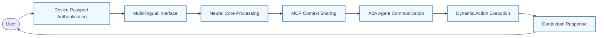

This flow illustrates how context accumulates and flows through each interaction, with the Model Context Protocol ensuring that understanding builds across all system components.

## 4. Omni-Channel Universal Interface

### 4.1 Multi-Channel Support Architecture

The Omni-Channel Universal Interface ensures that users can interact with ME.AI through their preferred communication method while maintaining consistent context and capabilities across all channels.

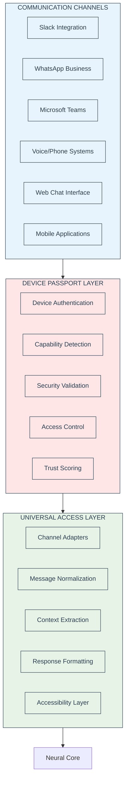

### 4.2 Device Passport Architecture

The Device Passport system provides the security foundation for all interactions, ensuring that every device is authenticated, authorized, and continuously validated according to enterprise security policies.

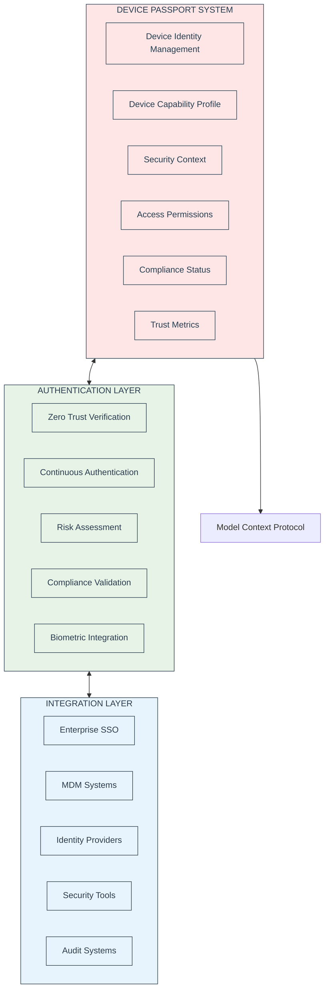

### 4.3 Universal Accessibility Framework

Understanding that enterprise users have diverse accessibility needs, the platform implements comprehensive accessibility support that goes beyond basic compliance to create truly inclusive experiences.

```mermaid
flowchart LR
    subgraph Accessibility["ACCESSIBILITY FRAMEWORK"]
        ScreenReader[Screen Reader Support]
        VoiceNav[Voice Navigation]
        KeyboardNav[Keyboard Navigation]
        HighContrast[High Contrast Modes]
        TextScaling[Text Scaling]
        CognitiveSupport[Cognitive Support]
    end
    
    subgraph Adaptation["ADAPTIVE INTERFACES"]
        UserPreferences[User Preferences]
        ContextualAdaptation[Contextual Adaptation]
        ProgressiveDisclosure[Progressive Disclosure]
        CognitiveFatigue[Cognitive Fatigue Detection]
    end
    
    Accessibility <--> Adaptation
    Adaptation --> MCPContext[MCP Context Integration]
    
    classDef accessStyle fill:#E6F3E6,stroke:#2C3E50,stroke-width:1px,color:#2C3E50
    classDef adaptStyle fill:#FFE6CC,stroke:#2C3E50,stroke-width:1px,color:#2C3E50
    
    class Accessibility,ScreenReader,VoiceNav,KeyboardNav,HighContrast,TextScaling,CognitiveSupport accessStyle
    class Adaptation,UserPreferences,ContextualAdaptation,ProgressiveDisclosure,CognitiveFatigue adaptStyle
```

## 5. Multi-Lingual Support Platform

### 5.1 Cultural Context Architecture

The Multi-Lingual Support Platform recognizes that true global communication requires understanding not just language differences, but cultural context, business etiquette, and regional compliance requirements.

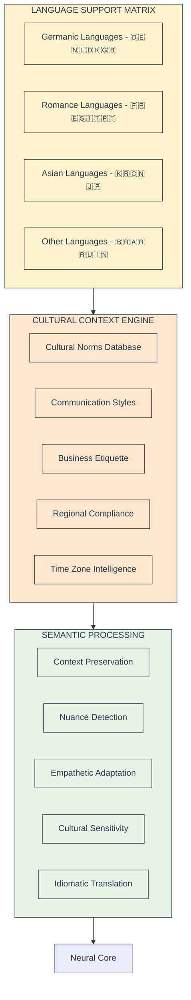

### 5.2 Real-Time Translation and Context Flow

This sophisticated translation system maintains context and cultural appropriateness while providing real-time communication across language barriers.

```mermaid
flowchart LR
    Input[User Input] --> LangDetect[Language Detection]
    LangDetect --> CulturalMap[Cultural Mapping]
    CulturalMap --> SemanticParse[Semantic Parsing]
    SemanticParse --> ContextEnrich[Context Enrichment]
    ContextEnrich --> NeuralProcess[Neural Processing]
    NeuralProcess --> ResponseGen[Response Generation]
    ResponseGen --> CulturalAdapt[Cultural Adaptation]
    CulturalAdapt --> LangLocal[Language Localization]
    LangLocal --> Output[Localized Output]
    
    classDef process fill:#F0F8FF,stroke:#4682B4,stroke-width:1px,color:#2C3E50
    class LangDetect,CulturalMap,SemanticParse,ContextEnrich,ResponseGen,CulturalAdapt,LangLocal process
```

### 5.3 European Market Localization

Given the focus on European markets, the platform includes specialized support for European linguistic and cultural requirements.

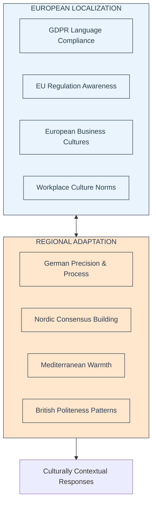

## 6. Neural Core

### 6.1 Conversational Intelligence Architecture

The Neural Core represents the cognitive center of the ME.AI platform, providing sophisticated natural language understanding, context management, and knowledge integration capabilities.

```mermaid
flowchart TD
    subgraph ConversationalIntel["CONVERSATIONAL INTELLIGENCE"]
        NLU[Natural Language Understanding]
        ContextMgmt[Context Management]
        IntentClass[Intent Classification]
        EntityExtract[Entity Extraction]
        EmotionalIntel[Emotional Intelligence]
        ConversationFlow[Conversation Flow Management]
    end
    
    subgraph KnowledgeAug["KNOWLEDGE AUGMENTATION"]
        ServiceOntology[Service Ontology]
        EnterpriseKB[Enterprise Knowledge Base]
        ProprietaryData[Proprietary Data Sources]
        VectorDB[Vector Database]
        GraphDB[Knowledge Graph DB]
        ExternalAPIs[External API Integration]
    end
    
    subgraph MemorySystem["MEMORY SYSTEM"]
        ConversationMemory[Conversation Memory]
        UserProfiles[User Profiles]
        SessionContext[Session Context]
        LongTermMemory[Long-term Memory]
        SemanticCache[Semantic Cache]
        OrganizationalMemory[Organizational Memory]
    end
    
    ConversationalIntel <--> KnowledgeAug
    KnowledgeAug <--> MemorySystem
    MemorySystem --> MCP[Model Context Protocol]
    
    classDef intelStyle fill:#E6F3E6,stroke:#2C3E50,stroke-width:1px,color:#2C3E50
    classDef knowledgeStyle fill:#FFE6CC,stroke:#2C3E50,stroke-width:1px,color:#2C3E50
    classDef memoryStyle fill:#E8F4FD,stroke:#2C3E50,stroke-width:1px,color:#2C3E50
    
    class ConversationalIntel,NLU,ContextMgmt,IntentClass,EntityExtract,EmotionalIntel,ConversationFlow intelStyle
    class KnowledgeAug,ServiceOntology,EnterpriseKB,ProprietaryData,VectorDB,GraphDB,ExternalAPIs knowledgeStyle
    class MemorySystem,ConversationMemory,UserProfiles,SessionContext,LongTermMemory,SemanticCache,OrganizationalMemory memoryStyle
```

### 6.2 User-Specific Semantic Evolution

One of the most sophisticated aspects of the Neural Core is its ability to learn and adapt to individual users while respecting organizational boundaries and cultural contexts.

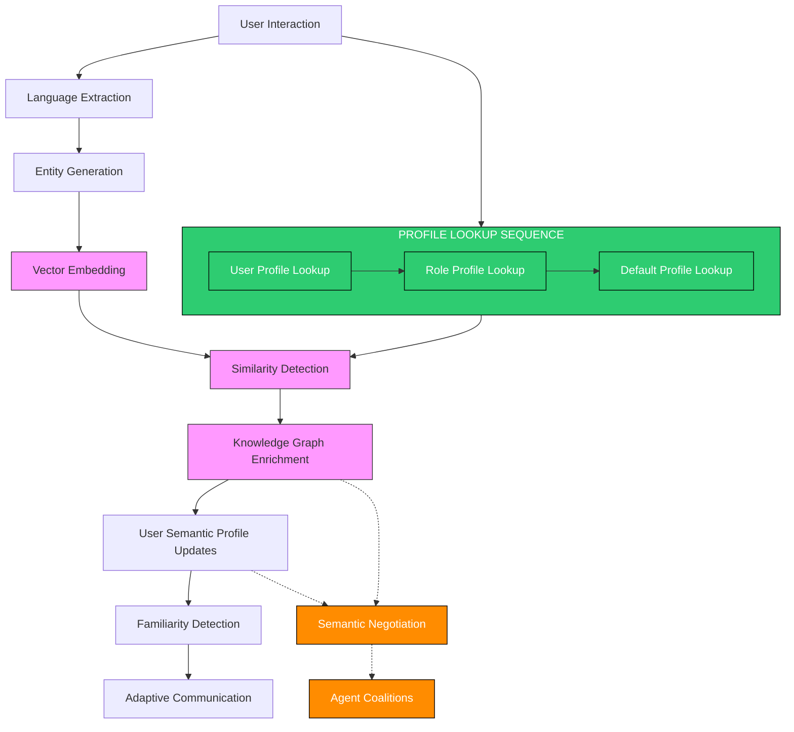

### 6.3 Empathetic Response System

The empathetic response system enables the platform to detect emotional context and respond appropriately, creating more human-like interactions that build trust and satisfaction.

```mermaid
flowchart TD
    MultimodalInput[Multimodal Input] --> EmotionDetection
    
    subgraph EmotionDetection["EMOTION DETECTION"]
        TextSentimentAnalysis[Text-based Sentiment Analysis]
        ContextEmotionRecognition[Context-based Emotion Recognition]
        HistoricalPatternAnalysis[Historical Pattern Analysis]
        CulturalEmotionMapping[Cultural Emotion Mapping]
        SituationalUnderstanding[Situational Understanding]
        EmotionalIntensityEstimation[Emotional Intensity Estimation]
    end
    
    EmotionDetection --> EmpatheticResponse
    
    subgraph EmpatheticResponse["EMPATHETIC RESPONSE"]
        EmotionalMirroring[Emotional Mirroring]
        CulturalAppropriateness[Cultural Appropriateness]
        EmpatheticValidation[Empathetic Validation]
        SupportiveLanguage[Supportive Language]
        ToneCalibration[Tone Calibration]
        PersonalConnection[Personal Connection]
    end
    
    EmpatheticResponse --> AdaptiveEmpathy
    
    subgraph AdaptiveEmpathy["ADAPTIVE EMPATHY"]
        CulturalAdaptation[Cultural Adaptation]
        SituationalAppropriateness[Situational Appropriateness]
        PersonalPreferences[Personal Preferences]
        EmotionalIntelligence[Emotional Intelligence]
        LanguageSensitivity[Language Sensitivity]
        FollowupAwareness[Follow-up Awareness]
    end
    
    AdaptiveEmpathy --> EmpathyNegotiation[Empathy Negotiation]
    EmpathyNegotiation --> AgentCoalitions[Agent Coalitions]
    
    classDef blue fill:#2374ab,stroke:#000,stroke-width:1px,color:#fff
    classDef green fill:#41b883,stroke:#000,stroke-width:1px,color:#fff
    classDef orange fill:#ff8c00,stroke:#000,stroke-width:1px,color:#fff
    classDef new fill:#e74c3c,stroke:#000,stroke-width:1px,color:#fff
    
    class EmotionDetection blue
    class EmpatheticResponse green
    class AdaptiveEmpathy orange
    class EmpathyNegotiation,AgentCoalitions new
```

## 7. Agentic AI Orchestration

### 7.1 Model Context Protocol (MCP) Architecture

The Model Context Protocol serves as the backbone for context sharing and coordination across all AI agents and components in the system.

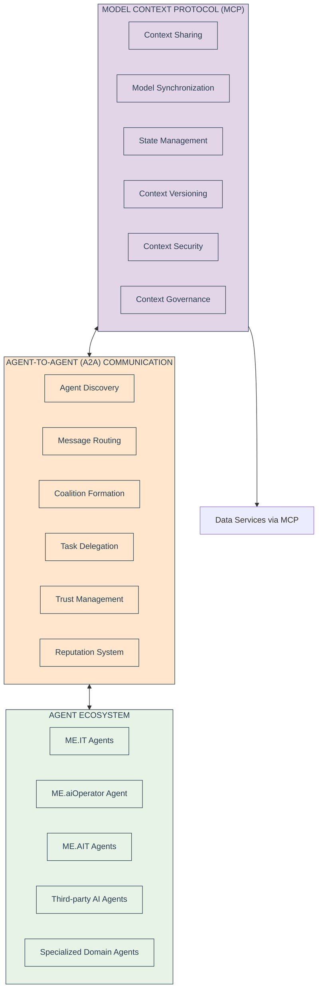

### 7.2 Dynamic Coalition Formation

This sophisticated capability allows AI agents to form temporary coalitions to solve complex problems that require multiple specializations.

```mermaid
flowchart TD
    subgraph DynamicCoalitionFormation["DYNAMIC COALITION FORMATION"]
        TaskPerception[Task Perception]
        CoalitionRequest[Coalition Request]
        CapabilityMatching[Capability Matching]
        NegotiationContracting[Negotiation & Contracting]
        RoleAssignment[Role Assignment]
        CoalitionOperation[Coalition Operation]
        CoalitionDissolution[Coalition Dissolution]
    end
    
    subgraph TrustReputation["TRUST & REPUTATION"]
        TrustMetrics[Trust Metrics]
        ReputationManagement[Reputation Management]
        PerformanceScoring[Performance Scoring]
        HistoryStorage[History Storage]
        ObservedBehavior[Observed Behavior]
        SkillEvaluation[Skill Evaluation]
    end
    
    subgraph CoalitionProtocols["COALITION PROTOCOLS"]
        JoinProtocol[Join Protocol]
        LeaveProtocol[Leave Protocol]
        VotingProtocol[Voting Protocol]
        SemanticNegotiation[Semantic Negotiation]
        ResourceNegotiation[Resource Negotiation]
        CompensationProtocol[Compensation Protocol]
    end
    
    subgraph CoalitionMonitoring["COALITION MONITORING"]
        ProgressTracking[Progress Tracking]
        EffectivenessMonitoring[Effectiveness Monitoring]
        CoalitionLearning[Coalition Learning]
        CollaborationHistory[Collaboration History]
        BehavioralDynamics[Behavioral Dynamics]
        RootCauseAnalysis[Root Cause Analysis]
    end
    
    DynamicCoalitionFormation <--> TrustReputation
    TrustReputation <--> CoalitionProtocols
    CoalitionProtocols <--> CoalitionMonitoring
    
    classDef blue fill:#2374ab,stroke:#000,stroke-width:1px,color:#fff
    classDef green fill:#41b883,stroke:#000,stroke-width:1px,color:#fff
    classDef orange fill:#ff8c00,stroke:#000,stroke-width:1px,color:#fff
    classDef purple fill:#8e44ad,stroke:#000,stroke-width:1px,color:#fff
    
    class DynamicCoalitionFormation blue
    class TrustReputation green
    class CoalitionProtocols orange
    class CoalitionMonitoring purple
```

### 7.3 Real-time Workflows (ME.SLAM) Architecture

ME.SLAM provides the workflow orchestration capabilities that enable complex, multi-step processes while maintaining context and enabling dynamic adaptation.

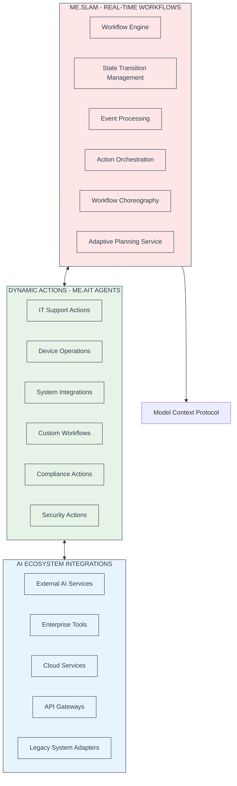

## 8. Database Architecture

The database architecture supports the distributed, context-rich nature of the ME.AI platform while ensuring performance, security, and compliance with enterprise requirements.

### 8.1 Distributed State Management Database

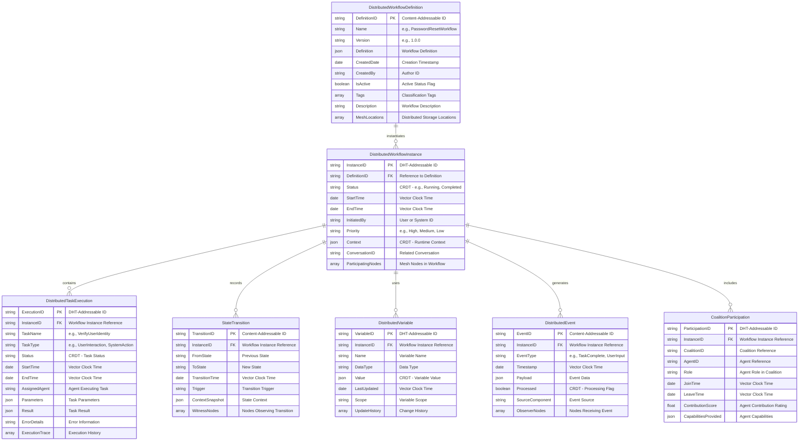

### 8.2 Security & Compliance Database

```mermaid
erDiagram
    DevicePassport ||--o{ DeviceCapability : has
    DevicePassport ||--o{ DeviceAttestation : verifies
    DevicePassport ||--o{ AccessGrant : authorizes
    DevicePassport ||--o{ SecurityAudit : records
    
    SecurityPolicy ||--o{ AccessGrant : governs
    SecurityPolicy ||--o{ ComplianceRequirement : enforces
    SecurityPolicy ||--o{ SecurityAudit : validates
    
    ComplianceFramework ||--o{ ComplianceRequirement : defines
    ComplianceFramework ||--o{ ComplianceAudit : assesses
    
    DevicePassport {
        string DeviceID PK "Unique Device Identifier"
        string DeviceType "e.g., Laptop, Mobile"
        string Manufacturer "Device Manufacturer"
        string Model "Device Model"
        string FirmwareVersion "Current Firmware"
        string OSVersion "Operating System Version"
        date RegistrationDate "Initial Registration"
        date LastUpdated "Last Profile Update"
        date LastAuthenticated "Last Authentication"
        string Status "Active/Inactive/Quarantined"
        string Owner "Organization/User Reference"
        float TrustScore "Dynamic Trust Rating"
        string PublicKey "Device Public Key"
        json PassportMetadata "Additional Metadata"
    }
    
    DeviceCapability {
        string CapabilityID PK "Capability Identifier"
        string DeviceID FK "Device Reference"
        string CapabilityName "e.g., RemoteControl, Diagnostics"
        string CapabilityType "Capability Classification"
        json CapabilityMetadata "Capability Details"
        date VerificationDate "Verification Timestamp"
        string VerificationMethod "How Verified"
        boolean IsActive "Active Status"
    }
    
    DeviceAttestation {
        string AttestationID PK "Attestation Identifier"
        string DeviceID FK "Device Reference"
        date AttestationTime "Timestamp"
        string AttestationType "Attestation Method"
        json AttestationResult "Verification Result"
        string AttestationAuthority "Verifying Authority"
        string BlockchainReference "Immutable Reference"
        string ProofHash "Cryptographic Proof"
    }
    
    AccessGrant {
        string GrantID PK "Grant Identifier"
        string DeviceID FK "Device Reference"
        string SecurityPolicyID FK "Policy Reference"
        string ResourceType "e.g., System, Application"
        string ResourceID "Specific Resource"
        string AccessLevel "e.g., Read, Write, Execute"
        date GrantStart "Grant Start Time"
        date GrantEnd "Grant Expiration"
        string GrantReason "Justification"
        string ApprovedBy "Approver ID"
        boolean IsActive "Active Status"
    }
    
    SecurityPolicy {
        string PolicyID PK "Policy Identifier"
        string PolicyName "Policy Name"
        string PolicyVersion "Version Number"
        date CreationDate "Creation Timestamp"
        date EffectiveDate "Effective From"
        date ExpirationDate "Valid Until"
        string Status "Policy Status"
        string Author "Author ID"
        string ApprovedBy "Approver ID"
        json PolicyRules "Policy Rules"
        string Scope "Global/Organization/Team"
    }
    
    ComplianceRequirement {
        string RequirementID PK "Requirement Identifier"
        string SecurityPolicyID FK "Policy Reference"
        string FrameworkID FK "Framework Reference"
        string RequirementCode "Requirement Code"
        string Description "Description"
        string ControlType "Type of Control"
        string VerificationMethod "Verification Method"
        string Priority "Requirement Priority"
        boolean IsActive "Active Status"
    }
    
    SecurityAudit {
        string AuditID PK "Audit Identifier"
        string DeviceID FK "Device Reference"
        string PolicyID FK "Policy Reference"
        date AuditTime "Audit Timestamp"
        string AuditType "Audit Type"
        string AuditResult "Audit Result"
        string AuditorID "Auditor Reference"
        json AuditDetails "Detailed Results"
        string RemediationStatus "Remediation Status"
        json RemediationDetails "Remediation Information"
    }
    
    ComplianceFramework {
        string FrameworkID PK "Framework Identifier"
        string FrameworkName "Framework Name"
        string Version "Version Number"
        string Issuer "Issuing Organization"
        date PublicationDate "Publication Date"
        date AdoptionDate "Adoption Date"
        string Status "Framework Status"
        string Scope "Application Scope"
        string IndustryFocus "Industry Focus"
    }
    
    ComplianceAudit {
        string AuditID PK "Audit Identifier"
        string FrameworkID FK "Framework Reference"
        date AuditDate "Audit Date"
        string AuditScope "Audit Scope"
        string AuditorOrganization "Auditor Organization"
        string AuditorName "Auditor Name"
        string AuditResult "Audit Result"
        float ComplianceScore "Compliance Score"
        json FindingDetails "Finding Details"
        string RemediationPlan "Remediation Plan"
        date NextAuditDue "Next Audit Due"
    }
```

### 8.3 User Semantic Profile Database

This database captures the evolving understanding of user preferences, communication styles, and knowledge levels that enable personalized interactions.

```mermaid
erDiagram
    DistributedUserProfile ||--o{ UserSemanticProfile : has
    DistributedUserProfile ||--o{ EntityFamiliarity : tracks
    DistributedUserProfile ||--o{ UserKnowledgeNode : contains
    UserKnowledgeNode ||--o{ UserKnowledgeRelationship : participatesIn
    DistributedUserProfile ||--o{ ConceptualUnderstanding : measures
    
    OrganizationSemanticProfile ||--o{ SemanticDomain : defines
    OrganizationSemanticProfile ||--o{ StandardOntology : establishes
    
    UserSemanticProfile ||--o{ SemanticNegotiationRecord : participatesIn
    OrganizationSemanticProfile ||--o{ SemanticNegotiationRecord : participatesIn
    SemanticNegotiationRecord ||--o{ OntologyAlignmentResult : produces
    
    UserSemanticProfile ||--o{ CoalitionParticipation : enables
    SemanticLearningEvent ||--o{ UserSemanticProfile : updates
    
    DistributedUserProfile {
        string UserID PK "Content-Addressable ID"
        object BasicInfo "CRDT - Personal Information"
        object CommunicationPrefs "CRDT - Communication Settings"
        object LanguageProficiency "CRDT - Language Capabilities"
        object InteractionMetrics "CRDT - Usage Statistics"
        object LearningProfile "CRDT - Learning Patterns"
        array MeshLocations "Distributed Storage Locations"
    }
    
    UserSemanticProfile {
        string ProfileID PK "Content-Addressable ID"
        string UserID FK "User Reference"
        date CreationDate "Vector Clock - Creation Time"
        date LastUpdated "Vector Clock - Last Update"
        vector SemanticVector "Distributed Vector DB - Embedding"
        boolean DefaultOrganizationProfile "CRDT - Default Status"
        string ActiveStatus "CRDT - Status Values"
        string Version "Semantic Version Number"
        vector ConceptualModelVector "Conceptual Representation"
    }
    
    OrganizationSemanticProfile {
        string ProfileID PK "Content-Addressable ID"
        string OrgID "Organization Reference"
        string ProfileName "Profile Identifier"
        string ProfileType "Role/Department/Default"
        date CreationDate "Vector Clock - Creation Time"
        date LastUpdated "Vector Clock - Last Update"
        vector SemanticVector "Distributed Vector DB - Embedding"
        object AccessControl "CRDT - Access Rules"
        string Version "Semantic Version Number"
        vector ConceptualModelVector "Conceptual Representation"
    }
    
    SemanticDomain {
        string DomainID PK "Content-Addressable ID"
        string ProfileID FK "Organization Profile Reference"
        string DomainName "Domain Identifier"
        object DomainParameters "Domain Configuration"
        vector DomainEmbedding "Domain Vector Representation"
        array DomainVocabulary "Specific Terminology"
        object DomainRules "Domain-Specific Rules"
    }
    
    StandardOntology {
        string OntologyID PK "Content-Addressable ID"
        string ProfileID FK "Organization Profile Reference"
        string OntologyName "Ontology Identifier"
        object OntologyDefinition "Ontology Structure"
        object MappingRules "Entity Mapping Rules"
        date EffectiveDate "Vector Clock - Effective Time"
        float VersionNumber "Ontology Version"
    }
    
    EntityFamiliarity {
        string RecordID PK "Content-Addressable ID"
        string UserID FK "User Reference"
        string EntityID "Content-Addressable Entity Reference"
        float Familiarity "CRDT - Familiarity Score"
        date FirstEncounter "Vector Clock - First Seen"
        date LastEncounter "Vector Clock - Last Seen"
        int EncounterCount "CRDT - Occurrence Counter"
        float Importance "CRDT - Importance Weight"
    }
    
    UserKnowledgeNode {
        string NodeID PK "Content-Addressable ID"
        string UserID FK "User Reference"
        string EntityType "CRDT - Entity Classification"
        string EntityName "CRDT - Entity Name"
        object EntityProperties "CRDT - Entity Attributes"
        float PersonalSignificance "CRDT - User Relevance"
        date CreationDate "Vector Clock - Creation Time"
        date LastReferenced "Vector Clock - Last Referenced"
        int ReferenceCount "CRDT - Reference Counter"
        string PersonalContext "CRDT - User Context Notes"
    }
    
    UserKnowledgeRelationship {
        string RelationshipID PK "Content-Addressable ID"
        string UserID FK "User Reference"
        string SourceNodeID FK "Source Node Reference"
        string TargetNodeID FK "Target Node Reference"
        string RelationType "CRDT - Relationship Type"
        float Strength "CRDT - Relationship Strength"
        string Evidence "CRDT - Supporting Evidence"
        date FirstObserved "Vector Clock - First Observed"
        date LastReinforced "Vector Clock - Last Reinforced"
        float ConfidenceScore "CRDT - Confidence Level"
    }
    
    ConceptualUnderstanding {
        string UnderstandingID PK "Content-Addressable ID"
        string UserID FK "User Reference"
        string ConceptID "Content-Addressable Concept Reference"
        float UnderstandingLevel "CRDT - Comprehension Level"
        array Misconceptions "CRDT - Misunderstanding Notes"
        object LearningTrajectory "CRDT - Learning Path"
        array ContextualUsage "CRDT - Usage Examples"
    }
    
    SemanticNegotiationRecord {
        string NegotiationID PK "Content-Addressable ID" 
        string UserProfileID FK "User Profile Reference"
        string OrgProfileID FK "Organization Profile Reference"
        date NegotiationTime "Vector Clock - Negotiation Time"
        string ConversationID "Conversation Reference"
        object VectorSpaceMapping "Vector Space Transformation"
        object ConceptualModelAlignment "Model Alignment Data"
        float MatchScore "Profile Match Score"
        boolean UseUserSemantics "User Semantics Preference"
        object NegotiationContext "Contextual Information"
    }
    
    OntologyAlignmentResult {
        string AlignmentID PK "Content-Addressable ID"
        string NegotiationID FK "Negotiation Reference"
        object AlignmentMappings "Entity/Concept Mappings"
        float AlignmentScore "Overall Alignment Quality"
        array ConflictResolutions "Resolved Semantic Conflicts"
        object MergedOntology "Resulting Combined Ontology"
        date CreationTime "Vector Clock - Creation Time"
    }
    
    CoalitionParticipation {
        string ParticipationID PK "Content-Addressable ID"
        string UserProfileID FK "User Profile Reference"
        string CoalitionID "Coalition Reference"
        date JoinTime "Vector Clock - Join Time"
        object SemanticContribution "Semantic Context Provided"
        string ParticipationRole "Role in Coalition"
        object NegotiatedSemantics "Agreed Semantic Context"
    }
    
    SemanticLearningEvent {
        string EventID PK "Content-Addressable ID"
        string UserProfileID FK "User Profile Reference"
        date EventTime "Vector Clock - Event Time"
        string EventType "Learning Event Type"
        object LearningContext "Context Description"
        object SemanticUpdate "Semantic Change Details"
        object PreviousState "Profile State Before Update"
        object NewState "Profile State After Update"
        float ConfidenceScore "Update Confidence Level"
    }
```

### 8.4 Conversation Memory Database

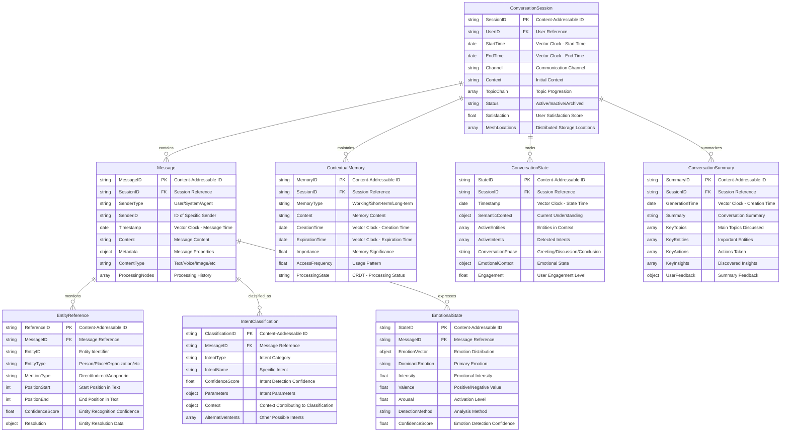

### 8.5 Data Services via MCP

This architecture shows how all data access is mediated through the Model Context Protocol, enabling context-aware data retrieval and updates.

```mermaid
flowchart LR
    subgraph DataServices["DATA SERVICES VIA MCP"]
        UserProfileService[User Profile Service]
        ConversationService[Conversation Service]
        KnowledgeService[Knowledge Service]
        DeviceService[Device Service]
        WorkflowService[Workflow Service]
        SecurityService[Security Service]
    end
    
    subgraph MCPProtocol["MCP PROTOCOL LAYER"]
        ContextAPI[Context API]
        DataSync[Data Synchronization]
        EventStream[Event Streaming]
        SecurityLayer[Security Layer]
        VersionControl[Version Control]
        AccessControl[Access Control]
    end
    
    subgraph Storage["STORAGE LAYER"]
        VectorDB[(Vector Database)]
        GraphDB[(Knowledge Graph)]
        TimeSeriesDB[(Time Series DB)]
        RelationalDB[(Relational DB)]
        DocumentDB[(Document DB)]
        BlockchainDB[(Blockchain DB)]
    end
    
    DataServices <--> MCPProtocol
    MCPProtocol <--> Storage
    
    classDef serviceStyle fill:#E1D5E7,stroke:#2C3E50,stroke-width:1px,color:#2C3E50
    classDef protocolStyle fill:#FFE6CC,stroke:#2C3E50,stroke-width:1px,color:#2C3E50
    classDef storageStyle fill:#E8F4FD,stroke:#2C3E50,stroke-width:1px,color:#2C3E50
    
    class DataServices,UserProfileService,ConversationService,KnowledgeService,DeviceService,WorkflowService,SecurityService serviceStyle
    class MCPProtocol,ContextAPI,DataSync,EventStream,SecurityLayer,VersionControl,AccessControl protocolStyle
    class Storage,VectorDB,GraphDB,TimeSeriesDB,RelationalDB,DocumentDB,BlockchainDB storageStyle
```

## 9. Integration Architecture

Enterprise integration capabilities are critical for ME.AI adoption, particularly in complex European enterprise environments with diverse technology stacks.

### 9.1 Integration Patterns and Endpoints

```mermaid
flowchart TD
    subgraph IntegrationPatterns["INTEGRATION PATTERNS"]
        APIIntegration[API-based Integration]
        EventDrivenIntegration[Event-driven Integration]
        FileBasedIntegration[File-based Integration]
        MessageBasedIntegration[Message-based Integration]
        DatabaseIntegration[Database Integration]
        WebhookIntegration[Webhook Integration]
    end
    
    subgraph IntegrationEndpoints["INTEGRATION ENDPOINTS"]
        CRMSystems[External CRM Systems]
        AuthenticationSystems[Authentication Systems]
        KnowledgeBaseSystems[Knowledge Base Systems]
        ERPSystems[ERP Systems]
        TicketingSystems[Ticketing Systems]
        TelephonySystems[Telephony Systems]
        ITSMSystems[ITSM Systems]
        CloudServices[Cloud Services]
    end
    
    subgraph IntegrationServices["INTEGRATION SERVICES"]
        APIGatewayMesh[API Gateway Mesh]
        MessageBrokerMesh[Message Broker Mesh]
        EventBusMesh[Event Bus Mesh]
        DataIntegrationMesh[Data Integration Mesh]
        AuthenticationService[Authentication Service]
        TransformationService[Transformation Service]
    end
    
    subgraph IntegrationSecurity["INTEGRATION SECURITY"]
        APISecurityGateway[API Security Gateway]
        DataEncryption[Data Encryption]
        AuthenticationAuthorization[Authentication & Authorization]
        AuditTrail[Audit Trail]
        RateLimiting[Rate Limiting]
        ThreatProtection[Threat Protection]
    end
    
    IntegrationPatterns <--> IntegrationEndpoints
    IntegrationEndpoints <--> IntegrationServices
    IntegrationServices <--> IntegrationSecurity
    
    IntegrationServices <--> CoalitionFormationProtocol[Coalition Formation Protocol]
    CoalitionFormationProtocol <--> AgentCoalitions[Agent Coalitions]
    
    classDef blue fill:#2374ab,stroke:#000,stroke-width:1px,color:#fff
    classDef green fill:#41b883,stroke:#000,stroke-width:1px,color:#fff
    classDef orange fill:#ff8c00,stroke:#000,stroke-width:1px,color:#fff
    classDef purple fill:#8e44ad,stroke:#000,stroke-width:1px,color:#fff
    classDef new fill:#e74c3c,stroke:#000,stroke-width:1px,color:#fff
    
    class IntegrationPatterns blue
    class IntegrationEndpoints green
    class IntegrationServices orange
    class IntegrationSecurity purple
    class CoalitionFormationProtocol,AgentCoalitions new
```

### 9.2 European Enterprise Integration Focus

Given the European market focus, specific integration patterns address common European enterprise requirements.

```mermaid
flowchart LR
    subgraph EuropeanSystems["EUROPEAN ENTERPRISE SYSTEMS"]
        SAPSystems[SAP ERP & SuccessFactors]
        OracleCloud[Oracle Cloud Applications]
        ServiceNow[ServiceNow ITSM]
        Microsoft365[Microsoft 365 & Teams]
        SalesforceEU[Salesforce European Instances]
        WorkdayEU[Workday European Deployments]
    end
    
    subgraph ComplianceIntegrations["COMPLIANCE INTEGRATIONS"]
        GDPRSystems[GDPR Compliance Tools]
        EUAuditSystems[EU Audit Systems]
        DataResidency[Data Residency Controls]
        RegionalCompliance[Regional Compliance Tools]
    end
    
    subgraph SecurityIntegrations["SECURITY INTEGRATIONS"]
        ZeroTrustSystems[Zero Trust Platforms]
        EUIAMSystems[EU IAM Systems]
        CyberSecurity[Cybersecurity Platforms]
        SOCIntegration[SOC Integration]
    end
    
    EuropeanSystems <--> MCPProtocol[MCP Integration Protocol]
    ComplianceIntegrations <--> MCPProtocol
    SecurityIntegrations <--> MCPProtocol
    
    classDef europeanStyle fill:#E8F4FD,stroke:#2C3E50,stroke-width:1px,color:#2C3E50
    classDef complianceStyle fill:#FFE6CC,stroke:#2C3E50,stroke-width:1px,color:#2C3E50
    classDef securityStyle fill:#FFE6E6,stroke:#2C3E50,stroke-width:1px,color:#2C3E50
    
    class EuropeanSystems,SAPSystems,OracleCloud,ServiceNow,Microsoft365,SalesforceEU,WorkdayEU europeanStyle
    class ComplianceIntegrations,GDPRSystems,EUAuditSystems,DataResidency,RegionalCompliance complianceStyle
    class SecurityIntegrations,ZeroTrustSystems,EUIAMSystems,CyberSecurity,SOCIntegration securityStyle
```

## 10. Deployment Architecture

### 10.1 Multi-Environment Deployment Strategy

```mermaid
flowchart TD
    subgraph MultiEnvironmentDeployment["MULTI-ENVIRONMENT DEPLOYMENT"]
        DevelopmentMesh[Development Mesh]
        TestingMesh[Testing Mesh]
        StagingMesh[Staging Mesh]
        ProductionMesh[Production Mesh]
    end
    
    MultiEnvironmentDeployment --> KubernetesProduction
    
    subgraph KubernetesProduction["KUBERNETES MESH (PRODUCTION)"]
        subgraph IngressLayer["INGRESS LAYER"]
            LoadBalancerMesh[Load Balancer Mesh]
            APIGatewayMesh[API Gateway Mesh]
            DDoSProtection[DDoS Protection]
        end
        
        subgraph ServiceMesh["SERVICE MESH"]
            ServiceMeshComponents[Service Mesh Components]
            MCPServiceMesh[MCP Service Mesh]
            A2AServiceMesh[A2A Service Mesh]
        end
        
        subgraph ApplicationServices["APPLICATION SERVICES"]
            AuthenticationServiceDep[Authentication Service]
            ConversationProcessing[Conversation Processing]
            AgentOrchestration[AI Agent Orchestration]
            SemanticEnrichment[Semantic Enrichment]
            WorkflowEngine[Workflow Engine]
            MCPCoordination[MCP Coordination Service]
        end
        
        subgraph DataServices["DATA SERVICES"]
            RedisCluster[Redis Cluster]
            PostgreSQLMesh[PostgreSQL Mesh]
            Neo4jCluster[Neo4j Cluster]
            Elasticsearch[Elasticsearch]
            VectorDatabase[Vector DB]
            BlockchainNodes[Blockchain Nodes]
        end
        
        subgraph PlatformServices["PLATFORM SERVICES"]
            Monitoring[Monitoring]
            Logging[Logging]
            CICDPipeline[CI/CD Pipeline]
            SecurityScanning[Security Scanning]
        end
        
        IngressLayer <--> ServiceMesh <--> ApplicationServices
        ApplicationServices <--> DataServices
        PlatformServices <--> ApplicationServices
    end
    
    classDef blue fill:#2374ab,stroke:#000,stroke-width:1px,color:#fff
    classDef green fill:#41b883,stroke:#000,stroke-width:1px,color:#fff
    classDef orange fill:#ff8c00,stroke:#000,stroke-width:1px,color:#fff
    classDef purple fill:#8e44ad,stroke:#000,stroke-width:1px,color:#fff
    classDef red fill:#e74c3c,stroke:#000,stroke-width:1px,color:#fff
    
    class MultiEnvironmentDeployment blue
    class IngressLayer green
    class ServiceMesh orange
    class ApplicationServices purple
    class DataServices red
    class PlatformServices orange
```

### 10.2 European Data Residency and Compliance Deployment

```mermaid
flowchart LR
    subgraph EUDataCenters["EU DATA CENTERS"]
        GermanyRegion[Germany Region - Frankfurt]
        UKRegion[UK Region - London]
        NetherlandsRegion[Netherlands Region - Amsterdam]
        FranceRegion[France Region - Paris]
        NordicRegion[Nordic Region - Stockholm]
    end
    
    subgraph DataResidencyControls["DATA RESIDENCY CONTROLS"]
        DataClassification[Data Classification]
        ResidencyPolicies[Residency Policies]
        ComplianceMonitoring[Compliance Monitoring]
        AuditTrails[Audit Trails]
    end
    
    subgraph CrossBorderControls["CROSS-BORDER CONTROLS"]
        DataFlowMapping[Data Flow Mapping]
        TransferApprovals[Transfer Approvals]
        EncryptionInTransit[Encryption in Transit]
        LegalBasisTracking[Legal Basis Tracking]
    end
    
    EUDataCenters <--> DataResidencyControls
    DataResidencyControls <--> CrossBorderControls
    CrossBorderControls --> GDPRCompliance[GDPR Compliance Framework]
    
    classDef regionStyle fill:#E8F4FD,stroke:#2C3E50,stroke-width:1px,color:#2C3E50
    classDef residencyStyle fill:#FFE6CC,stroke:#2C3E50,stroke-width:1px,color:#2C3E50
    classDef borderStyle fill:#E6F3E6,stroke:#2C3E50,stroke-width:1px,color:#2C3E50
    
    class EUDataCenters,GermanyRegion,UKRegion,NetherlandsRegion,FranceRegion,NordicRegion regionStyle
    class DataResidencyControls,DataClassification,ResidencyPolicies,ComplianceMonitoring,AuditTrails residencyStyle
    class CrossBorderControls,DataFlowMapping,TransferApprovals,EncryptionInTransit,LegalBasisTracking borderStyle
```

## 11. Security Architecture

### 11.1 Zero Trust Security Model

```mermaid
flowchart TD
    subgraph ZeroTrustModel["ZERO TRUST MODEL"]
        subgraph CorePrinciples["CORE PRINCIPLES"]
            NeverTrust[Never Trust, Always Verify]
            LeastPrivilege[Least Privilege Access]
            AssumeBreach[Assume Breach Posture]
            ContinuousMonitoring[Continuous Monitoring]
        end
        
        subgraph ZeroTrustComponents["ZERO TRUST COMPONENTS"]
            IdentityVerification[Identity Verification]
            DeviceAuthenticationAuthorization[Device Authentication & Authorization]
            NetworkMicrosegmentation[Network Microsegmentation]
            DataProtection[Data Protection]
        end
        
        subgraph Implementation["IMPLEMENTATION"]
            AccessControls[Access Controls]
            MonitoringEnforcement[Monitoring & Enforcement]
            DynamicAuthorization[Dynamic Authorization]
            PolicyAdministration[Policy Administration]
        end
        
        subgraph OperationalZeroTrust["OPERATIONAL ZERO TRUST"]
            AnomalyDetection[Anomaly Detection]
            IncidentResponse[Incident Response]
            ThreatAnalytics[Threat Analytics]
            ZeroTrustPosture[Zero Trust Posture]
        end
    end
    
    ZeroTrustModel --> SecureDataEnvironment[Secure Data Environment]
    
    classDef cp fill:#D5F5E3,stroke:#2C3E50,stroke-width:1px,color:#2C3E50
    classDef zc fill:#D6EAF8,stroke:#2C3E50,stroke-width:1px,color:#2C3E50
    classDef zi fill:#F9E79F,stroke:#2C3E50,stroke-width:1px,color:#2C3E50
    classDef oz fill:#FADBD8,stroke:#2C3E50,stroke-width:1px,color:#2C3E50
    classDef outcome fill:#D2B4DE,stroke:#2C3E50,stroke-width:1px,color:#2C3E50
    
    class CorePrinciples,NeverTrust,LeastPrivilege,AssumeBreach,ContinuousMonitoring cp
    class ZeroTrustComponents,IdentityVerification,DeviceAuthenticationAuthorization,NetworkMicrosegmentation,DataProtection zc
    class Implementation,AccessControls,MonitoringEnforcement,DynamicAuthorization,PolicyAdministration zi
    class OperationalZeroTrust,AnomalyDetection,IncidentResponse,ThreatAnalytics,ZeroTrustPosture oz
    class SecureDataEnvironment outcome
```

### 11.2 Privacy by Design Implementation

```mermaid
flowchart TD
    subgraph PrivacyByDesign["PRIVACY BY DESIGN"]
        subgraph PrivacyPrinciples["PRIVACY PRINCIPLES"]
            ProactiveNotReactive[Proactive not Reactive]
            PrivacyAsDefault[Privacy as Default]
            PrivacyInSystemDesign[Privacy in System Design]
            PositiveSumApproach[Positive-Sum Approach]
        end
        
        subgraph PrivacyImplementation["PRIVACY IMPLEMENTATION"]
            DataMinimization[Data Minimization]
            PurposeLimitation[Purpose Limitation]
            LawfulSecureProcessing[Lawful & Secure Processing]
            TransparencyDocumentation[Transparency & Documentation]
        end
        
        subgraph PrivacyDataRights["PRIVACY DATA RIGHTS"]
            DataSubjectAccessRights[Data Subject Access Rights]
            DataPortability[Data Portability]
            RightToBeForgotten[Right to be Forgotten]
            RightToObject[Right to Object]
        end
        
        subgraph PrivacyGovernance["PRIVACY GOVERNANCE"]
            DataProtectionImpactAssessment[Data Protection Impact Assessment]
            DataProtectionOfficerSupport[Data Protection Officer Support]
            PrivacyBreachManagement[Privacy Breach Management]
            PrivacyControlFramework[Privacy Control Framework]
        end
    end
    
    PrivacyByDesign --> PrivacyPreservingPlatform[Privacy-Preserving Platform]
    
    classDef pp fill:#D5F5E3,stroke:#2C3E50,stroke-width:1px,color:#2C3E50
    classDef pi fill:#D6EAF8,stroke:#2C3E50,stroke-width:1px,color:#2C3E50
    classDef pdr fill:#F9E79F,stroke:#2C3E50,stroke-width:1px,color:#2C3E50
    classDef pg fill:#FADBD8,stroke:#2C3E50,stroke-width:1px,color:#2C3E50
    classDef outcome fill:#D2B4DE,stroke:#2C3E50,stroke-width:1px,color:#2C3E50
    
    class PrivacyPrinciples,ProactiveNotReactive,PrivacyAsDefault,PrivacyInSystemDesign,PositiveSumApproach pp
    class PrivacyImplementation,DataMinimization,PurposeLimitation,LawfulSecureProcessing,TransparencyDocumentation pi
    class PrivacyDataRights,DataSubjectAccessRights,DataPortability,RightToBeForgotten,RightToObject pdr
    class PrivacyGovernance,DataProtectionImpactAssessment,DataProtectionOfficerSupport,PrivacyBreachManagement,PrivacyControlFramework pg
    class PrivacyPreservingPlatform outcome
```

## 12. Testing Architecture

### 12.1 Comprehensive Testing Strategy

```mermaid
flowchart TD
    subgraph UnitTesting["UNIT TESTING"]
        ServiceTests[Service Tests]
        ComponentTests[Component Tests]
        UtilityFunctionTests[Utility Function Tests]
        MCPProtocolTests[MCP Protocol Tests]
        A2ACommunicationTests[A2A Communication Tests]
    end
    
    subgraph IntegrationTesting["INTEGRATION TESTING"]
        APITests[API Tests]
        ServiceIntegrationTests[Service Integration Tests]
        DatabaseIntegrationTests[Database Integration Tests]
        WorkflowIntegrationTests[Workflow Integration Tests]
        DevicePassportIntegrationTests[Device Passport Integration Tests]
    end
    
    subgraph E2ETesting["E2E TESTING"]
        ConversationScenarios[Conversation Scenarios]
        UserFlowTests[User Flow Tests]
        ChatVoiceInterfaceTests[Chat/Voice Interface Tests]
        WorkflowE2ETests[Workflow E2E Tests]
        MultilingualE2ETests[Multi-lingual E2E Tests]
    end
    
    subgraph PerformanceTesting["PERFORMANCE TESTING"]
        LoadTests[Load Tests]
        StressTests[Stress Tests]
        ScalabilityTests[Scalability Tests]
        WorkflowPerformanceTests[Workflow Performance Tests]
        MeshMetricsTesting[Mesh Metrics Testing]
        ContextSharingPerformance[Context Sharing Performance]
    end
    
    subgraph SpecializedTesting["SPECIALIZED TESTING"]
        SecurityTests[Security Tests]
        ComplianceTests[Compliance Tests]
        FaultToleranceTests[Fault Tolerance Tests]
        WorkflowValidationTests[Workflow Validation Tests]
        CoalitionMechanicsTesting[Coalition Mechanics Testing]
        SemanticEvolutionTesting[Semantic Evolution Testing]
    end
    
    subgraph CICDPipeline["CI/CD PIPELINE"]
        BuildValidation[Build & Validation]
        AutomatedTestSuite[Automated Test Suite]
        DeploymentTests[Deployment Tests]
        SecurityScanning[Security Scanning]
    end
    
    UnitTesting --> IntegrationTesting
    IntegrationTesting --> E2ETesting
    E2ETesting --> PerformanceTesting
    PerformanceTesting --> SpecializedTesting
    SpecializedTesting --> CICDPipeline
    
    classDef blue fill:#2374ab,stroke:#000,stroke-width:1px,color:#fff
    classDef green fill:#41b883,stroke:#000,stroke-width:1px,color:#fff
    classDef orange fill:#ff8c00,stroke:#000,stroke-width:1px,color:#fff
    classDef purple fill:#8e44ad,stroke:#000,stroke-width:1px,color:#fff
    classDef red fill:#e74c3c,stroke:#000,stroke-width:1px,color:#fff
    classDef yellow fill:#f1c40f,stroke:#000,stroke-width:1px,color:#fff
    classDef new fill:#e67e22,stroke:#000,stroke-width:1px,color:#fff
    
    class UnitTesting blue
    class IntegrationTesting green
    class E2ETesting orange
    class PerformanceTesting purple
    class SpecializedTesting red
    class CICDPipeline yellow
    class MeshMetricsTesting,CoalitionMechanicsTesting,SemanticEvolutionTesting,ContextSharingPerformance new
```

### 12.2 European Compliance Testing Framework

```mermaid
flowchart LR
    subgraph ComplianceTestFramework["COMPLIANCE TEST FRAMEWORK"]
        GDPRComplianceTests[GDPR Compliance Tests]
        DataResidencyTests[Data Residency Tests]
        CrossBorderDataTests[Cross-Border Data Tests]
        AuditTrailTests[Audit Trail Tests]
        PrivacyRightsTests[Privacy Rights Tests]
        RegionalComplianceTests[Regional Compliance Tests]
    end
    
    subgraph SecurityComplianceTests["SECURITY COMPLIANCE TESTS"]
        ZeroTrustValidation[Zero Trust Validation]
        DevicePassportSecurity[Device Passport Security]
        EncryptionValidation[Encryption Validation]
        AccessControlTests[Access Control Tests]
        IncidentResponseTests[Incident Response Tests]
    end
    
    subgraph CulturalComplianceTests["CULTURAL COMPLIANCE TESTS"]
        MultilingualAccuracyTests[Multi-lingual Accuracy Tests]
        CulturalSensitivityTests[Cultural Sensitivity Tests]
        RegionalEtiquetteTests[Regional Etiquette Tests]
        LocalizationValidation[Localization Validation]
    end
    
    ComplianceTestFramework <--> SecurityComplianceTests
    SecurityComplianceTests <--> CulturalComplianceTests
    CulturalComplianceTests --> ComplianceReporting[Automated Compliance Reporting]
    
    classDef complianceStyle fill:#E8F4FD,stroke:#2C3E50,stroke-width:1px,color:#2C3E50
    classDef securityStyle fill:#FFE6E6,stroke:#2C3E50,stroke-width:1px,color:#2C3E50
    classDef culturalStyle fill:#E6F3E6,stroke:#2C3E50,stroke-width:1px,color:#2C3E50
    
    class ComplianceTestFramework,GDPRComplianceTests,DataResidencyTests,CrossBorderDataTests,AuditTrailTests,PrivacyRightsTests,RegionalComplianceTests complianceStyle
    class SecurityComplianceTests,ZeroTrustValidation,DevicePassportSecurity,EncryptionValidation,AccessControlTests,IncidentResponseTests securityStyle
    class CulturalComplianceTests,MultilingualAccuracyTests,CulturalSensitivityTests,RegionalEtiquetteTests,LocalizationValidation culturalStyle
```

## 13. Administration & Configuration Layer

### 13.1 Comprehensive Administration Framework

```mermaid
flowchart TD
    subgraph AdministrationConfigurationLayer["ADMINISTRATION & CONFIGURATION LAYER"]
        subgraph SemanticProfileConfiguration["SEMANTIC PROFILE CONFIGURATION"]
            UserProfileAdministration[User Profile Administration]
            RoleProfileAdministration[Role Profile Administration]
            DefaultProfileAdministration[Default Profile Administration]
            BatchSchedulerConfiguration[Batch Scheduler & Configuration]
        end
        
        subgraph ProductAdministrationConsole["PRODUCT ADMINISTRATION CONSOLE"]
            ProductConfigurationConsole[Product Configuration Console]
            AgentParameterConfiguration[Agent Parameter Configuration]
            WorkflowConfiguration[Workflow Configuration]
            IntegrationConfigurationEngine[Integration Configuration]
            MCPConfigurationManagement[MCP Configuration Management]
        end
        
        subgraph SystemDashboardControls["SYSTEM DASHBOARD & CONTROLS"]
            SystemStatusHealth[System Status & Health]
            QualityOfServiceControls[Quality of Service Controls]
            SecurityAdministration[Security Administration]
            UserManagementAccess[User Management & Access]
            CoalitionManagement[Coalition Management]
        end
        
        subgraph AdminDatabase["ADMIN DATABASE"]
            ConfigurationDatabase[Configuration Database]
            BatchJobDatabase[Batch Job Database]
            ArchivalDatabase[Archival Database]
            ResourceManagementDatabase[Resource Management Database]
        end
    end
    
    AdministrationConfigurationLayer <--> NeuralCoreMesh[Neural Core Mesh]
    AdministrationConfigurationLayer <--> AgenticProductsLayer[Agentic Products Layer]
    AdministrationConfigurationLayer <--> AnalyticsInsights[Analytics & Insights]
    SemanticProfileConfiguration <--> AdminDatabase
    ProductAdministrationConsole <--> AdminDatabase
    SystemDashboardControls <--> AdminDatabase
    
    classDef admin fill:#f39c12,stroke:#000,stroke-width:1px,color:#fff
    classDef db fill:#3498db,stroke:#000,stroke-width:1px,color:#fff
    classDef external fill:#2c3e50,stroke:#000,stroke-width:1px,color:#fff
    
    class SemanticProfileConfiguration,UserProfileAdministration,RoleProfileAdministration,DefaultProfileAdministration,BatchSchedulerConfiguration,ProductAdministrationConsole,ProductConfigurationConsole,AgentParameterConfiguration,WorkflowConfiguration,IntegrationConfigurationEngine,MCPConfigurationManagement,SystemDashboardControls,SystemStatusHealth,QualityOfServiceControls,SecurityAdministration,UserManagementAccess,CoalitionManagement admin
    class AdminDatabase,ConfigurationDatabase,BatchJobDatabase,ArchivalDatabase,ResourceManagementDatabase db
    class NeuralCoreMesh,AgenticProductsLayer,AnalyticsInsights external
```

### 13.2 European Enterprise Administration Features

```mermaid
flowchart LR
    subgraph EuropeanAdminFeatures["EUROPEAN ADMINISTRATION FEATURES"]
        GDPRAdminConsole[GDPR Administration Console]
        MultilingualAdminInterface[Multi-lingual Admin Interface]
        DataResidencyManagement[Data Residency Management]
        ComplianceReporting[Compliance Reporting]
        CulturalConfigurationManagement[Cultural Configuration Management]
        RegionalPolicyManagement[Regional Policy Management]
    end
    
    subgraph AdminWorkflows["ADMIN WORKFLOWS"]
        DataSubjectRequestManagement[Data Subject Request Management]
        CrossBorderDataApproval[Cross-Border Data Approval]
        ComplianceAuditPreparation[Compliance Audit Preparation]
        MultilingualContentManagement[Multi-lingual Content Management]
    end
    
    EuropeanAdminFeatures <--> AdminWorkflows
    AdminWorkflows --> EuropeanComplianceFramework[European Compliance Framework]
    
    classDef europeanStyle fill:#E8F4FD,stroke:#2C3E50,stroke-width:1px,color:#2C3E50
    classDef workflowStyle fill:#FFE6CC,stroke:#2C3E50,stroke-width:1px,color:#2C3E50
    
    class EuropeanAdminFeatures,GDPRAdminConsole,MultilingualAdminInterface,DataResidencyManagement,ComplianceReporting,CulturalConfigurationManagement,RegionalPolicyManagement europeanStyle
    class AdminWorkflows,DataSubjectRequestManagement,CrossBorderDataApproval,ComplianceAuditPreparation,MultilingualContentManagement workflowStyle
```

## 14. Analytics & Insights Layer

### 14.1 Comprehensive Analytics Framework

```mermaid
flowchart TD
    subgraph AnalyticsInsightsLayer["ANALYTICS & INSIGHTS LAYER"]
        subgraph UserBehaviorAnalytics["USER BEHAVIOR ANALYTICS"]
            UserInteractionPatterns[User Interaction Patterns]
            ConversationJourneyMapping[Conversation Journey Mapping]
            SentimentAffinityTracking[Sentiment & Affinity Tracking]
            UserRetentionPatterns[User Retention Patterns]
            CulturalInteractionAnalysis[Cultural Interaction Analysis]
        end
        
        subgraph OperationalPerformance["OPERATIONAL PERFORMANCE"]
            SystemTelemetry[System Telemetry]
            ResponseTimeMetrics[Response Time Metrics]
            ServiceLevelAnalytics[Service Level Analytics]
            RootCauseAnalysis[Root Cause Analysis]
            MCPPerformanceMetrics[MCP Performance Metrics]
        end
        
        subgraph SystemIntelligence["SYSTEM INTELLIGENCE"]
            AgentEffectivenessAnalysis[Agent Effectiveness Analysis]
            CoalitionEffectivenessAnalysis[Coalition Effectiveness Analysis]
            SemanticEvolutionAnalysis[Semantic Evolution Analysis]
            WorkflowEfficiencyAnalysis[Workflow Efficiency Analysis]
            ContextSharingEffectiveness[Context Sharing Effectiveness]
        end
        
        subgraph BusinessInsights["BUSINESS INSIGHTS"]
            ROIAnalytics[ROI Analytics]
            CustomerSatisfactionAnalysis[Customer Satisfaction Analysis]
            ProblemManagementAnalysis[Problem Management Analysis]
            CostTimeAnalysis[Cost & Time Analysis]
            ComplianceMetrics[Compliance Metrics]
        end
        
        subgraph ConversationDashboards["CONVERSATION DASHBOARDS"]
            ConversationHistoryVisualization[Conversation History Visualization]
            TopicSubjectAnalysis[Topic & Subject Analysis]
            ResolutionEffectivenessAnalysis[Resolution Effectiveness Analysis]
            EscalationImpactAnalysis[Escalation Impact Analysis]
            MultilingualInteractionAnalysis[Multi-lingual Interaction Analysis]
        end
        
        subgraph ProcessingDataLayer["PROCESSING & DATA LAYER"]
            DataWarehouseMesh[Data Warehouse Mesh]
            DataLakeAnalytics[Data Lake Analytics]
            DataCollectionFramework[Data Collection Framework]
            DataProcessingPipeline[Data Processing Pipeline]
        end
    end
    
    AnalyticsInsightsLayer <--> NeuralCoreMesh[Neural Core Mesh]
    AnalyticsInsightsLayer <--> AgenticProductsLayer[Agentic Products Layer]
    AnalyticsInsightsLayer <--> AdministrationConfigurationLayer[Administration & Configuration Layer]
    UserBehaviorAnalytics <--> ProcessingDataLayer
    OperationalPerformance <--> ProcessingDataLayer
    SystemIntelligence <--> ProcessingDataLayer
    BusinessInsights <--> ProcessingDataLayer
    ConversationDashboards <--> ProcessingDataLayer
    
    classDef analytics fill:#27ae60,stroke:#000,stroke-width:1px,color:#fff
    classDef data fill:#2980b9,stroke:#000,stroke-width:1px,color:#fff
    classDef external fill:#2c3e50,stroke:#000,stroke-width:1px,color:#fff
    
    class UserBehaviorAnalytics,ConversationJourneyMapping,UserInteractionPatterns,SentimentAffinityTracking,UserRetentionPatterns,CulturalInteractionAnalysis,OperationalPerformance,SystemTelemetry,ResponseTimeMetrics,ServiceLevelAnalytics,RootCauseAnalysis,MCPPerformanceMetrics,SystemIntelligence,AgentEffectivenessAnalysis,CoalitionEffectivenessAnalysis,SemanticEvolutionAnalysis,WorkflowEfficiencyAnalysis,ContextSharingEffectiveness,BusinessInsights,ROIAnalytics,CustomerSatisfactionAnalysis,ProblemManagementAnalysis,CostTimeAnalysis,ComplianceMetrics,ConversationDashboards,ConversationHistoryVisualization,TopicSubjectAnalysis,ResolutionEffectivenessAnalysis,EscalationImpactAnalysis,MultilingualInteractionAnalysis analytics
    class ProcessingDataLayer,DataWarehouseMesh,DataLakeAnalytics,DataCollectionFramework,DataProcessingPipeline data
    class NeuralCoreMesh,AgenticProductsLayer,AdministrationConfigurationLayer external
```

### 14.2 European Market Analytics

```mermaid
flowchart LR
    subgraph EuropeanAnalytics["EUROPEAN MARKET ANALYTICS"]
        GDPRComplianceMetrics[GDPR Compliance Metrics]
        CrossBorderDataFlowAnalysis[Cross-Border Data Flow Analysis]
        MultilingualEffectivenessMetrics[Multi-lingual Effectiveness Metrics]
        CulturalAdaptationSuccess[Cultural Adaptation Success]
        RegionalPerformanceComparison[Regional Performance Comparison]
        EuropeanROIMetrics[European ROI Metrics]
    end
    
    subgraph ComplianceAnalytics["COMPLIANCE ANALYTICS"]
        DataSubjectRequestMetrics[Data Subject Request Metrics]
        AuditReadinessScoring[Audit Readiness Scoring]
        PolicyComplianceTracking[Policy Compliance Tracking]
        BreachResponseMetrics[Breach Response Metrics]
    end
    
    EuropeanAnalytics <--> ComplianceAnalytics
    ComplianceAnalytics --> EuropeanComplianceReporting[European Compliance Reporting]
    
    classDef europeanStyle fill:#E8F4FD,stroke:#2C3E50,stroke-width:1px,color:#2C3E50
    classDef complianceStyle fill:#FFE6CC,stroke:#2C3E50,stroke-width:1px,color:#2C3E50
    
    class EuropeanAnalytics,GDPRComplianceMetrics,CrossBorderDataFlowAnalysis,MultilingualEffectivenessMetrics,CulturalAdaptationSuccess,RegionalPerformanceComparison,EuropeanROIMetrics europeanStyle
    class ComplianceAnalytics,DataSubjectRequestMetrics,AuditReadinessScoring,PolicyComplianceTracking,BreachResponseMetrics complianceStyle
```

## 15. Developer SDK

### 15.1 Comprehensive Developer Tools

```mermaid
flowchart TD
    subgraph DeveloperSDK["DEVELOPER SDK"]
        subgraph AgentDevelopmentToolkit["AGENT DEVELOPMENT TOOLKIT"]
            AgentAuthoringFramework[Agent Authoring Framework]
            AgentComponentsToolkit[Agent Components Toolkit]
            AgentTestingFramework[Agent Testing Framework]
            AgentDeploymentPipeline[Agent Deployment Pipeline]
            MCPIntegrationTools[MCP Integration Tools]
        end
        
        subgraph WorkflowDevelopmentToolkit["WORKFLOW DEVELOPMENT TOOLKIT"]
            WorkflowBuilderEditor[Workflow Builder & Editor]
            WorkflowSimulationTools[Workflow Simulation Tools]
            WorkflowIntegrationServices[Workflow Integration Services]
            WorkflowLibraryPatterns[Workflow Library & Patterns]
            CoalitionWorkflowDesigner[Coalition Workflow Designer]
        end
        
        subgraph UIDevelopmentToolkit["UI DEVELOPMENT TOOLKIT"]
            UIAgentBuilder[UI Agent Builder]
            UIDistributionIntegration[UI Distribution Integration]
            UITestingFramework[UI Testing Framework]
            UIPatternTemplates[UI Pattern Templates]
            MultilingualUITools[Multi-lingual UI Tools]
        end
        
        subgraph APIManagement["API MANAGEMENT"]
            APIDocumentation[API Documentation]
            APITestingTools[API Testing Tools]
            APIMonitoring[API Monitoring]
            APIGateway[API Gateway]
            MCPAPIIntegration[MCP API Integration]
        end
        
        subgraph DeveloperPortal["DEVELOPER PORTAL"]
            Documentation[Documentation]
            SamplesExamples[Samples & Examples]
            TutorialsLearningPaths[Tutorials & Learning Paths]
            CommunityEngagement[Community Engagement]
            EuropeanDeveloperResources[European Developer Resources]
        end
    end
    
    DeveloperSDK <--> NeuralCoreMesh[Neural Core Mesh]
    DeveloperSDK <--> MCPProtocol[MCP Protocol]
    DeveloperSDK <--> AgenticProductsLayer[Agentic Products Layer]
    DeveloperSDK <--> UIAgenticLayer[UI Agentic Layer]
    
    AgentDevelopmentToolkit <--> WorkflowDevelopmentToolkit
    WorkflowDevelopmentToolkit <--> UIDevelopmentToolkit
    UIDevelopmentToolkit <--> APIManagement
    APIManagement <--> DeveloperPortal
    DeveloperPortal <--> AgentDevelopmentToolkit
    
    classDef sdk fill:#9b59b6,stroke:#000,stroke-width:1px,color:#fff
    classDef agent fill:#3498db,stroke:#000,stroke-width:1px,color:#fff
    classDef workflow fill:#2ecc71,stroke:#000,stroke-width:1px,color:#fff
    classDef ui fill:#e74c3c,stroke:#000,stroke-width:1px,color:#fff
    classDef api fill:#f39c12,stroke:#000,stroke-width:1px,color:#fff
    classDef portal fill:#1abc9c,stroke:#000,stroke-width:1px,color:#fff
    classDef external fill:#2c3e50,stroke:#000,stroke-width:1px,color:#fff
    
    class DeveloperSDK sdk
    class AgentDevelopmentToolkit,AgentAuthoringFramework,AgentComponentsToolkit,AgentTestingFramework,AgentDeploymentPipeline,MCPIntegrationTools agent
    class WorkflowDevelopmentToolkit,WorkflowBuilderEditor,WorkflowSimulationTools,WorkflowIntegrationServices,WorkflowLibraryPatterns,CoalitionWorkflowDesigner workflow
    class UIDevelopmentToolkit,UIAgentBuilder,UIDistributionIntegration,UITestingFramework,UIPatternTemplates,MultilingualUITools ui
    class APIManagement,APIDocumentation,APITestingTools,APIMonitoring,APIGateway,MCPAPIIntegration api
    class DeveloperPortal,Documentation,SamplesExamples,TutorialsLearningPaths,CommunityEngagement,EuropeanDeveloperResources portal
    class NeuralCoreMesh,MCPProtocol,AgenticProductsLayer,UIAgenticLayer external
```

## 16. Key Functional Flows

### 16.1 Complete User Interaction Flow

```mermaid
sequenceDiagram
    participant User
    participant OmniChannel as Omni-Channel Interface
    participant DevicePassport as Device Passport
    participant MultiLingual as Multi-lingual Engine
    participant NeuralCore as Neural Core
    participant MCP as Model Context Protocol
    participant A2A as Agent-to-Agent Layer
    participant MEAgents as ME.AI Agents
    participant External as External Systems
    
    User->>OmniChannel: User Input (Chat/Voice)
    OmniChannel->>DevicePassport: Authenticate Device
    DevicePassport->>OmniChannel: Device Context + Permissions
    
    OmniChannel->>MultiLingual: Process Input with Device Context
    MultiLingual->>NeuralCore: Linguistically Enhanced Input
    
    NeuralCore->>NeuralCore: Intent Detection + Entity Extraction
    NeuralCore->>MCP: Share Context for Processing
    
    MCP->>A2A: Initiate Agent Communication
    A2A->>MEAgents: Delegate to Appropriate Agents
    
    MEAgents->>External: Execute Actions via Integrations
    External->>MEAgents: Return Results
    
    MEAgents->>MCP: Update Context with Results
    MCP->>NeuralCore: Contextualized Response Data
    
    NeuralCore->>MultiLingual: Generate Culturally Appropriate Response
    MultiLingual->>OmniChannel: Localized Response
    OmniChannel->>User: Deliver Response via Preferred Channel
    
    Note over MCP: Context preserved and shared across all components
    Note over A2A: Agents coordinate via MCP for complex tasks
```

### 16.2 IT Support Automation Flow

```mermaid
flowchart TD
    UserRequest[User IT Support Request] --> DeviceAuth[Device Authentication]
    DeviceAuth --> LanguageDetect[Language Detection & Cultural Context]
    LanguageDetect --> IntentAnalysis[Intent Analysis - Neural Core]
    
    IntentAnalysis --> ITAgentSelect[ME.IT Agent Selection]
    ITAgentSelect --> ContextShare[Context Sharing via MCP]
    ContextShare --> A2AComm[A2A Communication]
    
    A2AComm --> WorkflowInit[Workflow Initialization - ME.SLAM]
    WorkflowInit --> ActionExec[Action Execution]
    
    ActionExec --> PasswordReset[Password Reset Agent]
    ActionExec --> AccountUnlock[Account Unlock Agent]
    ActionExec --> SoftwareInstall[Software Installation Agent]
    ActionExec --> DeviceDiag[Device Diagnostics Agent]
    
    PasswordReset --> ExternalSys[External IT Systems]
    AccountUnlock --> ExternalSys
    SoftwareInstall --> ExternalSys
    DeviceDiag --> MEOperator[ME.aiOperator Agent]
    
    ExternalSys --> ResultProcess[Result Processing]
    MEOperator --> ResultProcess
    
    ResultProcess --> ContextUpdate[Context Update via MCP]
    ContextUpdate --> ResponseGen[Response Generation]
    ResponseGen --> CulturalAdapt[Cultural Adaptation]
    CulturalAdapt --> UserResponse[Localized User Response]
    
    classDef itFlow fill:#E6F3E6,stroke:#228B22,stroke-width:2px,color:#2C3E50
    classDef agentFlow fill:#FFE6CC,stroke:#FF8C00,stroke-width:2px,color:#2C3E50
    classDef mcpFlow fill:#E1D5E7,stroke:#9932CC,stroke-width:2px,color:#2C3E50
    
    class UserRequest,DeviceAuth,LanguageDetect,IntentAnalysis,ResponseGen,CulturalAdapt,UserResponse itFlow
    class ITAgentSelect,PasswordReset,AccountUnlock,SoftwareInstall,DeviceDiag,MEOperator agentFlow
    class ContextShare,A2AComm,ContextUpdate mcpFlow
```

### 16.3 Context Accumulation and Learning Flow

```mermaid
flowchart LR
    Interaction[User Interaction] --> ContextExtract[Context Extraction]
    ContextExtract --> ContextEnrich[Context Enrichment]
    ContextEnrich --> MCPShare[MCP Context Sharing]
    
    MCPShare --> UserProfile[User Profile Update]
    MCPShare --> ConvMemory[Conversation Memory]
    MCPShare --> OrgKnowledge[Organizational Knowledge]
    MCPShare --> DeviceProfile[Device Profile]
    
    UserProfile --> LearningEngine[Learning Engine]
    ConvMemory --> LearningEngine
    OrgKnowledge --> LearningEngine
    DeviceProfile --> LearningEngine
    
    LearningEngine --> PersonalizationEngine[Personalization Engine]
    PersonalizationEngine --> NextInteraction[Next Interaction Enhancement]
    
    classDef contextFlow fill:#F0F8FF,stroke:#4682B4,stroke-width:2px,color:#2C3E50
    classDef learningFlow fill:#FFE4E1,stroke:#DC143C,stroke-width:2px,color:#2C3E50
    
    class ContextExtract,ContextEnrich,MCPShare,UserProfile,ConvMemory,OrgKnowledge,DeviceProfile contextFlow
    class LearningEngine,PersonalizationEngine,NextInteraction learningFlow
```

### 16.4 Coalition-based Workflow Execution

```mermaid
flowchart TD
    UserTrigger[User Trigger] --> WorkflowInitiation
    SystemTrigger[System Trigger] --> WorkflowInitiation
    
    subgraph WorkflowInitiation["WORKFLOW INITIATION"]
        TriggerProcessing[Trigger Processing]
        ContextAnalysis[Context Analysis]
        WorkflowSelection[Workflow Selection]
        ParameterSetting[Parameter Setting]
    end
    
    WorkflowInitiation --> CoalitionFormationProtocol
    
    subgraph CoalitionFormationProtocol["COALITION FORMATION"]
        TaskRecognition[Task Recognition]
        CapabilityDiscovery[Capability Discovery]
        AgentMatching[Agent Matching]
        CoalitionNegotiation[Coalition Negotiation]
        RoleConfiguration[Role Configuration]
    end
    
    CoalitionFormationProtocol --> WorkflowExecutionFlow
    
    subgraph WorkflowExecutionFlow["WORKFLOW EXECUTION"]
        WorkflowInstantiation[Workflow Instantiation]
        TaskScheduling[Task Scheduling]
        TaskRouting[Task Routing]
        TaskExecution[Task Execution]
        StatusReporting[Status Reporting]
    end
    
    WorkflowExecutionFlow --> BranchingControlFlow
    
    subgraph BranchingControlFlow["BRANCHING & CONTROL"]
        ConditionDetermination[Condition Determination]
        BranchProcessing[Branch Processing]
        ErrorProcessing[Error Processing]
        CompensationRouting[Compensation Routing]
    end
    
    BranchingControlFlow --> ProgressIntegrationFlow
    
    subgraph ProgressIntegrationFlow["PROGRESS & INTEGRATION"]
        ProgressMonitoring[Progress Monitoring]
        NotificationManagement[Notification Management]
        DataCollection[Data Collection]
        SystemIntegration[System Integration]
    end
    
    ProgressIntegrationFlow --> WorkflowCompletionFlow
    
    subgraph WorkflowCompletionFlow["WORKFLOW COMPLETION"]
        FinalCleanup[Final Cleanup]
        StateRecording[State Recording]
        AnalyticsRecording[Analytics Recording]
        NextStepsDetermination[Next Steps Determination]
        CoalitionDissolution[Coalition Dissolution]
    end
    
    classDef blue fill:#2374ab,stroke:#000,stroke-width:1px,color:#fff
    classDef green fill:#41b883,stroke:#000,stroke-width:1px,color:#fff
    classDef orange fill:#ff8c00,stroke:#000,stroke-width:1px,color:#fff
    classDef purple fill:#8e44ad,stroke:#000,stroke-width:1px,color:#fff
    classDef red fill:#e74c3c,stroke:#000,stroke-width:1px,color:#fff
    classDef new fill:#f1c40f,stroke:#000,stroke-width:1px,color:#fff
    
    class WorkflowInitiation blue
    class CoalitionFormationProtocol new
    class WorkflowExecutionFlow green
    class BranchingControlFlow orange
    class ProgressIntegrationFlow purple
    class WorkflowCompletionFlow red
    class CoalitionDissolution new
```

## 17. Implementation Roadmap

### 17.1 Phased Implementation Approach

```mermaid
gantt
    title ME.AI System of Context Implementation Roadmap
    dateFormat YYYY-MM
    axisFormat %b %Y
    
    section Phase 1: Foundation
    Omni-Channel Basic         :p1-oc, 2025-01, 4M
    Device Passport MVP        :p1-dp, 2025-01, 5M
    Neural Core Basic          :p1-nc, 2025-02, 4M
    Basic MCP Protocol         :p1-mcp, 2025-03, 3M
    ME.IT Agents Basic         :p1-agents, 2025-04, 3M
    Basic Database Setup       :p1-db, 2025-01, 5M
    
    section Phase 2: Enhancement
    Multi-lingual Platform     :p2-ml, 2025-05, 4M
    Advanced Neural Core       :p2-nc, 2025-06, 4M
    Full MCP Implementation    :p2-mcp, 2025-07, 3M
    A2A Communication         :p2-a2a, 2025-08, 3M
    ME.SLAM Workflows         :p2-slam, 2025-09, 3M
    Integration Architecture   :p2-int, 2025-06, 4M
    
    section Phase 3: Sophistication
    Advanced Context System    :p3-ctx, 2025-10, 4M
    ME.aiOperator Agent       :p3-op, 2025-11, 3M
    Ecosystem Integrations    :p3-eco, 2025-12, 4M
    Advanced Analytics        :p3-ana, 2026-01, 3M
    Coalition Formation       :p3-coalition, 2025-11, 4M
    European Compliance       :p3-compliance, 2025-10, 5M
```

### 17.2 Component Maturity Timeline

```mermaid
flowchart LR
    subgraph Phase1["PHASE 1: FOUNDATION"]
        P1_OC[Basic Omni-Channel - 60%]
        P1_DP[Device Passport MVP - 70%]
        P1_NC[Neural Core Basic - 50%]
        P1_MCP[Basic MCP - 40%]
        P1_DB[Database Foundation - 65%]
    end
    
    subgraph Phase2["PHASE 2: ENHANCEMENT"]
        P2_ML[Multi-lingual Platform - 80%]
        P2_NC[Advanced Neural Core - 75%]
        P2_MCP[Full MCP - 85%]
        P2_A2A[A2A Communication - 70%]
        P2_INT[Integration Layer - 75%]
    end
    
    subgraph Phase3["PHASE 3: SOPHISTICATION"]
        P3_CTX[Advanced Context System - 95%]
        P3_OP[ME.aiOperator - 90%]
        P3_ECO[Ecosystem Integration - 85%]
        P3_ANA[Advanced Analytics - 80%]
        P3_COAL[Coalition Formation - 85%]
        P3_COMP[European Compliance - 95%]
    end
    
    Phase1 --> Phase2
    Phase2 --> Phase3
    
    classDef phase1Style fill:#FFE6E6,stroke:#2C3E50,stroke-width:1px,color:#2C3E50
    classDef phase2Style fill:#FFE6CC,stroke:#2C3E50,stroke-width:1px,color:#2C3E50
    classDef phase3Style fill:#E6F3E6,stroke:#2C3E50,stroke-width:1px,color:#2C3E50
    
    class Phase1,P1_OC,P1_DP,P1_NC,P1_MCP,P1_DB phase1Style
    class Phase2,P2_ML,P2_NC,P2_MCP,P2_A2A,P2_INT phase2Style
    class Phase3,P3_CTX,P3_OP,P3_ECO,P3_ANA,P3_COAL,P3_COMP phase3Style
```

### 17.3 Business Value Delivery Timeline

| Phase | Duration | Key Deliverables | Business Value | Target Market |
|-------|----------|------------------|----------------|---------------|
| **Phase 1** | 6 months | Basic omni-channel, device passport, neural core, MCP foundation, database layer | 42% IT issue automation, foundational security | Early adopters, security-conscious enterprises |
| **Phase 2** | 6 months | Multi-lingual platform, advanced neural core, full MCP, A2A communication, integration layer | 62% IT issue automation, multi-cultural support | European market expansion, global enterprises |
| **Phase 3** | 6 months | Advanced context system, ME.aiOperator, ecosystem integrations, coalition formation, European compliance | 74% IT issue automation, full system sophistication | Enterprise-wide deployment, market leadership |

### 17.4 European Market Readiness Milestones

```mermaid
timeline
    title European Market Readiness Milestones
    
    section Q1 2025
        GDPR Foundation : Basic data protection compliance
                        : Privacy by design implementation
                        : Data residency controls
    
    section Q2 2025
        Multi-lingual Core : 12+ language support
                          : Cultural context engine
                          : Regional compliance framework
    
    section Q3 2025
        Enterprise Integration : SAP/Oracle connectivity
                              : ServiceNow integration
                              : European data centers
    
    section Q4 2025
        Market Launch : European pilot customers
                     : Compliance certifications
                     : Full GDPR compliance
                     : Coalition formation ready
    
    section Q1 2026
        Scale Operations : Multi-country deployments
                        : Advanced analytics
                        : Ecosystem partnerships
```

---

**Architecture Status**: Comprehensive Enterprise Ready  
**Next Review**: February 15, 2025  
**Distribution**: Engineering Leadership, Product Management, Enterprise Architecture, European Market Team
