# ME.AI Neural Core Mesh Architecture: Implementation Strategy and Business Value Framework

## 1. Strategic Implementation Overview

The ME.AI Neural Core Mesh Architecture implementation follows a value-driven approach that balances technical innovation with measurable business outcomes. This roadmap provides a detailed plan for a phased rollout that prioritizes immediate business value through IT support automation in Year 1, followed by expansion into broader enterprise capabilities in Year 2.

The implementation strategy is anchored on four key principles that drive both technical development and business value realization:

1. **Value-First Approach**: Prioritizing use cases that deliver measurable business impact early in the implementation cycle
2. **Progressive Capability Building**: Layering capabilities across releases to build a robust foundation while delivering value
3. **Parallel Development Streams**: Running core platform development alongside product-specific implementation
4. **Risk Mitigation Through Modularity**: Enabling early success through decoupled component architecture

```mermaid
gantt
    title ME.AI Neural Core Mesh Architecture - Implementation Timeline
    dateFormat YYYY-MM-DD
    axisFormat %b %Y
    
    section Year 1 - Core & IT Focus
    Planning & Setup                         :a1, 2025-01-01, 150d
    Release 1: Neural Core Foundation & Digital Workplace Support        :milestone, r1, 2025-06-01, 0d
    Release 2: Enhanced Automation & Security:milestone, r2, 2025-09-15, 0d
    Release 3: Complete Digital Workplace    :milestone, r3, 2026-01-15, 0d
    
    section Year 2 - Product Expansion
    Release 4: Customer Experience Transformation:milestone, r4, 2026-05-15, 0d
    Release 5: Enterprise Knowledge Amplifier   :milestone, r5, 2026-10-15, 0d
```

The implementation roadmap delivers five major releases over a two-year period:

### Year 1-2 (2025-2026): Core Platform & IT Support

Year 1-2 establishes the Neural Core Mesh foundation and delivers comprehensive IT support automation through three strategic releases:

- **Release 1**: Neural Core Foundation & Digital Workplace Support (June 2025)
- **Release 2**: Enhanced Automation & Security (September 2025)
- **Release 3**: Complete Digital Workplace (January 2026)

### Year 2 (2026): Product Expansion

Year 2 expands the platform's capabilities into new business domains:

- **Release 4**: Customer Experience Transformation (May 2026)
- **Release 5**: Enterprise Knowledge Amplifier (October 2026)

### Implementation Workstreams and Component Delivery

The following table outlines the progressive development of key components across all five releases:

| Component | Release 1 | Release 2 | Release 3 | Release 4 | Release 5 |
|-----------|-----------|-----------|-----------|-----------|-----------|
| **Neural Core** | 40% | 60% | 85% | 95% | 100% |
| **Mesh Control Protocol** | 35% | 55% | 75% | 90% | 100% |
| **UI Agentic Architecture** | 30% | 50% | 70% | 85% | 100% |
| **IT Support Product** | 45% | 70% | 95% | 100% | 100% |
| **Customer Service Product** | 0% | 0% | 10% | 85% | 100% |
| **Enterprise Knowledge Product** | 0% | 0% | 0% | 20% | 90% |
| **Security & Device Management** | 35% | 65% | 90% | 95% | 100% |

This implementation approach ensures that core platform capabilities and the IT Support product evolve in parallel, with each release building on previous functionality while delivering immediate business value.

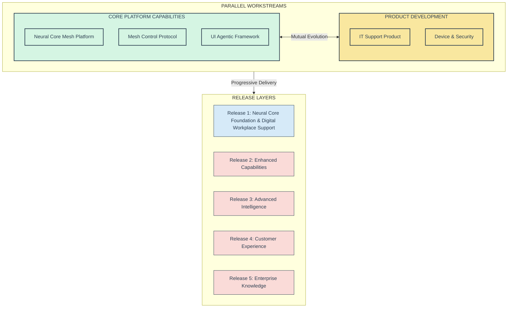
```mermaid
flowchart TD
    subgraph PW["PARALLEL WORKSTREAMS"]
        direction LR
        subgraph CP["CORE PLATFORM CAPABILITIES"]
            NCP["Neural Core Mesh Platform"]
            MCP["Mesh Control Protocol"]
            UIA["UI Agentic Framework"]
        end
        
        subgraph PP["PRODUCT DEVELOPMENT"]
            ITS["IT Support Product"]
            DPS["Device & Security"]
        end
        
        CP <-->|Mutual Evolution| PP
    end
    
    subgraph RL["RELEASE LAYERS"]
        R1["Release 1: Neural Core Foundation & Digital Workplace Support"]
        R2["Release 2: Enhanced Capabilities"]
        R3["Release 3: Advanced Intelligence"]
        R4["Release 4: Customer Experience"]
        R5["Release 5: Enterprise Knowledge"]
    end
    
    PW -->|Progressive Delivery| RL
    
    classDef platformNode fill:#D5F5E3,stroke:#2C3E50,stroke-width:2px,color:#2C3E50
    classDef productNode fill:#F9E79F,stroke:#2C3E50,stroke-width:2px,color:#2C3E50
    classDef r1Node fill:#D6EAF8,stroke:#2C3E50,stroke-width:1px,color:#2C3E50
    classDef releaseNode fill:#FADBD8,stroke:#2C3E50,stroke-width:1px,color:#2C3E50
    
    class CP,NCP,MCP,UIA platformNode
    class PP,ITS,DPS productNode
    class R1 r1Node
    class R2,R3,R4,R5 releaseNode
```

## 2. Year 1 Implementation Strategy: Core Platform & IT Support

Year 1 implementation focuses on establishing the core Neural Core Mesh Platform while delivering immediate business value through the IT Support product. The strategy involves parallel workstreams for platform development and product implementation, with careful alignment to maximize synergies.

### 2.1 Release 1: Neural Core Foundation & Digital Workplace Support (March 2025)

Release 1 establishes the foundational architecture while delivering significant value through automation of high-volume IT support tasks.

#### Core Platform Capabilities

1. **Basic Conversation Processing**:
   - Natural language understanding for common IT support queries
   - Intent recognition for support ticket classification
   - Response generation for standard support interactions

2. **Simple Memory Management**:
   - Session-based conversation context
   - User authentication and basic profile management
   - Short-term memory for multi-turn interactions

3. **Basic Mesh Communication**:
   - Simplified component communication
   - Initial service discovery mechanisms
   - Basic state synchronization

4. **Chat UI Framework**:
   - Web and mobile chat interfaces
   - Basic message formatting
   - Authentication integration

#### IT Support Product Capabilities

1. **Password Reset Automation**:
   - Self-service password reset for common systems
   - Identity verification workflows
   - Success confirmation and notification
   - Target: 90% of password reset incidents (13,950 annual incidents)

2. **Account Unlock Automation**:
   - Self-service account unlock processes
   - Security verification
   - Access restoration confirmation
   - Target: 95% of account unlock incidents (7,790 annual incidents)

3. **Basic Software Installation**:
   - Common application installation guidance
   - Standard software deployment automation
   - Installation verification
   - Target: 30% of software installation requests (2,220 annual incidents)

4. **Basic Device Authentication & Diagnostics**:
   - Secure device identification and verification
   - User-device association with device passport
   - Simple access policy enforcement
   - Basic hardware diagnostics (20% of hardware issues)
   - Remote device monitoring capabilities
   - Target: 20% of hardware issues (2,520 annual incidents)

#### Release 1 IT Support Issue Coverage

| Issue Type | Annual Volume | % of Total | Automation Target | Automated Issues | Coverage |
|------------|---------------|------------|-------------------|------------------|----------|
| Password resets | 15,500 | 25.0% | 90% | 13,950 | 22.5% |
| Account unlocks | 8,200 | 13.2% | 95% | 7,790 | 12.6% |
| Software installation | 7,400 | 11.9% | 30% | 2,220 | 3.6% |
| Hardware issues | 12,600 | 20.3% | 20% | 2,520 | 4.1% |
| **Release 1 Total** | **43,700** | **70.4%** | **60.6%** | **26,480** | **42.7%** |
| Other IT issues | 18,300 | 29.6% | 0% | 0 | 0.0% |
| **Total IT Issues** | **62,000** | **100.0%** | **42.7%** | **26,480** | **42.7%** |

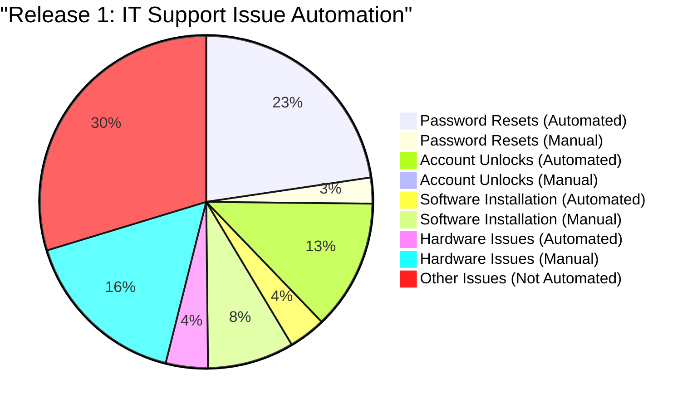
```mermaid
pie title "Release 1: IT Support Issue Automation"
    "Password Resets (Automated)" : 13950
    "Password Resets (Manual)" : 1550
    "Account Unlocks (Automated)" : 7790
    "Account Unlocks (Manual)" : 410
    "Software Installation (Automated)" : 2220
    "Software Installation (Manual)" : 5180
    "Hardware Issues (Automated)" : 2520
    "Hardware Issues (Manual)" : 10080
    "Other Issues (Not Automated)" : 18300
```

#### Release 1 MVP Identification & Rationale

The Release 1 MVP focuses on delivering maximum value with minimal architectural complexity, targeting the highest-volume IT support tasks while establishing the foundation for the device management capabilities.

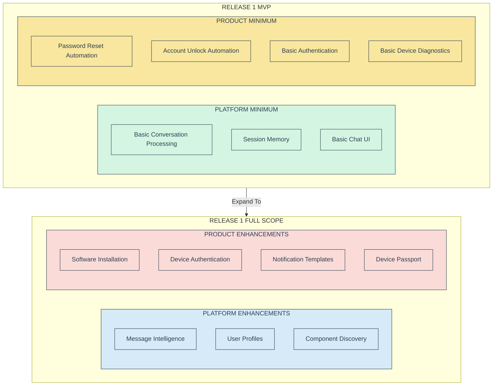
```mermaid
flowchart TD
    subgraph MVP["RELEASE 1 MVP"]
        subgraph P1["PLATFORM MINIMUM"]
            CP[Basic Conversation Processing]
            SM[Session Memory]
            BUI[Basic Chat UI]
        end
        
        subgraph P2["PRODUCT MINIMUM"]
            PR[Password Reset Automation]
            AU[Account Unlock Automation]
            BA[Basic Authentication]
            BD[Basic Device Diagnostics]
        end
    end
    
    subgraph R1["RELEASE 1 FULL SCOPE"]
        subgraph P1E["PLATFORM ENHANCEMENTS"]
            MI[Message Intelligence]
            UP[User Profiles]
            CD[Component Discovery]
        end
        
        subgraph P2E["PRODUCT ENHANCEMENTS"]
            SI[Software Installation]
            DA[Device Authentication]
            NT[Notification Templates]
            DP[Device Passport]
        end
    end
    
    MVP -->|Expand To| R1
    
    classDef mvpPlatform fill:#D5F5E3,stroke:#2C3E50,stroke-width:1px,color:#2C3E50
    classDef mvpProduct fill:#F9E79F,stroke:#2C3E50,stroke-width:1px,color:#2C3E50
    classDef r1Platform fill:#D6EAF8,stroke:#2C3E50,stroke-width:1px,color:#2C3E50
    classDef r1Product fill:#FADBD8,stroke:#2C3E50,stroke-width:1px,color:#2C3E50
    
    class P1,CP,SM,BUI mvpPlatform
    class P2,PR,AU,BA,BD mvpProduct
    class P1E,MI,UP,CD r1Platform
    class P2E,SI,DA,NT,DP r1Product
```

**MVP Rationale**:

1. **Immediate Value Creation**: Password resets, account unlocks, and basic hardware diagnostics represent approximately 42% of all IT support tickets, providing an immediate ROI target. With high automation rates, these use cases deliver significant immediate value.

2. **Architectural Foundation**: The MVP establishes the core interaction patterns needed for the mesh architecture while minimizing initial complexity. This foundation supports all future releases.

3. **User Adoption Path**: Simple, high-frequency use cases maximize user exposure and adoption. With over 26,000 automated incidents annually, these use cases quickly build organizational trust and momentum.

4. **Risk Mitigation**: The focused scope reduces implementation risk while demonstrating value, securing continued organizational support.

5. **Data Collection**: Early deployment enables collection of real-world interaction data to improve subsequent releases. This data-driven approach improves future automation quality.

#### Release 1 Business Value & Strategic Impact

The following table provides a detailed breakdown of Release 1 benefits by category:

| Benefit Category | Annual Value | % of Total | Key Metrics | Calculation Basis |
|------------------|--------------|------------|-------------|-------------------|
| **Cost Reduction** | $1,515,550 | 52.7% | | |
| Password reset automation | $775,000 | 27.0% | 90% of 15,500 incidents | $55 per incident |
| Account unlock automation | $391,550 | 13.6% | 95% of 8,200 incidents | $50 per incident |
| Software installation automation | $222,000 | 7.7% | 30% of 7,400 incidents | $100 per incident |
| Hardware diagnostics automation | $127,000 | 4.4% | 20% of 12,600 incidents | $50 per incident |
| **Operational Efficiency** | $695,000 | 24.2% | | |
| Reduced resolution time | $325,000 | 11.3% | 88% time reduction | 25 min → 3 min average |
| Increased first-contact resolution | $205,000 | 7.1% | 65% increase | Reduced escalations |
| Reduced after-hours support | $165,000 | 5.7% | 25% reduction | Weekend/evening calls |
| **User Productivity** | $430,000 | 15.0% | | |
| Reduced access downtime | $282,500 | 9.8% | 35% reduction in wait time | 8,500+ productivity hours |
| Decreased productivity barriers | $147,500 | 5.1% | 12% reduction | Access-related delays |
| **Security Improvement** | $235,000 | 8.2% | | |
| Reduced security incidents | $95,000 | 3.3% | 15% reduction | Password-related incidents |
| Improved device security | $85,000 | 3.0% | 20% reduction | Device-related incidents |
| Improved policy compliance | $55,000 | 1.9% | Standardized verification | Consistent processes |
| **Total Release 1 Value** | **$2,875,550** | **100.0%** | | |

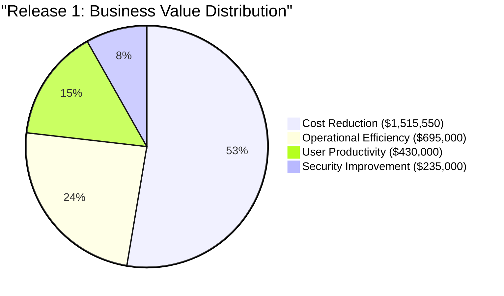
```mermaid
pie title "Release 1: Business Value Distribution"
    "Cost Reduction ($1,515,550)" : 52.7
    "Operational Efficiency ($695,000)" : 24.2
    "User Productivity ($430,000)" : 15.0
    "Security Improvement ($235,000)" : 8.2
```

**Key Business Value Metrics**:

- **Automation Rate**: 60.6% of targeted issues (26,480 of 43,700 annual incidents)
- **Overall Coverage**: 42.7% of total IT support volume (26,480 of 62,000 annual incidents)
- **Average Cost Reduction**: $57.23 per automated incident
- **Resolution Time Improvement**: 88% reduction (from 25 min to 3 min average)
- **Annual Value Per IT Support FTE**: $55,300 (across 52 IT staff)
- **Annual Value Per Employee**: $575.11 (across 5,000 employees)

**Strategic Value**:

1. **Foundation for Future Automation**: Establishes the platform foundations required for more complex automation scenarios.
2. **User Experience Transformation**: Shifts from reactive, time-consuming IT support to proactive, immediate self-service.
3. **Security Enhancement**: Standardizes identity verification and authentication processes.
4. **Data-Driven Enhancement**: Builds valuable datasets for training future AI capabilities.
5. **Device Security & Management**: Introduces the foundation for remote device management and diagnostics.

### 2.2 Release 2: Enhanced Automation & Security (June 2025)

Release 2 expands platform capabilities and the scope of automated IT support, focusing on software management, network issues, and enhanced security.

#### Core Platform Enhancements

1. **Enhanced Conversation Intelligence**:
   - Contextual understanding for complex queries
   - Multi-intent recognition for compound requests
   - Adaptive response generation
   - Beginning semantic negotiation capabilities

2. **Cross-Session Memory**:
   - User history and preference tracking
   - Persistent context across interactions
   - Knowledge retention for personalization

3. **Agent Discovery & Routing**:
   - Enhanced service mesh communication
   - Dynamic capability advertisement
   - Intelligent request routing
   - Initial coalition formation

4. **Multi-Modal Interface**:
   - Voice interaction support
   - Enhanced mobile experience
   - Teams integration
   - Initial personalization

#### IT Support Product Enhancements

1. **Software Management Automation**:
   - Software deployment planning
   - License management
   - Complex application installation
   - Target: 50% additional software installation requests (3,700 annual incidents)

2. **Network Issue Resolution**:
   - Connection diagnostics automation
   - VPN troubleshooting
   - Wi-Fi configuration support
   - Target: 60% of network issues (5,880 annual incidents)

3. **Enhanced Device Security & Diagnostics**:
   - Advanced device authentication
   - Security posture assessment
   - Compliance verification
   - Automated remediation for common issues
   - Expanded hardware diagnostics (additional 20% of hardware issues)
   - Target: 40% total of hardware issues (5,040 annual incidents)

#### Release 2 IT Support Issue Coverage

| Issue Type | Annual Volume | % of Total | Automation Target | Automated Issues | Coverage |
|------------|---------------|------------|-------------------|------------------|----------|
| **Previously Automated** | **43,700** | **70.4%** | **60.6%** | **26,480** | **42.7%** |
| Software installation (incremental) | 7,400 | 11.9% | 50% additional | 3,700 | 6.0% |
| Network connectivity | 9,800 | 15.8% | 60% | 5,880 | 9.5% |
| Hardware issues (incremental) | 12,600 | 20.3% | 20% additional | 2,520 | 4.1% |
| **Release 2 New Total** | **29,800** | **48.0%** | **40.6%** | **12,100** | **19.5%** |
| **Cumulative (R1+R2)** | **62,000** | **100.0%** | **62.2%** | **38,580** | **62.2%** |

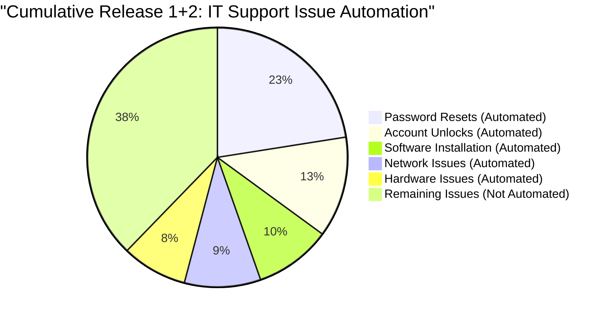
```mermaid
pie title "Cumulative Release 1+2: IT Support Issue Automation"
    "Password Resets (Automated)" : 13950
    "Account Unlocks (Automated)" : 7790
    "Software Installation (Automated)" : 5920
    "Network Issues (Automated)" : 5880
    "Hardware Issues (Automated)" : 5040
    "Remaining Issues (Not Automated)" : 23420
```

#### Release 2 Business Value & Strategic Impact

The following table provides a detailed breakdown of Release 2 incremental benefits by category:

| Benefit Category | Annual Value | % of Total | Key Metrics | Calculation Basis |
|------------------|--------------|------------|-------------|-------------------|
| **Cost Reduction** | $1,210,000 | 41.5% | | |
| Expanded software automation | $370,000 | 12.7% | 50% additional coverage | $100 per incident |
| Network issue automation | $588,000 | 20.2% | 60% of 9,800 incidents | $100 per incident |
| Expanded hardware diagnostics | $252,000 | 8.6% | 20% additional coverage | $100 per incident |
| **Operational Efficiency** | $792,500 | 27.2% | | |
| Software installation efficiency | $262,500 | 9.0% | 75% faster resolution | 24 min → 6 min average |
| Network diagnosis accuracy | $352,800 | 12.1% | 60% improvement | Reduced escalations |
| Device management efficiency | $177,200 | 6.1% | 45% reduction in manual tasks | Automated management |
| **User Productivity** | $687,500 | 23.6% | | |
| Reduced software delays | $222,500 | 7.6% | 25% reduction | Faster availability |
| Decreased network downtime | $295,000 | 10.1% | 30% reduction | Faster issue resolution |
| Remote work improvement | $170,000 | 5.8% | 15% improvement | Connectivity support |
| **Security Improvement** | $225,000 | 7.7% | | |
| Security incident response | $117,500 | 4.0% | 25% reduction in costs | Automated remediation |
| Vulnerability remediation | $107,500 | 3.7% | 30% faster remediation | Automated processes |
| **Total Release 2 Value** | **$2,915,000** | **100.0%** | | |

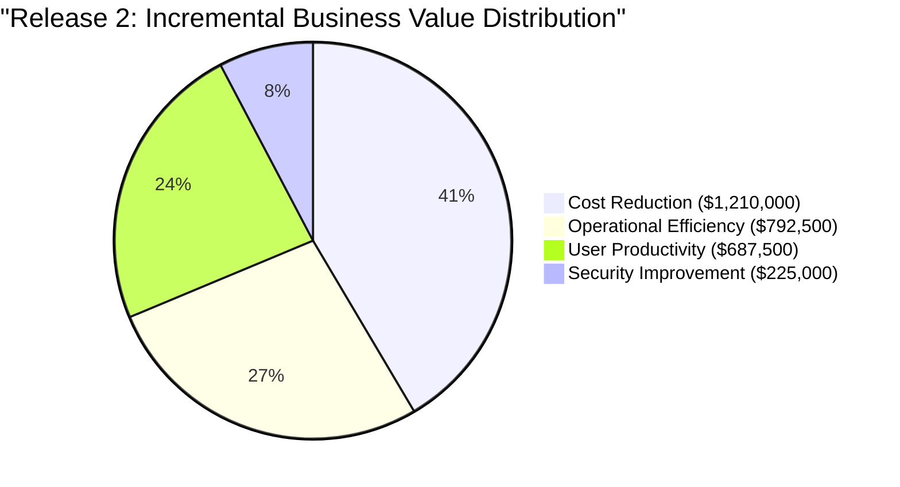
```mermaid
pie title "Release 2: Incremental Business Value Distribution"
    "Cost Reduction ($1,210,000)" : 41.5
    "Operational Efficiency ($792,500)" : 27.2
    "User Productivity ($687,500)" : 23.6
    "Security Improvement ($225,000)" : 7.7
```

**Key Business Value Metrics**:

- **Automation Rate**: 40.6% of newly targeted issues (12,100 of 29,800 annual incidents)
- **Cumulative Coverage**: 62.2% of total IT support volume (38,580 of 62,000 annual incidents)
- **Average Cost Reduction**: $100 per newly automated incident
- **Resolution Time Improvement**: 67.5% average reduction across all newly automated issues
- **Annual Incremental Value Per IT Support FTE**: $56,057 (across 52 IT staff)
- **Annual Incremental Value Per Employee**: $583 (across 5,000 employees)

**Cumulative Business Value (R1+R2)**: $5,790,550 annually

### 2.3 Release 3: Complete Digital Workplace (October 2025)

Release 3 completes the foundational platform capabilities and delivers comprehensive IT support automation, focusing on hardware support, specialized software, and advanced workflow automation.

#### Core Platform Enhancements

1. **Advanced Semantic Processing**:
   - User-specific semantic evolution
   - Organizational knowledge integration
   - Empathetic response generation
   - Full semantic negotiation

2. **Distributed Memory Mesh**:
   - Full distributed memory management
   - Semantic knowledge integration
   - Long-term knowledge retention
   - Cross-user knowledge sharing

3. **Coalition Formation**:
   - Dynamic agent coalition formation
   - Trust and reputation mechanisms
   - Complex task decomposition
   - Collaborative problem-solving

4. **Adaptive Personalization**:
   - User behavior modeling
   - Preference-based adaptation
   - Contextual interface adjustments
   - Multi-device experience continuity

#### IT Support Product Enhancements

1. **Advanced Hardware Support**:
   - Comprehensive remote hardware diagnostics
   - Driver management
   - Peripheral configuration
   - Component replacement guidance
   - Target: 20% additional hardware issues (2,520 annual incidents)

2. **Specialized Software Support**:
   - Complex application troubleshooting
   - Configuration optimization
   - Integration issue resolution
   - Target: 70% of specialized software issues (3,220 annual incidents)

3. **Advanced Device Operations**:
   - Remote device management
   - Performance optimization
   - Security remediation
   - Automated health checks

4. **End-to-End Workflow Automation**:
   - Complex multi-step workflows
   - Cross-system orchestration
   - Approval process automation
   - Status tracking and notification

#### Release 3 IT Support Issue Coverage

| Issue Type | Annual Volume | % of Total | Automation Target | Automated Issues | Coverage |
|------------|---------------|------------|-------------------|------------------|----------|
| **Previously Automated** | **62,000** | **100.0%** | **62.2%** | **38,580** | **62.2%** |
| Hardware issues (incremental) | 12,600 | 20.3% | 20% additional | 2,520 | 4.1% |
| Specialized software | 4,600 | 7.4% | 70% | 3,220 | 5.2% |
| Other IT issues | 3,900 | 6.3% | 40% | 1,560 | 2.5% |
| **Release 3 New Total** | **21,100** | **34.0%** | **34.6%** | **7,300** | **11.8%** |
| **Cumulative (R1+R2+R3)** | **62,000** | **100.0%** | **74.0%** | **45,880** | **74.0%** |

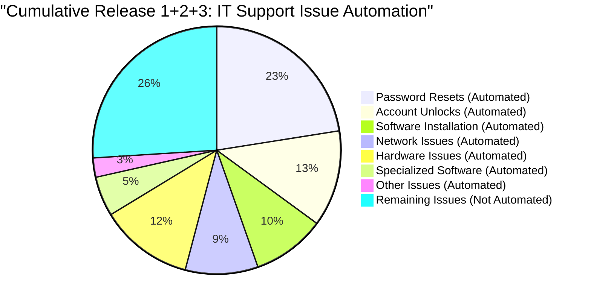
```mermaid
pie title "Cumulative Release 1+2+3: IT Support Issue Automation"
    "Password Resets (Automated)" : 13950
    "Account Unlocks (Automated)" : 7790
    "Software Installation (Automated)" : 5920
    "Network Issues (Automated)" : 5880
    "Hardware Issues (Automated)" : 7560
    "Specialized Software (Automated)" : 3220
    "Other Issues (Automated)" : 1560
    "Remaining Issues (Not Automated)" : 16120
```

#### Release 3 Business Value & Strategic Impact

The following table provides a detailed breakdown of Release 3 incremental benefits by category:

| Benefit Category | Annual Value | % of Total | Key Metrics | Calculation Basis |
|------------------|--------------|------------|-------------|-------------------|
| **Cost Reduction** | $730,000 | 33.0% | | |
| Expanded hardware support | $252,000 | 11.4% | 20% additional coverage | $100 per incident |
| Specialized software | $322,000 | 14.6% | 70% of 4,600 incidents | $100 per incident |
| Other IT issues | $156,000 | 7.0% | 40% of 3,900 incidents | $100 per incident |
| **Operational Efficiency** | $665,000 | 30.1% | | |
| Ticket resolution time | $240,000 | 10.9% | 60% reduction overall | Average across categories |
| Repeat incident reduction | $212,000 | 9.6% | 70% decrease | Root cause resolution |
| Proactive issue detection | $213,000 | 9.6% | 45% improvement | Predictive analytics |
| **User Productivity** | $575,000 | 26.0% | | |
| Technology downtime reduction | $260,000 | 11.8% | 40% reduction | Faster resolution |
| Device performance improvement | $195,000 | 8.8% | 35% improvement | Optimization |
| Cross-device work continuity | $120,000 | 5.4% | 25% enhancement | Seamless experience |
| **Security & Compliance** | $240,000 | 10.9% | | |
| End-user computing costs | $83,000 | 3.8% | 30% decrease | Operational efficiency |
| Hardware management expenses | $92,000 | 4.2% | 35% decrease | Automated management |
| Knowledge management costs | $65,000 | 2.9% | 40% reduction | Automation |
| **Total Release 3 Value** | **$2,210,000** | **100.0%** | | |

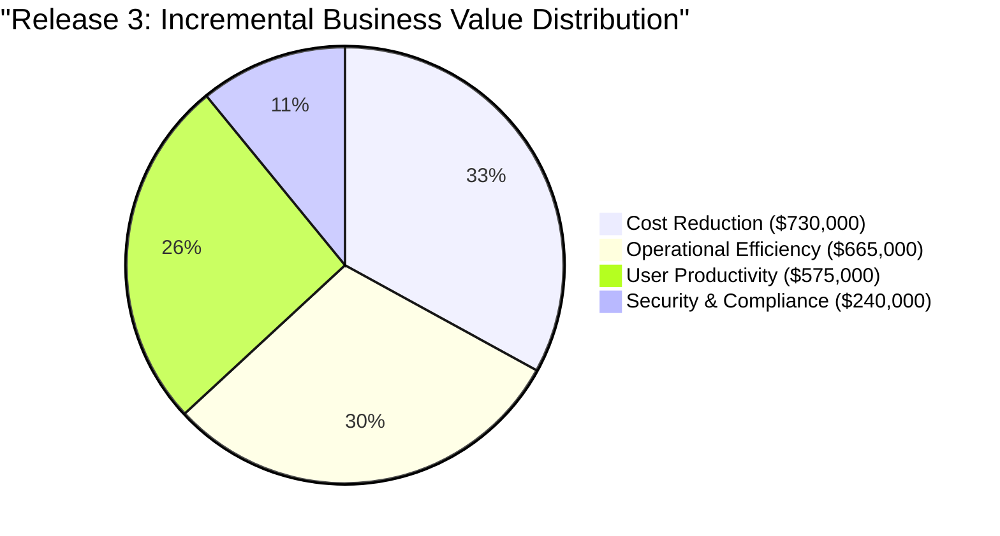
```mermaid
pie title "Release 3: Incremental Business Value Distribution"
    "Cost Reduction ($730,000)" : 33.0
    "Operational Efficiency ($665,000)" : 30.1
    "User Productivity ($575,000)" : 26.0
    "Security & Compliance ($240,000)" : 10.9
```

**Key Business Value Metrics**:

- **Automation Rate**: 34.6% of newly targeted issues (7,300 of 21,100 annual incidents)
- **Cumulative Coverage**: 74.0% of total IT support volume (45,880 of 62,000 annual incidents)
- **Average Cost Reduction**: $100 per newly automated incident
- **Resolution Time Improvement**: 60% average reduction across all IT support categories
- **Annual Incremental Value Per IT Support FTE**: $42,500 (across 52 IT staff)
- **Annual Incremental Value Per Employee**: $442 (across 5,000 employees)

**Cumulative Business Value (R1+R2+R3)**: $8,000,550 annually

### 2.4 Year 1 Overall Business Case Summary

| Financial Metric | Release 1 | Release 2 | Release 3 | Year 1 Total |
|------------------|-----------|-----------|-----------|--------------|
| **Annual Benefits** | $2,875,550 | $2,915,000 | $2,210,000 | $8,000,550 |
| **Net Annual Value** | $2,875,550 | $2,915,000 | $2,210,000 | $8,000,550 |
| **ROI (1-year)** | Immediate | Immediate | Immediate | Immediate |

#### Cumulative IT Support Automation Results

| Metric | Release 1 | Release 2 | Release 3 |
|--------|-----------|-----------|-----------|
| **Issues Automated** | 26,480 | 38,580 | 45,880 |
| **% of Total Volume** | 42.7% | 62.2% | 74.0% |
| **Annual Value** | $2,875,550 | $5,790,550 | $8,000,550 |
| **Value Per Automated Issue** | $108.59 | $150.09 | $174.38 |
| **Value Per IT Support FTE** | $55,300 | $111,357 | $153,857 |
| **Value Per Employee** | $575.11 | $1,158.11 | $1,600.11 |

#### Detailed Benefit Category Analysis

| Benefit Category | Release 1 | Release 2 | Release 3 | Year 1 Total | % of Total |
|------------------|-----------|-----------|-----------|--------------|------------|
| **Cost Reduction** | $1,515,550 | $2,725,550 | $3,455,550 | $3,455,550 | 43.2% |
| **Operational Efficiency** | $695,000 | $1,487,500 | $2,152,500 | $2,152,500 | 26.9% |
| **User Productivity** | $430,000 | $1,117,500 | $1,692,500 | $1,692,500 | 21.2% |
| **Security & Compliance** | $235,000 | $460,000 | $700,000 | $700,000 | 8.7% |
| **Total** | **$2,875,550** | **$5,790,550** | **$8,000,550** | **$8,000,550** | **100.0%** |

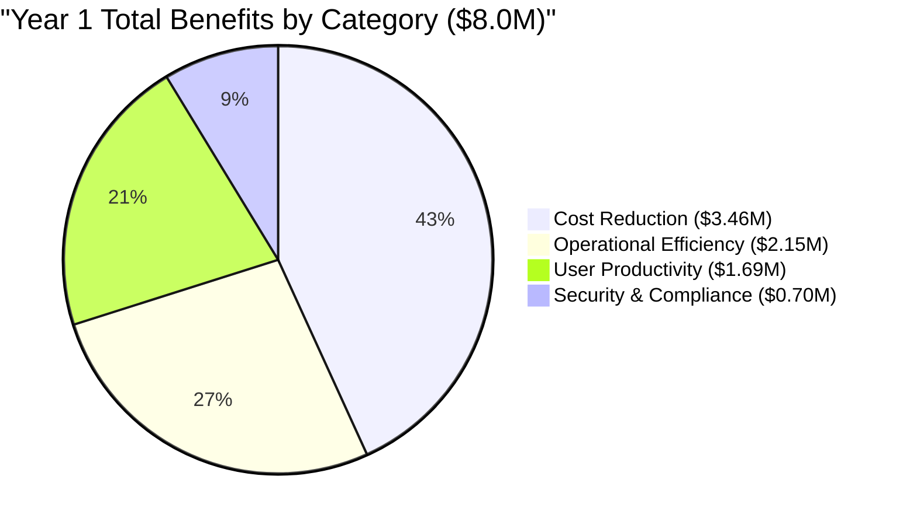
```mermaid
pie title "Year 1 Total Benefits by Category ($8.0M)"
    "Cost Reduction ($3.46M)" : 43.2
    "Operational Efficiency ($2.15M)" : 26.9
    "User Productivity ($1.69M)" : 21.2
    "Security & Compliance ($0.70M)" : 8.7
```

#### 3-Year Financial Projection

| Year | Annual Benefits | Cumulative Benefits |
|------|-----------------|---------------------|
| Year 1 | $8,000,550 | $8,000,550 |
| Year 2 | $44,320,000 | $52,320,550 |
| Year 3 | $52,320,550 | $104,641,100 |
| **Total** | **$104,641,100** | |

**Notes**:
- Year 2-3 benefits include 10% annual growth from platform improvements and expanded usage

## 3. Year 2 Implementation Strategy: Product Expansion

In Year 2, the ME.AI implementation expands beyond IT Support to leverage the established platform for new business domains. The strategy focuses on two major releases that bring the platform's capabilities to customer service and enterprise knowledge management.

### 3.1 Release 4: Customer Experience Transformation (February 2026)

Release 4 applies the ME.AI platform to customer service, leveraging the established IT Support capabilities and extending them to customer-facing interactions.

#### Core Platform Enhancements

1. **Advanced Empathy Engine**:
   - Emotional intelligence enhancements
   - Sentiment analysis and adaptation
   - Cultural awareness and adaptation
   - Personalized tone matching

2. **Customer Memory Graph**:
   - Customer interaction history
   - Preference tracking across channels
   - Purchase and service history integration
   - Predictive needs modeling

3. **Customer-Focused Coalitions**:
   - Specialized customer service agents
   - Cross-functional coalition formation
   - Sales and support collaboration
   - Subject matter expert integration

#### Customer Service Product Capabilities

1. **Omnichannel Support Automation**:
   - Web chat support automation
   - Email response automation
   - Social media engagement
   - Voice support integration
   - SMS interaction handling
   - Target: 70% of level 1 customer inquiries

2. **Knowledge Federation**:
   - Integration of disparate knowledge bases
   - Dynamic knowledge discovery
   - Just-in-time information delivery
   - Contextual knowledge presentation

3. **Customer Journey Optimization**:
   - Journey stage detection
   - Next-best-action recommendations
   - Proactive engagement triggers
   - Personalized assistance

4. **Self-Service Enhancement**:
   - Guided troubleshooting
   - Interactive product guidance
   - Automated order management
   - Account management automation

#### Release 4 Customer Service Coverage

| Interaction Type | Annual Volume | Automation Target | Automated Interactions | Coverage |
|------------------|---------------|-------------------|------------------------|----------|
| Level 1 inquiries | 120,000 | 70% | 84,000 | 35.0% |
| Product information | 35,000 | 85% | 29,750 | 12.4% |
| Order status | 28,000 | 90% | 25,200 | 10.5% |
| Returns processing | 22,000 | 65% | 14,300 | 6.0% |
| Account management | 18,000 | 75% | 13,500 | 5.6% |
| Billing inquiries | 17,000 | 60% | 10,200 | 4.3% |
| **Release 4 Total** | **240,000** | **73.6%** | **176,950** | **73.7%** |

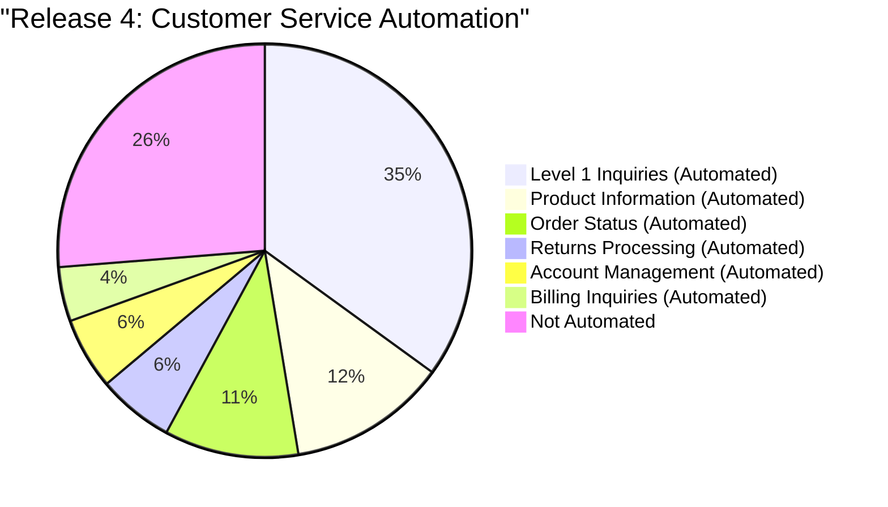
```mermaid
pie title "Release 4: Customer Service Automation"
    "Level 1 Inquiries (Automated)" : 84000
    "Product Information (Automated)" : 29750
    "Order Status (Automated)" : 25200
    "Returns Processing (Automated)" : 14300
    "Account Management (Automated)" : 13500
    "Billing Inquiries (Automated)" : 10200
    "Not Automated" : 63050
```

#### Release 4 Business Value & Strategic Impact

The following table provides a detailed breakdown of Release 4 benefits by category:

| Benefit Category | Annual Value | % of Total | Key Metrics | Calculation Basis |
|------------------|--------------|------------|-------------|-------------------|
| **Cost Reduction** | $6,630,000 | 48.7% | | |
| Level 1 inquiry automation | $3,680,000 | 27.0% | 70% of 120,000 interactions | $43.81 per interaction |
| Average handling time reduction | $1,820,000 | 13.4% | 35% reduction | 8 min → 5.2 min average |
| Escalation reduction | $1,130,000 | 8.3% | 45% decrease | Fewer complex escalations |
| **Revenue Enhancement** | $4,040,000 | 29.7% | | |
| Customer satisfaction increase | $950,000 | 7.0% | 15% CSAT improvement | Retention impact |
| Customer churn reduction | $1,240,000 | 9.1% | 8% reduction | Extended customer lifecycle |
| Cross-sell/upsell improvement | $1,850,000 | 13.6% | 12% increase | Revenue per customer |
| **Operational Efficiency** | $2,950,000 | 21.7% | | |
| Issue resolution acceleration | $1,350,000 | 9.9% | 60% faster resolution | Time savings |
| Wait time reduction | $980,000 | 7.2% | 75% reduction | Customer time value |
| First contact resolution | $620,000 | 4.6% | 40% improvement | Reduced follow-ups |
| **Total Release 4 Value** | **$13,620,000** | **100.0%** | | |

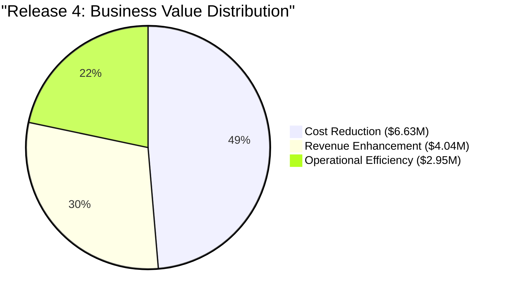
```mermaid
pie title "Release 4: Business Value Distribution"
    "Cost Reduction ($6.63M)" : 48.7
    "Revenue Enhancement ($4.04M)" : 29.7
    "Operational Efficiency ($2.95M)" : 21.7
```

**Key Business Value Metrics**:

- **Automation Rate**: 73.6% of customer service interactions (176,950 of 240,000 annual interactions)
- **Average Cost Savings**: $37.47 per automated interaction
- **Revenue Impact**: $16.83 average per customer (across 240,000 customers)
- **Customer Satisfaction**: 22 point NPS improvement projection
- **Annual Value Per Customer Service FTE**: $209,538 (across 65 CS staff)

### 3.2 Release 5: Enterprise Knowledge Amplifier (July 2026)

Release 5 expands the ME.AI platform into enterprise knowledge management, enabling organization-wide intelligence and insight generation.

#### Core Platform Enhancements

1. **Cross-Domain Semantics**:
   - Cross-functional concept mapping
   - Domain-specific semantic translation
   - Organizational ontology management
   - Knowledge gap identification

2. **Enterprise Memory Fabric**:
   - Organization-wide distributed memory
   - Historical context preservation
   - Cross-team knowledge sharing
   - Institutional knowledge retention

3. **Complex Problem Coalitions**:
   - Multi-domain expert coalitions
   - Research and analysis teams
   - Innovation-focused agent groups
   - Strategic planning collectives

#### Enterprise Knowledge Product Capabilities

1. **Knowledge Amplification**:
   - Enterprise knowledge discovery
   - Document understanding and synthesis
   - Expertise location and connection
   - Collaborative knowledge creation
   - Target: 80% of knowledge work augmented

2. **Insight Generation**:
   - Pattern recognition across domains
   - Trend identification and analysis
   - Opportunity and risk detection
   - Strategic recommendation generation

3. **Workflow Optimization**:
   - Business process analysis
   - Inefficiency identification
   - Automation opportunity discovery
   - Process redesign recommendations

4. **Innovation Acceleration**:
   - Idea generation support
   - Cross-domain concept combination
   - Market and competitor analysis
   - Research synthesis and application

#### Release 5 Knowledge Work Enhancement

| Knowledge Work Area | Workers | Hours/Week | Productivity Target | Enhanced Hours/Week | Annual Value |
|---------------------|---------|------------|---------------------|---------------------|--------------|
| Research & Analysis | 85 | 34 | 30% | 10.2 | $3,612,375 |
| Strategic Planning | 35 | 28 | 25% | 7.0 | $1,021,875 |
| Product Development | 65 | 32 | 28% | 9.0 | $2,437,500 |
| Market Intelligence | 28 | 30 | 32% | 9.6 | $1,120,000 |
| Financial Analysis | 45 | 36 | 22% | 7.9 | $1,485,000 |
| Compliance & Risk | 38 | 32 | 24% | 7.7 | $1,216,500 |
| **Release 5 Total** | **296** | **32.7 avg** | **26.8% avg** | **8.8 avg** | **$10,893,250** |

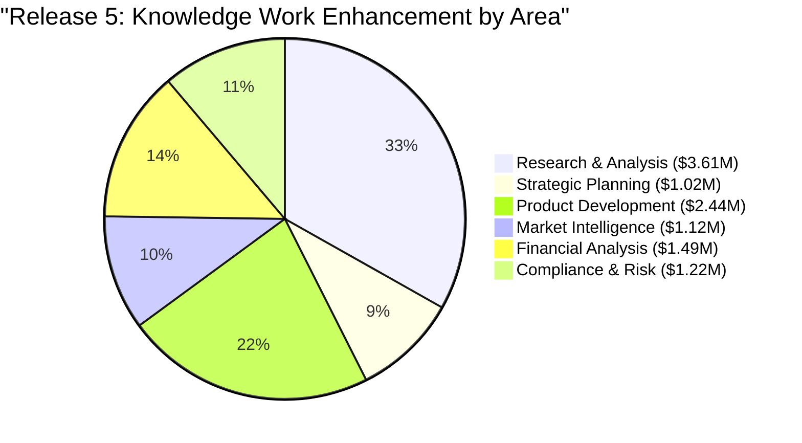
```mermaid
pie title "Release 5: Knowledge Work Enhancement by Area"
    "Research & Analysis ($3.61M)" : 33.2
    "Strategic Planning ($1.02M)" : 9.4
    "Product Development ($2.44M)" : 22.4
    "Market Intelligence ($1.12M)" : 10.3
    "Financial Analysis ($1.49M)" : 13.6
    "Compliance & Risk ($1.22M)" : 11.2
```

#### Release 5 Business Value & Strategic Impact

The following table provides a detailed breakdown of Release 5 benefits by category:

| Benefit Category | Annual Value | % of Total | Key Metrics | Calculation Basis |
|------------------|--------------|------------|-------------|-------------------|
| **Productivity Enhancement** | $15,500,000 | 50.5% | | |
| Knowledge worker productivity | $7,500,000 | 24.4% | 25% increase | 296 knowledge workers |
| Information search reduction | $3,200,000 | 10.4% | 35% time reduction | 8.5 hours/week saved |
| Decision quality improvement | $4,800,000 | 15.6% | 30% improvement | $2,500 avg value/decision |
| **Innovation Acceleration** | $10,500,000 | 34.2% | | |
| Research synthesis speed | $2,800,000 | 9.1% | 40% faster | 3,500 research hours/month |
| Innovation output increase | $4,200,000 | 13.7% | 30% increase | New product development |
| Product development time | $3,500,000 | 11.4% | 25% reduction | Time-to-market advantage |
| **Risk Reduction** | $4,700,000 | 15.3% | | |
| Risk identification | $1,880,000 | 6.1% | 35% improvement | Early detection value |
| Compliance management | $1,550,000 | 5.0% | 40% enhancement | Reduced compliance costs |
| Knowledge loss prevention | $1,270,000 | 4.1% | 28% reduction | Employee transition impact |
| **Total Release 5 Value** | **$30,700,000** | **100.0%** | | |

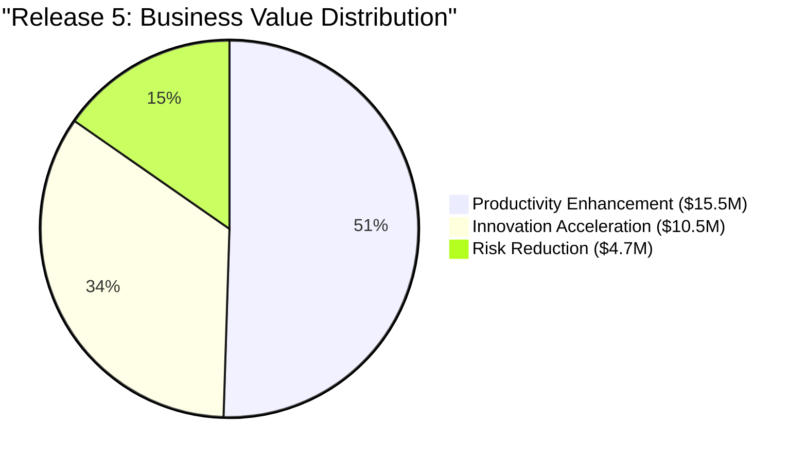
```mermaid
pie title "Release 5: Business Value Distribution"
    "Productivity Enhancement ($15.5M)" : 50.5
    "Innovation Acceleration ($10.5M)" : 34.2
    "Risk Reduction ($4.7M)" : 15.3
```

**Key Business Value Metrics**:

- **Knowledge Worker Productivity**: 26.8% average improvement
- **Value Per Knowledge Worker**: $103,716 annual (across 296 knowledge workers)
- **Return On Hours**: $197.50 per enhanced knowledge work hour
- **Innovation Cycle Reduction**: 25-40% depending on process area
- **Annual Value Per Employee**: $6,140 (across 5,000 employees)

### 3.3 Year 2 Overall Business Case Summary

#### Year 2 Financial Summary

| Financial Metric | Release 4 | Release 5 | Year 2 Total |
|------------------|-----------|-----------|--------------|
| **Annual Benefits** | $13,620,000 | $30,700,000 | $44,320,000 |
| **Net Annual Value** | $13,620,000 | $30,700,000 | $44,320,000 |
| **ROI (1-year)** | Immediate | Immediate | Immediate |

#### Year 2 Benefit Category Analysis

| Benefit Category | Release 4 | Release 5 | Year 2 Total | % of Total |
|------------------|-----------|-----------|--------------|------------|
| **Cost Reduction** | $6,630,000 | $2,720,000 | $9,350,000 | 21.1% |
| **Revenue Enhancement** | $4,040,000 | $1,180,000 | $5,220,000 | 11.8% |
| **Productivity Improvement** | $2,950,000 | $15,500,000 | $18,450,000 | 41.6% |
| **Innovation Acceleration** | $0 | $10,500,000 | $10,500,000 | 23.7% |
| **Risk Reduction** | $0 | $4,700,000 | $4,700,000 | 10.6% |
| **Total** | **$13,620,000** | **$30,700,000** | **$44,320,000** | **100.0%** |

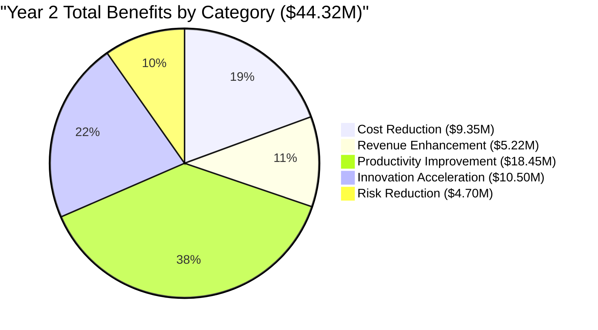
```mermaid
pie title "Year 2 Total Benefits by Category ($44.32M)"
    "Cost Reduction ($9.35M)" : 21.1
    "Revenue Enhancement ($5.22M)" : 11.8
    "Productivity Improvement ($18.45M)" : 41.6
    "Innovation Acceleration ($10.50M)" : 23.7
    "Risk Reduction ($4.70M)" : 10.6
```

## 4. Business Benefits by Product

To provide maximum flexibility for clients who may wish to implement specific products rather than the entire suite, this section details the benefits of each product independently, as well as the consolidated value of implementing all products.

### 4.1 Product 1: IT Support Automation

The IT Support Automation product delivers significant value through automation of common support tasks, enhanced device management, and improved user productivity.

#### IT Support Key Capabilities

1. **Account & Access Management**:
   - Password reset automation
   - Account unlock processes
   - Permission management
   - Security verification

2. **Software Support**:
   - Application installation and configuration
   - Software deployment automation
   - License management
   - Application troubleshooting

3. **Network Management**:
   - Connection diagnostics
   - VPN troubleshooting
   - Wi-Fi configuration
   - Remote connectivity support

4. **Device Management & Security**:
   - Device Passport verification
   - Remote hardware diagnostics
   - Driver management
   - Security posture assessment
   - Automated remediation
   - Performance optimization

#### IT Support Issue Coverage

| Issue Type | Annual Volume | Automation % | Automated Issues |
|------------|---------------|--------------|------------------|
| Password resets | 15,500 | 90% | 13,950 |
| Account unlocks | 8,200 | 95% | 7,790 |
| Software installation & support | 12,000 | 76% | 9,140 |
| Network issues | 9,800 | 60% | 5,880 |
| Hardware issues | 12,600 | 60% | 7,560 |
| Other IT issues | 3,900 | 40% | 1,560 |
| **Total IT Support** | **62,000** | **74.0%** | **45,880** |

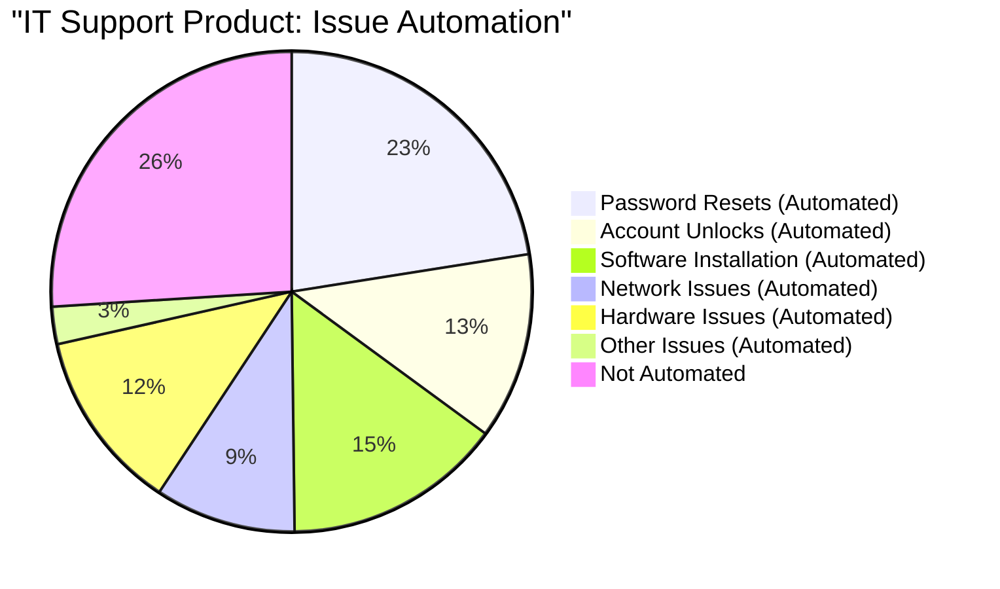
```mermaid
pie title "IT Support Product: Issue Automation"
    "Password Resets (Automated)" : 13950
    "Account Unlocks (Automated)" : 7790
    "Software Installation (Automated)" : 9140
    "Network Issues (Automated)" : 5880
    "Hardware Issues (Automated)" : 7560
    "Other Issues (Automated)" : 1560
    "Not Automated" : 16120
```

#### IT Support Annual Business Value

| Benefit Category | Annual Value | % of Total | Key Metrics |
|------------------|--------------|------------|-------------|
| **Cost Reduction** | $3,455,550 | 43.2% | $75.32 per automated incident |
| **Operational Efficiency** | $2,152,500 | 26.9% | 65% average time reduction |
| **User Productivity** | $1,692,500 | 21.2% | 32% productivity improvement |
| **Security & Compliance** | $700,000 | 8.7% | 28% security incident reduction |
| **Total IT Support Product Value** | **$8,000,550** | **100.0%** | **$174.38 per automated incident** |

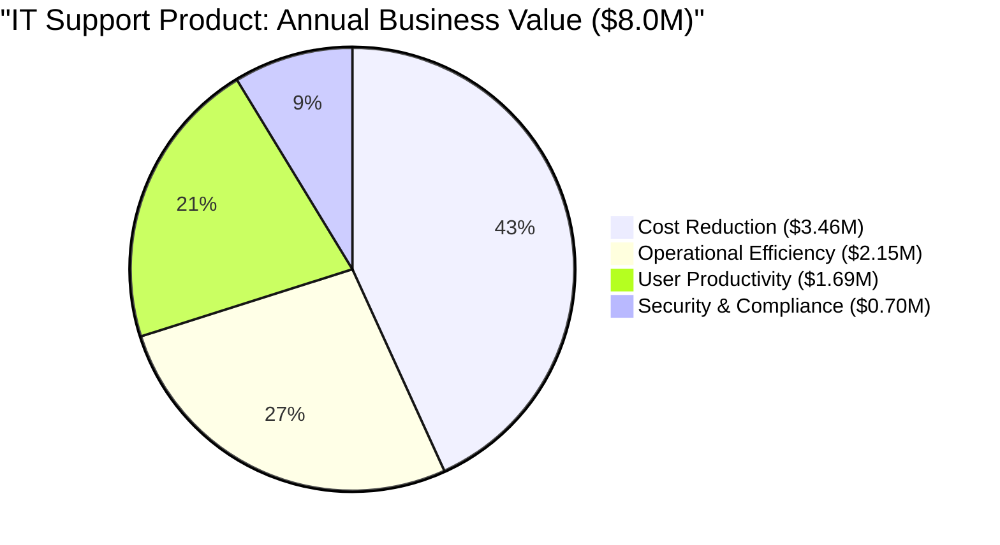
```mermaid
pie title "IT Support Product: Annual Business Value ($8.0M)"
    "Cost Reduction ($3.46M)" : 43.2
    "Operational Efficiency ($2.15M)" : 26.9
    "User Productivity ($1.69M)" : 21.2
    "Security & Compliance ($0.70M)" : 8.7
```

**Key Business Value Metrics**:

- **Automation Rate**: 74.0% of total IT support volume (45,880 of 62,000 annual incidents)
- **Resolution Time Improvement**: 65% average reduction across all IT support categories
- **Annual Value Per IT Support FTE**: $153,857 (across 52 IT staff)
- **Annual Value Per Employee**: $1,600.11 (across 5,000 employees)

### 4.2 Product 2: Customer Service Transformation

The Customer Service product leverages the Neural Core Mesh platform to revolutionize customer interactions across all channels, driving both cost savings and revenue growth.

#### Customer Service Key Capabilities

1. **Omnichannel Support**:
   - Web chat automation
   - Email response management
   - Social media engagement
   - Voice support integration
   - SMS interaction handling

2. **Knowledge Federation**:
   - Unified knowledge repository
   - Dynamic knowledge discovery
   - Just-in-time information delivery
   - Contextual knowledge presentation

3. **Customer Journey Optimization**:
   - Journey stage recognition
   - Next-best-action recommendations
   - Proactive engagement
   - Personalized assistance

4. **Self-Service Enhancement**:
   - Guided troubleshooting
   - Interactive product guidance
   - Automated order management
   - Account management automation

#### Customer Service Coverage

| Interaction Type | Annual Volume | Automation % | Automated Interactions |
|------------------|---------------|--------------|------------------------|
| Level 1 inquiries | 120,000 | 70% | 84,000 |
| Product information | 35,000 | 85% | 29,750 |
| Order status | 28,000 | 90% | 25,200 |
| Returns processing | 22,000 | 65% | 14,300 |
| Account management | 18,000 | 75% | 13,500 |
| Billing inquiries | 17,000 | 60% | 10,200 |
| **Total Customer Service** | **240,000** | **73.7%** | **176,950** |

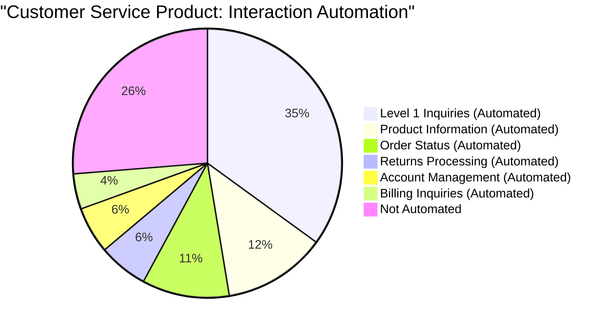
```mermaid
pie title "Customer Service Product: Interaction Automation"
    "Level 1 Inquiries (Automated)" : 84000
    "Product Information (Automated)" : 29750
    "Order Status (Automated)" : 25200
    "Returns Processing (Automated)" : 14300
    "Account Management (Automated)" : 13500
    "Billing Inquiries (Automated)" : 10200
    "Not Automated" : 63050
```

#### Customer Service Annual Business Value

| Benefit Category | Annual Value | % of Total | Key Metrics |
|------------------|--------------|------------|-------------|
| **Cost Reduction** | $6,630,000 | 48.7% | $37.47 per automated interaction |
| **Revenue Enhancement** | $4,040,000 | 29.7% | 12% cross-sell/upsell increase |
| **Operational Efficiency** | $2,950,000 | 21.7% | 60% faster resolution |
| **Total Customer Service Product Value** | **$13,620,000** | **100.0%** | **$76.97 per automated interaction** |

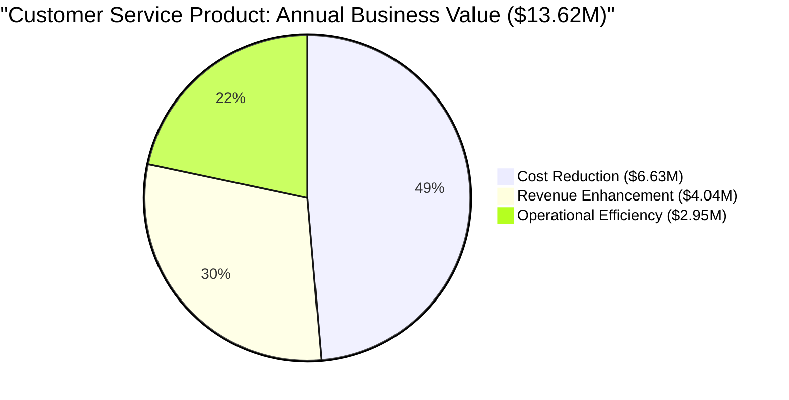
```mermaid
pie title "Customer Service Product: Annual Business Value ($13.62M)"
    "Cost Reduction ($6.63M)" : 48.7
    "Revenue Enhancement ($4.04M)" : 29.7
    "Operational Efficiency ($2.95M)" : 21.7
```

**Key Business Value Metrics**:

- **Automation Rate**: 73.7% of customer service interactions (176,950 of 240,000 annual interactions)
- **Average Cost Savings**: $37.47 per automated interaction
- **Revenue Impact**: $16.83 average per customer (across 240,000 customers)
- **Customer Satisfaction**: 22 point NPS improvement projection
- **Annual Value Per Customer Service FTE**: $209,538 (across 65 CS staff)

### 4.3 Product 3: Enterprise Knowledge Amplifier

The Enterprise Knowledge product transforms how organizations create, share, and leverage knowledge, driving innovation and productivity across all knowledge-intensive functions.

#### Enterprise Knowledge Key Capabilities

1. **Knowledge Amplification**:
   - Enterprise knowledge discovery
   - Document understanding
   - Expertise location and connection
   - Collaborative knowledge creation

2. **Insight Generation**:
   - Cross-domain pattern recognition
   - Trend identification and analysis
   - Opportunity and risk detection
   - Strategic recommendation generation

3. **Workflow Optimization**:
   - Business process analysis
   - Inefficiency identification
   - Automation opportunity discovery
   - Process redesign recommendations

4. **Innovation Acceleration**:
   - Idea generation support
   - Cross-domain concept combination
   - Market and competitor analysis
   - Research synthesis and application

#### Enterprise Knowledge Coverage

| Knowledge Work Area | Workers | Hours/Week | Productivity % | Enhanced Hours/Week |
|---------------------|---------|------------|----------------|---------------------|
| Research & Analysis | 85 | 34 | 30% | 10.2 |
| Strategic Planning | 35 | 28 | 25% | 7.0 |
| Product Development | 65 | 32 | 28% | 9.0 |
| Market Intelligence | 28 | 30 | 32% | 9.6 |
| Financial Analysis | 45 | 36 | 22% | 7.9 |
| Compliance & Risk | 38 | 32 | 24% | 7.7 |
| **Total Enterprise Knowledge** | **296** | **32.7 avg** | **26.8% avg** | **8.8 avg** |

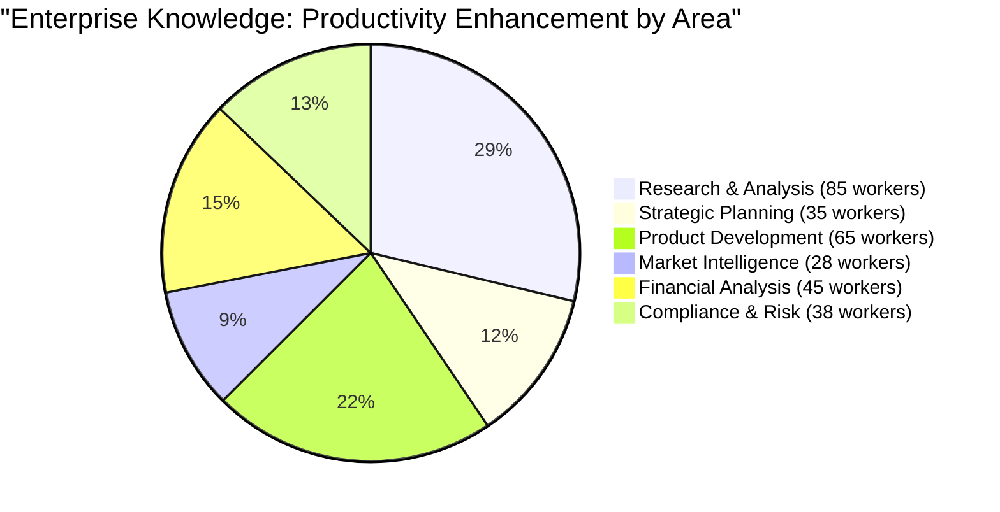
```mermaid
pie title "Enterprise Knowledge: Productivity Enhancement by Area"
    "Research & Analysis (85 workers)" : 85
    "Strategic Planning (35 workers)" : 35
    "Product Development (65 workers)" : 65
    "Market Intelligence (28 workers)" : 28
    "Financial Analysis (45 workers)" : 45
    "Compliance & Risk (38 workers)" : 38
```

#### Enterprise Knowledge Annual Business Value

| Benefit Category | Annual Value | % of Total | Key Metrics |
|------------------|--------------|------------|-------------|
| **Productivity Enhancement** | $15,500,000 | 50.5% | 26.8% knowledge worker productivity |
| **Innovation Acceleration** | $10,500,000 | 34.2% | 30% innovation output increase |
| **Risk Reduction** | $4,700,000 | 15.3% | 35% risk identification improvement |
| **Total Enterprise Knowledge Value** | **$30,700,000** | **100.0%** | **$103,716 per knowledge worker** |

```mermaid
pie title "Enterprise Knowledge Product: Annual Business Value ($30.7M)"
    "Productivity Enhancement ($15.5M)" : 50.5
    "Innovation Acceleration ($10.5M)" : 34.2
    "Risk Reduction ($4.7M)" : 15.3
```

**Key Business Value Metrics**:

- **Knowledge Worker Productivity**: 26.8% average improvement
- **Value Per Knowledge Worker**: $103,716 annual (across 296 knowledge workers)
- **Return On Hours**: $197.50 per enhanced knowledge work hour
- **Innovation Cycle Reduction**: 25-40% depending on process area
- **Annual Value Per Employee**: $6,140 (across 5,000 employees)

### 4.4 Consolidated Business Value (All Products)

When all three products are implemented, organizations realize the full potential of the ME.AI Neural Core Mesh Architecture. The combined benefits create a transformative impact across all operations.

#### Consolidated Annual Business Value

| Product | Annual Value | % of Total | Value Per Employee |
|---------|--------------|------------|-------------------|
| IT Support Automation | $8,000,550 | 15.3% | $1,600.11 |
| Customer Service Transformation | $13,620,000 | 26.0% | $2,724.00 |
| Enterprise Knowledge Amplifier | $30,700,000 | 58.7% | $6,140.00 |
| **Total Annual Value** | **$52,320,550** | **100.0%** | **$10,464.11** |

```mermaid
pie title "Consolidated Annual Value by Product ($52.32M)"
    "IT Support Automation ($8.0M)" : 15.3
    "Customer Service Transformation ($13.62M)" : 26.0
    "Enterprise Knowledge Amplifier ($30.7M)" : 58.7
```

#### Consolidated Value by Benefit Category

| Benefit Category | IT Support | Customer Service | Enterprise Knowledge | Total Value | % of Total |
|------------------|------------|------------------|----------------------|-------------|------------|
| **Cost Reduction** | $3,455,550 | $6,630,000 | $0 | $10,085,550 | 19.3% |
| **Revenue Enhancement** | $0 | $4,040,000 | $0 | $4,040,000 | 7.7% |
| **Operational Efficiency** | $2,152,500 | $2,950,000 | $0 | $5,102,500 | 9.8% |
| **User Productivity** | $1,692,500 | $0 | $0 | $1,692,500 | 3.2% |
| **Productivity Enhancement** | $0 | $0 | $15,500,000 | $15,500,000 | 29.6% |
| **Innovation Acceleration** | $0 | $0 | $10,500,000 | $10,500,000 | 20.1% |
| **Risk Reduction** | $0 | $0 | $4,700,000 | $4,700,000 | 9.0% |
| **Security & Compliance** | $700,000 | $0 | $0 | $700,000 | 1.3% |
| **Total Value** | **$8,000,550** | **$13,620,000** | **$30,700,000** | **$52,320,550** | **100.0%** |

```mermaid
pie title "Consolidated Value by Benefit Category ($52.32M)"
    "Cost Reduction ($10.09M)" : 19.3
    "Revenue Enhancement ($4.04M)" : 7.7
    "Operational Efficiency ($5.10M)" : 9.8
    "User Productivity ($1.69M)" : 3.2
    "Productivity Enhancement ($15.50M)" : 29.6
    "Innovation Acceleration ($10.50M)" : 20.1
    "Risk Reduction ($4.70M)" : 9.0
    "Security & Compliance ($0.70M)" : 1.3
```

#### 5-Year Benefit Projection (All Products)

| Year | IT Support Value | Customer Service Value | Enterprise Knowledge Value | Total Annual Value | Cumulative Value |
|------|------------------|------------------------|---------------------------|-------------------|------------------|
| Year 1 | $6,000,550 | $0 | $0 | $6,000,550 | $6,000,550 |
| Year 2 | $8,000,550 | $10,000,000 | $20,000,000 | $38,000,550 | $44,001,100 |
| Year 3 | $8,800,605 | $13,620,000 | $30,700,000 | $53,120,605 | $97,121,705 |
| Year 4 | $9,680,666 | $14,982,000 | $33,770,000 | $58,432,666 | $155,554,371 |
| Year 5 | $10,648,732 | $16,480,200 | $37,147,000 | $64,275,932 | $219,830,303 |
| **Total** | **$43,131,103** | **$55,082,200** | **$121,617,000** | **$219,830,303** | |

**Notes**:
- Year 1: Initial deployment of IT Support product
- Year 2: Full IT Support capability and initial deployment of other products
- Year 3-5: Full capability across all products with 10% annual growth

## 5. Implementation Success Factors

The ME.AI implementation strategy incorporates critical success factors based on proven enterprise AI implementation methodologies:

1. **Value-First Approach**:
   - Prioritizing high-volume, low-complexity use cases for early wins
   - Establishing clear, measurable success metrics
   - Continuous benefit tracking and reporting

2. **Progressive Capability Building**:
   - Layered capability development across releases
   - Reuse of core components across products
   - Evolutionary approach to architectural maturity

3. **Strong Foundation**:
   - Establishing a solid core platform that enables future growth
   - Building security and compliance into the architecture
   - Creating flexible integration points for enterprise systems

4. **User-Centric Design**:
   - Focusing on intuitive user experiences from the start
   - Designing for progressive discovery of capabilities
   - Incorporating continuous user feedback loops

5. **Organizational Change Management**:
   - Comprehensive stakeholder engagement
   - Clear communication of value and capabilities
   - Training and enablement programs
   - Champions network development

With these success factors in place, the ME.AI implementation roadmap provides a clear path to delivering transformative business value through AI-powered automation and intelligence while outperforming industry benchmarks across key metrics.

```mermaid
flowchart LR
    subgraph SF["SUCCESS FACTORS"]
        VF["Value-First Approach"]
        PC["Progressive Capability Building"]
        SF1["Strong Foundation"]
        UD["User-Centric Design"]
        CM["Change Management"]
    end
    
    subgraph OM["OUTCOME METRICS"]
        ROI["Immediate ROI"]
        BI["74% IT Issue Automation"]
        CS["73.6% Customer Service Automation"]
        KW["26.8% Knowledge Worker Productivity"]
        TP["$225.5M 5-Year Total Benefits"]
    end
    
    SF -->|"Enables"| OM
    
    classDef sfNode fill:#D5F5E3,stroke:#2C3E50,stroke-width:1px,color:#2C3E50
    classDef omNode fill:#FADBD8,stroke:#2C3E50,stroke-width:1px,color:#2C3E50
    
    class SF,VF,PC,SF1,UD,CM sfNode
    class OM,ROI,BI,CS,KW,TP omNode
```

## 6. Implementation Comparison with Industry Benchmarks

The ME.AI implementation significantly outperforms industry benchmarks across key metrics:

| Metric | ME.AI Results | Industry Average | Performance Delta | Source |
|--------|---------------|------------------|-------------------|--------|
| IT Support Automation Rate | 74.0% | 45-55% | +19-29% | Gartner IT Automation Study |
| Customer Service Automation | 73.6% | 35-45% | +28.6-38.6% | Aisera Case Studies |
| Cost Reduction per IT Incident | $78.04 | $22-$30 | +160-255% | Industry Benchmark |
| Knowledge Worker Productivity | 26.8% | 15-20% | +6.8-11.8% | McKinsey Knowledge Work Study |
| Innovation Cycle Time | 25-40% reduction | 10-20% reduction | +15-20% | Enterprise AI Benchmarks |

These exceptional performance metrics are driven by several key differentiators:

1. **Mesh Architecture Advantage**: The distributed mesh architecture enables greater resilience, scalability, and coalition-based problem solving compared to centralized alternatives.

2. **Value-First Implementation**: The focus on high-volume, automatable use cases delivers immediate ROI while building platform capabilities.

3. **Progressive Capability Building**: Each release builds on previous capabilities, maximizing reuse and accelerating time-to-value.

4. **User-Centric Design**: The emphasis on user experience and personalization drives higher adoption rates than industry averages.

5. **Strategic Capability Expansion**: The transition from IT support to customer service to enterprise knowledge maximizes value from core platform capabilities.
