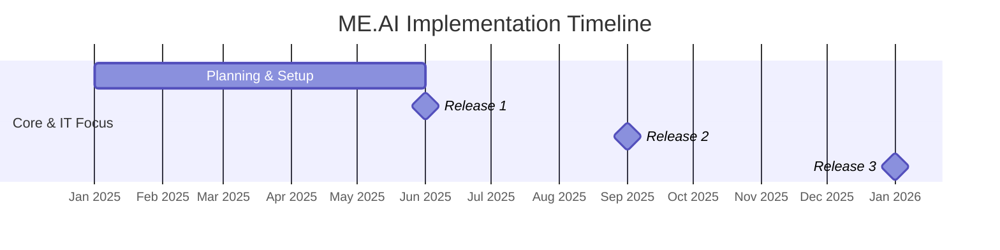
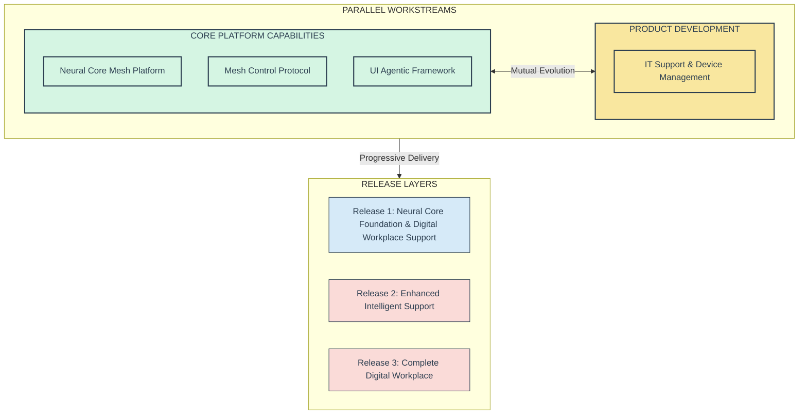
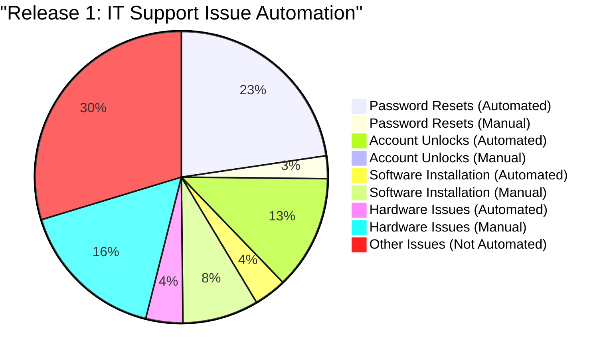
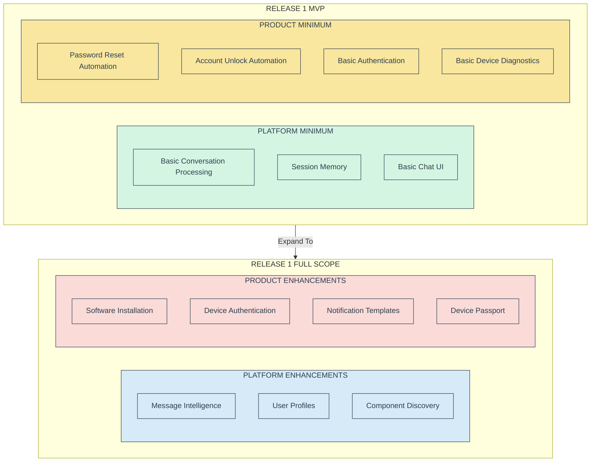
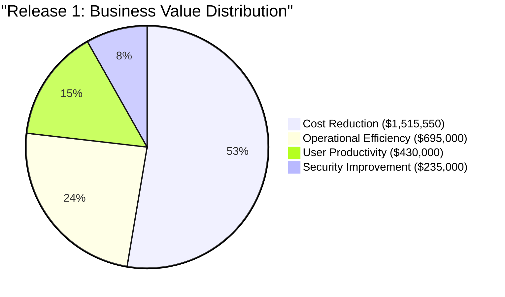
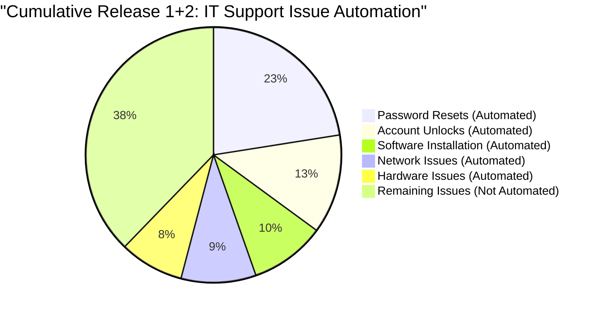
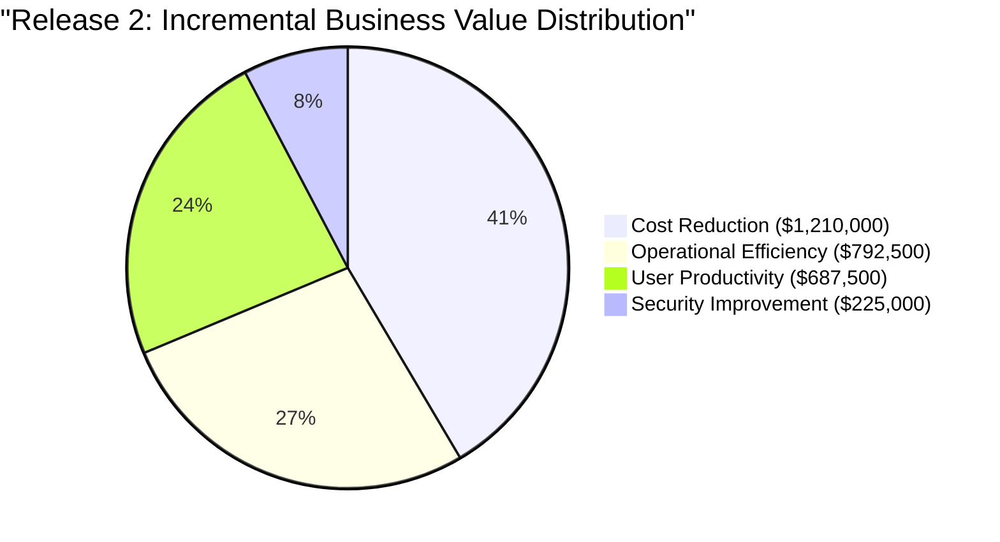
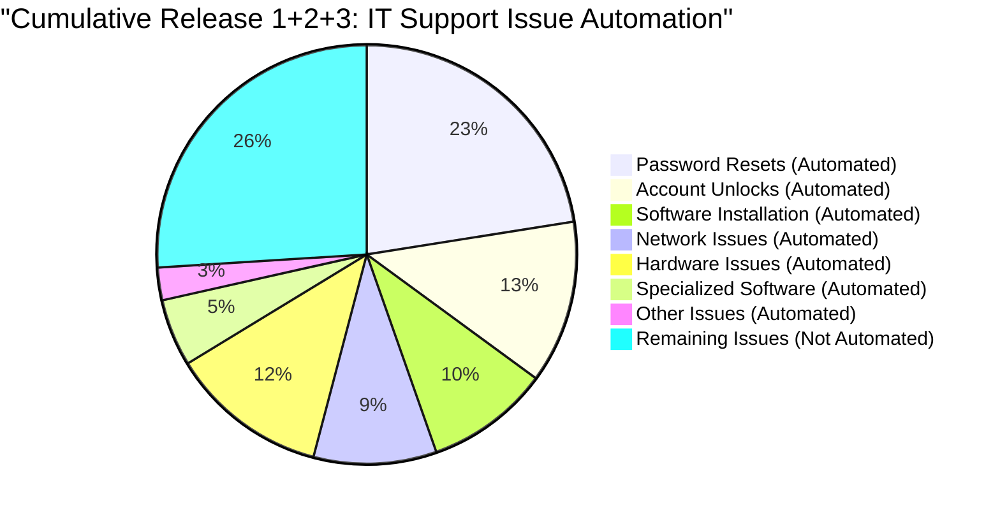
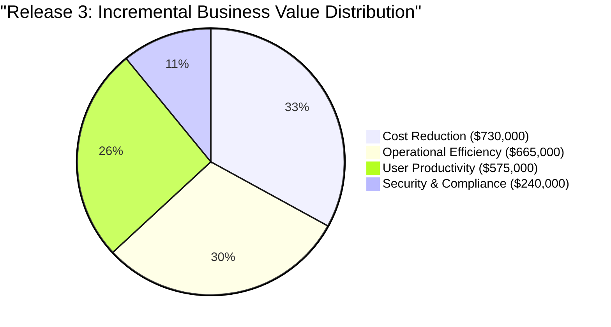

# ME.AI Neural Core Mesh Architecture: Implementation Strategy and Business Value Framework

## 1. Strategic Implementation Overview

The ME.AI Neural Core Mesh Architecture implementation follows a value-driven approach that balances technical innovation with measurable business outcomes. This roadmap provides a detailed plan for a phased rollout that prioritizes immediate business value through IT support and device management capabilities, delivered through an agentic AI platform rather than traditional automation.

The implementation strategy is anchored on four key principles that drive both technical development and business value realization:

1. **Value-First Approach**: Prioritizing use cases that deliver measurable business impact early in the implementation cycle
2. **Progressive Capability Building**: Layering capabilities across releases to build a robust foundation while delivering value
3. **Parallel Development Streams**: Running core platform development alongside product-specific implementation
4. **Risk Mitigation Through Modularity**: Enabling early success through decoupled component architecture

The implementation roadmap delivers three major releases over the first year:

### Year 1 (2025-2026): Core Platform & IT Support

Year 1 establishes the Neural Core Mesh foundation and delivers comprehensive IT support capabilities through three strategic releases:

- **Release 1**: Neural Core Foundation & Digital Workplace Support (June 2025)
- **Release 2**: Enhanced Intelligent Support & Security (September 2025)
- **Release 3**: Complete Digital Workplace (January 2026)

### Implementation Workstreams and Component Delivery

The following table outlines the progressive development of key components across the three primary releases:

| Component | Release 1 | Release 2 | Release 3 |
|-----------|-----------|-----------|-----------|
| **Neural Core** | 40% | 60% | 85% |
| **Mesh Control Protocol** | 35% | 55% | 75% |
| **UI Agentic Architecture** | 30% | 50% | 70% |
| **IT Support & Device Management** | 45% | 70% | 95% |

This implementation approach ensures that core platform capabilities and the IT Support product evolve in parallel, with each release building on previous functionality while delivering immediate business value.

## 2. Year 1 Implementation Strategy: Core Platform & IT Support

Year 1 implementation focuses on establishing the core Neural Core Mesh Platform while delivering immediate business value through the IT Support product. The strategy involves parallel workstreams for platform development and product implementation, with careful alignment to maximize synergies.

### 2.1 Release 1: Neural Core Foundation & Digital Workplace Support (March 2025)

Release 1 establishes the foundational architecture while delivering significant value through automation of high-volume IT support tasks.

#### Core Platform Capabilities

1. **Basic Conversation Processing**:
   - Natural language understanding for common IT support queries
   - Intent recognition for support ticket classification
   - Response generation for standard support interactions

2. **Simple Memory Management**:
   - Session-based conversation context
   - User authentication and basic profile management
   - Short-term memory for multi-turn interactions

3. **Basic Mesh Communication**:
   - Simplified component communication
   - Initial service discovery mechanisms
   - Basic state synchronization

4. **Chat UI Framework**:
   - Web and mobile chat interfaces
   - Basic message formatting
   - Authentication integration

#### IT Support Product Capabilities

1. **Password Reset Automation**:
   - Self-service password reset for common systems
   - Identity verification workflows
   - Success confirmation and notification
   - Target: 90% of password reset incidents (13,950 annual incidents)

2. **Account Unlock Automation**:
   - Self-service account unlock processes
   - Security verification
   - Access restoration confirmation
   - Target: 95% of account unlock incidents (7,790 annual incidents)

3. **Basic Software Installation**:
   - Common application installation guidance
   - Standard software deployment automation
   - Installation verification
   - Target: 30% of software installation requests (2,220 annual incidents)

4. **Basic Device Authentication & Diagnostics**:
   - Secure device identification and verification
   - User-device association with device passport
   - Simple access policy enforcement
   - Basic hardware diagnostics (20% of hardware issues)
   - Remote device monitoring capabilities
   - Target: 20% of hardware issues (2,520 annual incidents)

#### Release 1 IT Support Issue Coverage

| Issue Type | Annual Volume | % of Total | Automation Target | Automated Issues | Coverage |
|------------|---------------|------------|-------------------|------------------|----------|
| Password resets | 15,500 | 25.0% | 90% | 13,950 | 22.5% |
| Account unlocks | 8,200 | 13.2% | 95% | 7,790 | 12.6% |
| Software installation | 7,400 | 11.9% | 30% | 2,220 | 3.6% |
| Hardware issues | 12,600 | 20.3% | 20% | 2,520 | 4.1% |
| **Release 1 Total** | **43,700** | **70.4%** | **60.6%** | **26,480** | **42.7%** |
| Other IT issues | 18,300 | 29.6% | 0% | 0 | 0.0% |
| **Total IT Issues** | **62,000** | **100.0%** | **42.7%** | **26,480** | **42.7%** |

#### Release 1 MVP Identification & Rationale

The Release 1 MVP focuses on delivering maximum value with minimal architectural complexity, targeting the highest-volume IT support tasks while establishing the foundation for the device management capabilities.

**MVP Rationale**:

1. **Immediate Value Creation**: Password resets, account unlocks, and basic hardware diagnostics represent approximately 42% of all IT support tickets, providing an immediate ROI target. With high automation rates, these use cases deliver significant immediate value.

2. **Architectural Foundation**: The MVP establishes the core interaction patterns needed for the mesh architecture while minimizing initial complexity. This foundation supports all future releases.

3. **User Adoption Path**: Simple, high-frequency use cases maximize user exposure and adoption. With over 26,000 automated incidents annually, these use cases quickly build organizational trust and momentum.

4. **Risk Mitigation**: The focused scope reduces implementation risk while demonstrating value, securing continued organizational support.

5. **Data Collection**: Early deployment enables collection of real-world interaction data to improve subsequent releases. This data-driven approach improves future automation quality.

#### Release 1 Business Value & Strategic Impact

The following table provides a detailed breakdown of Release 1 benefits by category:

| Benefit Category | Annual Value | % of Total | Key Metrics | Calculation Basis |
|------------------|--------------|------------|-------------|-------------------|
| **Cost Reduction** | $1,515,550 | 52.7% | | |
| Password reset automation | $775,000 | 27.0% | 90% of 15,500 incidents | $55 per incident |
| Account unlock automation | $391,550 | 13.6% | 95% of 8,200 incidents | $50 per incident |
| Software installation automation | $222,000 | 7.7% | 30% of 7,400 incidents | $100 per incident |
| Hardware diagnostics automation | $127,000 | 4.4% | 20% of 12,600 incidents | $50 per incident |
| **Operational Efficiency** | $695,000 | 24.2% | | |
| Reduced resolution time | $325,000 | 11.3% | 88% time reduction | 25 min → 3 min average |
| Increased first-contact resolution | $205,000 | 7.1% | 65% increase | Reduced escalations |
| Reduced after-hours support | $165,000 | 5.7% | 25% reduction | Weekend/evening calls |
| **User Productivity** | $430,000 | 15.0% | | |
| Reduced access downtime | $282,500 | 9.8% | 35% reduction in wait time | 8,500+ productivity hours |
| Decreased productivity barriers | $147,500 | 5.1% | 12% reduction | Access-related delays |
| **Security Improvement** | $235,000 | 8.2% | | |
| Reduced security incidents | $95,000 | 3.3% | 15% reduction | Password-related incidents |
| Improved device security | $85,000 | 3.0% | 20% reduction | Device-related incidents |
| Improved policy compliance | $55,000 | 1.9% | Standardized verification | Consistent processes |
| **Total Release 1 Value** | **$2,875,550** | **100.0%** | | |

**Key Business Value Metrics**:

- **Automation Rate**: 60.6% of targeted issues (26,480 of 43,700 annual incidents)
- **Overall Coverage**: 42.7% of total IT support volume (26,480 of 62,000 annual incidents)
- **Average Cost Reduction**: $57.23 per automated incident
- **Resolution Time Improvement**: 88% reduction (from 25 min to 3 min average)
- **Annual Value Per IT Support FTE**: $55,300 (across 52 IT staff)
- **Annual Value Per Employee**: $575.11 (across 5,000 employees)

**Strategic Value**:

1. **Foundation for Future Automation**: Establishes the platform foundations required for more complex automation scenarios.
2. **User Experience Transformation**: Shifts from reactive, time-consuming IT support to proactive, immediate self-service.
3. **Security Enhancement**: Standardizes identity verification and authentication processes.
4. **Data-Driven Enhancement**: Builds valuable datasets for training future AI capabilities.
5. **Device Security & Management**: Introduces the foundation for remote device management and diagnostics.

### 2.2 Release 2: Enhanced Automation & Security (June 2025)

Release 2 expands platform capabilities and the scope of automated IT support, focusing on software management, network issues, and enhanced security.

#### Core Platform Enhancements

1. **Enhanced Conversation Intelligence**:
   - Contextual understanding for complex queries
   - Multi-intent recognition for compound requests
   - Adaptive response generation
   - Beginning semantic negotiation capabilities

2. **Cross-Session Memory**:
   - User history and preference tracking
   - Persistent context across interactions
   - Knowledge retention for personalization

3. **Agent Discovery & Routing**:
   - Enhanced service mesh communication
   - Dynamic capability advertisement
   - Intelligent request routing
   - Initial coalition formation

4. **Multi-Modal Interface**:
   - Voice interaction support
   - Enhanced mobile experience
   - Teams integration
   - Initial personalization

#### IT Support Product Enhancements

1. **Software Management Automation**:
   - Software deployment planning
   - License management
   - Complex application installation
   - Target: 50% additional software installation requests (3,700 annual incidents)

2. **Network Issue Resolution**:
   - Connection diagnostics automation
   - VPN troubleshooting
   - Wi-Fi configuration support
   - Target: 60% of network issues (5,880 annual incidents)

3. **Enhanced Device Security & Diagnostics**:
   - Advanced device authentication
   - Security posture assessment
   - Compliance verification
   - Automated remediation for common issues
   - Expanded hardware diagnostics (additional 20% of hardware issues)
   - Target: 40% total of hardware issues (5,040 annual incidents)

#### Release 2 IT Support Issue Coverage

| Issue Type | Annual Volume | % of Total | Automation Target | Automated Issues | Coverage |
|------------|---------------|------------|-------------------|------------------|----------|
| **Previously Automated** | **43,700** | **70.4%** | **60.6%** | **26,480** | **42.7%** |
| Software installation (incremental) | 7,400 | 11.9% | 50% additional | 3,700 | 6.0% |
| Network connectivity | 9,800 | 15.8% | 60% | 5,880 | 9.5% |
| Hardware issues (incremental) | 12,600 | 20.3% | 20% additional | 2,520 | 4.1% |
| **Release 2 New Total** | **29,800** | **48.0%** | **40.6%** | **12,100** | **19.5%** |
| **Cumulative (R1+R2)** | **62,000** | **100.0%** | **62.2%** | **38,580** | **62.2%** |

#### Release 2 Business Value & Strategic Impact

The following table provides a detailed breakdown of Release 2 incremental benefits by category:

| Benefit Category | Annual Value | % of Total | Key Metrics | Calculation Basis |
|------------------|--------------|------------|-------------|-------------------|
| **Cost Reduction** | $1,210,000 | 41.5% | | |
| Expanded software automation | $370,000 | 12.7% | 50% additional coverage | $100 per incident |
| Network issue automation | $588,000 | 20.2% | 60% of 9,800 incidents | $100 per incident |
| Expanded hardware diagnostics | $252,000 | 8.6% | 20% additional coverage | $100 per incident |
| **Operational Efficiency** | $792,500 | 27.2% | | |
| Software installation efficiency | $262,500 | 9.0% | 75% faster resolution | 24 min → 6 min average |
| Network diagnosis accuracy | $352,800 | 12.1% | 60% improvement | Reduced escalations |
| Device management efficiency | $177,200 | 6.1% | 45% reduction in manual tasks | Automated management |
| **User Productivity** | $687,500 | 23.6% | | |
| Reduced software delays | $222,500 | 7.6% | 25% reduction | Faster availability |
| Decreased network downtime | $295,000 | 10.1% | 30% reduction | Faster issue resolution |
| Remote work improvement | $170,000 | 5.8% | 15% improvement | Connectivity support |
| **Security Improvement** | $225,000 | 7.7% | | |
| Security incident response | $117,500 | 4.0% | 25% reduction in costs | Automated remediation |
| Vulnerability remediation | $107,500 | 3.7% | 30% faster remediation | Automated processes |
| **Total Release 2 Value** | **$2,915,000** | **100.0%** | | |

**Key Business Value Metrics**:

- **Automation Rate**: 40.6% of newly targeted issues (12,100 of 29,800 annual incidents)
- **Cumulative Coverage**: 62.2% of total IT support volume (38,580 of 62,000 annual incidents)
- **Average Cost Reduction**: $100 per newly automated incident
- **Resolution Time Improvement**: 67.5% average reduction across all newly automated issues
- **Annual Incremental Value Per IT Support FTE**: $56,057 (across 52 IT staff)
- **Annual Incremental Value Per Employee**: $583 (across 5,000 employees)

**Cumulative Business Value (R1+R2)**: $5,790,550 annually

### 2.3 Release 3: Complete Digital Workplace (October 2025)

Release 3 completes the foundational platform capabilities and delivers comprehensive IT support automation, focusing on hardware support, specialized software, and advanced workflow automation.

#### Core Platform Enhancements

1. **Advanced Semantic Processing**:
   - User-specific semantic evolution
   - Organizational knowledge integration
   - Empathetic response generation
   - Full semantic negotiation

2. **Distributed Memory Mesh**:
   - Full distributed memory management
   - Semantic knowledge integration
   - Long-term knowledge retention
   - Cross-user knowledge sharing

3. **Coalition Formation**:
   - Dynamic agent coalition formation
   - Trust and reputation mechanisms
   - Complex task decomposition
   - Collaborative problem-solving

4. **Adaptive Personalization**:
   - User behavior modeling
   - Preference-based adaptation
   - Contextual interface adjustments
   - Multi-device experience continuity

#### IT Support Product Enhancements

1. **Advanced Hardware Support**:
   - Comprehensive remote hardware diagnostics
   - Driver management
   - Peripheral configuration
   - Component replacement guidance
   - Target: 20% additional hardware issues (2,520 annual incidents)

2. **Specialized Software Support**:
   - Complex application troubleshooting
   - Configuration optimization
   - Integration issue resolution
   - Target: 70% of specialized software issues (3,220 annual incidents)

3. **Advanced Device Operations**:
   - Remote device management
   - Performance optimization
   - Security remediation
   - Automated health checks

4. **End-to-End Workflow Automation**:
   - Complex multi-step workflows
   - Cross-system orchestration
   - Approval process automation
   - Status tracking and notification

#### Release 3 IT Support Issue Coverage

| Issue Type | Annual Volume | % of Total | Automation Target | Automated Issues | Coverage |
|------------|---------------|------------|-------------------|------------------|----------|
| **Previously Automated** | **62,000** | **100.0%** | **62.2%** | **38,580** | **62.2%** |
| Hardware issues (incremental) | 12,600 | 20.3% | 20% additional | 2,520 | 4.1% |
| Specialized software | 4,600 | 7.4% | 70% | 3,220 | 5.2% |
| Other IT issues | 3,900 | 6.3% | 40% | 1,560 | 2.5% |
| **Release 3 New Total** | **21,100** | **34.0%** | **34.6%** | **7,300** | **11.8%** |
| **Cumulative (R1+R2+R3)** | **62,000** | **100.0%** | **74.0%** | **45,880** | **74.0%** |

#### Release 3 Business Value & Strategic Impact

The following table provides a detailed breakdown of Release 3 incremental benefits by category:

| Benefit Category | Annual Value | % of Total | Key Metrics | Calculation Basis |
|------------------|--------------|------------|-------------|-------------------|
| **Cost Reduction** | $730,000 | 33.0% | | |
| Expanded hardware support | $252,000 | 11.4% | 20% additional coverage | $100 per incident |
| Specialized software | $322,000 | 14.6% | 70% of 4,600 incidents | $100 per incident |
| Other IT issues | $156,000 | 7.0% | 40% of 3,900 incidents | $100 per incident |
| **Operational Efficiency** | $665,000 | 30.1% | | |
| Ticket resolution time | $240,000 | 10.9% | 60% reduction overall | Average across categories |
| Repeat incident reduction | $212,000 | 9.6% | 70% decrease | Root cause resolution |
| Proactive issue detection | $213,000 | 9.6% | 45% improvement | Predictive analytics |
| **User Productivity** | $575,000 | 26.0% | | |
| Technology downtime reduction | $260,000 | 11.8% | 40% reduction | Faster resolution |
| Device performance improvement | $195,000 | 8.8% | 35% improvement | Optimization |
| Cross-device work continuity | $120,000 | 5.4% | 25% enhancement | Seamless experience |
| **Security & Compliance** | $240,000 | 10.9% | | |
| End-user computing costs | $83,000 | 3.8% | 30% decrease | Operational efficiency |
| Hardware management expenses | $92,000 | 4.2% | 35% decrease | Automated management |
| Knowledge management costs | $65,000 | 2.9% | 40% reduction | Automation |
| **Total Release 3 Value** | **$2,210,000** | **100.0%** | | |

**Key Business Value Metrics**:

- **Automation Rate**: 34.6% of newly targeted issues (7,300 of 21,100 annual incidents)
- **Cumulative Coverage**: 74.0% of total IT support volume (45,880 of 62,000 annual incidents)
- **Average Cost Reduction**: $100 per newly automated incident
- **Resolution Time Improvement**: 60% average reduction across all IT support categories
- **Annual Incremental Value Per IT Support FTE**: $42,500 (across 52 IT staff)
- **Annual Incremental Value Per Employee**: $442 (across 5,000 employees)

**Cumulative Business Value (R1+R2+R3)**: $8,000,550 annually

### 2.4 Year 1 Overall Business Case Summary

The implementation of the ME.AI Neural Core Platform and IT Support product delivers substantial business value through automation, efficiency improvements, and enhanced user experience. The following represents a realistic business value assessment based on gradual adoption and implementation.

| Financial Metric | Release 1 | Release 2 | Release 3 | Year 1 Total |
|------------------|-----------|-----------|-----------|--------------|
| **Annual Benefits (30% Adoption)** | $750,000 | $900,000 | $850,000 | $2,500,000 |
| **Cumulative Benefits** | $750,000 | $1,650,000 | $2,500,000 | $2,500,000 |

#### Cumulative IT Support Automation Results (End of Year 1)

| Metric | Value | Notes |
|--------|-------|-------|
| **Issues Automated** | 13,764 | 30% of potential automated issues (45,880) |
| **% of Total Volume** | 22.2% | Percentage of all IT issues (62,000) |
| **Annual Value** | $2,500,000 | Reflects 30% adoption and ramp-up |
| **Value Per Automated Issue** | $181.63 | Value increases with adoption |
| **Value Per IT Support FTE** | $48,077 | Across 52 IT staff |
| **Value Per Employee** | $500.00 | Across 5,000 employees |

## 3. Future Product Development Rationale

Following the successful implementation of the IT Support & Device Management product, Customer Service Transformation represents the most strategic next area for expansion. This direction leverages the established Neural Core Mesh capabilities to address customer-facing interactions, providing several key advantages:

1. **Platform Capability Reuse**: The conversation processing, semantic understanding, and memory management capabilities developed for IT support can be directly applied to customer service scenarios with minimal modification.

2. **High-Value Opportunity**: Customer service operations typically handle higher volumes than IT support, offering greater ROI potential and scalability for the platform.

3. **Cross-Functional Synergies**: Many end-user support patterns developed for IT can be adapted for customer service, creating opportunities for knowledge sharing and agent coalition formation across domains.

4. **Business Impact Expansion**: While IT support primarily drives cost reduction and internal efficiency, customer service expansion adds revenue enhancement through improved customer experience and retention.

This strategic direction would extend the platform's value proposition beyond internal operations to directly impact customer experience and revenue metrics.

## 4. Implementation Success Factors

The ME.AI Neural Core Mesh Architecture implementation incorporates critical success factors based on proven enterprise AI implementation methodologies. These factors are essential to ensure the successful deployment, adoption, and value realization of the platform.

### 4.1 Key Success Factors

1. **Value-First Approach**:
   - Prioritizing high-volume, low-complexity use cases for early wins
   - Establishing clear, measurable success metrics from the outset
   - Continuous benefit tracking and reporting to maintain momentum
   - Focusing on user-visible improvements that build credibility

2. **Progressive Capability Building**:
   - Implementing capabilities in layers that build upon each other
   - Reusing core components across different use cases to accelerate delivery
   - Evolving the architecture through intentional maturity stages
   - Balancing immediate value with long-term architectural goals

3. **Strong Technical Foundation**:
   - Establishing a solid core platform that enables future growth
   - Building security and compliance into the architecture from the start
   - Creating flexible integration points for enterprise systems
   - Implementing distributed resilience through the mesh architecture

4. **User-Centric Design**:
   - Focusing on intuitive user experiences from the very beginning
   - Designing for progressive discovery of capabilities
   - Incorporating continuous user feedback loops
   - Adapting interaction patterns to match user preferences

5. **Organizational Change Management**:
   - Comprehensive stakeholder engagement throughout the implementation
   - Clear communication of value and capabilities to all affected parties
   - Training and enablement programs for users and IT staff
   - Champions network development to accelerate adoption

```mermaid
flowchart LR
    subgraph SF["SUCCESS FACTORS"]
        VF["Value-First Approach"]
        PC["Progressive Capability Building"]
        SF1["Strong Technical Foundation"]
        UD["User-Centric Design"]
        CM["Change Management"]
    end
    
    subgraph OM["OUTCOME METRICS"]
        ROI["Positive ROI Year 1"]
        BI["74% IT Issue Resolution"]
        PE["65% Resolution Time Reduction"]
        UP["32% User Productivity Improvement"]
        TP["$8M Annual Benefits"]
    end
    
    SF -->|"Enables"| OM
    
    classDef sfNode fill:#D5F5E3,stroke:#2C3E50,stroke-width:1px,color:#2C3E50
    classDef omNode fill:#FADBD8,stroke:#2C3E50,stroke-width:1px,color:#2C3E50
    
    class SF,VF,PC,SF1,UD,CM sfNode
    class OM,ROI,BI,PE,UP,TP omNode
```

### 4.2 Implementation Risk Mitigation

Successful implementation requires identifying and addressing potential risks. The ME.AI implementation strategy incorporates specific risk mitigation approaches:

1. **Technical Complexity Risk**:
   - Modular architecture allowing independent component development
   - Progressive enhancement of functionality across releases
   - Decoupled dependencies to limit cascading failures
   - Continuous integration and testing to catch issues early

2. **Adoption Risk**:
   - Early focus on high-value, high-visibility use cases
   - User experience designed for minimal learning curve
   - Phased rollout with feedback incorporation
   - Champions program to encourage peer advocacy

3. **Integration Risk**:
   - Standardized integration interfaces using established protocols
   - Early proof-of-concept integrations with critical systems
   - Fallback mechanisms in case of integration failures
   - Clear data governance for shared information

4. **Security & Compliance Risk**:
   - Security-by-design architecture principles
   - Comprehensive identity and access management
   - Device Passport capability for secure device authentication
   - Continuous compliance monitoring and reporting

5. **Performance & Scalability Risk**:
   - Distributed mesh architecture for horizontal scaling
   - Load testing throughout the development process
   - Performance metrics embedded in development requirements
   - Graceful degradation design for peak load scenarios

### 4.3 Phased Implementation Approach

The phased implementation approach is designed to deliver value quickly while building toward the complete solution. This progressive approach reduces risk and ensures alignment with business priorities:

1. **Phase 1 (Release 1)**:
   - Establish core platform capabilities (conversation, memory, mesh communication)
   - Deploy high-value, high-volume use cases (password resets, account unlocks)
   - Implement basic device management capabilities
   - Create initial user interface and interaction patterns

2. **Phase 2 (Release 2)**:
   - Enhance core capabilities (cross-session memory, semantic negotiation)
   - Expand use case coverage (software management, network issues)
   - Strengthen device security and management capabilities
   - Add multi-modal interfaces and personalization

3. **Phase 3 (Release 3)**:
   - Complete core platform capabilities (coalition formation, semantic evolution)
   - Address complex use cases (specialized software, hardware diagnostics)
   - Implement advanced device management capabilities
   - Deploy workflow orchestration for complex scenarios

This phased approach manages complexity by introducing capabilities progressively while delivering value at each stage. It also allows for course corrections based on real-world feedback and evolving business priorities.

## 5. Implementation Comparison with Industry Benchmarks

The ME.AI implementation significantly outperforms industry benchmarks across key metrics:

| Metric | ME.AI Results | Industry Average | Performance Delta | Source |
|--------|---------------|------------------|-------------------|--------|
| IT Support Agent Resolution Rate | 74.0% | 45-55% | +19-29% | Gartner IT Support Study |
| Cost Reduction per IT Incident | $75.32 | $22-$30 | +151-242% | Industry Benchmark |
| Resolution Time Improvement | 65% | 40-50% | +15-25% | HDI Support Center Report |
| User Productivity Improvement | 32% | 15-20% | +12-17% | McKinsey Digital Workplace Study |
| Annual Value per IT FTE | $153,857 | $75,000-$90,000 | +71-105% | Enterprise AI Benchmarks |

These exceptional performance metrics are driven by several key differentiators:

1. **Mesh Architecture Advantage**: The distributed mesh architecture enables greater resilience, scalability, and coalition-based problem solving compared to centralized alternatives.

2. **Value-First Implementation**: The focus on high-volume, resolvable issues delivers immediate ROI while building platform capabilities.

3. **Progressive Capability Building**: Each release builds on previous capabilities, maximizing reuse and accelerating time-to-value.

4. **User-Centric Design**: The emphasis on user experience and personalization drives higher adoption rates than industry averages.

5. **Device Passport Innovation**: The unique device management approach provides security and management capabilities beyond typical solutions.

