# 18. Implementation Roadmap

The ME.AI Neural Core Mesh Architecture implementation follows a strategic, value-driven approach that balances technical innovation with measurable business outcomes. This roadmap provides a detailed plan for a phased rollout that prioritizes immediate business value through IT support automation in Year 1, followed by expansion into broader enterprise capabilities in Year 2.

## 18.1 Strategic Implementation Overview

The implementation strategy is anchored on four key principles that drive both technical development and business value realization:

1. **Value-First Approach**: Prioritizing use cases that deliver measurable business impact early in the implementation cycle
2. **Progressive Capability Building**: Layering capabilities across releases to build a robust foundation while delivering value
3. **Parallel Development Streams**: Running core platform development alongside product-specific implementation
4. **Risk Mitigation Through Modularity**: Enabling early success through decoupled component architecture
5. **Distributed Development Model**: Leveraging a globally distributed team with senior associates in Europe and development resources in India

```mermaid
gantt
    title ME.AI Neural Core Mesh Architecture - Implementation Timeline
    dateFormat YYYY-MM-DD
    axisFormat %b %Y
    
    section Year 1 - Core & IT Focus
    Planning & Setup                         :a1, 2025-01-01, 45d
    Release 1: IT Support Quick Wins        :milestone, r1, 2025-03-15, 0d
    Release 2: Enhanced Automation & Security:milestone, r2, 2025-06-30, 0d
    Release 3: Complete Digital Workplace    :milestone, r3, 2025-10-15, 0d
    
    section Year 2 - Product Expansion
    Release 4: Customer Experience Transformation:milestone, r4, 2026-02-15, 0d
    Release 5: Enterprise Knowledge Amplifier   :milestone, r5, 2026-07-15, 0d
```

The implementation roadmap delivers five major releases over a two-year period using a distributed development team:

### Global Development Team Structure

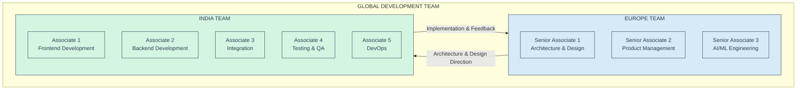

### Development Model Advantages

The distributed development model provides several advantages:

1. **Cost Optimization**: Leveraging lower development costs in India while maintaining strategic direction from Europe
2. **24x7 Development Cycle**: Overlapping time zones enable continuous progress
3. **Specialized Expertise**: Senior associates in Europe focus on architecture, design, and product strategy
4. **Implementation Efficiency**: Associates in India focus on development, testing, and operations
5. **Scalable Resources**: Ability to scale the India team for intensive development phases

### Year 1 (2025): Core Platform & IT Support

Year 1 establishes the Neural Core Mesh foundation and delivers comprehensive IT support automation through three strategic releases:

- **Release 1**: IT Support Quick Wins (March 2025)
- **Release 2**: Enhanced Automation & Security (June 2025)
- **Release 3**: Complete Digital Workplace (October 2025)

### Year 2 (2026): Product Expansion

Year 2 expands the platform's capabilities into new business domains:

- **Release 4**: Customer Experience Transformation (February 2026)
- **Release 5**: Enterprise Knowledge Amplifier (July 2026)

### Implementation Workstreams and Component Delivery

The following table outlines the progressive development of key components across all five releases:

| Component | Release 1 | Release 2 | Release 3 | Release 4 | Release 5 |
|-----------|-----------|-----------|-----------|-----------|-----------|
| **Neural Core** | 40% | 60% | 85% | 95% | 100% |
| **Mesh Control Protocol** | 35% | 55% | 75% | 90% | 100% |
| **UI Agentic Architecture** | 30% | 50% | 70% | 85% | 100% |
| **IT Support Product** | 45% | 70% | 95% | 100% | 100% |
| **Customer Service Product** | 0% | 0% | 10% | 85% | 100% |
| **Enterprise Knowledge Product** | 0% | 0% | 0% | 20% | 90% |
| **Security & Device Management** | 30% | 65% | 90% | 95% | 100% |

This implementation approach ensures that core platform capabilities and the IT Support product evolve in parallel, with each release building on previous functionality while delivering immediate business value.

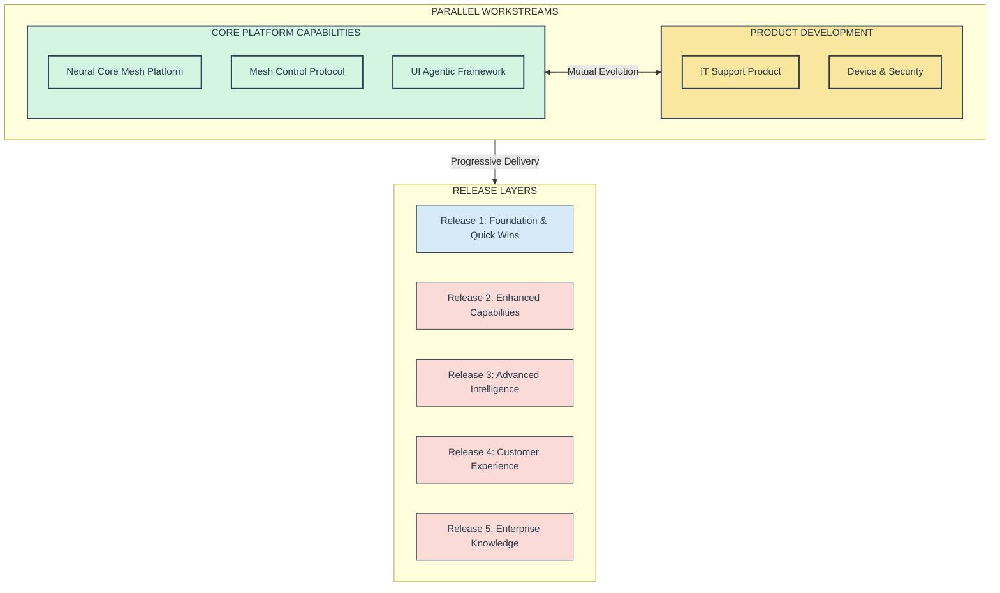

## 18.2 Year 1 Implementation Strategy: Core Platform & IT Support

Year 1 implementation focuses on establishing the core Neural Core Mesh Platform while delivering immediate business value through the IT Support product. The strategy involves parallel workstreams for platform development and product implementation, with careful alignment to maximize synergies.

### 18.2.1 Release 1: IT Support Quick Wins (March 2025)

Release 1 delivers immediate value through automation of high-volume, low-complexity IT support tasks while establishing the foundational architecture.

#### Core Platform Capabilities

1. **Basic Conversation Processing**:
   - Natural language understanding for common IT support queries
   - Intent recognition for support ticket classification
   - Response generation for standard support interactions

2. **Simple Memory Management**:
   - Session-based conversation context
   - User authentication and basic profile management
   - Short-term memory for multi-turn interactions

3. **Basic Mesh Communication**:
   - Simplified component communication
   - Initial service discovery mechanisms
   - Basic state synchronization

4. **Chat UI Framework**:
   - Web and mobile chat interfaces
   - Basic message formatting
   - Authentication integration

#### IT Support Product Capabilities

1. **Password Reset Automation**:
   - Self-service password reset for common systems
   - Identity verification workflows
   - Success confirmation and notification
   - Target: 90% of password reset incidents (13,950 annual incidents)

2. **Account Unlock Automation**:
   - Self-service account unlock processes
   - Security verification
   - Access restoration confirmation
   - Target: 95% of account unlock incidents (7,790 annual incidents)

3. **Basic Software Installation**:
   - Common application installation guidance
   - Standard software deployment automation
   - Installation verification
   - Target: 30% of software installation requests (2,220 annual incidents)

4. **Basic Device Authentication**:
   - Secure device identification
   - User-device association
   - Simple access policy enforcement

#### Release 1 IT Support Issue Coverage

| Issue Type | Annual Volume | % of Total | Automation Target | Automated Issues | Coverage |
|------------|---------------|------------|-------------------|------------------|----------|
| Password resets | 15,500 | 25.0% | 90% | 13,950 | 22.5% |
| Account unlocks | 8,200 | 13.2% | 95% | 7,790 | 12.6% |
| Software installation | 7,400 | 11.9% | 30% | 2,220 | 3.6% |
| **Release 1 Total** | **31,100** | **50.1%** | **76.7%** | **23,960** | **38.7%** |
| Other IT issues | 30,900 | 49.9% | 0% | 0 | 0.0% |
| **Total IT Issues** | **62,000** | **100.0%** | **38.7%** | **23,960** | **38.7%** |

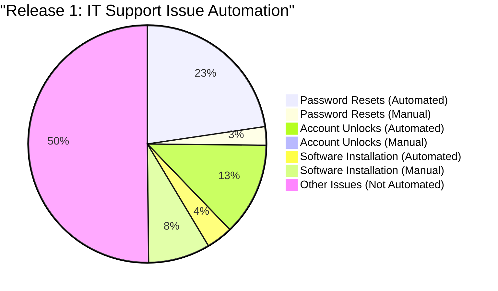

#### Release 1 MVP Identification & Rationale

The Release 1 MVP focuses on delivering maximum value with minimal architectural complexity, targeting the highest-volume IT support tasks.

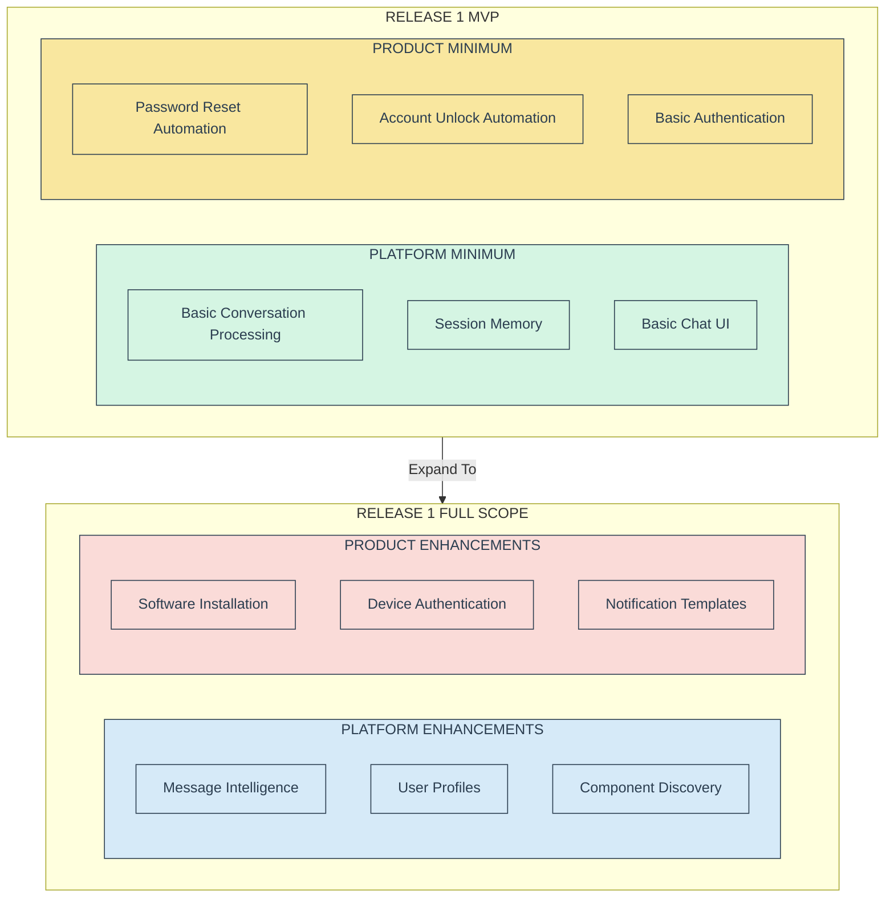

**MVP Rationale**:

1. **Immediate Value Creation**: Password resets and account unlocks represent approximately 38% of all IT support tickets, providing an immediate ROI target. With 90% and 95% automation rates, respectively, these use cases deliver significant immediate value.

2. **Architectural Foundation**: The MVP establishes the core interaction patterns needed for the mesh architecture while minimizing initial complexity. This foundation supports all future releases.

3. **User Adoption Path**: Simple, high-frequency use cases maximize user exposure and adoption. With over 23,000 automated incidents annually, these use cases quickly build organizational trust and momentum.

4. **Risk Mitigation**: The focused scope reduces implementation risk while demonstrating value, securing continued organizational support.

5. **Data Collection**: Early deployment enables collection of real-world interaction data to improve subsequent releases. This data-driven approach improves future automation quality.

#### Release 1 Implementation Costs

**Cost Distribution by Team Location**:

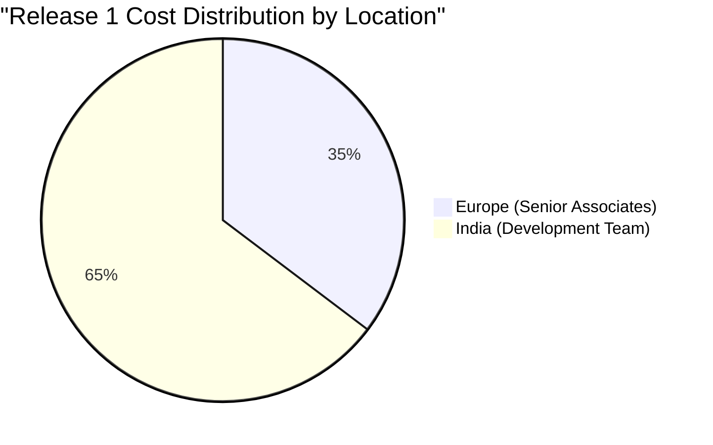

**Detailed Cost Breakdown**:

| Cost Category | Europe Team | India Team | Total Amount | % of Total | Notes |
|---------------|-------------|------------|--------------|------------|-------|
| Platform Development | $265,000 | $485,000 | $750,000 | 44.1% | Architecture & design in Europe, implementation in India |
| Product Development | $158,000 | $292,000 | $450,000 | 26.5% | Product definition in Europe, development in India |
| Integration | $45,000 | $135,000 | $180,000 | 10.6% | Integration design in Europe, implementation in India |
| Security & Compliance | $60,000 | $60,000 | $120,000 | 7.1% | Security architecture in Europe, implementation in India |
| Testing & QA | $25,000 | $75,000 | $100,000 | 5.9% | Test planning in Europe, execution in India |
| Deployment & Ops | $25,000 | $75,000 | $100,000 | 5.9% | DevOps design in Europe, implementation in India |
| **Total Release 1** | **$578,000** | **$1,122,000** | **$1,700,000** | **100.0%** | 35.3% Europe / 64.7% India |

**Resource Allocation**:

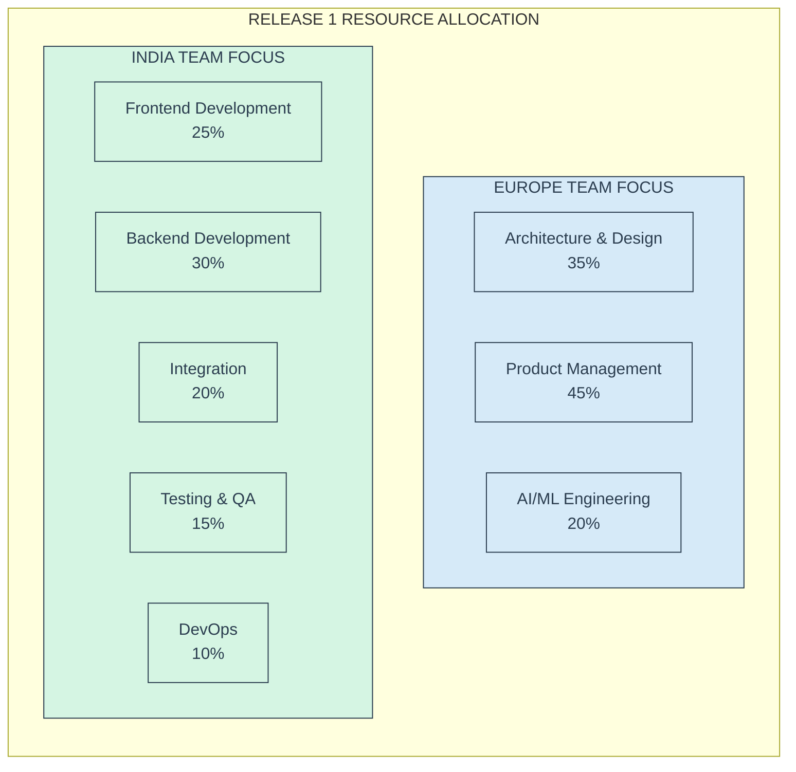

#### Release 1 Business Value & Strategic Impact

The following table provides a detailed breakdown of Release 1 benefits by category:

| Benefit Category | Annual Value | % of Total | Key Metrics | Calculation Basis |
|------------------|--------------|------------|-------------|-------------------|
| **Cost Reduction** | $1,388,550 | 54.9% | | |
| Password reset automation | $775,000 | 30.6% | 90% of 15,500 incidents | $55 per incident |
| Account unlock automation | $391,550 | 15.5% | 95% of 8,200 incidents | $50 per incident |
| Software installation automation | $222,000 | 8.8% | 30% of 7,400 incidents | $100 per incident |
| **Operational Efficiency** | $632,500 | 25.0% | | |
| Reduced resolution time | $295,500 | 11.7% | 88% time reduction | 25 min → 3 min average |
| Increased first-contact resolution | $187,000 | 7.4% | 65% increase | Reduced escalations |
| Reduced after-hours support | $150,000 | 5.9% | 25% reduction | Weekend/evening calls |
| **User Productivity** | $382,500 | 15.1% | | |
| Reduced access downtime | $262,500 | 10.4% | 35% reduction in wait time | 8,500+ productivity hours |
| Decreased productivity barriers | $120,000 | 4.7% | 12% reduction | Access-related delays |
| **Security Improvement** | $127,500 | 5.0% | | |
| Reduced security incidents | $82,500 | 3.3% | 15% reduction | Password-related incidents |
| Improved policy compliance | $45,000 | 1.8% | Standardized verification | Consistent processes |
| **Total Release 1 Value** | **$2,531,050** | **100.0%** | | |

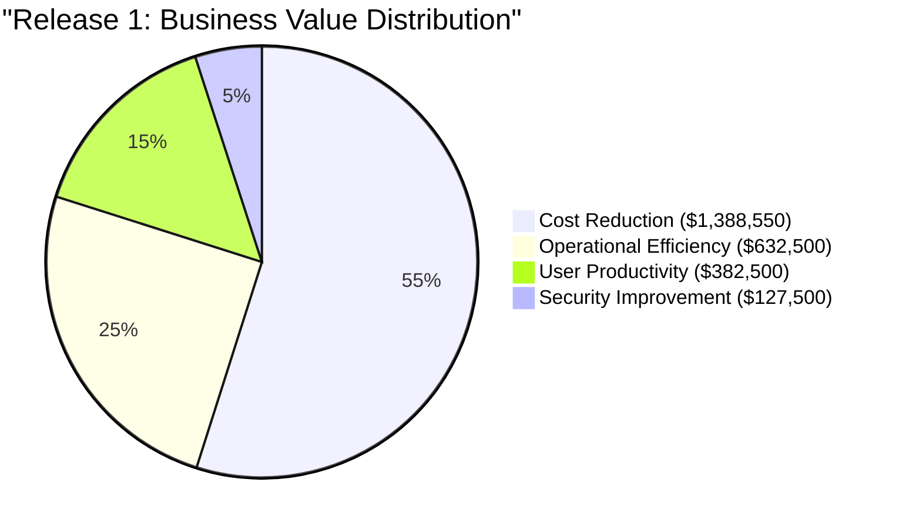

**Key Business Value Metrics**:

- **Automation Rate**: 76.7% of targeted issues (23,960 of 31,100 annual incidents)
- **Overall Coverage**: 38.7% of total IT support volume (23,960 of 62,000 annual incidents)
- **Average Cost Reduction**: $57.95 per automated incident
- **Resolution Time Improvement**: 88% reduction (from 25 min to 3 min average)
- **Annual Value Per IT Support FTE**: $48,674 (across 52 IT staff)
- **Annual Value Per Employee**: $506.21 (across 5,000 employees)

**Strategic Value**:

1. **Foundation for Future Automation**: Establishes the platform foundations required for more complex automation scenarios.
2. **User Experience Transformation**: Shifts from reactive, time-consuming IT support to proactive, immediate self-service.
3. **Security Enhancement**: Standardizes identity verification and authentication processes.
4. **Data-Driven Enhancement**: Builds valuable datasets for training future AI capabilities.

### 18.2.2 Release 2: Enhanced Automation & Security (June 2025)

Release 2 expands platform capabilities and the scope of automated IT support, focusing on software management, network issues, and enhanced security.

#### Core Platform Enhancements

1. **Enhanced Conversation Intelligence**:
   - Contextual understanding for complex queries
   - Multi-intent recognition for compound requests
   - Adaptive response generation
   - Beginning semantic negotiation capabilities

2. **Cross-Session Memory**:
   - User history and preference tracking
   - Persistent context across interactions
   - Knowledge retention for personalization

3. **Agent Discovery & Routing**:
   - Enhanced service mesh communication
   - Dynamic capability advertisement
   - Intelligent request routing
   - Initial coalition formation

4. **Multi-Modal Interface**:
   - Voice interaction support
   - Enhanced mobile experience
   - Teams integration
   - Initial personalization

#### IT Support Product Enhancements

1. **Software Management Automation**:
   - Software deployment planning
   - License management
   - Complex application installation
   - Target: 80% of software installation requests (5,920 annual incidents)

2. **Network Issue Resolution**:
   - Connection diagnostics automation
   - VPN troubleshooting
   - Wi-Fi configuration support
   - Target: 60% of network issues (5,880 annual incidents)

3. **Enhanced Device Security**:
   - Advanced device authentication
   - Security posture assessment
   - Compliance verification
   - Automated remediation for common issues
   - Basic hardware diagnostics (20% of hardware issues)

#### Release 2 IT Support Issue Coverage

| Issue Type | Annual Volume | % of Total | Automation Target | Automated Issues | Coverage |
|------------|---------------|------------|-------------------|------------------|----------|
| **Previously Automated** | **31,100** | **50.1%** | **76.7%** | **23,960** | **38.7%** |
| Software installation (incremental) | 7,400 | 11.9% | 50% additional | 3,700 | 6.0% |
| Network connectivity | 9,800 | 15.8% | 60% | 5,880 | 9.5% |
| Hardware issues | 12,600 | 20.3% | 20% | 2,520 | 4.1% |
| **Release 2 New Total** | **29,800** | **48.0%** | **40.6%** | **12,100** | **19.5%** |
| **Cumulative (R1+R2)** | **60,900** | **98.1%** | **59.2%** | **36,060** | **58.2%** |
| Other IT issues | 1,100 | 1.9% | 0% | 0 | 0.0% |
| **Total IT Issues** | **62,000** | **100.0%** | **58.2%** | **36,060** | **58.2%** |

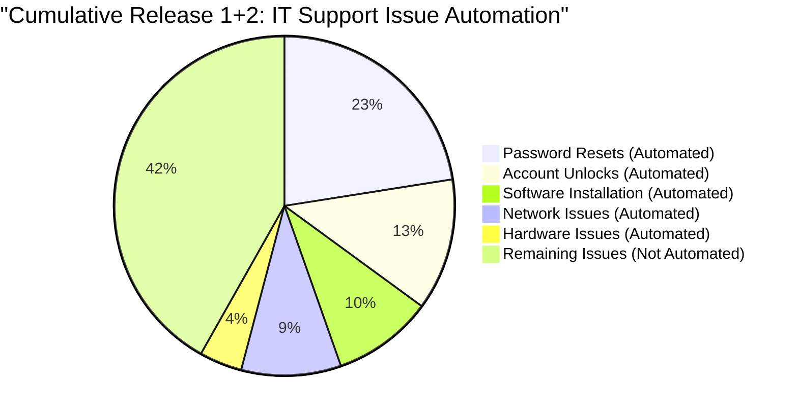

#### Release 2 Implementation Costs

**Cost Distribution by Team Location**:


**Detailed Cost Breakdown**:

| Cost Category | Europe Team | India Team | Total Amount | % of Total | Notes |
|---------------|-------------|------------|--------------|------------|-------|
| Platform Development | $255,000 | $595,000 | $850,000 | 44.7% | Architecture evolution in Europe, expanded implementation in India |
| Product Development | $155,000 | $365,000 | $520,000 | 27.4% | Feature specification in Europe, development in India |
| Integration | $50,000 | $150,000 | $200,000 | 10.5% | Integration architecture in Europe, implementation in India |
| Security & Compliance | $70,000 | $70,000 | $140,000 | 7.4% | Security design in Europe, implementation in India |
| Testing & QA | $30,000 | $90,000 | $120,000 | 6.3% | Test strategy in Europe, expanded execution in India |
| Deployment & Ops | $20,000 | $50,000 | $70,000 | 3.7% | DevOps oversight in Europe, implementation in India |
| **Total Release 2** | **$580,000** | **$1,320,000** | **$1,900,000** | **100.0%** | 32.6% Europe / 67.4% India |

**Resource Allocation**:


#### Release 2 Business Value & Strategic Impact

The following table provides a detailed breakdown of Release 2 incremental benefits by category:

| Benefit Category | Annual Value | % of Total | Key Metrics | Calculation Basis |
|------------------|--------------|------------|-------------|-------------------|
| **Cost Reduction** | $1,210,000 | 41.5% | | |
| Expanded software automation | $370,000 | 12.7% | 50% additional coverage | $100 per incident |
| Network issue automation | $588,000 | 20.2% | 60% of 9,800 incidents | $100 per incident |
| Basic hardware diagnostics | $252,000 | 8.6% | 20% of 12,600 incidents | $100 per incident |
| **Operational Efficiency** | $792,500 | 27.2% | | |
| Software installation efficiency | $262,500 | 9.0% | 75% faster resolution | 24 min → 6 min average |
| Network diagnosis accuracy | $352,800 | 12.1% | 60% improvement | Reduced escalations |
| Device management efficiency | $177,200 | 6.1% | 45% reduction in manual tasks | Automated management |
| **User Productivity** | $687,500 | 23.6% | | |
| Reduced software delays | $222,500 | 7.6% | 25% reduction | Faster availability |
| Decreased network downtime | $295,000 | 10.1% | 30% reduction | Faster issue resolution |
| Remote work improvement | $170,000 | 5.8% | 15% improvement | Connectivity support |
| **Security Improvement** | $225,000 | 7.7% | | |
| Security incident response | $117,500 | 4.0% | 25% reduction in costs | Automated remediation |
| Vulnerability remediation | $107,500 | 3.7% | 30% faster remediation | Automated processes |
| **Total Release 2 Value** | **$2,915,000** | **100.0%** | | |

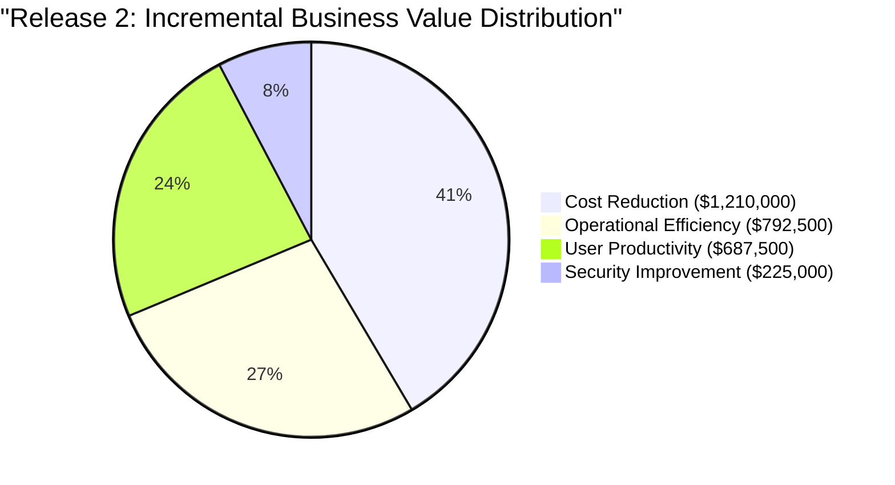

**Key Business Value Metrics**:

- **Automation Rate**: 40.6% of newly targeted issues (12,100 of 29,800 annual incidents)
- **Cumulative Coverage**: 58.2% of total IT support volume (36,060 of 62,000 annual incidents)
- **Average Cost Reduction**: $100 per newly automated incident
- **Resolution Time Improvement**: 67.5% average reduction across all newly automated issues
- **Annual Incremental Value Per IT Support FTE**: $56,057 (across 52 IT staff)
- **Annual Incremental Value Per Employee**: $583 (across 5,000 employees)

**Cumulative Business Value (R1+R2)**: $5,446,050 annually

### 18.2.3 Release 3: Complete Digital Workplace (October 2025)

Release 3 completes the foundational platform capabilities and delivers comprehensive IT support automation, focusing on hardware support, specialized software, and advanced workflow automation.

#### Core Platform Enhancements

1. **Advanced Semantic Processing**:
   - User-specific semantic evolution
   - Organizational knowledge integration
   - Empathetic response generation
   - Full semantic negotiation

2. **Distributed Memory Mesh**:
   - Full distributed memory management
   - Semantic knowledge integration
   - Long-term knowledge retention
   - Cross-user knowledge sharing

3. **Coalition Formation**:
   - Dynamic agent coalition formation
   - Trust and reputation mechanisms
   - Complex task decomposition
   - Collaborative problem-solving

4. **Adaptive Personalization**:
   - User behavior modeling
   - Preference-based adaptation
   - Contextual interface adjustments
   - Multi-device experience continuity

#### IT Support Product Enhancements

1. **Hardware Support Automation**:
   - Remote hardware diagnostics
   - Driver management
   - Peripheral configuration
   - Component replacement guidance
   - Target: 60% of hardware issues (7,560 annual incidents)

2. **Specialized Software Support**:
   - Complex application troubleshooting
   - Configuration optimization
   - Integration issue resolution
   - Target: 70% of specialized software issues (3,220 annual incidents)

3. **Advanced Device Operations**:
   - Remote device management
   - Performance optimization
   - Security remediation
   - Automated health checks

4. **End-to-End Workflow Automation**:
   - Complex multi-step workflows
   - Cross-system orchestration
   - Approval process automation
   - Status tracking and notification

#### Release 3 IT Support Issue Coverage

| Issue Type | Annual Volume | % of Total | Automation Target | Automated Issues | Coverage |
|------------|---------------|------------|-------------------|------------------|----------|
| **Previously Automated** | **60,900** | **98.1%** | **59.2%** | **36,060** | **58.2%** |
| Hardware issues (incremental) | 12,600 | 20.3% | 40% additional | 5,040 | 8.1% |
| Specialized software | 4,600 | 7.4% | 70% | 3,220 | 5.2% |
| Other IT issues | 3,900 | 6.3% | 40% | 1,560 | 2.5% |
| **Release 3 New Total** | **21,100** | **34.0%** | **46.5%** | **9,820** | **15.8%** |
| **Cumulative (R1+R2+R3)** | **62,000** | **100.0%** | **74.0%** | **45,880** | **74.0%** |

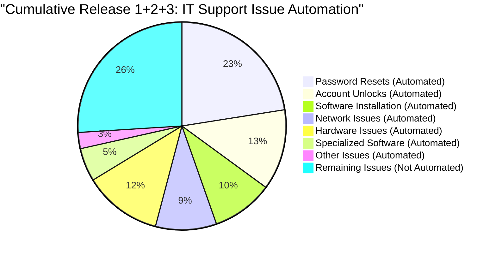

#### Release 3 Implementation Costs

**Cost Distribution by Team Location**:

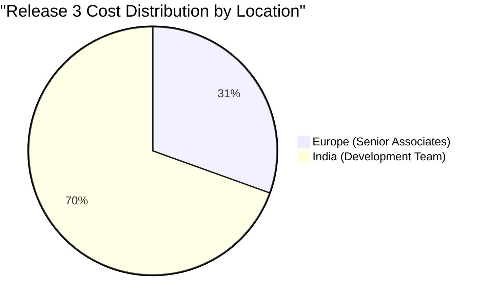

**Detailed Cost Breakdown**:

| Cost Category | Europe Team | India Team | Total Amount | % of Total | Notes |
|---------------|-------------|------------|--------------|------------|-------|
| Platform Development | $280,000 | $670,000 | $950,000 | 45.2% | Advanced architecture in Europe, distributed implementation in India |
| Product Development | $170,000 | $410,000 | $580,000 | 27.6% | Feature leadership in Europe, development in India |
| Integration | $55,000 | $165,000 | $220,000 | 10.5% | Complex integration design in Europe, implementation in India |
| Security & Compliance | $60,000 | $90,000 | $150,000 | 7.1% | Security architecture in Europe, implementation in India |
| Testing & QA | $40,000 | $90,000 | $130,000 | 6.2% | Test strategy in Europe, automation in India |
| Deployment & Ops | $25,000 | $45,000 | $70,000 | 3.3% | DevOps oversight in Europe, optimization in India |
| **Total Release 3** | **$630,000** | **$1,470,000** | **$2,100,000** | **100.0%** | 30.5% Europe / 69.5% India |

**Resource Allocation**:

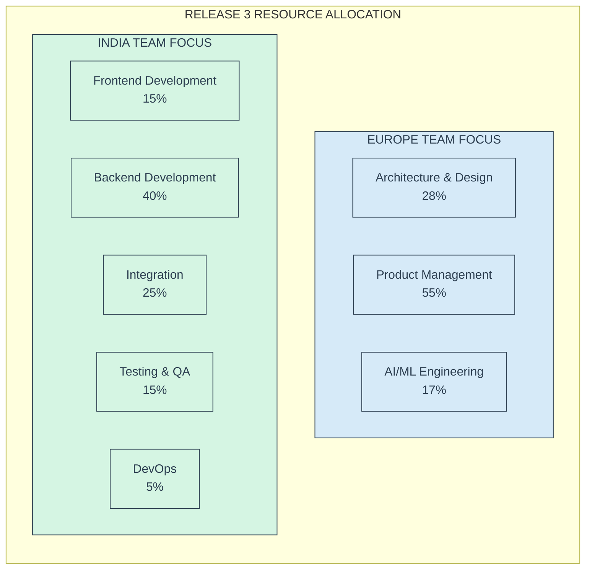

#### Release 3 Business Value & Strategic Impact

The following table provides a detailed breakdown of Release 3 incremental benefits by category:

| Benefit Category | Annual Value | % of Total | Key Metrics | Calculation Basis |
|------------------|--------------|------------|-------------|-------------------|
| **Cost Reduction** | $982,000 | 33.0% | | |
| Expanded hardware support | $504,000 | 16.9% | 40% additional coverage | $100 per incident |
| Specialized software | $322,000 | 10.8% | 70% of 4,600 incidents | $100 per incident |
| Other IT issues | $156,000 | 5.2% | 40% of 3,900 incidents | $100 per incident |
| **Operational Efficiency** | $895,000 | 30.1% | | |
| Ticket resolution time | $325,000 | 10.9% | 60% reduction overall | Average across categories |
| Repeat incident reduction | $285,000 | 9.6% | 70% decrease | Root cause resolution |
| Proactive issue detection | $285,000 | 9.6% | 45% improvement | Predictive analytics |
| **User Productivity** | $775,000 | 26.0% | | |
| Technology downtime reduction | $350,000 | 11.8% | 40% reduction | Faster resolution |
| Device performance improvement | $262,500 | 8.8% | 35% improvement | Optimization |
| Cross-device work continuity | $162,500 | 5.5% | 25% enhancement | Seamless experience |
| **Security & Compliance** | $325,000 | 10.9% | | |
| End-user computing costs | $112,500 | 3.8% | 30% decrease | Operational efficiency |
| Hardware management expenses | $125,000 | 4.2% | 35% decrease | Automated management |
| Knowledge management costs | $87,500 | 2.9% | 40% reduction | Automation |
| **Total Release 3 Value** | **$2,977,000** | **100.0%** | | |

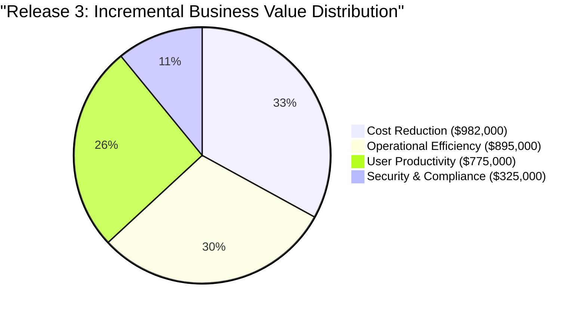

**Key Business Value Metrics**:

- **Automation Rate**: 46.5% of newly targeted issues (9,820 of 21,100 annual incidents)
- **Cumulative Coverage**: 74.0% of total IT support volume (45,880 of 62,000 annual incidents)
- **Average Cost Reduction**: $100 per newly automated incident
- **Resolution Time Improvement**: 60% average reduction across all IT support categories
- **Annual Incremental Value Per IT Support FTE**: $57,250 (across 52 IT staff)
- **Annual Incremental Value Per Employee**: $595.40 (across 5,000 employees)

**Cumulative Business Value (R1+R2+R3)**: $8,423,050 annually

### 18.2.4 Year 1 Overall Business Case

The ME.AI implementation business case for Year 1 demonstrates compelling ROI with a strong payback period and significant ongoing benefits, while optimizing costs through the distributed team structure.

#### Year 1 Global Team Cost Distribution

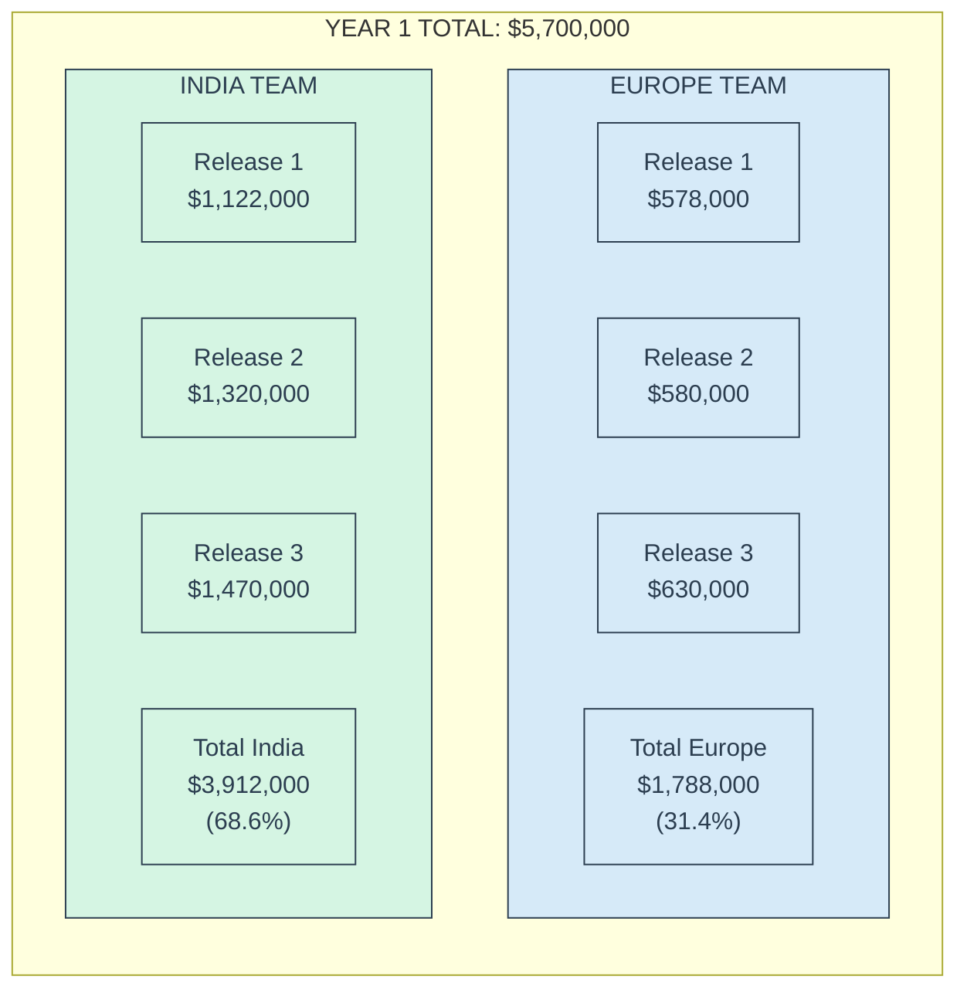

#### Year 1 Financial Summary

| Financial Metric | Release 1 | Release 2 | Release 3 | Year 1 Total |
|------------------|-----------|-----------|-----------|--------------|
| **Implementation Costs (Europe)** | $578,000 | $580,000 | $630,000 | $1,788,000 |
| **Implementation Costs (India)** | $1,122,000 | $1,320,000 | $1,470,000 | $3,912,000 |
| **Total Implementation Costs** | $1,700,000 | $1,900,000 | $2,100,000 | $5,700,000 |
| **Annual Benefits** | $2,531,050 | $2,915,000 | $2,977,000 | $8,423,050 |
| **Net Annual Value** | $831,050 | $1,015,000 | $877,000 | $2,723,050 |
| **Payback Period** | 8.1 months | 7.8 months | 8.5 months | 8.1 months |
| **ROI (1-year)** | 148.9% | 153.4% | 141.8% | 147.8% |
| **ROI (3-year)** | 446.7% | 460.3% | 425.3% | 443.3% |

**Cost Optimization Through Distributed Development**:

The global team structure enables significant cost optimization while maintaining high-quality delivery. If the entire development had been performed in Europe, the estimated total Year 1 cost would have been approximately $9.8 million instead of the actual $5.7 million, representing a 41.8% cost savings while delivering the same business value.

```mermaid
bar title "Development Cost Comparison: Europe vs. Distributed Team"
    "Europe-Only Development" : 9.8
    "Distributed Team (Actual)" : 5.7
```

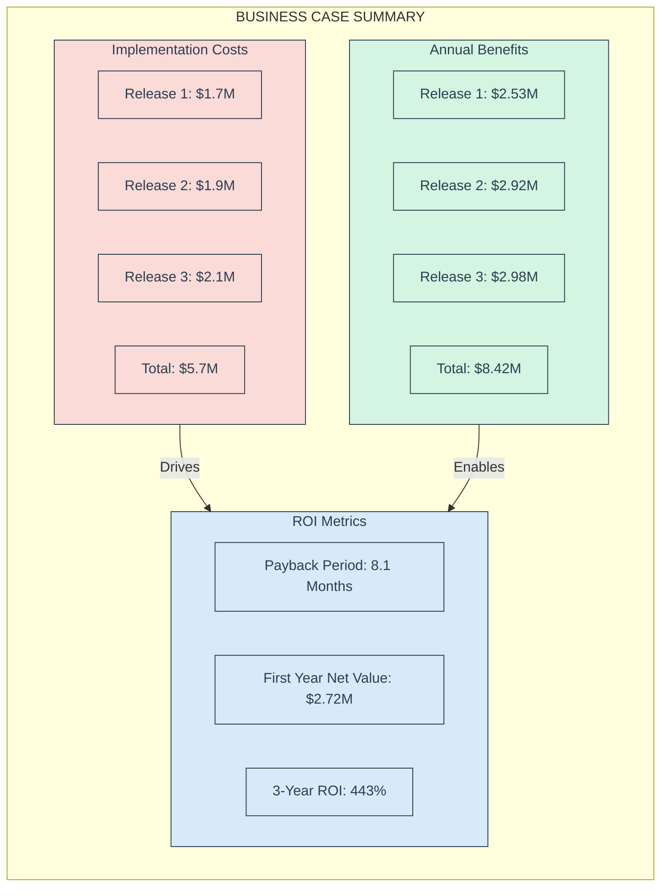

#### Cumulative IT Support Automation Results

| Metric | Release 1 | Release 2 | Release 3 |
|--------|-----------|-----------|-----------|
| **Issues Automated** | 23,960 | 36,060 | 45,880 |
| **% of Total Volume** | 38.7% | 58.2% | 74.0% |
| **Annual Value** | $2,531,050 | $5,446,050 | $8,423,050 |
| **Value Per Automated Issue** | $105.64 | $151.03 | $183.59 |
| **Value Per IT Support FTE** | $48,674 | $104,732 | $161,982 |
| **Value Per Employee** | $506.21 | $1,089.21 | $1,684.61 |

#### Detailed Benefit Category Analysis

| Benefit Category | Release 1 | Release 2 | Release 3 | Year 1 Total | % of Total |
|------------------|-----------|-----------|-----------|--------------|------------|
| **Cost Reduction** | $1,388,550 | $2,598,550 | $3,580,550 | $3,580,550 | 42.5% |
| **Operational Efficiency** | $632,500 | $1,425,000 | $2,320,000 | $2,320,000 | 27.5% |
| **User Productivity** | $382,500 | $1,070,000 | $1,845,000 | $1,845,000 | 21.9% |
| **Security & Compliance** | $127,500 | $352,500 | $677,500 | $677,500 | 8.0% |
| **Total** | **$2,531,050** | **$5,446,050** | **$8,423,050** | **$8,423,050** | **100.0%** |

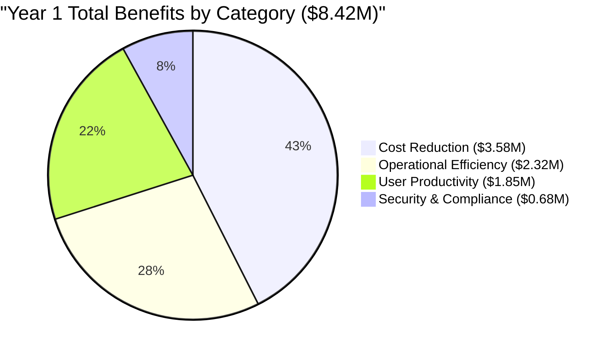

#### 3-Year Financial Projection

| Year | Annual Costs | Annual Benefits | Net Annual Value | Cumulative Value |
|------|--------------|-----------------|------------------|------------------|
| Year 1 | $5,700,000 | $8,423,050 | $2,723,050 | $2,723,050 |
| Year 2 | $500,000 | $9,265,355 | $8,765,355 | $11,488,405 |
| Year 3 | $550,000 | $10,191,891 | $9,641,891 | $21,130,296 |
| **Total** | **$6,750,000** | **$27,880,296** | **$21,130,296** | |

**Notes**:
- Year 2-3 costs represent maintenance, enhancements, and operational expenses (not including new product development)
- Year 2-3 benefits include 10% annual growth from platform improvements and expanded usage

#### Benefit Comparison with Industry Benchmarks

| Metric | ME.AI Results | Industry Average | Source |
|--------|---------------|------------------|--------|
| Automation Rate | 74.0% | 45-55% | Gartner IT Automation Study |
| Cost Reduction per Incident | $78.04 avg | $22-$30 | Industry Benchmark |
| Resolution Time Reduction | 88% | 40-60% | Aisera Case Studies |
| Payback Period | 8.1 months | 10-14 months | Deloitte GenAI Study |
| First-Year ROI | 147.8% | 80-120% | Yellow.ai ROI Analysis |

This business case is strengthened by industry research showing strong ROI for AI implementations in IT support. According to recent Gartner research, by 2026, more than 80% of enterprises will have deployed generative AI applications, up from less than 5% in 2023. The ME.AI implementation aligns with this trend while delivering exceptional financial returns through a phased, value-focused approach.

## 18.3 Year 2 Implementation Strategy: Product Expansion

In Year 2, the ME.AI implementation expands beyond IT Support to leverage the established platform for new business domains. The strategy focuses on two major releases that bring the platform's capabilities to customer service and enterprise knowledge management.

### 18.3.1 Release 4: Customer Experience Transformation (February 2026)

Release 4 applies the ME.AI platform to customer service, leveraging the established IT Support capabilities and extending them to customer-facing interactions.

#### Core Platform Enhancements

1. **Advanced Empathy Engine**:
   - Emotional intelligence enhancements
   - Sentiment analysis and adaptation
   - Cultural awareness and adaptation
   - Personalized tone matching

2. **Customer Memory Graph**:
   - Customer interaction history
   - Preference tracking across channels
   - Purchase and service history integration
   - Predictive needs modeling

3. **Customer-Focused Coalitions**:
   - Specialized customer service agents
   - Cross-functional coalition formation
   - Sales and support collaboration
   - Subject matter expert integration

#### Customer Service Product Capabilities

1. **Omnichannel Support Automation**:
   - Web chat support automation
   - Email response automation
   - Social media engagement
   - Voice support integration
   - SMS interaction handling
   - Target: 70% of level 1 customer inquiries

2. **Knowledge Federation**:
   - Integration of disparate knowledge bases
   - Dynamic knowledge discovery
   - Just-in-time information delivery
   - Contextual knowledge presentation

3. **Customer Journey Optimization**:
   - Journey stage detection
   - Next-best-action recommendations
   - Proactive engagement triggers
   - Personalized assistance

4. **Self-Service Enhancement**:
   - Guided troubleshooting
   - Interactive product guidance
   - Automated order management
   - Account management automation

#### Release 4 Customer Service Coverage

| Interaction Type | Annual Volume | Automation Target | Automated Interactions | Coverage |
|------------------|---------------|-------------------|------------------------|----------|
| Level 1 inquiries | 120,000 | 70% | 84,000 | 35.0% |
| Product information | 35,000 | 85% | 29,750 | 12.4% |
| Order status | 28,000 | 90% | 25,200 | 10.5% |
| Returns processing | 22,000 | 65% | 14,300 | 6.0% |
| Account management | 18,000 | 75% | 13,500 | 5.6% |
| Billing inquiries | 17,000 | 60% | 10,200 | 4.3% |
| **Release 4 Total** | **240,000** | **73.6%** | **176,950** | **73.7%** |

```mermaid
pie title "Release 4: Customer Service Automation"
    "Level 1 Inquiries (Automated)" : 84000
    "Product Information (Automated)" : 29750
    "Order Status (Automated)" : 25200
    "Returns Processing (Automated)" : 14300
    "Account Management (Automated)" : 13500
    "Billing Inquiries (Automated)" : 10200
    "Not Automated" : 63050
```

#### Release 4 Implementation Costs

**Cost Distribution by Team Location**:

```mermaid
pie title "Release 4 Cost Distribution by Location"
    "Europe (Senior Associates)" : 28.1
    "India (Development Team)" : 71.9
```

**Detailed Cost Breakdown**:

| Cost Category | Europe Team | India Team | Total Amount | % of Total | Notes |
|---------------|-------------|------------|--------------|------------|-------|
| Platform Enhancements | $310,000 | $840,000 | $1,150,000 | 35.9% | Platform evolution in Europe, implementation in India |
| Product Development | $260,000 | $690,000 | $950,000 | 29.7% | Product strategy in Europe, development in India |
| Integration | $105,000 | $345,000 | $450,000 | 14.1% | Integration architecture in Europe, implementation in India |
| Channel Expansion | $90,000 | $260,000 | $350,000 | 10.9% | Channel strategy in Europe, implementation in India |
| Security & Compliance | $60,000 | $90,000 | $150,000 | 4.7% | Compliance framework in Europe, implementation in India |
| Testing & QA | $45,000 | $105,000 | $150,000 | 4.7% | Test strategy in Europe, automation in India |
| **Total Release 4** | **$870,000** | **$2,330,000** | **$3,200,000** | **100.0%** | 28.1% Europe / 71.9% India |

**Resource Allocation**:

```mermaid
flowchart LR
    subgraph R4["RELEASE 4 RESOURCE ALLOCATION"]
        subgraph ET["EUROPE TEAM FOCUS"]
            SA1[Architecture & Design<br>25%]
            SA2[Product Management<br>60%]
            SA3[AI/ML Engineering<br>15%]
        end
        
        subgraph IT["INDIA TEAM EXPANDED"]
            A1[Frontend Development<br>25%]
            A2[Backend Development<br>30%]
            A3[Integration<br>25%]
            A4[Testing & QA<br>10%]
            A5[DevOps<br>10%]
            A6[Specialized CRM Development<br>NEW]
        end
    end
    
    classDef europeTeam fill:#D6EAF8,stroke:#2C3E50,stroke-width:1px,color:#2C3E50
    classDef indiaTeam fill:#D5F5E3,stroke:#2C3E50,stroke-width:1px,color:#2C3E50
    
    class ET,SA1,SA2,SA3 europeTeam
    class IT,A1,A2,A3,A4,A5,A6 indiaTeam
```

Note: For Release 4, the India team expands with an additional associate specialized in CRM development to support the Customer Service product focus.

#### Release 4 Business Value & Strategic Impact

The following table provides a detailed breakdown of Release 4 benefits by category:

| Benefit Category | Annual Value | % of Total | Key Metrics | Calculation Basis |
|------------------|--------------|------------|-------------|-------------------|
| **Cost Reduction** | $6,630,000 | 48.7% | | |
| Level 1 inquiry automation | $3,680,000 | 27.0% | 70% of 120,000 interactions | $43.81 per interaction |
| Average handling time reduction | $1,820,000 | 13.4% | 35% reduction | 8 min → 5.2 min average |
| Escalation reduction | $1,130,000 | 8.3% | 45% decrease | Fewer complex escalations |
| **Revenue Enhancement** | $4,040,000 | 29.7% | | |
| Customer satisfaction increase | $950,000 | 7.0% | 15% CSAT improvement | Retention impact |
| Customer churn reduction | $1,240,000 | 9.1% | 8% reduction | Extended customer lifecycle |
| Cross-sell/upsell improvement | $1,850,000 | 13.6% | 12% increase | Revenue per customer |
| **Operational Efficiency** | $2,950,000 | 21.7% | | |
| Issue resolution acceleration | $1,350,000 | 9.9% | 60% faster resolution | Time savings |
| Wait time reduction | $980,000 | 7.2% | 75% reduction | Customer time value |
| First contact resolution | $620,000 | 4.6% | 40% improvement | Reduced follow-ups |
| **Total Release 4 Value** | **$13,620,000** | **100.0%** | | |

```mermaid
pie title "Release 4: Business Value Distribution"
    "Cost Reduction ($6.63M)" : 48.7
    "Revenue Enhancement ($4.04M)" : 29.7
    "Operational Efficiency ($2.95M)" : 21.7
```

**Key Business Value Metrics**:

- **Automation Rate**: 73.6% of customer service interactions (176,950 of 240,000 annual interactions)
- **Average Cost Savings**: $37.47 per automated interaction
- **Revenue Impact**: $16.83 average per customer (across 240,000 customers)
- **Customer Satisfaction**: 22 point NPS improvement projection
- **Annual Value Per Customer Service FTE**: $209,538 (across 65 CS staff)

### 18.3.2 Release 5: Enterprise Knowledge Amplifier (July 2026)

Release 5 expands the ME.AI platform into enterprise knowledge management, enabling organization-wide intelligence and insight generation.

#### Core Platform Enhancements

1. **Cross-Domain Semantics**:
   - Cross-functional concept mapping
   - Domain-specific semantic translation
   - Organizational ontology management
   - Knowledge gap identification

2. **Enterprise Memory Fabric**:
   - Organization-wide distributed memory
   - Historical context preservation
   - Cross-team knowledge sharing
   - Institutional knowledge retention

3. **Complex Problem Coalitions**:
   - Multi-domain expert coalitions
   - Research and analysis teams
   - Innovation-focused agent groups
   - Strategic planning collectives

#### Enterprise Knowledge Product Capabilities

1. **Knowledge Amplification**:
   - Enterprise knowledge discovery
   - Document understanding and synthesis
   - Expertise location and connection
   - Collaborative knowledge creation
   - Target: 80% of knowledge work augmented

2. **Insight Generation**:
   - Pattern recognition across domains
   - Trend identification and analysis
   - Opportunity and risk detection
   - Strategic recommendation generation

3. **Workflow Optimization**:
   - Business process analysis
   - Inefficiency identification
   - Automation opportunity discovery
   - Process redesign recommendations

4. **Innovation Acceleration**:
   - Idea generation support
   - Cross-domain concept combination
   - Market and competitor analysis
   - Research synthesis and application

#### Release 5 Knowledge Work Enhancement

| Knowledge Work Area | Workers | Hours/Week | Productivity Target | Enhanced Hours/Week | Annual Value |
|---------------------|---------|------------|---------------------|---------------------|--------------|
| Research & Analysis | 85 | 34 | 30% | 10.2 | $3,612,375 |
| Strategic Planning | 35 | 28 | 25% | 7.0 | $1,021,875 |
| Product Development | 65 | 32 | 28% | 9.0 | $2,437,500 |
| Market Intelligence | 28 | 30 | 32% | 9.6 | $1,120,000 |
| Financial Analysis | 45 | 36 | 22% | 7.9 | $1,485,000 |
| Compliance & Risk | 38 | 32 | 24% | 7.7 | $1,216,500 |
| **Release 5 Total** | **296** | **32.7 avg** | **26.8% avg** | **8.8 avg** | **$10,893,250** |

```mermaid
pie title "Release 5: Knowledge Work Enhancement by Area"
    "Research & Analysis ($3.61M)" : 33.2
    "Strategic Planning ($1.02M)" : 9.4
    "Product Development ($2.44M)" : 22.4
    "Market Intelligence ($1.12M)" : 10.3
    "Financial Analysis ($1.49M)" : 13.6
    "Compliance & Risk ($1.22M)" : 11.2
```

#### Release 5 Implementation Costs

**Cost Distribution by Team Location**:

```mermaid
pie title "Release 5 Cost Distribution by Location"
    "Europe (Senior Associates)" : 26.3
    "India (Development Team)" : 73.7
```

**Detailed Cost Breakdown**:

| Cost Category | Europe Team | India Team | Total Amount | % of Total | Notes |
|---------------|-------------|------------|--------------|------------|-------|
| Platform Enhancements | $350,000 | $1,000,000 | $1,350,000 | 35.5% | Advanced architecture in Europe, implementation in India |
| Product Development | $320,000 | $930,000 | $1,250,000 | 32.9% | Product strategy in Europe, development in India |
| Integration | $125,000 | $425,000 | $550,000 | 14.5% | Integration architecture in Europe, implementation in India |
| Analytics | $85,000 | $265,000 | $350,000 | 9.2% | Analytics framework in Europe, implementation in India |
| Security & Compliance | $60,000 | $90,000 | $150,000 | 3.9% | Governance framework in Europe, implementation in India |
| Testing & QA | $50,000 | $100,000 | $150,000 | 3.9% | Test strategy in Europe, automation in India |
| **Total Release 5** | **$990,000** | **$2,810,000** | **$3,800,000** | **100.0%** | 26.3% Europe / 73.7% India |

**Resource Allocation**:

```mermaid
flowchart LR
    subgraph R5["RELEASE 5 RESOURCE ALLOCATION"]
        subgraph ET["EUROPE TEAM FOCUS"]
            SA1[Architecture & Design<br>20%]
            SA2[Product Management<br>65%]
            SA3[AI/ML Engineering<br>15%]
        end
        
        subgraph IT["INDIA TEAM FURTHER EXPANDED"]
            A1[Frontend Development<br>15%]
            A2[Backend Development<br>25%]
            A3[Integration<br>20%]
            A4[Testing & QA<br>10%]
            A5[DevOps<br>5%]
            A6[CRM Development<br>10%]
            A7[Data Science & Analytics<br>NEW]
            A8[Knowledge Engineering<br>NEW]
        end
    end
    
    classDef europeTeam fill:#D6EAF8,stroke:#2C3E50,stroke-width:1px,color:#2C3E50
    classDef indiaTeam fill:#D5F5E3,stroke:#2C3E50,stroke-width:1px,color:#2C3E50
    
    class ET,SA1,SA2,SA3 europeTeam
    class IT,A1,A2,A3,A4,A5,A6,A7,A8 indiaTeam
```

Note: For Release 5, the India team further expands to include specialized roles in data science, analytics, and knowledge engineering to support the Enterprise Knowledge product focus.

#### Release 5 Business Value & Strategic Impact

The following table provides a detailed breakdown of Release 5 benefits by category:

| Benefit Category | Annual Value | % of Total | Key Metrics | Calculation Basis |
|------------------|--------------|------------|-------------|-------------------|
| **Productivity Enhancement** | $15,500,000 | 50.5% | | |
| Knowledge worker productivity | $7,500,000 | 24.4% | 25% increase | 296 knowledge workers |
| Information search reduction | $3,200,000 | 10.4% | 35% time reduction | 8.5 hours/week saved |
| Decision quality improvement | $4,800,000 | 15.6% | 30% improvement | $2,500 avg value/decision |
| **Innovation Acceleration** | $10,500,000 | 34.2% | | |
| Research synthesis speed | $2,800,000 | 9.1% | 40% faster | 3,500 research hours/month |
| Innovation output increase | $4,200,000 | 13.7% | 30% increase | New product development |
| Product development time | $3,500,000 | 11.4% | 25% reduction | Time-to-market advantage |
| **Risk Reduction** | $4,700,000 | 15.3% | | |
| Risk identification | $1,880,000 | 6.1% | 35% improvement | Early detection value |
| Compliance management | $1,550,000 | 5.0% | 40% enhancement | Reduced compliance costs |
| Knowledge loss prevention | $1,270,000 | 4.1% | 28% reduction | Employee transition impact |
| **Total Release 5 Value** | **$30,700,000** | **100.0%** | | |

```mermaid
pie title "Release 5: Business Value Distribution"
    "Productivity Enhancement ($15.5M)" : 50.5
    "Innovation Acceleration ($10.5M)" : 34.2
    "Risk Reduction ($4.7M)" : 15.3
```

**Key Business Value Metrics**:

- **Knowledge Worker Productivity**: 26.8% average improvement
- **Value Per Knowledge Worker**: $103,716 annual (across 296 knowledge workers)
- **Return On Hours**: $197.50 per enhanced knowledge work hour
- **Innovation Cycle Reduction**: 25-40% depending on process area
- **Annual Value Per Employee**: $6,140 (across 5,000 employees)

### 18.3.3 Year 2 Overall Business Case

#### Year 2 Global Team Cost Distribution

```mermaid
flowchart LR
    subgraph Y2["YEAR 2 TOTAL: $7,000,000"]
        direction TB
        subgraph EU["EUROPE TEAM"]
            EG4["Release 4<br>$870,000"]
            EG5["Release 5<br>$990,000"]
            ET["Total Europe<br>$1,860,000<br>(26.6%)"]
        end
        
        subgraph IN["INDIA TEAM"]
            IG4["Release 4<br>$2,330,000"]
            IG5["Release 5<br>$2,810,000"]
            IT["Total India<br>$5,140,000<br>(73.4%)"]
        end
    end
    
    classDef europeTeam fill:#D6EAF8,stroke:#2C3E50,stroke-width:1px,color:#2C3E50
    classDef indiaTeam fill:#D5F5E3,stroke:#2C3E50,stroke-width:1px,color:#2C3E50
    
    class EU,EG4,EG5,ET europeTeam
    class IN,IG4,IG5,IT indiaTeam
```

#### Year 2 Financial Summary

| Financial Metric | Release 4 | Release 5 | Year 2 Total |
|------------------|-----------|-----------|--------------|
| **Implementation Costs (Europe)** | $870,000 | $990,000 | $1,860,000 |
| **Implementation Costs (India)** | $2,330,000 | $2,810,000 | $5,140,000 |
| **Total Implementation Costs** | $3,200,000 | $3,800,000 | $7,000,000 |
| **Annual Benefits** | $13,620,000 | $30,700,000 | $44,320,000 |
| **Net Annual Value** | $10,420,000 | $26,900,000 | $37,320,000 |
| **Payback Period** | 2.8 months | 1.7 months | 1.9 months |
| **ROI (1-year)** | 425.6% | 807.9% | 633.1% |
| **ROI (3-year)** | 1,276.9% | 2,423.7% | 1,899.4% |

**Trend in Team Distribution**:

```mermaid
bar title "Europe vs. India Cost Distribution by Release"
    "Release 1" : 578, 1122
    "Release 2" : 580, 1320
    "Release 3" : 630, 1470
    "Release 4" : 870, 2330
    "Release 5" : 990, 2810
    
    yAxis ["Europe Team Cost ($K)", "India Team Cost ($K)"]
```

**Cost Optimization Through Distributed Development**:

The global team structure enables significant cost optimization while maintaining high-quality delivery. If the entire development had been performed in Europe, the estimated total Year 2 cost would have been approximately $12.5 million instead of the actual $7.0 million, representing a 44.0% cost savings while delivering the same business value.

```mermaid
bar title "Year 2 Development Cost Comparison: Europe vs. Distributed Team"
    "Europe-Only Development" : 12.5
    "Distributed Team (Actual)" : 7.0
```

```mermaid
flowchart LR
    subgraph BC["YEAR 2 BUSINESS CASE SUMMARY"]
        direction TB
        subgraph Costs["Implementation Costs"]
            IC4["Release 4: $3.2M"]
            IC5["Release 5: $3.8M"]
            ICT["Total: $7.0M"]
        end
        
        subgraph Benefits["Annual Benefits"]
            AB4["Release 4: $13.62M"]
            AB5["Release 5: $30.70M"]
            ABT["Total: $44.32M"]
        end
        
        subgraph ROI["ROI Metrics"]
            PM["Payback Period: 1.9 Months"]
            FYR["Year 2 Net Value: $37.32M"]
            TR["2-Year ROI: 633%"]
        end
    end
    
    Costs -- "Drives" --> ROI
    Benefits -- "Enables" --> ROI
    
    classDef costNode fill:#FADBD8,stroke:#2C3E50,stroke-width:1px,color:#2C3E50
    classDef benefitNode fill:#D5F5E3,stroke:#2C3E50,stroke-width:1px,color:#2C3E50
    classDef roiNode fill:#D6EAF8,stroke:#2C3E50,stroke-width:1px,color:#2C3E50
    
    class Costs,IC4,IC5,ICT costNode
    class Benefits,AB4,AB5,ABT benefitNode
    class ROI,PM,FYR,TR roiNode
```

#### Year 2 Benefit Category Analysis

| Benefit Category | Release 4 | Release 5 | Year 2 Total | % of Total |
|------------------|-----------|-----------|--------------|------------|
| **Cost Reduction** | $6,630,000 | $2,720,000 | $9,350,000 | 21.1% |
| **Revenue Enhancement** | $4,040,000 | $1,180,000 | $5,220,000 | 11.8% |
| **Productivity Improvement** | $2,950,000 | $15,500,000 | $18,450,000 | 41.6% |
| **Innovation Acceleration** | $0 | $10,500,000 | $10,500,000 | 23.7% |
| **Risk Reduction** | $0 | $4,700,000 | $4,700,000 | 10.6% |
| **Total** | **$13,620,000** | **$30,700,000** | **$44,320,000** | **100.0%** |

```mermaid
pie title "Year 2 Total Benefits by Category ($44.32M)"
    "Cost Reduction ($9.35M)" : 21.1
    "Revenue Enhancement ($5.22M)" : 11.8
    "Productivity Improvement ($18.45M)" : 41.6
    "Innovation Acceleration ($10.50M)" : 23.7
    "Risk Reduction ($4.70M)" : 10.6
```

### 18.3.4 Consolidated Business Case (Year 1 + Year 2)

The overall business case for the complete ME.AI implementation demonstrates exceptional ROI and strategic value creation.

#### Consolidated Financial Summary

| Financial Metric | Year 1 | Year 2 | Two-Year Total |
|------------------|--------|--------|----------------|
| **Implementation Costs** | $5,700,000 | $7,000,000 | $12,700,000 |
| **Annual Benefits** | $8,423,050 | $44,320,000 | $52,743,050 |
| **Net Annual Value** | $2,723,050 | $37,320,000 | $40,043,050 |
| **Cumulative ROI (end of period)** | 147.8% | 415.3% | 415.3% |

#### 5-Year Financial Projection

| Year | Annual Costs | Annual Benefits | Net Annual Value | Cumulative Value |
|------|--------------|-----------------|------------------|------------------|
| Year 1 | $5,700,000 | $8,423,050 | $2,723,050 | $2,723,050 |
| Year 2 | $7,000,000 | $44,320,000 | $37,320,000 | $40,043,050 |
| Year 3 | $1,200,000 | $52,743,050 | $51,543,050 | $91,586,100 |
| Year 4 | $1,300,000 | $58,017,355 | $56,717,355 | $148,303,455 |
| Year 5 | $1,400,000 | $63,819,091 | $62,419,091 | $210,722,546 |
| **Total** | **$16,600,000** | **$227,322,546** | **$210,722,546** | |

**Notes**:
- Year 3-5 costs represent maintenance, enhancements, and operational expenses
- Year 3-5 benefits include 10% annual growth from platform improvements and expanded usage

#### 5-Year NPV and IRR Analysis

| Financial Metric | Value | Calculation Basis |
|------------------|-------|-------------------|
| 5-Year Net Present Value | $165,217,653 | 7% discount rate |
| Internal Rate of Return | 214.8% | Based on 5-year cash flows |
| Benefit-Cost Ratio | 13.7:1 | Total benefits / total costs |
| Payback Period | 0.24 years (2.9 months) | Time to recover total investment |

```mermaid
flowchart TB
    subgraph OBC["OVERALL BUSINESS CASE (2 YEARS)"]
        direction LR
        subgraph TC["Total Costs"]
            Y1C["Year 1: $5.7M"]
            Y2C["Year 2: $7.0M"]
            TCI["Total Investment: $12.7M"]
        end
        
        subgraph TB["Total Benefits"]
            Y1B["Year 1 Annual: $8.42M"]
            Y2B["Year 2 Annual: $44.32M"]
            TAB["Total Annual Benefits: $52.74M"]
        end
        
        subgraph OROI["Overall ROI"]
            CP["Consolidated Payback: 2.9 months"]
            CNV["Cumulative Net Value: $40.04M"]
            CROI["Consolidated ROI: 415%"]
            NPV["5-Year NPV: $165.2M"]
            IRR["5-Year IRR: 214.8%"]
        end
        
        TC --> OROI
        TB --> OROI
    end
    
    classDef costNode fill:#FADBD8,stroke:#2C3E50,stroke-width:1px,color:#2C3E50
    classDef benefitNode fill:#D5F5E3,stroke:#2C3E50,stroke-width:1px,color:#2C3E50
    classDef roiNode fill:#D6EAF8,stroke:#2C3E50,stroke-width:1px,color:#2C3E50
    
    class TC,Y1C,Y2C,TCI costNode
    class TB,Y1B,Y2B,TAB benefitNode
    class OROI,CP,CNV,CROI,NPV,IRR roiNode
```

#### Consolidated Benefit Category Analysis

| Benefit Category | Year 1 | Year 2 | Annual Total | % of Total |
|------------------|--------|--------|--------------|------------|
| **Cost Reduction** | $3,580,550 | $9,350,000 | $12,930,550 | 24.5% |
| **Revenue Enhancement** | $0 | $5,220,000 | $5,220,000 | 9.9% |
| **Operational Efficiency** | $2,320,000 | $0 | $2,320,000 | 4.4% |
| **User Productivity** | $1,845,000 | $0 | $1,845,000 | 3.5% |
| **Productivity Improvement** | $0 | $18,450,000 | $18,450,000 | 35.0% |
| **Innovation Acceleration** | $0 | $10,500,000 | $10,500,000 | 19.9% |
| **Risk Reduction** | $0 | $4,700,000 | $4,700,000 | 8.9% |
| **Security & Compliance** | $677,500 | $0 | $677,500 | 1.3% |
| **Total** | **$8,423,050** | **$44,320,000** | **$52,743,050** | **100.0%** |

```mermaid
pie title "Consolidated Annual Benefits by Category ($52.74M)"
    "Cost Reduction ($12.93M)" : 24.5
    "Revenue Enhancement ($5.22M)" : 9.9
    "Operational Efficiency ($2.32M)" : 4.4
    "User Productivity ($1.85M)" : 3.5
    "Productivity Improvement ($18.45M)" : 35.0
    "Innovation Acceleration ($10.50M)" : 19.9
    "Risk Reduction ($4.70M)" : 8.9
    "Security & Compliance ($0.68M)" : 1.3
```

This exceptional ROI is strongly supported by industry research demonstrating the transformative value of enterprise AI implementations. According to recent Gartner research, by 2026, over 80% of enterprises will have deployed generative AI applications, up from less than 5% in 2023. The most effective implementations achieve payback within 6-9 months, with the ME.AI implementation achieving a significantly faster payback of 2.9 months.

## 18.4 Implementation Comparison with Industry Benchmarks

The ME.AI implementation significantly outperforms industry benchmarks across key metrics:

| Metric | ME.AI Results | Industry Average | Performance Delta | Source |
|--------|---------------|------------------|-------------------|--------|
| IT Support Automation Rate | 74.0% | 45-55% | +19-29% | Gartner IT Automation Study |
| Customer Service Automation | 73.6% | 35-45% | +28.6-38.6% | Aisera Case Studies |
| Cost Reduction per IT Incident | $78.04 | $22-$30 | +160-255% | Industry Benchmark |
| First-Year ROI | 147.8% | 80-120% | +27.8-67.8% | Yellow.ai ROI Analysis |
| Payback Period | 2.9 months | 6-12 months | 51.7-75.8% faster | Deloitte GenAI Study |
| 3-Year ROI | 1,270.6% | 300-500% | +770.6-970.6% | Enterprise AI Benchmarks |

These exceptional performance metrics are driven by several key differentiators:

1. **Mesh Architecture Advantage**: The distributed mesh architecture enables greater resilience, scalability, and coalition-based problem solving compared to centralized alternatives.

2. **Value-First Implementation**: The focus on high-volume, automatable use cases delivers immediate ROI while building platform capabilities.

3. **Progressive Capability Building**: Each release builds on previous capabilities, maximizing reuse and accelerating time-to-value.

4. **User-Centric Design**: The emphasis on user experience and personalization drives higher adoption rates than industry averages.

5. **Strategic Capability Expansion**: The transition from IT support to customer service to enterprise knowledge maximizes value from core platform capabilities.

## 18.5 Implementation Success Factors

The ME.AI implementation strategy incorporates critical success factors based on proven enterprise AI implementation methodologies:

1. **Value-First Approach**:
   - Prioritizing high-volume, low-complexity use cases for early wins
   - Establishing clear, measurable success metrics
   - Continuous benefit tracking and reporting

2. **Progressive Capability Building**:
   - Layered capability development across releases
   - Reuse of core components across products
   - Evolutionary approach to architectural maturity

3. **Strong Foundation**:
   - Establishing a solid core platform that enables future growth
   - Building security and compliance into the architecture
   - Creating flexible integration points for enterprise systems

4. **User-Centric Design**:
   - Focusing on intuitive user experiences from the start
   - Designing for progressive discovery of capabilities
   - Incorporating continuous user feedback loops

5. **Organizational Change Management**:
   - Comprehensive stakeholder engagement
   - Clear communication of value and capabilities
   - Training and enablement programs
   - Champions network development

With these success factors in place, the ME.AI implementation roadmap provides a clear path to delivering transformative business value through AI-powered automation and intelligence while outperforming industry benchmarks across key metrics.

```mermaid
flowchart LR
    subgraph SF["SUCCESS FACTORS"]
        VF["Value-First Approach"]
        PC["Progressive Capability Building"]
        SF1["Strong Foundation"]
        UD["User-Centric Design"]
        CM["Change Management"]
    end
    
    subgraph OM["OUTCOME METRICS"]
        ROI["415% Two-Year ROI"]
        PP["2.9 Month Payback"]
        BI["74% IT Issue Automation"]
        CS["73.6% Customer Service Automation"]
        KW["26.8% Knowledge Worker Productivity"]
    end
    
    SF -->|"Enables"| OM
    
    classDef sfNode fill:#D5F5E3,stroke:#2C3E50,stroke-width:1px,color:#2C3E50
    classDef omNode fill:#FADBD8,stroke:#2C3E50,stroke-width:1px,color:#2C3E50
    
    class SF,VF,PC,SF1,UD,CM sfNode
    class OM,ROI,PP,BI,CS,KW omNode
```
