# docs_prod

**Functional Architecture Design Document**

**Version:** 1.0.1  
**Date:** May 7, 2025

**Table of Contents**

1.  [Executive Summary](#1-executive-summary)
2.  [Introduction](#2-introduction)
3.  [System Overview](#3-system-overview)
    -   3.1 [High-Level Architecture](#31-high-level-architecture)
    -   3.2 [Key Components](#32-key-components)
4.  [Neural Core Platform](#4-neural-core-platform)
    -   4.1 [User-Specific Semantic Evolution](#41-user-specific-semantic-evolution)
    -   4.2 [Adaptive Communication](#42-adaptive-communication)
    -   4.3 [Multilingual Support](#43-multilingual-support)
    -   4.4 [Empathetic Response System](#44-empathetic-response-system)
    -   4.5 [Memory Management](#45-memory-management)
    -   4.6 [Dynamic Workflow Engine](#46-dynamic-workflow-engine)
5.  [Master Control Protocol (MCP)](#5-master-control-protocol-mcp)
    -   5.1 [MCP Architecture](#51-mcp-architecture)
    -   5.2 [Agent-to-Agent Communication](#52-agent-to-agent-communication)
    -   5.3 [Workflow Orchestration Service](#53-workflow-orchestration-service)
6.  [Agentic Products Architecture](#6-agentic-products-architecture)
    -   6.1 [Product Isolation](#61-product-isolation)
    -   6.2 [Product Integration](#62-product-integration)
    -   6.3 [Workflow Template Repository](#63-workflow-template-repository)
7.  [Database Architecture](#7-database-architecture)
    -   7.1 [Workflow State Database](#71-workflow-state-database)
8.  [Key Functional Flows](#8-key-functional-flows)
    -   8.1 [Conversation Processing Flow](#81-conversation-processing-flow)
    -   8.2 [User-Organization Semantic Fallback Flow](#82-user-organization-semantic-fallback-flow)
    -   8.3 [Memory Management Flow](#83-memory-management-flow)
    -   8.4 [Dynamic Workflow Execution Flow](#84-dynamic-workflow-execution-flow)
9.  [Integration Architecture](#9-integration-architecture)
10. [Deployment Architecture](#10-deployment-architecture)
11. [Testing Architecture](#11-testing-architecture)
12. [Implementation Roadmap](#12-implementation-roadmap)
13. [Conclusion](#13-conclusion)

**1. Executive Summary**

This Functional Architecture Design Document details the comprehensive
design for a Neural Core Platform with extensible Agentic AI Products.
The system is designed as a modular, scalable platform that enables
conversation intelligence with advanced capabilities, including
user-specific semantic evolution, adaptive communication, multilingual
support, empathetic responses, robust memory management, and dynamic
workflow orchestration.

The architecture separates core conversation capabilities (Neural Core)
from specialized domain functionality (Agentic Products), connected
through a Master Control Protocol (MCP) that facilitates orchestration
and Agent-to-Agent (A2A) communication. This separation allows for
independent development, deployment, and scaling of components while
maintaining a cohesive user experience.

The enhanced design introduces a dynamic workflow engine that enables
the system to orchestrate complex processes across agents, adapting to
changing conditions and user needs in real-time. This allows for
sophisticated automated workflows that can be triggered by conversation
intents or system events.

The system is designed to provide personalized interactions that adapt
to individual users while maintaining organizational knowledge
boundaries and privacy requirements. The platform supports multiple
deployment configurations across cloud-native, hybrid, and on-premises
environments.

**3. System Overview**

**3.1 High-Level Architecture**

The system consists of three primary layers: Client Interfaces, Neural
Core Platform, and Agentic Products, connected through a Master Control
Protocol.

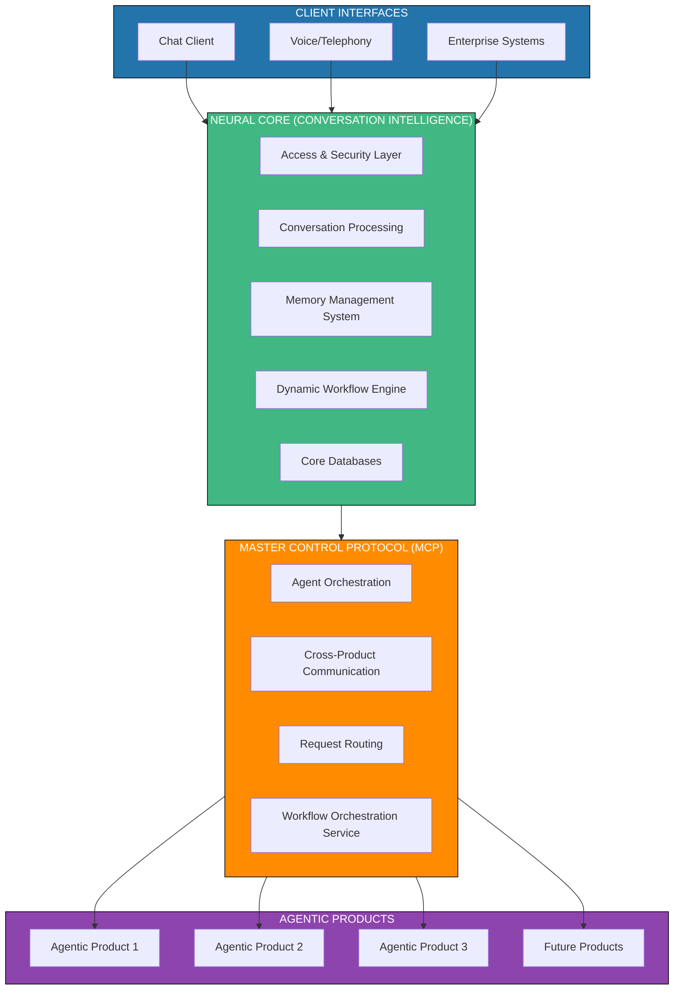

**3.2 Key Components**

The system consists of these primary components:

1.  **Neural Core Platform**: The foundation of the system, providing:

    -   Authentication and security
    -   Conversation processing
    -   Memory management
    -   User-specific semantic evolution
    -   Adaptive communication
    -   Multilingual support
    -   Empathetic response generation
    -   Dynamic workflow engine

2.  **Master Control Protocol (MCP)**: Orchestration layer responsible
    for:

    -   Agent discovery and registration
    -   Task planning and execution
    -   Message routing between agents
    -   Cross-product coordination
    -   Workflow orchestration service

3.  **Agentic Products**: Domain-specific extensions providing:

    -   Specialized agent capabilities
    -   Domain-specific knowledge
    -   Task execution frameworks
    -   Product-specific storage
    -   Workflow template repository

4.  **Database Architecture**: Multi-layered storage strategy for:

    -   User profiles and preferences
    -   Conversation history
    -   Semantic knowledge
    -   Memory management
    -   Linguistic resources
    -   Empathy engine data
    -   Workflow state database

**4. Neural Core Platform**

**4.1 User-Specific Semantic Evolution**

The User-Specific Semantic Evolution system builds and maintains
personalized semantic understanding for each user.

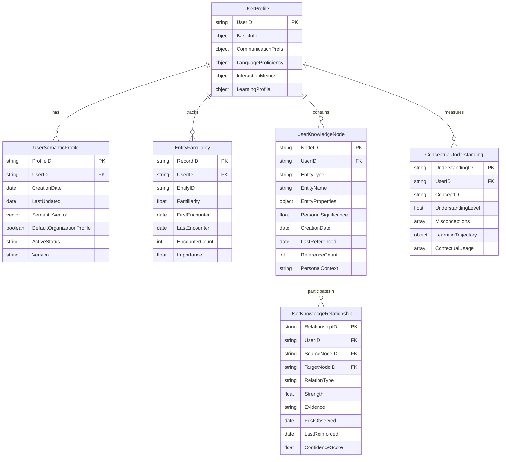

**4.2 Adaptive Communication**

The Adaptive Communication system adjusts communication style to match
user preferences and detected proficiency levels.

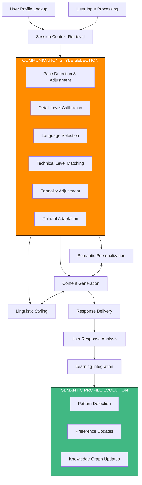

**4.3 Multilingual Support**

The Multilingual Support system enables natural interactions across
different languages with appropriate cultural nuances.

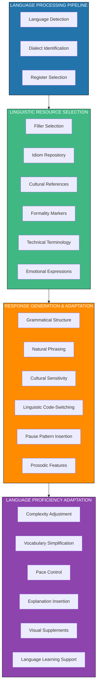

**4.4 Empathetic Response System**

The Empathetic Response System enables emotionally intelligent
interactions that recognize and respond appropriately to user emotions.

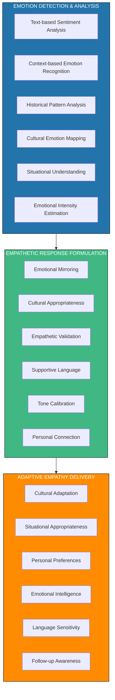

**4.5 Memory Management**

The Memory Management system maintains conversation context across
different time spans and interaction sessions.

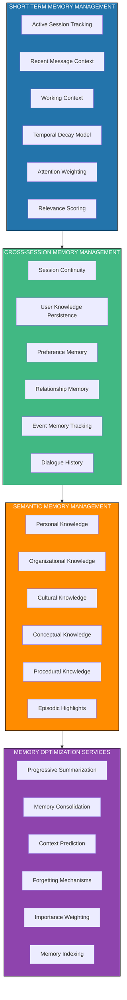

**4.6 Dynamic Workflow Engine**

The Dynamic Workflow Engine enables the orchestration of flexible,
adaptable processes based on conversation context and user needs.

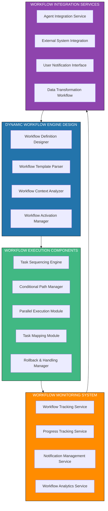

**Key Functional Characteristics:**

1.  **Workflow Definition Designer**:

    -   Visual workflow creation interface
    -   Drag-and-drop workflow components
    -   Conditional branching definition
    -   Parameter configuration
    -   Version control for workflow templates

2.  **Workflow Execution Components**:

    -   Task Sequencing Engine: Manages the order of task execution
    -   Conditional Path Manager: Determines execution paths based on conditions
    -   Parallel Execution Module: Handles concurrent task execution
    -   Task Mapping Module: Maps abstract tasks to concrete agent actions
    -   Rollback & Handling Manager: Manages failures and exceptions

3.  **Workflow Monitoring System**:

    -   Workflow Tracking Service: Monitors active workflows
    -   Progress Tracking Service: Tracks completion status
    -   Notification Management Service: Sends alerts and updates
    -   Workflow Analytics Service: Analyzes performance and patterns

4.  **Workflow Integration Services**:

    -   Agent Integration Service: Connects workflows to agents
    -   External System Integration: Links to external systems
    -   User Notification Interface: Communicates with users
    -   Data Transformation Workflow: Converts data between formats

**5. Master Control Protocol (MCP)**

**5.1 MCP Architecture**

The Master Control Protocol (MCP) provides the orchestration layer
between the Neural Core and Agentic Products.

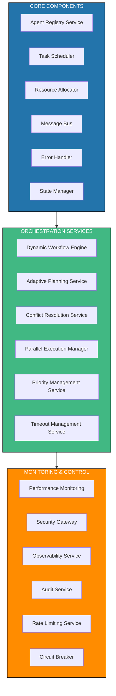

**5.2 Agent-to-Agent Communication**

The Agent-to-Agent (A2A) Communication architecture enables secure,
standardized communication between agents across products.

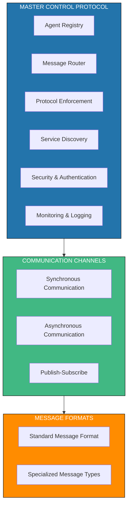

**5.3 Workflow Orchestration Service**

The Workflow Orchestration Service coordinates the execution of
workflows across agents and products.

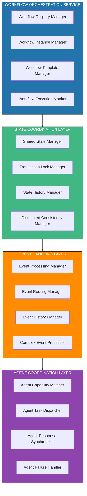

**Key Functional Characteristics:**

1.  **Workflow Orchestration Service**:

    -   Workflow Registry Manager: Maintains catalog of available workflows
    -   Workflow Instance Manager: Tracks active workflow instances
    -   Workflow Template Manager: Manages workflow templates and versions
    -   Workflow Execution Monitor: Monitors workflow execution status

2.  **State Coordination Layer**:

    -   Shared State Manager: Manages workflow state across components
    -   Transaction Lock Manager: Ensures data consistency during execution
    -   State History Manager: Maintains history of state changes
    -   Distributed Consistency Manager: Ensures state consistency across nodes

3.  **Event Handling Layer**:

    -   Event Processing Manager: Processes workflow events
    -   Event Routing Manager: Routes events to appropriate handlers
    -   Event History Manager: Maintains event history
    -   Complex Event Processor: Identifies patterns in event streams

4.  **Agent Coordination Layer**:

    -   Agent Capability Matcher: Matches tasks to agent capabilities
    -   Agent Task Dispatcher: Dispatches tasks to agents
    -   Agent Response Synchronizer: Synchronizes agent responses
    -   Agent Failure Handler: Handles agent failures and retries

**6. Agentic Products Architecture**

**6.1 Product Isolation**

Each Agentic Product operates in isolation with its own domain-specific
capabilities and databases.

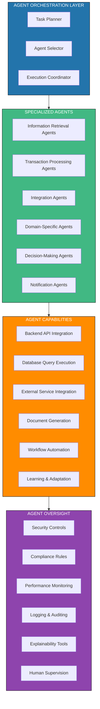

**6.2 Product Integration**

Each Agentic Product integrates with the Neural Core and other products
through standardized interfaces.

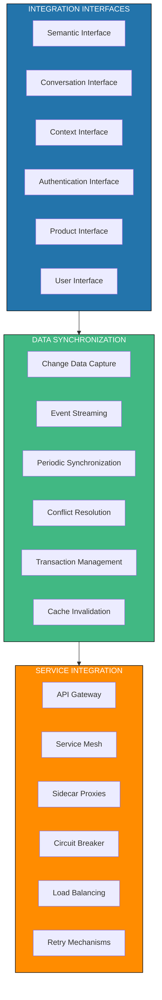

**6.3 Workflow Template Repository**

The Workflow Template Repository provides reusable workflow templates
for common business processes.

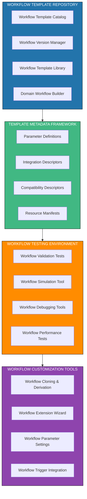

**Key Functional Characteristics:**

1.  **Workflow Template Repository**:

    -   Workflow Template Catalog: Indexed library of available templates
    -   Workflow Version Manager: Tracks template versions and changes
    -   Workflow Template Library: Stores template definitions
    -   Domain Workflow Builder: Creates domain-specific workflow templates

2.  **Template Metadata Framework**:

    -   Parameter Definitions: Defines configurable workflow parameters
    -   Integration Descriptors: Specifies integration requirements
    -   Compatibility Descriptors: Defines compatibility constraints
    -   Resource Manifests: Specifies resource requirements

3.  **Workflow Testing Environment**:

    -   Workflow Validation Tests: Verifies workflow correctness
    -   Workflow Simulation Tool: Simulates workflow execution
    -   Workflow Debugging Tools: Helps diagnose workflow issues
    -   Workflow Performance Tests: Measures workflow efficiency

4.  **Workflow Customization Tools**:

    -   Workflow Cloning & Derivation: Creates variations of templates
    -   Workflow Extension Wizard: Adds capabilities to workflows
    -   Workflow Parameter Settings: Configures workflow parameters
    -   Workflow Trigger Integration: Defines workflow activation triggers

**7. Database Architecture**

**7.1 Workflow State Database**

The Workflow State Database maintains the state of active and historical
workflows.

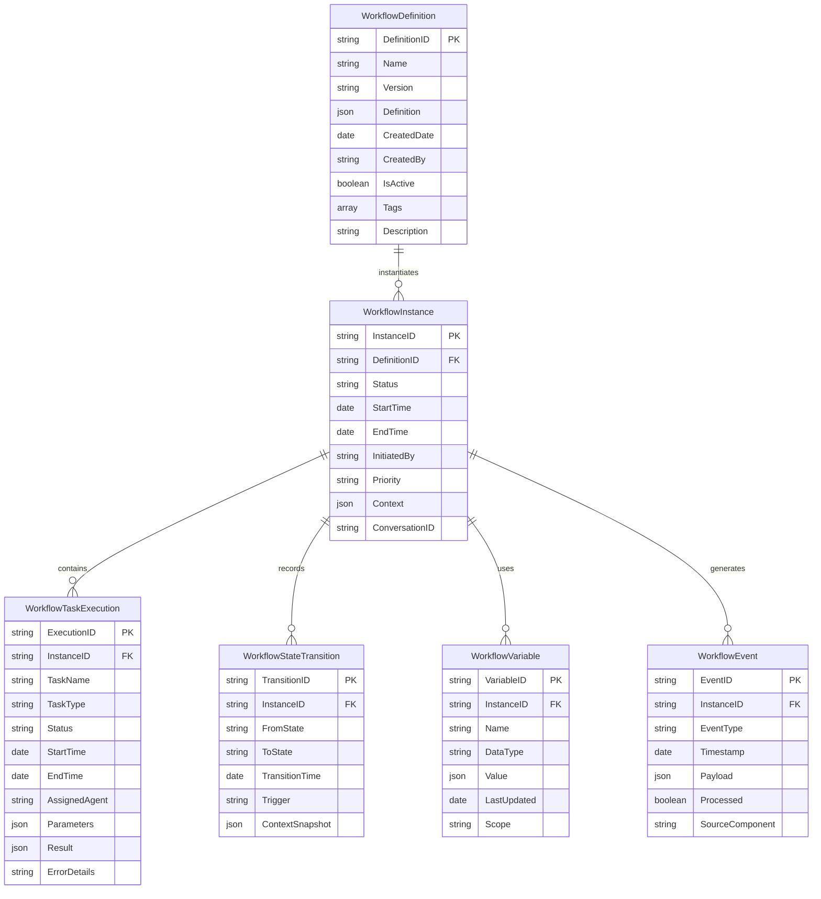

**Key Functional Characteristics:**

1.  **Workflow Definition**:

    -   Stores the blueprint for workflows
    -   Supports versioning for workflow evolution
    -   Includes metadata for discovery and management
    -   Maintains active/inactive status

2.  **Workflow Instance**:

    -   Represents a running or completed workflow
    -   Tracks overall status and execution times
    -   Maintains execution context
    -   Links to conversation context

3.  **Workflow Task Execution**:

    -   Records individual task executions
    -   Tracks task status, timing, and assignment
    -   Stores task parameters and results
    -   Captures error details for troubleshooting

4.  **Workflow State Transition**:

    -   Tracks workflow state changes
    -   Records transition triggers
    -   Maintains state history for auditing
    -   Captures context snapshots at transition points

5.  **Workflow Variable**:

    -   Stores workflow execution variables
    -   Supports different data types
    -   Tracks value changes over time
    -   Maintains variable scope information

6.  **Workflow Event**:

    -   Records significant workflow events
    -   Supports event-based integration
    -   Tracks event processing status
    -   Identifies event sources

**8. Key Functional Flows**

**8.1 Conversation Processing Flow**

The complete flow from user input to response generation.

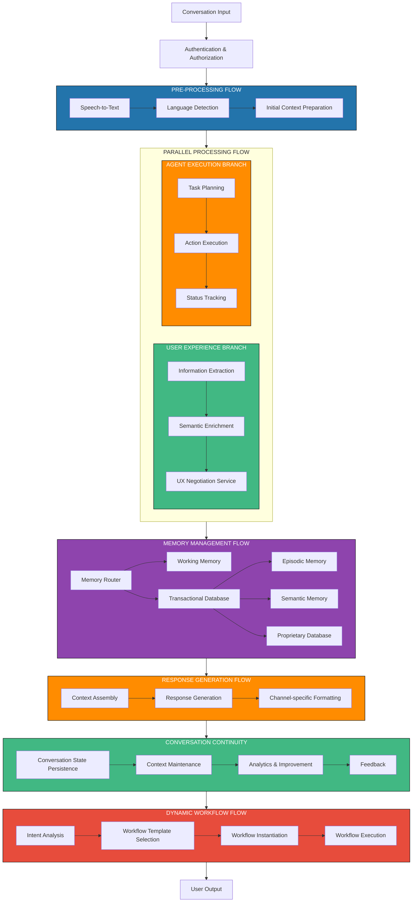

**8.2 User-Organization Semantic Fallback Flow**

The flow for determining when to use user-specific semantic data versus
organization defaults.

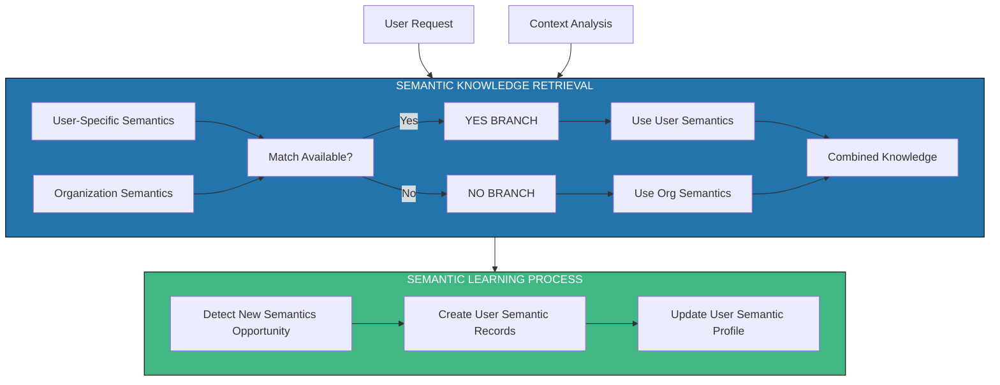

**8.3 Memory Management Flow**

The detailed flow for managing conversation memory across different time
spans.

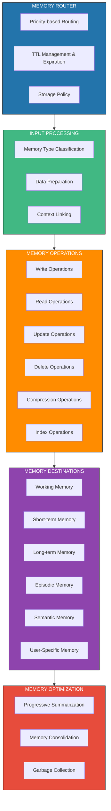

**8.4 Dynamic Workflow Execution Flow**

The flow for executing dynamic workflows based on conversation context
and user needs.

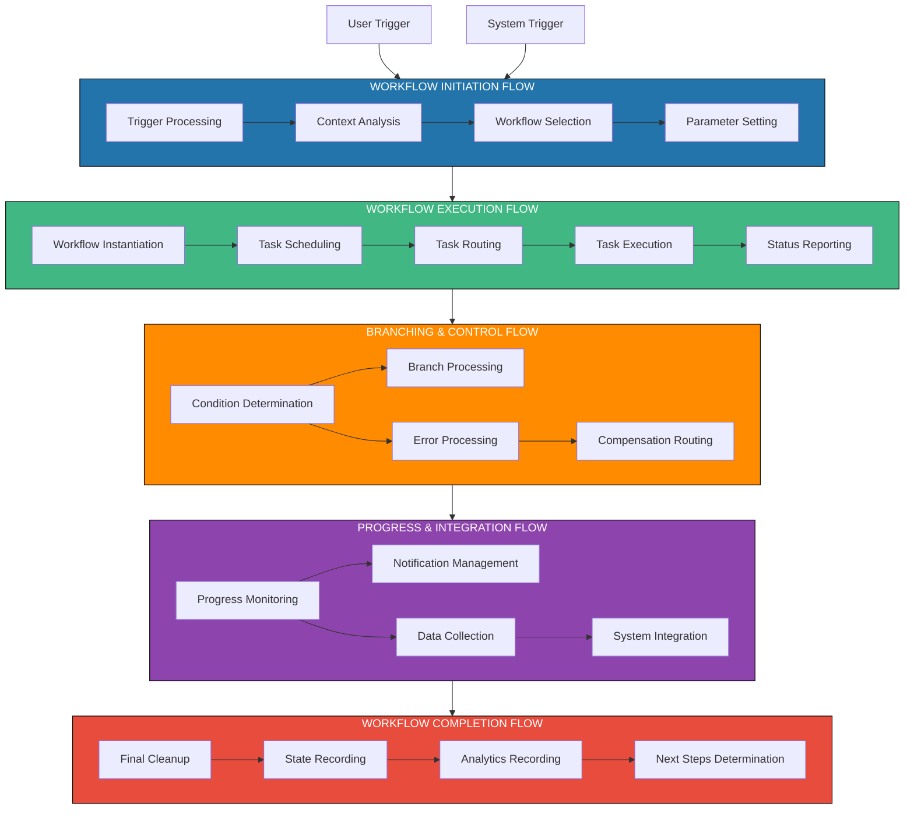

**Key Functional Characteristics:**

1.  **Workflow Initiation Flow**:

    -   Trigger Processing: Handles user and system workflow triggers
    -   Context Analysis: Analyzes conversation context for workflow selection
    -   Workflow Selection: Selects appropriate workflow templates
    -   Parameter Setting: Configures workflow parameters based on context

2.  **Workflow Execution Flow**:

    -   Workflow Instantiation: Creates workflow instances from templates
    -   Task Scheduling: Schedules tasks for execution
    -   Task Routing: Routes tasks to appropriate agents
    -   Task Execution: Executes individual workflow tasks
    -   Status Reporting: Reports task and workflow status

3.  **Branching & Control Flow**:

    -   Condition Determination: Evaluates conditions for branching
    -   Branch Processing: Manages workflow branches
    -   Error Processing: Handles workflow errors
    -   Compensation Routing: Manages compensating actions for failures

4.  **Progress & Integration Flow**:

    -   Progress Monitoring: Tracks workflow progress
    -   Notification Management: Manages notifications to users and systems
    -   Data Collection: Collects data from workflow execution
    -   System Integration: Integrates with external systems

5.  **Workflow Completion Flow**:

    -   Final Cleanup: Performs cleanup actions
    -   State Recording: Records final workflow state
    -   Analytics Recording: Captures workflow analytics
    -   Next Steps Determination: Identifies follow-up actions

**9. Integration Architecture**

The system integrates with external systems through well-defined
integration points.

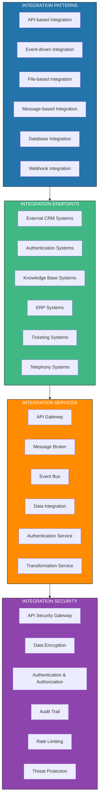

**10. Deployment Architecture**

The system supports multiple deployment models across cloud and
on-premises environments.

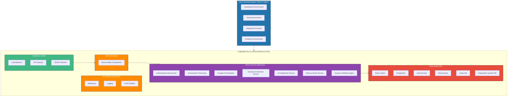

**11. Testing Architecture**

The system includes a comprehensive testing framework to ensure quality
and performance.

```mermaid
flowchart TD

subgraph UT["UNIT TESTING"]
  ST[Service Tests]
  CT[Component Tests]
  UFT[Utility Function Tests]
end

UT --> IT

subgraph IT["INTEGRATION TESTING"]
  APT[API Tests]
  SIT[Service Integration Tests]
  DIT[Database Integration Tests]
  WFT[Workflow Integration Tests]
end

IT --> E2E

subgraph E2E["E2E TESTING"]
  CS[Conversation Scenarios]
  UFT2[User Flow Tests]
  CIT[Chat/Voice Interface Tests]
  WET[Workflow E2E Tests]
end

E2E --> PT

subgraph PT["PERFORMANCE TESTING"]
  LT[Load Tests]
  ST2[Stress Tests]
  SCT[Scalability Tests]
  WPT[Workflow Performance Tests]
end

PT --> SPT

subgraph SPT["SPECIALIZED TESTING"]
  SET[Security Tests]
  COT[Compliance Tests]
  FTT[Fault Tolerance Tests]
  WVT[Workflow Validation Tests]
end

SPT --> CICD

subgraph CICD["CI/CD PIPELINE"]
  BV[Build & Validation]
  ATS[Automated Test Suite]
  DT[Deployment Tests]
end

classDef blue fill:#2374ab,stroke:#000,stroke-width:1px,color:#fff
classDef green fill:#41b883,stroke:#000,stroke-width:1px,color:#fff
classDef orange fill:#ff8c00,stroke:#000,stroke-width:1px,color:#fff
classDef purple fill:#8e44ad,stroke:#000,stroke-width:1px,color:#fff
classDef red fill:#e74c3c,stroke:#000,stroke-width:1px,color:#fff
classDef yellow fill:#f1c40f,stroke:#000,stroke-width:1px,color:#fff

class UT blue
class IT green
class E2E orange
class PT purple
class SPT red
class CICD yellow
```

**12. Implementation Roadmap**

The implementation roadmap outlines the phases for building and
deploying the system.

```mermaid
gantt
  title Implementation Roadmap
  dateFormat YYYY-MM-DD
  
  section Neural Core Foundation
  Authentication and security services :a1, 2025-06-01, 30d
  Basic conversation processing        :a2, after a1, 30d
  Initial memory management            :a3, after a2, 30d
  Database foundation                  :a4, 2025-06-15, 45d
  Core API interfaces                  :a5, after a3, 30d
  
  section Semantic Enhancement
  User-specific semantic evolution     :b1, after a5, 30d
  Adaptive communication               :b2, after b1, 30d
  Organization semantic framework      :b3, after a4, 30d
  Initial multilingual support         :b4, after b2, 30d
  Empathetic response foundation       :b5, after b3, 30d
  
  section Master Control Protocol
  Agent registry                       :c1, after a5, 30d
  Task orchestration                   :c2, after c1, 30d
  Message routing                      :c3, after c2, 20d
  Resource allocation                  :c4, after c3, 20d
  Monitoring and logging               :c5, after c4, 20d
  
  section Dynamic Workflow Implementation
  Workflow engine foundation           :d1, after b5, 30d
  Workflow template designer           :d2, after d1, 30d
  Workflow execution components        :d3, after d2, 30d
  Workflow state database              :d4, after d3, 20d
  Workflow integration services        :d5, after d4, 30d
  
  section First Agentic Product
  Product architecture foundation      :e1, after c5, 30d
  Domain-specific knowledge integration:e2, after e1, 30d
  Agent implementation                 :e3, after e2, 30d
  Product database setup               :e4, after e3, 20d
  Product integration with Neural Core :e5, after e4, 30d
  
  section Advanced Capabilities
  Enhanced multilingual support        :f1, after b4, 30d
  Advanced empathetic responses        :f2, after b5, 30d
  Improved semantic evolution          :f3, after f1, 30d
  Enhanced memory management           :f4, after f2, 30d
  Cross-product agent collaboration    :f5, after e5, 30d
  
  section Scale and Performance
  Performance optimization             :g1, after f5, 30d
  Horizontal scaling                   :g2, after g1, 20d
  Fault tolerance enhancements         :g3, after g2, 20d
  Advanced monitoring                  :g4, after g3, 20d
  Production readiness                 :g5, after g4, 30d
  
  section Additional Products
  Second agentic product               :h1, after g5, 60d
  Third agentic product                :h2, after h1, 60d
  Enhanced cross-product coordination  :h3, after h2, 30d
  Advanced agent capabilities          :h4, after h3, 30d
  User experience refinement           :h5, after h4, 30d
```

**13. Conclusion**

The enhanced Neural Core Platform with Agentic AI Products provides a
comprehensive architecture for building an intelligent conversation
system with advanced capabilities and dynamic workflow orchestration.
The modular design separates core conversation intelligence from
domain-specific agent functionality, allowing for independent scaling
and evolution.

Key architectural advantages include:

1.  **User-Centric Design**: The system adapts to individual users
    through semantic evolution, communication style adjustment, and
    personalized memory.

2.  **Extensibility**: New Agentic Products can be added without
    modifying the Neural Core, enabling domain-specific extension.

3.  **Dynamic Workflow Capabilities**: The workflow engine enables
    complex business processes to be automated and adapted in real-time
    based on conversation context.

4.  **Scalability**: Components can scale independently based on demand,
    with stateless services for horizontal scaling.

5.  **Multi-Channel Support**: The architecture supports both chat and
    telephony interfaces with channel-specific optimizations.

6.  **Comprehensive Memory**: The multi-tiered memory architecture
    ensures context is maintained across sessions and over time.

7.  **Enterprise Integration**: Well-defined integration points enable
    connectivity with existing enterprise systems.

8.  **Deployment Flexibility**: Support for cloud-native, hybrid, and
    on-premises deployment models.

This enhanced architecture provides the foundation for building a
robust, adaptable, and intelligent conversation platform that can evolve
with user needs, automate complex workflows, and integrate seamlessly
with organizational systems.
