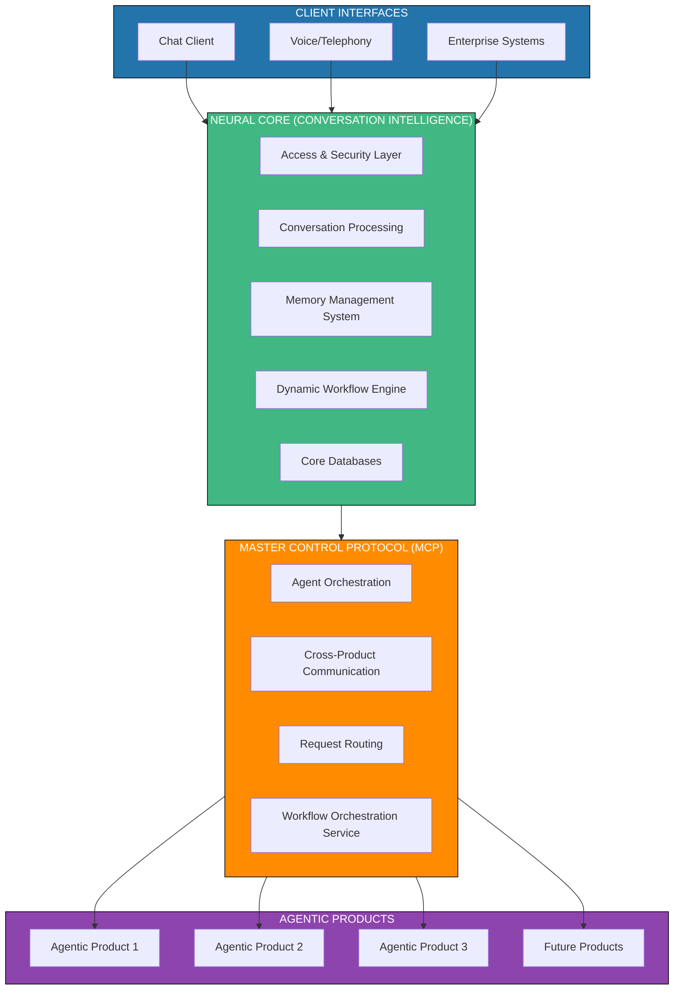

# docs_prod

**Functional Architecture Design Document**

**Version:** 1.0.1  
**Date:** May 7, 2025

**Table of Contents**

1.  [Executive Summary](#1-executive-summary)
2.  [Introduction](#2-introduction)
3.  [System Overview](#3-system-overview)
    -   3.1 [High-Level Architecture](#31-high-level-architecture)
    -   3.2 [Key Components](#32-key-components)
4.  [Neural Core Platform](#4-neural-core-platform)
    -   4.1 [User-Specific Semantic Evolution](#41-user-specific-semantic-evolution)
    -   4.2 [Adaptive Communication](#42-adaptive-communication)
    -   4.3 [Multilingual Support](#43-multilingual-support)
    -   4.4 [Empathetic Response System](#44-empathetic-response-system)
    -   4.5 [Memory Management](#45-memory-management)
    -   4.6 [Dynamic Workflow Engine](#46-dynamic-workflow-engine)
5.  [Master Control Protocol (MCP)](#5-master-control-protocol-mcp)
    -   5.1 [MCP Architecture](#51-mcp-architecture)
    -   5.2 [Agent-to-Agent Communication](#52-agent-to-agent-communication)
    -   5.3 [Workflow Orchestration Service](#53-workflow-orchestration-service)
6.  [Agentic Products Architecture](#6-agentic-products-architecture)
    -   6.1 [Product Isolation](#61-product-isolation)
    -   6.2 [Product Integration](#62-product-integration)
    -   6.3 [Workflow Template Repository](#63-workflow-template-repository)
7.  [Database Architecture](#7-database-architecture)
    -   7.1 [Workflow State Database](#71-workflow-state-database)
8.  [Key Functional Flows](#8-key-functional-flows)
    -   8.1 [Conversation Processing Flow](#81-conversation-processing-flow)
    -   8.2 [User-Organization Semantic Fallback Flow](#82-user-organization-semantic-fallback-flow)
    -   8.3 [Memory Management Flow](#83-memory-management-flow)
    -   8.4 [Dynamic Workflow Execution Flow](#84-dynamic-workflow-execution-flow)
9.  [Integration Architecture](#9-integration-architecture)
10. [Deployment Architecture](#10-deployment-architecture)
11. [Testing Architecture](#11-testing-architecture)
12. [Implementation Roadmap](#12-implementation-roadmap)
13. [Conclusion](#13-conclusion)

**1. Executive Summary**

This Functional Architecture Design Document details the comprehensive
design for a Neural Core Platform with extensible Agentic AI Products.
The system is designed as a modular, scalable platform that enables
conversation intelligence with advanced capabilities, including
user-specific semantic evolution, adaptive communication, multilingual
support, empathetic responses, robust memory management, and dynamic
workflow orchestration.

The architecture separates core conversation capabilities (Neural Core)
from specialized domain functionality (Agentic Products), connected
through a Master Control Protocol (MCP) that facilitates orchestration
and Agent-to-Agent (A2A) communication. This separation allows for
independent development, deployment, and scaling of components while
maintaining a cohesive user experience.

The enhanced design introduces a dynamic workflow engine that enables
the system to orchestrate complex processes across agents, adapting to
changing conditions and user needs in real-time. This allows for
sophisticated automated workflows that can be triggered by conversation
intents or system events.

The system is designed to provide personalized interactions that adapt
to individual users while maintaining organizational knowledge
boundaries and privacy requirements. The platform supports multiple
deployment configurations across cloud-native, hybrid, and on-premises
environments.

**3. System Overview**

**3.1 High-Level Architecture**

The system consists of three primary layers: Client Interfaces, Neural
Core Platform, and Agentic Products, connected through a Master Control
Protocol.

**3.2 Key Components**

The system consists of these primary components:

1.  **Neural Core Platform**: The foundation of the system, providing:

    -   Authentication and security
    -   Conversation processing
    -   Memory management
    -   User-specific semantic evolution
    -   Adaptive communication
    -   Multilingual support
    -   Empathetic response generation
    -   Dynamic workflow engine

2.  **Master Control Protocol (MCP)**: Orchestration layer responsible
    for:

    -   Agent discovery and registration
    -   Task planning and execution
    -   Message routing between agents
    -   Cross-product coordination
    -   Workflow orchestration service

3.  **Agentic Products**: Domain-specific extensions providing:

    -   Specialized agent capabilities
    -   Domain-specific knowledge
    -   Task execution frameworks
    -   Product-specific storage
    -   Workflow template repository

4.  **Database Architecture**: Multi-layered storage strategy for:

    -   User profiles and preferences
    -   Conversation history
    -   Semantic knowledge
    -   Memory management
    -   Linguistic resources
    -   Empathy engin
