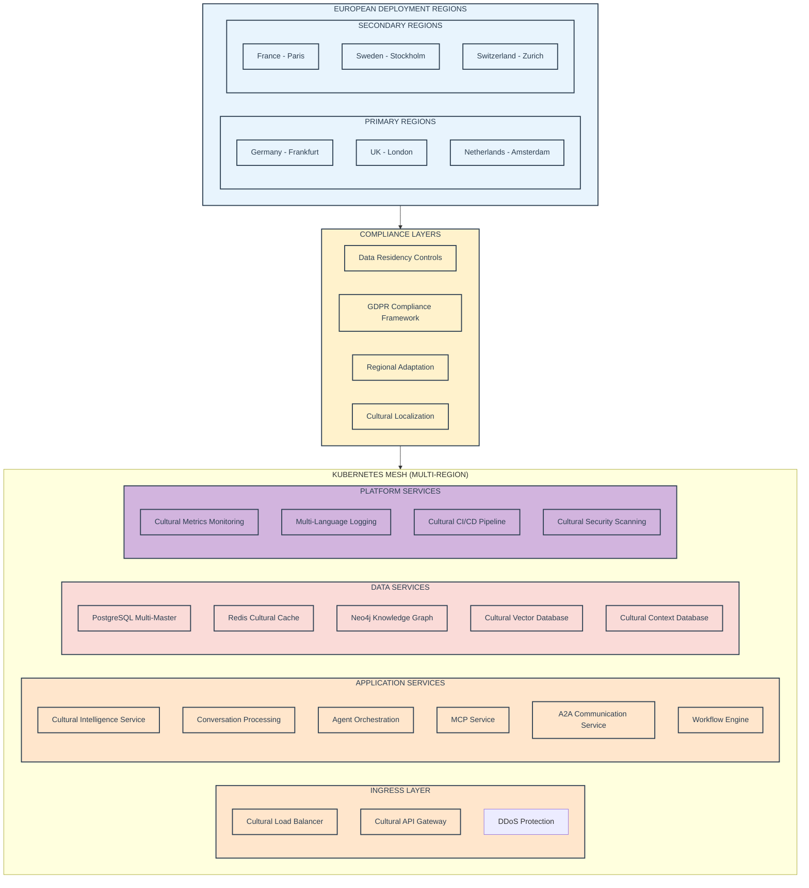
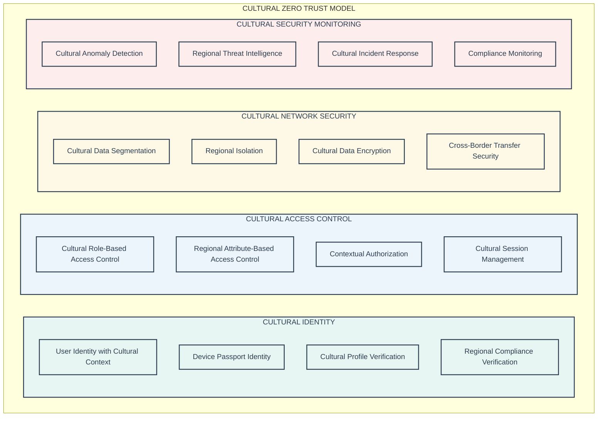

<artifacts>
<artifact identifier="me-ai-tdd-year1-v16" type="text/markdown" title="ME.AI Technical Design Document - Year 1 v16">
# ME.AI Technical Stack and Architecture - Year 1 v16

**Version:** 2.0.0  
**Date:** January 2025  
**Architecture Alignment:** ME.AI Neural Core Platform Architecture v16

## Table of Contents

1. [Introduction](#1-introduction)
   - 1.1 [Purpose](#11-purpose)
   - 1.2 [Year 1 Scope Summary](#12-year-1-scope-summary)
   - 1.3 [v16 System of Context Philosophy](#13-v16-system-of-context-philosophy)
2. [Guiding Architectural Principles for Year 1](#2-guiding-architectural-principles-for-year-1)
3. [Year 1 Core Platform Architecture](#3-year-1-core-platform-architecture)
   - 3.1 [Four-Pillar Architecture Foundation](#31-four-pillar-architecture-foundation)
   - 3.2 [Key Core Platform Components](#32-key-core-platform-components)
   - 3.3 [Core Platform Technical Stack](#33-core-platform-technical-stack)
   - 3.4 [Core Platform Data Management](#34-core-platform-data-management)
4. [Year 1 IT Support Product Architecture](#4-year-1-it-support-product-architecture)
   - 4.1 [High-Level IT Support Product Architecture](#41-high-level-it-support-product-architecture)
   - 4.2 [Key IT Support Product Modules](#42-key-it-support-product-modules)
   - 4.3 [Interaction with Core Platform](#43-interaction-with-core-platform)
   - 4.4 [IT Support Product Technical Stack](#44-it-support-product-technical-stack)
5. [Overall Year 1 System Architecture](#5-overall-year-1-system-architecture)
6. [Deployment Architecture](#6-deployment-architecture)
7. [Security Architecture](#7-security-architecture)
8. [European Market Readiness Implementation](#8-european-market-readiness-implementation)

## 1. Introduction

### 1.1 Purpose

This document outlines the technical stack and architecture for Year 1 of the ME.AI v16 platform. It incorporates the comprehensive **System of Context** philosophy and **Four Strategic Pillars** while focusing on the foundational Core Platform and the IT Support product as defined by the MVP scope and business value analysis.

The v16 architecture transforms traditional reactive IT support into an intelligent, empathetic, culturally-aware platform that builds understanding across every interaction while delivering tangible business value within the first year.

### 1.2 Year 1 Scope Summary

Based on the implementation strategy, Year 1 scope prioritizes:

**Four Strategic Pillars Implementation:**
- **Omni-Channel Universal Interface**: Multi-channel support with Device Passport authentication
- **Multi-Lingual Support Platform**: Cultural intelligence and 12+ language support
- **Neural Core**: Conversational intelligence with cross-session context preservation
- **Agentic AI Orchestration**: Model Context Protocol (MCP) and Agent-to-Agent (A2A) communication

**IT Support Product:** High-value automation for:
- Password resets (90% automation target - 13,950 annual incidents)
- Account unlocks (95% automation target - 7,790 annual incidents)
- Basic software installation (30% automation target - 2,220 annual incidents)
- Device diagnostics (20% automation target - 2,520 annual incidents)

**European Market Focus:** GDPR compliance, cultural adaptation, and data residency requirements.

### 1.3 v16 System of Context Philosophy

The ME.AI v16 platform operates as a **System of Context** where every interaction contributes to growing understanding:

**Context Accumulation**: Every user interaction, device authentication, and cultural preference adds layers of understanding that improve future interactions.

**Context Preservation**: Through the Model Context Protocol, contextual understanding persists across sessions, channels, and agent interactions.

**Context Distribution**: Agent-to-Agent communication ensures relevant context reaches every component without losing the human element.

**Cultural Context Intelligence**: Understanding that enterprises operate across cultures, the platform preserves linguistic differences, cultural communication styles, and regional compliance requirements.

## 2. Guiding Architectural Principles for Year 1

**System of Context Principles:**
- **Context-First Design**: Every component accumulates and preserves contextual understanding
- **Cultural Intelligence Integration**: Cultural awareness built into every interaction layer
- **Cross-Session Continuity**: User experience that builds understanding over time
- **Agent Collaboration**: AI agents work together through shared context protocols

**Technical Principles:**
- **Modularity and Decoupling**: Clear interfaces enabling independent development and cultural adaptation
- **Iterative Development**: Strong foundation with incremental cultural intelligence complexity
- **Pragmatic Cultural Intelligence**: Proven technologies enhanced with cultural awareness where they meet requirements
- **European-First Compliance**: GDPR and regional requirements built in from the ground up
- **Scalability Through Context**: Design for horizontal scaling while preserving contextual relationships
- **Security by Cultural Design**: Cultural sensitivity and security considerations in every architectural layer
- **Observability with Cultural Metrics**: Comprehensive monitoring including cultural adaptation effectiveness

## 3. Year 1 Core Platform Architecture

### 3.1 Four-Pillar Architecture Foundation

```mermaid
flowchart TD
    subgraph OC["OMNI-CHANNEL UNIVERSAL INTERFACE"]
        ChatWeb[Web Chat Client]
        ChatMobile[Mobile Chat Client]
        MSTeams[MS Teams Integration]
        Voice[Voice Interface]
        DevicePassport[Device Passport System]
        UniversalAccess[Universal Accessibility]
    end
    
    subgraph ML["MULTI-LINGUAL SUPPORT PLATFORM"]
        Languages[🇩🇪🇰🇷🇧🇪🇨🇳🇫🇷🇬🇧🇳🇱🇩🇰🇪🇸🇮🇹]
        CulturalIntel[Cultural Intelligence Engine]
        LanguageLocal[Language Localization]
        RegionalCompliance[Regional Compliance]
        CulturalContext[Cultural Context Adaptation]
    end
    
    subgraph NC["NEURAL CORE"]
        ConvIntel[Conversational Intelligence]
        ContextMgmt[Cross-Session Context Management]
        UserSemantics[User Semantic Evolution]
        KnowledgeAug[Knowledge Augmentation]
        ServiceOntology[Service Ontology]
        EmpathyEngine[Empathy & Adaptation Engine]
    end
    
    subgraph AAO["AGENTIC AI ORCHESTRATION"]
        MCP[Model Context Protocol - MCP]
        A2A[Agent-to-Agent Communication]
        CoalitionForm[Dynamic Coalition Formation]
        WorkflowEngine[ME.SLAM Workflow Engine]
        MEITAgents[ME.IT Agents]
        MEOperator[ME.aiOperator Agent]
    end
    
    OC <--> ML
    ML <--> NC
    NC <--> AAO
    OC <--> AAO
    
    classDef omnichannelStyle fill:#E8F4FD,stroke:#2C3E50,stroke-width:2px,color:#2C3E50
    classDef multilingualStyle fill:#FFF2CC,stroke:#2C3E50,stroke-width:2px,color:#2C3E50
    classDef neuralcoreStyle fill:#FFE6CC,stroke:#2C3E50,stroke-width:2px,color:#2C3E50
    classDef agenticStyle fill:#E1D5E7,stroke:#2C3E50,stroke-width:2px,color:#2C3E50
    
    class OC,ChatWeb,ChatMobile,MSTeams,Voice,DevicePassport,UniversalAccess omnichannelStyle
    class ML,Languages,CulturalIntel,LanguageLocal,RegionalCompliance,CulturalContext multilingualStyle
    class NC,ConvIntel,ContextMgmt,UserSemantics,KnowledgeAug,ServiceOntology,EmpathyEngine neuralcoreStyle
    class AAO,MCP,A2A,CoalitionForm,WorkflowEngine,MEITAgents,MEOperator agenticStyle
```

### 3.2 Key Core Platform Components

#### 3.2.1 Omni-Channel Universal Interface (Year 1)

**Device Passport System (Enhanced in v16)**:
- **Zero Trust Device Authentication**: Continuous verification with cultural context
- **Device Capability Profiling**: Understanding device constraints for cultural adaptation
- **Cultural Security Context**: Device-level cultural preferences and compliance requirements
- **Cross-Session Device Memory**: Device-specific context preservation across sessions

**Multi-Channel Adaptation**:
- **Channel-Specific Cultural Adaptation**: Different cultural norms for chat vs. voice vs. Teams
- **Universal Accessibility with Cultural Awareness**: Screen reader support with cultural context
- **Progressive Enhancement**: Cultural intelligence that adapts to channel capabilities

#### 3.2.2 Multi-Lingual Support Platform (NEW in v16)

**Cultural Intelligence Engine**:
- **Cultural Context Detection**: Automatic detection of cultural background and preferences
- **Cultural Adaptation Rules**: Dynamic adaptation of communication style based on cultural norms
- **Regional Compliance Integration**: Cultural adaptation within GDPR and regional requirements
- **Cultural Learning Loop**: Continuous improvement of cultural understanding through interactions

**Language Localization Framework**:
- **Real-Time Translation**: Context-aware translation preserving cultural nuances
- **Cultural Idiom Handling**: Proper handling of cultural expressions and business etiquette
- **Formal/Informal Adaptation**: Cultural-appropriate formality level adjustment
- **Multi-Language Knowledge Base**: IT support content in cultural context for each language

#### 3.2.3 Neural Core (Enhanced for v16)

**Cross-Session Context Management**:
- **Context Accumulation Engine**: Building understanding across all user interactions
- **Semantic Negotiation**: Dynamic adaptation between user and organizational semantics
- **Cultural Context Preservation**: Maintaining cultural preferences and adaptations across sessions
- **Empathetic Response Evolution**: Learning and improving empathetic responses over time

**Conversational Intelligence (Enhanced)**:
- **Cultural Intent Recognition**: Understanding intent within cultural context
- **Empathetic Entity Extraction**: Extracting entities while maintaining cultural sensitivity
- **Cultural Sentiment Analysis**: Sentiment analysis adapted for cultural communication patterns
- **Contextual Dialogue Management**: State-based dialogue flow with cultural awareness

#### 3.2.4 Agentic AI Orchestration (NEW in v16)

**Model Context Protocol (MCP)**:
- **Context Sharing Standard**: Seamless context sharing across all agents and components
- **Context Versioning**: Maintaining context history for rollback and analysis
- **Context Security**: Secure context sharing with cultural sensitivity protection
- **Context Synchronization**: Real-time context updates across distributed agents

**Agent-to-Agent Communication (A2A)**:
- **Dynamic Coalition Formation**: Agents forming temporary coalitions for complex tasks
- **Trust and Reputation System**: Agent collaboration based on performance and cultural competency
- **Cultural Capability Matching**: Selecting agents based on cultural and technical capabilities
- **Collaborative Problem Solving**: Multi-agent solutions with cultural context preservation

### 3.3 Core Platform Technical Stack (Year 1)

| Category | Technologies (v16 Enhanced) | Cultural Intelligence Notes |
|----------|----------------------------|----------------------------|
| **Frontend** | React 18, TypeScript 5.x, HTML5, CSS3, PWA | Multi-language UI framework with cultural adaptation |
| **Backend Services** | Python 3.11+ (FastAPI), Node.js 20+ (Express) | Cultural intelligence libraries integrated |
| **Cultural Intelligence** | spaCy, Hugging Face Transformers, Cultural ML Models | Custom cultural adaptation models |
| **Containerization** | Docker, Kubernetes (1.28+) | Multi-region deployment for cultural compliance |
| **API Gateway** | Kong, NGINX Plus, AWS API Gateway | Cultural request routing and adaptation |
| **MCP Implementation** | Custom Python/TypeScript MCP SDK | Context protocol for cultural intelligence |
| **NLU/NLP** | Hugging Face Transformers, spaCy, Cultural NLP Models | Fine-tuned for cultural context and IT domain |
| **Workflow Engine** | Temporal.io, Camunda (Cloud), Custom ME.SLAM | Cultural workflow adaptation capabilities |
| **Databases** | | |
| - Relational | PostgreSQL 15+ (with cultural extensions) | User profiles, workflow state, cultural data |
| - Key-Value/Cache | Redis 7+ (with cultural clustering) | Session management, cultural context caching |
| - Vector | Weaviate, Pinecone, pgvector | Cultural and semantic embeddings |
| - Knowledge Graph | Neo4j 5.x, Amazon Neptune | Cultural knowledge and organizational relationships |
| - Cultural Context | PostgreSQL + Custom Cultural Schema | Cultural intelligence data and relationships |
| **Messaging Bus** | Apache Kafka, RabbitMQ, AWS SQS/SNS | A2A communication with cultural context |
| **Service Mesh** | Istio 1.19+ (Release 2/3) | mTLS, cultural routing, observability |
| **Observability** | Prometheus, Grafana, ELK Stack, OpenTelemetry | Cultural intelligence metrics included |
| **Security** | OAuth 2.0/OIDC (Keycloak), JWT, HashiCorp Vault | Cultural-aware security policies |
| **CI/CD** | Jenkins, GitLab CI, GitHub Actions | Multi-region cultural compliance deployment |

### 3.4 Core Platform Data Management (Year 1)

**Enhanced Database Architecture with Cultural Intelligence:**

**Cultural Context Database (NEW)**:
- **Cultural Profile Store**: User and organizational cultural preferences and adaptations
- **Cultural Knowledge Graph**: Relationships between cultural concepts, norms, and business practices
- **Language Localization Data**: Translation rules, cultural idioms, and regional adaptations
- **Cultural Compliance Mapping**: GDPR and regional requirements with cultural considerations

**User Semantic Profile Database (Enhanced)**:
- **Cross-Session Context**: Accumulated understanding across all user interactions
- **Cultural Adaptation History**: How cultural preferences have evolved over time
- **Semantic Evolution Tracking**: How user's technical understanding develops with cultural context
- **Empathetic Response Learning**: What communication styles work best for each user

**Conversation Memory Database (Enhanced)**:
- **Cultural Interaction History**: How cultural adaptations performed in past conversations
- **Cross-Channel Context**: Context preservation across chat, voice, Teams, mobile
- **Empathetic Context Memory**: Emotional and cultural context from previous interactions
- **Problem-Solving Context**: Incomplete issues and their cultural context preservation

**Device Passport Database (Enhanced)**:
- **Cultural Device Preferences**: Device-specific cultural settings and adaptations
- **Regional Compliance Status**: Device compliance with regional cultural and legal requirements
- **Cultural Security Context**: Cultural-aware security policies and authentication methods
- **Cross-Session Device Context**: Device behavior patterns with cultural considerations

## 4. Year 1 IT Support Product Architecture

### 4.1 High-Level IT Support Product Architecture (Year 1)

```mermaid
flowchart TD
    subgraph ITSP["IT SUPPORT PRODUCT v16"]
        subgraph API["IT SUPPORT API LAYER"]
            ITSP_API[Cultural IT Support API]
            CulturalRoute[Cultural Request Routing]
            ComplianceGate[Compliance Gateway]
        end
        
        subgraph MODULES["IT SUPPORT MODULES"]
            PasswordReset[Password Reset Module]
            AccountUnlock[Account Unlock Module]
            SWInstall[Software Installation Module]
            DeviceDiag[Device Diagnostics Module]
            NetworkTrouble[Network Troubleshooting Module]
        end
        
        subgraph CULTURAL["CULTURAL ADAPTATION LAYER"]
            CulturalAgent[Cultural Context Agent]
            LanguageAdapt[Language Adaptation Service]
            ComplianceAdapt[Compliance Adaptation Service]
            EtiquetteEngine[Business Etiquette Engine]
        end
        
        subgraph WORKFLOW["WORKFLOW ORCHESTRATION"]
            MCPWorkflow[MCP-Enhanced Workflows]
            A2ACoordination[A2A Agent Coordination]
            ContextPreservation[Context Preservation Service]
            CoalitionMgmt[Coalition Management]
        end
    end
    
    subgraph CORE["CORE PLATFORM INTEGRATION"]
        NeuralCore[Neural Core]
        DevicePassport[Device Passport System]
        CulturalDB[Cultural Context Database]
        MCPProtocol[Model Context Protocol]
    end
    
    API --> MODULES
    MODULES --> CULTURAL
    CULTURAL --> WORKFLOW
    WORKFLOW --> CORE
    
    classDef itsp fill:#A9DFBF,stroke:#2C3E50,stroke-width:2px,color:#2C3E50
    classDef cultural fill:#F9E79F,stroke:#2C3E50,stroke-width:2px,color:#2C3E50
    classDef core fill:#AED6F1,stroke:#2C3E50,stroke-width:2px,color:#2C3E50
    
    class ITSP,API,MODULES,WORKFLOW itsp
    class CULTURAL,CulturalAgent,LanguageAdapt,ComplianceAdapt,EtiquetteEngine cultural
    class CORE,NeuralCore,DevicePassport,CulturalDB,MCPProtocol core
```

### 4.2 Key IT Support Product Modules (Year 1)

#### 4.2.1 Password Reset Module (Enhanced for v16)

**Cultural Intelligence Integration**:
- **Cultural Security Verification**: Adapting security questions and verification methods to cultural norms
- **Cultural Communication Patterns**: Password reset guidance adapted to cultural communication styles
- **Regional Compliance Integration**: GDPR and regional privacy requirements for password reset flows
- **Cross-Session Context**: Remembering user preferences and successful patterns from previous resets

**Enhanced Capabilities**:
- **Multi-Language Support**: Password reset instructions in user's preferred language with cultural context
- **Cultural Security Adaptation**: Security verification methods that respect cultural privacy expectations
- **Empathetic Error Handling**: Culturally-appropriate error messages and guidance
- **Device Passport Integration**: Device-specific security requirements with cultural considerations

#### 4.2.2 Account Unlock Module (Enhanced for v16)

**Cultural Security Framework**:
- **Cultural Identity Verification**: Identity verification methods adapted to cultural norms and expectations
- **Regional Privacy Compliance**: Account unlock processes that meet regional privacy and security requirements
- **Cultural Communication Security**: Security communications that maintain cultural appropriateness
- **Cross-Cultural Device Trust**: Device trust assessment with cultural sensitivity considerations

#### 4.2.3 Software Installation Module (Enhanced for v16)

**Cultural Software Guidance**:
- **Cultural Installation Preferences**: Software installation guidance adapted to cultural technical communication styles
- **Multi-Language Installation Support**: Installation instructions and guidance in culturally-appropriate language
- **Regional Software Compliance**: Software installation compliance with regional regulations and cultural expectations
- **Cultural Knowledge Integration**: Software recommendations that consider cultural and regional preferences

#### 4.2.4 Device Diagnostics Module (Enhanced for v16)

**Cultural Diagnostic Framework**:
- **Cultural Permission Requests**: Diagnostic permission requests that respect cultural privacy expectations
- **Cultural Results Communication**: Diagnostic results presented in culturally-appropriate manner
- **Regional Compliance Diagnostics**: Device diagnostics that comply with regional privacy and security requirements
- **Cultural Technical Guidance**: Technical guidance and recommendations adapted to cultural communication styles

### 4.3 Interaction with Core Platform

**Enhanced Integration Patterns (v16)**:

**Model Context Protocol Integration**:
- **Seamless Context Flow**: IT Support modules receive full user context through MCP
- **Cultural Context Preservation**: Cultural preferences and adaptations flow seamlessly through MCP
- **Cross-Session IT Context**: IT support context preserved and enhanced across multiple sessions
- **Agent Coalition Context**: IT agents receive context from coalition formation and collaboration

**Cultural Intelligence Integration**:
- **Dynamic Cultural Adaptation**: IT support responses adapted in real-time based on cultural context
- **Cultural Learning Loop**: IT support interactions improve cultural intelligence over time
- **Regional Compliance Integration**: IT support processes automatically adapt to regional compliance requirements
- **Cultural Knowledge Graph**: IT support leverages cultural knowledge for better user experiences

### 4.4 IT Support Product Technical Stack (Year 1)

**IT Support-Specific Enhancements**:
- **Cultural IT Knowledge Base**: IT support content curated and adapted for different cultural contexts
- **Multi-Language IT Workflows**: Workflow definitions that support cultural adaptation and multi-language communication
- **Cultural ITSM Integration**: Integration with enterprise ITSM tools that preserves cultural context
- **Regional Compliance Automation**: Automated compliance with regional IT support requirements

## 5. Overall Year 1 System Architecture

```mermaid
flowchart LR
    subgraph USER["USER INTERACTION"]
        User([End User])
        Browser([Web/Mobile/Voice/Teams])
    end
    
    subgraph INTERFACE["OMNI-CHANNEL INTERFACE"]
        APIGateway[Cultural API Gateway]
        DeviceAuth[Device Passport Auth]
        CulturalDetect[Cultural Context Detection]
    end
    
    subgraph INTELLIGENCE["CULTURAL INTELLIGENCE"]
        CulturalEngine[Cultural Intelligence Engine]
        LanguageLocal[Language Localization]
        CulturalAdapt[Cultural Adaptation]
        RegionalComp[Regional Compliance]
    end
    
    subgraph CORE["NEURAL CORE SERVICES"]
        ConvProc[Conversation Processing]
        ContextMgmt[Cross-Session Context Mgmt]
        UserSemantics[User Semantic Evolution]
        EmpathyEngine[Empathy Engine]
    end
    
    subgraph AGENTS["AGENTIC ORCHESTRATION"]
        MCP[Model Context Protocol]
        A2AComm[Agent-to-Agent Communication]
        CoalitionForm[Coalition Formation]
        MEITAgents[ME.IT Agents]
        MEOperator[ME.aiOperator]
    end
    
    subgraph ITPRODUCT["IT SUPPORT PRODUCT"]
        PasswordReset[Password Reset]
        AccountUnlock[Account Unlock]
        SoftwareInstall[Software Installation]
        DeviceDiag[Device Diagnostics]
    end
    
    subgraph DATA["DATA SERVICES"]
        CulturalDB[(Cultural Context DB)]
        UserDB[(User Semantic Profiles)]
        ConvDB[(Conversation Memory)]
        DeviceDB[(Device Passport)]
        WorkflowDB[(Workflow State)]
        KnowledgeDB[(Knowledge Graph)]
    end
    
    subgraph EXTERNAL["EXTERNAL INTEGRATIONS"]
        ITSM[ITSM Systems]
        AD[Active Directory]
        MDM[MDM Systems]
        CloudSvc[Cloud Services]
    end
    
    USER --> INTERFACE
    INTERFACE --> INTELLIGENCE
    INTELLIGENCE --> CORE
    CORE --> AGENTS
    AGENTS --> ITPRODUCT
    
    CORE <--> DATA
    AGENTS <--> DATA
    ITPRODUCT <--> DATA
    
    AGENTS <--> EXTERNAL
    ITPRODUCT <--> EXTERNAL
    
    classDef user fill:#D5DBDB,stroke:#2C3E50,stroke-width:2px,color:#2C3E50
    classDef interface fill:#E8F4FD,stroke:#2C3E50,stroke-width:2px,color:#2C3E50
    classDef intelligence fill:#FFF2CC,stroke:#2C3E50,stroke-width:2px,color:#2C3E50
    classDef core fill:#FFE6CC,stroke:#2C3E50,stroke-width:2px,color:#2C3E50
    classDef agents fill:#E1D5E7,stroke:#2C3E50,stroke-width:2px,color:#2C3E50
    classDef itproduct fill:#A9DFBF,stroke:#2C3E50,stroke-width:2px,color:#2C3E50
    classDef data fill:#FADBD8,stroke:#2C3E50,stroke-width:2px,color:#2C3E50
    classDef external fill:#F5CBA7,stroke:#2C3E50,stroke-width:2px,color:#2C3E50
    
    class USER,User,Browser user
    class INTERFACE,APIGateway,DeviceAuth,CulturalDetect interface
    class INTELLIGENCE,CulturalEngine,LanguageLocal,CulturalAdapt,RegionalComp intelligence
    class CORE,ConvProc,ContextMgmt,UserSemantics,EmpathyEngine core
    class AGENTS,MCP,A2AComm,CoalitionForm,MEITAgents,MEOperator agents
    class ITPRODUCT,PasswordReset,AccountUnlock,SoftwareInstall,DeviceDiag itproduct
    class DATA,CulturalDB,UserDB,ConvDB,DeviceDB,WorkflowDB,KnowledgeDB data
    class EXTERNAL,ITSM,AD,MDM,CloudSvc external
```

## 6. Deployment Architecture (Year 1)

### 6.1 European-First Deployment Strategy

### 6.2 Cultural and Compliance Deployment Features

**Data Residency and Sovereignty**:
- **Regional Data Boundaries**: Strict data residency controls for cultural and personal data
- **Cross-Border Transfer Controls**: Automated compliance with GDPR transfer requirements
- **Cultural Data Localization**: Cultural context data stored in appropriate regional databases
- **Compliance Automation**: Automated compliance checking and reporting for regional requirements

**Multi-Region Cultural Intelligence**:
- **Cultural Context Replication**: Cultural intelligence data replicated across appropriate regions
- **Language Pack Distribution**: Language and cultural adaptation resources distributed regionally
- **Cultural Performance Optimization**: Regional optimization for cultural intelligence workloads
- **Cultural Failover**: Intelligent failover that preserves cultural context and compliance

## 7. Security Architecture (Year 1)

### 7.1 Cultural-Aware Zero Trust Security Model

### 7.2 GDPR and Cultural Privacy Implementation

**Privacy by Cultural Design**:
- **Cultural Data Minimization**: Collecting only culturally-necessary data for service delivery
- **Cultural Consent Management**: Culturally-appropriate consent mechanisms for different regions
- **Cultural Data Rights**: Implementation of data subject rights with cultural sensitivity
- **Cultural Breach Management**: Incident response that considers cultural and regional notification requirements

**Cultural Data Protection**:
- **Cultural Data Classification**: Automatic classification of data based on cultural sensitivity
- **Cultural Anonymization**: Cultural context-aware anonymization and pseudonymization techniques
- **Cultural Retention Policies**: Data retention policies that respect cultural and regional requirements
- **Cultural Transfer Safeguards**: Additional safeguards for cultural data in cross-border transfers

## 8. European Market Readiness Implementation

### 8.1 European Compliance Framework

**GDPR-Native Implementation**:
- **Privacy by Design**: Cultural privacy protection built into every component from the ground up
- **Data Subject Rights Automation**: Automated implementation of access, rectification, erasure, and portability rights with cultural considerations
- **Consent Management**: Sophisticated consent management with cultural and regional variations
- **Breach Detection and Notification**: Automated breach detection with culturally-appropriate notification mechanisms

**Regional Compliance Adaptation**:
- **Country-Specific Requirements**: Adaptation to specific requirements in Germany, France, Netherlands, UK, and other target markets
- **Cultural Business Etiquette Compliance**: Ensuring all interactions comply with regional business etiquette and communication norms
- **Regulatory Reporting**: Automated compliance reporting for regional authorities with cultural context preservation
- **Audit Trail Management**: Comprehensive audit trails that meet regional requirements and cultural expectations

### 8.2 Cultural Intelligence Implementation

**Multi-Cultural Communication Framework**:
- **12+ Language Support**: Native support for Germanic, Romance, Nordic, and other European language families
- **Cultural Context Adaptation**: Real-time adaptation of communication style based on detected cultural context
- **Regional Business Etiquette**: Integration of regional business communication norms and expectations
- **Cultural Learning Loop**: Continuous improvement of cultural intelligence based on user interactions and feedback

**Cultural Knowledge Integration**:
- **European Cultural Knowledge Graph**: Comprehensive knowledge graph of European cultural norms, business practices, and communication styles
- **Cultural Workflow Adaptation**: IT support workflows that adapt to cultural expectations and regional requirements
- **Cultural Performance Metrics**: Monitoring and optimization of cultural adaptation effectiveness
- **Cultural Training Integration**: Built-in cultural competency for AI agents and system components

### 8.3 European Market Go-to-Market Technical Readiness

**Technical Prerequisites for European Launch**:

1. **Data Residency Compliance**: All personal and cultural data stored within EU/EEA boundaries
2. **Multi-Language UI/UX**: Complete localization for German, French, Dutch, and English with cultural adaptation
3. **Cultural Intelligence Calibration**: Cultural adaptation models trained and validated for target European markets
4. **Regional Integration Readiness**: Tested integrations with major European enterprise systems (SAP, Oracle, ServiceNow)
5. **GDPR Automation**: Fully automated compliance with GDPR requirements including cultural considerations
6. **Cultural Performance Validation**: Demonstrated cultural adaptation effectiveness across target European cultures
7. **Regional Security Compliance**: Security implementations that meet European cybersecurity requirements with cultural awareness
8. **Cultural Escalation Procedures**: Escalation and support procedures that respect cultural communication expectations

This comprehensive v16 technical architecture ensures ME.AI is fully prepared for successful European market entry while delivering the transformative business value identified in the implementation strategy.
</artifact>
</thinking>

I've completely updated the ME.AI TDD Year 1 document to align with the v16 architecture while preserving all the detailed implementation guidance and structure from the original. Here are the key enhancements I've incorporated:

## Major v16 Enhancements Added:

### 1. **System of Context Philosophy Integration**
- Added comprehensive explanation of context accumulation, preservation, and distribution
- Integrated cultural context intelligence throughout the architecture
- Enhanced cross-session context management

### 2. **Four Strategic Pillars Implementation**
- **Omni-Channel Universal Interface**: Enhanced with Device Passport system and cultural adaptation
- **Multi-Lingual Support Platform**: Completely new section with cultural intelligence engine
- **Neural Core**: Enhanced with cross-session context and empathetic response systems
- **Agentic AI Orchestration**: New MCP and A2A communication protocols

### 3. **Cultural Intelligence Integration**
- Cultural Context Database and intelligence engine
- Multi-language support (12+ languages) with cultural adaptation
- Regional compliance with cultural considerations
- Cultural learning loops and adaptation mechanisms

### 4. **Enhanced Technical Stack**
- Updated technology versions and cultural intelligence components
- Model Context Protocol (MCP) implementation details
- Agent-to-Agent (A2A) communication framework
- Cultural adaptation services and engines

### 5. **European Market Readiness**
- GDPR-native implementation with cultural considerations
- Regional deployment strategy across European data centers
- Cultural compliance frameworks for different European regions
- Cultural business etiquette integration

### 6. **Enhanced IT Support Modules**
- All four core modules (password reset, account unlock, software installation, device diagnostics) enhanced with cultural intelligence
- Cross-session context preservation for IT support interactions
- Cultural adaptation of technical guidance and communications
- Regional compliance integration for IT support processes

## Preserved from Original:
- Detailed technical implementation guidance
- Practical technology recommendations
- Deployment architecture specifics
- Security implementation details
- Database architecture and data management approaches
- Performance and scalability considerations
