# ME.AI Neural Core Mesh Architecture

## Functional Architecture Design Document

**Version:** 2.1.0  
**Date:** May 7, 2025

## Table of Contents

1. [Executive Summary](#1-executive-summary)
2. [Introduction](#2-introduction)
3. [System Overview](#3-system-overview)
   - 3.0 [High-Level Architecture](#30-high-level-architecture)
   - 3.1 [Mesh Architecture Principles](#31-mesh-architecture-principles)
   - 3.2 [Key Components](#32-key-components)
4. [UI Agentic Architecture](#4-ui-agentic-architecture)
   - 4.1 [UI Agent Framework](#41-ui-agent-framework)
   - 4.2 [UI Distribution Layer](#42-ui-distribution-layer)
   - 4.3 [Multi-Modal Interaction](#43-multi-modal-interaction)
   - 4.4 [UI Personalization Engine](#44-ui-personalization-engine)
5. [Neural Core Mesh Platform](#5-neural-core-mesh-platform)
   - 5.1 [User-Specific Semantic Evolution](#51-user-specific-semantic-evolution)
   - 5.2 [Adaptive Communication](#52-adaptive-communication)
   - 5.3 [Multilingual Support](#53-multilingual-support)
   - 5.4 [Empathetic Response System](#54-empathetic-response-system)
   - 5.5 [Distributed Memory Management](#55-distributed-memory-management)
   - 5.6 [Dynamic Workflow Engine](#56-dynamic-workflow-engine)
6. [Mesh Control Protocol (MCP)](#6-mesh-control-protocol-mcp)
   - 6.1 [MCP Distributed Architecture](#61-mcp-distributed-architecture)
   - 6.2 [Enhanced Agent-to-Agent Communication](#62-enhanced-agent-to-agent-communication)
   - 6.3 [Decentralized Workflow Orchestration](#63-decentralized-workflow-orchestration)
   - 6.4 [Model Context Protocol](#64-model-context-protocol)
7. [Agentic Products Architecture](#7-agentic-products-architecture)
   - 7.1 [Agent Autonomy](#71-agent-autonomy)
   - 7.2 [Dynamic Coalition Formation](#72-dynamic-coalition-formation)
   - 7.3 [Federated Workflow Repository](#73-federated-workflow-repository)
   - 7.4 [Device Passport Database](#74-device-passport-database)
8. [Database Architecture](#8-database-architecture)
   - 8.1 [Distributed State Management](#81-distributed-state-management)
   - 8.2 [Security & Compliance Database](#82-security--compliance-database)
9. [Key Functional Flows](#9-key-functional-flows)
   - 9.1 [Mesh-based Conversation Processing](#91-mesh-based-conversation-processing)
   - 9.2 [Semantic Negotiation Flow](#92-semantic-negotiation-flow)
   - 9.3 [Distributed Memory Flow](#93-distributed-memory-flow)
   - 9.4 [Coalition-based Workflow Execution](#94-coalition-based-workflow-execution)
10. [Integration Architecture](#10-integration-architecture)
11. [Deployment Architecture](#11-deployment-architecture)
12. [Testing Architecture](#12-testing-architecture)
13. [Implementation Roadmap](#13-implementation-roadmap)
    - 13.1 [Release Strategy](#131-release-strategy)
    - 13.2 [Parallel Workstreams](#132-parallel-workstreams)
    - 13.3 [MVP Identification](#133-mvp-identification)
14. [Conclusion](#14-conclusion)
15. [Administration & Configuration Layer](#15-administration--configuration-layer)
16. [Analytics & Insights Layer](#16-analytics--insights-layer)
17. [Developer SDK](#17-developer-sdk)
18. [External AI & Enterprise Integration](#18-external-ai--enterprise-integration)

## 1. Executive Summary

This Functional Architecture Design Document details the comprehensive design for an evolved Neural Core Platform with Mesh Architecture and Agentic AI Products. The system has been redesigned as a distributed, resilient mesh network that enables more direct, peer-to-peer communication between components while maintaining the advanced capabilities of the previous architecture, including user-specific semantic evolution, adaptive communication, multilingual support, empathetic responses, robust memory management, and dynamic workflow orchestration.

The architecture transforms the previous hierarchical model into a true mesh topology where the UI Agentic Framework, Neural Core components, the Mesh Control Protocol (MCP), and Agentic Products operate as peers in a distributed network. This evolution enables more dynamic collaboration, improved fault tolerance, and greater scalability while reducing bottlenecks and single points of failure.

The enhanced design introduces agent autonomy and coalition formation that allows agents to self-organize around complex tasks, creating emergent intelligence beyond what any single agent could accomplish. The decentralized workflow engine enables sophisticated orchestration of these coalitions, adapting to changing conditions and user needs in real-time.

The system is designed to provide highly personalized interactions that adapt to individual users while maintaining organizational knowledge boundaries and privacy requirements. The platform supports multiple deployment configurations across cloud-native, hybrid, and on-premises environments, with an emphasis on resilience and scalability inherent to mesh architectures.

## 2. Introduction

The ME.AI Neural Core Mesh Architecture represents a significant evolution of our previous architecture, transforming it from a primarily hierarchical system to a dynamic, resilient mesh network of intelligent components that can interact more directly and form coalitions to solve complex problems.

### Purpose and Goals

The evolved Neural Core Mesh Architecture aims to achieve several key objectives:

1. Enable more direct peer-to-peer interactions between system components to reduce bottlenecks
2. Improve system resilience through distributed protocols rather than centralized orchestration
3. Allow for dynamic coalition formation among agents to tackle complex tasks
4. Support emergent intelligence through agent collaboration patterns
5. Maintain and enhance personalized, contextually aware conversations
6. Facilitate organization-specific knowledge and capabilities while maintaining privacy
7. Support decentralized orchestration of complex workflows triggered by conversation
8. Provide enterprise-grade integration capabilities for business systems
9. Scale dynamically through peer-based components optimizing resource utilization
10. Support multi-channel interactions including chat and voice
11. Distribute conversation context across the mesh while maintaining coherence
12. Deliver emotionally intelligent responses based on user state
13. Work effectively across multiple languages and cultural contexts

### Technical Approach

The architecture follows several key principles:

1. **Distributed Design**: Components operate as peers in a mesh network rather than in strict hierarchies
2. **Protocol-Based Communication**: Components communicate through standardized protocols rather than centralized orchestration
3. **Coalition Formation**: Agents can dynamically form coalitions to solve complex problems
4. **Semantic Negotiation**: Components can negotiate shared semantic understanding to facilitate collaboration
5. **Emergent Intelligence**: The system design enables intelligence to emerge from the interaction of simpler components
6. **Resilience by Design**: The mesh structure eliminates single points of failure
7. **Extensibility**: New Agentic Products can be added without modifying the core platform
8. **Adaptability**: The system learns and evolves through component interactions over time
9. **Integration**: Well-defined integration points enable connectivity with enterprise systems
10. **Reputation and Trust**: Components build reputation and trust models to optimize collaboration

### Technical Stack Overview

The implementation leverages modern distributed technologies:

| Category | Technologies |
|----------|-------------|
| Frontend | React, Angular, WebSockets, WebRTC, UI Agents, WebGPU |
| Backend | Microservices, Service Mesh, Containerization, Kubernetes, Serverless Functions |
| AI/ML | Transformer Models, Vector Embeddings, Knowledge Graphs, Multi-agent Systems, LLMOps |
| Databases | Distributed Databases, CRDT-enabled Storage, Vector Databases, Graph Databases, Blockchain |
| Integration | API Gateways, Event Mesh, Webhook Networks, Adapters, Digital Twins |
| Workflow | Decentralized Workflow, Choreography, BPMN, Self-healing Processes |
| Messaging | Event Mesh, gRPC, Libp2p, Gossip Protocols, Message Queues |
| Security | Distributed Identity, mTLS, JWT, OPA, Zero Trust, Device Passports |
| Observability | Distributed Tracing, Metrics Mesh, Log Aggregation, AIOps |

## 3. System Overview

### 3.0 High-Level Architecture

The ME.AI Neural Core Mesh Architecture combines several key layers in a distributed mesh topology, enabling seamless integration and communication between components.

```mermaid
flowchart TD
    User(["👤 End User"]) <--> Channels
    Admin(["👤 Admin User"]) <--> AdminUI
    Developer(["👤 Developer"]) <--> DevSDK
    
    subgraph Channels["Multi-Channel Interface Layer"]
        Chat[Chat Interfaces - Native & MS Teams]
        Voice[Telephony/Voice Interface]
        Media[Image/Video Processing]
    end
    
    subgraph AdminUI["Administration & Configuration UI"]
        SPC[Semantic Profile Configuration]
        PAC[Product Administration Console]
        SDC[System Dashboard & Controls]
    end
    
    subgraph DevSDK["Developer SDK"]
        API[API Management]
        SDK[Development Tools]
        DPR[Developer Portal]
    end
    
    Channels <--> UIAG
    AdminUI <--> UIAG
    AdminUI <--> NCMESH
    AdminUI <--> APL
    DevSDK <--> UIAG
    DevSDK <--> NCMESH
    DevSDK <--> MCP
    DevSDK <--> APL
    
    subgraph UIAG["UI Agentic Layer"]
        UAF[UI Agent Framework]
        UDL[UI Distribution Layer]
        MMI[Multi-Modal Interaction]
        UPE[UI Personalization Engine]
    end
    
    UIAG <--> NCMESH
    
    subgraph NCMESH["Neural Core Mesh"]
        CP[Conversation Processing]
        MM[Memory Management]
        USE[User-Specific Semantic Evolution]
        AC[Adaptive Communication]
        MLS[Multilingual Support]
        ERS[Empathetic Response]
        DWE[Dynamic Workflow Engine]
        USB[User/Role Profile Database]
    end
    
    NCMESH <--> MCP
    
    subgraph MCP["Mesh Control Protocol"]
        AD[Agent Discovery]
        SM[State Management]
        CR[Coalition Routing]
        MCS[Model Context Sharing]
        CFP[Coalition Formation Protocol]
    end
    
    MCP <--> APL
    UIAG <--> APL
    
    subgraph APL["Agentic Products Layer"]
        ITS[IT Support Product]
        CSP[Customer Service Product]
        FP[Future Products]
        DOA[Device Operator Agent]
        DPD[Device Passport Database]
    end
    
    subgraph ANL["Analytics & Insights Layer"]
        UB[User Behavior Analytics]
        OP[Operational Performance]
        SI[System Intelligence]
        BI[Business Insights]
        CD[Conversation Dashboards]
    end
    
    ANL <--> NCMESH
    ANL <--> APL
    ANL <--> AdminUI
    
    subgraph EXT["External Integrations"]
        EAI[External AI Services - OpenAI/Anthropic/etc.]
        ERP[Enterprise Systems - SAP/Oracle/etc.]
        CRM[CRM Systems - Salesforce/Dynamics]
        ITM[IT Management - ServiceNow/JIRA]
    end
    
    APL <--> EXT
    NCMESH <--> EXT
    
    classDef userLayer fill:#D5DBDB,stroke:#2C3E50,stroke-width:2px,color:#2C3E50
    classDef uiLayer fill:#F9E79F,stroke:#2C3E50,stroke-width:2px,color:#2C3E50
    classDef ncLayer fill:#D5F5E3,stroke:#2C3E50,stroke-width:2px,color:#2C3E50
    classDef mcpLayer fill:#D6EAF8,stroke:#2C3E50,stroke-width:2px,color:#2C3E50
    classDef aplLayer fill:#D2B4DE,stroke:#2C3E50,stroke-width:2px,color:#2C3E50
    classDef extLayer fill:#FADBD8,stroke:#2C3E50,stroke-width:2px,color:#2C3E50
    classDef adminLayer fill:#F5CBA7,stroke:#2C3E50,stroke-width:2px,color:#2C3E50
    classDef analyticsLayer fill:#A9DFBF,stroke:#2C3E50,stroke-width:2px,color:#2C3E50
    classDef devLayer fill:#AED6F1,stroke:#2C3E50,stroke-width:2px,color:#2C3E50
    
    class User,Channels,Admin,Developer userLayer
    class UIAG,UAF,UDL,MMI,UPE uiLayer
    class NCMESH,CP,MM,USE,AC,MLS,ERS,DWE,USB ncLayer
    class MCP,AD,SM,CR,MCS,CFP mcpLayer
    class APL,ITS,CSP,FP,DOA,DPD aplLayer
    class EXT,EAI,ERP,CRM,ITM extLayer
    class AdminUI,SPC,PAC,SDC adminLayer
    class ANL,UB,OP,SI,BI,CD analyticsLayer
    class DevSDK,API,SDK,DPR devLayer
```



This high-level architecture illustrates how the different layers interact in a mesh topology, including new components for administration, analytics, developer tools, and external integrations:

1. **Multi-Channel Interface Layer**: Provides various entry points for users including native chat, MS Teams integration, telephony/voice, and media (image/video) processing capabilities.

2. **Administration & Configuration UI**: Web-based interfaces for system administrators to configure and manage the platform, including semantic profile management, product configuration, and system controls.

3. **Developer SDK**: Tools, APIs, and documentation for developers to extend and integrate with the platform, enabling custom agent development and integration.

4. **UI Agentic Layer**: Transforms traditional UI components into autonomous agents that adapt to user needs across different devices and interaction modalities.

5. **Neural Core Mesh**: The intelligent foundation of the system, providing conversation processing, memory management, semantic understanding, and workflow orchestration capabilities.

6. **Mesh Control Protocol**: The coordination layer that enables direct peer-to-peer communication, dynamic coalition formation, and model context sharing between components.

7. **Agentic Products Layer**: Domain-specific intelligent agents that provide specialized capabilities, with IT Support as the first product to be built, followed by Customer Service.

8. **Analytics & Insights Layer**: Collects, processes, and visualizes data from across the platform to provide operational intelligence, user behavior insights, and business metrics.

9. **External Integrations**: Connections to external AI services, enterprise systems, CRM platforms, and IT management tools, extending the platform's capabilities.

Each layer operates as a distributed mesh of components rather than a monolithic structure, enabling greater resilience, scalability, and adaptability.

### 3.1 Mesh Architecture Principles

The evolved Neural Core Mesh Architecture is built on several key principles that differentiate it from the previous hierarchical design:


#### Mesh Architecture Characteristics

1. **Decentralized Communication**:
   - Components communicate directly without requiring a central broker
   - Message routing occurs through a distributed protocol rather than a central service
   - Components discover each other through distributed service discovery mechanisms

2. **Agent Autonomy**:
   - Agents operate with greater autonomy to make local decisions
   - Each agent exposes capabilities and requirements through standardized interfaces
   - Agents can negotiate directly with each other for collaboration

3. **Coalition Formation**:
   - Agents dynamically form coalitions to address specific tasks
   - Coalition membership is fluid based on task requirements and agent availability
   - Multiple coalitions can operate simultaneously across the system

4. **Semantic Negotiation**:
   - Components establish shared semantic understanding through negotiation protocols
   - Knowledge and context are shared directly between relevant components
   - Semantic alignment occurs dynamically as coalitions form

5. **Resilient Operation**:
   - No single component is critical to overall system operation
   - The system gracefully handles component failures through redundancy and rerouting
   - State is distributed across the mesh to prevent data loss

6. **Emergent Intelligence**:
   - Complex problem-solving emerges from simpler component interactions
   - The system can discover novel solutions through agent collaboration patterns
   - Learning occurs at both the individual agent and coalition levels

7. **Model Context Protocol**:
   - Standardized mechanism for sharing model contexts between agents
   - Enables efficient knowledge transfer and reasoning chain integration
   - Maintains context coherence across distributed components

8. **Device Authentication**:
   - Secure device identification and validation
   - Granular access control based on device capabilities and trust level
   - Continuous verification throughout device lifecycle

### 3.2 Key Components

The mesh architecture consists of these primary components:


The key distinction in this architecture is the bidirectional connections between all major components, indicating direct peer-to-peer communication rather than the previous hierarchical flow. Components can now interact directly as needed, with the Mesh Control Protocol providing the standards and protocols for these interactions rather than serving as a central orchestrator.

#### Mesh Technical Stack

| Layer | Component | Technologies | Purpose |
|-------|-----------|--------------|---------|
| **UI Agentic Architecture** | UI Agent Framework | React Agents, Angular Elements, WebComponents | Autonomous UI component agents |
| | UI Distribution Layer | Progressive Web Apps, React Native, Flutter | Cross-platform rendering |
| | Multi-Modal Interaction | Speech Recognition/Synthesis, Gesture API, Haptic Feedback | Multiple interaction modes |
| | UI Personalization | Client-side ML, Adaptive Interfaces, User Behavior Models | Customized user experiences |
| **Neural Core Mesh** | Access & Security | Distributed Identity, Zero Trust, mTLS, JWT | Authentication, authorization, and security |
| | Conversation Processing | Distributed NLP Pipeline, Transformers, BERT, GPT models | Natural language understanding and generation |
| | Memory Management | Distributed KV Stores, CRDTs, Vector DBs | Short-term, long-term, and cross-session memory |
| | User-Specific Semantics | Distributed Graph DBs, TigerGraph, Vector Similarity | Personalized semantic understanding |
| | Adaptive Communication | Context Adaptation, Fine-tuning, Personality Models | Communication style and preference adaptation |
| | Multilingual Support | Translation Mesh, Language Detection, i18n | Cross-language communication capabilities |
| | Empathetic Response | Sentiment Analysis, Emotion Detection, NLG | Emotionally intelligent interactions |
| | Dynamic Workflow | Choreography, Event Collaboration, BPMN | Orchestration of adaptable processes |
| | Core Databases | Distributed DBs, CRDT-enabled, Vector DBs | Structured and unstructured data storage |
| **Mesh Control Protocol** | Agent Discovery | mDNS, libp2p, Distributed Hash Tables | Peer discovery and capability advertising |
| | State Management | CRDTs, Merkle DAGs, Gossip Protocols | Distributed state consistency |
| | Coalition Routing | Peer Routing, Circuit Relay, DHT Routing | Message routing between agents |
| | Negotiation Rules | Protocol Buffers, JSON Schema, Semantic Standards | Standardized communication formats |
| | Workflow Orchestration | Choreography, Event-driven Collaboration | Cross-product workflow coordination |
| | Trust Management | Reputation Systems, Trust Metrics, Consensus | Building trust between agents |
| | Model Context Sharing | Context Vectors, Knowledge Graphs, Chain-of-Thought | Sharing reasoning and knowledge context |
| **Agentic Mesh** | Domain Agents | Microservices, Domain-Specific ML Models | Specialized functionality for domains |
| | Agent Coalitions | Coalition Formation, Role Assignment | Dynamic agent collaboration |
| | Storage | Distributed Storage, CRDT-enabled, Specialized Stores | Domain-specific data storage |
| | Integration | API Mesh, Event Mesh, Message Mesh | External system integration |
| | Domain Logic | Distributed Rules Engines, Expert Systems | Domain-specific business logic |
| | Device Passport DB | PKI, Blockchain, Attestation, Zero Knowledge Proofs | Secure device identity and authentication |

## 4. UI Agentic Architecture

### 4.1 UI Agent Framework


The UI Agent Framework transforms traditional UI components into autonomous agents with these characteristics:

1. **Autonomous Components**: 
   - Self-contained UI elements with autonomous behavior
   - Goal-oriented operation with local decision-making
   - Reactive and proactive interaction capabilities

2. **Agent Reactive Core**:
   - Manages agent lifecycle (initialization, operation, hibernation)
   - Handles event processing and reaction
   - Coordinates agent internal state management

3. **State & Data Layer**:
   - Manages local component state
   - Synchronizes with distributed state when needed
   - Implements CRDT-based conflict resolution for distributed state

4. **Agent Intention Manager**:
   - Defines and manages agent goals and intentions
   - Prioritizes competing objectives
   - Plans sequence of actions to achieve goals

5. **Agent Communication System**:
   - Enables direct agent-to-agent communication
   - Supports pub/sub patterns for event notification
   - Integrates with the broader Mesh Control Protocol

6. **Agent Learning System**:
   - Adapts behavior based on user interactions
   - Learns user preferences and patterns
   - Implements behavioral reinforcement mechanisms

#### UI Agent Framework Technical Stack

| Component | Technologies | Implementation Details |
|-----------|--------------|------------------------|
| UI Agents | Web Components, React Agents, Angular Elements | Self-contained UI elements with agent capabilities |
| Agent Reactive Core | RxJS, Redux, MobX, Actor Model | Reactive programming for agent behavior |
| State & Data Layer | Yjs, Automerge, CRDT libraries | Conflict-free data synchronization |
| Agent Intention Manager | BDI frameworks, Goal-oriented Action Planning | Managing agent goals and intentions |
| Agent Communication System | EventBus, Peer Messaging, WebRTC | Direct and broadcast communication |
| Agent Learning System | TensorFlow.js, ONNX Runtime, Reinforcement Learning | Client-side learning capabilities |

### 4.2 UI Distribution Layer


The UI Distribution Layer enables seamless distribution of UI agents across heterogeneous devices and platforms:

1. **Cross-Runtime Adapters**:
   - Support for diverse client platforms (web, mobile, desktop, embedded)
   - Runtime-specific optimization and adaptation
   - Progressive enhancement based on platform capabilities

2. **Device Capability Lookup**:
   - Detection of device capabilities and constraints
   - Integration with Device Passport Database for secure capability verification
   - Runtime feature negotiation for optimal experience

3. **UI Orchestration Service**:
   - Coordinates distribution of UI components across devices
   - Manages component lifecycle and dependencies
   - Handles cross-device state synchronization

4. **UI Assembly & Rendering**:
   - Dynamic composition of UI from distributed components
   - Adaptive layout and styling based on device characteristics
   - Just-in-time UI compilation and optimization

5. **Context-Aware Rendering**:
   - Adaptation to environmental factors (lighting, noise, motion)
   - Situational awareness for interaction mode selection
   - User context-based rendering decisions

6. **Offline Support Infrastructure**:
   - Offline-first operation with queue-based synchronization
   - Progressive Web App capabilities
   - Local-first data with eventual consistency

7. **Channels**:
   - Native Chat Channel for web and mobile applications
   - MS Teams integration for enterprise collaboration
   - Telephony channel for voice and IVR interaction
   - Image/Media channel for processing visual content

#### UI Distribution Layer Technical Stack

| Component | Technologies | Implementation Details |
|-----------|--------------|------------------------|
| Cross-Runtime Adapters | React Native, Flutter, Electron, PWA | Multi-platform deployment support |
| Device Capability Lookup | Client Hints API, Feature Detection, UA Client Hints | Discovering device capabilities |
| UI Orchestration Service | Microfrontends, Module Federation, Import Maps | Coordinating component distribution |
| UI Assembly & Rendering | Server Components, Edge SSR, Client Hydration | Optimized rendering strategies |
| Context-Aware Rendering | Media Queries, Ambient Light API, Geolocation | Environmental adaptation |
| Offline Support Infrastructure | Service Workers, IndexedDB, Background Sync | Offline operation capabilities |
| Channel Integration | MS Teams SDK, Twilio API, Media Processing APIs | Multi-channel communication |

### 4.3 Multi-Modal Interaction


The Multi-Modal Interaction system enables natural and flexible user interactions across different modalities:

1. **Voice Interaction System**:
   - Speech recognition with noise cancellation and speaker identification
   - Natural language understanding for conversational interaction
   - Adaptive speech synthesis with emotional tone matching

2. **Touch Interaction System**:
   - Multi-touch gesture recognition and processing
   - Pressure-sensitive input handling
   - Haptic feedback coordination

3. **Gesture Interaction System**:
   - Camera-based gesture detection and tracking
   - 3D spatial gesture interpretation
   - Integration with AR/VR environments

4. **Haptic Interaction System**:
   - Programmable tactile feedback
   - Force feedback for enhanced interaction
   - Vibration patterns for notifications and alerts

5. **AR Interaction System**:
   - Spatial mapping and recognition
   - Object anchoring and tracking
   - Gesture and voice integration in AR context

6. **Interaction Mode Fusion**:
   - Integration of multiple input modalities
   - Context-aware modality selection
   - Fallback and degradation strategies

#### Multi-Modal Interaction Technical Stack

| Component | Technologies | Implementation Details |
|-----------|--------------|------------------------|
| Voice Interaction System | Web Speech API, TensorFlow.js, Voice Activity Detection | Speech recognition and synthesis |
| Touch Interaction System | Pointer Events, Touch Events, Gesture Recognition | Touch and gesture processing |
| Gesture Interaction System | TensorFlow.js MediaPipe, Computer Vision, Pose Estimation | Camera-based gesture recognition |
| Haptic Interaction System | Vibration API, GamePad API, Web Haptics API | Tactile feedback mechanisms |
| AR Interaction System | WebXR, ARCore, ARKit, Spatial Anchors | Augmented reality interactions |
| Interaction Mode Fusion | Multimodal Fusion Algorithms, Context-aware Switching | Integrating multiple input modes |

### 4.4 UI Personalization Engine


The UI Personalization Engine creates tailored user experiences based on individual preferences and behaviors:

1. **User Preference Manager**:
   - Storage and retrieval of explicit user preferences
   - Preference synchronization across devices
   - Privacy-preserving preference management

2. **User Behavior Model**:
   - Analysis of interaction patterns and preferences
   - Client-side ML for behavior prediction
   - Integration with semantic profiles for deeper personalization

3. **Adaptive UI**:
   - Dynamic adjustment of UI elements based on usage patterns
   - Contextual reorganization of interface components
   - Predictive interface adjustments

4. **UI Theme Manager**:
   - Customizable visual themes and styling
   - Automatic light/dark mode and color scheme adaptation
   - Visual hierarchy adjustments based on user preferences

5. **Accessibility Layer**:
   - Comprehensive accessibility support (screen readers, alternative inputs)
   - Dynamic adjustment based on user needs
   - Compliance with WCAG guidelines

6. **Cognitive Fatigue Estimator**:
   - Monitoring of user cognitive load
   - Interface simplification during high cognitive load
   - Interaction pacing based on cognitive state

#### UI Personalization Engine Technical Stack

| Component | Technologies | Implementation Details |
|-----------|--------------|------------------------|
| User Preference Manager | Local Storage, IndexedDB, Encrypted Storage | Storing user preferences securely |
| User Behavior Model | TensorFlow.js, Web Neural Network API, Federated Learning | Client-side behavioral modeling |
| Adaptive UI | React Hooks, Angular Directives, Adaptive Components | Dynamic UI adjustments |
| UI Theme Manager | CSS Variables, Theming Engines, Design Tokens | Flexible visual customization |
| Accessibility Layer | ARIA, Accessibility APIs, Focus Management | Comprehensive accessibility support |
| Cognitive Fatigue Estimator | Attention Detection, Interaction Timing, Dwell Time Analysis | Measuring cognitive load |

## 5. Neural Core Mesh Platform

### 5.1 User-Specific Semantic Evolution

The User-Specific Semantic Evolution system has been evolved to enable distributed semantic understanding across the mesh, with a dedicated profile lookup sequence.


The key enhancements in this component include:

1. **Addition of Profile Lookup Sequence**: Implements a structured profile lookup cascade that:
   - First looks for a user-specific profile created based on usage patterns
   - Then falls back to company-defined profiles for the user's role if a user profile isn't available
   - Finally defaults to the system default profile if neither user nor role profiles exist

2. **Semantic Negotiation**: Enables semantic understanding to be shared across agent coalitions through a standardized negotiation protocol

The Profile Lookup Sequence is implemented as part of the Neural Core Mesh, specifically within the User/Role Profile Database component. This centralized profile management system maintains profile hierarchies while leveraging distributed CRDT-based storage for resilience and consistency across the mesh.

### 5.2 Adaptive Communication

The Adaptive Communication system has been enhanced to support distributed style adaptation across the mesh.


The enhancement introduces Style Negotiation capabilities that enable consistent communication styles across agent coalitions, ensuring a coherent user experience regardless of which agents are involved in generating responses.

### 5.3 Multilingual Support

The Multilingual Support system has been evolved to support distributed language processing across the mesh.


The enhancement introduces Language Negotiation capabilities that enable agent coalitions to agree on language-specific approaches when generating multilingual responses.

### 5.4 Empathetic Response System

The Empathetic Response System has been enhanced to support distributed emotional intelligence across the mesh.


The enhancement introduces Empathy Negotiation capabilities that allow agent coalitions to align on emotional understanding and response strategies.

### 5.5 Distributed Memory Management

The Memory Management system has been evolved to support distributed memory across the mesh.


The enhancement introduces Memory Negotiation capabilities that allow different components to align on shared memory context when forming coalitions, ensuring consistent context across the mesh.

### 5.6 Dynamic Workflow Engine

The Dynamic Workflow Engine has been transformed to support decentralized workflow coordination across the mesh.


The key enhancements include:
1. Addition of a Workflow Choreographer that enables decentralized coordination through event-based choreography rather than centralized orchestration
2. Introduction of Workflow Negotiation capabilities that allow different components to align on shared workflow execution strategies
3. Direct connection to Agent Coalitions for collaborative workflow execution

## 6. Mesh Control Protocol (MCP)

### 6.1 MCP Distributed Architecture

The Master Control Protocol has evolved into a Mesh Control Protocol, providing distributed coordination rather than centralized orchestration.


Key changes include:
1. Replacing the centralized Agent Registry with a Distributed Registry using DHT or similar technology
2. Introducing Peer Routing for direct agent-to-agent communication
3. Using Gossip Protocols for event propagation instead of centralized message bus
4. Implementing CRDT-based distributed state management instead of centralized state
5. Replacing orchestration with choreography through distributed event systems
6. Implementing consensus protocols for conflict resolution
7. Adding a Model Context Layer for sharing and integrating model contexts across agents

### 6.2 Enhanced Agent-to-Agent Communication

The Agent-to-Agent (A2A) Communication architecture has been enhanced to enable more direct peer-to-peer interaction between agents.


Key enhancements include:
1. Introduction of Capability Discovery Protocol that allows agents to advertise their capabilities
2. Direct communication channels using P2P technologies like libp2p
3. Coalition Negotiation protocol for dynamic team formation
4. Trust Protocol for establishing reputation-based collaboration
5. Type Negotiation for dynamic message format agreement

### 6.3 Decentralized Workflow Orchestration

The Workflow Orchestration Service has evolved into a Decentralized Workflow system that coordinates through choreography rather than orchestration.


Key enhancements include:
1. Distribution of workflow management across a mesh of nodes rather than centralized services
2. CRDT-based state management for workflow state consistency
3. Event-based choreography instead of centralized orchestration
4. Introduction of Coalition Formation Protocol for dynamic agent team assembly
5. Capability discovery and matching for optimal agent selection

### 6.4 Model Context Protocol

The Model Context Protocol is a new component that enables efficient sharing and integration of model contexts across agents.


The Model Context Protocol enables:
1. Standardized representation of model contexts for cross-agent sharing
2. Context translation between different model frameworks and representations
3. Semantic alignment and inference across model contexts
4. Privacy-preserving context sharing with appropriate access controls
5. Direct integration with the Coalition Formation Protocol for team-based context sharing

## 7. Agentic Products Architecture

The Agentic Products layer is distinct from the Neural Core Mesh and focuses on delivering domain-specific intelligent capabilities through specialized agents and products. This layer builds upon the foundation provided by the Neural Core while addressing specific business needs through purpose-built agents.


The key differentiation between the Neural Core Mesh and the Agentic Products Layer:

1. **Neural Core Mesh**:
   - Provides foundational conversation intelligence capabilities
   - Manages semantic understanding, memory, and adaptive communication
   - Functions as a domain-agnostic platform
   - Enables mesh coordination and communication between components

2. **Agentic Products Layer**:
   - Delivers domain-specific functionality through specialized agents
   - Implements business logic for particular use cases 
   - Contains product-specific knowledge bases and workflows
   - Extends the platform with purpose-built capabilities
   - Designed for specific domains (IT Support, Customer Service, etc.)

### 7.1 Agent Autonomy

The Agentic Products architecture has been enhanced to enable greater agent autonomy within the mesh.


Key enhancements include:
1. Introduction of an Agent Autonomy Layer that enables agents to make independent decisions
2. Skill Management system for advertising and updating agent capabilities
3. Coalition Membership protocol for participating in dynamic agent teams
4. Trust & Reputation system for optimizing collaboration

### 7.2 Dynamic Coalition Formation

The architecture now includes a Dynamic Coalition Formation system that enables agents to form teams for complex tasks.


This new component enables the dynamic formation of agent coalitions through a structured process:
1. Task Perception that recognizes the need for collaboration
2. Coalition Request to initiate team formation
3. Capability Matching to identify appropriate team members
4. Negotiation & Contracting to establish collaboration terms
5. Role Assignment to determine team responsibilities
6. Coalition Operation for team execution
7. Coalition Dissolution when the task is complete

### 7.3 Federated Workflow Repository

The Workflow Template Repository has evolved into a Federated Workflow Repository that enables distributed workflow sharing.

```mermaid
flowchart TD
    subgraph FWR["FEDERATED WORKFLOW REPOSITORY"]
        WTC[Workflow Template Catalog - Distributed Catalog]
        WVM[Workflow Version Manager - Distributed Version Control]
        WTL[Workflow Template Library - Content-Addressed Storage]
        DWB[Domain Workflow Builder - Collaborative Designer]
    end
    
    FWR <--> TMF
    
    subgraph TMF["TEMPLATE METADATA FRAMEWORK"]
        PD[Parameter Definitions - Distributed Schema]
        ID[Integration Descriptors - Integration Registry]
        CD[Compatibility Descriptors - Compatibility Service]
        RM[Resource Manifests - Resource Registry]
    end
    
    TMF <--> WTE
    
    subgraph WTE["WORKFLOW TESTING ENVIRONMENT"]
        WVT[Workflow Validation Tests - Distributed Testing]
        WST[Workflow Simulation Tool - Simulation Mesh]
        WDT[Workflow Debugging Tools - Debug Mesh]
        WPT[Workflow Performance Tests - Distributed Performance]
    end
    
    WTE <--> WCT
    
    subgraph WCT["WORKFLOW CUSTOMIZATION TOOLS"]
        WCD[Workflow Cloning & Derivation - Distributed Forking]
        WEW[Workflow Extension Wizard - Collaborative Extension]
        WPS[Workflow Parameter Settings - Distributed Configuration]
        WTI[Workflow Trigger Integration - Event Mesh Integration]
    end
    
    FWR <--> WS[Workflow Sharing - P2P Workflow Exchange]
    WS <--> AC[Agent Coalitions - Collaborative Workflow Creation]
    
    classDef blue fill:#2374ab,stroke:#000,stroke-width:1px,color:#fff
    classDef green fill:#41b883,stroke:#000,stroke-width:1px,color:#fff
    classDef orange fill:#ff8c00,stroke:#000,stroke-width:1px,color:#fff
    classDef purple fill:#8e44ad,stroke:#000,stroke-width:1px,color:#fff
    classDef new fill:#e74c3c,stroke:#000,stroke-width:1px,color:#fff
    
    class FWR blue
    class TMF green
    class WTE orange
    class WCT purple
    class WS,AC new
```

Key enhancements include:
1. Distributed catalog and version control for workflows
2. Content-addressed storage for workflow templates
3. P2P workflow sharing between agents and coalitions
4. Collaborative workflow creation and customization

### 7.4 Device Passport Database

The Device Passport Database is a new component that provides secure device identity, authentication, and authorization across the mesh, working together with the Device Operator Agent.

```mermaid
flowchart TD
    subgraph DPD["DEVICE PASSPORT DATABASE"]
        DID[Device Identity - Unique Secure Identifiers]
        DAM[Device Attestation Manager - HW/SW Verification]
        DCP[Device Capability Passport - Capability Registry]
        DTM[Device Trust Manager - Trust Scoring]
    end
    
    DPD <--> DAL
    
    subgraph DAL["DEVICE AUTHENTICATION LAYER"]
        PKI[Public Key Infrastructure - Certificate Management]
        ZKP[Zero Knowledge Proofs - Private Authentication]
        BCA[Blockchain Attestation - Immutable History]
        BIM[Biometric Integration Module - Bio Authentication]
    end
    
    DAL <--> DCL
    
    subgraph DCL["DEVICE CONTROL LAYER"]
        PAC[Policy Administration Center - Policy Definition]
        PDP[Policy Decision Point - Authorization Decisions]
        PEP[Policy Enforcement Point - Access Control]
        PAP[Policy Audit Point - Compliance Verification]
    end
    
    DCL <--> DSL
    
    subgraph DSL["DEVICE SECURITY LAYER"]
        RSM[Remote Security Management - OTA Updates]
        DQM[Device Quarantine Manager - Isolation Control]
        RRA[Risk & Resilience Assessment - Threat Analysis]
        CCM[Cryptographic Control Module - Key Management]
    end
    
    DCL <--> DOA["DEVICE OPERATOR AGENT"]
    
    subgraph DOA["DEVICE OPERATOR AGENT"]
        RCI[Remote Control Interface - Device Access]
        DDP[Device Diagnostic & Profiling - System Analysis]
        SRA[System Repair Actions - Automated Fixes]
        RFE[Remote File Explorer - Secure File Access]
        TPM[Trouble Pattern Matcher - Issue Identification]
    end
    
    DPD <--> AI[Agent Integration - Secure Agent Access]
    DPD <--> UI[UI Integration - Secure UI Access]
    DPD <--> ES[External Systems - Enterprise Integration]
    DOA <--> ITS[IT Support Product]
    
    classDef blue fill:#2374ab,stroke:#000,stroke-width:1px,color:#fff
    classDef green fill:#41b883,stroke:#000,stroke-width:1px,color:#fff
    classDef orange fill:#ff8c00,stroke:#000,stroke-width:1px,color:#fff
    classDef purple fill:#8e44ad,stroke:#000,stroke-width:1px,color:#fff
    classDef red fill:#e74c3c,stroke:#000,stroke-width:1px,color:#fff
    classDef doa fill:#e67e22,stroke:#000,stroke-width:1px,color:#fff
    
    class DPD blue
    class DAL green
    class DCL orange
    class DSL purple
    class AI,UI,ES,ITS red
    class DOA,RCI,DDP,SRA,RFE,TPM doa
```

The Device Passport Database and Device Operator Agent work together to provide:

1. **Secure Device Identity and Control**:
   - Secure device identity and attestation for trusted device authentication
   - Capability passports that define device capabilities and access rights
   - Trust scoring for dynamic access decisions
   - Integration with zero-knowledge proofs for privacy-preserving authentication
   - Blockchain-based attestation for immutable device history

2. **Device Operator Capabilities**:
   - Remote control interface to access and manage user devices (laptops, desktops, mobile)
   - Device diagnostic and profiling to identify system issues
   - System repair actions to automatically fix common problems
   - Remote file explorer for secure, authorized access to files
   - Trouble pattern matcher to identify common IT issues

3. **Security and Compliance**:
   - Policy-based access control for granular authorization
   - Remote security management for device lifecycle security
   - Comprehensive audit logging for all remote operations
   - Device quarantine capabilities for compromised devices

The Device Operator Agent works closely with the IT Support Product, providing the technical capabilities needed to remotely troubleshoot and fix user device issues.

## 8. Database Architecture

### 8.1 Distributed State Management

The Workflow State Database has evolved into a Distributed State Management system that maintains consistency across the mesh.

```mermaid
erDiagram
    DistributedWorkflowDefinition ||--o{ DistributedWorkflowInstance : instantiates
    DistributedWorkflowInstance ||--o{ DistributedTaskExecution : contains
    DistributedWorkflowInstance ||--o{ StateTransition : records
    DistributedWorkflowInstance ||--o{ DistributedVariable : uses
    DistributedWorkflowInstance ||--o{ DistributedEvent : generates
    DistributedWorkflowInstance ||--o{ CoalitionParticipation : includes
    
    DistributedWorkflowDefinition {
        string DefinitionID PK "Content-Addressable ID"
        string Name
        string Version
        json Definition
        date CreatedDate
        string CreatedBy
        boolean IsActive
        array Tags
        string Description
        array MeshLocations "CRDT - Distributed Locations"
    }
    
    DistributedWorkflowInstance {
        string InstanceID PK "DHT-Addressable ID"
        string DefinitionID FK
        string Status "CRDT - Convergent Status"
        date StartTime "Vector Clock Time"
        date EndTime "Vector Clock Time"
        string InitiatedBy
        string Priority
        json Context "CRDT - Mergeable Context"
        string ConversationID
        array ParticipatingNodes "CRDT - Node List"
    }
    
    DistributedTaskExecution {
        string ExecutionID PK "DHT-Addressable ID"
        string InstanceID FK
        string TaskName
        string TaskType
        string Status "CRDT - Convergent Status"
        date StartTime "Vector Clock Time"
        date EndTime "Vector Clock Time"
        string AssignedAgent
        json Parameters
        json Result
        string ErrorDetails
        array ExecutionTrace "Distributed Tracing"
    }
    
    StateTransition {
        string TransitionID PK "Content-Addressable ID"
        string InstanceID FK
        string FromState
        string ToState
        date TransitionTime "Vector Clock Time"
        string Trigger
        json ContextSnapshot
        array WitnessNodes "Consensus Nodes"
    }
    
    DistributedVariable {
        string VariableID PK "DHT-Addressable ID"
        string InstanceID FK
        string Name
        string DataType
        json Value "CRDT - Mergeable Value"
        date LastUpdated "Vector Clock Time"
        string Scope
        array UpdateHistory "CRDT - Update Log"
    }
    
    DistributedEvent {
        string EventID PK "Content-Addressable ID"
        string InstanceID FK
        string EventType
        date Timestamp "Vector Clock Time"
        json Payload
        boolean Processed "CRDT - Convergent Flag"
        string SourceComponent
        array ObserverNodes "CRDT - Observer List"
    }
    
    CoalitionParticipation {
        string ParticipationID PK "DHT-Addressable ID"
        string InstanceID FK
        string CoalitionID "Coalition Reference"
        string AgentID "Agent Reference"
        string Role "Agent Role"
        date JoinTime "Vector Clock Time"
        date LeaveTime "Vector Clock Time"
        float ContributionScore "Performance Metric"
    }
```

Key enhancements include:
1. Content-addressable and DHT-addressable IDs for distributed referencing
2. CRDT-based data structures for conflict-free state management
3. Vector clock timestamps for event ordering
4. Coalition participation tracking for workflow execution
5. Distributed consensus mechanisms for state transitions

### 8.2 Security & Compliance Database

The Security & Compliance Database is a new component that provides centralized management of security policies, compliance requirements, and audit records.

```mermaid
erDiagram
    DevicePassport ||--o{ DeviceCapability : has
    DevicePassport ||--o{ DeviceAttestation : verifies
    DevicePassport ||--o{ AccessGrant : authorizes
    DevicePassport ||--o{ SecurityAudit : records
    
    SecurityPolicy ||--o{ AccessGrant : governs
    SecurityPolicy ||--o{ ComplianceRequirement : enforces
    SecurityPolicy ||--o{ SecurityAudit : validates
    
    ComplianceFramework ||--o{ ComplianceRequirement : defines
    ComplianceFramework ||--o{ ComplianceAudit : assesses
    
    DevicePassport {
        string DeviceID PK "Unique Device Identifier"
        string DeviceType "Device Category/Type"
        string Manufacturer
        string Model
        string FirmwareVersion
        string OSVersion
        date RegistrationDate
        date LastUpdated
        date LastAuthenticated
        string Status "Active/Inactive/Quarantined"
        string Owner "Organization/User Reference"
        float TrustScore "Dynamic Trust Rating"
        string PublicKey "Device Public Key"
        json PassportMetadata
    }
    
    DeviceCapability {
        string CapabilityID PK
        string DeviceID FK
        string CapabilityName
        string CapabilityType
        json CapabilityMetadata
        date VerificationDate
        string VerificationMethod
        boolean IsActive
    }
    
    DeviceAttestation {
        string AttestationID PK
        string DeviceID FK
        date AttestationTime
        string AttestationType
        json AttestationResult
        string AttestationAuthority
        string BlockchainReference
        string ProofHash
    }
    
    AccessGrant {
        string GrantID PK
        string DeviceID FK
        string SecurityPolicyID FK
        string ResourceType
        string ResourceID
        string AccessLevel
        date GrantStart
        date GrantEnd
        string GrantReason
        string ApprovedBy
        boolean IsActive
    }
    
    SecurityPolicy {
        string PolicyID PK
        string PolicyName
        string PolicyVersion
        date CreationDate
        date EffectiveDate
        date ExpirationDate
        string Status
        string Author
        string ApprovedBy
        json PolicyRules
        string Scope "Global/Organization/Team"
    }
    
    ComplianceRequirement {
        string RequirementID PK
        string SecurityPolicyID FK
        string FrameworkID FK
        string RequirementCode
        string Description
        string ControlType
        string VerificationMethod
        string Priority
        boolean IsActive
    }
    
    SecurityAudit {
        string AuditID PK
        string DeviceID FK
        string PolicyID FK
        date AuditTime
        string AuditType
        string AuditResult
        string AuditorID
        json AuditDetails
        string RemediationStatus
        json RemediationDetails
    }
    
    ComplianceFramework {
        string FrameworkID PK
        string FrameworkName
        string Version
        string Issuer
        date PublicationDate
        date AdoptionDate
        string Status
        string Scope
        string IndustryFocus
    }
    
    ComplianceAudit {
        string AuditID PK
        string FrameworkID FK
        date AuditDate
        string AuditScope
        string AuditorOrganization
        string AuditorName
        string AuditResult
        float ComplianceScore
        json FindingDetails
        string RemediationPlan
        date NextAuditDue
    }
```

Key capabilities of the Security & Compliance Database include:
1. Centralized management of device passports with cryptographic identity
2. Granular capability tracking and attestation
3. Policy-based access control with fine-grained permissions
4. Compliance mapping to industry frameworks and regulations
5. Comprehensive audit trails for security and compliance
6. Trust scoring for dynamic access decisions
7. Integration with blockchain for immutable attestation records

## 9. Key Functional Flows

### 9.1 Mesh-based Conversation Processing

The conversation processing flow has been evolved to leverage the mesh architecture.

```mermaid
flowchart TD
    CI[Conversation Input - User Interface] --> AAA[Distributed Authentication - Zero Trust Identity]
    AAA --> PPF
    
    subgraph PPF["PRE-PROCESSING MESH"]
        STT[Speech-to-Text Nodes - Distributed STT]
        LD[Language Detection Nodes - Language Mesh]
        ICP[Initial Context Preparation - Context Mesh]
        STT --- LD --- ICP
    end
    
    PPF --- PF
    
    subgraph PF["PARALLEL PROCESSING MESH"]
        subgraph UEB["USER EXPERIENCE NODES"]
            IE[Information Extraction - Entity Mesh]
            SE[Semantic Enrichment - Knowledge Mesh]
            UNS[UX Negotiation Service - Preference Mesh]
            IE --- SE --- UNS
        end
        
        subgraph AEB["AGENT EXECUTION NODES"]
            TP[Task Planning - Planning Mesh]
            AE[Action Execution - Agent Mesh]
            ST[Status Tracking - Monitoring Mesh]
            TP --- AE --- ST
        end
    end
    
    PF --- MMF
    
    subgraph MMF["MEMORY MANAGEMENT MESH"]
        MR[Memory Router - Route Mesh]
        WM[Working Memory - CRDT Memory]
        TD[Transactional Database - Distributed DB]
        EM[Episodic Memory - Time-series Mesh]
        SM[Semantic Memory - Vector Mesh]
        PD[Proprietary Database - Privacy Mesh]
        MR --- WM & TD
        TD --- EM & SM & PD
    end
    
    MMF --- RGF
    
    subgraph RGF["RESPONSE GENERATION MESH"]
        CA[Context Assembly - Context Mesh]
        RG[Response Generation - Generation Mesh]
        CSF[Channel-specific Formatting - Format Mesh]
        CA --- RG --- CSF
    end
    
    RGF --- CC
    
    subgraph CC["CONVERSATION CONTINUITY MESH"]
        CSP[Conversation State Persistence - State Mesh]
        CM[Context Maintenance - CRDT Context]
        AI[Analytics & Improvement - Distributed Analytics]
        FB[Feedback - Feedback Mesh]
        CSP --- CM --- AI --- FB
    end
    
    CC --- DWF
    
    subgraph DWF["DYNAMIC WORKFLOW MESH"]
        ITA[Intent Analysis - Intent Mesh]
        WTS[Workflow Template Selection - Template Mesh]
        CFM[Coalition Formation - Team Formation]
        WE[Workflow Execution - Choreography Mesh]
        ITA --- WTS --- CFM --- WE
    end
    
    DWF --- UO[User Output - Response Delivery]
    
    classDef blue fill:#2374ab,stroke:#000,stroke-width:1px,color:#fff
    classDef green fill:#41b883,stroke:#000,stroke-width:1px,color:#fff
    classDef orange fill:#ff8c00,stroke:#000,stroke-width:1px,color:#fff
    classDef purple fill:#8e44ad,stroke:#000,stroke-width:1px,color:#fff
    classDef red fill:#e74c3c,stroke:#000,stroke-width:1px,color:#fff
    classDef new fill:#f1c40f,stroke:#000,stroke-width:1px,color:#fff
    
    class PPF blue
    class UEB green
    class AEB orange
    class MMF purple
    class RGF orange
    class CC green
    class DWF red
    class CFM new
```

Key enhancements include:
1. Transformation of processing components into distributed mesh nodes
2. Introduction of Coalition Formation within the workflow execution process
3. CRDT-based state management for conversation context
4. Event-based choreography for workflow execution

### 9.2 Semantic Negotiation Flow

A new semantic negotiation flow enables components to establish shared understanding.

```mermaid
flowchart TD
    UR[User Request - Natural Language] & CA[Context Analysis - Context Mesh] --> SN
    
    subgraph SN["SEMANTIC NEGOTIATION MESH"]
        VSM[Vector Space Mapping - Embedding Alignment]
        CMF[Conceptual Model Formation - Model Mesh]
        SKN[Shared Knowledge Negotiation - Knowledge Alignment]
        OAR[Ontology Alignment & Reconciliation - Ontology Mesh]
        VSM --- CMF --- SKN --- OAR
    end
    
    SN --> SKRL
    
    subgraph SKRL["SEMANTIC KNOWLEDGE RETRIEVAL"]
        USS[User-Specific Semantics - Distributed User KB] --> MA[Match Determination - Distributed Matching]
        OS[Organization Semantics - Distributed Org KB] --> MA
        MA -->|Yes| YB[YES BRANCH]
        MA -->|No| NB[NO BRANCH]
        YB --> UUS[Use User Semantics - User Knowledge Nodes]
        NB --> UOS[Use Org Semantics - Org Knowledge Nodes]
        UUS & UOS --> CK[Combined Knowledge - Knowledge Mesh]
    end
    
    SKRL --> SLP
    
    subgraph SLP["SEMANTIC LEARNING PROCESS"]
        DNSO[Detect New Semantics Opportunity - Learning Trigger]
        CUSR[Create User Semantic Records - Knowledge Creation]
        UUSP[Update User Semantic Profile - Profile Update]
        DNSO --- CUSR --- UUSP
    end
    
    SN --> CFM[Coalition Formation - Semantic Team Building]
    CFM --> AC[Agent Coalitions - Aligned Understanding]
    
    classDef blue fill:#2374ab,stroke:#000,stroke-width:1px,color:#fff
    classDef green fill:#41b883,stroke:#000,stroke-width:1px,color:#fff
    classDef new fill:#e74c3c,stroke:#000,stroke-width:1px,color:#fff
    
    class SKRL blue
    class SLP green
    class SN,CFM,AC new
```

This new flow enables different components to negotiate a shared semantic understanding:
1. Vector Space Mapping aligns different embedding spaces
2. Conceptual Model Formation creates shared mental models
3. Shared Knowledge Negotiation establishes common knowledge
4. Ontology Alignment reconciles different ontological frameworks
5. Connection to Coalition Formation enables semantic-based team building

### 9.3 Distributed Memory Flow

The memory management flow has been enhanced for distributed operation.

```mermaid
flowchart TD
    subgraph DMR["DISTRIBUTED MEMORY ROUTER"]
        PBR[Peer-based Routing - DHT Routing]
        TTLM[Distributed TTL Management - Vector Clock TTL]
        SP[Storage Policy Mesh - Distributed Policy]
    end
    
    DMR --- IP
    
    subgraph IP["INPUT PROCESSING MESH"]
        MTC[Memory Type Classification - Distributed Classification]
        DP[Data Preparation - Distributed Processing]
        CL[Context Linking - Distributed Linking]
        MTC --- DP --- CL
    end
    
    IP --- MO
    
    subgraph MO["MEMORY OPERATIONS MESH"]
        WO[Write Operations - CRDT Write]
        RO[Read Operations - Eventual Consistency Read]
        UO[Update Operations - CRDT Update]
        DO[Delete Operations - Tombstone Delete]
        CO[Compression Operations - Distributed Compression]
        IO[Index Operations - Distributed Index]
        WO --- RO --- UO --- DO --- CO --- IO
    end
    
    MO --- MD
    
    subgraph MD["MEMORY DESTINATIONS MESH"]
        WM[Working Memory - Distributed Cache]
        STM[Short-term Memory - DHT Cache]
        LTM[Long-term Memory - Distributed Storage]
        EM[Episodic Memory - Distributed Time-series]
        SM[Semantic Memory - Distributed Graph]
        USM[User-Specific Memory - Privacy-preserving Storage]
        WM --- STM --- LTM --- EM --- SM --- USM
    end
    
    MD --- MOP
    
    subgraph MOP["MEMORY OPTIMIZATION MESH"]
        PS[Progressive Summarization - Distributed Summarization]
        MC[Memory Consolidation - Mesh Consolidation]
        GC[Garbage Collection - Distributed GC]
        PS --- MC --- GC
    end
    
    DMR --- MN[Memory Negotiation - Context Alignment Protocol]
    MN --- CFM[Coalition Formation - Memory-aware Team Building]
    
    classDef blue fill:#2374ab,stroke:#000,stroke-width:1px,color:#fff
    classDef green fill:#41b883,stroke:#000,stroke-width:1px,color:#fff
    classDef orange fill:#ff8c00,stroke:#000,stroke-width:1px,color:#fff
    classDef purple fill:#8e44ad,stroke:#000,stroke-width:1px,color:#fff
    classDef red fill:#e74c3c,stroke:#000,stroke-width:1px,color:#fff
    classDef new fill:#f1c40f,stroke:#000,stroke-width:1px,color:#fff
    
    class DMR blue
    class IP green
    class MO orange
    class MD purple
    class MOP red
    class MN,CFM new
```

Key enhancements include:
1. Distributed routing using DHT and similar technologies
2. CRDT-based operations for conflict-free updates
3. Vector clock TTL for distributed expiration
4. Memory Negotiation protocol for establishing shared context
5. Connection to Coalition Formation for memory-aware team building

### 9.4 Coalition-based Workflow Execution

The workflow execution flow has been enhanced to leverage agent coalitions.

```mermaid
flowchart TD
    UT[User Trigger - Conversation Intent] & ST[System Trigger - System Event] --> WIF
    
    subgraph WIF["WORKFLOW INITIATION MESH"]
        TP[Trigger Processing - Event Mesh]
        CA[Context Analysis - Context Mesh]
        WS[Workflow Selection - Template Mesh]
        PS[Parameter Setting - Configuration Mesh]
        TP --- CA --- WS --- PS
    end
    
    WIF --> CFP
    
    subgraph CFP["COALITION FORMATION PROTOCOL"]
        TR[Task Recognition - Need Identification]
        CD[Capability Discovery - Capability Mesh]
        AM[Agent Matching - Skill Matching]
        CN[Coalition Negotiation - Team Assembly]
        RC[Role Configuration - Role Assignment]
        TR --- CD --- AM --- CN --- RC
    end
    
    CFP --> WEF
    
    subgraph WEF["WORKFLOW EXECUTION MESH"]
        WI[Workflow Instantiation - Distributed Instance]
        TS[Task Scheduling - Distributed Scheduling]
        TR2[Task Routing - Peer Routing]
        TE[Task Execution - Distributed Execution]
        SR[Status Reporting - Status Mesh]
        WI --- TS --- TR2 --- TE --- SR
    end
    
    WEF --> BCF
    
    subgraph BCF["BRANCHING & CONTROL MESH"]
        CD2[Condition Determination - Distributed Evaluation]
        BP[Branch Processing - Distributed Branching]
        EP[Error Processing - Distributed Error Handling]
        CR[Compensation Routing - Distributed Compensation]
        CD2 --- BP
        CD2 --- EP --- CR
    end
    
    BCF --> PIF
    
    subgraph PIF["PROGRESS & INTEGRATION MESH"]
        PM[Progress Monitoring - Distributed Monitoring]
        NM[Notification Management - Notification Mesh]
        DC[Data Collection - Distributed Collection]
        SI[System Integration - Integration Mesh]
        PM --- NM
        PM --- DC --- SI
    end
    
    PIF --> WCF
    
    subgraph WCF["WORKFLOW COMPLETION MESH"]
        FC[Final Cleanup - Distributed Cleanup]
        SR2[State Recording - CRDT State]
        AR[Analytics Recording - Distributed Analytics]
        NS[Next Steps Determination - Planning Mesh]
        CD3[Coalition Dissolution - Team Disbanding]
        FC --- SR2 --- AR --- NS --- CD3
    end
    
    classDef blue fill:#2374ab,stroke:#000,stroke-width:1px,color:#fff
    classDef green fill:#41b883,stroke:#000,stroke-width:1px,color:#fff
    classDef orange fill:#ff8c00,stroke:#000,stroke-width:1px,color:#fff
    classDef purple fill:#8e44ad,stroke:#000,stroke-width:1px,color:#fff
    classDef red fill:#e74c3c,stroke:#000,stroke-width:1px,color:#fff
    classDef new fill:#f1c40f,stroke:#000,stroke-width:1px,color:#fff
    
    class WIF blue
    class CFP new
    class WEF green
    class BCF orange
    class PIF purple
    class WCF red
    class CD3 new
```

Key enhancements include:
1. Introduction of a Coalition Formation Protocol between initiation and execution
2. Distributed workflow execution across coalition members
3. Coalition Dissolution as part of workflow completion
4. CRDT-based state management for workflow consistency

## 10. Integration Architecture

The integration architecture has been enhanced to support the mesh topology.

```mermaid
flowchart TD
    subgraph IP["INTEGRATION PATTERNS MESH"]
        ABI[API-based Integration - API Mesh]
        EDI[Event-driven Integration - Event Mesh]
        FBI[File-based Integration - Distributed File System]
        MBI[Message-based Integration - Message Mesh]
        DBI[Database Integration - Database Mesh]
        WI[Webhook Integration - Webhook Mesh]
    end
    
    IP <--> IE
    
    subgraph IE["INTEGRATION ENDPOINTS"]
        CRMS[External CRM Systems - Salesforce/Dynamics]
        AS[Authentication Systems - AD/LDAP/SAML]
        KBS[Knowledge Base Systems - Confluence/SharePoint]
        ERPS[ERP Systems - SAP/Oracle]
        TS[Ticketing Systems - JIRA/ServiceNow]
        TES[Telephony Systems - Twilio/Asterisk]
    end
    
    IE <--> IS
    
    subgraph IS["INTEGRATION SERVICES MESH"]
        AG[API Gateway Mesh - Distributed Gateway]
        MB[Message Broker Mesh - Distributed Broker]
        EB[Event Bus Mesh - Distributed Events]
        DI[Data Integration Mesh - Distributed ETL]
        AS2[Authentication Service Mesh - Auth Mesh]
        TS2[Transformation Service Mesh - Transform Mesh]
    end
    
    IS <--> ISEC
    
    subgraph ISEC["INTEGRATION SECURITY MESH"]
        ASG[API Security Gateway - Distributed Security]
        DE[Data Encryption - End-to-End Encryption]
        AA[Authentication & Authorization - Zero Trust]
        AT[Audit Trail - Distributed Audit]
        RL[Rate Limiting - Distributed Limiting]
        TP[Threat Protection - Security Mesh]
    end
    
    IS <--> CFP[Coalition Formation Protocol - Integration Team Building]
    CFP <--> AC[Agent Coalitions - Integration Teams]
    
    classDef blue fill:#2374ab,stroke:#000,stroke-width:1px,color:#fff
    classDef green fill:#41b883,stroke:#000,stroke-width:1px,color:#fff
    classDef orange fill:#ff8c00,stroke:#000,stroke-width:1px,color:#fff
    classDef purple fill:#8e44ad,stroke:#000,stroke-width:1px,color:#fff
    classDef new fill:#e74c3c,stroke:#000,stroke-width:1px,color:#fff
    
    class IP blue
    class IE green
    class IS orange
    class ISEC purple
    class CFP,AC new
```

Key enhancements include:
1. Transformation of integration components into distributed mesh nodes
2. Introduction of Integration Team Building for complex integration scenarios
3. Distributed security and rate limiting
4. End-to-end encryption for secure integration

## 11. Deployment Architecture

The deployment architecture has been enhanced to support the mesh topology.

```mermaid
flowchart TD
    subgraph MED["MULTI-ENVIRONMENT DEPLOYMENT"]
        DE[Development Mesh - Dev Cluster]
        TE[Testing Mesh - Test Cluster]
        SE[Staging Mesh - Staging Cluster]
        PE[Production Mesh - Production Cluster]
    end
    
    MED --> KCP
    
    subgraph KCP["KUBERNETES MESH (PRODUCTION)"]
        subgraph IL["INGRESS MESH"]
            LB[Load Balancer Mesh - Distributed LB]
            AG[API Gateway Mesh - Gateway Mesh]
            DP[DDoS Protection Mesh - Distributed Protection]
        end
        
        subgraph SM["SERVICE MESH"]
            SM1[Service Mesh Components - Istiod/Linkerd]
        end
        
        subgraph AS["APPLICATION SERVICES MESH"]
            ASM[Authentication Microservice Mesh - Auth Mesh]
            CP[Conversation Processing Mesh - NLP Mesh]
            AAO[AI Agent Orchestration Mesh - Agent Mesh]
            SES[Semantic Enrichment Service Mesh - Knowledge Mesh]
            UNS[UX Negotiation Service Mesh - UX Mesh]
            MRS[Memory Router Service Mesh - Memory Mesh]
            DWE[Dynamic Workflow Engine Mesh - Workflow Mesh]
        end
        
        subgraph DS["DATA SERVICES MESH"]
            RC[Redis Cluster Mesh - In-Memory Mesh]
            PG[PostgreSQL Mesh - Relational Mesh]
            N4J[Neo4j Cluster Mesh - Graph Mesh]
            ES[Elasticsearch Mesh - Search Mesh]
            VDB[Vector DB Mesh - Vector Mesh]
            ODB[Organization-specific DB Mesh - Tenant Mesh]
        end
        
        subgraph PS["PLATFORM SERVICES MESH"]
            MON[Monitoring Mesh - Prometheus/Grafana]
            LOG[Logging Mesh - ELK/Loki]
            CICD[CI/CD Pipeline Mesh - Jenkins/GitHub Actions]
        end
        
        IL <--> SM <--> AS
        AS <--> DS
        PS <--> AS
    end
    
    classDef blue fill:#2374ab,stroke:#000,stroke-width:1px,color:#fff
    classDef green fill:#41b883,stroke:#000,stroke-width:1px,color:#fff
    classDef orange fill:#ff8c00,stroke:#000,stroke-width:1px,color:#fff
    classDef purple fill:#8e44ad,stroke:#000,stroke-width:1px,color:#fff
    classDef red fill:#e74c3c,stroke:#000,stroke-width:1px,color:#fff
    
    class MED blue
    class IL green
    class SM orange
    class AS purple
    class DS red
    class PS orange
```

Key enhancements include:
1. Transformation of deployment components into mesh-enabled nodes
2. Bidirectional connections between all major components
3. Distributed load balancing and API gateway functionality
4. Mesh-enabled databases and services

## 12. Testing Architecture

The testing architecture has been enhanced to support the mesh topology.

```mermaid
flowchart TD
    subgraph UT["UNIT TESTING MESH"]
        ST[Service Tests - Distributed Testing]
        CT[Component Tests - Component Mesh Testing]
        UFT[Utility Function Tests - Function Testing Mesh]
    end
    
    UT --> IT
    
    subgraph IT["INTEGRATION TESTING MESH"]
        APT[API Tests - API Testing Mesh]
        SIT[Service Integration Tests - Integration Mesh Testing]
        DIT[Database Integration Tests - DB Testing Mesh]
        WFT[Workflow Integration Tests - Workflow Testing Mesh]
    end
    
    IT --> E2E
    
    subgraph E2E["E2E TESTING MESH"]
        CS[Conversation Scenarios - Conversation Mesh Testing]
        UFT2[User Flow Tests - User Journey Mesh Testing]
        CIT[Chat/Voice Interface Tests - Interface Testing Mesh]
        WET[Workflow E2E Tests - End-to-End Mesh Testing]
    end
    
    E2E --> PT
    
    subgraph PT["PERFORMANCE TESTING MESH"]
        LT[Load Tests - Distributed Load Testing]
        ST2[Stress Tests - Distributed Stress Testing]
        SCT[Scalability Tests - Distributed Scalability Testing]
        WPT[Workflow Performance Tests - Distributed Workflow Performance]
        MMT[Mesh Metrics Testing - Mesh Performance Testing]
    end
    
    PT --> SPT
    
    subgraph SPT["SPECIALIZED TESTING MESH"]
        SET[Security Tests - Distributed Security Testing]
        COT[Compliance Tests - Distributed Regulatory Testing]
        FTT[Fault Tolerance Tests - Chaos Mesh Testing]
        WVT[Workflow Validation Tests - Distributed Validation]
        CMT[Coalition Mechanics Testing - Team Formation Testing]
    end
    
    SPT --> CICD
    
    subgraph CICD["CI/CD PIPELINE MESH"]
        BV[Build & Validation - Distributed Build Pipeline]
        ATS[Automated Test Suite - Distributed Test Automation]
        DT[Deployment Tests - Distributed Deployment Validation]
    end
    
    classDef blue fill:#2374ab,stroke:#000,stroke-width:1px,color:#fff
    classDef green fill:#41b883,stroke:#000,stroke-width:1px,color:#fff
    classDef orange fill:#ff8c00,stroke:#000,stroke-width:1px,color:#fff
    classDef purple fill:#8e44ad,stroke:#000,stroke-width:1px,color:#fff
    classDef red fill:#e74c3c,stroke:#000,stroke-width:1px,color:#fff
    classDef yellow fill:#f1c40f,stroke:#000,stroke-width:1px,color:#fff
    classDef new fill:#e67e22,stroke:#000,stroke-width:1px,color:#fff
    
    class UT blue
    class IT green
    class E2E orange
    class PT purple
    class SPT red
    class CICD yellow
    class MMT,CMT new
```

Key enhancements include:
1. Transformation of testing components into distributed mesh nodes
2. Introduction of Mesh Metrics Testing for mesh-specific performance
3. Coalition Mechanics Testing for team formation testing
4. Chaos Mesh Testing for resilience testing

## 13. Implementation Roadmap

### 13.1 Release Strategy

The implementation is structured around three major releases, each building on the previous one to deliver incremental value.

```mermaid
gantt
    title ME.AI Neural Core Mesh Architecture - Implementation Roadmap
    dateFormat YYYY-MM-DD
    
    section Release Planning
    Release 1 - Foundation Mesh (MVP)       :milestone, m1, 2025-09-01, 0d
    Release 2 - Enhanced Intelligence       :milestone, m2, 2026-01-01, 0d
    Release 3 - Full Mesh Capabilities      :milestone, m3, 2026-05-01, 0d
```

**Release 1: Foundation Mesh (MVP)** - Delivers the core mesh infrastructure with basic agentic capabilities
**Release 2: Enhanced Intelligence** - Adds coalition formation and advanced intelligence features
**Release 3: Full Mesh Capabilities** - Completes the mesh architecture with all advanced capabilities

### 13.2 Parallel Workstreams

The implementation is organized into five parallel workstreams that coordinate to deliver the overall architecture.

```mermaid
gantt
    title ME.AI Neural Core Mesh - Parallel Workstreams
    dateFormat YYYY-MM-DD
    axisFormat %b %y

    section UI Agentic Architecture
    UI Agent Framework              :ui1, 2025-06-01, 60d
    UI Distribution Layer           :ui2, after ui1, 45d
    Multi-Modal Interaction         :ui3, 2025-07-15, 60d
    UI Personalization Engine       :ui4, after ui3, 45d
    UI Coalition Integration        :ui5, 2025-11-15, 60d
    UI Performance Optimization     :ui6, 2026-02-01, 45d
    
    section Neural Core Mesh
    Mesh Communication Layer        :nc1, 2025-06-01, 45d
    Distributed Memory Management   :nc2, after nc1, 45d
    Semantic Evolution Mesh         :nc3, 2025-07-15, 60d
    Empathetic Response Mesh        :nc4, 2025-09-01, 45d
    Multilingual Support Mesh       :nc5, 2025-11-01, 60d
    Dynamic Workflow Mesh           :nc6, 2025-12-15, 75d
    
    section Mesh Control Protocol
    Agent Discovery Protocol        :mcp1, 2025-06-01, 45d
    Model Context Protocol          :mcp2, after mcp1, 60d
    Coalition Formation Protocol    :mcp3, 2025-09-01, 75d
    Trust & Reputation System       :mcp4, 2025-11-15, 60d
    Decentralized Orchestration     :mcp5, 2026-01-15, 60d
    
    section Agentic Products
    Agentic Product Framework       :ap1, 2025-06-15, 60d
    Device Passport Database        :ap2, 2025-07-01, 75d
    First Agentic Product           :ap3, 2025-09-15, 60d
    Agent Autonomy Framework        :ap4, 2025-11-01, 75d
    Second Agentic Product          :ap5, 2026-01-15, 60d
    
    section Integration & Platform
    Mesh Infrastructure             :ip1, 2025-06-01, 45d
    Integration Mesh                :ip2, after ip1, 60d
    Security & Compliance Mesh      :ip3, 2025-08-15, 75d
    Monitoring & Observability      :ip4, 2025-11-01, 60d
    Scale & Performance Optimization:ip5, 2026-02-01, 60d
```

### 13.3 MVP Identification

The Minimum Viable Product (MVP) to be delivered in Release 1 includes the following key components:

```mermaid
flowchart TD
    subgraph MVP["MINIMUM VIABLE PRODUCT (RELEASE 1)"]
        subgraph UAF["UI AGENT FRAMEWORK - MVP"]
            UA[UI Agents - Basic Components]
            UDL[UI Distribution - Web Clients]
            BM[Basic Modalities - Text/Voice/Media]
            CH[Channels - Native Chat & MS Teams]
        end
        
        subgraph NCM["NEURAL CORE MESH - MVP"]
            CPN[Conversation Processing Nodes]
            MN[Memory Management Nodes]
            USN[User Semantic Nodes - Basic]
            DWN[Dynamic Workflow Nodes - Basic]
            PLF[Profile Lookup Framework]
        end
        
        subgraph MCPm["MESH CONTROL PROTOCOL - MVP"]
            AR[Agent Registry - Basic Discovery]
            MC[Mesh Communication - Direct Messaging]
            SM[State Management - Basic CRDT]
        end
        
        subgraph APm["AGENTIC PRODUCTS - MVP"]
            ITS[IT Support Product - Password/Account Management]
            DOA[Device Operator Agent - Basic Remote Control]
            DPD[Device Passport - Core Security Features]
        end
    end
    
    UAF <--> NCM
    NCM <--> MCPm
    MCPm <--> APm
    UAF <--> APm
    
    classDef yellow fill:#f1c40f,stroke:#000,stroke-width:1px,color:#000
    classDef green fill:#41b883,stroke:#000,stroke-width:1px,color:#fff
    classDef orange fill:#ff8c00,stroke:#000,stroke-width:1px,color:#fff
    classDef purple fill:#8e44ad,stroke:#000,stroke-width:1px,color:#fff
    
    class MVP yellow
    class UAF green
    class NCM orange
    class MCPm purple
    class APm green
```

The MVP focuses on:

1. **UI Agentic Framework with Multi-Channel Support**:
   - Basic UI Agent Framework with web client support
   - Support for native chat, MS Teams integration, and telephony
   - Basic image and video processing capabilities
   - Responsive design across desktop and mobile devices

2. **Core Neural Mesh Capabilities**:
   - Conversation processing for natural language understanding
   - Memory management for context retention
   - User-specific semantic understanding
   - Profile Lookup Framework to retrieve user, role, or default profiles
   - Basic workflow orchestration

3. **Foundational Mesh Control Protocol**:
   - Agent discovery and registration
   - Direct peer-to-peer communication
   - Basic CRDT-based state management for consistency

4. **IT Support Product as First Agentic Product**:
   - Password reset functionality
   - Account unlock capabilities
   - Basic network troubleshooting
   - Hardware issue diagnosis
   - Integration with existing IT ticketing systems

5. **Device Operator Agent & Passport**:
   - Core device identity and security features
   - Basic remote control capabilities for IT support
   - Secure device access and management
   - Device diagnostic capabilities

#### Implementation Roadmap Technical Focus Areas

| Phase | Technical Focus Areas | Key Dependencies | Release |
|-------|----------------------|------------------|---------|
| Foundation Mesh | Distributed Communication, CRDT implementation, Mesh Security | P2P protocols, CRDT libraries, Zero Trust framework | Release 1 (MVP) |
| UI Agentic Framework | Web Components, React Agents, UI Distribution | Modern Web Platform, Component Libraries | Release 1 (MVP) |
| Neural Core Foundation | Conversation Processing, Basic Memory Management | Foundation Mesh, NLP Models | Release 1 (MVP) |
| Device Passport System | Secure Device Identity, Authentication, Authorization | PKI Infrastructure, Blockchain Framework | Release 1 (MVP) |
| First Agentic Product | Domain Capabilities, Integration, Task Execution | Neural Core, MCP | Release 1 (MVP) |
| Coalition Formation | Team Formation Protocol, Capability Matching | Foundation Mesh, Agent Registry | Release 2 |
| Model Context Protocol | Context Representation, Context Sharing, Privacy | Neural Core, MCP | Release 2 |
| Enhanced UI Capabilities | Multi-Modal Interaction, Personalization, AR Integration | UI Agentic Framework, Device Capabilities | Release 2 |
| Second Agentic Product | Advanced Domain Capabilities, Coalition Participation | Coalition Formation, First Product | Release 2 |
| Advanced Mesh Features | Trust & Reputation, Semantic Negotiation, CRDT Enhancement | Foundation Mesh, Coalition Formation | Release 3 |
| Full Mesh Security | Zero Trust Mesh, End-to-End Encryption, Audit Mesh | Security Foundation, Device Passport | Release 3 |
| Performance Optimization | Distributed Caching, Lazy Loading, Predictive Execution | Full Mesh Implementation | Release 3 |
| Scale & Resilience | Cross-Cluster Federation, Global Distribution, Chaos Testing | Production Infrastructure | Release 3 |

## 14. Conclusion

The enhanced ME.AI Neural Core Mesh Architecture represents a significant advancement over the previous design, transforming the system into a resilient, distributed mesh network of intelligent components. This evolution enables more direct peer-to-peer communication, dynamic coalition formation, and emergent intelligence while incorporating new capabilities through the UI Agentic Architecture, Model Context Protocol, and Device Passport Database.

Key architectural advantages include:

1. **Decentralized Design**: The mesh architecture eliminates single points of failure and bottlenecks through distributed protocols and direct peer communication.

2. **UI Agentic Framework**: The transformation of user interfaces into autonomous agents enables more intelligent, adaptive, and personalized user experiences across devices and modalities.

3. **Dynamic Coalition Formation**: Agents can dynamically form teams to solve complex problems, enabling emergent intelligence beyond what any single agent could accomplish.

4. **Model Context Protocol**: Standardized sharing of model contexts enables more efficient knowledge transfer and reasoning chain integration across agents.

5. **Device Passport Database**: Secure device identity and capability verification ensures trusted interactions across the mesh.

6. **Semantic Negotiation**: Components can establish shared semantic understanding through standardized negotiation protocols.

7. **Distributed State Management**: CRDT-based state management ensures consistency across the mesh without requiring centralized coordination.

8. **Event-based Choreography**: Workflows are executed through event-based choreography rather than centralized orchestration.

9. **Trust & Reputation**: Components build and maintain trust models to optimize collaboration over time.

10. **Enhanced Resilience**: The mesh structure is inherently resilient to component failures, with automatic rerouting and recovery.

11. **Improved Scalability**: Components can scale independently based on demand, with peer-based workload distribution.

12. **User-Centric Design**: The system adapts to individual users through semantic evolution, communication style adjustment, and personalized UI.

13. **Extensibility**: New Agentic Products can be added without modifying the core platform, immediately participating in the mesh.

This evolved architecture provides the foundation for building a robust, adaptable, and intelligent conversation platform that can form dynamic coalitions to solve complex problems, adapt to user needs, automate sophisticated workflows, and integrate seamlessly with organizational systems. The mesh design ensures both high availability and scalability while enabling new forms of emergent intelligence through agent collaboration.

## 15. Administration & Configuration Layer

To support system administrators and ensure efficient management of the mesh architecture, the Administration & Configuration Layer provides comprehensive tools for configuring and maintaining the platform.

```mermaid
flowchart TD
    subgraph ACL["ADMINISTRATION & CONFIGURATION LAYER"]
        subgraph SPC["SEMANTIC PROFILE CONFIGURATION"]
            UPA[User Profile Administration - Profile Management]
            RPA[Role Profile Administration - Company-Role Profiles]
            DPA[Default Profile Administration - System Defaults]
            BSC[Batch Scheduler & Configuration - Offline Processing]
        end
        
        subgraph PAC["PRODUCT ADMINISTRATION CONSOLE"]
            PCC[Product Configuration Console - Settings]
            APC[Agent Parameter Configuration - Agent Settings]
            WFC[Workflow Configuration - Process Management]
            ICE[Integration Configuration & Enablement]
        end
        
        subgraph SDC["SYSTEM DASHBOARD & CONTROLS"]
            SYS[System Status & Health - Monitoring]
            QOS[Quality of Service Controls - Performance]
            SEC[Security Administration - Policies/Permissions]
            UMA[User Management & Access - IAM Controls]
        end
        
        subgraph ADB["ADMIN DATABASE"]
            CFG[Configuration Database - System Settings]
            BTJ[Batch Job Database - Scheduled Tasks]
            ARC[Archival Database - Historical Data]
            RES[Resource Management Database - Allocations]
        end
    end
    
    ACL <--> NCM[Neural Core Mesh]
    ACL <--> APL[Agentic Products Layer]
    ACL <--> ANL[Analytics & Insights]
    SPC <--> ADB
    PAC <--> ADB
    SDC <--> ADB
    
    classDef admin fill:#f39c12,stroke:#000,stroke-width:1px,color:#fff
    classDef db fill:#3498db,stroke:#000,stroke-width:1px,color:#fff
    classDef external fill:#2c3e50,stroke:#000,stroke-width:1px,color:#fff
    
    class SPC,UPA,RPA,DPA,BSC,PAC,PCC,APC,WFC,ICE,SDC,SYS,QOS,SEC,UMA admin
    class ADB,CFG,BTJ,ARC,RES db
    class NCM,APL,ANL external
```

The Administration & Configuration Layer provides several key capabilities:

1. **Semantic Profile Configuration**:
   - User profile administration for viewing and managing system-generated user profiles
   - Role profile administration for setting up company-defined role profiles
   - Default profile management for system-wide defaults
   - Batch scheduler for offline profile generation and updates to prevent runtime impacts

2. **Product Administration Console**:
   - Product-specific configuration settings for the agentic AI execution layer
   - Agent parameter configuration for tuning agent behavior
   - Workflow configuration tools for designing and managing business processes
   - Integration configuration for connecting to external systems

3. **System Dashboard & Controls**:
   - System health monitoring and status visualization
   - Quality of service controls for performance tuning
   - Security administration for access control and policy management
   - User management and identity administration

4. **Admin Database**:
   - Configuration database for storing system settings
   - Batch job database for scheduled tasks
   - Archival database for historical configuration data
   - Resource management for system allocations

This layer ensures that administrators can efficiently manage the platform without impacting runtime performance, through features like batch scheduling for resource-intensive operations.

## 16. Analytics & Insights Layer

The Analytics & Insights Layer provides comprehensive data collection, processing, visualization, and reporting capabilities across the ME.AI platform, enabling data-driven decision making and continuous improvement.

```mermaid
flowchart TD
    subgraph AIL["ANALYTICS & INSIGHTS LAYER"]
        subgraph UBA["USER BEHAVIOR ANALYTICS"]
            UIP[User Interaction Patterns - Usage Analysis]
            CJM[Conversation Journey Mapping - Flow Visualization]
            SAT[Sentiment & Affinity Tracking - Emotional Analysis]
            URP[User Retention Patterns - Engagement Metrics]
        end
        
        subgraph OPA["OPERATIONAL PERFORMANCE ANALYTICS"]
            STM[System Telemetry - Resource Utilization]
            RTM[Response Time Metrics - Latency Analysis]
            SLA[Service Level Analytics - Compliance Tracking]
            RCA[Root Cause Analysis - Issue Investigation]
        end
        
        subgraph SIA["SYSTEM INTELLIGENCE ANALYTICS"]
            AEA[Agent Effectiveness Analysis - Performance Metrics]
            CEA[Coalition Effectiveness Analysis - Team Performance]
            SEA[Semantic Evolution Analysis - Learning Patterns]
            WFA[Workflow Efficiency Analysis - Process Optimization]
        end
        
        subgraph BIA["BUSINESS INSIGHTS ANALYTICS"]
            ROA[ROI Analytics - Business Value]
            CSA[Customer Satisfaction Analysis - CSAT/NPS]
            PMA[Problem Management Analysis - Issue Patterns]
            CTA[Cost & Time Analysis - Efficiency Metrics]
        end
        
        subgraph CDA["CONVERSATION DASHBOARDS & ANALYTICS"]
            CHV[Conversation History Visualization - Conversation Flows]
            TSA[Topic & Subject Analysis - Content Classification]
            REA[Resolution Effectiveness Analysis - Success Metrics]
            EIA[
