# ME.AI Mesh Architecture

## Functional Architecture Design Document

**Version:** 2.1.0  
**Date:** May 7, 2025

## Table of Contents

1. [Executive Summary](#1-executive-summary)
2. [Introduction](#2-introduction)
3. [System Overview](#3-system-overview)
   - 3.0 [High-Level Architecture](#30-high-level-architecture)
   - 3.1 [Mesh Architecture Principles](#31-mesh-architecture-principles)
   - 3.2 [Key Components](#32-key-components)
4. [UI Agentic Architecture](#4-ui-agentic-architecture)
   - 4.1 [UI Agent Framework](#41-ui-agent-framework)
   - 4.2 [UI Distribution Layer](#42-ui-distribution-layer)
   - 4.3 [Multi-Modal Interaction](#43-multi-modal-interaction)
   - 4.4 [UI Personalization Engine](#44-ui-personalization-engine)
5. [Neural Core Mesh Platform](#5-neural-core-mesh-platform)
   - 5.1 [User-Specific Semantic Evolution](#51-user-specific-semantic-evolution)
   - 5.2 [Adaptive Communication](#52-adaptive-communication)
   - 5.3 [Multilingual Support](#53-multilingual-support)
   - 5.4 [Empathetic Response System](#54-empathetic-response-system)
   - 5.5 [Distributed Memory Management](#55-distributed-memory-management)
   - 5.6 [Dynamic Workflow Engine](#56-dynamic-workflow-engine)
6. [Mesh Control Protocol (MCP)](#6-mesh-control-protocol-mcp)
   - 6.1 [MCP Distributed Architecture](#61-mcp-distributed-architecture)
   - 6.2 [Enhanced Agent-to-Agent Communication](#62-enhanced-agent-to-agent-communication)
   - 6.3 [Decentralized Workflow Orchestration](#63-decentralized-workflow-orchestration)
   - 6.4 [Model Context Protocol](#64-model-context-protocol)
7. [Agentic Products Architecture](#7-agentic-products-architecture)
   - 7.1 [Agent Autonomy](#71-agent-autonomy)
   - 7.2 [Dynamic Coalition Formation](#72-dynamic-coalition-formation)
   - 7.3 [Federated Workflow Repository](#73-federated-workflow-repository)
   - 7.4 [Device Passport Database](#74-device-passport-database)
8. [Database Architecture](#8-database-architecture)
   - 8.1 [Distributed State Management](#81-distributed-state-management)
   - 8.2 [Security & Compliance Database](#82-security--compliance-database)
   - 8.3 [User Semantic Profile Database](#83-user-semantic-profile-database)
   - 8.4 [Conversation Memory Database](#84-conversation-memory-database)
9. [Key Functional Flows](#9-key-functional-flows)
   - 9.1 [Mesh-based Conversation Processing](#91-mesh-based-conversation-processing)
   - 9.2 [Semantic Negotiation Flow](#92-semantic-negotiation-flow)
   - 9.3 [Distributed Memory Flow](#93-distributed-memory-flow)
   - 9.4 [Coalition-based Workflow Execution](#94-coalition-based-workflow-execution)
10. [Integration Architecture](#10-integration-architecture)
11. [Deployment Architecture](#11-deployment-architecture)
12. [Testing Architecture](#12-testing-architecture)
13. [Administration & Configuration Layer](#13-administration--configuration-layer)
14. [Analytics & Insights Layer](#14-analytics--insights-layer)
15. [Developer SDK](#15-developer-sdk)
16. [External AI & Enterprise Integration](#16-external-ai--enterprise-integration)
17. [Conclusion](#17-conclusion)
18. [Implementation Roadmap](#18-implementation-roadmap)
    - 18.1 [Release Strategy](#181-release-strategy)
    - 18.2 [Parallel Workstreams and Release Alignment](#182-parallel-workstreams-and-release-alignment)
    - 18.3 [MVP Identification](#183-mvp-identification)

## 1. Executive Summary

This Functional Architecture Design Document details the comprehensive design for an evolved Neural Core Platform with Mesh Architecture and Agentic AI Products. The system has been redesigned as a distributed, resilient mesh network that enables more direct, peer-to-peer communication between components while maintaining the advanced capabilities of the previous architecture, including user-specific semantic evolution, adaptive communication, multilingual support, empathetic responses, robust memory management, and dynamic workflow orchestration.

The architecture transforms the previous hierarchical model into a true mesh topology where the UI Agentic Framework, Neural Core components, the Mesh Control Protocol (MCP), and Agentic Products operate as peers in a distributed network. This evolution enables more dynamic collaboration, improved fault tolerance, and greater scalability while reducing bottlenecks and single points of failure.

The enhanced design introduces agent autonomy and coalition formation that allows agents to self-organize around complex tasks, creating emergent intelligence beyond what any single agent could accomplish. The decentralized workflow engine enables sophisticated orchestration of these coalitions, adapting to changing conditions and user needs in real-time.

The system is designed to provide highly personalized interactions that adapt to individual users while maintaining organizational knowledge boundaries and privacy requirements. The platform supports multiple deployment configurations across cloud-native, hybrid, and on-premises environments, with an emphasis on resilience and scalability inherent to mesh architectures.

## 2. Introduction

The ME.AI Neural Core Mesh Architecture represents a significant evolution of our previous architecture, transforming it from a primarily hierarchical system to a dynamic, resilient mesh network of intelligent components that can interact more directly and form coalitions to solve complex problems.

### Purpose and Goals

The evolved Neural Core Mesh Architecture aims to achieve several key objectives:

1. Enable more direct peer-to-peer interactions between system components to reduce bottlenecks
2. Improve system resilience through distributed protocols rather than centralized orchestration
3. Allow for dynamic coalition formation among agents to tackle complex tasks
4. Support emergent intelligence through agent collaboration patterns
5. Maintain and enhance personalized, contextually aware conversations
6. Facilitate organization-specific knowledge and capabilities while maintaining privacy
7. Support decentralized orchestration of complex workflows triggered by conversation
8. Provide enterprise-grade integration capabilities for business systems
9. Scale dynamically through peer-based components optimizing resource utilization
10. Support multi-channel interactions including chat and voice
11. Distribute conversation context across the mesh while maintaining coherence
12. Deliver emotionally intelligent responses based on user state
13. Work effectively across multiple languages and cultural contexts

### Technical Approach

The architecture follows several key principles:

1. **Distributed Design**: Components operate as peers in a mesh network rather than in strict hierarchies
2. **Protocol-Based Communication**: Components communicate through standardized protocols rather than centralized orchestration
3. **Coalition Formation**: Agents can dynamically form coalitions to solve complex problems
4. **Semantic Negotiation**: Components can negotiate shared semantic understanding to facilitate collaboration
5. **Emergent Intelligence**: The system design enables intelligence to emerge from the interaction of simpler components
6. **Resilience by Design**: The mesh structure eliminates single points of failure
7. **Extensibility**: New Agentic Products can be added without modifying the core platform
8. **Adaptability**: The system learns and evolves through component interactions over time
9. **Integration**: Well-defined integration points enable connectivity with enterprise systems
10. **Reputation and Trust**: Components build reputation and trust models to optimize collaboration

### Technical Stack Overview

The implementation leverages modern distributed technologies:

| Category | Technologies |
|----------|-------------|
| Frontend | React, Angular, WebSockets, WebRTC, UI Agents, WebGPU |
| Backend | Microservices, Service Mesh, Containerization, Kubernetes, Serverless Functions |
| AI/ML | Transformer Models, Vector Embeddings, Knowledge Graphs, Multi-agent Systems, LLMOps |
| Databases | Distributed Databases, CRDT-enabled Storage, Vector Databases, Graph Databases, Blockchain |
| Integration | API Gateways, Event Mesh, Webhook Networks, Adapters, Digital Twins |
| Workflow | Decentralized Workflow, Choreography, BPMN, Self-healing Processes |
| Messaging | Event Mesh, gRPC, Libp2p, Gossip Protocols, Message Queues |
| Security | Distributed Identity, mTLS, JWT, OPA, Zero Trust, Device Passports |
| Observability | Distributed Tracing, Metrics Mesh, Log Aggregation, AIOps |

## 3. System Overview

### 3.0 High-Level Architecture

#### Consolidated High-Level Architecture View

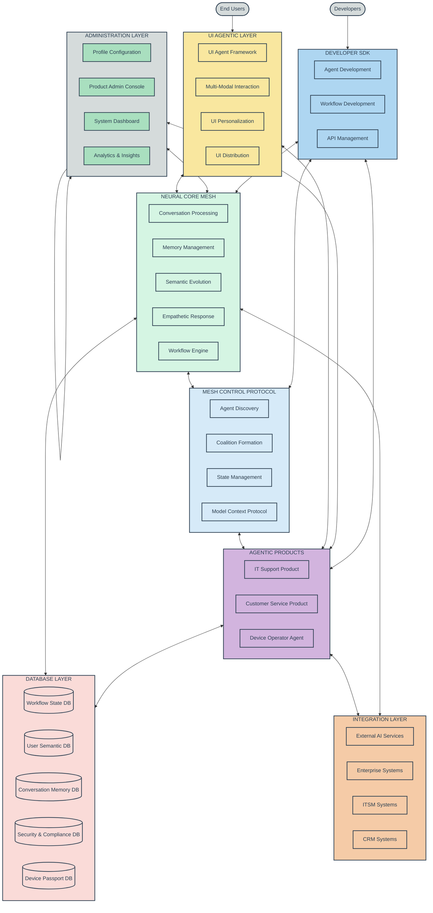

#### Database Schema Layer Mapping

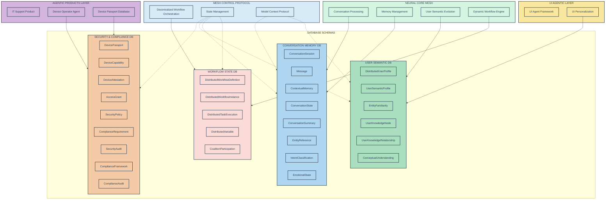

The ME.AI Neural Core Mesh Architecture combines several key layers in a distributed mesh topology, enabling seamless integration and communication between components.

1. **Multi-Channel Interface Layer**: Provides various entry points for users including native chat, MS Teams integration, telephony/voice, and media processing capabilities.

2. **Administration & Configuration UI**: Web-based interfaces for system administrators to configure and manage the platform.

3. **Developer SDK**: Tools, APIs, and documentation for developers to extend and integrate with the platform.

4. **UI Agentic Layer**: Transforms traditional UI components into autonomous agents that adapt to user needs across different devices and interaction modalities.

5. **Neural Core Mesh**: The intelligent foundation of the system, providing conversation processing, memory management, semantic understanding, and workflow orchestration capabilities.

6. **Mesh Control Protocol**: The coordination layer that enables direct peer-to-peer communication, dynamic coalition formation, and model context sharing between components.

7. **Agentic Products Layer**: Domain-specific intelligent agents that provide specialized capabilities for specific business needs.

8. **Analytics & Insights Layer**: Collects, processes, and visualizes data from across the platform to provide operational intelligence and business metrics.

9. **External Integrations**: Connections to external AI services, enterprise systems, CRM platforms, and IT management tools.

Each layer operates as a distributed mesh of components rather than a monolithic structure, enabling greater resilience, scalability, and adaptability.

### 3.1 Mesh Architecture Principles

```mermaid
flowchart TD
    subgraph PRINCIPLES["MESH ARCHITECTURE PRINCIPLES"]
        P1[Distributed Communication - No Central Broker]
        P2[Peer-to-Peer Interactions]
        P3[Emergent Intelligence]
        P4[Dynamic Coalition Formation]
        P5[Resilient Operation - No Single Point of Failure]
        P6[Protocol-based Coordination]
        P7[Semantic Negotiation]
        P8[Trust and Reputation]
        P9[Model Context Sharing]
        P10[Device Authentication]
    end
    
    P1 --- P2
    P2 --- P3
    P3 --- P4
    P4 --- P5
    P5 --- P6
    P6 --- P7
    P7 --- P8
    P8 --- P9
    P9 --- P10
    P10 --- P1
    
    classDef principles fill:#41b883,stroke:#000,stroke-width:1px,color:#fff
    class PRINCIPLES,P1,P2,P3,P4,P5,P6,P7,P8,P9,P10 principles
```

#### Mesh Architecture Characteristics

1. **Decentralized Communication**:
   - Components communicate directly without requiring a central broker
   - Message routing occurs through a distributed protocol
   - Components discover each other through distributed service discovery mechanisms

2. **Agent Autonomy**:
   - Agents operate with greater autonomy to make local decisions
   - Each agent exposes capabilities and requirements through standardized interfaces
   - Agents can negotiate directly with each other for collaboration

3. **Coalition Formation**:
   - Agents dynamically form coalitions to address specific tasks
   - Coalition membership is fluid based on task requirements and agent availability
   - Multiple coalitions can operate simultaneously across the system

4. **Semantic Negotiation**:
   - Components establish shared semantic understanding through negotiation protocols
   - Knowledge and context are shared directly between relevant components
   - Semantic alignment occurs dynamically as coalitions form

5. **Resilient Operation**:
   - No single component is critical to overall system operation
   - The system gracefully handles component failures through redundancy and rerouting
   - State is distributed across the mesh to prevent data loss

6. **Emergent Intelligence**:
   - Complex problem-solving emerges from simpler component interactions
   - The system can discover novel solutions through agent collaboration patterns
   - Learning occurs at both the individual agent and coalition levels

7. **Model Context Protocol**:
   - Standardized mechanism for sharing model contexts between agents
   - Enables efficient knowledge transfer and reasoning chain integration
   - Maintains context coherence across distributed components

8. **Device Authentication**:
   - Secure device identification and validation
   - Granular access control based on device capabilities and trust level
   - Continuous verification throughout device lifecycle

### 3.2 Key Components

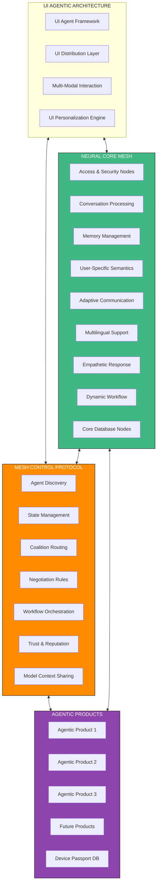

The key distinction in this architecture is the bidirectional connections between all major components, indicating direct peer-to-peer communication rather than the previous hierarchical flow. Components can now interact directly as needed, with the Mesh Control Protocol providing the standards and protocols for these interactions rather than serving as a central orchestrator.

#### Neural Core Mesh Use Case Diagram

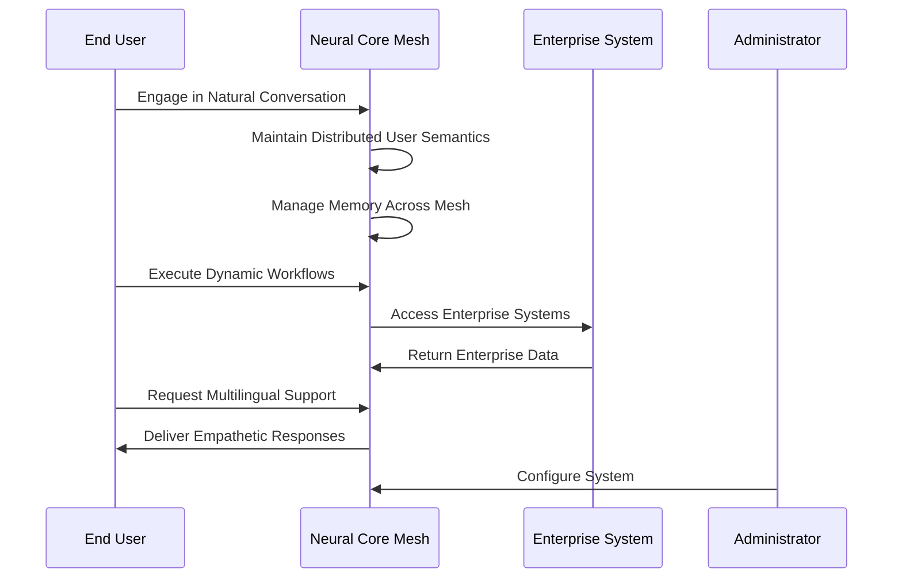

#### Mesh Technical Stack

| Layer | Component | Technologies | Purpose |
|-------|-----------|--------------|---------|
| **UI Agentic Architecture** | UI Agent Framework | React Agents, Angular Elements, WebComponents | Autonomous UI component agents |
| | UI Distribution Layer | Progressive Web Apps, React Native, Flutter | Cross-platform rendering |
| | Multi-Modal Interaction | Speech Recognition/Synthesis, Gesture API, Haptic Feedback | Multiple interaction modes |
| | UI Personalization | Client-side ML, Adaptive Interfaces, User Behavior Models | Customized user experiences |
| **Neural Core Mesh** | Access & Security | Distributed Identity, Zero Trust, mTLS, JWT | Authentication, authorization, and security |
| | Conversation Processing | Distributed NLP Pipeline, Transformers, BERT, GPT models | Natural language understanding and generation |
| | Memory Management | Distributed KV Stores, CRDTs, Vector DBs | Short-term, long-term, and cross-session memory |
| | User-Specific Semantics | Distributed Graph DBs, TigerGraph, Vector Similarity | Personalized semantic understanding |
| | Adaptive Communication | Context Adaptation, Fine-tuning, Personality Models | Communication style and preference adaptation |
| | Multilingual Support | Translation Mesh, Language Detection, i18n | Cross-language communication capabilities |
| | Empathetic Response | Sentiment Analysis, Emotion Detection, NLG | Emotionally intelligent interactions |
| | Dynamic Workflow | Choreography, Event Collaboration, BPMN | Orchestration of adaptable processes |
| | Core Databases | Distributed DBs, CRDT-enabled, Vector DBs | Structured and unstructured data storage |
| **Mesh Control Protocol** | Agent Discovery | mDNS, libp2p, Distributed Hash Tables | Peer discovery and capability advertising |
| | State Management | CRDTs, Merkle DAGs, Gossip Protocols | Distributed state consistency |
| | Coalition Routing | Peer Routing, Circuit Relay, DHT Routing | Message routing between agents |
| | Negotiation Rules | Protocol Buffers, JSON Schema, Semantic Standards | Standardized communication formats |
| | Workflow Orchestration | Choreography, Event-driven Collaboration | Cross-product workflow coordination |
| | Trust Management | Reputation Systems, Trust Metrics, Consensus | Building trust between agents |
| | Model Context Sharing | Context Vectors, Knowledge Graphs, Chain-of-Thought | Sharing reasoning and knowledge context |
| **Agentic Products** | Domain Agents | Microservices, Domain-Specific ML Models | Specialized functionality for domains |
| | Agent Coalitions | Coalition Formation, Role Assignment | Dynamic agent collaboration |
| | Storage | Distributed Storage, CRDT-enabled, Specialized Stores | Domain-specific data storage |
| | Integration | API Mesh, Event Mesh, Message Mesh | External system integration |
| | Domain Logic | Distributed Rules Engines, Expert Systems | Domain-specific business logic |
| | Device Passport DB | PKI, Blockchain, Attestation, Zero Knowledge Proofs | Secure device identity and authentication |

## 4. UI Agentic Architecture

### 4.1 UI Agent Framework

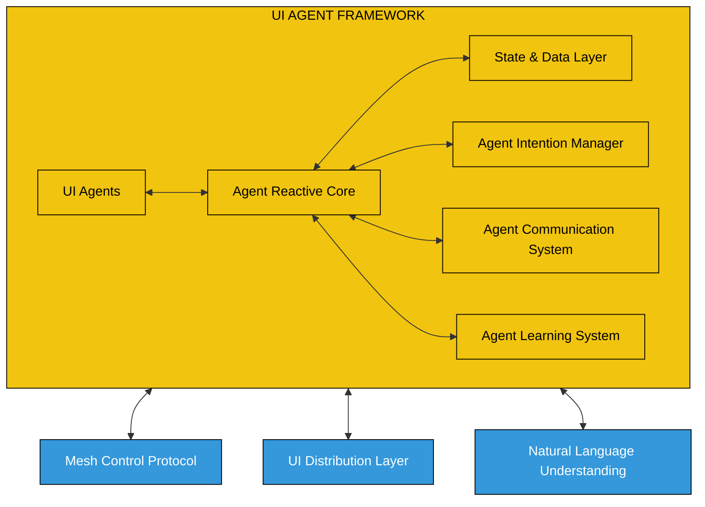

The UI Agent Framework transforms traditional UI components into autonomous agents with these characteristics:

1. **Autonomous Components**: 
   - Self-contained UI elements with autonomous behavior
   - Goal-oriented operation with local decision-making
   - Reactive and proactive interaction capabilities

2. **Agent Reactive Core**:
   - Manages agent lifecycle (initialization, operation, hibernation)
   - Handles event processing and reaction
   - Coordinates agent internal state management

3. **State & Data Layer**:
   - Manages local component state
   - Synchronizes with distributed state when needed
   - Implements CRDT-based conflict resolution for distributed state

4. **Agent Intention Manager**:
   - Defines and manages agent goals and intentions
   - Prioritizes competing objectives
   - Plans sequence of actions to achieve goals

5. **Agent Communication System**:
   - Enables direct agent-to-agent communication
   - Supports pub/sub patterns for event notification
   - Integrates with the broader Mesh Control Protocol

6. **Agent Learning System**:
   - Adapts behavior based on user interactions
   - Learns user preferences and patterns
   - Implements behavioral reinforcement mechanisms

### 4.2 UI Distribution Layer

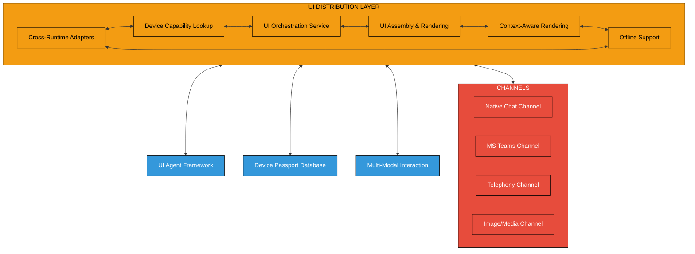

The UI Distribution Layer enables seamless distribution of UI agents across heterogeneous devices and platforms:

1. **Cross-Runtime Adapters**:
   - Support for diverse client platforms (web, mobile, desktop, embedded)
   - Runtime-specific optimization and adaptation
   - Progressive enhancement based on platform capabilities

2. **Device Capability Lookup**:
   - Detection of device capabilities and constraints
   - Integration with Device Passport Database for secure capability verification
   - Runtime feature negotiation for optimal experience

3. **UI Orchestration Service**:
   - Coordinates distribution of UI components across devices
   - Manages component lifecycle and dependencies
   - Handles cross-device state synchronization

4. **UI Assembly & Rendering**:
   - Dynamic composition of UI from distributed components
   - Adaptive layout and styling based on device characteristics
   - Just-in-time UI compilation and optimization

5. **Context-Aware Rendering**:
   - Adaptation to environmental factors (lighting, noise, motion)
   - Situational awareness for interaction mode selection
   - User context-based rendering decisions

6. **Offline Support Infrastructure**:
   - Offline-first operation with queue-based synchronization
   - Progressive Web App capabilities
   - Local-first data with eventual consistency

7. **Channels**:
   - Native Chat Channel for web and mobile applications
   - MS Teams integration for enterprise collaboration
   - Telephony channel for voice and IVR interaction
   - Image/Media channel for processing visual content

### 4.3 Multi-Modal Interaction

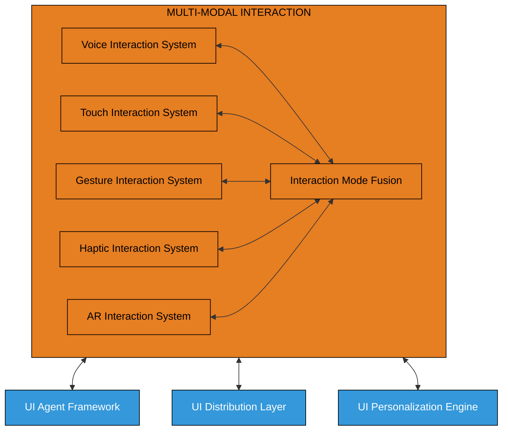

The Multi-Modal Interaction system enables natural and flexible user interactions across different modalities:

1. **Voice Interaction System**:
   - Speech recognition with noise cancellation and speaker identification
   - Natural language understanding for conversational interaction
   - Adaptive speech synthesis with emotional tone matching

2. **Touch Interaction System**:
   - Multi-touch gesture recognition and processing
   - Pressure-sensitive input handling
   - Haptic feedback coordination

3. **Gesture Interaction System**:
   - Camera-based gesture detection and tracking
   - 3D spatial gesture interpretation
   - Integration with AR/VR environments

4. **Haptic Interaction System**:
   - Programmable tactile feedback
   - Force feedback for enhanced interaction
   - Vibration patterns for notifications and alerts

5. **AR Interaction System**:
   - Spatial mapping and recognition
   - Object anchoring and tracking
   - Gesture and voice integration in AR context

6. **Interaction Mode Fusion**:
   - Integration of multiple input modalities
   - Context-aware modality selection
   - Fallback and degradation strategies

### 4.4 UI Personalization Engine

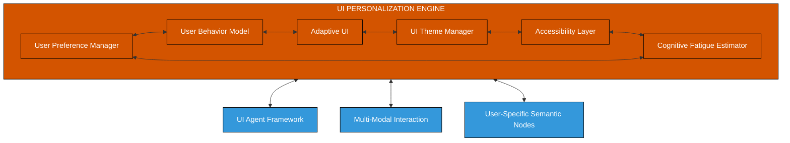

The UI Personalization Engine creates tailored user experiences based on individual preferences and behaviors:

1. **User Preference Manager**:
   - Storage and retrieval of explicit user preferences
   - Preference synchronization across devices
   - Privacy-preserving preference management

2. **User Behavior Model**:
   - Analysis of interaction patterns and preferences
   - Client-side ML for behavior prediction
   - Integration with semantic profiles for deeper personalization

3. **Adaptive UI**:
   - Dynamic adjustment of UI elements based on usage patterns
   - Contextual reorganization of interface components
   - Predictive interface adjustments

4. **UI Theme Manager**:
   - Customizable visual themes and styling
   - Automatic light/dark mode and color scheme adaptation
   - Visual hierarchy adjustments based on user preferences

5. **Accessibility Layer**:
   - Comprehensive accessibility support (screen readers, alternative inputs)
   - Dynamic adjustment based on user needs
   - Compliance with WCAG guidelines

6. **Cognitive Fatigue Estimator**:
   - Monitoring of user cognitive load
   - Interface simplification during high cognitive load
   - Interaction pacing based on cognitive state

## 5. Neural Core Mesh Platform

### 5.1 User-Specific Semantic Evolution

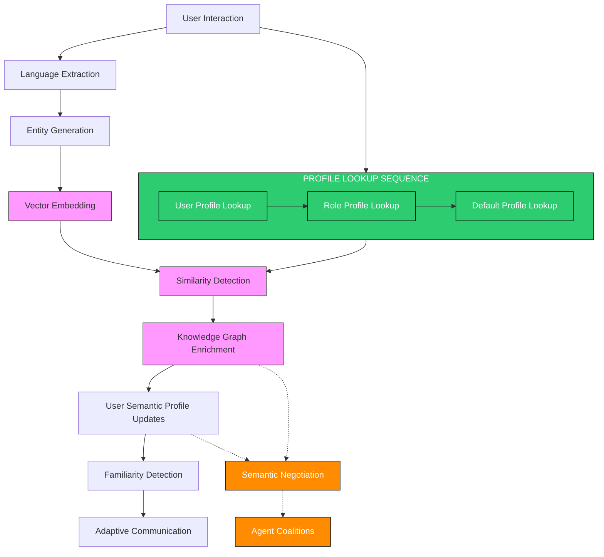

The key enhancements in this component include:

1. **Addition of Profile Lookup Sequence**: Implements a structured profile lookup cascade that:
   - First looks for a user-specific profile created based on usage patterns
   - Then falls back to company-defined profiles for the user's role if a user profile isn't available
   - Finally defaults to the system default profile if neither user nor role profiles exist

2. **Semantic Negotiation**: Enables semantic understanding to be shared across agent coalitions through a standardized negotiation protocol

### 5.2 Adaptive Communication

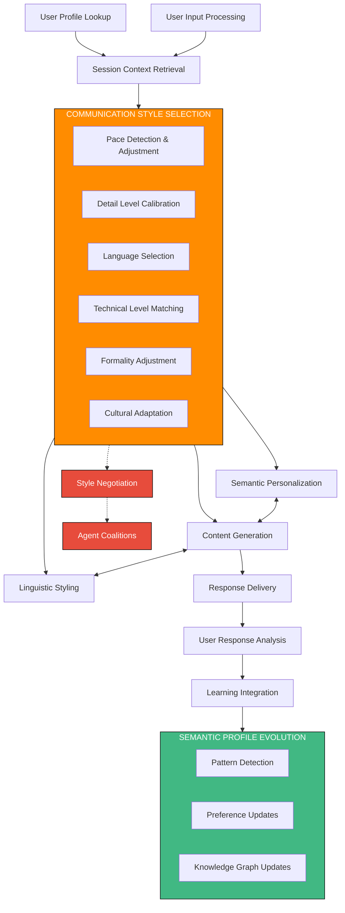

The enhancement introduces Style Negotiation capabilities that enable consistent communication styles across agent coalitions, ensuring a coherent user experience regardless of which agents are involved in generating responses.

### 5.3 Multilingual Support

```mermaid
flowchart TD
    subgraph LPP["LANGUAGE PROCESSING"]
        LD[Language Detection]
        DI[Dialect Identification]
        RS[Register Selection]
    end
    
    LPP --> LRS
    
    subgraph LRS["LINGUISTIC RESOURCES"]
        FS[Filler Selection]
        IR[Idiom Repository]
        CR[Cultural References]
        FM[Formality Markers]
        TT[Technical Terminology]
        EE[Emotional Expressions]
    end
    
    LRS --> RGA
    
    subgraph RGA["RESPONSE GENERATION"]
        GS[Grammatical Structure]
        NP[Natural Phrasing]
        CS[Cultural Sensitivity]
        LCS[Linguistic Code-Switching]
        PPI[Pause Pattern Insertion]
        PF[Prosodic Features]
    end
    
    RGA --> LPA
    
    subgraph LPA["LANGUAGE PROFICIENCY ADAPTATION"]
        CA[Complexity Adjustment]
        VS[Vocabulary Simplification]
        PC[Pace Control]
        EI[Explanation Insertion]
        VSU[Visual Supplements]
        LLS[Language Learning Support]
    end
    
    LPA --> LN[Language Negotiation]
    LN --> AC[Agent Coalitions]
    
    classDef blue fill:#2374ab,stroke:#000,stroke-width:1px,color:#fff
    classDef green fill:#41b883,stroke:#000,stroke-width:1px,color:#fff
    classDef orange fill:#ff8c00,stroke:#000,stroke-width:1px,color:#fff
    classDef purple fill:#8e44ad,stroke:#000,stroke-width:1px,color:#fff
    classDef new fill:#e74c3c,stroke:#000,stroke-width:1px,color:#fff
    
    class LPP blue
    class LRS green
    class RGA orange
    class LPA purple
    class LN,AC new
```

The enhancement introduces Language Negotiation capabilities that enable agent coalitions to agree on language-specific approaches when generating multilingual responses.

### 5.4 Empathetic Response System

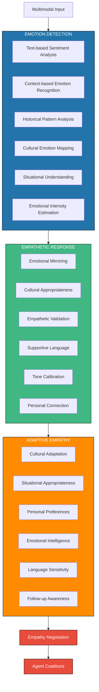

The enhancement introduces Empathy Negotiation capabilities that allow agent coalitions to align on emotional understanding and response strategies.

### 5.5 Distributed Memory Management

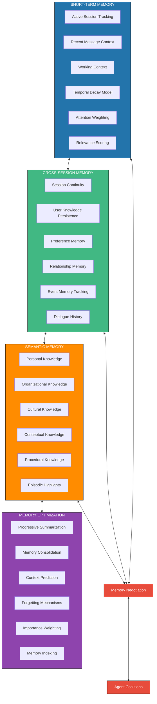

The enhancement introduces Memory Negotiation capabilities that allow different components to align on shared memory context when forming coalitions, ensuring consistent context across the mesh.

### 5.6 Dynamic Workflow Engine

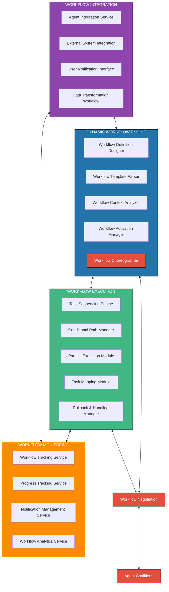

The key enhancements include:
1. Addition of a Workflow Choreographer that enables decentralized coordination through event-based choreography rather than centralized orchestration
2. Introduction of Workflow Negotiation capabilities that allow different components to align on shared workflow execution strategies
3. Direct connection to Agent Coalitions for collaborative workflow execution

## 6. Mesh Control Protocol (MCP)

### 6.1 MCP Distributed Architecture

```mermaid
flowchart TD
    subgraph CC["CORE COMPONENTS"]
        ARS[Agent Registry Service]
        PR[Peer Routing]
        RA[Resource Allocator]
        EP[Event Propagation]
        DFH[Distributed Fault Handling]
        DSM[Distributed State Manager]
    end
    
    CC <--> OS
    
    subgraph OS["ORCHESTRATION SERVICES"]
        DCH[Distributed Choreography]
        APS[Adaptive Planning Service]
        CRS[Conflict Resolution Service]
        PEM[Parallel Execution Manager]
        PMS[Priority Management Service]
        TMS[Timeout Management Service]
    end
    
    OS <--> MC
    
    subgraph MC["MONITORING & CONTROL"]
        DPM[Performance Monitoring]
        SG[Security Gateway]
        DOS[Observability Service]
        DAS[Audit Service]
        RLS[Rate Limiting Service]
        DCB[Circuit Breaker]
    end
    
    MC <--> MCL
    
    subgraph MCL["MODEL CONTEXT LAYER"]
        MCS[Model Context Store]
        MCT[Model Context Transfer]
        MCM[Model Context Merge]
        MCV[Model Context Versioning]
    end
    
    classDef blue fill:#2374ab,stroke:#000,stroke-width:1px,color:#fff
    classDef green fill:#41b883,stroke:#000,stroke-width:1px,color:#fff
    classDef orange fill:#ff8c00,stroke:#000,stroke-width:1px,color:#fff
    classDef purple fill:#e74c3c,stroke:#000,stroke-width:1px,color:#fff
    
    class CC blue
    class OS green
    class MC orange
    class MCL purple
```

Key changes include:
1. Replacing the centralized Agent Registry with a Distributed Registry using DHT or similar technology
2. Introducing Peer Routing for direct agent-to-agent communication
3. Using Gossip Protocols for event propagation instead of centralized message bus
4. Implementing CRDT-based distributed state management instead of centralized state
5. Replacing orchestration with choreography through distributed event systems
6. Implementing consensus protocols for conflict resolution
7. Adding a Model Context Layer for sharing and integrating model contexts across agents

### 6.2 Enhanced Agent-to-Agent Communication

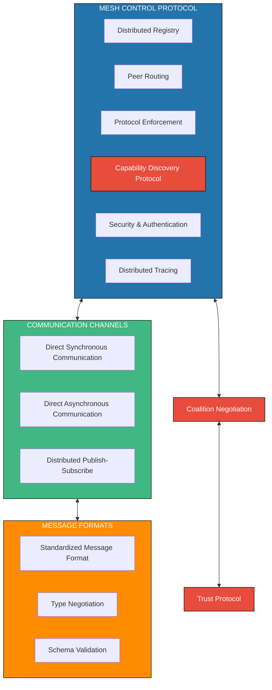

Key enhancements include:
1. Introduction of Capability Discovery Protocol that allows agents to advertise their capabilities
2. Direct communication channels using P2P technologies like libp2p
3. Coalition Negotiation protocol for dynamic team formation
4. Trust Protocol for establishing reputation-based collaboration
5. Type Negotiation for dynamic message format agreement

### 6.3 Decentralized Workflow Orchestration

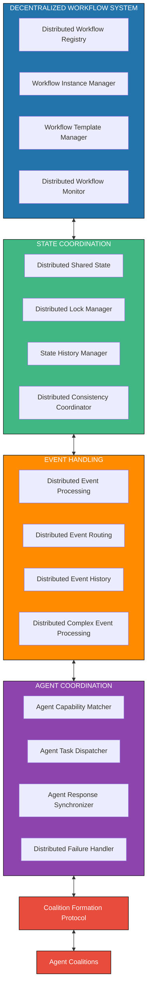

Key enhancements include:
1. Distribution of workflow management across a mesh of nodes rather than centralized services
2. CRDT-based state management for workflow state consistency
3. Event-based choreography instead of centralized orchestration
4. Introduction of Coalition Formation Protocol for dynamic agent team assembly
5. Capability discovery and matching for optimal agent selection

### 6.4 Model Context Protocol

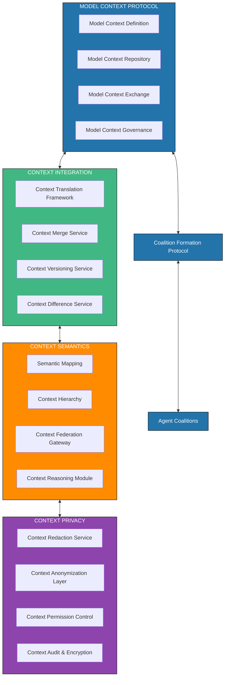

The Model Context Protocol enables:
1. Standardized representation of model contexts for cross-agent sharing
2. Context translation between different model frameworks and representations
3. Semantic alignment and inference across model contexts
4. Privacy-preserving context sharing with appropriate access controls
5. Direct integration with the Coalition Formation Protocol for team-based context sharing

## 7. Agentic Products Architecture

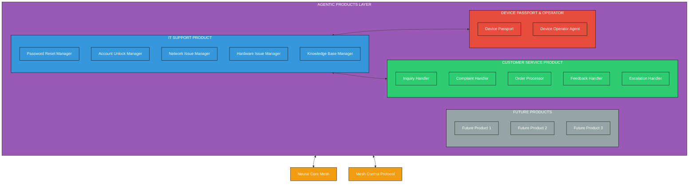

The key differentiation between the Neural Core Mesh and the Agentic Products Layer:

1. **Neural Core Mesh**:
   - Provides foundational conversation intelligence capabilities
   - Manages semantic understanding, memory, and adaptive communication
   - Functions as a domain-agnostic platform
   - Enables mesh coordination and communication between components

2. **Agentic Products Layer**:
   - Delivers domain-specific functionality through specialized agents
   - Implements business logic for particular use cases 
   - Contains product-specific knowledge bases and workflows
   - Extends the platform with purpose-built capabilities
   - Designed for specific domains (IT Support, Customer Service, etc.)

### 7.1 Agent Autonomy

```mermaid
flowchart TD
    subgraph AAL["AGENT AUTONOMY LAYER"]
        TP[Task Perception]
        SD[Self-Diagnosis]
        LC[Learning Capability]
        AM[Autonomy Manager]
        SM[Skill Management]
    end
    
    AAL <--> SA
    
    subgraph SA["SPECIALIZED AGENTS"]
        IRA[Information Retrieval Agents]
        TPA[Transaction Processing Agents]
        IA[Integration Agents]
        DSA[Domain-Specific Agents]
        DMA[Decision-Making Agents]
        NA[Notification Agents]
    end
    
    SA <--> AC
    
    subgraph AC["AGENT CAPABILITIES"]
        BAI[Backend API Integration]
        DQE[Database Query Execution]
        ESI[External Service Integration]
        DG[Document Generation]
        WA[Workflow Automation]
        LA[Learning & Adaptation]
    end
    
    AC <--> AO
    
    subgraph AO["AGENT OVERSIGHT"]
        DSC[Security Controls]
        DCR[Compliance Rules]
        DPM[Performance Monitoring]
        DLA[Logging & Auditing]
        DET[Explainability Tools]
        HS[Human Supervision]
    end
    
    AAL <--> CM[Coalition Membership]
    CM <--> TR[Trust & Reputation]
    
    classDef blue fill:#2374ab,stroke:#000,stroke-width:1px,color:#fff
    classDef green fill:#41b883,stroke:#000,stroke-width:1px,color:#fff
    classDef orange fill:#ff8c00,stroke:#000,stroke-width:1px,color:#fff
    classDef purple fill:#8e44ad,stroke:#000,stroke-width:1px,color:#fff
    classDef new fill:#e74c3c,stroke:#000,stroke-width:1px,color:#fff
    
    class AAL blue
    class SA green
    class AC orange
    class AO purple
    class CM,TR,AM,SM new
```

Key enhancements include:
1. Introduction of an Agent Autonomy Layer that enables agents to make independent decisions
2. Skill Management system for advertising and updating agent capabilities
3. Coalition Membership protocol for participating in dynamic agent teams
4. Trust & Reputation system for optimizing collaboration

### 7.2 Dynamic Coalition Formation

```mermaid
flowchart TD
    subgraph DCF["DYNAMIC COALITION FORMATION"]
        TP[Task Perception]
        CR[Coalition Request]
        CAM[Capability Matching]
        NC[Negotiation & Contracting]
        RA[Role Assignment]
        CO[Coalition Operation]
        CD[Coalition Dissolution]
    end
    
    DCF <--> TR
    
    subgraph TR["TRUST & REPUTATION"]
        TM[Trust Metrics]
        RM[Reputation Management]
        PS[Performance Scoring]
        HS[History Storage]
        OB[Observed Behavior]
        SE[Skill Evaluation]
    end
    
    DCF <--> CP
    
    subgraph CP["COALITION PROTOCOLS"]
        JP[Join Protocol]
        LP[Leave Protocol]
        VP[Voting Protocol]
        SN[Semantic Negotiation]
        RP[Resource Negotiation]
        CCP[Compensation Protocol]
    end
    
    CP <--> CM
    
    subgraph CM["COALITION MONITORING"]
        PS2[Progress Tracking]
        EF[Effectiveness Monitoring]
        CL[Coalition Learning]
        CH[Collaboration History]
        BD[Behavioral Dynamics]
        RCA[Root Cause Analysis]
    end
    
    classDef blue fill:#2374ab,stroke:#000,stroke-width:1px,color:#fff
    classDef green fill:#41b883,stroke:#000,stroke-width:1px,color:#fff
    classDef orange fill:#ff8c00,stroke:#000,stroke-width:1px,color:#fff
    classDef purple fill:#8e44ad,stroke:#000,stroke-width:1px,color:#fff
    
    class DCF blue
    class TR green
    class CP orange
    class CM purple
```

This new component enables the dynamic formation of agent coalitions through a structured process:
1. Task Perception that recognizes the need for collaboration
2. Coalition Request to initiate team formation
3. Capability Matching to identify appropriate team members
4. Negotiation & Contracting to establish collaboration terms
5. Role Assignment to determine team responsibilities
6. Coalition Operation for team execution
7. Coalition Dissolution when the task is complete

### 7.3 Federated Workflow Repository

```mermaid
flowchart TD
    subgraph FWR["FEDERATED WORKFLOW REPOSITORY"]
        WTC[Workflow Template Catalog]
        WVM[Workflow Version Manager]
        WTL[Workflow Template Library]
        DWB[Domain Workflow Builder]
    end
    
    FWR <--> TMF
    
    subgraph TMF["TEMPLATE METADATA"]
        PD[Parameter Definitions]
        ID[Integration Descriptors]
        CD[Compatibility Descriptors]
        RM[Resource Manifests]
    end
    
    TMF <--> WTE
    
    subgraph WTE["WORKFLOW TESTING"]
        WVT[Workflow Validation Tests]
        WST[Workflow Simulation Tool]
        WDT[Workflow Debugging Tools]
        WPT[Workflow Performance Tests]
    end
    
    WTE <--> WCT
    
    subgraph WCT["WORKFLOW CUSTOMIZATION"]
        WCD[Workflow Cloning & Derivation]
        WEW[Workflow Extension Wizard]
        WPS[Workflow Parameter Settings]
        WTI[Workflow Trigger Integration]
    end
    
    FWR <--> WS[Workflow Sharing]
    WS <--> AC[Agent Coalitions]
    
    classDef blue fill:#2374ab,stroke:#000,stroke-width:1px,color:#fff
    classDef green fill:#41b883,stroke:#000,stroke-width:1px,color:#fff
    classDef orange fill:#ff8c00,stroke:#000,stroke-width:1px,color:#fff
    classDef purple fill:#8e44ad,stroke:#000,stroke-width:1px,color:#fff
    classDef new fill:#e74c3c,stroke:#000,stroke-width:1px,color:#fff
    
    class FWR blue
    class TMF green
    class WTE orange
    class WCT purple
    class WS,AC new
```

Key enhancements include:
1. Distributed catalog and version control for workflows
2. Content-addressed storage for workflow templates
3. P2P workflow sharing between agents and coalitions
4. Collaborative workflow creation and customization

### 7.4 Device Passport Database

```mermaid
flowchart TD
    subgraph DPD["DEVICE PASSPORT DATABASE"]
        DID[Device Identity]
        DAM[Device Attestation Manager]
        DCP[Device Capability Passport]
        DTM[Device Trust Manager]
    end
    
    DPD <--> DAL
    
    subgraph DAL["DEVICE AUTHENTICATION"]
        PKI[Public Key Infrastructure]
        ZKP[Zero Knowledge Proofs]
        BCA[Blockchain Attestation]
        BIM[Biometric Integration Module]
    end
    
    DAL <--> DCL
    
    subgraph DCL["DEVICE CONTROL"]
        PAC[Policy Administration Center]
        PDP[Policy Decision Point]
        PEP[Policy Enforcement Point]
        PAP[Policy Audit Point]
    end
    
    DCL <--> DSL
    
    subgraph DSL["DEVICE SECURITY"]
        RSM[Remote Security Management]
        DQM[Device Quarantine Manager]
        RRA[Risk & Resilience Assessment]
        CCM[Cryptographic Control Module]
    end
    
    DCL <--> DOA
    
    subgraph DOA["DEVICE OPERATOR AGENT"]
        RCI[Remote Control Interface]
        DDP[Device Diagnostic & Profiling]
        SRA[System Repair Actions]
        RFE[Remote File Explorer]
        TPM[Trouble Pattern Matcher]
    end
    
    DPD <--> AI[Agent Integration]
    DPD <--> UI[UI Integration]
    DPD <--> ES[External Systems]
    DOA <--> ITS[IT Support Product]
    
    classDef blue fill:#2374ab,stroke:#000,stroke-width:1px,color:#fff
    classDef green fill:#41b883,stroke:#000,stroke-width:1px,color:#fff
    classDef orange fill:#ff8c00,stroke:#000,stroke-width:1px,color:#fff
    classDef purple fill:#8e44ad,stroke:#000,stroke-width:1px,color:#fff
    classDef red fill:#e74c3c,stroke:#000,stroke-width:1px,color:#fff
    classDef doa fill:#e67e22,stroke:#000,stroke-width:1px,color:#fff
    
    class DPD blue
    class DAL green
    class DCL orange
    class DSL purple
    class AI,UI,ES,ITS red
    class DOA,RCI,DDP,SRA,RFE,TPM doa
```

The Device Passport Database and Device Operator Agent work together to provide:

1. **Secure Device Identity and Control**:
   - Secure device identity and attestation for trusted device authentication
   - Capability passports that define device capabilities and access rights
   - Trust scoring for dynamic access decisions
   - Integration with zero-knowledge proofs for privacy-preserving authentication
   - Blockchain-based attestation for immutable device history

2. **Device Operator Capabilities**:
   - Remote control interface to access and manage user devices (laptops, desktops, mobile)
   - Device diagnostic and profiling to identify system issues
   - System repair actions to automatically fix common problems
   - Remote file explorer for secure, authorized access to files
   - Trouble pattern matcher to identify common IT issues

3. **Security and Compliance**:
   - Policy-based access control for granular authorization
   - Remote security management for device lifecycle security
   - Comprehensive audit logging for all remote operations
   - Device quarantine capabilities for compromised devices

## 8. Database Architecture

### 8.1 Distributed State Management

```mermaid
erDiagram
    DistributedWorkflowDefinition ||--o{ DistributedWorkflowInstance : instantiates
    DistributedWorkflowInstance ||--o{ DistributedTaskExecution : contains
    DistributedWorkflowInstance ||--o{ StateTransition : records
    DistributedWorkflowInstance ||--o{ DistributedVariable : uses
    DistributedWorkflowInstance ||--o{ DistributedEvent : generates
    DistributedWorkflowInstance ||--o{ CoalitionParticipation : includes
    
    DistributedWorkflowDefinition {
        string DefinitionID PK "Content-Addressable ID"
        string Name
        string Version
        json Definition
        date CreatedDate
        string CreatedBy
        boolean IsActive
        array Tags
        string Description
        array MeshLocations "Distributed Locations"
    }
    
    DistributedWorkflowInstance {
        string InstanceID PK "DHT-Addressable ID"
        string DefinitionID FK
        string Status "CRDT - Convergent Status"
        date StartTime "Vector Clock Time"
        date EndTime "Vector Clock Time"
        string InitiatedBy
        string Priority
        json Context "CRDT - Mergeable Context"
        string ConversationID
        array ParticipatingNodes
    }
    
    DistributedTaskExecution {
        string ExecutionID PK "DHT-Addressable ID"
        string InstanceID FK
        string TaskName
        string TaskType
        string Status "CRDT - Convergent Status"
        date StartTime "Vector Clock Time"
        date EndTime "Vector Clock Time"
        string AssignedAgent
        json Parameters
        json Result
        string ErrorDetails
        array ExecutionTrace
    }
    
    StateTransition {
        string TransitionID PK "Content-Addressable ID"
        string InstanceID FK
        string FromState
        string ToState
        date TransitionTime "Vector Clock Time"
        string Trigger
        json ContextSnapshot
        array WitnessNodes
    }
    
    DistributedVariable {
        string VariableID PK "DHT-Addressable ID"
        string InstanceID FK
        string Name
        string DataType
        json Value "CRDT - Mergeable Value"
        date LastUpdated "Vector Clock Time"
        string Scope
        array UpdateHistory
    }
    
    DistributedEvent {
        string EventID PK "Content-Addressable ID"
        string InstanceID FK
        string EventType
        date Timestamp "Vector Clock Time"
        json Payload
        boolean Processed "CRDT - Convergent Flag"
        string SourceComponent
        array ObserverNodes
    }
    
    CoalitionParticipation {
        string ParticipationID PK "DHT-Addressable ID"
        string InstanceID FK
        string CoalitionID "Coalition Reference"
        string AgentID "Agent Reference"
        string Role "Agent Role"
        date JoinTime "Vector Clock Time"
        date LeaveTime "Vector Clock Time"
        float ContributionScore
    }
```

### 8.2 Security & Compliance Database

```mermaid
erDiagram
    DevicePassport ||--o{ DeviceCapability : has
    DevicePassport ||--o{ DeviceAttestation : verifies
    DevicePassport ||--o{ AccessGrant : authorizes
    DevicePassport ||--o{ SecurityAudit : records
    
    SecurityPolicy ||--o{ AccessGrant : governs
    SecurityPolicy ||--o{ ComplianceRequirement : enforces
    SecurityPolicy ||--o{ SecurityAudit : validates
    
    ComplianceFramework ||--o{ ComplianceRequirement : defines
    ComplianceFramework ||--o{ ComplianceAudit : assesses
    
    DevicePassport {
        string DeviceID PK "Unique Device Identifier"
        string DeviceType "Device Category/Type"
        string Manufacturer
        string Model
        string FirmwareVersion
        string OSVersion
        date RegistrationDate
        date LastUpdated
        date LastAuthenticated
        string Status "Active/Inactive/Quarantined"
        string Owner "Organization/User Reference"
        float TrustScore "Dynamic Trust Rating"
        string PublicKey "Device Public Key"
        json PassportMetadata
    }
    
    DeviceCapability {
        string CapabilityID PK
        string DeviceID FK
        string CapabilityName
        string CapabilityType
        json CapabilityMetadata
        date VerificationDate
        string VerificationMethod
        boolean IsActive
    }
    
    DeviceAttestation {
        string AttestationID PK
        string DeviceID FK
        date AttestationTime
        string AttestationType
        json AttestationResult
        string AttestationAuthority
        string BlockchainReference
        string ProofHash
    }
    
    AccessGrant {
        string GrantID PK
        string DeviceID FK
        string SecurityPolicyID FK
        string ResourceType
        string ResourceID
        string AccessLevel
        date GrantStart
        date GrantEnd
        string GrantReason
        string ApprovedBy
        boolean IsActive
    }
    
    SecurityPolicy {
        string PolicyID PK
        string PolicyName
        string PolicyVersion
        date CreationDate
        date EffectiveDate
        date ExpirationDate
        string Status
        string Author
        string ApprovedBy
        json PolicyRules
        string Scope "Global/Organization/Team"
    }
    
    ComplianceRequirement {
        string RequirementID PK
        string SecurityPolicyID FK
        string FrameworkID FK
        string RequirementCode
        string Description
        string ControlType
        string VerificationMethod
        string Priority
        boolean IsActive
    }
    
    SecurityAudit {
        string AuditID PK
        string DeviceID FK
        string PolicyID FK
        date AuditTime
        string AuditType
        string AuditResult
        string AuditorID
        json AuditDetails
        string RemediationStatus
        json RemediationDetails
    }
    
    ComplianceFramework {
        string FrameworkID PK
        string FrameworkName
        string Version
        string Issuer
        date PublicationDate
        date AdoptionDate
        string Status
        string Scope
        string IndustryFocus
    }
    
    ComplianceAudit {
        string AuditID PK
        string FrameworkID FK
        date AuditDate
        string AuditScope
        string AuditorOrganization
        string AuditorName
        string AuditResult
        float ComplianceScore
        json FindingDetails
        string RemediationPlan
        date NextAuditDue
    }
```

### 8.3 User Semantic Profile Database

```mermaid
erDiagram
    DistributedUserProfile ||--o{ UserSemanticProfile : has
    DistributedUserProfile ||--o{ EntityFamiliarity : tracks
    DistributedUserProfile ||--o{ UserKnowledgeNode : contains
    UserKnowledgeNode ||--o{ UserKnowledgeRelationship : participatesIn
    DistributedUserProfile ||--o{ ConceptualUnderstanding : measures
    
    DistributedUserProfile {
        string UserID PK "Content-Addressable ID"
        object BasicInfo "CRDT - Personal Information"
        object CommunicationPrefs "CRDT - Communication Settings"
        object LanguageProficiency "CRDT - Language Capabilities"
        object InteractionMetrics "CRDT - Usage Statistics"
        object LearningProfile "CRDT - Learning Patterns"
        array MeshLocations "Distributed Storage Locations"
    }
    
    UserSemanticProfile {
        string ProfileID PK "Content-Addressable ID"
        string UserID FK "User Reference - Foreign Key"
        date CreationDate "Vector Clock - Creation Time"
        date LastUpdated "Vector Clock - Last Update"
        vector SemanticVector "Distributed Vector DB - Embedding"
        boolean DefaultOrganizationProfile "CRDT - Default Status"
        string ActiveStatus "CRDT - Status Values"
        string Version "Semantic Version Number"
    }
    
    EntityFamiliarity {
        string RecordID PK "Content-Addressable ID"
        string UserID FK "User Reference - Foreign Key"
        string EntityID "Content-Addressable Entity Reference"
        float Familiarity "CRDT - Familiarity Score"
        date FirstEncounter "Vector Clock - First Seen"
        date LastEncounter "Vector Clock - Last Seen"
        int EncounterCount "CRDT - Occurrence Counter"
        float Importance "CRDT - Importance Weight"
    }
    
    UserKnowledgeNode {
        string NodeID PK "Content-Addressable ID"
        string UserID FK "User Reference - Foreign Key"
        string EntityType "CRDT - Entity Classification"
        string EntityName "CRDT - Entity Name"
        object EntityProperties "CRDT - Entity Attributes"
        float PersonalSignificance "CRDT - User Relevance"
        date CreationDate "Vector Clock - Creation Time"
        date LastReferenced "Vector Clock - Last Referenced"
        int ReferenceCount "CRDT - Reference Counter"
        string PersonalContext "CRDT - User Context Notes"
    }
    
    UserKnowledgeRelationship {
        string RelationshipID PK "Content-Addressable ID"
        string UserID FK "User Reference - Foreign Key"
        string SourceNodeID FK "Source Node Reference"
        string TargetNodeID FK "Target Node Reference"
        string RelationType "CRDT - Relationship Type"
        float Strength "CRDT - Relationship Strength"
        string Evidence "CRDT - Supporting Evidence"
        date FirstObserved "Vector Clock - First Observed"
        date LastReinforced "Vector Clock - Last Reinforced"
        float ConfidenceScore "CRDT - Confidence Level"
    }
    
    ConceptualUnderstanding {
        string UnderstandingID PK "Content-Addressable ID"
        string UserID FK "User Reference - Foreign Key"
        string ConceptID "Content-Addressable Concept Reference"
        float UnderstandingLevel "CRDT - Comprehension Level"
        array Misconceptions "CRDT - Misunderstanding Notes"
        object LearningTrajectory "CRDT - Learning Path"
        array ContextualUsage "CRDT - Usage Examples"
    }
```

### 8.4 Conversation Memory Database

```mermaid
erDiagram
    ConversationSession ||--o{ Message : contains
    ConversationSession ||--o{ ContextualMemory : maintains
    ConversationSession ||--o{ ConversationState : tracks
    ConversationSession ||--o{ ConversationSummary : summarizes
    
    Message ||--o{ EntityReference : mentions
    Message ||--o{ IntentClassification : classified_as
    Message ||--o{ EmotionalState : expresses
    
    User ||--o{ ConversationSession : participates_in
    User ||--o{ UserPreference : configured_by
    
    ConversationSession {
        string SessionID PK "Content-Addressable ID"
        string UserID FK "User Reference"
        date StartTime "Vector Clock - Start Time"
        date EndTime "Vector Clock - End Time"
        string Channel "Communication Channel"
        string Context "Initial Context"
        array TopicChain "Topic Progression"
        string Status "Active/Inactive/Archived"
        float Satisfaction "User Satisfaction Score"
        array MeshLocations "Distributed Storage Locations"
    }
    
    Message {
        string MessageID PK "Content-Addressable ID"
        string SessionID FK "Session Reference"
        string SenderType "User/System/Agent"
        string SenderID "ID of Specific Sender"
        date Timestamp "Vector Clock - Message Time"
        string Content "Message Content"
        object Metadata "Message Properties"
        string ContentType "Text/Voice/Image/etc"
        array ProcessingNodes "Processing History"
    }
    
    ContextualMemory {
        string MemoryID PK "Content-Addressable ID"
        string SessionID FK "Session Reference"
        string MemoryType "Working/Short-term/Long-term"
        string Content "Memory Content"
        date CreationTime "Vector Clock - Creation Time"
        date ExpirationTime "Vector Clock - Expiration Time"
        float Importance "Memory Significance"
        float AccessFrequency "Usage Pattern"
        string ProcessingState "CRDT - Processing Status"
    }
    
    ConversationState {
        string StateID PK "Content-Addressable ID"
        string SessionID FK "Session Reference"
        date Timestamp "Vector Clock - State Time"
        object SemanticContext "Current Understanding"
        array ActiveEntities "Entities in Context"
        array ActiveIntents "Detected Intents"
        string ConversationPhase "Greeting/Discussion/Conclusion"
        object EmotionalContext "Emotional State"
        float Engagement "User Engagement Level"
    }
    
    ConversationSummary {
        string SummaryID PK "Content-Addressable ID"
        string SessionID FK "Session Reference"
        date GenerationTime "Vector Clock - Creation Time"
        string Summary "Conversation Summary"
        array KeyTopics "Main Topics Discussed"
        array KeyEntities "Important Entities"
        array KeyActions "Actions Taken"
        array KeyInsights "Discovered Insights"
        object UserFeedback "Summary Feedback"
    }
    
    EntityReference {
        string ReferenceID PK "Content-Addressable ID"
        string MessageID FK "Message Reference"
        string EntityID "Entity Identifier"
        string EntityType "Person/Place/Organization/etc"
        string MentionType "Direct/Indirect/Anaphoric"
        int PositionStart "Start Position in Text"
        int PositionEnd "End Position in Text"
        float ConfidenceScore "Entity Recognition Confidence"
        object Resolution "Entity Resolution Data"
    }
    
    IntentClassification {
        string ClassificationID PK "Content-Addressable ID"
        string MessageID FK "Message Reference"
        string IntentType "Intent Category"
        string IntentName "Specific Intent"
        float ConfidenceScore "Intent Detection Confidence"
        object Parameters "Intent Parameters"
        object Context "Context Contributing to Classification"
        array AlternativeIntents "Other Possible Intents"
    }
    
    EmotionalState {
        string StateID PK "Content-Addressable ID"
        string MessageID FK "Message Reference"
        object EmotionVector "Emotion Distribution"
        string DominantEmotion "Primary Emotion"
        float Intensity "Emotional Intensity"
        float Valence "Positive/Negative Value"
        float Arousal "Activation Level"
        string DetectionMethod "Analysis Method"
        float ConfidenceScore "Emotion Detection Confidence"
    }
    
    UserPreference {
        string PreferenceID PK "Content-Addressable ID"
        string UserID FK "User Reference"
        string PreferenceType "Interaction/Content/Privacy/etc"
        string PreferenceKey "Specific Preference Identifier"
        string PreferenceValue "CRDT - Preference Setting"
        date LastUpdated "Vector Clock - Update Time"
        string Source "User-defined/Learned/Default"
        float Certainty "Confidence in Preference"
        string Scope "Global/Application/Context"
    }
```

## 9. Key Functional Flows

### 9.1 Mesh-based Conversation Processing

```mermaid
flowchart TD
    CI[Conversation Input] --> AAA[Authentication]
    AAA --> PPF
    
    subgraph PPF["PRE-PROCESSING"]
        STT[Speech-to-Text]
        LD[Language Detection]
        ICP[Context Preparation]
    end
    
    PPF --> PF
    
    subgraph PF["PARALLEL PROCESSING"]
        subgraph UEB["USER EXPERIENCE"]
            IE[Information Extraction]
            SE[Semantic Enrichment]
            UNS[UX Negotiation Service]
        end
        
        subgraph AEB["AGENT EXECUTION"]
            TP[Task Planning]
            AE[Action Execution]
            ST[Status Tracking]
        end
    end
    
    PF --> MMF
    
    subgraph MMF["MEMORY MANAGEMENT"]
        MR[Memory Router]
        WM[Working Memory]
        TD[Transactional Database]
        EM[Episodic Memory]
        SM[Semantic Memory]
        PD[Proprietary Database]
    end
    
    MMF --> RGF
    
    subgraph RGF["RESPONSE GENERATION"]
        CA[Context Assembly]
        RG[Response Generation]
        CSF[Channel Formatting]
    end
    
    RGF --> CC
    
    subgraph CC["CONVERSATION CONTINUITY"]
        CSP[State Persistence]
        CM[Context Maintenance]
        AI[Analytics & Improvement]
        FB[Feedback]
    end
    
    CC --> DWF
    
    subgraph DWF["DYNAMIC WORKFLOW"]
        ITA[Intent Analysis]
        WTS[Workflow Template Selection]
        CFM[Coalition Formation]
        WE[Workflow Execution]
    end
    
    DWF --> UO[User Output]
    
    classDef blue fill:#2374ab,stroke:#000,stroke-width:1px,color:#fff
    classDef green fill:#41b883,stroke:#000,stroke-width:1px,color:#fff
    classDef orange fill:#ff8c00,stroke:#000,stroke-width:1px,color:#fff
    classDef purple fill:#8e44ad,stroke:#000,stroke-width:1px,color:#fff
    classDef red fill:#e74c3c,stroke:#000,stroke-width:1px,color:#fff
    classDef new fill:#f1c40f,stroke:#000,stroke-width:1px,color:#fff
    
    class PPF blue
    class UEB green
    class AEB orange
    class MMF purple
    class RGF orange
    class CC green
    class DWF red
    class CFM new
```

#### Mesh-based Conversation Data Flow

```mermaid
sequenceDiagram
    participant User
    participant Client as Distributed Client Interfaces
    participant NC as Neural Core Mesh
    participant MCP as Mesh Control Protocol
    participant Coalition as Agent Coalition
    participant ES as External Systems
    
    User->>Client: User Input
    Client->>NC: Forward Input (P2P)
    
    Note over NC: Distributed Processing
    NC->>NC: Authenticate user (Zero Trust)
    NC->>NC: Process input (Distributed NLP)
    NC->>NC: Prepare context (CRDT-based)
    
    Note over NC, MCP: Coalition Formation
    NC->>MCP: Request coalition formation
    MCP->>Coalition: Assemble agent team
    
    Note over Coalition: Parallel Processing
    par Distributed Information Processing
        NC->>NC: Extract information (Distributed)
        NC->>NC: Enrich semantically (Mesh-based)
        NC->>NC: Apply user preferences (P2P)
    and Distributed Task Execution
        Coalition->>Coalition: Execute domain tasks
        Coalition->>ES: Direct integration calls
        ES->>Coalition: Return data & operations
    end
    
    Note over NC: Distributed Memory Management
    NC->>NC: Route memory operations (Mesh)
    NC->>NC: Update CRDT-based memory
    NC->>NC: Store in distributed stores
    
    Note over NC, Coalition: Response Generation
    Coalition->>MCP: Share model contexts
    MCP->>NC: Synchronize distributed state
    NC->>NC: Generate response (Collaborative)
    NC->>NC: Format for channel (Adaptive)
    
    Note over NC, Coalition: Decentralized Workflow
    par Optional Workflow Processing
        NC->>NC: Analyze intent (Distributed)
        Coalition->>Coalition: Execute workflow choreography
        Coalition->>MCP: Update workflow state (CRDT)
        MCP->>NC: Synchronize workflow status
    end
    
    NC->>Client: Return response
    Client->>User: Display/play response
```

### 9.2 Semantic Negotiation Flow

```mermaid
flowchart TD
    UR[User Request] & CA[Context Analysis] --> SN
    
    subgraph SN["SEMANTIC NEGOTIATION"]
        VSM[Vector Space Mapping]
        CMF[Conceptual Model Formation]
        SKN[Shared Knowledge Negotiation]
        OAR[Ontology Alignment]
    end
    
    SN --> SKRL
    
    subgraph SKRL["SEMANTIC KNOWLEDGE RETRIEVAL"]
        USS[User-Specific Semantics] --> MA[Match Determination]
        OS[Organization Semantics] --> MA
        MA -->|Yes| YB[YES BRANCH]
        MA -->|No| NB[NO BRANCH]
        YB --> UUS[Use User Semantics]
        NB --> UOS[Use Org Semantics]
        UUS & UOS --> CK[Combined Knowledge]
    end
    
    SKRL --> SLP
    
    subgraph SLP["SEMANTIC LEARNING"]
        DNSO[Detect New Semantics Opportunity]
        CUSR[Create User Semantic Records]
        UUSP[Update User Semantic Profile]
    end
    
    SN --> CFM[Coalition Formation]
    CFM --> AC[Agent Coalitions]
    
    classDef blue fill:#2374ab,stroke:#000,stroke-width:1px,color:#fff
    classDef green fill:#41b883,stroke:#000,stroke-width:1px,color:#fff
    classDef new fill:#e74c3c,stroke:#000,stroke-width:1px,color:#fff
    
    class SKRL blue
    class SLP green
    class SN,CFM,AC new
```

### 9.3 Distributed Memory Flow

```mermaid
flowchart TD
    subgraph DMR["DISTRIBUTED MEMORY ROUTER"]
        PBR[Peer-based Routing]
        TTLM[TTL Management]
        SP[Storage Policy Mesh]
    end
    
    DMR --> IP
    
    subgraph IP["INPUT PROCESSING"]
        MTC[Memory Type Classification]
        DP[Data Preparation]
        CL[Context Linking]
    end
    
    IP --> MO
    
    subgraph MO["MEMORY OPERATIONS"]
        WO[Write Operations]
        RO[Read Operations]
        UO[Update Operations]
        DO[Delete Operations]
        CO[Compression Operations]
        IO[Index Operations]
    end
    
    MO --> MD
    
    subgraph MD["MEMORY DESTINATIONS"]
        WM[Working Memory]
        STM[Short-term Memory]
        LTM[Long-term Memory]
        EM[Episodic Memory]
        SM[Semantic Memory]
        USM[User-Specific Memory]
    end
    
    MD --> MOP
    
    subgraph MOP["MEMORY OPTIMIZATION"]
        PS[Progressive Summarization]
        MC[Memory Consolidation]
        GC[Garbage Collection]
    end
    
    DMR --> MN[Memory Negotiation]
    MN --> CFM[Coalition Formation]
    
    classDef blue fill:#2374ab,stroke:#000,stroke-width:1px,color:#fff
    classDef green fill:#41b883,stroke:#000,stroke-width:1px,color:#fff
    classDef orange fill:#ff8c00,stroke:#000,stroke-width:1px,color:#fff
    classDef purple fill:#8e44ad,stroke:#000,stroke-width:1px,color:#fff
    classDef red fill:#e74c3c,stroke:#000,stroke-width:1px,color:#fff
    classDef new fill:#f1c40f,stroke:#000,stroke-width:1px,color:#fff
    
    class DMR blue
    class IP green
    class MO orange
    class MD purple
    class MOP red
    class MN,CFM new
```

### 9.4 Coalition-based Workflow Execution

```mermaid
flowchart TD
    UT[User Trigger] & ST[System Trigger] --> WIF
    
    subgraph WIF["WORKFLOW INITIATION"]
        TP[Trigger Processing]
        CA[Context Analysis]
        WS[Workflow Selection]
        PS[Parameter Setting]
    end
    
    WIF --> CFP
    
    subgraph CFP["COALITION FORMATION"]
        TR[Task Recognition]
        CD[Capability Discovery]
        AM[Agent Matching]
        CN[Coalition Negotiation]
        RC[Role Configuration]
    end
    
    CFP --> WEF
    
    subgraph WEF["WORKFLOW EXECUTION"]
        WI[Workflow Instantiation]
        TS[Task Scheduling]
        TR2[Task Routing]
        TE[Task Execution]
        SR[Status Reporting]
    end
    
    WEF --> BCF
    
    subgraph BCF["BRANCHING & CONTROL"]
        CD2[Condition Determination]
        BP[Branch Processing]
        EP[Error Processing]
        CR[Compensation Routing]
    end
    
    BCF --> PIF
    
    subgraph PIF["PROGRESS & INTEGRATION"]
        PM[Progress Monitoring]
        NM[Notification Management]
        DC[Data Collection]
        SI[System Integration]
    end
    
    PIF --> WCF
    
    subgraph WCF["WORKFLOW COMPLETION"]
        FC[Final Cleanup]
        SR2[State Recording]
        AR[Analytics Recording]
        NS[Next Steps Determination]
        CD3[Coalition Dissolution]
    end
    
    classDef blue fill:#2374ab,stroke:#000,stroke-width:1px,color:#fff
    classDef green fill:#41b883,stroke:#000,stroke-width:1px,color:#fff
    classDef orange fill:#ff8c00,stroke:#000,stroke-width:1px,color:#fff
    classDef purple fill:#8e44ad,stroke:#000,stroke-width:1px,color:#fff
    classDef red fill:#e74c3c,stroke:#000,stroke-width:1px,color:#fff
    classDef new fill:#f1c40f,stroke:#000,stroke-width:1px,color:#fff
    
    class WIF blue
    class CFP new
    class WEF green
    class BCF orange
    class PIF purple
    class WCF red
    class CD3 new
```

## 10. Integration Architecture

```mermaid
flowchart TD
    subgraph IP["INTEGRATION PATTERNS"]
        ABI[API-based Integration]
        EDI[Event-driven Integration]
        FBI[File-based Integration]
        MBI[Message-based Integration]
        DBI[Database Integration]
        WI[Webhook Integration]
    end
    
    IP <--> IE
    
    subgraph IE["INTEGRATION ENDPOINTS"]
        CRMS[External CRM Systems]
        AS[Authentication Systems]
        KBS[Knowledge Base Systems]
        ERPS[ERP Systems]
        TS[Ticketing Systems]
        TES[Telephony Systems]
    end
    
    IE <--> IS
    
    subgraph IS["INTEGRATION SERVICES"]
        AG[API Gateway Mesh]
        MB[Message Broker Mesh]
        EB[Event Bus Mesh]
        DI[Data Integration Mesh]
        AS2[Authentication Service]
        TS2[Transformation Service]
    end
    
    IS <--> ISEC
    
    subgraph ISEC["INTEGRATION SECURITY"]
        ASG[API Security Gateway]
        DE[Data Encryption]
        AA[Authentication & Authorization]
        AT[Audit Trail]
        RL[Rate Limiting]
        TP[Threat Protection]
    end
    
    IS <--> CFP[Coalition Formation Protocol]
    CFP <--> AC[Agent Coalitions]
    
    classDef blue fill:#2374ab,stroke:#000,stroke-width:1px,color:#fff
    classDef green fill:#41b883,stroke:#000,stroke-width:1px,color:#fff
    classDef orange fill:#ff8c00,stroke:#000,stroke-width:1px,color:#fff
    classDef purple fill:#8e44ad,stroke:#000,stroke-width:1px,color:#fff
    classDef new fill:#e74c3c,stroke:#000,stroke-width:1px,color:#fff
    
    class IP blue
    class IE green
    class IS orange
    class ISEC purple
    class CFP,AC new
```

## 11. Deployment Architecture

```mermaid
flowchart TD
    subgraph MED["MULTI-ENVIRONMENT DEPLOYMENT"]
        DE[Development Mesh]
        TE[Testing Mesh]
        SE[Staging Mesh]
        PE[Production Mesh]
    end
    
    MED --> KCP
    
    subgraph KCP["KUBERNETES MESH (PRODUCTION)"]
        subgraph IL["INGRESS LAYER"]
            LB[Load Balancer Mesh]
            AG[API Gateway Mesh]
            DP[DDoS Protection]
        end
        
        subgraph SM["SERVICE MESH"]
            SM1[Service Mesh Components]
        end
        
        subgraph AS["APPLICATION SERVICES"]
            ASM[Authentication Service]
            CP[Conversation Processing]
            AAO[AI Agent Orchestration]
            SES[Semantic Enrichment]
            UNS[UX Negotiation Service]
            MRS[Memory Router Service]
            DWE[Dynamic Workflow Engine]
        end
        
        subgraph DS["DATA SERVICES"]
            RC[Redis Cluster]
            PG[PostgreSQL Mesh]
            N4J[Neo4j Cluster]
            ES[Elasticsearch]
            VDB[Vector DB]
            ODB[Organization DB]
        end
        
        subgraph PS["PLATFORM SERVICES"]
            MON[Monitoring]
            LOG[Logging]
            CICD[CI/CD Pipeline]
        end
        
        IL <--> SM <--> AS
        AS <--> DS
        PS <--> AS
    end
    
    classDef blue fill:#2374ab,stroke:#000,stroke-width:1px,color:#fff
    classDef green fill:#41b883,stroke:#000,stroke-width:1px,color:#fff
    classDef orange fill:#ff8c00,stroke:#000,stroke-width:1px,color:#fff
    classDef purple fill:#8e44ad,stroke:#000,stroke-width:1px,color:#fff
    classDef red fill:#e74c3c,stroke:#000,stroke-width:1px,color:#fff
    
    class MED blue
    class IL green
    class SM orange
    class AS purple
    class DS red
    class PS orange
```

## 12. Testing Architecture

```mermaid
flowchart TD
    subgraph UT["UNIT TESTING"]
        ST[Service Tests]
        CT[Component Tests]
        UFT[Utility Function Tests]
    end
    
    UT --> IT
    
    subgraph IT["INTEGRATION TESTING"]
        APT[API Tests]
        SIT[Service Integration Tests]
        DIT[Database Integration Tests]
        WFT[Workflow Integration Tests]
    end
    
    IT --> E2E
    
    subgraph E2E["E2E TESTING"]
        CS[Conversation Scenarios]
        UFT2[User Flow Tests]
        CIT[Chat/Voice Interface Tests]
        WET[Workflow E2E Tests]
    end
    
    E2E --> PT
    
    subgraph PT["PERFORMANCE TESTING"]
        LT[Load Tests]
        ST2[Stress Tests]
        SCT[Scalability Tests]
        WPT[Workflow Performance Tests]
        MMT[Mesh Metrics Testing]
    end
    
    PT --> SPT
    
    subgraph SPT["SPECIALIZED TESTING"]
        SET[Security Tests]
        COT[Compliance Tests]
        FTT[Fault Tolerance Tests]
        WVT[Workflow Validation Tests]
        CMT[Coalition Mechanics Testing]
    end
    
    SPT --> CICD
    
    subgraph CICD["CI/CD PIPELINE"]
        BV[Build & Validation]
        ATS[Automated Test Suite]
        DT[Deployment Tests]
    end
    
    classDef blue fill:#2374ab,stroke:#000,stroke-width:1px,color:#fff
    classDef green fill:#41b883,stroke:#000,stroke-width:1px,color:#fff
    classDef orange fill:#ff8c00,stroke:#000,stroke-width:1px,color:#fff
    classDef purple fill:#8e44ad,stroke:#000,stroke-width:1px,color:#fff
    classDef red fill:#e74c3c,stroke:#000,stroke-width:1px,color:#fff
    classDef yellow fill:#f1c40f,stroke:#000,stroke-width:1px,color:#fff
    classDef new fill:#e67e22,stroke:#000,stroke-width:1px,color:#fff
    
    class UT blue
    class IT green
    class E2E orange
    class PT purple
    class SPT red
    class CICD yellow
    class MMT,CMT new
```

## 13. Administration & Configuration Layer

```mermaid
flowchart TD
    subgraph ACL["ADMINISTRATION & CONFIGURATION LAYER"]
        subgraph SPC["SEMANTIC PROFILE CONFIGURATION"]
            UPA[User Profile Administration]
            RPA[Role Profile Administration]
            DPA[Default Profile Administration]
            BSC[Batch Scheduler & Configuration]
        end
        
        subgraph PAC["PRODUCT ADMINISTRATION CONSOLE"]
            PCC[Product Configuration Console]
            APC[Agent Parameter Configuration]
            WFC[Workflow Configuration]
            ICE[Integration Configuration]
        end
        
        subgraph SDC["SYSTEM DASHBOARD & CONTROLS"]
            SYS[System Status & Health]
            QOS[Quality of Service Controls]
            SEC[Security Administration]
            UMA[User Management & Access]
        end
        
        subgraph ADB["ADMIN DATABASE"]
            CFG[Configuration Database]
            BTJ[Batch Job Database]
            ARC[Archival Database]
            RES[Resource Management Database]
        end
    end
    
    ACL <--> NCM[Neural Core Mesh]
    ACL <--> APL[Agentic Products Layer]
    ACL <--> ANL[Analytics & Insights]
    SPC <--> ADB
    PAC <--> ADB
    SDC <--> ADB
    
    classDef admin fill:#f39c12,stroke:#000,stroke-width:1px,color:#fff
    classDef db fill:#3498db,stroke:#000,stroke-width:1px,color:#fff
    classDef external fill:#2c3e50,stroke:#000,stroke-width:1px,color:#fff
    
    class SPC,UPA,RPA,DPA,BSC,PAC,PCC,APC,WFC,ICE,SDC,SYS,QOS,SEC,UMA admin
    class ADB,CFG,BTJ,ARC,RES db
    class NCM,APL,ANL external
```

The Administration & Configuration Layer provides several key capabilities:

1. **Semantic Profile Configuration**:
   - User profile administration for viewing and managing system-generated user profiles
   - Role profile administration for setting up company-defined role profiles
   - Default profile management for system-wide defaults
   - Batch scheduler for offline profile generation and updates to prevent runtime impacts

2. **Product Administration Console**:
   - Product-specific configuration settings for the agentic AI execution layer
   - Agent parameter configuration for tuning agent behavior
   - Workflow configuration tools for designing and managing business processes
   - Integration configuration for connecting to external systems

3. **System Dashboard & Controls**:
   - System health monitoring and status visualization
   - Quality of service controls for performance tuning
   - Security administration for access control and policy management
   - User management and identity administration

4. **Admin Database**:
   - Configuration database for storing system settings
   - Batch job database for scheduled tasks
   - Archival database for historical configuration data
   - Resource management for system allocations

## 14. Analytics & Insights Layer

```mermaid
flowchart TD
    subgraph AIL["ANALYTICS & INSIGHTS LAYER"]
        subgraph UBA["USER BEHAVIOR ANALYTICS"]
            UIP[User Interaction Patterns]
            CJM[Conversation Journey Mapping]
            SAT[Sentiment & Affinity Tracking]
            URP[User Retention Patterns]
        end
        
        subgraph OPA["OPERATIONAL PERFORMANCE"]
            STM[System Telemetry]
            RTM[Response Time Metrics]
            SLA[Service Level Analytics]
            RCA[Root Cause Analysis]
        end
        
        subgraph SIA["SYSTEM INTELLIGENCE"]
            AEA[Agent Effectiveness Analysis]
            CEA[Coalition Effectiveness Analysis]
            SEA[Semantic Evolution Analysis]
            WFA[Workflow Efficiency Analysis]
        end
        
        subgraph BIA["BUSINESS INSIGHTS"]
            ROA[ROI Analytics]
            CSA[Customer Satisfaction Analysis]
            PMA[Problem Management Analysis]
            CTA[Cost & Time Analysis]
        end
        
        subgraph CDA["CONVERSATION DASHBOARDS"]
            CHV[Conversation History Visualization]
            TSA[Topic & Subject Analysis]
            REA[Resolution Effectiveness Analysis]
            EIA[Escalation Impact Analysis]
        end
        
        subgraph PDL["PROCESSING & DATA LAYER"]
            DWM[Data Warehouse Mesh]
            DLA[Data Lake Analytics]
            DCF[Data Collection Framework]
            DPP[Data Processing Pipeline]
        end
    end
    
    AIL <--> NCM[Neural Core Mesh]
    AIL <--> APL[Agentic Products Layer]
    AIL <--> ACL[Administration & Configuration Layer]
    UBA <--> PDL
    OPA <--> PDL
    SIA <--> PDL
    BIA <--> PDL
    CDA <--> PDL
    
    classDef analytics fill:#27ae60,stroke:#000,stroke-width:1px,color:#fff
    classDef data fill:#2980b9,stroke:#000,stroke-width:1px,color:#fff
    classDef external fill:#2c3e50,stroke:#000,stroke-width:1px,color:#fff
    
    class UBA,CJM,UIP,SAT,URP,OPA,STM,RTM,SLA,RCA,SIA,AEA,CEA,SEA,WFA,BIA,ROA,CSA,PMA,CTA,CDA,CHV,TSA,REA,EIA analytics
    class PDL,DWM,DLA,DCF,DPP data
    class NCM,APL,ACL external
```

The Analytics & Insights Layer provides several key capabilities:

1. **User Behavior Analytics**:
   - Analysis of user interaction patterns to understand usage trends
   - Visualization of conversation journeys and user flows
   - Sentiment and affinity tracking to measure emotional responses
   - User retention and engagement metrics for adoption measurement

2. **Operational Performance Analytics**:
   - System telemetry collection and visualization for resource monitoring
   - Response time metrics to track and optimize performance
   - Service level analytics for compliance with SLAs
   - Root cause analysis tools for issue investigation and resolution

3. **System Intelligence Analytics**:
   - Agent effectiveness analysis to measure individual agent performance
   - Coalition effectiveness analysis to measure team performance
   - Semantic evolution analysis to track learning and adaptation
   - Workflow efficiency analysis for process optimization

4. **Business Insights Analytics**:
   - ROI analytics to measure business value and outcomes
   - Customer satisfaction analysis using CSAT, NPS, and other metrics
   - Problem management analysis to identify recurring issues
   - Cost and time analysis to quantify efficiency gains

5. **Conversation Dashboards & Analytics**:
   - Conversation history visualization for flow analysis
   - Topic and subject analysis for content classification
   - Resolution effectiveness analysis to measure success rates
   - Escalation impact analysis to understand escalation patterns

6. **Processing & Data Layer**:
   - Distributed data warehouse for structured analytics data
   - Data lake for unstructured and semi-structured data
   - Distributed data collection framework for ingestion
   - Data processing pipelines for transformation and enrichment

## 15. Developer SDK

```mermaid
flowchart TD
    subgraph DSDK["DEVELOPER SDK"]
        subgraph ADT["AGENT DEVELOPMENT TOOLKIT"]
            AAF[Agent Authoring Framework]
            ACT[Agent Components Toolkit]
            ATF[Agent Testing Framework]
            ADP[Agent Deployment Pipeline]
        end
        
        subgraph WDT["WORKFLOW DEVELOPMENT TOOLKIT"]
            WBE[Workflow Builder & Editor]
            WST[Workflow Simulation Tools]
            WIS[Workflow Integration Services]
            WLP[Workflow Library & Patterns]
        end
        
        subgraph UDT["UI DEVELOPMENT TOOLKIT"]
            UAB[UI Agent Builder]
            UDI[UI Distribution Integration]
            UIT[UI Testing Framework]
            UPT[UI Pattern Templates]
        end
        
        subgraph API["API MANAGEMENT"]
            APD[API Documentation]
            APT[API Testing Tools]
            APM[API Monitoring]
            APG[API Gateway]
        end
        
        subgraph DP["DEVELOPER PORTAL"]
            DOC[Documentation]
            SAM[Samples & Examples]
            TUT[Tutorials & Learning Paths]
            COM[Community Engagement]
        end
    end
    
    DSDK <--> NCM[Neural Core Mesh]
    DSDK <--> MCP[Mesh Control Protocol]
    DSDK <--> APL[Agentic Products Layer]
    DSDK <--> UAL[UI Agentic Layer]
    
    ADT <--> WDT
    WDT <--> UDT
    UDT <--> API
    API <--> DP
    DP <--> ADT
    
    classDef sdk fill:#9b59b6,stroke:#000,stroke-width:1px,color:#fff
    classDef agent fill:#3498db,stroke:#000,stroke-width:1px,color:#fff
    classDef workflow fill:#2ecc71,stroke:#000,stroke-width:1px,color:#fff
    classDef ui fill:#e74c3c,stroke:#000,stroke-width:1px,color:#fff
    classDef api fill:#f39c12,stroke:#000,stroke-width:1px,color:#fff
    classDef portal fill:#1abc9c,stroke:#000,stroke-width:1px,color:#fff
    classDef external fill:#2c3e50,stroke:#000,stroke-width:1px,color:#fff
    
    class DSDK sdk
    class ADT,AAF,ACT,ATF,ADP agent
    class WDT,WBE,WST,WIS,WLP workflow
    class UDT,UAB,UDI,UIT,UPT ui
    class API,APD,APT,APM,APG api
    class DP,DOC,SAM,TUT,COM portal
    class NCM,MCP,APL,UAL external
```

The Developer SDK consists of five main components:

1. **Agent Development Toolkit**:
   - Agent Authoring Framework for creating and extending agents
   - Agent Components Toolkit providing reusable components
   - Agent Testing Framework for simulation and validation
   - Agent Deployment Pipeline for CI/CD integration

2. **Workflow Development Toolkit**:
   - Workflow Builder & Editor for graphical workflow design
   - Workflow Simulation Tools for testing processes
   - Workflow Integration Services for connecting to external systems
   - Workflow Library & Patterns offering reusable templates

3. **UI Development Toolkit**:
   - UI Agent Builder for creating autonomous UI components
   - UI Distribution Integration for multi-channel deployment
   - UI Testing Framework for interface testing
   - UI Pattern Templates providing reusable designs

4. **API Management**:
   - Interactive API documentation with examples
   - API testing tools for request/response validation
   - API monitoring for usage analytics
   - API Gateway for access control and security

5. **Developer Portal**:
   - Comprehensive documentation including reference guides
   - Sample code and examples for common scenarios
   - Tutorials and learning paths for onboarding
   - Community forums and support resources

## 16. External AI & Enterprise Integration

```mermaid
flowchart TD
    subgraph EAI["EXTERNAL AI & ENTERPRISE INTEGRATION"]
        subgraph EAS["EXTERNAL AI SERVICES"]
            OAI[OpenAI Integration]
            ANI[Anthropic Integration]
            GI[Google AI Integration]
            MAI[Microsoft AI Integration]
            CAI[Custom AI Model Integration]
        end
        
        subgraph EIS["ENTERPRISE INTEGRATION"]
            ERPI[ERP Integration]
            CRMI[CRM Integration]
            ITMI[ITSM Integration]
            HRMI[HRM Integration]
            DOCI[Document System Integration]
        end
        
        subgraph IFS["INTEGRATION FRAMEWORK"]
            AIS[API Integration Service]
            EDI[Event-Driven Integration]
            CSI[Content Services Integration]
            DSI[Data Services Integration]
            IDGS[Identity & Governance Services]
        end
        
        subgraph MCS["MODEL CONTEXT SERVICES"]
            MCC[Model Context Conversion]
            MCP[Model Context Passthrough]
            MCI[Model Context Injection]
            MCS2[Model Context Synchronization]
            MCA[Model Context Arbitration]
        end
    end
    
    EAI <--> NCM[Neural Core Mesh]
    EAI <--> MCP2[Mesh Control Protocol]
    EAI <--> APL[Agentic Products Layer]
    
    EAS <--> MCS
    EIS <--> IFS
    IFS <--> MCS
    
    classDef ext fill:#3498db,stroke:#000,stroke-width:1px,color:#fff
    classDef ai fill:#e74c3c,stroke:#000,stroke-width:1px,color:#fff
    classDef ent fill:#2ecc71,stroke:#000,stroke-width:1px,color:#fff
    classDef frame fill:#f39c12,stroke:#000,stroke-width:1px,color:#fff
    classDef model fill:#9b59b6,stroke:#000,stroke-width:1px,color:#fff
    classDef external fill:#2c3e50,stroke:#000,stroke-width:1px,color:#fff
    
    class EAI ext
    class EAS,OAI,ANI,GI,MAI,CAI ai
    class EIS,ERPI,CRMI,ITMI,HRMI,DOCI ent
    class IFS,AIS,EDI,CSI,DSI,IDGS frame
    class MCS,MCC,MCP,MCI,MCS2,MCA model
    class NCM,MCP2,APL external
```

The External AI & Enterprise Integration layer comprises four main components:

1. **External AI Services**:
   - OpenAI integration for GPT and DALL-E capabilities
   - Anthropic integration for Claude models
   - Google AI integration for Gemini and Bard
   - Microsoft AI integration for Azure AI services
   - Custom AI model integration for specialized models

2. **Enterprise Integration Services**:
   - ERP integration with systems like SAP and Oracle
   - CRM integration with Salesforce, Dynamics, and others
   - ITSM integration with ServiceNow, JIRA, and helpdesk platforms
   - HRM integration with Workday, SuccessFactors, and HR systems
   - Document system integration with SharePoint, OneDrive, and others

3. **Integration Framework Services**:
   - API integration for REST and GraphQL interfaces
   - Event-driven integration through an event mesh
   - Content services integration for document and media handling
   - Data services integration for structured data access
   - Identity and governance services for security and compliance

4. **Model Context Services**:
   - Model context conversion to translate between formats
   - Model context passthrough for seamless transfer
   - Model context injection to enhance understanding
   - Model context synchronization to maintain alignment
   - Model context arbitration to resolve conflicts

## 17. Conclusion

The enhanced ME.AI Neural Core Mesh Architecture represents a significant advancement over the previous design, transforming the system into a resilient, distributed mesh network of intelligent components. This evolution enables more direct peer-to-peer communication, dynamic coalition formation, and emergent intelligence while incorporating new capabilities through the UI Agentic Architecture, Model Context Protocol, and Device Passport Database.

Key architectural advantages include:

1. **Decentralized Design**: The mesh architecture eliminates single points of failure and bottlenecks through distributed protocols and direct peer communication.

2. **UI Agentic Framework**: The transformation of user interfaces into autonomous agents enables more intelligent, adaptive, and personalized user experiences across devices and modalities.

3. **Dynamic Coalition Formation**: Agents can dynamically form teams to solve complex problems, enabling emergent intelligence beyond what any single agent could accomplish.

4. **Model Context Protocol**: Standardized sharing of model contexts enables more efficient knowledge transfer and reasoning chain integration across agents.

5. **Device Passport Database**: Secure device identity and capability verification ensures trusted interactions across the mesh.

6. **Semantic Negotiation**: Components can establish shared semantic understanding through standardized negotiation protocols.

7. **Distributed State Management**: CRDT-based state management ensures consistency across the mesh without requiring centralized coordination.

8. **Event-based Choreography**: Workflows are executed through event-based choreography rather than centralized orchestration.

9. **Trust & Reputation**: Components build and maintain trust models to optimize collaboration over time.

10. **Enhanced Resilience**: The mesh structure is inherently resilient to component failures, with automatic rerouting and recovery.

11. **Improved Scalability**: Components can scale independently based on demand, with peer-based workload distribution.

12. **User-Centric Design**: The system adapts to individual users through semantic evolution, communication style adjustment, and personalized UI.

13. **Extensibility**: New Agentic Products can be added without modifying the core platform, immediately participating in the mesh.

This evolved architecture provides the foundation for building a robust, adaptable, and intelligent conversation platform that can form dynamic coalitions to solve complex problems, adapt to user needs, automate sophisticated workflows, and integrate seamlessly with organizational systems. The mesh design ensures both high availability and scalability while enabling new forms of emergent intelligence through agent collaboration.

## 18. Implementation Roadmap

### 18.1 Release Strategy

```mermaid
gantt
    title ME.AI Neural Core Mesh Architecture - Release Timeline
    dateFormat YYYY-MM-DD
    axisFormat %b %Y
    
    section Releases
    Release 1 - IT Support Accelerator    :milestone, r1, 2025-09-01, 0d
    Release 2 - Enterprise Intelligence    :milestone, r2, 2026-01-01, 0d
    Release 3 - Unified Enterprise Assistant    :milestone, r3, 2026-05-01, 0d
```

**Release 1: IT Support Accelerator** - Delivers immediate value through automated IT support capabilities and conversational foundation
**Release 2: Enterprise Intelligence** - Enriches user experiences with enhanced intelligence and cross-system capabilities
**Release 3: Unified Enterprise Assistant** - Completes the ecosystem with seamless cross-domain collaboration and enterprise integration

### 18.2 Parallel Workstreams and Release Alignment

The implementation is organized into parallel workstreams that align with the three major releases:

```mermaid
gantt
    title ME.AI Neural Core Mesh - Workstreams and Release Alignment
    dateFormat YYYY-MM-DD
    axisFormat %b %y
    
    section Release Milestones
    Release 1 (IT Support Accelerator)       :crit, milestone, r1, 2025-09-01, 0d
    Release 2 (Enterprise Intelligence)      :crit, milestone, r2, 2026-01-01, 0d
    Release 3 (Unified Enterprise Assistant) :crit, milestone, r3, 2026-05-01, 0d
    
    section UI Agentic Architecture
    R1: UI Agent Framework              :ui1, 2025-06-01, 90d
    R1: UI Distribution Layer           :ui2, 2025-06-01, 90d
    R1: Basic Multi-Modal Interaction   :ui3, 2025-06-15, 75d
    R2: Advanced Multi-Modal            :ui4, 2025-09-15, 105d
    R2: UI Personalization Engine       :ui5, 2025-09-15, 105d
    R3: UI Coalition Integration        :ui6, 2026-01-15, 105d
    
    section Neural Core Mesh
    R1: Distributed Memory Management   :nc1, 2025-06-01, 90d
    R1: Basic Conversation Processing   :nc2, 2025-06-01, 90d
    R1: Basic Semantic Evolution        :nc3, 2025-06-15, 75d
    R2: Empathetic Response System      :nc4, 2025-09-15, 105d
    R2: Multilingual Support            :nc5, 2025-09-15, 105d
    R3: Advanced Semantic Evolution     :nc6, 2026-01-15, 105d
    
    section Mesh Control Protocol
    R1: Basic Agent Discovery           :mcp1, 2025-06-01, 90d
    R1: Basic State Management          :mcp2, 2025-06-01, 90d
    R2: Coalition Formation Protocol    :mcp3, 2025-09-15, 105d
    R2: Model Context Protocol          :mcp4, 2025-09-15, 105d
    R3: Trust & Reputation System       :mcp5, 2026-01-15, 105d
    R3: Advanced Mesh Orchestration     :mcp6, 2026-01-15, 105d
    
    section Agentic Products
    R1: IT Support Product (Basic)      :ap1, 2025-06-01, 90d
    R1: Device Passport (Core)          :ap2, 2025-06-01, 90d
    R1: Device Operator Agent (Basic)   :ap3, 2025-06-15, 75d
    R2: Agent Autonomy Framework        :ap4, 2025-09-15, 105d
    R2: IT Support Product (Advanced)   :ap5, 2025-09-15, 105d
    R3: Customer Service Product        :ap6, 2026-01-15, 105d
    
    section
