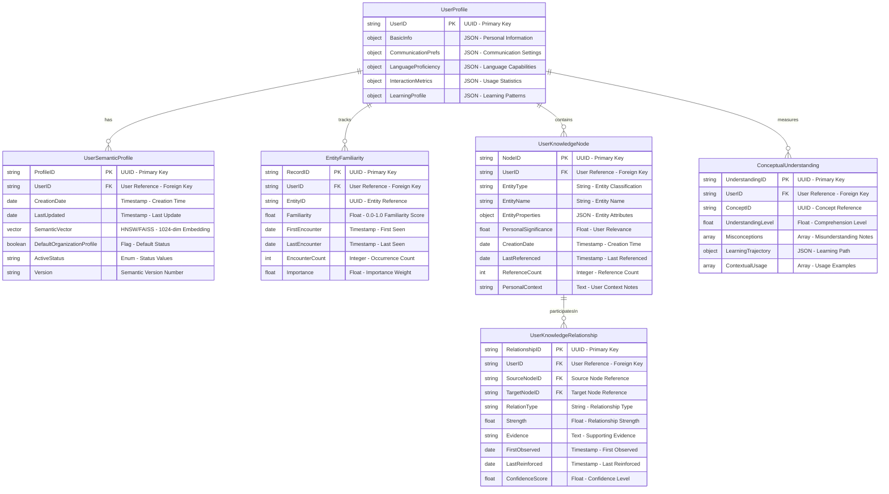

# Functional Architecture Design Document

**Version:** 1.0.2  
**Date:** May 7, 2025

## Table of Contents

1. [Executive Summary](#1-executive-summary)
2. [Introduction](#2-introduction)
3. [System Overview](#3-system-overview)
   - 3.1 [High-Level Architecture](#31-high-level-architecture)
   - 3.2 [Key Components](#32-key-components)
4. [Neural Core Platform](#4-neural-core-platform)
   - 4.1 [User-Specific Semantic Evolution](#41-user-specific-semantic-evolution)
   - 4.2 [Adaptive Communication](#42-adaptive-communication)
   - 4.3 [Multilingual Support](#43-multilingual-support)
   - 4.4 [Empathetic Response System](#44-empathetic-response-system)
   - 4.5 [Memory Management](#45-memory-management)
   - 4.6 [Dynamic Workflow Engine](#46-dynamic-workflow-engine)
5. [Master Control Protocol (MCP)](#5-master-control-protocol-mcp)
   - 5.1 [MCP Architecture](#51-mcp-architecture)
   - 5.2 [Agent-to-Agent Communication](#52-agent-to-agent-communication)
   - 5.3 [Workflow Orchestration Service](#53-workflow-orchestration-service)
6. [Agentic Products Architecture](#6-agentic-products-architecture)
   - 6.1 [Product Isolation](#61-product-isolation)
   - 6.2 [Product Integration](#62-product-integration)
   - 6.3 [Workflow Template Repository](#63-workflow-template-repository)
7. [Database Architecture](#7-database-architecture)
   - 7.1 [Workflow State Database](#71-workflow-state-database)
8. [Key Functional Flows](#8-key-functional-flows)
   - 8.1 [Conversation Processing Flow](#81-conversation-processing-flow)
   - 8.2 [User-Organization Semantic Fallback Flow](#82-user-organization-semantic-fallback-flow)
   - 8.3 [Memory Management Flow](#83-memory-management-flow)
   - 8.4 [Dynamic Workflow Execution Flow](#84-dynamic-workflow-execution-flow)
9. [Integration Architecture](#9-integration-architecture)
10. [Deployment Architecture](#10-deployment-architecture)
11. [Testing Architecture](#11-testing-architecture)
12. [Implementation Roadmap](#12-implementation-roadmap)
13. [Conclusion](#13-conclusion)

## 1. Executive Summary

This Functional Architecture Design Document details the comprehensive design for a Neural Core Platform with extensible Agentic AI Products. The system is designed as a modular, scalable platform that enables conversation intelligence with advanced capabilities, including user-specific semantic evolution, adaptive communication, multilingual support, empathetic responses, robust memory management, and dynamic workflow orchestration.

The architecture separates core conversation capabilities (Neural Core) from specialized domain functionality (Agentic Products), connected through a Master Control Protocol (MCP) that facilitates orchestration and Agent-to-Agent (A2A) communication. This separation allows for independent development, deployment, and scaling of components while maintaining a cohesive user experience.

The enhanced design introduces a dynamic workflow engine that enables the system to orchestrate complex processes across agents, adapting to changing conditions and user needs in real-time. This allows for sophisticated automated workflows that can be triggered by conversation intents or system events.

The system is designed to provide personalized interactions that adapt to individual users while maintaining organizational knowledge boundaries and privacy requirements. The platform supports multiple deployment configurations across cloud-native, hybrid, and on-premises environments.

## 2. Introduction

The ME.AI Neural Core represents a next-generation architecture for intelligent conversation systems that can understand, adapt to, and assist users through natural language interactions. This document provides a detailed architectural blueprint for implementing this vision.

### Purpose and Goals

The Neural Core architecture aims to achieve several key objectives:

1. Enable personalized, contextually aware conversations that adapt to individual users
2. Facilitate organization-specific knowledge and capabilities while maintaining privacy
3. Support dynamic orchestration of complex workflows triggered by conversation
4. Provide enterprise-grade integration capabilities for business systems
5. Scale independently across components to optimize resource utilization
6. Support multi-channel interactions including chat and voice
7. Maintain conversation context across sessions and time periods
8. Deliver emotionally intelligent responses based on user state
9. Work effectively across multiple languages and cultural contexts

### Technical Approach

The architecture follows several key principles:

1. **Modular Design**: Components are designed with clear boundaries and interfaces
2. **Separation of Concerns**: Core conversation intelligence is separate from domain-specific capabilities
3. **Extensibility**: New Agentic Products can be added without modifying the core platform
4. **Scalability**: Components can scale independently based on demand
5. **Adaptability**: The system learns and adapts to users over time
6. **Integration**: Well-defined integration points enable connectivity with enterprise systems
7. **Resilience**: Fault tolerance is built into the design at multiple levels

### Technical Stack Overview

The implementation leverages modern cloud-native technologies:

| Category | Technologies |
|----------|-------------|
| Frontend | React, Angular, WebSockets, WebRTC |
| Backend | Microservices, Containerization, Kubernetes |
| AI/ML | Transformer Models, Vector Embeddings, Knowledge Graphs |
| Databases | PostgreSQL, Redis, MongoDB, Neo4j, Vector Databases |
| Integration | API Gateways, Event Buses, Webhooks, Adapters |
| Workflow | Temporal.io, Camunda, BPMN |
| Messaging | Kafka, RabbitMQ, gRPC |
| Security | OAuth, OIDC, JWT, mTLS |
| Observability | Prometheus, Grafana, OpenTelemetry |

## 3. System Overview

### 3.1 High-Level Architecture

The system consists of three primary layers: Client Interfaces, Neural Core Platform, and Agentic Products, connected through a Master Control Protocol.


#### High-Level Technical Stack

| Layer | Component | Technologies | Purpose |
|-------|-----------|--------------|---------|
| **Client Interfaces** | Chat Client | React, Angular, Vue.js, WebSockets, Socket.io | Real-time text-based communication interfaces |
| | Voice/Telephony | Twilio, Amazon Connect, WebRTC, VOIP SIP | Voice channel integration and processing |
| | Enterprise Systems | REST APIs, GraphQL, SOAP, ESB, Apache Camel | Enterprise system integration points |
| **Neural Core** | Access & Security | OAuth 2.0, OIDC, JWT, SAML, mTLS | Authentication, authorization, and security |
| | Conversation Processing | NLP Pipeline, Transformers, BERT, GPT models | Natural language understanding and generation |
| | Memory Management | Redis, MongoDB, Cassandra, Time-series DBs | Short-term, long-term, and cross-session memory |
| | User-Specific Semantics | Neo4j, TigerGraph, Knowledge Graphs, Word2Vec | Personalized semantic understanding |
| | Adaptive Communication | Context Adaptation, Fine-tuning, Personality Models | Communication style and preference adaptation |
| | Multilingual Support | Translation APIs, Language Detection, i18n | Cross-language communication capabilities |
| | Empathetic Response | Sentiment Analysis, Emotion Detection, NLG | Emotionally intelligent interactions |
| | Dynamic Workflow | Temporal.io, Camunda, Apache Airflow, BPMN | Orchestration of adaptable processes |
| | Core Databases | PostgreSQL, MySQL, Neo4j, Vector DBs, Time-series DBs | Structured and unstructured data storage |
| **MCP** | Agent Orchestration | gRPC, Protocol Buffers, Service Registry | Agent discovery and coordination |
| | Cross-Product Comm. | Kafka, RabbitMQ, NATS, AWS SNS/SQS | Asynchronous messaging between products |
| | Request Routing | Envoy, Istio, Kong, NGINX, HAProxy | Traffic routing and load balancing |
| | Workflow Orchestration | Camunda, Temporal.io, Apache Airflow | Cross-product workflow coordination |
| **Agentic Products** | Domain-Specific Agents | Microservices, Domain-Specific ML Models | Specialized functionality for domains |
| | Storage | PostgreSQL, MongoDB, Specialized Stores | Domain-specific data storage |
| | Integration | API Gateways, ESB, Message Brokers | External system integration |
| | Domain Logic | Business Rules Engines, Expert Systems | Domain-specific business logic |

## Neural Core Platform Use Case Diagram


#### System Data Flow Diagram


### 3.2 Key Components

The system consists of these primary components:

1. **Neural Core Platform**: The foundation of the system, providing:
   - Authentication and security
   - Conversation processing
   - Memory management
   - User-specific semantic evolution
   - Adaptive communication
   - Multilingual support
   - Empathetic response generation
   - Dynamic workflow engine

2. **Master Control Protocol (MCP)**: Orchestration layer responsible for:
   - Agent discovery and registration
   - Task planning and execution
   - Message routing between agents
   - Cross-product coordination
   - Workflow orchestration service

3. **Agentic Products**: Domain-specific extensions providing:
   - Specialized agent capabilities
   - Domain-specific knowledge
   - Task execution frameworks
   - Product-specific storage
   - Workflow template repository

4. **Database Architecture**: Multi-layered storage strategy for:
   - User profiles and preferences
   - Conversation history
   - Semantic knowledge
   - Memory management
   - Linguistic resources
   - Empathy engine data
   - Workflow state database

## 4. Neural Core Platform

### 4.1 User-Specific Semantic Evolution

The User-Specific Semantic Evolution system builds and maintains personalized semantic understanding for each user.



#### Semantic Evolution Data Flow Diagram


#### User-Specific Semantic Evolution Technical Stack

| Component | Technologies | Implementation Details |
|-----------|--------------|------------------------|
| Knowledge Representation | Neo4j, TigerGraph, Property Graphs | Graph-based knowledge structures with properties |
| Vector Embeddings | BERT, Word2Vec, Sentence Transformers | Entity and concept embeddings in vector space |
| Vector Storage | Pinecone, Weaviate, Milvus, FAISS | Vector databases with similarity search |
| Semantic Matching | HNSW, ANN, cosine similarity | Approximate nearest neighbor algorithms |
| Entity Recognition | NER, BERT-based entity extraction | Identification of entities in conversations |
| Relationship Mining | Dependency parsing, semantic role labeling | Extracting relationships between entities |
| Persistence | PostgreSQL with pgvector, MongoDB | Storage of semantic profiles and relationships |
| Confidence Scoring | Bayesian models, ML confidence scoring | Determining confidence in relationships |
| User Profiling | Collaborative filtering, clustering | Building personalized user profiles |
| Concept Hierarchy | Ontologies, taxonomies, knowledge graphs | Structured concept organization |

#### Semantic Evolution Use Case Diagram


### 4.2 Adaptive Communication

The Adaptive Communication system adjusts communication style to match user preferences and detected proficiency levels.


#### Adaptive Communication Technical Stack

| Component | Technologies | Implementation Details |
|-----------|--------------|------------------------|
| Input Processing | BERT, RoBERTa, transformer-based NLP | Natural language understanding pipeline |
| Context Retrieval | Redis, DynamoDB, key-value stores | Fast retrieval of conversation context |
| User Profiling | GraphQL, REST APIs, profile databases | Access to comprehensive user profiles |
| Communication Style | ML classifiers, LSTMs, transformers | Detection and selection of communication styles |
| Language Selection | FastText, CLD3, language detection | Identifying and selecting appropriate language |
| Technical Matching | Domain ontologies, expertise models | Matching content to user's technical level |
| Cultural Adaptation | Cultural models, localization | Culturally appropriate communication |
| Content Generation | LLMs, template engines, NLG | Generation of appropriate responses |
| Linguistic Styling | Style transfer models, templates | Applying appropriate linguistic style |
| Response Analysis | Sentiment analysis, feedback collection | Analyzing user reactions to responses |
| Learning Integration | ML feedback loops, reinforcement learning | Learning from user interactions |
| Pattern Detection | Clustering, association rules | Finding patterns in user communications |
| Preference Updates | Bayesian models, ML profiling | Updating user preferences based on feedback |

#### Adaptive Communication Use Case Diagram


#### Adaptive Communication Data Flow Diagram


### 4.3 Multilingual Support

The Multilingual Support system enables natural interactions across different languages with appropriate cultural nuances.


#### Multilingual Support Technical Stack

| Component | Technologies | Implementation Details |
|-----------|--------------|------------------------|
| Language Detection | FastText, CLD3, langdetect | Identification of input language |
| Dialect Identification | Fine-tuned BERT models, n-gram analysis | Recognition of regional dialects |
| Translation Services | Google Translate API, DeepL API, MarianMT | Cross-language translation |
| Multilingual Models | XLM-RoBERTa, mBERT, M2M-100 | Unified models for multiple languages |
| Cultural References | Cultural knowledge graphs, cultural ontologies | Culture-specific references and context |
| Idiom Management | Idiom repositories, expression mapping | Translation of non-literal expressions |
| Formality Control | Formality classification, register analysis | Appropriate formality level adaptation |
| Speech Processing | Whisper, Mozilla TTS, eSpeak | Multilingual speech processing |
| Linguistic Resources | WordNet, ConceptNet, BabelNet | Cross-language lexical resources |
| Linguistic Code-Switching | Code-switching detection, bilingual embedding | Managing language mixing |
| Proficiency Adaptation | Readability metrics, vocabulary control | Adapting to user language proficiency |

#### Multilingual Support Use Case Diagram


#### Multilingual Support Data Flow Diagram


### 4.4 Empathetic Response System

The Empathetic Response System enables emotionally intelligent interactions that recognize and respond appropriately to user emotions.


#### Empathetic Response Technical Stack

| Component | Technologies | Implementation Details |
|-----------|--------------|------------------------|
| Sentiment Analysis | VADER, TextBlob, IBM Watson Tone Analyzer | Identification of emotional tone in text |
| Emotion Recognition | DeepFace (visual), Librosa (audio), RoBERTa (text) | Multi-modal emotion detection |
| Historical Analysis | LSTM networks, temporal pattern recognition | Detecting emotional patterns over time |
| Cultural Mapping | Cross-cultural emotion models, cultural database | Culture-specific emotional expression |
| Emotional Mirroring | Neural matching, emotional resonance models | Appropriate emotional reflection |
| Response Formulation | Therapeutic language templates, counseling models | Creating empathetic responses |
| Tone Calibration | Style transfer, sentiment-controlled generation | Adjusting tone to emotional context |
| Situational Awareness | Context engines, situation modeling | Understanding emotional context |
| Response Measurement | Effectiveness metrics, emotional impact | Measuring empathetic effectiveness |
| Reinforcement Learning | RL models, human feedback integration | Improving empathetic responses |

#### Empathetic Response Use Case Diagram


#### Empathetic Response Data Flow Diagram


### 4.5 Memory Management

The Memory Management system maintains conversation context across different time spans and interaction sessions.


#### Memory Management Technical Stack

| Component | Technologies | Implementation Details |
|-----------|--------------|------------------------|
| Short-term Memory | Redis, Memcached, in-memory data structures | Fast access to recent conversation context |
| Cross-session Memory | MongoDB, DynamoDB, Cassandra, session stores | Persistence of context across sessions |
| Semantic Memory | Neo4j, TigerGraph, vector databases | Long-term semantic knowledge storage |
| Vector Storage | Pinecone, Weaviate, Milvus, pgvector | Storage and retrieval of vector embeddings |
| Attentional Mechanisms | Transformer attention, relevance scoring | Focusing on important context elements |
| Memory Indexing | Inverted indices, vector indices, hybrid search | Efficient retrieval of relevant memory |
| Time-series Storage | TimescaleDB, InfluxDB, time-based partitioning | Temporal storage of interaction data |
| Summarization | LLM-based summarization, progressive compression | Condensing verbose information |
| Retrieval | RAG (Retrieval Augmented Generation), hybrid search | Context retrieval for conversations |
| Forgetting | TTL mechanisms, LRU caching, importance-based retention | Managing memory capacity |

#### Memory Management Use Case Diagram


#### Memory Management Data Flow Diagram


### 4.6 Dynamic Workflow Engine

The Dynamic Workflow Engine enables the orchestration of flexible, adaptable processes based on conversation context and user needs.


#### Key Functional Characteristics:

1. **Workflow Definition Designer**:
   - Visual workflow creation interface
   - Drag-and-drop workflow components
   - Conditional branching definition
   - Parameter configuration
   - Version control for workflow templates

2. **Workflow Execution Components**:
   - Task Sequencing Engine: Manages the order of task execution
   - Conditional Path Manager: Determines execution paths based on conditions
   - Parallel Execution Module: Handles concurrent task execution
   - Task Mapping Module: Maps abstract tasks to concrete agent actions
   - Rollback & Handling Manager: Manages failures and exceptions

3. **Workflow Monitoring System**:
   - Workflow Tracking Service: Monitors active workflows
   - Progress Tracking Service: Tracks completion status
   - Notification Management Service: Sends alerts and updates
   - Workflow Analytics Service: Analyzes performance and patterns

4. **Workflow Integration Services**:
   - Agent Integration Service: Connects workflows to agents
   - External System Integration: Links to external systems
   - User Notification Interface: Communicates with users
   - Data Transformation Workflow: Converts data between formats

#### Dynamic Workflow Engine Technical Stack

| Component | Technologies | Implementation Details |
|-----------|--------------|------------------------|
| Workflow Definition | BPMN 2.0, YAML, JSON Schema, DSL | Defining workflow structure and logic |
| Workflow Designer | Web-based BPMN editors, drag-and-drop interfaces | User interface for workflow creation |
| Workflow Engine | Temporal.io, Camunda, Apache Airflow, Netflix Conductor | Execution of workflow definitions |
| Rules Engine | Drools, CLIPS, native rule implementations | Conditional logic evaluation |
| State Management | Redis, etcd, ZooKeeper, PostgreSQL | Workflow state persistence |
| Event Processing | Kafka, RabbitMQ, NATS | Event-based workflow triggers |
| Task Execution | Actor model, microservices | Distributed task execution |
| Service Discovery | etcd, Consul, Kubernetes Service | Discovering task executors |
| Monitoring | Prometheus, Grafana, OpenTelemetry | Workflow execution monitoring |
| Fault Tolerance | Saga pattern, compensation transactions | Error handling and recovery |
| User Notification | WebSockets, webhook callbacks, email | Informing users of progress |

#### Dynamic Workflow Use Case Diagram


#### Dynamic Workflow Data Flow Diagram

```mermaid
sequenceDiagram
    participant User
    participant CT as Conversation Trigger
    participant WS as Workflow Selection
    participant WI as Workflow Instantiation
    participant TE as Task Execution
    participant SM as State Management
    participant PT as Progress Tracking
    participant NS as Notification Service
    participant EH as Error Handling
    
    Note over User, EH: Workflow Initiation Phase
    User->>CT: Initiate conversation
    CT->>WS: Forward intent/event
    
    Note over WS, WI: Selection & Setup Phase
    SM->>WS: Provide historical data for context
    WS->>WI: Select appropriate workflow template
    WI->>TE: Create and initialize workflow instance
    
    Note over TE, SM: Execution Phase
    activate TE
    
    loop Execution Cycle
        TE->>SM: Update execution state
        SM->>TE: Return current state information
        TE->>PT: Report task completion
        
        opt Notification
            PT->>NS: Send progress updates
            NS->>User: Notify user of progress
        end
        
        opt Exception Occurs
            TE->>EH: Send exception information
            EH->>TE: Provide recovery actions
        end
    end
    
    deactivate TE
    
    Note over SM, WS: Completion & Learning
    SM->>WS: Update historical data for future selections
    
    Note over User, EH: Workflow Complete
```

## 5. Master Control Protocol (MCP)

### 5.1 MCP Architecture

The Master Control Protocol (MCP) provides the orchestration layer between the Neural Core and Agentic Products.

```mermaid
flowchart TD
    subgraph CC["CORE COMPONENTS"]
        ARS[Agent Registry Service - etcd/Consul]
        TS[Task Scheduler - Kubernetes Jobs]
        RA[Resource Allocator - Kubernetes Resources]
        MB[Message Bus - Kafka/RabbitMQ]
        EH[Error Handler - Dead Letter Queue]
        SM[State Manager - Redis/etcd]
    end
    
    CC --> OS
    
    subgraph OS["ORCHESTRATION SERVICES"]
        DWE[Dynamic Workflow Engine - Temporal.io]
        APS[Adaptive Planning Service - ML Planning]
        CRS[Conflict Resolution Service - Rule Engine]
        PEM[Parallel Execution Manager - Actor Model]
        PMS[Priority Management Service - Priority Queue]
        TMS[Timeout Management Service - TTL Management]
    end
    
    OS --> MC
    
    subgraph MC["MONITORING & CONTROL"]
        PM[Performance Monitoring - Prometheus/Grafana]
        SG[Security Gateway - OAuth/mTLS]
        OS2[Observability Service - OpenTelemetry]
        AS[Audit Service - Immutable Log]
        RLS[Rate Limiting Service - Redis/Token Bucket]
        CB[Circuit Breaker - Resilience4j/Hystrix]
    end
    
    MC --> SM2[Service Mesh - Istio/Linkerd]
    
    classDef blue fill:#2374ab,stroke:#000,stroke-width:1px,color:#fff
    classDef green fill:#41b883,stroke:#000,stroke-width:1px,color:#fff
    classDef orange fill:#ff8c00,stroke:#000,stroke-width:1px,color:#fff
    classDef tech fill:#f9f,stroke:#333,stroke-width:1px
    
    class CC blue
    class OS green
    class MC orange
    class ARS,MB,DWE,PM,SG,SM2 tech
```

#### MCP Technical Stack

| Component | Technologies | Implementation Details |
|-----------|--------------|------------------------|
| Service Registry | etcd, Consul, Kubernetes Service | Agent and service discovery |
| Messaging | Kafka, RabbitMQ, NATS | Asynchronous messaging between components |
| Task Scheduling | Kubernetes Jobs, Quartz, cron systems | Scheduling of tasks and workflows |
| Resource Management | Kubernetes Resources, custom allocators | Allocation of compute and memory resources |
| State Management | Redis, etcd, ZooKeeper | Distributed state management |
| Workflow Engine | Temporal.io, Camunda, Apache Airflow | Orchestration of workflow execution |
| Planning | ML-based planning systems, heuristic planners | Determining optimal task sequences |
| Conflict Resolution | Rule engines, constraint solvers | Resolving resource and logic conflicts |
| Service Mesh | Istio, Linkerd, Consul Connect | Network-layer service communication |
| Security | OAuth 2.0, mTLS, JWT, OPA | Authentication and authorization |
| Observability | Prometheus, Grafana, Jaeger, OpenTelemetry | Monitoring and tracing |
| Resilience | Circuit breaker, bulkhead, retry patterns | Service resilience and fault tolerance |

#### MCP Use Case Diagram

```mermaid
sequenceDiagram
    participant NC as Neural Core
    participant AR as Agent Registry
    participant MR as Message Router
    participant WC as Workflow Coordinator
    participant PM as Performance Monitor
    participant RM as Resource Manager
    participant SE as Security Enforcer
    participant AP as Agentic Product
    participant Admin as Administrator
    
    Note over NC, AP: Agent Discovery Phase
    NC->>AR: Request agent discovery (UC1)
    AP->>AR: Register agent capabilities (UC1)
    AR->>NC: Return available agents
    AR->>AP: Confirm registration
    
    Note over NC, AP: Message Routing Phase
    par Security Enforcement
        Admin->>SE: Configure security policies (UC6)
        SE->>MR: Apply security rules to routing
    end
    
    NC->>MR: Send message to agent (UC2)
    MR->>MR: Apply security verification
    MR->>AP: Route message to appropriate agent
    AP->>MR: Return response
    MR->>NC: Deliver agent response
    
    Note over NC, AP: Workflow Coordination Phase
    par Resource Management
        Admin->>RM: Configure resource allocation (UC5)
        RM->>WC: Provide resource constraints
    end
    
    NC->>WC: Request workflow execution (UC3)
    WC->>WC: Apply resource constraints
    WC->>AP: Coordinate task execution
    AP->>WC: Report task completion
    WC->>NC: Return workflow results
    
    Note over NC, Admin: Monitoring Phase
    WC->>PM: Report workflow performance (UC4)
    Admin->>PM: Request performance metrics (UC4)
    PM->>Admin: Provide performance dashboard
    
    Note over NC, Admin: Continuous Operation Loop
```

#### MCP Data Flow Diagram

```mermaid
sequenceDiagram
    participant NC as Neural Core
    participant AR as Agent Registry
    participant MR as Message Router
    participant TS as Task Scheduler
    participant WE as Workflow Engine
    participant RA as Resource Allocator
    participant AP as Agentic Products
    
    Note over NC, AP: Discovery Phase
    NC->>AR: Query for available agents
    AR->>AR: Maintain agent registry
    AR->>MR: Provide agent location information
    
    Note over NC, AP: Simple Message Flow
    NC->>MR: Send message to agent
    MR->>AP: Deliver message to appropriate agent
    AP->>MR: Return result message
    MR->>NC: Route response back to core
    
    Note over NC, AP: Complex Workflow Execution
    NC->>TS: Schedule complex task execution
    
    par Orchestration and Resource Management
        TS->>WE: Forward task for orchestration
        WE->>RA: Request necessary resources
        RA->>AP: Allocate resources to products
    end
    
    WE->>AP: Coordinate workflow execution
    AP->>MR: Return workflow results
    MR->>NC: Route workflow results to core
    
    Note over NC, AP: Continuous Operation Cycle
```

### 5.2 Agent-to-Agent Communication

The Agent-to-Agent (A2A) Communication architecture enables secure, standardized communication between agents across products.

```mermaid
flowchart TD
    subgraph MCP["MASTER CONTROL PROTOCOL"]
        AR[Agent Registry - Service Registry]
        MR[Message Router - Event Router]
        PE[Protocol Enforcement - Schema Validation]
        SD[Service Discovery - DNS/Kubernetes Service]
        SA[Security & Authentication - JWT/mTLS]
        ML[Monitoring & Logging - Distributed Tracing]
    end
    
    MCP --> CC
    
    subgraph CC["COMMUNICATION CHANNELS"]
        SC[Synchronous Communication - gRPC/REST]
        AC[Asynchronous Communication - Kafka/SQS]
        PS[Publish-Subscribe - MQTT/NATS]
    end
    
    CC --> MF
    
    subgraph MF["MESSAGE FORMATS"]
        SMF[Standard Message Format - Protocol Buffers/Avro]
        SMT[Specialized Message Types - Domain-specific Schemas]
    end
    
    MF --> SI[Serialization/Deserialization - JSON/Binary]
    
    classDef blue fill:#2374ab,stroke:#000,stroke-width:1px,color:#fff
    classDef green fill:#41b883,stroke:#000,stroke-width:1px,color:#fff
    classDef orange fill:#ff8c00,stroke:#000,stroke-width:1px,color:#fff
    classDef tech fill:#f9f,stroke:#333,stroke-width:1px
    
    class MCP blue
    class CC green
    class MF orange
    class SC,AC,PS,SMF,SI tech
```

#### Agent-to-Agent Communication Technical Stack

| Component | Technologies | Implementation Details |
|-----------|--------------|------------------------|
| Service Registry | etcd, Consul, Kubernetes Service | Registration and discovery of agents |
| Message Routing | Event routers, message brokers | Routing messages between agents |
| Protocol Enforcement | Schema validation, API gateways | Ensuring message format compliance |
| Service Discovery | DNS-SD, Kubernetes Services, Consul | Finding available agents |
| Security | JWT, mTLS, API Keys, OAuth 2.0 | Secure agent communication |
| Synchronous Comm | gRPC, REST, GraphQL | Request-response communication |
| Asynchronous Comm | Kafka, RabbitMQ, AWS SQS, Google Pub/Sub | Event-based communication |
| Pub/Sub | MQTT, NATS, Redis Pub/Sub, Kafka topics | Topic-based communication |
| Message Formats | Protocol Buffers, Avro, JSON Schema | Message structure definition |
| Serialization | JSON, Binary formats, MessagePack | Message encoding/decoding |
| Monitoring | OpenTelemetry, Jaeger, Zipkin | Tracing communication flows |
| Resilience | Acknowledgments, Dead Letter Queues, Idempotency | Reliable message delivery |

#### Agent-to-Agent Communication Use Case Diagram

```mermaid
sequenceDiagram
    participant Agent1 as Agent 1
    participant AR as Agent Registry
    participant MS as Messaging Service
    participant EB as Event Bus
    participant MO as Monitoring Service
    participant Agent2 as Agent 2
    participant Admin as Administrator
    
    Note over Agent1, Agent2: Registration Phase
    Agent1->>AR: Register capabilities (UC1)
    Agent2->>AR: Register capabilities (UC1)
    
    Note over Agent1, Agent2: Discovery Phase
    Agent1->>AR: Discover available agents (UC2)
    AR->>Agent1: Return agent directory
    Agent2->>AR: Discover available agents (UC2)
    AR->>Agent2: Return agent directory
    
    Note over Agent1, Agent2: Event Subscription
    Agent2->>EB: Subscribe to topic (UC5)
    
    Note over Agent1, Agent2: Communication Phase
    par Synchronous Communication
        Agent1->>MS: Send synchronous request to Agent2 (UC3)
        MS->>Agent2: Deliver request
        Agent2->>MS: Return response
        MS->>Agent1: Deliver response
    and Asynchronous Communication
        Agent1->>EB: Publish event to topic (UC4)
        EB->>Agent2: Deliver event to subscriber
    end
    
    Note over Agent1, Admin: Monitoring Phase
    MO->>AR: Monitor registration activities
    MO->>MS: Monitor request/response patterns
    MO->>EB: Monitor publish/subscribe activities
    Admin->>MO: Access communication analytics (UC6)
    MO->>Admin: Provide monitoring dashboard
    
    Note over Agent1, Admin: Continuous Communication Cycle
```

#### Agent-to-Agent Communication Data Flow Diagram

```mermaid
sequenceDiagram
    participant A1 as Agent 1
    participant AR as Agent Registry
    participant SG as Security Gateway
    participant MR as Message Router
    participant MB as Message Broker
    participant A2 as Agent 2
    
    Note over A1, A2: Registration & Discovery Phase
    A1->>AR: Register capabilities
    A2->>AR: Register capabilities (implied)
    A1->>AR: Discover available agents
    AR->>A1: Return agent information
    
    Note over A1, A2: Secure Synchronous Communication
    A1->>SG: Request authentication
    SG->>SG: Validate credentials
    SG->>MR: Forward authorized message
    MR->>A2: Deliver synchronous request
    A2->>A2: Process request
    A2->>MR: Return synchronous response
    MR->>A1: Deliver response
    
    Note over A1, A2: Asynchronous Event Communication
    A1->>MB: Publish event
    Note right of MB: Event persisted and distributed
    MB->>A2: Deliver event notification
    
    Note over A1, A2: Complete Communication Cycle
```

### 5.3 Workflow Orchestration Service

The Workflow Orchestration Service coordinates the execution of workflows across agents and products.

```mermaid
flowchart TD
    subgraph WOS["WORKFLOW ORCHESTRATION SERVICE"]
        WRM[Workflow Registry Manager - Workflow Catalog]
        WIM[Workflow Instance Manager - Instance Tracker]
        WTM[Workflow Template Manager - Version Control]
        WEM[Workflow Execution Monitor - Status Tracking]
    end
    
    WOS --> SCL
    
    subgraph SCL["STATE COORDINATION LAYER"]
        SSM[Shared State Manager - Distributed Cache]
        TLM[Transaction Lock Manager - Distributed Locks]
        SHM[State History Manager - Append-Only Log]
        DCM[Distributed Consistency Manager - Consensus Protocol]
    end
    
    SCL --> EHL
    
    subgraph EHL["EVENT HANDLING LAYER"]
        EPM[Event Processing Manager - Event Processor]
        ERM[Event Routing Manager - Event Router]
        EHM[Event History Manager - Event Store]
        CSE[Complex Event Processor - CEP Engine]
    end
    
    EHL --> AGL
    
    subgraph AGL["AGENT COORDINATION LAYER"]
        ACM[Agent Capability Matcher - Capability Registry]
        ATD[Agent Task Dispatcher - Task Distribution]
        ARS[Agent Response Synchronizer - Response Aggregator]
        AFH[Agent Failure Handler - Failure Recovery]
    end
    
    AGL --> DTRM[Distributed Transaction - Saga/2PC]
    
    classDef blue fill:#2374ab,stroke:#000,stroke-width:1px,color:#fff
    classDef green fill:#41b883,stroke:#000,stroke-width:1px,color:#fff
    classDef orange fill:#ff8c00,stroke:#000,stroke-width:1px,color:#fff
    classDef purple fill:#8e44ad,stroke:#000,stroke-width:1px,color:#fff
    classDef tech fill:#f9f,stroke:#333,stroke-width:1px
    
    class WOS blue
    class SCL green
    class EHL orange
    class AGL purple
    class SSM,TLM,EPM,CSE,DTRM tech
```

#### Key Functional Characteristics:

1. **Workflow Orchestration Service**:
   - Workflow Registry Manager: Maintains catalog of available workflows
   - Workflow Instance Manager: Tracks active workflow instances
   - Workflow Template Manager: Manages workflow templates and versions
   - Workflow Execution Monitor: Monitors workflow execution status

2. **State Coordination Layer**:
   - Shared State Manager: Manages workflow state across components
   - Transaction Lock Manager: Ensures data consistency during execution
   - State History Manager: Maintains history of state changes
   - Distributed Consistency Manager: Ensures state consistency across nodes

3. **Event Handling Layer**:
   - Event Processing Manager: Processes workflow events
   - Event Routing Manager: Routes events to appropriate handlers
   - Event History Manager: Maintains event history
   - Complex Event Processor: Identifies patterns in event streams

4. **Agent Coordination Layer**:
   - Agent Capability Matcher: Matches tasks to agent capabilities
   - Agent Task Dispatcher: Dispatches tasks to agents
   - Agent Response Synchronizer: Synchronizes agent responses
   - Agent Failure Handler: Handles agent failures and retries

#### Workflow Orchestration Technical Stack

| Component | Technologies | Implementation Details |
|-----------|--------------|------------------------|
| Workflow Registry | Workflow catalog services, template registry | Maintaining workflow definitions |
| Instance Tracking | Instance databases, state tracking services | Tracking active workflow instances |
| Template Management | Version control, Git-based systems | Managing workflow template versions |
| State Management | Redis, etcd, ZooKeeper | Distributed state management |
| Distributed Locking | Redis locks, etcd locks, database locks | Ensuring exclusive access |
| State History | Append-only logs, event sourcing | Maintaining execution history |
| Consistency | Consensus algorithms (Raft, Paxos), CRDTs | Ensuring state consistency |
| Event Processing | Kafka, RabbitMQ, event processors | Processing workflow events |
| Event Routing | Event routers, topic-based routing | Routing events to handlers |
| Event History | EventStoreDB, event logs | Storing event history |
| Complex Event Processing | Esper, Flink CEP, custom CEP engines | Detecting event patterns |
| Capability Matching | Capability registries, matching algorithms | Matching tasks to capabilities |
| Distributed Transactions | Saga pattern, 2-phase commit, outbox pattern | Ensuring transactional integrity |

#### Workflow Orchestration Use Case Diagram

```mermaid
sequenceDiagram
    participant AP as Agentic Product
    participant TR as Template Registry
    participant NC as Neural Core
    participant WI as Workflow Instantiator
    participant TC as Task Coordinator
    participant SM as State Manager
    participant EH as Event Handler
    participant MS as Monitoring Service
    participant Admin as Administrator
    
    Note over AP, TR: Template Registration Phase
    AP->>TR: Register workflow template (UC1)
    TR->>TR: Validate and store template
    
    Note over NC, WI: Instantiation Phase
    NC->>TR: Request template
    TR->>NC: Return template definition
    NC->>WI: Request workflow instantiation (UC2)
    WI->>WI: Configure workflow instance
    WI->>TC: Create executable workflow instance
    
    Note over NC, EH: Execution Phase
    activate TC
    
    par Coordination and State Management
        NC->>TC: Submit task request (UC3)
        AP->>TC: Provide domain capabilities (UC3)
        TC->>SM: Update workflow state (UC4)
        SM->>TC: Return current state information
    end
    
    TC->>EH: Generate workflow event (UC5)
    EH->>EH: Process event
    EH->>TC: Provide event-driven instructions
    
    loop Task Execution Cycle
        TC->>AP: Assign task to product
        AP->>TC: Return task results
        TC->>SM: Update workflow state
        
        opt Event Triggering
            TC->>EH: Generate workflow event
            EH->>TC: Provide handling instructions
        end
        
        TC->>MS: Report execution progress (UC6)
    end
    
    deactivate TC
    
    Note over Admin, MS: Monitoring Phase
    Admin->>MS: Request workflow status (UC6)
    MS->>Admin: Provide execution metrics
    
    Note over AP, Admin: Workflow Lifecycle Complete
```

#### Workflow Orchestration Data Flow Diagram

```mermaid
sequenceDiagram
    participant WT as Workflow Template
    participant WI as Workflow Instance
    participant SM as State Manager
    participant EB as Event Bus
    participant TD as Task Dispatcher
    participant AP as Agent Pool
    participant RC as Response Collector
    participant MS as Monitoring Service
    
    Note over WT, WI: Instantiation Phase
    WT->>WI: Create workflow instance with template definition
    
    Note over WI, MS: Initialization Phase
    WI->>SM: Initialize workflow state
    SM->>WI: Return initial state information
    
    Note over WI, MS: Execution Phase
    activate WI
    
    WI->>EB: Publish workflow start event
    EB->>MS: Forward event metrics
    EB->>TD: Trigger initial task events
    
    loop Task Execution Cycle
        TD->>AP: Assign tasks to appropriate agents
        AP->>AP: Execute assigned tasks
        AP->>RC: Submit task completion results
        RC->>SM: Update workflow state with results
        SM->>MS: Report execution metrics
        SM->>WI: Provide updated state information
        
        alt Next Tasks Available
            WI->>EB: Publish task completion event
            EB->>TD: Trigger next task events
        else Workflow Complete
            WI->>EB: Publish workflow completion event
            EB->>MS: Report final workflow metrics
        end
    end
    
    deactivate WI
    
    Note over WT, MS: Workflow Lifecycle Complete
```

## 6. Agentic Products Architecture

### 6.1 Product Isolation

Each Agentic Product operates in isolation with its own domain-specific capabilities and databases.

```mermaid
   flowchart TD
       subgraph AOL["AGENT ORCHESTRATION LAYER"]
           TP[Task Planner - Planning Algorithm]
           AS[Agent Selector - Capability Matching]
           EC[Execution Coordinator - Workflow Engine]
       end
       
       AOL --> SA
       
       subgraph SA["SPECIALIZED AGENTS"]
           IRA[Information Retrieval Agents - Vector Search]
           TPA[Transaction Processing Agents - ACID Compliance]
           IA[Integration Agents - API Adapters]
           DSA[Domain-Specific Agents - Expert Systems]
           DMA[Decision-Making Agents - Logic/Rules Engine]
           NA[Notification Agents - Message Dispatchers]
       end
       
       SA --> AC
       
       subgraph AC["AGENT CAPABILITIES"]
           BAI[Backend API Integration - API Gateway]
           DQE[Database Query Execution - Query Processor]
           ESI[External Service Integration - Service Connectors]
           DG[Document Generation - Template Engine]
           WA[Workflow Automation - Process Automation]
           LA[Learning & Adaptation - Reinforcement Learning]
       end
       
       AC --> AO
       
       subgraph AO["AGENT OVERSIGHT"]
           SC[Security Controls - Policy Enforcement]
           CR[Compliance Rules - Regulatory Framework]
           PM[Performance Monitoring - Metrics Collection]
           LA2[Logging & Auditing - Audit Trail]
           ET[Explainability Tools - Explanation Generation]
           HS[Human Supervision - Human-in-the-loop]
       end
       
       AC --> NSB[Namespace Boundary - Kubernetes Namespace]
       
       classDef blue fill:#2374ab,stroke:#000,stroke-width:1px,color:#fff
       classDef green fill:#41b883,stroke:#000,stroke-width:1px,color:#fff
       classDef orange fill:#ff8c00,stroke:#000,stroke-width:1px,color:#fff
       classDef purple fill:#8e44ad,stroke:#000,stroke-width:1px,color:#fff
       classDef tech fill:#f9f,stroke:#333,stroke-width:1px
       
       class AOL blue
       class SA green
       class AC orange
       class AO purple
       class IRA,BAI,SC,NSB tech
```

#### Product Isolation Technical Stack

| Component | Technologies | Implementation Details |
|-----------|--------------|------------------------|
| Task Planning | Planning algorithms, task schedulers | Planning agent activities |
| Agent Selection | Capability matching, load balancing | Selecting appropriate agents |
| Execution Coordination | Workflow engines, orchestration services | Coordinating agent execution |
| Information Retrieval | Vector search, semantic search, RAG | Retrieving relevant information |
| Transaction Processing | ACID transactions, transaction managers | Processing business transactions |
| Integration | API adapters, message transformers | Integrating with external systems |
| API Integration | API gateways, API clients | Connecting to backend APIs |
| Database Access | Query processors, ORM, data access layers | Accessing databases |
| Document Generation | Template engines, document generators | Creating documents and reports |
| Security Controls | Policy enforcement, access control | Implementing security measures |
| Compliance | Regulatory frameworks, compliance rules | Ensuring regulatory compliance |
| Monitoring | Metrics collection, alerting systems | Monitoring performance and health |
| Containerization | Docker, Kubernetes, namespace isolation | Isolating product resources |

#### Product Isolation Use Case Diagram

```mermaid
   graph LR
       %% Actors
       mcp((MCP))
       system((System))
       external((External System))
       admin((Administrator))
       
       %% Use Cases
       UC1[Receive Task]
       UC2[Select Agent]
       UC3[Execute Capability]
       UC4[Access Domain Knowledge]
       UC5[Integrate External System]
       UC6[Monitor Performance]
       
       %% Relationships
       mcp --> UC1
       system --> UC2
       system --> UC3
       system --> UC4
       external --> UC5
       admin --> UC6
       
       %% Use Case Relationships
       UC1 --> UC2
       UC2 --> UC3
       UC3 --> UC4
       UC3 --> UC5
       UC3 --> UC6
       
       %% Title and styling
       classDef actor fill:#f9f,stroke:#333,stroke-width:2px
       classDef usecase fill:#bbf,stroke:#333,stroke-width:1px,rx:10px,ry:10px
       
       class mcp,system,external,admin actor
       class UC1,UC2,UC3,UC4,UC5,UC6 usecase
       
       %% Add container to represent the Agentic Product
       subgraph AgenticProduct[Agentic Product]
           UC1
           UC2
           UC3
           UC4
           UC5
           UC6
       end
       
       style AgenticProduct fill:#f5f5f5,stroke:#666,stroke-width:2px,rx:5px,ry:5px
```

#### Product Isolation Data Flow Diagram

```mermaid
      flowchart LR
          mcp["MCP"]
          planner["Task Planner"]
          selector["Agent Selector"]
          agents["Agent Pool"]
          knowledge["Domain Knowledge"]
          database["Product Database"]
          external["External Systems"]
          monitoring["Monitoring Service"]
          
          mcp --> |Task Request| planner
          planner --> |Task Plan| selector
          selector --> |Agent Selection| agents
          agents --> |Knowledge Query| knowledge
          agents --> |Data Operations| database
          agents --> |Integration Calls| external
          agents --> |Task Results| mcp
          agents --> |Performance Metrics| monitoring
          monitoring --> |Status Reports| mcp
          
          classDef component fill:#f5f5f5,stroke:#333,stroke-width:1px,rx:5px,ry:5px
          class mcp,planner,selector,agents,knowledge,database,external,monitoring component
```

### 6.2 Product Integration

Each Agentic Product integrates with the Neural Core and other products through standardized interfaces.

```mermaid
   flowchart TD
       subgraph II["INTEGRATION INTERFACES"]
           SI[Semantic Interface - Knowledge API]
           CI[Conversation Interface - Conversation API]
           CTI[Context Interface - Context API]
           AI[Authentication Interface - Auth API]
           PI[Product Interface - Product API]
           UI[User Interface - UI Components]
       end
       
       II --> DS
       
       subgraph DS["DATA SYNCHRONIZATION"]
           CDC[Change Data Capture - Debezium/Kafka Connect]
           ES[Event Streaming - Kafka/Kinesis]
           PS[Periodic Synchronization - Batch Processing]
           CR[Conflict Resolution - CRDT/OT]
           TM[Transaction Management - Distributed Transactions]
           CI2[Cache Invalidation - Cache Invalidation Patterns]
       end
       
       DS --> SI2
       
       subgraph SI2["SERVICE INTEGRATION"]
           AG[API Gateway - Kong/Ambassador]
           SM[Service Mesh - Istio/Linkerd]
           SP[Sidecar Proxies - Envoy]
           CB[Circuit Breaker - Hystrix/Resilience4j]
           LB[Load Balancing - Client-side/Server-side]
           RM[Retry Mechanisms - Exponential Backoff]
       end
       
       SI2 --> APV[API Versioning - Semantic Versioning]
       
       classDef blue fill:#2374ab,stroke:#000,stroke-width:1px,color:#fff
       classDef green fill:#41b883,stroke:#000,stroke-width:1px,color:#fff
       classDef orange fill:#ff8c00,stroke:#000,stroke-width:1px,color:#fff
       classDef tech fill:#f9f,stroke:#333,stroke-width:1px
       
       class II blue
       class DS green
       class SI2 orange
       class CDC,ES,AG,SM,APV tech
```

#### Product Integration Technical Stack

| Component | Technologies | Implementation Details |
|-----------|--------------|------------------------|
| Semantic Interface | Knowledge APIs, semantic APIs | Accessing semantic knowledge |
| Conversation Interface | Conversation APIs, dialog managers | Integrating with conversations |
| Context Interface | Context APIs, context managers | Accessing conversation context |
| Authentication Interface | Auth APIs, identity providers | Managing authentication |
| Change Data Capture | Debezium, Kafka Connect, database triggers | Capturing data changes |
| Event Streaming | Kafka, Kinesis, event buses | Streaming events between systems |
| Synchronization | Batch processing, ETL jobs | Periodic data synchronization |
| Conflict Resolution | CRDTs, OT (Operational Transformation) | Resolving data conflicts |
| API Gateway | Kong, Ambassador, AWS API Gateway | Managing API traffic |
| Service Mesh | Istio, Linkerd, Consul Connect | Service-to-service communication |
| Circuit Breaker | Hystrix, Resilience4j | Preventing cascading failures |
| Load Balancing | Client-side/server-side load balancers | Distributing traffic |
| API Versioning | Semantic versioning, version negotiation | Managing API changes |

#### Product Integration Use Case Diagram

```mermaid
graph LR
    %% Define actors
    core((Neural Core))
    productA((Product A))
    productB((Product B))
    admin((Administrator))
    
    %% Define use cases
    UC1[Exchange Semantic Knowledge]
    UC2[Share Conversation Context]
    UC3[Authenticate Request]
    UC4[Synchronize Data]
    UC5[Exchange Events] 
    UC6[Monitor Integration Health]
    
    %% Actor relationships with use cases
    core --> UC1
    core --> UC2
    core --> UC3
    productA --> UC1
    productA --> UC3
    productA --> UC4
    productA --> UC5
    productB --> UC1
    productB --> UC3
    productB --> UC4
    productB --> UC5
    admin --> UC6
    
    %% Dependencies between use cases
    UC3 --> UC1
    UC3 --> UC2
    UC3 --> UC4
    UC3 --> UC5
    
    %% Add container to represent the Product Integration system
    subgraph ProductIntegration[Product Integration]
        UC1
        UC2
        UC3
        UC4
        UC5
        UC6
    end
    
    %% Styling
    classDef actor fill:#f9f,stroke:#333,stroke-width:2px
    classDef usecase fill:#bbf,stroke:#333,stroke-width:1px,rx:10px,ry:10px
    
    class core,productA,productB,admin actor
    class UC1,UC2,UC3,UC4,UC5,UC6 usecase
    style ProductIntegration fill:#f5f5f5,stroke:#666,stroke-width:2px,rx:5px,ry:5px
```

#### Product Integration Data Flow Diagram

```mermaid
   flowchart LR
       core["Neural Core"]
       interfaces["Integration Interfaces"]
       gateway["API Gateway"]
       events["Event Bus"]
       mesh["Service Mesh"]
       sync["Data Sync Service"]
       productA["Product A"]
       productB["Product B"]
       
       core --> |API Calls| interfaces
       interfaces --> |Routed Requests| gateway
       gateway --> |Service Routing| mesh
       mesh --> |Service Request| productA
       mesh --> |Service Request| productB
       productA --> |Event Publication| events
       events --> |Event Consumption| productB
       productA --> |Data Changes| sync
       sync --> |Synchronized Data| productB
       productA --> |Response Data| core
       productB --> |Response Data| core
       
       classDef component fill:#f5f5f5,stroke:#333,stroke-width:1px,rx:5px,ry:5px
       class core,interfaces,gateway,events,mesh,sync,productA,productB component
```

### 6.3 Workflow Template Repository

The Workflow Template Repository provides reusable workflow templates for common business processes.

```mermaid
      flowchart TD
          subgraph WTR["WORKFLOW TEMPLATE REPOSITORY"]
              WTC[Workflow Template Catalog - Template Registry]
              WVM[Workflow Version Manager - Git/Version Control]
              WTL[Workflow Template Library - Template Store]
              DWB[Domain Workflow Builder - Workflow Composer]
          end
          
          WTR --> TMF
          
          subgraph TMF["TEMPLATE METADATA FRAMEWORK"]
              PD[Parameter Definitions - Schema Definitions]
              ID[Integration Descriptors - Integration Specs]
              CD[Compatibility Descriptors - Compatibility Matrix]
              RM[Resource Manifests - Resource Requirements]
          end
          
          TMF --> WTE
          
          subgraph WTE["WORKFLOW TESTING ENVIRONMENT"]
              WVT[Workflow Validation Tests - Test Suites]
              WST[Workflow Simulation Tool - Simulation Engine]
              WDT[Workflow Debugging Tools - Debug Tooling]
              WPT[Workflow Performance Tests - Performance Testing]
          end
          
          WTE --> WCT
          
          subgraph WCT["WORKFLOW CUSTOMIZATION TOOLS"]
              WCD[Workflow Cloning & Derivation - Template Forking]
              WEW[Workflow Extension Wizard - Extension Framework]
              WPS[Workflow Parameter Settings - Parameter Configuration]
              WTI[Workflow Trigger Integration - Trigger Framework]
          end
          
          WCT --> CIP[CI/CD Pipeline - Jenkins/GitHub Actions]
          
          classDef blue fill:#2374ab,stroke:#000,stroke-width:1px,color:#fff
          classDef green fill:#41b883,stroke:#000,stroke-width:1px,color:#fff
          classDef orange fill:#ff8c00,stroke:#000,stroke-width:1px,color:#fff
          classDef purple fill:#8e44ad,stroke:#000,stroke-width:1px,color:#fff
          classDef tech fill:#f9f,stroke:#333,stroke-width:1px
          
          class WTR blue
          class TMF green
          class WTE orange
          class WCT purple
          class WVM,WST,WCD,CIP tech
```

#### Key Functional Characteristics:

1. **Workflow Template Repository**:
   - Workflow Template Catalog: Indexed library of available templates
   - Workflow Version Manager: Tracks template versions and changes
   - Workflow Template Library: Stores template definitions
   - Domain Workflow Builder: Creates domain-specific workflow templates

2. **Template Metadata Framework**:
   - Parameter Definitions: Defines configurable workflow parameters
   - Integration Descriptors: Specifies integration requirements
   - Compatibility Descriptors: Defines compatibility constraints
   - Resource Manifests: Specifies resource requirements

3. **Workflow Testing Environment**:
   - Workflow Validation Tests: Verifies workflow correctness
   - Workflow Simulation Tool: Simulates workflow execution
   - Workflow Debugging Tools: Helps diagnose workflow issues
   - Workflow Performance Tests: Measures workflow efficiency

4. **Workflow Customization Tools**:
   - Workflow Cloning & Derivation: Creates variations of templates
   - Workflow Extension Wizard: Adds capabilities to workflows
   - Workflow Parameter Settings: Configures workflow parameters
   - Workflow Trigger Integration: Defines workflow activation triggers

#### Workflow Template Repository Technical Stack

| Component | Technologies | Implementation Details |
|-----------|--------------|------------------------|
| Template Catalog | Catalog services, search systems | Organizing workflow templates |
| Version Manager | Git, version control systems | Managing template versions |
| Template Library | Template storage, databases | Storing workflow templates |
| Workflow Builder | Workflow composers, DSLs | Creating workflow templates |
| Parameter Definitions | JSON Schema, parameter validators | Defining workflow parameters |
| Integration Descriptors | API specifications, connector definitions | Specifying integration points |
| Compatibility | Compatibility matrices, version compatibility | Managing template compatibility |
| Validation Tests | Test frameworks, test runners | Validating workflow correctness |
| Simulation | Workflow simulators, mock engines | Simulating workflow execution |
| Debugging Tools | Debuggers, step-through tools | Troubleshooting workflows |
| Performance Tests | Load generators, performance metrics | Testing workflow performance |
| Customization | Template inheritance, composition | Customizing workflow templates |
| CI/CD Pipeline | Jenkins, GitHub Actions, GitLab CI | Automating template deployment |

#### Workflow Template Repository Use Case Diagram

```mermaid
      graph LR
          %% Define actors
          designer((Workflow Designer))
          developer((Product Developer))
          admin((Administrator))
          
          %% Define use cases
          UC1[Create Workflow Template]
          UC2[Version Workflow Template]
          UC3[Test Workflow Template]
          UC4[Search for Templates]
          UC5[Customize Template]
          UC6[Deploy Template]
          
          %% Actor relationships with use cases
          designer --> UC1
          designer --> UC2
          designer --> UC3
          developer --> UC4
          developer --> UC5
          admin --> UC6
          
          %% Dependencies between use cases
          UC1 --> UC2
          UC2 --> UC3
          UC3 --> UC6
          UC4 --> UC5
          UC5 --> UC6
          
          %% Add container to represent the Workflow Template Repository
          subgraph WorkflowTemplateRepository[Workflow Template Repository]
              UC1
              UC2
              UC3
              UC4
              UC5
              UC6
          end
          
          %% Styling
          classDef actor fill:#f9f,stroke:#333,stroke-width:2px
          classDef usecase fill:#bbf,stroke:#333,stroke-width:1px,rx:10px,ry:10px
          
          class designer,developer,admin actor
          class UC1,UC2,UC3,UC4,UC5,UC6 usecase
          style WorkflowTemplateRepository fill:#f5f5f5,stroke:#666,stroke-width:2px,rx:5px,ry:5px
```

#### Workflow Template Repository Data Flow Diagram

```mermaid
         flowchart TD
             designer["Workflow Designer"]
             catalog["Template Catalog"]
             version["Version Manager"]
             library["Template Library"]
             testing["Testing Environment"]
             customization["Customization Tools"]
             cicd["CI/CD Pipeline"]
             deployment["Deployment Target"]
             
             designer --> |Template Registration| catalog
             designer --> |Version Management| version
             version --> |Template Storage| library
             library --> |Template Validation| testing
             testing --> |Test Results| version
             library --> |Template Retrieval| customization
             customization --> |Customized Template| version
             version --> |Deployment Request| cicd
             cicd --> |Template Deployment| deployment
             catalog --> |Template Search| designer
             
             classDef component fill:#f5f5f5,stroke:#333,stroke-width:1px,rx:5px,ry:5px
             class designer,catalog,version,library,testing,customization,cicd,deployment component
```

## 7. Database Architecture

### 7.1 Workflow State Database

The Workflow State Database maintains the state of active and historical workflows.

```mermaid
         erDiagram
          WorkflowDefinition ||--o{ WorkflowInstance : instantiates
          WorkflowInstance ||--o{ WorkflowTaskExecution : contains
          WorkflowInstance ||--o{ WorkflowStateTransition : records
          WorkflowInstance ||--o{ WorkflowVariable : uses
          WorkflowInstance ||--o{ WorkflowEvent : generates
          
          WorkflowDefinition {
              string DefinitionID PK
              string Name
              string Version
              json Definition
              date CreatedDate
              string CreatedBy
              boolean IsActive
              array Tags
              string Description
          }
          
          WorkflowInstance {
              string InstanceID PK
              string DefinitionID FK
              string Status
              date StartTime
              date EndTime
              string InitiatedBy
              string Priority
              json Context
              string ConversationID
          }
          
          WorkflowTaskExecution {
              string ExecutionID PK
              string InstanceID FK
              string TaskName
              string TaskType
              string Status
              date StartTime
              date EndTime
              string AssignedAgent
              json Parameters
              json Result
              string ErrorDetails
          }
          
          WorkflowStateTransition {
              string TransitionID PK
              string InstanceID FK
              string FromState
              string ToState
              date TransitionTime
              string Trigger
              json ContextSnapshot
          }
          
          WorkflowVariable {
              string VariableID PK
              string InstanceID FK
              string Name
              string DataType
              json Value
              date LastUpdated
              string Scope
          }
          
          WorkflowEvent {
              string EventID PK
              string InstanceID FK
              string EventType
              date Timestamp
              json Payload
              boolean Processed
              string SourceComponent
          }
```

#### Key Functional Characteristics:

1. **Workflow Definition**:
   - Stores the blueprint for workflows
   - Supports versioning for workflow evolution
   - Includes metadata for discovery and management
   - Maintains active/inactive status

2. **Workflow Instance**:
   - Represents a running or completed workflow
   - Tracks overall status and execution times
   - Maintains execution context
   - Links to conversation context

3. **Workflow Task Execution**:
   - Records individual task executions
   - Tracks task status, timing, and assignment
   - Stores task parameters and results
   - Captures error details for troubleshooting

4. **Workflow State Transition**:
   - Tracks workflow state changes
   - Records transition triggers
   - Maintains state history for auditing
   - Captures context snapshots at transition points

5. **Workflow Variable**:
   - Stores workflow execution variables
   - Supports different data types
   - Tracks value changes over time
   - Maintains variable scope information

6. **Workflow Event**:
   - Records significant workflow events
   - Supports event-based integration
   - Tracks event processing status
   - Identifies event sources

#### Workflow State Database Technical Stack

| Component | Technologies | Implementation Details |
|-----------|--------------|------------------------|
| Primary Database | PostgreSQL with JSONB, TimescaleDB, MongoDB | Storage of workflow state |
| Indexing | B-tree indices, GIN indices for JSONB | Efficient data retrieval |
| Archival Storage | Amazon S3, Google Cloud Storage, Azure Blob Storage | Long-term storage of historical data |
| Caching | Redis, Memcached | Fast access to active workflow state |
| Search | Elasticsearch, OpenSearch | Full-text search of workflow data |
| Event Store | EventStoreDB, Apache Kafka with compacted topics | Event storage and retrieval |
| Partitioning | Time-based partitioning, tenant-based sharding | Scaling database capacity |
| High Availability | Database replication, read replicas | Ensuring system availability |
| Backup | Point-in-time recovery, continuous backups | Data protection |
| Query Optimization | Execution plans, index tuning | Performance optimization |

#### Workflow State Database Use Case Diagram

```mermaid
   graph LR
       %% Define actors
       engine((Workflow Engine))
       monitoring((Monitoring System))
       admin((Administrator))
       
       %% Define use cases
       UC1[Store Workflow Definition]
       UC2[Track Workflow Instance]
       UC3[Record Task Execution]
       UC4[Manage State Transitions]
       UC5[Store Workflow Variables]
       UC6[Analyze Workflow Patterns]
       
       %% Actor relationships with use cases
       engine --> UC1
       engine --> UC2
       engine --> UC3
       engine --> UC4
       engine --> UC5
       monitoring --> UC2
       monitoring --> UC3
       admin --> UC6
       
       %% Dependencies between use cases
       UC1 --> UC2
       UC2 --> UC3
       UC2 --> UC4
       UC2 --> UC5
       UC4 --> UC6
       UC3 --> UC6
       
       %% Add container to represent the Workflow State Database
       subgraph WorkflowStateDatabase[Workflow State Database]
           UC1
           UC2
           UC3
           UC4
           UC5
           UC6
       end
       
       %% Styling
       classDef actor fill:#f9f,stroke:#333,stroke-width:2px
       classDef usecase fill:#bbf,stroke:#333,stroke-width:1px,rx:10px,ry:10px
       
       class engine,monitoring,admin actor
       class UC1,UC2,UC3,UC4,UC5,UC6 usecase
       style WorkflowStateDatabase fill:#f5f5f5,stroke:#666,stroke-width:2px,rx:5px,ry:5px
```

#### Workflow State Database Data Flow Diagram

```mermaid
   flowchart TD
       engine["Workflow Engine"]
       definition["Definition Store"]
       instance["Instance Store"]
       task["Task Store"]
       state["State Store"]
       variable["Variable Store"]
       event["Event Store"]
       monitoring["Monitoring System"]
       analytics["Analytics System"]
       
       engine --> |Store Definition| definition
       engine --> |Create/Update Instance| instance
       engine --> |Record Task Execution| task
       engine --> |Record State Transition| state
       engine --> |Store/Update Variables| variable
       engine --> |Record Events| event
       
       definition --> |Definition Reference| instance
       instance --> |Instance Reference| task
       instance --> |Instance Reference| state
       instance --> |Instance Reference| variable
       instance --> |Instance Reference| event
       
       monitoring --> |Query Status| instance
       monitoring --> |Query Execution| task
       monitoring --> |Query Transitions| state
       
       analytics --> |Historical Data| instance
       analytics --> |Performance Data| task
       analytics --> |Transition Patterns| state
       
       classDef component fill:#f5f5f5,stroke:#333,stroke-width:1px,rx:5px,ry:5px
       class engine,definition,instance,task,state,variable,event,monitoring,analytics component
```

## 8. Key Functional Flows

### 8.1 Conversation Processing Flow

The complete flow from user input to response generation.

```mermaid
   flowchart TD
       CI[Conversation Input - User Interface] --> AAA[Authentication & Authorization - OAuth/OIDC]
       AAA --> PPF
       
       subgraph PPF["PRE-PROCESSING FLOW"]
           STT[Speech-to-Text - Whisper/Google STT]
           LD[Language Detection - FastText/CLD3]
           ICP[Initial Context Preparation - Context Builder]
           STT --> LD --> ICP
       end
       
       PPF --> PF
       
       subgraph PF["PARALLEL PROCESSING FLOW"]
           subgraph UEB["USER EXPERIENCE BRANCH"]
               IE[Information Extraction - NER/Entity Recognition]
               SE[Semantic Enrichment - Knowledge Graph]
               UNS[UX Negotiation Service - User Preferences]
               IE --> SE --> UNS
           end
           
           subgraph AEB["AGENT EXECUTION BRANCH"]
               TP[Task Planning - Planning Algorithm]
               AE[Action Execution - Agent Framework]
               ST[Status Tracking - Status Monitor]
               TP --> AE --> ST
           end
       end
       
       PF --> MMF
       
       subgraph MMF["MEMORY MANAGEMENT FLOW"]
           MR[Memory Router - Memory Dispatcher]
           WM[Working Memory - Redis/In-Memory]
           TD[Transactional Database - PostgreSQL]
           EM[Episodic Memory - MongoDB/Document Store]
           SM[Semantic Memory - Vector Database]
           PD[Proprietary Database - Tenant DB]
           MR --> WM & TD
           TD --> EM & SM & PD
       end
       
       MMF --> RGF
       
       subgraph RGF["RESPONSE GENERATION FLOW"]
           CA[Context Assembly - Context Builder]
           RG[Response Generation - LLM/NLG]
           CSF[Channel-specific Formatting - Response Formatters]
           CA --> RG --> CSF
       end
       
       RGF --> CC
       
       subgraph CC["CONVERSATION CONTINUITY"]
           CSP[Conversation State Persistence - State Store]
           CM[Context Maintenance - Context Manager]
           AI[Analytics & Improvement - Analytics Pipeline]
           FB[Feedback - Feedback System]
           CSP --> CM --> AI --> FB
       end
       
       CC --> DWF
       
       subgraph DWF["DYNAMIC WORKFLOW FLOW"]
           ITA[Intent Analysis - Intent Classifier]
           WTS[Workflow Template Selection - Template Matcher]
           WI[Workflow Instantiation - Instance Creator]
           WE[Workflow Execution - Workflow Engine]
           ITA --> WTS --> WI --> WE
       end
       
       DWF --> UO[User Output - Response Delivery]
       
       RGF --> EH[Error Handling - Error Management]
       EH --> FR[Fallback Responses - Degraded Service]
       
       classDef blue fill:#2374ab,stroke:#000,stroke-width:1px,color:#fff
       classDef green fill:#41b883,stroke:#000,stroke-width:1px,color:#fff
       classDef orange fill:#ff8c00,stroke:#000,stroke-width:1px,color:#fff
       classDef purple fill:#8e44ad,stroke:#000,stroke-width:1px,color:#fff
       classDef red fill:#e74c3c,stroke:#000,stroke-width:1px,color:#fff
       classDef tech fill:#f9f,stroke:#333,stroke-width:1px
       
       class PPF blue
       class UEB green
       class AEB orange
       class MMF purple
       class RGF orange
       class CC green
       class DWF red
       class STT,LD,IE,SE,WM,SM,RG,ITA tech
```

#### Conversation Processing Technical Stack

| Component | Technologies | Implementation Details |
|-----------|--------------|------------------------|
| Authentication | OAuth 2.0, OIDC, JWT | User authentication and authorization |
| Speech-to-Text | Whisper, Google STT, Azure Speech | Converting voice to text |
| Language Detection | FastText, CLD3, language detection models | Identifying input language |
| Context Preparation | Context builders, context managers | Preparing conversation context |
| Information Extraction | NER, entity recognition, information extraction | Extracting entities and information |
| Semantic Enrichment | Knowledge graphs, semantic networks | Enriching with semantic information |
| Task Planning | Planning algorithms, task schedulers | Planning agent activities |
| Action Execution | Agent frameworks, action executors | Executing agent actions |
| Memory Management | Memory routers, memory systems | Managing conversation memory |
| Response Generation | LLMs, NLG, template engines | Generating responses |
| Channel Formatting | Response formatters, channel adapters | Formatting for delivery channels |
| State Persistence | State stores, persistence layers | Maintaining conversation state |
| Intent Analysis | Intent classifiers, intent detection | Identifying user intents |
| Workflow Management | Workflow engines, process automation | Managing business workflows |
| Error Handling | Error managers, recovery mechanisms | Handling system errors |

#### Conversation Processing Use Case Diagram

```mermaid
      graph LR
          %% Define actors
          user((User))
          system((System))
          
          %% Define use cases
          UC1[Process User Input]
          UC2[Extract Information]
          UC3[Execute Agent Actions]
          UC4[Manage Memory]
          UC5[Generate Response]
          UC6[Trigger Workflows]
          
          %% Actor relationships with use cases
          user --> UC1
          system --> UC2
          system --> UC3
          system --> UC4
          system --> UC5
          system --> UC6
          
          %% Dependencies between use cases
          UC1 --> UC2
          UC2 --> UC3
          UC2 --> UC6
          UC3 --> UC4
          UC4 --> UC5
          UC5 --> user
          
          %% Add container to represent the Conversation Processing
          subgraph ConversationProcessing[Conversation Processing]
              UC1
              UC2
              UC3
              UC4
              UC5
              UC6
          end
          
          %% Styling
          classDef actor fill:#f9f,stroke:#333,stroke-width:2px
          classDef usecase fill:#bbf,stroke:#333,stroke-width:1px,rx:10px,ry:10px
          
          class user,system actor
          class UC1,UC2,UC3,UC4,UC5,UC6 usecase
          style ConversationProcessing fill:#f5f5f5,stroke:#666,stroke-width:2px,rx:5px,ry:5px
```

#### Conversation Processing Data Flow Diagram

```mermaid
   flowchart TD
       input["User Input"]
       auth["Authentication"]
       preprocess["Preprocessing"]
       extract["Information Extraction"]
       agent["Agent Execution"]
       memory["Memory Management"]
       response["Response Generation"]
       workflow["Workflow Engine"]
       output["User Output"]
       
       input --> |User Input| auth
       auth --> |Authenticated Input| preprocess
       preprocess --> |Processed Input| extract
       extract --> |Extracted Information| agent
       extract --> |Intent/Trigger| workflow
       agent --> |Execution Results| memory
       memory --> |Context/Memory| response
       workflow --> |Workflow Status| response
       response --> |Formatted Response| output
       output --> |Continuous Conversation| input
       
       classDef component fill:#f5f5f5,stroke:#333,stroke-width:1px,rx:5px,ry:5px
       class input,auth,preprocess,extract,agent,memory,response,workflow,output component
```

### 8.2 User-Organization Semantic Fallback Flow

The flow for determining when to use user-specific semantic data versus organization defaults.

```mermaid
   flowchart TD
       UR[User Request - Natural Language] & CA[Context Analysis - Context Analyzer] --> SKRL
       
       subgraph SKRL["SEMANTIC KNOWLEDGE RETRIEVAL"]
           USS[User-Specific Semantics - User Knowledge Base] --> MA[Match Available? - Matching Algorithm]
           OS[Organization Semantics - Org Knowledge Base] --> MA
           MA -->|Yes| YB[YES BRANCH]
           MA -->|No| NB[NO BRANCH]
           YB --> UUS[Use User Semantics - User-Specific Knowledge]
           NB --> UOS[Use Org Semantics - Organization Knowledge]
           UUS & UOS --> CK[Combined Knowledge - Knowledge Integration]
       end
       
       SKRL --> SLP
       
       subgraph SLP["SEMANTIC LEARNING PROCESS"]
           DNSO[Detect New Semantics Opportunity - Learning Trigger]
           CUSR[Create User Semantic Records - Knowledge Creation]
           UUSP[Update User Semantic Profile - Profile Update]
           DNSO --> CUSR --> UUSP
       end
       
       classDef blue fill:#2374ab,stroke:#000,stroke-width:1px,color:#fff
       classDef green fill:#41b883,stroke:#000,stroke-width:1px,color:#fff
       classDef tech fill:#f9f,stroke:#333,stroke-width:1px
       
       class SKRL blue
       class SLP green
       class USS,OS,MA,DNSO tech
```

#### Semantic Fallback Technical Stack

| Component | Technologies | Implementation Details |
|-----------|--------------|------------------------|
| Context Analysis | Context analyzers, context extraction | Analyzing conversation context |
| User Semantics | User knowledge bases, personal knowledge | User-specific semantic information |
| Organization Semantics | Organizational knowledge bases, shared knowledge | Organization-wide semantic information |
| Matching Algorithm | Semantic matching, vector similarity | Finding semantic matches |
| Knowledge Integration | Knowledge integrators, knowledge fusion | Combining knowledge sources |
| Learning Trigger | Learning opportunity detection | Identifying learning opportunities |
| Knowledge Creation | Knowledge creation pipelines | Creating new semantic knowledge |
| Profile Update | Profile update mechanisms | Updating user semantic profiles |

#### Semantic Fallback Use Case Diagram

```mermaid
   graph LR
       %% Define actors
       user((User))
       system((System))
       
       %% Define use cases
       UC1[Analyze Request Context]
       UC2[Search User Semantics]
       UC3[Search Organization Semantics]
       UC4[Decide Knowledge Source]
       UC5[Combine Knowledge]
       UC6[Learn New Semantics]
       
       %% Actor relationships with use cases
       user --> UC1
       system --> UC2
       system --> UC3
       system --> UC4
       
       %% Dependencies between use cases
       UC1 --> UC2
       UC1 --> UC3
       UC1 --> UC6
       UC2 --> UC4
       UC3 --> UC4
       UC4 --> UC5
       UC5 --> user
       UC6 --> UC2
       
       %% Add container to represent the Semantic Fallback System
       subgraph SemanticFallbackSystem[Semantic Fallback System]
           UC1
           UC2
           UC3
           UC4
           UC5
           UC6
       end
       
       %% Styling
       classDef actor fill:#f9f,stroke:#333,stroke-width:2px
       classDef usecase fill:#bbf,stroke:#333,stroke-width:1px,rx:10px,ry:10px
       
       class user,system actor
       class UC1,UC2,UC3,UC4,UC5,UC6 usecase
       style SemanticFallbackSystem fill:#f5f5f5,stroke:#666,stroke-width:2px,rx:5px,ry:5px
```

#### Semantic Fallback Data Flow Diagram

```mermaid
   flowchart TD
       request["User Request"]
       context["Context Analysis"]
       user["User Semantics"]
       org["Organization Semantics"]
       decision["Matching Decision"]
       integration["Knowledge Integration"]
       response["Response Generation"]
       learning["Learning Process"]
       
       request --> |Request Content| context
       context --> |Context Information| user
       context --> |Context Information| org
       context --> |Learning Opportunities| learning
       user --> |User Matches| decision
       org --> |Org Matches| decision
       decision --> |Knowledge Selection| integration
       integration --> |Integrated Knowledge| response
       learning --> |Knowledge Updates| user
       response --> request
       
       classDef component fill:#f5f5f5,stroke:#333,stroke-width:1px,rx:5px,ry:5px
       class request,context,user,org,decision,integration,response,learning component
```

### 8.3 Memory Management Flow

The detailed flow for managing conversation memory across different time spans.

```mermaid
   flowchart TD
       subgraph MR["MEMORY ROUTER"]
           PBR[Priority-based Routing - Routing Algorithm]
           TTLM[TTL Management & Expiration - TTL Policies]
           SP[Storage Policy - Policy Engine]
       end
       
       MR --> IP
       
       subgraph IP["INPUT PROCESSING"]
           MTC[Memory Type Classification - Type Classifier]
           DP[Data Preparation - Data Processor]
           CL[Context Linking - Context Linker]
       end
       
       IP --> MO
       
       subgraph MO["MEMORY OPERATIONS"]
           WO[Write Operations - Write Handler]
           RO[Read Operations - Read Handler]
           UO[Update Operations - Update Handler]
           DO[Delete Operations - Delete Handler]
           CO[Compression Operations - Compression Engine]
           IO[Index Operations - Index Manager]
       end
       
       MO --> MD
       
       subgraph MD["MEMORY DESTINATIONS"]
           WM[Working Memory - Redis/In-Memory]
           STM[Short-term Memory - Cache Layer]
           LTM[Long-term Memory - Persistent Storage]
           EM[Episodic Memory - Time-series Storage]
           SM[Semantic Memory - Knowledge Graph]
           USM[User-Specific Memory - User Database]
       end
       
       MD --> MOP
       
       subgraph MOP["MEMORY OPTIMIZATION"]
           PS[Progressive Summarization - Summarizer]
           MC[Memory Consolidation - Consolidation Engine]
           GC[Garbage Collection - Resource Reclaimer]
       end
       
       classDef blue fill:#2374ab,stroke:#000,stroke-width:1px,color:#fff
       classDef green fill:#41b883,stroke:#000,stroke-width:1px,color:#fff
       classDef orange fill:#ff8c00,stroke:#000,stroke-width:1px,color:#fff
       classDef purple fill:#8e44ad,stroke:#000,stroke-width:1px,color:#fff
       classDef red fill:#e74c3c,stroke:#000,stroke-width:1px,color:#fff
       classDef tech fill:#f9f,stroke:#333,stroke-width:1px
       
       class MR blue
       class IP green
       class MO orange
       class MD purple
       class MOP red
       class PBR,TTLM,MTC,WO,WM,PS tech
```

#### Memory Management Flow Technical Stack

| Component | Technologies | Implementation Details |
|-----------|--------------|------------------------|
| Memory Router | Routing algorithms, policy engines | Routing memory operations |
| TTL Management | TTL policies, expiration mechanisms | Managing memory lifetime |
| Storage Policy | Policy engines, rule systems | Determining storage locations |
| Type Classification | Type classifiers, type detection | Classifying memory types |
| Data Preparation | Data processors, data transformers | Preparing data for storage |
| Memory Operations | CRUD handlers, operation managers | Performing memory operations |
| Working Memory | Redis, in-memory data structures | Very short-term memory |
| Short-term Memory | Cache layers, fast storage | Short-term memory |
| Long-term Memory | Persistent storage, databases | Long-term memory |
| Memory Optimization | Summarizers, consolidation engines | Optimizing memory usage |
| Garbage Collection | Resource reclaimers, cleanup processes | Reclaiming unused memory |

#### Memory Management Flow Use Case Diagram

```mermaid
   graph LR
       %% Define actors
       system((Conversation System))
       consumer((Memory Consumer))
       admin((Administrator))
       
       %% Define use cases
       UC1[Route Memory Operation]
       UC2[Process Memory Input]
       UC3[Execute Memory Operation]
       UC4[Store in Appropriate Destination]
       UC5[Optimize Memory Usage]
       UC6[Monitor Memory Health]
       
       %% Actor relationships with use cases
       system --> UC1
       system --> UC2
       system --> UC3
       consumer --> UC4
       admin --> UC5
       admin --> UC6
       
       %% Dependencies between use cases
       UC1 --> UC2
       UC2 --> UC3
       UC3 --> UC4
       UC4 --> UC5
       UC5 --> UC6
       
       %% Add container to represent the Memory Management Flow
       subgraph MemoryManagementFlow[Memory Management Flow]
           UC1
           UC2
           UC3
           UC4
           UC5
           UC6
       end
       
       %% Styling
       classDef actor fill:#f9f,stroke:#333,stroke-width:2px
       classDef usecase fill:#bbf,stroke:#333,stroke-width:1px,rx:10px,ry:10px
       
       class system,consumer,admin actor
       class UC1,UC2,UC3,UC4,UC5,UC6 usecase
       style MemoryManagementFlow fill:#f5f5f5,stroke:#666,stroke-width:2px,rx:5px,ry:5px
```

#### Memory Management Flow Data Flow Diagram

```mermaid
   flowchart TD
       system["Conversation System"]
       router["Memory Router"]
       processor["Input Processor"]
       operation["Operation Handler"]
       storage["Memory Storage"]
       optimization["Optimization Engine"]
       monitoring["Monitoring System"]
       
       system --> |Memory Request| router
       router --> |Routed Request| processor
       processor --> |Processed Data| operation
       operation --> |Storage Operation| storage
       storage --> |Operation Result| operation
       operation --> |Operation Response| system
       storage --> |Storage Metrics| optimization
       optimization --> |Optimization Actions| storage
       storage --> |Health Metrics| monitoring
       monitoring --> |Policy Updates| router
       
       classDef component fill:#f5f5f5,stroke:#333,stroke-width:1px,rx:5px,ry:5px
       class system,router,processor,operation,storage,optimization,monitoring component
```

### 8.4 Dynamic Workflow Execution Flow

The flow for executing dynamic workflows based on conversation context and user needs.

```mermaid
   flowchart TD
       UT[User Trigger - Conversation Intent] & ST[System Trigger - System Event] --> WIF
       
       subgraph WIF["WORKFLOW INITIATION FLOW"]
           TP[Trigger Processing - Event Processor]
           CA[Context Analysis - Context Analyzer]
           WS[Workflow Selection - Template Matcher]
           PS[Parameter Setting - Parameter Configuration]
           TP --> CA --> WS --> PS
       end
       
       WIF --> WEF
       
       subgraph WEF["WORKFLOW EXECUTION FLOW"]
           WI[Workflow Instantiation - Instance Creator]
           TS[Task Scheduling - Task Scheduler]
           TR[Task Routing - Task Router]
           TE[Task Execution - Task Executor]
           SR[Status Reporting - Status Reporter]
           WI --> TS --> TR --> TE --> SR
       end
       
       WEF --> BCF
       
       subgraph BCF["BRANCHING & CONTROL FLOW"]
           CD[Condition Determination - Condition Evaluator]
           BP[Branch Processing - Branch Handler]
           EP[Error Processing - Error Handler]
           CR[Compensation Routing - Compensation Manager]
           CD --> BP
           CD --> EP --> CR
       end
       
       BCF --> PIF
       
       subgraph PIF["PROGRESS & INTEGRATION FLOW"]
           PM[Progress Monitoring - Progress Monitor]
           NM[Notification Management - Notification Manager]
           DC[Data Collection - Data Collector]
           SI[System Integration - Integration Service]
           PM --> NM
           PM --> DC --> SI
       end
       
       PIF --> WCF
       
       subgraph WCF["WORKFLOW COMPLETION FLOW"]
           FC[Final Cleanup - Cleanup Service]
           SR2[State Recording - State Recorder]
           AR[Analytics Recording - Analytics Service]
           NS[Next Steps Determination - Next Steps Planner]
           FC --> SR2 --> AR --> NS
       end
       
       classDef blue fill:#2374ab,stroke:#000,stroke-width:1px,color:#fff
       classDef green fill:#41b883,stroke:#000,stroke-width:1px,color:#fff
       classDef orange fill:#ff8c00,stroke:#000,stroke-width:1px,color:#fff
       classDef purple fill:#8e44ad,stroke:#000,stroke-width:1px,color:#fff
       classDef red fill:#e74c3c,stroke:#000,stroke-width:1px,color:#fff
       classDef tech fill:#f9f,stroke:#333,stroke-width:1px
       
       class WIF blue
       class WEF green
       class BCF orange
       class PIF purple
       class WCF red
       class TP,CA,WI,TS,CD,PM,FC tech
```

#### Key Functional Characteristics:

1. **Workflow Initiation Flow**:
   - Trigger Processing: Handles user and system workflow triggers
   - Context Analysis: Analyzes conversation context for workflow selection
   - Workflow Selection: Selects appropriate workflow templates
   - Parameter Setting: Configures workflow parameters based on context

2. **Workflow Execution Flow**:
   - Workflow Instantiation: Creates workflow instances from templates
   - Task Scheduling: Schedules tasks for execution
   - Task Routing: Routes tasks to appropriate agents
   - Task Execution: Executes individual workflow tasks
   - Status Reporting: Reports task and workflow status

3. **Branching & Control Flow**:
   - Condition Determination: Evaluates conditions for branching
   - Branch Processing: Manages workflow branches
   - Error Processing: Handles workflow errors
   - Compensation Routing: Manages compensating actions for failures

4. **Progress & Integration Flow**:
   - Progress Monitoring: Tracks workflow progress
   - Notification Management: Manages notifications to users and systems
   - Data Collection: Collects data from workflow execution
   - System Integration: Integrates with external systems

5. **Workflow Completion Flow**:
   - Final Cleanup: Performs cleanup actions
   - State Recording: Records final workflow state
   - Analytics Recording: Captures workflow analytics
   - Next Steps Determination: Identifies follow-up actions

#### Dynamic Workflow Execution Technical Stack

| Component | Technologies | Implementation Details |
|-----------|--------------|------------------------|
| Trigger Processing | Event processors, event handlers | Processing workflow triggers |
| Context Analysis | Context analyzers, context extraction | Analyzing conversation context |
| Workflow Selection | Template matchers, selection algorithms | Selecting appropriate workflows |
| Parameter Setting | Parameter configurators, parameter validators | Setting workflow parameters |
| Workflow Instantiation | Instance creators, instance managers | Creating workflow instances |
| Task Scheduling | Task schedulers, job schedulers | Scheduling workflow tasks |
| Task Routing | Task routers, routing algorithms | Routing tasks to agents |
| Task Execution | Task executors, execution engines | Executing workflow tasks |
| Condition Evaluation | Condition evaluators, rule engines | Evaluating branching conditions |
| Error Handling | Error handlers, error recovery | Handling execution errors |
| Compensation | Compensation managers, compensation actions | Managing compensating transactions |
| Progress Monitoring | Progress monitors, monitoring services | Tracking workflow progress |
| Notification | Notification managers, notification services | Managing user notifications |
| Integration | Integration services, system connectors | Integrating with external systems |
| Completion | Cleanup services, completion handlers | Completing workflows |

#### Dynamic Workflow Execution Use Case Diagram

```mermaid
graph LR
    %% Define actors
    user((User))
    system((System))
    external((External System))
    
    %% Define use cases
    UC1[Process Workflow Trigger]
    UC2[Select Workflow Template]
    UC3[Execute Workflow Tasks]
    UC4[Handle Branching Logic]
    UC5[Monitor Progress]
    UC6[Complete Workflow]
    
    %% Actor relationships with use cases
    user --> UC1
    system --> UC1
    system --> UC2
    system --> UC3
    system --> UC4
    system --> UC5
    external --> UC3
    system --> UC6
    
    %% Dependencies between use cases
    UC1 --> UC2
    UC2 --> UC3
    UC3 --> UC4
    UC4 --> UC3
    UC3 --> UC5
    UC5 --> UC6
    UC6 --> user
    UC6 --> external
    
    %% Add container to represent the Dynamic Workflow Execution
    subgraph DynamicWorkflowExecution[Dynamic Workflow Execution]
        UC1
        UC2
        UC3
        UC4
        UC5
        UC6
    end
    
    %% Styling
    classDef actor fill:#f9f,stroke:#333,stroke-width:2px
    classDef usecase fill:#bbf,stroke:#333,stroke-width:1px,rx:10px,ry:10px
    
    class user,system,external actor
    class UC1,UC2,UC3,UC4,UC5,UC6 usecase
    style DynamicWorkflowExecution fill:#f5f5f5,stroke:#666,stroke-width:2px,rx:5px,ry:5px
```

#### Dynamic Workflow Execution Data Flow Diagram

```mermaid
flowchart TD
    trigger["Trigger Source"]
    context["Context Analyzer"]
    selector["Template Selector"]
    parameter["Parameter Configurator"]
    engine["Workflow Engine"]
    router["Task Router"]
    agents["Agent Pool"]
    condition["Condition Evaluator"]
    monitor["Progress Monitor"]
    notification["Notification Service"]
    external["External Systems"]
    completion["Completion Handler"]
    
    trigger --> |Trigger Event| context
    context --> |Context Information| selector
    selector --> |Selected Template| parameter
    parameter --> |Configured Workflow| engine
    engine --> |Task Assignment| router
    router --> |Routed Tasks| agents
    agents --> |Task Results| engine
    engine --> |Execution State| condition
    condition --> |Branch Decision| engine
    engine --> |Execution Progress| monitor
    monitor --> |Progress Updates| notification
    engine --> |Integration Calls| external
    external --> |External Results| engine
    engine --> |Workflow Completion| completion
    completion --> |Completion Notification| notification
    
    classDef component fill:#f5f5f5,stroke:#333,stroke-width:1px,rx:5px,ry:5px
    class trigger,context,selector,parameter,engine,router,agents,condition,monitor,notification,external,completion component
```

## 9. Integration Architecture

The system integrates with external systems through well-defined integration points.

```mermaid
flowchart TD
    subgraph IP["INTEGRATION PATTERNS"]
        ABI[API-based Integration - REST/GraphQL/SOAP]
        EDI[Event-driven Integration - Kafka/EventBridge]
        FBI[File-based Integration - SFTP/S3]
        MBI[Message-based Integration - JMS/AMQP]
        DBI[Database Integration - JDBC/ODBC]
        WI[Webhook Integration - HTTP Callbacks]
    end
    
    IP --> IE
    
    subgraph IE["INTEGRATION ENDPOINTS"]
        CRMS[External CRM Systems - Salesforce/Dynamics]
        AS[Authentication Systems - AD/LDAP/SAML]
        KBS[Knowledge Base Systems - Confluence/SharePoint]
        ERPS[ERP Systems - SAP/Oracle]
        TS[Ticketing Systems - JIRA/ServiceNow]
        TES[Telephony Systems - Twilio/Asterisk]
    end
    
    IE --> IS
    
    subgraph IS["INTEGRATION SERVICES"]
        AG[API Gateway - Kong/Apigee]
        MB[Message Broker - Kafka/RabbitMQ]
        EB[Event Bus - EventBridge/Event Grid]
        DI[Data Integration - ETL/CDC]
        AS2[Authentication Service - Auth Server]
        TS2[Transformation Service - Mapping Service]
    end
    
    IS --> ISEC
    
    subgraph ISEC["INTEGRATION SECURITY"]
        ASG[API Security Gateway - WAF/Gateway]
        DE[Data Encryption - TLS/Encryption]
        AA[Authentication & Authorization - OAuth/OIDC]
        AT[Audit Trail - Audit Service]
        RL[Rate Limiting - Rate Limiter]
        TP[Threat Protection - Security Service]
    end
    
    classDef blue fill:#2374ab,stroke:#000,stroke-width:1px,color:#fff
    classDef green fill:#41b883,stroke:#000,stroke-width:1px,color:#fff
    classDef orange fill:#ff8c00,stroke:#000,stroke-width:1px,color:#fff
    classDef purple fill:#8e44ad,stroke:#000,stroke-width:1px,color:#fff
    classDef tech fill:#f9f,stroke:#333,stroke-width:1px
    
    class IP blue
    class IE green
    class IS orange
    class ISEC purple
    class ABI,EDI,CRMS,AG,MB,ASG,DE tech
```

#### Integration Architecture Technical Stack

| Component | Technologies | Implementation Details |
|-----------|--------------|------------------------|
| API Integration | REST, GraphQL, SOAP, gRPC | API-based integration |
| Event Integration | Kafka, AWS EventBridge, Azure Event Grid | Event-driven integration |
| File Integration | SFTP, S3, file shares | File-based integration |
| Message Integration | JMS, AMQP, messaging protocols | Message-based integration |
| Database Integration | JDBC, ODBC, database connectors | Direct database integration |
| Webhook Integration | HTTP callbacks, webhook receivers | Webhook-based integration |
| CRM Integration | Salesforce, Dynamics, HubSpot | CRM system integration |
| ERP Integration | SAP, Oracle, Microsoft Dynamics | ERP system integration |
| API Gateway | Kong, Apigee, AWS API Gateway | API traffic management |
| Message Broker | Kafka, RabbitMQ, ActiveMQ | Message routing and delivery |
| Data Integration | ETL tools, CDC tools, data pipelines | Data transformation and integration |
| Security Gateway | WAF, API security gateways | API security protection |
| Authentication | OAuth 2.0, OIDC, SAML | Authentication and authorization |
| Encryption | TLS, encryption libraries | Data protection |

#### Integration Architecture Use Case Diagram

```mermaid
graph LR
    %% Define actors
    core((Neural Core))
    product((Agentic Product))
    external((External System))
    admin((Administrator))
    
    %% Define use cases
    UC1[Connect via API]
    UC2[Exchange Events]
    UC3[Transfer Files]
    UC4[Send/Receive Messages] 
    UC5[Secure Communications]
    UC6[Monitor Integration Health]
    
    %% Actor relationships with use cases
    core --> UC1
    core --> UC2
    product --> UC1
    product --> UC3
    product --> UC4
    external --> UC1
    external --> UC2
    external --> UC3
    external --> UC4
    admin --> UC5
    admin --> UC6
    
    %% Dependencies between use cases
    UC1 --> UC5
    UC2 --> UC5
    UC3 --> UC5
    UC4 --> UC5
    UC5 --> UC6
    
    %% Add container to represent the Integration Architecture
    subgraph IntegrationArchitecture[Integration Architecture]
        UC1
        UC2
        UC3
        UC4
        UC5
        UC6
    end
    
    %% Styling
    classDef actor fill:#f9f,stroke:#333,stroke-width:2px
    classDef usecase fill:#bbf,stroke:#333,stroke-width:1px,rx:10px,ry:10px
    
    class core,product,external,admin actor
    class UC1,UC2,UC3,UC4,UC5,UC6 usecase
    style IntegrationArchitecture fill:#f5f5f5,stroke:#666,stroke-width:2px,rx:5px,ry:5px
```

#### Integration Architecture Data Flow Diagram

```mermaid
flowchart TD
    core["Neural Core"]
    products["Agentic Products"]
    gateway["API Gateway"]
    broker["Message Broker"]
    file["File Transfer"]
    data["Data Integration"]
    security["Security Layer"]
    external["External Systems"]
    monitoring["Monitoring"]
    
    core --> |API Requests| gateway
    products --> |API Requests| gateway
    core --> |Event Publication| broker
    products --> |Event Publication| broker
    products --> |File Transfer| file
    
    gateway --> |Security Validation| security
    broker --> |Security Validation| security
    file --> |Security Validation| security
    
    security --> |Secure Communication| external
    external --> |Response/Events| security
    
    security --> |Validated Responses| gateway
    security --> |Validated Events| broker
    security --> |Validated Files| file
    
    gateway --> |API Responses| core
    gateway --> |API Responses| products
    broker --> |Event Notifications| core
    broker --> |Event Notifications| products
    file --> |Received Files| products
    
    gateway --> |Gateway Metrics| monitoring
    broker --> |Broker Metrics| monitoring
    file --> |Transfer Metrics| monitoring
    security --> |Security Metrics| monitoring
    
    classDef component fill:#f5f5f5,stroke:#333,stroke-width:1px,rx:5px,ry:5px
    class core,products,gateway,broker,file,data,security,external,monitoring component
```

## 10. Deployment Architecture

The system supports multiple deployment models across cloud and on-premises environments.

```mermaid
flowchart TD
    subgraph MED["MULTI-ENVIRONMENT DEPLOYMENT"]
        DE[Development Environment - Dev Cluster]
        TE[Testing Environment - Test Cluster]
        SE[Staging Environment - Staging Cluster]
        PE[Production Environment - Production Cluster]
    end
    
    MED --> KCP
    
    subgraph KCP["KUBERNETES CLUSTER (PRODUCTION)"]
        subgraph IL["INGRESS LAYER"]
            LB[Load Balancer - NGINX/HAProxy]
            AG[API Gateway - Kong/Ambassador]
            DP[DDoS Protection - CloudFlare/AWS Shield]
        end
        
        subgraph SM["SERVICE MESH"]
            SM1[Service Mesh Components - Istio/Linkerd]
        end
        
        subgraph AS["APPLICATION SERVICES"]
            ASM[Authentication Microservice - Auth Service]
            CP[Conversation Processing - NLP Service]
            AAO[AI Agent Orchestration - Agent Service]
            SES[Semantic Enrichment Service - Knowledge Service]
            UNS[UX Negotiation Service - UX Service]
            MRS[Memory Router Service - Memory Service]
            DWE[Dynamic Workflow Engine - Workflow Service]
        end
        
        subgraph DS["DATA SERVICES"]
            RC[Redis Cluster - In-Memory Cache]
            PG[PostgreSQL - Relational Database]
            N4J[Neo4j Cluster - Graph Database]
            ES[Elasticsearch - Search Engine]
            VDB[Vector DB - Pinecone/Weaviate]
            ODB[Organization-specific DB - Tenant Database]
        end
        
        subgraph PS["PLATFORM SERVICES"]
            MON[Monitoring - Prometheus/Grafana]
            LOG[Logging - ELK/Loki]
            CICD[CI/CD Pipeline - Jenkins/GitHub Actions]
        end
        
        IL --> SM --> AS
        AS --> DS
        PS -.- AS
    end
    
    classDef blue fill:#2374ab,stroke:#000,stroke-width:1px,color:#fff
    classDef green fill:#41b883,stroke:#000,stroke-width:1px,color:#fff
    classDef orange fill:#ff8c00,stroke:#000,stroke-width:1px,color:#fff
    classDef purple fill:#8e44ad,stroke:#000,stroke-width:1px,color:#fff
    classDef red fill:#e74c3c,stroke:#000,stroke-width:1px,color:#fff
    classDef tech fill:#f9f,stroke:#333,stroke-width:1px
    
    class MED blue
    class IL green
    class SM orange
    class AS purple
    class DS red
    class PS orange
    class LB,SM1,ASM,RC,PG,MON tech
```

#### Deployment Architecture Technical Stack

| Component | Technologies | Implementation Details |
|-----------|--------------|------------------------|
| Container Orchestration | Kubernetes, Docker Swarm | Managing containerized workloads |
| Container Runtime | Docker, containerd, CRI-O | Running containers |
| Ingress Control | NGINX, HAProxy, Traefik | Managing inbound traffic |
| API Gateway | Kong, Ambassador, AWS API Gateway | API traffic management |
| DDoS Protection | CloudFlare, AWS Shield, Azure DDoS Protection | Protection against DDoS attacks |
| Service Mesh | Istio, Linkerd, Consul Connect | Service-to-service communication |
| In-Memory Cache | Redis, Memcached | Fast data access |
| Relational Database | PostgreSQL, MySQL, Aurora | Structured data storage |
| Graph Database | Neo4j, TigerGraph, Amazon Neptune | Graph data storage |
| Search Engine | Elasticsearch, OpenSearch, Solr | Full-text search |
| Vector Database | Pinecone, Weaviate, Milvus, Qdrant | Vector data storage |
| Monitoring | Prometheus, Grafana, Datadog | System monitoring |
| Logging | ELK Stack, Loki, Graylog | Log management |
| CI/CD | Jenkins, GitHub Actions, GitLab CI | Continuous integration and deployment |
| Infrastructure as Code | Terraform, Pulumi, CloudFormation | Infrastructure provisioning |
| Configuration Management | Ansible, Puppet, Chef | Configuration management |

#### Deployment Architecture Use Case Diagram

```mermaid
graph LR
    %% Define actors
    devops((DevOps Engineer))
    platform((Platform Engineer))
    admin((Administrator))
    user((End User))
    
    %% Define use cases
    UC1[Deploy Environment]
    UC2[Manage Kubernetes Cluster]
    UC3[Scale Services]
    UC4[Monitor System Health]
    UC5[Manage Data Services]
    UC6[Access Application]
    
    %% Actor relationships with use cases
    devops --> UC1
    platform --> UC2
    platform --> UC3
    admin --> UC4
    admin --> UC5
    user --> UC6
    
    %% Dependencies between use cases
    UC1 --> UC2
    UC2 --> UC3
    UC2 --> UC4
    UC2 --> UC5
    UC5 --> UC6
    UC3 --> UC4
    
    %% Add container to represent the Deployment Architecture
    subgraph DeploymentArchitecture[Deployment Architecture]
        UC1
        UC2
        UC3
        UC4
        UC5
        UC6
    end
    
    %% Styling
    classDef actor fill:#f9f,stroke:#333,stroke-width:2px
    classDef usecase fill:#bbf,stroke:#333,stroke-width:1px,rx:10px,ry:10px
    
    class devops,platform,admin,user actor
    class UC1,UC2,UC3,UC4,UC5,UC6 usecase
    style DeploymentArchitecture fill:#f5f5f5,stroke:#666,stroke-width:2px,rx:5px,ry:5px
```

#### Deployment Architecture Data Flow Diagram

```mermaid
flowchart TD
    traffic["User Traffic"]
    loadbalancer["Load Balancer"]
    gateway["API Gateway"]
    mesh["Service Mesh"]
    services["Application Services"]
    data["Data Services"]
    monitoring["Monitoring System"]
    cicd["CI/CD Pipeline"]
    iac["Infrastructure as Code"]
    
    traffic --> |User Requests| loadbalancer
    loadbalancer --> |Routed Traffic| gateway
    gateway --> |API Requests| mesh
    mesh --> |Service Requests| services
    services --> |Data Operations| data
    services --> |Service Responses| mesh
    mesh --> |API Responses| gateway
    gateway --> |Response Traffic| loadbalancer
    loadbalancer --> |User Responses| traffic
    
    services --> |Metrics/Logs| monitoring
    data --> |Metrics/Logs| monitoring
    mesh --> |Metrics/Logs| monitoring
    gateway --> |Metrics/Logs| monitoring
    
    cicd --> |Deployment Triggers| iac
    iac --> |Service Deployment| services
    iac --> |Data Service Deployment| data
    iac --> |Mesh Configuration| mesh
    iac --> |Gateway Configuration| gateway
    
    classDef component fill:#f5f5f5,stroke:#333,stroke-width:1px,rx:5px,ry:5px
    class traffic,loadbalancer,gateway,mesh,services,data,monitoring,cicd,iac component
```

## 11. Testing Architecture

The system includes a comprehensive testing framework to ensure quality and performance.

```mermaid
flowchart TD
    subgraph UT["UNIT TESTING"]
        ST[Service Tests - JUnit/pytest]
        CT[Component Tests - Component Testing]
        UFT[Utility Function Tests - Function Testing]
    end
    
    UT --> IT
    
    subgraph IT["INTEGRATION TESTING"]
        APT[API Tests - Postman/REST Assured]
        SIT[Service Integration Tests - Integration Testing]
        DIT[Database Integration Tests - DB Testing]
        WFT[Workflow Integration Tests - Workflow Testing]
    end
    
    IT --> E2E
    
    subgraph E2E["E2E TESTING"]
        CS[Conversation Scenarios - Conversation Flows]
        UFT2[User Flow Tests - User Journeys]
        CIT[Chat/Voice Interface Tests - Interface Testing]
        WET[Workflow E2E Tests - End-to-End Flows]
    end
    
    E2E --> PT
    
    subgraph PT["PERFORMANCE TESTING"]
        LT[Load Tests - JMeter/Gatling]
        ST2[Stress Tests - Stress Testing]
        SCT[Scalability Tests - Scalability Testing]
        WPT[Workflow Performance Tests - Workflow Performance]
    end
    
    PT --> SPT
    
    subgraph SPT["SPECIALIZED TESTING"]
        SET[Security Tests - OWASP/Penetration Testing]
        COT[Compliance Tests - Regulatory Testing]
        FTT[Fault Tolerance Tests - Chaos Engineering]
        WVT[Workflow Validation Tests - Validation Suite]
    end
    
    SPT --> CICD
    
    subgraph CICD["CI/CD PIPELINE"]
        BV[Build & Validation - Build Pipeline]
        ATS[Automated Test Suite - Test Automation]
        DT[Deployment Tests - Deployment Validation]
    end
    
    classDef blue fill:#2374ab,stroke:#000,stroke-width:1px,color:#fff
    classDef green fill:#41b883,stroke:#000,stroke-width:1px,color:#fff
    classDef orange fill:#ff8c00,stroke:#000,stroke-width:1px,color:#fff
    classDef purple fill:#8e44ad,stroke:#000,stroke-width:1px,color:#fff
    classDef red fill:#e74c3c,stroke:#000,stroke-width:1px,color:#fff
    classDef yellow fill:#f1c40f,stroke:#000,stroke-width:1px,color:#fff
    classDef tech fill:#f9f,stroke:#333,stroke-width:1px
    
    class UT blue
    class IT green
    class E2E orange
    class PT purple
    class SPT red
    class CICD yellow
    class ST,APT,CS,LT,SET,BV tech
```

#### Testing Architecture Technical Stack

| Component | Technologies | Implementation Details |
|-----------|--------------|------------------------|
| Unit Testing | JUnit, pytest, Mocha | Testing individual units |
| Component Testing | Component test frameworks | Testing individual components |
| API Testing | Postman, REST Assured, Karate | Testing APIs |
| Integration Testing | Integration test frameworks | Testing component integration |
| Database Testing | Database test frameworks | Testing database interactions |
| Workflow Testing | Workflow test frameworks | Testing workflow processes |
| E2E Testing | Selenium, Cypress, Playwright | End-to-end testing |
| User Flow Testing | User journey testing frameworks | Testing user flows |
| Interface Testing | UI/UX testing frameworks | Testing interfaces |
| Load Testing | JMeter, Gatling, k6 | Testing under load |
| Stress Testing | Stress testing tools | Testing system limits |
| Scalability Testing | Scalability test frameworks | Testing scaling behavior |
| Security Testing | OWASP tools, penetration testing | Testing security |
| Compliance Testing | Regulatory compliance tools | Testing compliance |
| Fault Tolerance | Chaos engineering tools | Testing fault tolerance |
| CI/CD | Jenkins, GitHub Actions, GitLab CI | Continuous integration and deployment |
| Test Automation | Test automation frameworks | Automating test execution |

#### Testing Architecture Use Case Diagram

```mermaid
graph LR
    %% Define actors
    developer((Developer))
    qa((QA Engineer))
    security((Security Engineer))
    devops((DevOps Engineer))
    
    %% Define use cases
    UC1[Run Unit Tests]
    UC2[Perform Integration Testing]
    UC3[Execute E2E Testing]
    UC4[Conduct Performance Testing]
    UC5[Validate Security]
    UC6[Automate Testing Pipeline]
    
    %% Actor relationships with use cases
    developer --> UC1
    developer --> UC2
    qa --> UC2
    qa --> UC3
    qa --> UC4
    security --> UC5
    devops --> UC6
    
    %% Dependencies between use cases
    UC1 --> UC6
    UC2 --> UC6
    UC3 --> UC6
    UC4 --> UC6
    UC5 --> UC6
    
    %% Add container to represent the Testing Architecture
    subgraph TestingArchitecture[Testing Architecture]
        UC1
        UC2
        UC3
        UC4
        UC5
        UC6
    end
    
    %% Styling
    classDef actor fill:#f9f,stroke:#333,stroke-width:2px
    classDef usecase fill:#bbf,stroke:#333,stroke-width:1px,rx:10px,ry:10px
    
    class developer,qa,security,devops actor
    class UC1,UC2,UC3,UC4,UC5,UC6 usecase
    style TestingArchitecture fill:#f5f5f5,stroke:#666,stroke-width:2px,rx:5px,ry:5px
```

#### Testing Architecture Data Flow Diagram

```mermaid
flowchart TD
    developer["Developer"]
    cicd["CI/CD Pipeline"]
    unit["Unit Testing"]
    integration["Integration Testing"]
    e2e["E2E Testing"]
    performance["Performance Testing"]
    security["Security Testing"]
    results["Test Results"]
    reporting["Reporting System"]
    decision["Deployment Decision"]
    
    developer --> |Code Commit| cicd
    cicd --> |Run Unit Tests| unit
    unit --> |Unit Tests Pass| integration
    integration --> |Integration Tests Pass| e2e
    e2e --> |E2E Tests Pass| performance
    performance --> |Performance Tests Pass| security
    
    unit --> |Test Results| results
    integration --> |Test Results| results
    e2e --> |Test Results| results
    performance --> |Test Results| results
    security --> |Test Results| results
    
    security --> |Security Tests Pass| results
    results --> |Aggregate Results| reporting
    reporting --> |Test Report| decision
    decision --> |Deployment Decision| cicd
    
    classDef component fill:#f5f5f5,stroke:#333,stroke-width:1px,rx:5px,ry:5px
    class developer,cicd,unit,integration,e2e,performance,security,results,reporting,decision component
```

## 12. Implementation Roadmap

The implementation roadmap outlines the phases for building and deploying the system.

```mermaid
gantt
    title Implementation Roadmap
    dateFormat YYYY-MM-DD
    
    section Neural Core Foundation
    Authentication and security services :a1, 2025-06-01, 30d
    Basic conversation processing :a2, after a1, 30d
    Initial memory management :a3, after a2, 30d
    Database foundation :a4, 2025-06-15, 45d
    Core API interfaces :a5, after a3, 30d
    
    section Semantic Enhancement
    User-specific semantic evolution :b1, after a5, 30d
    Adaptive communication :b2, after b1, 30d
    Organization semantic framework :b3, after a4, 30d
    Initial multilingual support :b4, after b2, 30d
    Empathetic response foundation :b5, after b3, 30d
    
    section Master Control Protocol
    Agent registry :c1, after a5, 30d
    Task orchestration :c2, after c1, 30d
    Message routing :c3, after c2, 20d
    Resource allocation :c4, after c3, 20d
    Monitoring and logging :c5, after c4, 20d
    
    section Dynamic Workflow Implementation
    Workflow engine foundation :d1, after b5, 30d
    Workflow template designer :d2, after d1, 30d
    Workflow execution components :d3, after d2, 30d
    Workflow state database :d4, after d3, 20d
    Workflow integration services :d5, after d4, 30d
    
    section First Agentic Product
    Product architecture foundation :e1, after c5, 30d
    Domain-specific knowledge integration :e2, after e1, 30d
    Agent implementation :e3, after e2, 30d
    Product database setup :e4, after e3, 20d
    Product integration with Neural Core :e5, after e4, 30d
    
    section Advanced Capabilities
    Enhanced multilingual support :f1, after b4, 30d
    Advanced empathetic responses :f2, after b5, 30d
    Improved semantic evolution :f3, after f1, 30d
    Enhanced memory management :f4, after f2, 30d
    Cross-product agent collaboration :f5, after e5, 30d
    
    section Scale and Performance
    Performance optimization :g1, after f5, 30d
    Horizontal scaling :g2, after g1, 20d
    Fault tolerance enhancements :g3, after g2, 20d
    Advanced monitoring :g4, after g3, 20d
    Production readiness :g5, after g4, 30d
    
    section Additional Products
    Second agentic product :h1, after g5, 60d
    Third agentic product :h2, after h1, 60d
    Enhanced cross-product coordination :h3, after h2, 30d
    Advanced agent capabilities :h4, after h3, 30d
    User experience refinement :h5, after h4, 30d

#### Implementation Roadmap Technical Considerations

| Phase | Technical Focus Areas | Key Dependencies |
|-------|----------------------|------------------|
| Neural Core Foundation | Containerization, API design, Authentication, Database setup | Kubernetes cluster, API gateway, OAuth/OIDC setup |
| Semantic Enhancement | Vector databases, Knowledge graphs, NLP models | Pre-trained models, Vector DB infrastructure |
| Master Control Protocol | Service mesh, Event bus, Registry services | Service registry, Message broker, Observability tools |
| Dynamic Workflow | Workflow engine, State management, Task execution | Temporal.io/Camunda, State store, Agent framework |
| First Agentic Product | Domain modeling, Service design, Integration | Core APIs, MCP, Product-specific resources |
| Advanced Capabilities | Model fine-tuning, Memory optimization, Multi-agent coordination | ML infrastructure, Enhanced storage, Agent communication |
| Scale and Performance | Load testing, Horizontal scaling, Resilience | Monitoring infrastructure, Autoscaling, Circuit breakers |
| Additional Products | Domain extension, Integration enhancement, UX refinement | Product architecture, Cross-product protocols, UI frameworks |

#### Implementation Roadmap Use Case Diagram

```mermaid
graph LR
    %% Define actors
    dev((Development Team))
    qa((QA Team))
    ops((Operations Team))
    product((Product Team))
    
    %% Define use cases
    UC1[Build Core Foundation]
    UC2[Implement Semantic Features]
    UC3[Develop MCP]
    UC4[Create Workflow Engine]
    UC5[Deploy First Product]
    UC6[Enhance Platform Capabilities]
    UC7[Scale System]
    UC8[Add New Products]
    
    %% Actor relationships with use cases
    dev --> UC1
    dev --> UC2
    dev --> UC3
    dev --> UC4
    dev --> UC5
    qa --> UC1
    qa --> UC2
    qa --> UC3
    qa --> UC4
    qa --> UC5
    ops --> UC7
    product --> UC6
    product --> UC8
    
    %% Dependencies between use cases
    UC1 --> UC2
    UC1 --> UC3
    UC2 --> UC4
    UC3 --> UC4
    UC4 --> UC5
    UC5 --> UC6
    UC6 --> UC7
    UC7 --> UC8
    
    %% Add container to represent the Implementation Roadmap
    subgraph ImplementationRoadmap[Implementation Roadmap]
        UC1
        UC2
        UC3
        UC4
        UC5
        UC6
        UC7
        UC8
    end
    
    %% Styling
    classDef actor fill:#f9f,stroke:#333,stroke-width:2px
    classDef usecase fill:#bbf,stroke:#333,stroke-width:1px,rx:10px,ry:10px
    
    class dev,qa,ops,product actor
    class UC1,UC2,UC3,UC4,UC5,UC6,UC7,UC8 usecase
    style ImplementationRoadmap fill:#f5f5f5,stroke:#666,stroke-width:2px,rx:5px,ry:5px
```

#### Implementation Roadmap Data Flow Diagram

```mermaid
flowchart TD
    core["Neural Core Foundation"]
    semantic["Semantic Enhancement"]
    mcp["Master Control Protocol"]
    workflow["Dynamic Workflow"]
    product1["First Agentic Product"]
    advanced["Advanced Capabilities"]
    scale["Scale & Performance"]
    products["Additional Products"]
    
    core --> |Foundation APIs| semantic
    core --> |Core Communication| mcp
    semantic --> |Semantic Context| workflow
    mcp --> |Orchestration Layer| workflow
    workflow --> |Workflow Support| product1
    product1 --> |Product Capabilities| advanced
    semantic --> |Enhanced Semantics| advanced
    mcp --> |Enhanced Control| advanced
    advanced --> |Advanced Features| scale
    scale --> |Scalable Platform| products
    
    classDef component fill:#f5f5f5,stroke:#333,stroke-width:1px,rx:5px,ry:5px
    class core,semantic,mcp,workflow,product1,advanced,scale,products component
```

## 13. Conclusion

The enhanced Neural Core Platform with Agentic AI Products provides a comprehensive architecture for building an intelligent conversation system with advanced capabilities and dynamic workflow orchestration. The modular design separates core conversation intelligence from domain-specific agent functionality, allowing for independent scaling and evolution.

Key architectural advantages include:

1. **User-Centric Design**: The system adapts to individual users through semantic evolution, communication style adjustment, and personalized memory.

2. **Extensibility**: New Agentic Products can be added without modifying the Neural Core, enabling domain-specific extension.

3. **Dynamic Workflow Capabilities**: The workflow engine enables complex business processes to be automated and adapted in real-time based on conversation context.

4. **Scalability**: Components can scale independently based on demand, with stateless services for horizontal scaling.

5. **Multi-Channel Support**: The architecture supports both chat and telephony interfaces with channel-specific optimizations.

6. **Comprehensive Memory**: The multi-tiered memory architecture ensures context is maintained across sessions and over time.

7. **Enterprise Integration**: Well-defined integration points enable connectivity with existing enterprise systems.

8. **Deployment Flexibility**: Support for cloud-native, hybrid, and on-premises deployment models.

### Technical Implementation Summary

| Layer | Core Technologies | Key Capabilities |
|-------|-------------------|------------------|
| Client Interfaces | React, WebSockets, Twilio | Multi-channel, real-time interaction |
| Neural Core | Transformer models, Knowledge Graphs, Vector DBs | NLU, personalization, memory management |
| MCP | gRPC, Kafka, Service Mesh | Orchestration, communication, coordination |
| Agentic Products | Domain-specific microservices, specialized models | Domain expertise, task execution |
| Workflow | Temporal.io, BPMN, State Management | Dynamic process automation |
| Data Storage | PostgreSQL, Redis, Neo4j, Vector DBs | Multi-modal data persistence |
| Integration | API Gateway, Event Bus, Connectors | Enterprise system connectivity |
| Deployment | Kubernetes, Service Mesh, Monitoring | Scalable, resilient infrastructure |

This enhanced architecture provides the foundation for building a robust, adaptable, and intelligent conversation platform that can evolve with user needs, automate complex workflows, and integrate seamlessly with organizational systems.
