# ME.AI Neural Core Mesh Architecture

## Functional Architecture Design Document

**Version:** 2.0.0  
**Date:** May 7, 2025

## Table of Contents

1. [Executive Summary](#1-executive-summary)
2. [Introduction](#2-introduction)
3. [System Overview](#3-system-overview)
   - 3.1 [Mesh Architecture Principles](#31-mesh-architecture-principles)
   - 3.2 [Key Components](#32-key-components)
4. [Neural Core Platform](#4-neural-core-platform)
   - 4.1 [User-Specific Semantic Evolution](#41-user-specific-semantic-evolution)
   - 4.2 [Adaptive Communication](#42-adaptive-communication)
   - 4.3 [Multilingual Support](#43-multilingual-support)
   - 4.4 [Empathetic Response System](#44-empathetic-response-system)
   - 4.5 [Distributed Memory Management](#45-distributed-memory-management)
   - 4.6 [Dynamic Workflow Engine](#46-dynamic-workflow-engine)
5. [Mesh Control Protocol (MCP)](#5-mesh-control-protocol-mcp)
   - 5.1 [MCP Distributed Architecture](#51-mcp-distributed-architecture)
   - 5.2 [Enhanced Agent-to-Agent Communication](#52-enhanced-agent-to-agent-communication)
   - 5.3 [Decentralized Workflow Orchestration](#53-decentralized-workflow-orchestration)
6. [Agentic Products Architecture](#6-agentic-products-architecture)
   - 6.1 [Agent Autonomy](#61-agent-autonomy)
   - 6.2 [Dynamic Coalition Formation](#62-dynamic-coalition-formation)
   - 6.3 [Federated Workflow Repository](#63-federated-workflow-repository)
7. [Database Architecture](#7-database-architecture)
   - 7.1 [Distributed State Management](#71-distributed-state-management)
8. [Key Functional Flows](#8-key-functional-flows)
   - 8.1 [Mesh-based Conversation Processing](#81-mesh-based-conversation-processing)
   - 8.2 [Semantic Negotiation Flow](#82-semantic-negotiation-flow)
   - 8.3 [Distributed Memory Flow](#83-distributed-memory-flow)
   - 8.4 [Coalition-based Workflow Execution](#84-coalition-based-workflow-execution)
9. [Integration Architecture](#9-integration-architecture)
10. [Deployment Architecture](#10-deployment-architecture)
11. [Testing Architecture](#11-testing-architecture)
12. [Implementation Roadmap](#12-implementation-roadmap)
13. [Conclusion](#13-conclusion)

## 1. Executive Summary

This Functional Architecture Design Document details the comprehensive design for an evolved Neural Core Platform with Mesh Architecture and Agentic AI Products. The system has been redesigned as a distributed, resilient mesh network that enables more direct, peer-to-peer communication between components while maintaining the advanced capabilities of the previous architecture, including user-specific semantic evolution, adaptive communication, multilingual support, empathetic responses, robust memory management, and dynamic workflow orchestration.

The architecture transforms the previous hierarchical model into a true mesh topology where Neural Core components, the Master Control Protocol (MCP), and Agentic Products operate as peers in a distributed network. This evolution enables more dynamic collaboration, improved fault tolerance, and greater scalability while reducing bottlenecks and single points of failure.

The enhanced design introduces agent autonomy and coalition formation that allows agents to self-organize around complex tasks, creating emergent intelligence beyond what any single agent could accomplish. The decentralized workflow engine enables sophisticated orchestration of these coalitions, adapting to changing conditions and user needs in real-time.

The system is designed to provide highly personalized interactions that adapt to individual users while maintaining organizational knowledge boundaries and privacy requirements. The platform supports multiple deployment configurations across cloud-native, hybrid, and on-premises environments, with an emphasis on resilience and scalability inherent to mesh architectures.

## 2. Introduction

The ME.AI Neural Core Mesh Architecture represents a significant evolution of our previous architecture, transforming it from a primarily hierarchical system to a dynamic, resilient mesh network of intelligent components that can interact more directly and form coalitions to solve complex problems.

### Purpose and Goals

The evolved Neural Core Mesh Architecture aims to achieve several key objectives:

1. Enable more direct peer-to-peer interactions between system components to reduce bottlenecks
2. Improve system resilience through distributed protocols rather than centralized orchestration
3. Allow for dynamic coalition formation among agents to tackle complex tasks
4. Support emergent intelligence through agent collaboration patterns
5. Maintain and enhance personalized, contextually aware conversations
6. Facilitate organization-specific knowledge and capabilities while maintaining privacy
7. Support decentralized orchestration of complex workflows triggered by conversation
8. Provide enterprise-grade integration capabilities for business systems
9. Scale dynamically through peer-based components optimizing resource utilization
10. Support multi-channel interactions including chat and voice
11. Distribute conversation context across the mesh while maintaining coherence
12. Deliver emotionally intelligent responses based on user state
13. Work effectively across multiple languages and cultural contexts

### Technical Approach

The architecture follows several key principles:

1. **Distributed Design**: Components operate as peers in a mesh network rather than in strict hierarchies
2. **Protocol-Based Communication**: Components communicate through standardized protocols rather than centralized orchestration
3. **Coalition Formation**: Agents can dynamically form coalitions to solve complex problems
4. **Semantic Negotiation**: Components can negotiate shared semantic understanding to facilitate collaboration
5. **Emergent Intelligence**: The system design enables intelligence to emerge from the interaction of simpler components
6. **Resilience by Design**: The mesh structure eliminates single points of failure
7. **Extensibility**: New Agentic Products can be added without modifying the core platform
8. **Adaptability**: The system learns and evolves through component interactions over time
9. **Integration**: Well-defined integration points enable connectivity with enterprise systems
10. **Reputation and Trust**: Components build reputation and trust models to optimize collaboration

### Technical Stack Overview

The implementation leverages modern distributed technologies:

| Category | Technologies |
|----------|-------------|
| Frontend | React, Angular, WebSockets, WebRTC |
| Backend | Microservices, Service Mesh, Containerization, Kubernetes |
| AI/ML | Transformer Models, Vector Embeddings, Knowledge Graphs, Multi-agent Systems |
| Databases | Distributed Databases, CRDT-enabled Storage, Vector Databases, Graph Databases |
| Integration | API Gateways, Event Mesh, Webhook Networks, Adapters |
| Workflow | Decentralized Workflow, Choreography, BPMN |
| Messaging | Event Mesh, gRPC, Libp2p, Gossip Protocols |
| Security | Distributed Identity, mTLS, JWT, OPA, Zero Trust |
| Observability | Distributed Tracing, Metrics Mesh, Log Aggregation |

## 3. System Overview

### 3.1 Mesh Architecture Principles

The evolved Neural Core Mesh Architecture is built on several key principles that differentiate it from the previous hierarchical design:


#### Mesh Architecture Characteristics

1. **Decentralized Communication**:
   - Components communicate directly without requiring a central broker
   - Message routing occurs through a distributed protocol rather than a central service
   - Components discover each other through distributed service discovery mechanisms

2. **Agent Autonomy**:
   - Agents operate with greater autonomy to make local decisions
   - Each agent exposes capabilities and requirements through standardized interfaces
   - Agents can negotiate directly with each other for collaboration

3. **Coalition Formation**:
   - Agents dynamically form coalitions to address specific tasks
   - Coalition membership is fluid based on task requirements and agent availability
   - Multiple coalitions can operate simultaneously across the system

4. **Semantic Negotiation**:
   - Components establish shared semantic understanding through negotiation protocols
   - Knowledge and context are shared directly between relevant components
   - Semantic alignment occurs dynamically as coalitions form

5. **Resilient Operation**:
   - No single component is critical to overall system operation
   - The system gracefully handles component failures through redundancy and rerouting
   - State is distributed across the mesh to prevent data loss

6. **Emergent Intelligence**:
   - Complex problem-solving emerges from simpler component interactions
   - The system can discover novel solutions through agent collaboration patterns
   - Learning occurs at both the individual agent and coalition levels

### 3.2 Key Components

The mesh architecture consists of these primary components:


The key distinction in this architecture is the bidirectional connections between all major components, indicating direct peer-to-peer communication rather than the previous hierarchical flow. Components can now interact directly as needed, with the Mesh Control Protocol providing the standards and protocols for these interactions rather than serving as a central orchestrator.

#### Mesh Technical Stack

| Layer | Component | Technologies | Purpose |
|-------|-----------|--------------|---------|
| **Client Interfaces** | Chat Client | React, Angular, Vue.js, WebSockets, Socket.io | Real-time text-based communication interfaces |
| | Voice/Telephony | Twilio, Amazon Connect, WebRTC, VOIP SIP | Voice channel integration and processing |
| | Enterprise Systems | REST APIs, GraphQL, SOAP, ESB, Apache Camel | Enterprise system integration points |
| **Neural Core Mesh** | Access & Security | Distributed Identity, Zero Trust, mTLS, JWT | Authentication, authorization, and security |
| | Conversation Processing | Distributed NLP Pipeline, Transformers, BERT, GPT models | Natural language understanding and generation |
| | Memory Management | Distributed KV Stores, CRDTs, Vector DBs | Short-term, long-term, and cross-session memory |
| | User-Specific Semantics | Distributed Graph DBs, TigerGraph, Vector Similarity | Personalized semantic understanding |
| | Adaptive Communication | Context Adaptation, Fine-tuning, Personality Models | Communication style and preference adaptation |
| | Multilingual Support | Translation Mesh, Language Detection, i18n | Cross-language communication capabilities |
| | Empathetic Response | Sentiment Analysis, Emotion Detection, NLG | Emotionally intelligent interactions |
| | Dynamic Workflow | Choreography, Event Collaboration, BPMN | Orchestration of adaptable processes |
| | Core Databases | Distributed DBs, CRDT-enabled, Vector DBs | Structured and unstructured data storage |
| **Mesh Control Protocol** | Agent Discovery | mDNS, libp2p, Distributed Hash Tables | Peer discovery and capability advertising |
| | State Management | CRDTs, Merkle DAGs, Gossip Protocols | Distributed state consistency |
| | Coalition Routing | Peer Routing, Circuit Relay, DHT Routing | Message routing between agents |
| | Negotiation Rules | Protocol Buffers, JSON Schema, Semantic Standards | Standardized communication formats |
| | Workflow Orchestration | Choreography, Event-driven Collaboration | Cross-product workflow coordination |
| | Trust Management | Reputation Systems, Trust Metrics, Consensus | Building trust between agents |
| **Agentic Mesh** | Domain Agents | Microservices, Domain-Specific ML Models | Specialized functionality for domains |
| | Agent Coalitions | Coalition Formation, Role Assignment | Dynamic agent collaboration |
| | Storage | Distributed Storage, CRDT-enabled, Specialized Stores | Domain-specific data storage |
| | Integration | API Mesh, Event Mesh, Message Mesh | External system integration |
| | Domain Logic | Distributed Rules Engines, Expert Systems | Domain-specific business logic |

## 4. Neural Core Platform

### 4.1 User-Specific Semantic Evolution

The User-Specific Semantic Evolution system has been evolved to enable distributed semantic understanding across the mesh.


The key enhancement in this component is the addition of Semantic Negotiation capabilities that allow semantic understanding to be shared across agent coalitions through a standardized negotiation protocol.

### 4.2 Adaptive Communication

The Adaptive Communication system has been enhanced to support distributed style adaptation across the mesh.


The enhancement introduces Style Negotiation capabilities that enable consistent communication styles across agent coalitions, ensuring a coherent user experience regardless of which agents are involved in generating responses.

### 4.3 Multilingual Support

The Multilingual Support system has been evolved to support distributed language processing across the mesh.


The enhancement introduces Language Negotiation capabilities that enable agent coalitions to agree on language-specific approaches when generating multilingual responses.

### 4.4 Empathetic Response System

The Empathetic Response System has been enhanced to support distributed emotional intelligence across the mesh.


The enhancement introduces Empathy Negotiation capabilities that allow agent coalitions to align on emotional understanding and response strategies.

### 4.5 Distributed Memory Management

The Memory Management system has been evolved to support distributed memory across the mesh.


The enhancement introduces Memory Negotiation capabilities that allow different components to align on shared memory context when forming coalitions, ensuring consistent context across the mesh.

### 4.6 Dynamic Workflow Engine

The Dynamic Workflow Engine has been transformed to support decentralized workflow coordination across the mesh.


The key enhancements include:
1. Addition of a Workflow Choreographer that enables decentralized coordination through event-based choreography rather than centralized orchestration
2. Introduction of Workflow Negotiation capabilities that allow different components to align on shared workflow execution strategies
3. Direct connection to Agent Coalitions for collaborative workflow execution

## 5. Mesh Control Protocol (MCP)

### 5.1 MCP Distributed Architecture

The Master Control Protocol has evolved into a Mesh Control Protocol, providing distributed coordination rather than centralized orchestration.


Key changes include:
1. Replacing the centralized Agent Registry with a Distributed Registry using DHT or similar technology
2. Introducing Peer Routing for direct agent-to-agent communication
3. Using Gossip Protocols for event propagation instead of centralized message bus
4. Implementing CRDT-based distributed state management instead of centralized state
5. Replacing orchestration with choreography through distributed event systems
6. Implementing consensus protocols for conflict resolution

### 5.2 Enhanced Agent-to-Agent Communication

The Agent-to-Agent (A2A) Communication architecture has been enhanced to enable more direct peer-to-peer interaction between agents.


Key enhancements include:
1. Introduction of Capability Discovery Protocol that allows agents to advertise their capabilities
2. Direct communication channels using P2P technologies like libp2p
3. Coalition Negotiation protocol for dynamic team formation
4. Trust Protocol for establishing reputation-based collaboration
5. Type Negotiation for dynamic message format agreement

### 5.3 Decentralized Workflow Orchestration

The Workflow Orchestration Service has evolved into a Decentralized Workflow system that coordinates through choreography rather than orchestration.


Key enhancements include:
1. Distribution of workflow management across a mesh of nodes rather than centralized services
2. CRDT-based state management for workflow state consistency
3. Event-based choreography instead of centralized orchestration
4. Introduction of Coalition Formation Protocol for dynamic agent team assembly
5. Capability discovery and matching for optimal agent selection

## 6. Agentic Products Architecture

### 6.1 Agent Autonomy

The Agentic Products architecture has been enhanced to enable greater agent autonomy within the mesh.


Key enhancements include:
1. Introduction of an Agent Autonomy Layer that enables agents to make independent decisions
2. Skill Management system for advertising and updating agent capabilities
3. Coalition Membership protocol for participating in dynamic agent teams
4. Trust & Reputation system for optimizing collaboration

### 6.2 Dynamic Coalition Formation

The architecture now includes a Dynamic Coalition Formation system that enables agents to form teams for complex tasks.


This new component enables the dynamic formation of agent coalitions through a structured process:
1. Task Perception that recognizes the need for collaboration
2. Coalition Request to initiate team formation
3. Capability Matching to identify appropriate team members
4. Negotiation & Contracting to establish collaboration terms
5. Role Assignment to determine team responsibilities
6. Coalition Operation for team execution
7. Coalition Dissolution when the task is complete

### 6.3 Federated Workflow Repository

The Workflow Template Repository has evolved into a Federated Workflow Repository that enables distributed workflow sharing.


Key enhancements include:
1. Distributed catalog and version control for workflows
2. Content-addressed storage for workflow templates
3. P2P workflow sharing between agents and coalitions
4. Collaborative workflow creation and customization

## 7. Database Architecture

### 7.1 Distributed State Management

The Workflow State Database has evolved into a Distributed State Management system that maintains consistency across the mesh.

```mermaid
erDiagram
    DistributedWorkflowDefinition ||--o{ DistributedWorkflowInstance : instantiates
    DistributedWorkflowInstance ||--o{ DistributedTaskExecution : contains
    DistributedWorkflowInstance ||--o{ StateTransition : records
    DistributedWorkflowInstance ||--o{ DistributedVariable : uses
    DistributedWorkflowInstance ||--o{ DistributedEvent : generates
    DistributedWorkflowInstance ||--o{ CoalitionParticipation : includes
    
    DistributedWorkflowDefinition {
        string DefinitionID PK "Content-Addressable ID"
        string Name
        string Version
        json Definition
        date CreatedDate
        string CreatedBy
        boolean IsActive
        array Tags
        string Description
        array MeshLocations "CRDT - Distributed Locations"
    }
    
    DistributedWorkflowInstance {
        string InstanceID PK "DHT-Addressable ID"
        string DefinitionID FK
        string Status "CRDT - Convergent Status"
        date StartTime "Vector Clock Time"
        date EndTime "Vector Clock Time"
        string InitiatedBy
        string Priority
        json Context "CRDT - Mergeable Context"
        string ConversationID
        array ParticipatingNodes "CRDT - Node List"
    }
    
    DistributedTaskExecution {
        string ExecutionID PK "DHT-Addressable ID"
        string InstanceID FK
        string TaskName
        string TaskType
        string Status "CRDT - Convergent Status"
        date StartTime "Vector Clock Time"
        date EndTime "Vector Clock Time"
        string AssignedAgent
        json Parameters
        json Result
        string ErrorDetails
        array ExecutionTrace "Distributed Tracing"
    }
    
    StateTransition {
        string TransitionID PK "Content-Addressable ID"
        string InstanceID FK
        string FromState
        string ToState
        date TransitionTime "Vector Clock Time"
        string Trigger
        json ContextSnapshot
        array WitnessNodes "Consensus Nodes"
    }
    
    DistributedVariable {
        string VariableID PK "DHT-Addressable ID"
        string InstanceID FK
        string Name
        string DataType
        json Value "CRDT - Mergeable Value"
        date LastUpdated "Vector Clock Time"
        string Scope
        array UpdateHistory "CRDT - Update Log"
    }
    
    DistributedEvent {
        string EventID PK "Content-Addressable ID"
        string InstanceID FK
        string EventType
        date Timestamp "Vector Clock Time"
        json Payload
        boolean Processed "CRDT - Convergent Flag"
        string SourceComponent
        array ObserverNodes "CRDT - Observer List"
    }
    
    CoalitionParticipation {
        string ParticipationID PK "DHT-Addressable ID"
        string InstanceID FK
        string CoalitionID "Coalition Reference"
        string AgentID "Agent Reference"
        string Role "Agent Role"
        date JoinTime "Vector Clock Time"
        date LeaveTime "Vector Clock Time"
        float ContributionScore "Performance Metric"
    }
```



Key enhancements include:
1. Content-addressable and DHT-addressable IDs for distributed referencing
2. CRDT-based data structures for conflict-free state management
3. Vector clock timestamps for event ordering
4. Coalition participation tracking for workflow execution
5. Distributed consensus mechanisms for state transitions

## 8. Key Functional Flows

### 8.1 Mesh-based Conversation Processing

The conversation processing flow has been evolved to leverage the mesh architecture.


Key enhancements include:
1. Transformation of processing components into distributed mesh nodes
2. Introduction of Coalition Formation within the workflow execution process
3. CRDT-based state management for conversation context
4. Event-based choreography for workflow execution

### 8.2 Semantic Negotiation Flow

A new semantic negotiation flow enables components to establish shared understanding.


This new flow enables different components to negotiate a shared semantic understanding:
1. Vector Space Mapping aligns different embedding spaces
2. Conceptual Model Formation creates shared mental models
3. Shared Knowledge Negotiation establishes common knowledge
4. Ontology Alignment reconciles different ontological frameworks
5. Connection to Coalition Formation enables semantic-based team building

### 8.3 Distributed Memory Flow

The memory management flow has been enhanced for distributed operation.


Key enhancements include:
1. Distributed routing using DHT and similar technologies
2. CRDT-based operations for conflict-free updates
3. Vector clock TTL for distributed expiration
4. Memory Negotiation protocol for establishing shared context
5. Connection to Coalition Formation for memory-aware team building

### 8.4 Coalition-based Workflow Execution

The workflow execution flow has been enhanced to leverage agent coalitions.


Key enhancements include:
1. Introduction of a Coalition Formation Protocol between initiation and execution
2. Distributed workflow execution across coalition members
3. Coalition Dissolution as part of workflow completion
4. CRDT-based state management for workflow consistency

## 9. Integration Architecture

The integration architecture has been enhanced to support the mesh topology.


Key enhancements include:
1. Transformation of integration components into distributed mesh nodes
2. Introduction of Integration Team Building for complex integration scenarios
3. Distributed security and rate limiting
4. End-to-end encryption for secure integration

## 10. Deployment Architecture

The deployment architecture has been enhanced to support the mesh topology.

```mermaid
flowchart TD
    subgraph MED["MULTI-ENVIRONMENT DEPLOYMENT"]
        DE[Development Mesh - Dev Cluster]
        TE[Testing Mesh - Test Cluster]
        SE[Staging Mesh - Staging Cluster]
        PE[Production Mesh - Production Cluster]
    end
    
    MED --> KCP
    
    subgraph KCP["KUBERNETES MESH (PRODUCTION)"]
        subgraph IL["INGRESS MESH"]
            LB[Load Balancer Mesh - Distributed LB]
            AG[API Gateway Mesh - Gateway Mesh]
            DP[DDoS Protection Mesh - Distributed Protection]
        end
        
        subgraph SM["SERVICE MESH"]
            SM1[Service Mesh Components - Istiod/Linkerd]
        end
        
        subgraph AS["APPLICATION SERVICES MESH"]
            ASM[Authentication Microservice Mesh - Auth Mesh]
            CP[Conversation Processing Mesh - NLP Mesh]
            AAO[AI Agent Orchestration Mesh - Agent Mesh]
            SES[Semantic Enrichment Service Mesh - Knowledge Mesh]
            UNS[UX Negotiation Service Mesh - UX Mesh]
            MRS[Memory Router Service Mesh - Memory Mesh]
            DWE[Dynamic Workflow Engine Mesh - Workflow Mesh]
        end
        
        subgraph DS["DATA SERVICES MESH"]
            RC[Redis Cluster Mesh - In-Memory Mesh]
            PG[PostgreSQL Mesh - Relational Mesh]
            N4J[Neo4j Cluster Mesh - Graph Mesh]
            ES[Elasticsearch Mesh - Search Mesh]
            VDB[Vector DB Mesh - Vector Mesh]
            ODB[Organization-specific DB Mesh - Tenant Mesh]
        end
        
        subgraph PS["PLATFORM SERVICES MESH"]
            MON[Monitoring Mesh - Prometheus/Grafana]
            LOG[Logging Mesh - ELK/Loki]
            CICD[CI/CD Pipeline Mesh - Jenkins/GitHub Actions]
        end
        
        IL <--> SM <--> AS
        AS <--> DS
        PS <--> AS
    end
    
    classDef blue fill:#2374ab,stroke:#000,stroke-width:1px,color:#fff
    classDef green fill:#41b883,stroke:#000,stroke-width:1px,color:#fff
    classDef orange fill:#ff8c00,stroke:#000,stroke-width:1px,color:#fff
    classDef purple fill:#8e44ad,stroke:#000,stroke-width:1px,color:#fff
    classDef red fill:#e74c3c,stroke:#000,stroke-width:1px,color:#fff
    
    class MED blue
    class IL green
    class SM orange
    class AS purple
    class DS red
    class PS orange
```

Key enhancements include:
1. Transformation of deployment components into mesh-enabled nodes
2. Bidirectional connections between all major components
3. Distributed load balancing and API gateway functionality
4. Mesh-enabled databases and services

## 11. Testing Architecture

The testing architecture has been enhanced to support the mesh topology.

```mermaid
flowchart TD
    subgraph UT["UNIT TESTING MESH"]
        ST[Service Tests - Distributed Testing]
        CT[Component Tests - Component Mesh Testing]
        UFT[Utility Function Tests - Function Testing Mesh]
    end
    
    UT --> IT
    
    subgraph IT["INTEGRATION TESTING MESH"]
        APT[API Tests - API Testing Mesh]
        SIT[Service Integration Tests - Integration Mesh Testing]
        DIT[Database Integration Tests - DB Testing Mesh]
        WFT[Workflow Integration Tests - Workflow Testing Mesh]
    end
    
    IT --> E2E
    
    subgraph E2E["E2E TESTING MESH"]
        CS[Conversation Scenarios - Conversation Mesh Testing]
        UFT2[User Flow Tests - User Journey Mesh Testing]
        CIT[Chat/Voice Interface Tests - Interface Testing Mesh]
        WET[Workflow E2E Tests - End-to-End Mesh Testing]
    end
    
    E2E --> PT
    
    subgraph PT["PERFORMANCE TESTING MESH"]
        LT[Load Tests - Distributed Load Testing]
        ST2[Stress Tests - Distributed Stress Testing]
        SCT[Scalability Tests - Distributed Scalability Testing]
        WPT[Workflow Performance Tests - Distributed Workflow Performance]
        MMT[Mesh Metrics Testing - Mesh Performance Testing]
    end
    
    PT --> SPT
    
    subgraph SPT["SPECIALIZED TESTING MESH"]
        SET[Security Tests - Distributed Security Testing]
        COT[Compliance Tests - Distributed Regulatory Testing]
        FTT[Fault Tolerance Tests - Chaos Mesh Testing]
        WVT[Workflow Validation Tests - Distributed Validation]
        CMT[Coalition Mechanics Testing - Team Formation Testing]
    end
    
    SPT --> CICD
    
    subgraph CICD["CI/CD PIPELINE MESH"]
        BV[Build & Validation - Distributed Build Pipeline]
        ATS[Automated Test Suite - Distributed Test Automation]
        DT[Deployment Tests - Distributed Deployment Validation]
    end
    
    classDef blue fill:#2374ab,stroke:#000,stroke-width:1px,color:#fff
    classDef green fill:#41b883,stroke:#000,stroke-width:1px,color:#fff
    classDef orange fill:#ff8c00,stroke:#000,stroke-width:1px,color:#fff
    classDef purple fill:#8e44ad,stroke:#000,stroke-width:1px,color:#fff
    classDef red fill:#e74c3c,stroke:#000,stroke-width:1px,color:#fff
    classDef yellow fill:#f1c40f,stroke:#000,stroke-width:1px,color:#fff
    classDef new fill:#e67e22,stroke:#000,stroke-width:1px,color:#fff
    
    class UT blue
    class IT green
    class E2E orange
    class PT purple
    class SPT red
    class CICD yellow
    class MMT,CMT new
```

Key enhancements include:
1. Transformation of testing components into distributed mesh nodes
2. Introduction of Mesh Metrics Testing for mesh-specific performance
3. Coalition Mechanics Testing for team formation testing
4. Chaos Mesh Testing for resilience testing

## 12. Implementation Roadmap

The implementation roadmap outlines the phases for building and deploying the mesh architecture.

```mermaid
gantt
    title Mesh Architecture Implementation Roadmap
    dateFormat YYYY-MM-DD
    
    section Foundation Mesh
    Mesh Communication Layer :f1, 2025-06-01, 45d
    Distributed Registry :f2, after f1, 30d
    CRDT-based State Management :f3, after f2, 30d
    Mesh Security Framework :f4, 2025-06-15, 45d
    Distributed Tracing & Monitoring :f5, after f3, 30d
    
    section Neural Core Mesh
    Distributed NLP Pipeline :n1, after f5, 30d
    Distributed Memory Management :n2, after n1, 30d
    Distributed Semantic Framework :n3, after f4, 30d
    Distributed Multilingual Support :n4, after n2, 30d
    Distributed Empathetic Response :n5, after n3, 30d
    
    section Mesh Control Protocol
    Capability Discovery Protocol :m1, after f5, 30d
    Coalition Formation Protocol :m2, after m1, 45d
    Trust & Reputation System :m3, after m2, 30d
    Semantic Negotiation Protocol :m4, after m3, 30d
    Mesh Routing Protocol :m5, after m4, 30d
    
    section Decentralized Workflow
    Workflow Event Choreography :w1, after n5, 45d
    Coalition-based Workflow Execution :w2, after w1, 45d
    Distributed Workflow State :w3, after w2, 30d
    Workflow Compensation Handling :w4, after w3, 30d
    Federated Workflow Repository :w5, after w4, 45d
    
    section Agentic Mesh
    Agent Autonomy Framework :a1, after m5, 45d
    Dynamic Coalition Formation :a2, after a1, 45d
    Federated Agent Knowledge :a3, after a2, 30d
    Agent Capability Advertisement :a4, after a3, 30d
    Coalition Team Dynamics :a5, after a4, 45d
    
    section Advanced Capabilities
    Distributed Multilingual Support :c1, after n4, 45d
    Mesh-based Empathetic Responses :c2, after n5, 45d
    Distributed Semantic Evolution :c3, after c1, 45d
    CRDT-based Memory Management :c4, after c2, 45d
    Cross-coalition Collaboration :c5, after a5, 45d
    
    section Scale and Resilience
    Mesh Performance Optimization :s1, after c5, 45d
    Fault-tolerant Coalition Dynamics :s2, after s1, 30d
    Distributed Circuit Breaking :s3, after s2, 30d
    Mesh Monitoring & Observability :s4, after s3, 30d
    Production Readiness :s5, after s4, 45d
    
    section Enhanced Capabilities
    Multi-coalition Orchestration :e1, after s5, 60d
    Emergent Intelligence Framework :e2, after e1, 60d
    Cross-mesh Semantic Alignment :e3, after e2, 45d
    Advanced Coalition Learning :e4, after e3, 45d
    User Experience Refinement :e5, after e4, 45d
```

#### Implementation Roadmap Technical Focus Areas

| Phase | Technical Focus Areas | Key Dependencies |
|-------|----------------------|------------------|
| Foundation Mesh | Distributed Communication, CRDT implementation, Mesh Security | P2P protocols, CRDT libraries, Zero Trust framework |
| Neural Core Mesh | Distributed NLP, Vector DB Mesh, Knowledge Graph Distribution | Foundation Mesh, Distributed AI platforms |
| Mesh Control Protocol | Capability Discovery, Coalition Formation, Trust Metrics | Foundation Mesh, Agent Framework |
| Decentralized Workflow | Event Choreography, Distributed Workflow State, Compensation | MCP, CRDT State Management |
| Agentic Mesh | Agent Autonomy, Coalition Formation, Agent Capabilities | MCP, Neural Core Mesh |
| Advanced Capabilities | Distributed Language Models, Distributed Memory, Cross-coalition Communication | Neural Core Mesh, Agentic Mesh |
| Scale and Resilience | Mesh Performance, Fault Tolerance, Observability | All previous phases |
| Enhanced Capabilities | Multi-coalition Orchestration, Emergent Intelligence, Advanced Learning | All previous phases |

## 13. Conclusion

The evolved Neural Core Mesh Architecture represents a significant advancement over the previous hierarchical design, transforming the system into a resilient, distributed mesh network of intelligent components. This evolution enables more direct peer-to-peer communication, dynamic coalition formation, and emergent intelligence while maintaining all the advanced capabilities of the original system.

Key architectural advantages include:

1. **Decentralized Design**: The mesh architecture eliminates single points of failure and bottlenecks through distributed protocols and direct peer communication.

2. **Dynamic Coalition Formation**: Agents can dynamically form teams to solve complex problems, enabling emergent intelligence beyond what any single agent could accomplish.

3. **Semantic Negotiation**: Components can establish shared semantic understanding through standardized negotiation protocols.

4. **Distributed State Management**: CRDT-based state management ensures consistency across the mesh without requiring centralized coordination.

5. **Event-based Choreography**: Workflows are executed through event-based choreography rather than centralized orchestration.

6. **Trust & Reputation**: Components build and maintain trust models to optimize collaboration over time.

7. **Enhanced Resilience**: The mesh structure is inherently resilient to component failures, with automatic rerouting and recovery.

8. **Improved Scalability**: Components can scale independently based on demand, with peer-based workload distribution.

9. **User-Centric Design**: The system adapts to individual users through semantic evolution, communication style adjustment, and personalized memory.

10. **Extensibility**: New Agentic Products can be added without modifying the core platform, immediately participating in the mesh.

This evolved architecture provides the foundation for building a robust, adaptable, and intelligent conversation platform that can form dynamic coalitions to solve complex problems, adapt to user needs, automate sophisticated workflows, and integrate seamlessly with organizational systems. The mesh design ensures both high availability and scalability while enabling new forms of emergent intelligence through agent collaboration.
