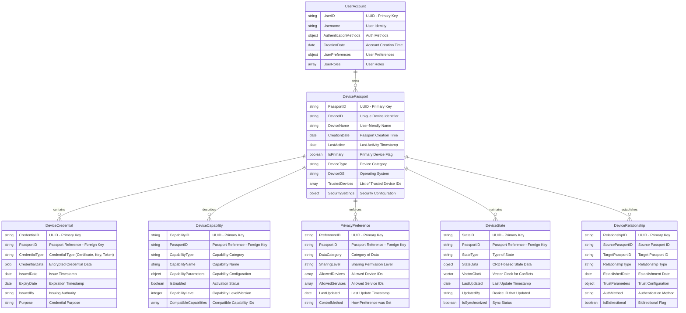

# ME.AI Neural Core Mesh Architecture with UI Agents & Device Passport

## Functional Architecture Design Document

**Version:** 3.0.0  
**Date:** May 7, 2025

## Table of Contents

1. [Executive Summary](#1-executive-summary)
2. [Introduction](#2-introduction)
3. [System Overview](#3-system-overview)
   - 3.1 [Mesh Architecture Principles](#31-mesh-architecture-principles)
   - 3.2 [Key Components](#32-key-components)
4. [UI Agent Architecture](#4-ui-agent-architecture)
   - 4.1 [UI Agent Capabilities](#41-ui-agent-capabilities)
   - 4.2 [Adaptive Interface Framework](#42-adaptive-interface-framework)
   - 4.3 [Device Passport System](#43-device-passport-system)
   - 4.4 [Cross-Device Experience Continuity](#44-cross-device-experience-continuity)
5. [Neural Core Mesh](#5-neural-core-mesh)
   - 5.1 [User-Specific Semantic Evolution](#51-user-specific-semantic-evolution)
   - 5.2 [Adaptive Communication](#52-adaptive-communication)
   - 5.3 [Multilingual Support](#53-multilingual-support)
   - 5.4 [Empathetic Response System](#54-empathetic-response-system)
   - 5.5 [Distributed Memory Management](#55-distributed-memory-management)
   - 5.6 [Dynamic Workflow Engine](#56-dynamic-workflow-engine)
6. [Mesh Control Protocol (MCP)](#6-mesh-control-protocol-mcp)
   - 6.1 [MCP Distributed Architecture](#61-mcp-distributed-architecture)
   - 6.2 [Enhanced Agent-to-Agent Communication](#62-enhanced-agent-to-agent-communication)
   - 6.3 [Decentralized Workflow Orchestration](#63-decentralized-workflow-orchestration)
7. [Agentic Products Mesh](#7-agentic-products-mesh)
   - 7.1 [Agent Autonomy](#71-agent-autonomy)
   - 7.2 [Dynamic Coalition Formation](#72-dynamic-coalition-formation)
   - 7.3 [Federated Workflow Repository](#73-federated-workflow-repository)
8. [Database Architecture](#8-database-architecture)
   - 8.1 [Distributed State Management](#81-distributed-state-management)
9. [Key Functional Flows](#9-key-functional-flows)
   - 9.1 [UI Agent Interaction Flow](#91-ui-agent-interaction-flow)
   - 9.2 [Mesh-based Conversation Processing](#92-mesh-based-conversation-processing)
   - 9.3 [Semantic Negotiation Flow](#93-semantic-negotiation-flow)
   - 9.4 [Distributed Memory Flow](#94-distributed-memory-flow)
   - 9.5 [Coalition-based Workflow Execution](#95-coalition-based-workflow-execution)
10. [Integration Architecture](#10-integration-architecture)
11. [Deployment Architecture](#11-deployment-architecture)
12. [Implementation Roadmap](#12-implementation-roadmap)
13. [Conclusion](#13-conclusion)

## 1. Executive Summary

This Functional Architecture Design Document details a revolutionary Neural Core Platform with a mesh-based architecture featuring UI Agents, a Neural Core Mesh, and an Agentic Products Mesh. The system is designed as a distributed, resilient network of intelligent components that communicate directly in a peer-to-peer fashion while maintaining sophisticated capabilities for personalized interactions, adaptive interfaces, and seamless cross-device experiences.

The architecture transforms traditional client interfaces into context-aware UI Agents that adapt to user needs, device capabilities, and interaction contexts. A secure Device Passport system enables privacy-preserving identity and capability sharing across user devices, ensuring a continuous experience regardless of the access point.

The Neural Core and Agentic Products are reimagined as dynamic mesh networks where components form autonomous coalitions to solve complex problems. This enables emergent intelligence beyond what any single component could achieve, while significantly improving system resilience and scalability through elimination of central bottlenecks and single points of failure.

The system delivers personalized, context-aware interactions through distributed semantic understanding, adaptive communication, multilingual capabilities, empathetic responses, and robust memory management. The decentralized workflow engine orchestrates complex processes through event-based choreography rather than centralized control, adapting to changing conditions and user needs in real-time.

This evolved architecture provides a foundation for building an intelligent, adaptive conversation platform that can form dynamic agent coalitions, seamlessly transition across devices, and integrate with organizational systems while maintaining privacy, security, and user control.

## 2. Introduction

The ME.AI Neural Core Mesh Architecture represents a paradigm shift from traditional hierarchical systems to a dynamic, resilient mesh network of intelligent components that can interact directly and form coalitions to solve complex problems.

### Purpose and Goals

The evolved Neural Core Mesh Architecture with UI Agents aims to achieve several key objectives:

1. Provide seamless experiences across multiple devices through adaptive UI Agents
2. Enable secure device identity and capability sharing via Device Passports
3. Distribute neural core capabilities across a resilient mesh network
4. Allow dynamic coalition formation among agents to tackle complex tasks
5. Support emergent intelligence through agent collaboration patterns
6. Maintain personalized, contextually aware conversations
7. Facilitate organization-specific knowledge and capabilities while preserving privacy
8. Support decentralized orchestration of complex workflows triggered by conversation
9. Provide enterprise-grade integration capabilities for business systems
10. Scale dynamically through peer-based components optimizing resource utilization
11. Distribute conversation context across the mesh while maintaining coherence
12. Deliver emotionally intelligent responses based on user state
13. Work effectively across multiple languages and cultural contexts

### Technical Approach

The architecture follows several key principles:

1. **Distributed Design**: Components operate as peers in a mesh network rather than in strict hierarchies
2. **Adaptive Interface**: UI Agents adapt to device capabilities, user needs, and context
3. **Device Continuity**: Secure Device Passports enable seamless cross-device experiences
4. **Coalition Formation**: Agents dynamically form coalitions to solve complex problems
5. **Semantic Negotiation**: Components negotiate shared semantic understanding to facilitate collaboration
6. **Emergent Intelligence**: The system design enables intelligence to emerge from component interactions
7. **Resilience by Design**: The mesh structure eliminates single points of failure
8. **Extensibility**: New Agentic Products can be added without modifying the core platform
9. **Adaptability**: The system learns and evolves through component interactions over time
10. **Integration**: Well-defined integration points enable connectivity with enterprise systems
11. **Privacy Preservation**: User control over personal data and device capabilities

## 3. System Overview

### 3.1 Mesh Architecture Principles

The ME.AI Neural Core Mesh Architecture with UI Agents is built on key principles that create a resilient, distributed system:


#### Mesh Architecture Characteristics

1. **Decentralized Communication**:
   - Components communicate directly without requiring a central broker
   - Message routing occurs through a distributed protocol rather than a central service
   - Components discover each other through distributed service discovery mechanisms

2. **Adaptive Interfaces**:
   - UI Agents adapt to device capabilities and user preferences
   - Interfaces morph based on context and interaction history
   - Device Passports enable secure capability sharing and continuous experiences

3. **Agent Autonomy**:
   - Agents operate with greater autonomy to make local decisions
   - Each agent exposes capabilities and requirements through standardized interfaces
   - Agents can negotiate directly with each other for collaboration

4. **Coalition Formation**:
   - Agents dynamically form coalitions to address specific tasks
   - Coalition membership is fluid based on task requirements and agent availability
   - Multiple coalitions can operate simultaneously across the system

5. **Semantic Negotiation**:
   - Components establish shared semantic understanding through negotiation protocols
   - Knowledge and context are shared directly between relevant components
   - Semantic alignment occurs dynamically as coalitions form

6. **Resilient Operation**:
   - No single component is critical to overall system operation
   - The system gracefully handles component failures through redundancy and rerouting
   - State is distributed across the mesh to prevent data loss

7. **Emergent Intelligence**:
   - Complex problem-solving emerges from simpler component interactions
   - The system can discover novel solutions through agent collaboration patterns
   - Learning occurs at both the individual agent and coalition levels

### 3.2 Key Components

The mesh architecture consists of these primary components:


The key distinction in this architecture is the bidirectional connections between all major components, indicating direct peer-to-peer communication rather than a hierarchical flow. UI Agents replace traditional client interfaces, providing adaptive experiences across devices while using Device Passports to enable seamless transitions. Components can interact directly as needed, with the Mesh Control Protocol providing standards and protocols for these interactions rather than serving as a central orchestrator.

## 4. UI Agent Architecture

UI Agents represent a paradigm shift from traditional channel-based interfaces to intelligent, adaptive agents that provide a seamless user experience across devices and interaction modalities.

### 4.1 UI Agent Capabilities


UI Agents offer several key capabilities:

1. **Interface Adaptation**: Dynamically adjust the interface based on:
   - Device capabilities (screen size, input methods, processing power)
   - User preferences and accessibility needs
   - Context of interaction (location, time, activity)
   - Interaction modality (text, voice, gesture, visual)

2. **User Interaction**: Support multiple interaction methods:
   - Natural language conversation (text and voice)
   - Gestural input (touch, motion, hand gestures)
   - Visual interfaces (AR overlays, VR environments, mixed reality)
   - Auditory feedback (voice, sound cues, spatial audio)

3. **State Continuity**: Maintain seamless experience across devices:
   - Capture interaction state using CRDTs for conflict-free synchronization
   - Transfer state securely between devices via Device Passport
   - Resolve state conflicts using vector clocks and user preferences
   - Apply privacy rules based on user-defined controls

4. **Federation & Autonomy**: Operate independently and collectively:
   - Function offline with local capabilities when connectivity is limited
   - Discover and connect with other agents using P2P protocols
   - Form secure federations with agents across organizational boundaries
   - Take autonomous actions based on learned preferences and delegated authority

### 4.2 Adaptive Interface Framework

The Adaptive Interface Framework enables UI Agents to morph their presentation and interaction models based on context, device capabilities, and user preferences.


Key aspects of the Adaptive Interface Framework:

1. **Device Capability Layer**:
   - Assesses device hardware and software capabilities
   - Optimizes interface components for performance
   - Enhances accessibility based on device features and user needs

2. **User Interface Layer**:
   - Provides a responsive layout engine for different screen sizes
   - Offers a component library that works across platforms
   - Includes a theming engine for visual adaptation
   - Features a performance-aware animation system

3. **Interaction Adaptation Layer**:
   - Manages multiple input methods (touch, voice, gesture, etc.)
   - Provides appropriate feedback mechanisms based on context
   - Adapts navigation patterns based on device and usage context
   - Transforms workflows based on device capabilities

4. **Context Personalization Layer**:
   - Analyzes the user's current situation and environment
   - Builds and maintains a profile of user preferences
   - Remembers past interaction patterns
   - Generates personalized interface transformations

### 4.3 Device Passport System

The Device Passport System enables secure identity, capability sharing, and experience continuity across a user's devices.



Key functional characteristics of the Device Passport:

1. **Secure Device Identity**:
   - Unique identifiers for each device
   - Cryptographic credentials for secure authentication
   - Trust relationships between devices
   - Ownership verification through the user account

2. **Capability Declaration and Discovery**:
   - Hardware capabilities (screen, camera, microphone, sensors)
   - Software capabilities (OS features, installed applications)
   - Interaction capabilities (input methods, output modes)
   - Network capabilities (connectivity types, bandwidth)

3. **Privacy Control Center**:
   - Fine-grained data sharing preferences
   - Device-specific privacy settings
   - Service-specific permissions
   - Contextual privacy rules based on location and activity

4. **State Synchronization**:
   - CRDT-based conflict-free state replication
   - Vector clocks for ordering events across devices
   - Selective state synchronization based on privacy preferences
   - Differential synchronization for bandwidth efficiency

5. **Trust Relationship Management**:
   - Establishment of trusted device pairs
   - Capability-based trust limitations
   - Time and context-based trust expiration
   - Cross-user device trust for collaboration

### 4.4 Cross-Device Experience Continuity

The Cross-Device Experience Continuity system enables seamless transitions between devices while preserving interaction context and state.


Key aspects of Cross-Device Experience Continuity:

1. **State Management**:
   - Captures interaction state using session recording
   - Serializes state using CRDT encoding for conflict-free merging
   - Partitions state based on privacy rules and relevance
   - Encrypts state data end-to-end for security

2. **Transfer & Discovery**:
   - Discovers available devices through P2P protocols and cloud registry
   - Pairs devices securely using Device Passport credentials
   - Transfers state data efficiently with delta compression
   - Validates data integrity after transfer

3. **State Reconstruction**:
   - Deserializes state data on the target device
   - Resolves any conflicts using vector clocks
   - Adapts state to the target device's capabilities
   - Restores the session to continue the interaction

4. **Continuity Assurance**:
   - Maintains an interaction timeline for continuity
   - Predicts next actions to preload relevant data
   - Provides contextual handoff cues for smooth transitions
   - Confirms successful continuity through feedback

## 5. Neural Core Mesh

The Neural Core Mesh distributes conversation intelligence capabilities across a resilient network of specialized nodes that collaborate through peer-to-peer protocols.

### 5.1 User-Specific Semantic Evolution

The User-Specific Semantic Evolution system has been evolved to enable distributed semantic understanding across the mesh.


The key enhancement is the addition of Semantic Negotiation capabilities that allow semantic understanding to be shared across agent coalitions through a standardized negotiation protocol.

### 5.2 Adaptive Communication

The Adaptive Communication system has been enhanced to support distributed style adaptation across the mesh.


The enhancement introduces Style Negotiation capabilities that enable consistent communication styles across agent coalitions, ensuring a coherent user experience regardless of which agents are involved in generating responses.

### 5.3 Multilingual Support

The Multilingual Support system has been evolved to support distributed language processing across the mesh.


The enhancement introduces Language Negotiation capabilities that enable agent coalitions to agree on language-specific approaches when generating multilingual responses.

### 5.4 Empathetic Response System

The Empathetic Response System has been enhanced to support distributed emotional intelligence across the mesh.


The enhancement introduces Empathy Negotiation capabilities that allow agent coalitions to align on emotional understanding and response strategies.

### 5.5 Distributed Memory Management

The Memory Management system has been evolved to support distributed memory across the mesh.


The enhancement introduces Memory Negotiation capabilities that allow different components to align on shared memory context when forming coalitions, ensuring consistent context across the mesh.

### 5.6 Dynamic Workflow Engine

The Dynamic Workflow Engine has been transformed to support decentralized workflow coordination across the mesh.


The key enhancements include:
1. Addition of a Workflow Choreographer that enables decentralized coordination through event-based choreography rather than centralized orchestration
2. Introduction of Workflow Negotiation capabilities that allow different components to align on shared workflow execution strategies
3. Direct connection to Agent Coalitions for collaborative workflow execution

## 6. Mesh Control Protocol (MCP)

### 6.1 MCP Distributed Architecture

The Master Control Protocol has evolved into a Mesh Control Protocol, providing distributed coordination rather than centralized orchestration.


Key changes include:
1. Replacing the centralized Agent Registry with a Distributed Registry using DHT or similar technology
2. Introducing Peer Routing for direct agent-to-agent communication
3. Using Gossip Protocols for event propagation instead of centralized message bus
4. Implementing CRDT-based distributed state management instead of centralized state
5. Replacing orchestration with choreography through distributed event systems
6. Implementing consensus protocols for conflict resolution

### 6.2 Enhanced Agent-to-Agent Communication

The Agent-to-Agent (A2A) Communication architecture has been enhanced to enable more direct peer-to-peer interaction between agents.


Key enhancements include:
1. Introduction of Capability Discovery Protocol that allows agents to advertise their capabilities
2. Direct communication channels using P2P technologies like libp2p
3. Coalition Negotiation protocol for dynamic team formation
4. Trust Protocol for establishing reputation-based collaboration
5. Type Negotiation for dynamic message format agreement

### 6.3 Decentralized Workflow Orchestration

The Workflow Orchestration Service has evolved into a Decentralized Workflow system that coordinates through choreography rather than orchestration.


Key enhancements include:
1. Distribution of workflow management across a mesh of nodes rather than centralized services
2. CRDT-based state management for workflow state consistency
3. Event-based choreography instead of centralized orchestration
4. Introduction of Coalition Formation Protocol for dynamic agent team assembly
5. Capability discovery and matching for optimal agent selection

## 7. Agentic Products Mesh

### 7.1 Agent Autonomy

The Agentic Products architecture has been enhanced to enable greater agent autonomy within the mesh.


Key enhancements include:
1. Introduction of an Agent Autonomy Layer that enables agents to make independent decisions
2. Skill Management system for advertising and updating agent capabilities
3. Coalition Membership protocol for participating in dynamic agent teams
4. Trust & Reputation system for optimizing collaboration

### 7.2 Dynamic Coalition Formation

The architecture now includes a Dynamic Coalition Formation system that enables agents to form teams for complex tasks.


This new component enables the dynamic formation of agent coalitions through a structured process:
1. Task Perception that recognizes the need for collaboration
2. Coalition Request to initiate team formation
3. Capability Matching to identify appropriate team members
4. Negotiation & Contracting to establish collaboration terms
5. Role Assignment to determine team responsibilities
6. Coalition Operation for team execution
7. Coalition Dissolution when the task is complete

### 7.3 Federated Workflow Repository

The Workflow Template Repository has evolved into a Federated Workflow Repository that enables distributed workflow sharing.


Key enhancements include:
1. Distributed catalog and version control for workflows
2. Content-addressed storage for workflow templates
3. P2P workflow sharing between agents and coalitions
4. Collaborative workflow creation and customization

## 8. Database Architecture

### 8.1 Distributed State Management

The Workflow State Database has evolved into a Distributed State Management system that maintains consistency across the mesh.


Key enhancements include:
1. Content-addressable and DHT-addressable IDs for distributed referencing
2. CRDT-based data structures for conflict-free state management
3. Vector clock timestamps for event ordering
4. Coalition participation tracking for workflow execution
5. Distributed consensus mechanisms for state transitions

## 9. Key Functional Flows

### 9.1 UI Agent Interaction Flow

The UI Agent Interaction Flow shows how the adaptive interface responds to user interactions and device contexts.


### 9.2 Mesh-based Conversation Processing

The conversation processing flow has been evolved to leverage the mesh architecture.

```mermaid
flowchart TD
    CI[Conversation Input - User Interface] --> AAA[Distributed Authentication - Zero Trust Identity]
    AAA --> PPF
    
    subgraph PPF["PRE-PROCESSING MESH"]
        STT[Speech-to-Text Nodes - Distributed STT]
        LD[Language Detection Nodes - Language Mesh]
        ICP[Initial Context Preparation - Context Mesh]
        STT --- LD --- ICP
    end
    
    PPF --- PF
    
    subgraph PF["PARALLEL PROCESSING MESH"]
        subgraph UEB["USER EXPERIENCE NODES"]
            IE[Information Extraction - Entity Mesh]
            SE[Semantic Enrichment - Knowledge Mesh]
            UNS[UX Negotiation Service - Preference Mesh]
            IE --- SE --- UNS
        end
        
        subgraph AEB["AGENT EXECUTION NODES"]
            TP[Task Planning - Planning Mesh]
            AE[Action Execution - Agent Mesh]
            ST[Status Tracking - Monitoring Mesh]
            TP --- AE --- ST
        end
    end
    
    PF --- MMF
    
    subgraph MMF["MEMORY MANAGEMENT MESH"]
        MR[Memory Router - Route Mesh]
        WM[Working Memory - CRDT Memory]
        TD[Transactional Database - Distributed DB]
        EM[Episodic Memory - Time-series Mesh]
        SM[Semantic Memory - Vector Mesh]
        PD[Proprietary Database - Privacy Mesh]
        MR --- WM & TD
        TD --- EM & SM & PD
    end
    
    MMF --- RGF
    
    subgraph RGF["RESPONSE GENERATION MESH"]
        CA[Context Assembly - Context Mesh]
        RG[Response Generation - Generation Mesh]
        CSF[Channel-specific Formatting - Format Mesh]
        CA --- RG --- CSF
    end
    
    RGF --- CC
    
    subgraph CC["CONVERSATION CONTINUITY MESH"]
        CSP[Conversation State Persistence - State Mesh]
        CM[Context Maintenance - CRDT Context]
        AI[Analytics & Improvement - Distributed Analytics]
        FB[Feedback - Feedback Mesh]
        CSP --- CM --- AI --- FB
    end
    
    CC --- DWF
    
    subgraph DWF["DYNAMIC WORKFLOW MESH"]
        ITA[Intent Analysis - Intent Mesh]
        WTS[Workflow Template Selection - Template Mesh]
        CFM[Coalition Formation - Team Formation]
        WE[Workflow Execution - Choreography Mesh]
        ITA --- WTS --- CFM --- WE
    end
    
    DWF --- UO[User Output - Response Delivery]
    
    classDef blue fill:#2374ab,stroke:#000,stroke-width:1px,color:#fff
    classDef green fill:#41b883,stroke:#000,stroke-width:1px,color:#fff
    classDef orange fill:#ff8c00,stroke:#000,stroke-width:1px,color:#fff
    classDef purple fill:#8e44ad,stroke:#000,stroke-width:1px,color:#fff
    classDef red fill:#e74c3c,stroke:#000,stroke-width:1px,color:#fff
    classDef new fill:#f1c40f,stroke:#000,stroke-width:1px,color:#fff
    
    class PPF blue
    class UEB green
    class AEB orange
    class MMF purple
    class RGF orange
    class CC green
    class DWF red
    class CFM new
```

Key enhancements include:
1. Transformation of processing components into distributed mesh nodes
2. Introduction of Coalition Formation within the workflow execution process
3. CRDT-based state management for conversation context
4. Event-based choreography for workflow execution

### 9.3 Semantic Negotiation Flow

A new semantic negotiation flow enables components to establish shared understanding.

```mermaid
flowchart TD
    UR[User Request - Natural Language] & CA[Context Analysis - Context Mesh] --> SN
    
    subgraph SN["SEMANTIC NEGOTIATION MESH"]
        VSM[Vector Space Mapping - Embedding Alignment]
        CMF[Conceptual Model Formation - Model Mesh]
        SKN[Shared Knowledge Negotiation - Knowledge Alignment]
        OAR[Ontology Alignment & Reconciliation - Ontology Mesh]
        VSM --- CMF --- SKN --- OAR
    end
    
    SN --> SKRL
    
    subgraph SKRL["SEMANTIC KNOWLEDGE RETRIEVAL"]
        USS[User-Specific Semantics - Distributed User KB] --> MA[Match Determination - Distributed Matching]
        OS[Organization Semantics - Distributed Org KB] --> MA
        MA -->|Yes| YB[YES BRANCH]
        MA -->|No| NB[NO BRANCH]
        YB --> UUS[Use User Semantics - User Knowledge Nodes]
        NB --> UOS[Use Org Semantics - Org Knowledge Nodes]
        UUS & UOS --> CK[Combined Knowledge - Knowledge Mesh]
    end
    
    SKRL --> SLP
    
    subgraph SLP["SEMANTIC LEARNING PROCESS"]
        DNSO[Detect New Semantics Opportunity - Learning Trigger]
        CUSR[Create User Semantic Records - Knowledge Creation]
        UUSP[Update User Semantic Profile - Profile Update]
        DNSO --- CUSR --- UUSP
    end
    
    SN --> CFM[Coalition Formation - Semantic Team Building]
    CFM --> AC[Agent Coalitions - Aligned Understanding]
    
    classDef blue fill:#2374ab,stroke:#000,stroke-width:1px,color:#fff
    classDef green fill:#41b883,stroke:#000,stroke-width:1px,color:#fff
    classDef new fill:#e74c3c,stroke:#000,stroke-width:1px,color:#fff
    
    class SKRL blue
    class SLP green
    class SN,CFM,AC new
```

This new flow enables different components to negotiate a shared semantic understanding:
1. Vector Space Mapping aligns different embedding spaces
2. Conceptual Model Formation creates shared mental models
3. Shared Knowledge Negotiation establishes common knowledge
4. Ontology Alignment reconciles different ontological frameworks
5. Connection to Coalition Formation enables semantic-based team building

### 9.4 Distributed Memory Flow

The memory management flow has been enhanced for distributed operation.

```mermaid
flowchart TD
    subgraph DMR["DISTRIBUTED MEMORY ROUTER"]
        PBR[Peer-based Routing - DHT Routing]
        TTLM[Distributed TTL Management - Vector Clock TTL]
        SP[Storage Policy Mesh - Distributed Policy]
    end
    
    DMR --- IP
    
    subgraph IP["INPUT PROCESSING MESH"]
        MTC[Memory Type Classification - Distributed Classification]
        DP[Data Preparation - Distributed Processing]
        CL[Context Linking - Distributed Linking]
        MTC --- DP --- CL
    end
    
    IP --- MO
    
    subgraph MO["MEMORY OPERATIONS MESH"]
        WO[Write Operations - CRDT Write]
        RO[Read Operations - Eventual Consistency Read]
        UO[Update Operations - CRDT Update]
        DO[Delete Operations - Tombstone Delete]
        CO[Compression Operations - Distributed Compression]
        IO[Index Operations - Distributed Index]
        WO --- RO --- UO --- DO --- CO --- IO
    end
    
    MO --- MD
    
    subgraph MD["MEMORY DESTINATIONS MESH"]
        WM[Working Memory - Distributed Cache]
        STM[Short-term Memory - DHT Cache]
        LTM[Long-term Memory - Distributed Storage]
        EM[Episodic Memory - Distributed Time-series]
        SM[Semantic Memory - Distributed Graph]
        USM[User-Specific Memory - Privacy-preserving Storage]
        WM --- STM --- LTM --- EM --- SM --- USM
    end
    
    MD --- MOP
    
    subgraph MOP["MEMORY OPTIMIZATION MESH"]
        PS[Progressive Summarization - Distributed Summarization]
        MC[Memory Consolidation - Mesh Consolidation]
        GC[Garbage Collection - Distributed GC]
        PS --- MC --- GC
    end
    
    DMR --- MN[Memory Negotiation - Context Alignment Protocol]
    MN --- CFM[Coalition Formation - Memory-aware Team Building]
    
    classDef blue fill:#2374ab,stroke:#000,stroke-width:1px,color:#fff
    classDef green fill:#41b883,stroke:#000,stroke-width:1px,color:#fff
    classDef orange fill:#ff8c00,stroke:#000,stroke-width:1px,color:#fff
    classDef purple fill:#8e44ad,stroke:#000,stroke-width:1px,color:#fff
    classDef red fill:#e74c3c,stroke:#000,stroke-width:1px,color:#fff
    classDef new fill:#f1c40f,stroke:#000,stroke-width:1px,color:#fff
    
    class DMR blue
    class IP green
    class MO orange
    class MD purple
    class MOP red
    class MN,CFM new
```

Key enhancements include:
1. Distributed routing using DHT and similar technologies
2. CRDT-based operations for conflict-free updates
3. Vector clock TTL for distributed expiration
4. Memory Negotiation protocol for establishing shared context
5. Connection to Coalition Formation for memory-aware team building

### 9.5 Coalition-based Workflow Execution

The workflow execution flow has been enhanced to leverage agent coalitions.

```mermaid
flowchart TD
    UT[User Trigger - Conversation Intent] & ST[System Trigger - System Event] --> WIF
    
    subgraph WIF["WORKFLOW INITIATION MESH"]
        TP[Trigger Processing - Event Mesh]
        CA[Context Analysis - Context Mesh]
        WS[Workflow Selection - Template Mesh]
        PS[Parameter Setting - Configuration Mesh]
        TP --- CA --- WS --- PS
    end
    
    WIF --> CFP
    
    subgraph CFP["COALITION FORMATION PROTOCOL"]
        TR[Task Recognition - Need Identification]
        CD[Capability Discovery - Capability Mesh]
        AM[Agent Matching - Skill Matching]
        CN[Coalition Negotiation - Team Assembly]
        RC[Role Configuration - Role Assignment]
        TR --- CD --- AM --- CN --- RC
    end
    
    CFP --> WEF
    
    subgraph WEF["WORKFLOW EXECUTION MESH"]
        WI[Workflow Instantiation - Distributed Instance]
        TS[Task Scheduling - Distributed Scheduling]
        TR2[Task Routing - Peer Routing]
        TE[Task Execution - Distributed Execution]
        SR[Status Reporting - Status Mesh]
        WI --- TS --- TR2 --- TE --- SR
    end
    
    WEF --> BCF
    
    subgraph BCF["BRANCHING & CONTROL MESH"]
        CD2[Condition Determination - Distributed Evaluation]
        BP[Branch Processing - Distributed Branching]
        EP[Error Processing - Distributed Error Handling]
        CR[Compensation Routing - Distributed Compensation]
        CD2 --- BP
        CD2 --- EP --- CR
    end
    
    BCF --> PIF
    
    subgraph PIF["PROGRESS & INTEGRATION MESH"]
        PM[Progress Monitoring - Distributed Monitoring]
        NM[Notification Management - Notification Mesh]
        DC[Data Collection - Distributed Collection]
        SI[System Integration - Integration Mesh]
        PM --- NM
        PM --- DC --- SI
    end
    
    PIF --> WCF
    
    subgraph WCF["WORKFLOW COMPLETION MESH"]
        FC[Final Cleanup - Distributed Cleanup]
        SR2[State Recording - CRDT State]
        AR[Analytics Recording - Distributed Analytics]
        NS[Next Steps Determination - Planning Mesh]
        CD3[Coalition Dissolution - Team Disbanding]
        FC --- SR2 --- AR --- NS --- CD3
    end
    
    classDef blue fill:#2374ab,stroke:#000,stroke-width:1px,color:#fff
    classDef green fill:#41b883,stroke:#000,stroke-width:1px,color:#fff
    classDef orange fill:#ff8c00,stroke:#000,stroke-width:1px,color:#fff
    classDef purple fill:#8e44ad,stroke:#000,stroke-width:1px,color:#fff
    classDef red fill:#e74c3c,stroke:#000,stroke-width:1px,color:#fff
    classDef new fill:#f1c40f,stroke:#000,stroke-width:1px,color:#fff
    
    class WIF blue
    class CFP new
    class WEF green
    class BCF orange
    class PIF purple
    class WCF red
    class CD3 new
```

Key enhancements include:
1. Introduction of a Coalition Formation Protocol between initiation and execution
2. Distributed workflow execution across coalition members
3. Coalition Dissolution as part of workflow completion
4. CRDT-based state management for workflow consistency

## 10. Integration Architecture

The integration architecture has been enhanced to support the mesh topology.

```mermaid
flowchart TD
    subgraph IP["INTEGRATION PATTERNS MESH"]
        ABI[API-based Integration - API Mesh]
        EDI[Event-driven Integration - Event Mesh]
        FBI[File-based Integration - Distributed File System]
        MBI[Message-based Integration - Message Mesh]
        DBI[Database Integration - Database Mesh]
        WI[Webhook Integration - Webhook Mesh]
    end
    
    IP <--> IE
    
    subgraph IE["INTEGRATION ENDPOINTS"]
        CRMS[External CRM Systems - Salesforce/Dynamics]
        AS[Authentication Systems - AD/LDAP/SAML]
        KBS[Knowledge Base Systems - Confluence/SharePoint]
        ERPS[ERP Systems - SAP/Oracle]
        TS[Ticketing Systems - JIRA/ServiceNow]
        TES[Telephony Systems - Twilio/Asterisk]
    end
    
    IE <--> IS
    
    subgraph IS["INTEGRATION SERVICES MESH"]
        AG[API Gateway Mesh - Distributed Gateway]
        MB[Message Broker Mesh - Distributed Broker]
        EB[Event Bus Mesh - Distributed Events]
        DI[Data Integration Mesh - Distributed ETL]
        AS2[Authentication Service Mesh - Auth Mesh]
        TS2[Transformation Service Mesh - Transform Mesh]
    end
    
    IS <--> ISEC
    
    subgraph ISEC["INTEGRATION SECURITY MESH"]
        ASG[API Security Gateway - Distributed Security]
        DE[Data Encryption - End-to-End Encryption]
        AA[Authentication & Authorization - Zero Trust]
        AT[Audit Trail - Distributed Audit]
        RL[Rate Limiting - Distributed Limiting]
        TP[Threat Protection - Security Mesh]
    end
    
    IS <--> CFP[Coalition Formation Protocol - Integration Team Building]
    CFP <--> AC[Agent Coalitions - Integration Teams]
    
    classDef blue fill:#2374ab,stroke:#000,stroke-width:1px,color:#fff
    classDef green fill:#41b883,stroke:#000,stroke-width:1px,color:#fff
    classDef orange fill:#ff8c00,stroke:#000,stroke-width:1px,color:#fff
    classDef purple fill:#8e44ad,stroke:#000,stroke-width:1px,color:#fff
    classDef new fill:#e74c3c,stroke:#000,stroke-width:1px,color:#fff
    
    class IP blue
    class IE green
    class IS orange
    class ISEC purple
    class CFP,AC new
```

Key enhancements include:
1. Transformation of integration components into distributed mesh nodes
2. Introduction of Integration Team Building for complex integration scenarios
3. Distributed security and rate limiting
4. End-to-end encryption for secure integration

## 11. Deployment Architecture

The deployment architecture has been enhanced to support the mesh topology.

```mermaid
flowchart TD
    subgraph MED["MULTI-ENVIRONMENT DEPLOYMENT"]
        DE[Development Mesh - Dev Cluster]
        TE[Testing Mesh - Test Cluster]
        SE[Staging Mesh - Staging Cluster]
        PE[Production Mesh - Production Cluster]
    end
    
    MED --> KCP
    
    subgraph KCP["KUBERNETES MESH (PRODUCTION)"]
        subgraph IL["INGRESS MESH"]
            LB[Load Balancer Mesh - Distributed LB]
            AG[API Gateway Mesh - Gateway Mesh]
            DP[DDoS Protection Mesh - Distributed Protection]
        end
        
        subgraph SM["SERVICE MESH"]
            SM1[Service Mesh Components - Istiod/Linkerd]
        end
        
        subgraph AS["APPLICATION SERVICES MESH"]
            UIA[UI Agent Services Mesh - Adaptive UI]
            DPS[Device Passport Services - Identity Mesh]
            ASM[Authentication Microservice Mesh - Auth Mesh]
            CP[Conversation Processing Mesh - NLP Mesh]
            AAO[AI Agent Orchestration Mesh - Agent Mesh]
            SES[Semantic Enrichment Service Mesh - Knowledge Mesh]
            UNS[UX Negotiation Service Mesh - UX Mesh]
            MRS[Memory Router Service Mesh - Memory Mesh]
            DWE[Dynamic Workflow Engine Mesh - Workflow Mesh]
        end
        
        subgraph DS["DATA SERVICES MESH"]
            RC[Redis Cluster Mesh - In-Memory Mesh]
            PG[PostgreSQL Mesh - Relational Mesh]
            N4J[Neo4j Cluster Mesh - Graph Mesh]
            ES[Elasticsearch Mesh - Search Mesh]
            VDB[Vector DB Mesh - Vector Mesh]
            ODB[Organization-specific DB Mesh - Tenant Mesh]
        end
        
        subgraph PS["PLATFORM SERVICES MESH"]
            MON[Monitoring Mesh - Prometheus/Grafana]
            LOG[Logging Mesh - ELK/Loki]
            CICD[CI/CD Pipeline Mesh - Jenkins/GitHub Actions]
        end
        
        IL <--> SM <--> AS
        AS <--> DS
        PS <--> AS
    end
    
    classDef blue fill:#2374ab,stroke:#000,stroke-width:1px,color:#fff
    classDef green fill:#41b883,stroke:#000,stroke-width:1px,color:#fff
    classDef orange fill:#ff8c00,stroke:#000,stroke-width:1px,color:#fff
    classDef purple fill:#8e44ad,stroke:#000,stroke-width:1px,color:#fff
    classDef red fill:#e74c3c,stroke:#000,stroke-width:1px,color:#fff
    classDef new fill:#f1c40f,stroke:#000,stroke-width:1px,color:#fff
    
    class MED blue
    class IL green
    class SM orange
    class AS purple
    class DS red
    class PS orange
    class UIA,DPS new
```

Key enhancements include:
1. Transformation of deployment components into mesh-enabled nodes
2. Addition of UI Agent Services for adaptive interfaces
3. Integration of Device Passport Services for identity and continuity
4. Bidirectional connections between all major components
5. Distributed load balancing and API gateway functionality
6. Mesh-enabled databases and services

## 12. Implementation Roadmap

```mermaid
gantt
    title ME.AI Neural Core Mesh with UI Agents Implementation Roadmap
    dateFormat YYYY-MM-DD
    axisFormat %b %d
    
    section Foundation Mesh
    Mesh Communication Layer             :foundation1, 2025-06-01, 45d
    Distributed Registry                 :foundation2, after foundation1, 30d
    CRDT-based State Management          :foundation3, after foundation2, 30d
    Mesh Security Framework              :foundation4, 2025-06-15, 45d
    Distributed Tracing & Monitoring     :foundation5, after foundation3, 30d
    
    section UI Agent Framework
    UI Agent Core Architecture           :ui1, 2025-06-01, 45d
    Device Passport System               :ui2, after ui1, 45d
    Adaptive Interface Framework         :ui3, after ui2, 45d
    Cross-Device Continuity              :ui4, after ui3, 30d
    
    section Neural Core Mesh
    Distributed NLP Pipeline             :neural1, after foundation5, 30d
    Distributed Memory Management        :neural2, after neural1, 30d
    Distributed Semantic Framework       :neural3, after foundation4, 30d
    Distributed Multilingual Support     :neural4, after neural2, 30d
    Distributed Empathetic Response      :neural5, after neural3, 30d
    
    section Mesh Control Protocol
    Capability Discovery Protocol        :mcp1, after foundation5, 30d
    Coalition Formation Protocol         :mcp2, after mcp1, 45d
    Trust & Reputation System            :mcp3, after mcp2, 30d
    Semantic Negotiation Protocol        :mcp4, after mcp3, 30d
    Mesh Routing Protocol                :mcp5, after mcp4, 30d
    
    section Decentralized Workflow
    Workflow Event Choreography          :workflow1, after neural5, 45d
    Coalition-based Workflow Execution   :workflow2, after workflow1, 45d
    Distributed Workflow State           :workflow3, after workflow2, 30d
    Workflow Compensation Handling       :workflow4, after workflow3, 30d
    Federated Workflow Repository        :workflow5, after workflow4, 45d
    
    section Agentic Mesh
    Agent Autonomy Framework             :agent1, after mcp5, 45d
    Dynamic Coalition Formation          :agent2, after agent1, 45d
    Federated Agent Knowledge            :agent3, after agent2, 30d
    Agent Capability Advertisement       :agent4, after agent3, 30d
    Coalition Team Dynamics              :agent5, after agent4, 45d
    
    section Advanced Capabilities
    Distributed Multilingual Support     :advanced1, after neural4, 45d
    Mesh-based Empathetic Responses      :advanced2, after neural5, 45d
    Distributed Semantic Evolution       :advanced3, after advanced1, 45d
    CRDT-based Memory Management         :advanced4, after advanced2, 45d
    Cross-coalition Collaboration        :advanced5, after agent5, 45d
    
    section Scale and Resilience
    Mesh Performance Optimization        :scale1, after advanced5, 45d
    Fault-tolerant Coalition Dynamics    :scale2, after scale1, 30d
    Distributed Circuit Breaking         :scale3, after scale2, 30d
    Mesh Monitoring & Observability      :scale4, after scale3, 30d
    Production Readiness                 :scale5, after scale4, 45d
    
    section Enhanced Capabilities
    Multi-device Experience Optimization :enhanced1, after scale5, 60d
    Multi-coalition Orchestration        :enhanced2, after enhanced1, 60d
    Emergent Intelligence Framework      :enhanced3, after enhanced2, 45d
    Cross-mesh Semantic Alignment        :enhanced4, after enhanced3, 45d
    User Experience Refinement           :enhanced5, after enhanced4, 45d
```

## 13. Conclusion

The evolved ME.AI Neural Core Mesh Architecture with UI Agents represents a significant advancement over previous designs, transforming the system into a resilient, distributed network of intelligent components that can adapt to user needs, device capabilities, and interaction contexts. This revolutionary architecture enables seamless experiences across devices through the Device Passport system while maintaining privacy and security.

Key architectural advantages include:

1. **Adaptive UI Agents**: The system adapts interfaces based on device capabilities, user preferences, and context, providing a consistent experience across multiple devices and interaction modalities.

2. **Device Passport System**: Secure identity and capability sharing across devices enables seamless experience continuity, allowing users to transition between devices without losing context.

3. **Decentralized Design**: The mesh architecture eliminates single points of failure and bottlenecks through distributed protocols and direct peer-to-peer communication.

4. **Dynamic Coalition Formation**: Agents can dynamically form teams to solve complex problems, enabling emergent intelligence beyond what any single agent could accomplish.

5. **Semantic Negotiation**: Components can establish shared semantic understanding through standardized negotiation protocols.

6. **Distributed State Management**: CRDT-based state management ensures consistency across the mesh without requiring centralized coordination.

7. **Event-based Choreography**: Workflows are executed through event-based choreography rather than centralized orchestration.

8. **Trust & Reputation**: Components build and maintain trust models to optimize collaboration over time.

9. **Enhanced Resilience**: The mesh structure is inherently resilient to component failures, with automatic rerouting and recovery.

10. **Improved Scalability**: Components can scale independently based on demand, with peer-based workload distribution.

11. **User-Centric Design**: The system adapts to individual users through semantic evolution, communication style adjustment, and personalized memory.

12. **Extensibility**: New Agentic Products can be added without modifying the core platform, immediately participating in the mesh.

This evolved architecture provides the foundation for building a robust, adaptable, and intelligent conversation platform that can form dynamic coalitions to solve complex problems, transition seamlessly across devices, adapt to changing user needs, automate sophisticated workflows, and integrate seamlessly with organizational systems. The mesh design ensures both high availability and scalability while enabling new forms of emergent intelligence through agent collaboration.
