Here's the complete GitHub-compatible markdown version of the ME.AI Neural Core Dynamic Workflow Engine Technical Design Document:

```markdown
# ME.AI Neural Core: Dynamic Workflow Engine Technical Design Document

## Document Information
- **Version:** 1.0.0
- **Date:** May 7, 2025
- **Status:** Draft
- **Author:** Claude Technical Team

## Table of Contents
1. [Introduction](#1-introduction)
2. [System Context](#2-system-context)
3. [Component Architecture](#3-component-architecture)
4. [Data Models](#4-data-models)
5. [API Specifications](#5-api-specifications)
6. [Sequence Flows](#6-sequence-flows)
7. [State Management](#7-state-management)
8. [Error Handling](#8-error-handling)
9. [Scalability Considerations](#9-scalability-considerations)
10. [Security Considerations](#10-security-considerations)
11. [Testing Strategy](#11-testing-strategy)
12. [Implementation Milestones](#12-implementation-milestones)

## 1. Introduction

This Technical Design Document (TDD) provides detailed specifications for implementing the Dynamic Workflow Engine component of the ME.AI Neural Core Platform. The Dynamic Workflow Engine enables the orchestration of flexible, adaptable processes based on conversation context and user needs.

### 1.1 Purpose

The purpose of this document is to:
- Define the technical architecture of the Dynamic Workflow Engine
- Specify component interfaces and interactions
- Detail data models and state management approaches
- Outline implementation strategies and considerations

### 1.2 Scope

This document focuses on the technical implementation of the Dynamic Workflow Engine as described in the Functional Design Document (ref: meai_nc_fdd.md, Section 4.6). It addresses the core workflow engine components, APIs, data models, and integration points with other ME.AI Neural Core components.

### 1.3 References

- ME.AI Neural Core Functional Design Document (meai_nc_fdd.md)
- Temporal.io Documentation (https://docs.temporal.io)
- BPMN 2.0 Specification
- Kubernetes Operator Pattern Documentation

## 2. System Context

The Dynamic Workflow Engine operates within the broader ME.AI Neural Core Platform architecture, interacting with multiple components to enable orchestrated processes across the system.

```mermaid
C4 Context
    title System Context Diagram - Dynamic Workflow Engine
    Person(user, "End User", "Interacts with the system")
    
    System_Boundary(meai, "ME.AI Neural Core Platform") {
        System(neural_core, "Neural Core", "Conversation intelligence and processing")
        System(mcp, "Master Control Protocol", "Orchestration and communication layer")
        System(workflow_engine, "Dynamic Workflow Engine", "Workflow orchestration and automation")
        System(agentic_products, "Agentic Products", "Domain-specific capabilities")
        System(memory_management, "Memory Management", "Conversation memory across time spans")
    }
    
    System_Ext(external_systems, "External Enterprise Systems", "CRM, ERP, Knowledge Bases, etc.")
    
    Rel(user, neural_core, "Interacts with")
    Rel(neural_core, workflow_engine, "Triggers workflows, Receives workflow status")
    Rel(workflow_engine, mcp, "Coordinates via")
    Rel(workflow_engine, memory_management, "Persists & retrieves context")
    Rel(mcp, agentic_products, "Dispatches tasks")
    Rel(workflow_engine, external_systems, "Integrates with")
    
    UpdateLayoutConfig($c4ShapeInRow="3", $c4BoundaryInRow="1")
```


### 2.1 Key Interactions

The Dynamic Workflow Engine:
1. Receives workflow triggers from the Neural Core based on conversation intents or system events
2. Coordinates with MCP to dispatch tasks to appropriate Agentic Products
3. Maintains workflow state in the Memory Management system
4. Provides workflow status and execution results back to the Neural Core
5. Integrates with external enterprise systems through defined connectors

## 3. Component Architecture

The Dynamic Workflow Engine is built as a modular, microservices-based system with distinct components that handle different aspects of workflow management.

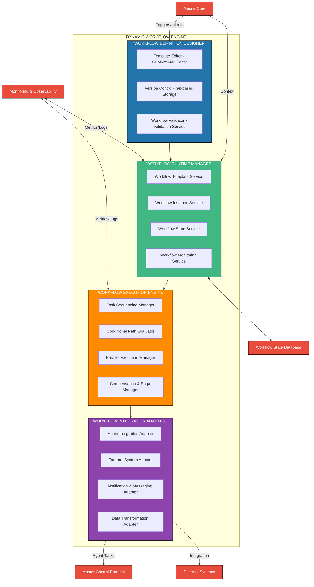

### 3.1 Technical Stack

| Component | Technologies | Purpose |
|-----------|--------------|---------|
| Workflow Definition Designer | React, Monaco Editor, BPMN.js | Visual workflow designer and editor |
| Workflow Runtime Manager | Temporal.io, Spring Boot, Node.js | Workflow instance and state management |
| Workflow Execution Engine | Temporal Workers, Camunda, Custom Execution Engine | Task execution and flow control |
| Workflow Integration Adapters | gRPC, REST, GraphQL, Message Adapters | Integration with agents and systems |
| Workflow State Database | PostgreSQL, MongoDB, Redis | State persistence and retrieval |
| Monitoring & Observability | Prometheus, OpenTelemetry, Grafana | System monitoring and observability |

### 3.2 Component Details

#### 3.2.1 Workflow Definition Designer
- **Template Editor**: Web-based visual editor for creating BPMN/YAML workflow definitions
- **Version Control**: Git-based versioning of workflow templates
- **Workflow Validator**: Validates workflow definitions against schema and business rules

#### 3.2.2 Workflow Runtime Manager
- **Workflow Template Service**: Manages workflow templates and versions
- **Workflow Instance Service**: Creates and tracks workflow instances
- **Workflow State Service**: Manages workflow state across execution
- **Workflow Monitoring Service**: Tracks and reports workflow execution status

#### 3.2.3 Workflow Execution Engine
- **Task Sequencing Manager**: Controls the order of task execution
- **Conditional Path Evaluator**: Evaluates conditions for branching
- **Parallel Execution Manager**: Handles concurrent task execution
- **Compensation & Saga Manager**: Handles failures and rollbacks

#### 3.2.4 Workflow Integration Adapters
- **Agent Integration Adapter**: Connects workflows to Agentic Products
- **External System Adapter**: Integrates with external enterprise systems
- **Notification & Messaging Adapter**: Handles notifications and messaging
- **Data Transformation Adapter**: Transforms data between formats

## 4. Data Models

### 4.1 Workflow Definition Model

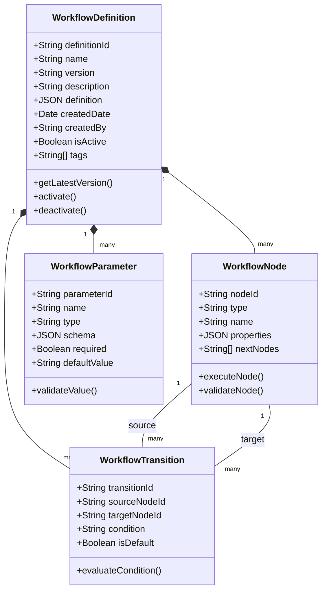

### 4.2 Workflow Instance Model

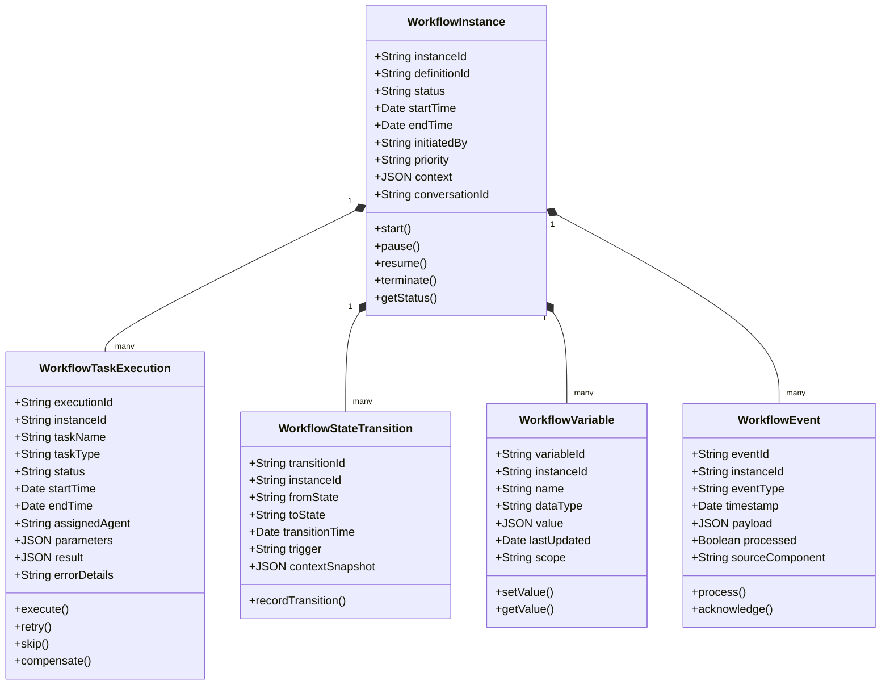

### 4.3 Workflow State Model

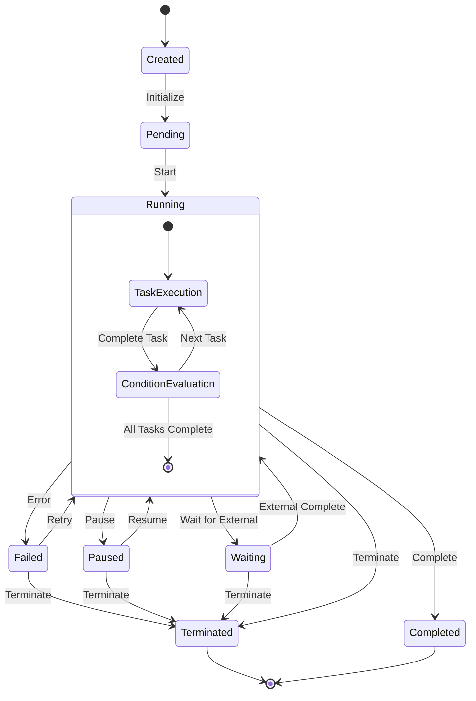

## 5. API Specifications

### 5.1 Workflow Definition API

#### 5.1.1 Create Workflow Definition

```
POST /api/v1/workflow/definitions
Content-Type: application/json
Authorization: Bearer {token}

Request Body:
{
  "name": "Customer Onboarding",
  "description": "Process for onboarding new customers",
  "definition": {
    "nodes": [...],
    "transitions": [...],
    "parameters": [...]
  },
  "tags": ["customer", "onboarding", "registration"]
}

Response (201 Created):
{
  "definitionId": "wfd-12345",
  "name": "Customer Onboarding",
  "version": "1.0.0",
  "createdDate": "2025-05-07T14:30:00Z",
  "createdBy": "system",
  "isActive": true,
  "links": {
    "self": "/api/v1/workflow/definitions/wfd-12345",
    "instances": "/api/v1/workflow/definitions/wfd-12345/instances"
  }
}
```

#### 5.1.2 Get Workflow Definition

```
GET /api/v1/workflow/definitions/{definitionId}
Authorization: Bearer {token}

Response (200 OK):
{
  "definitionId": "wfd-12345",
  "name": "Customer Onboarding",
  "version": "1.0.0",
  "description": "Process for onboarding new customers",
  "definition": {
    "nodes": [...],
    "transitions": [...],
    "parameters": [...]
  },
  "createdDate": "2025-05-07T14:30:00Z",
  "createdBy": "system",
  "isActive": true,
  "tags": ["customer", "onboarding", "registration"],
  "links": {
    "self": "/api/v1/workflow/definitions/wfd-12345",
    "instances": "/api/v1/workflow/definitions/wfd-12345/instances"
  }
}
```

### 5.2 Workflow Instance API

#### 5.2.1 Create Workflow Instance

```
POST /api/v1/workflow/instances
Content-Type: application/json
Authorization: Bearer {token}

Request Body:
{
  "definitionId": "wfd-12345",
  "context": {
    "userId": "user-67890",
    "conversationId": "conv-54321",
    "parameters": {
      "customerName": "Acme Corp",
      "customerType": "enterprise",
      "priority": "high"
    }
  },
  "priority": "high"
}

Response (201 Created):
{
  "instanceId": "wfi-67890",
  "definitionId": "wfd-12345",
  "status": "created",
  "startTime": "2025-05-07T14:35:00Z",
  "initiatedBy": "user-67890",
  "priority": "high",
  "links": {
    "self": "/api/v1/workflow/instances/wfi-67890",
    "definition": "/api/v1/workflow/definitions/wfd-12345",
    "tasks": "/api/v1/workflow/instances/wfi-67890/tasks",
    "events": "/api/v1/workflow/instances/wfi-67890/events"
  }
}
```

#### 5.2.2 Start Workflow Instance

```
POST /api/v1/workflow/instances/{instanceId}/start
Authorization: Bearer {token}

Response (200 OK):
{
  "instanceId": "wfi-67890",
  "status": "running",
  "startTime": "2025-05-07T14:35:00Z",
  "currentTasks": [
    {
      "taskId": "task-12345",
      "name": "Validate Customer Information",
      "status": "running"
    }
  ],
  "links": {
    "self": "/api/v1/workflow/instances/wfi-67890"
  }
}
```

### 5.3 Task Execution API

#### 5.3.1 Create Task

```
POST /api/v1/workflow/tasks
Content-Type: application/json
Authorization: Bearer {token}

Request Body:
{
  "instanceId": "wfi-67890",
  "taskName": "Validate Customer Information",
  "taskType": "validation",
  "parameters": {
    "customerName": "Acme Corp",
    "customerType": "enterprise"
  },
  "assignedAgent": "validation-agent"
}

Response (201 Created):
{
  "executionId": "task-12345",
  "instanceId": "wfi-67890",
  "taskName": "Validate Customer Information",
  "taskType": "validation",
  "status": "pending",
  "assignedAgent": "validation-agent",
  "links": {
    "self": "/api/v1/workflow/tasks/task-12345",
    "instance": "/api/v1/workflow/instances/wfi-67890"
  }
}
```

#### 5.3.2 Complete Task

```
POST /api/v1/workflow/tasks/{taskId}/complete
Content-Type: application/json
Authorization: Bearer {token}

Request Body:
{
  "result": {
    "isValid": true,
    "validationDetails": {
      "nameValid": true,
      "typeValid": true
    }
  }
}

Response (200 OK):
{
  "executionId": "task-12345",
  "status": "completed",
  "startTime": "2025-05-07T14:36:00Z",
  "endTime": "2025-05-07T14:37:00Z",
  "links": {
    "self": "/api/v1/workflow/tasks/task-12345",
    "instance": "/api/v1/workflow/instances/wfi-67890",
    "next": "/api/v1/workflow/tasks/task-67890"
  }
}
```

## 6. Sequence Flows

### 6.1 Workflow Instantiation and Execution

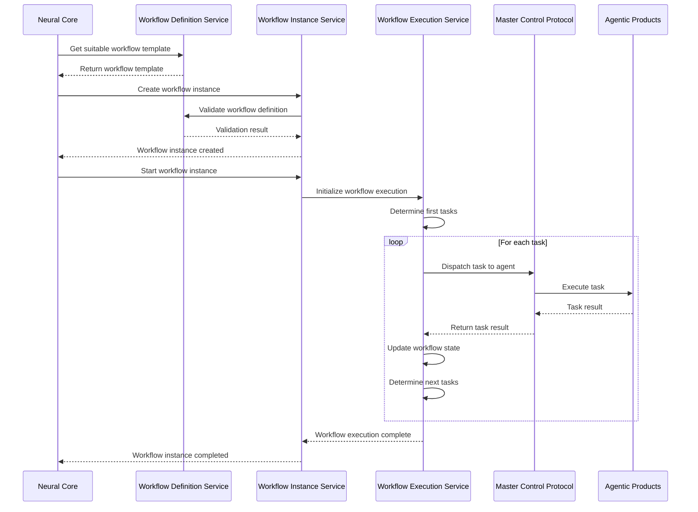

### 6.2 Conditional Branching Flow

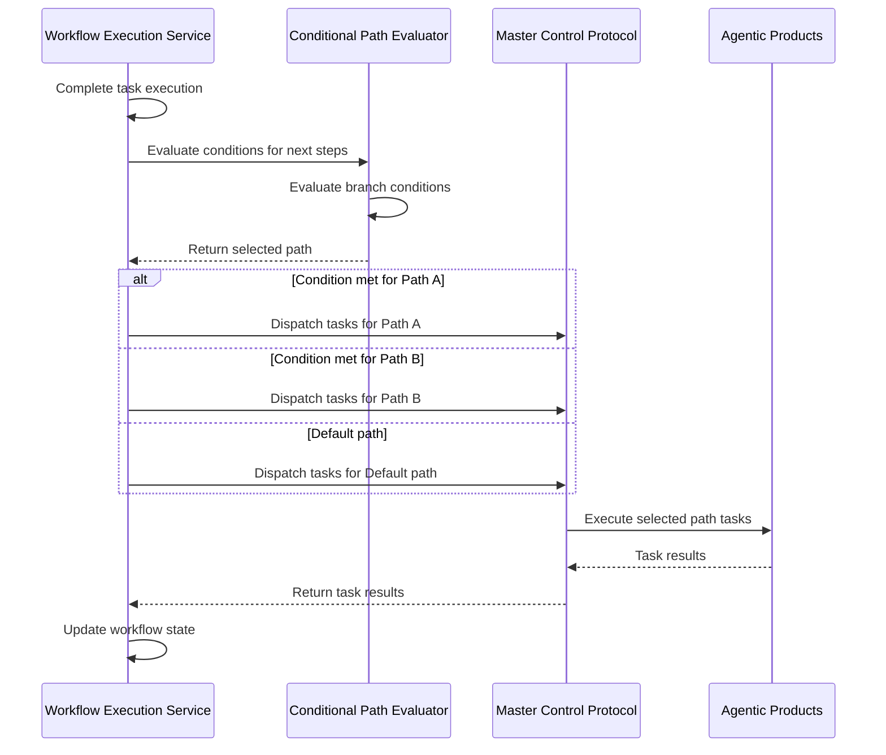

### 6.3 Error Handling and Compensation

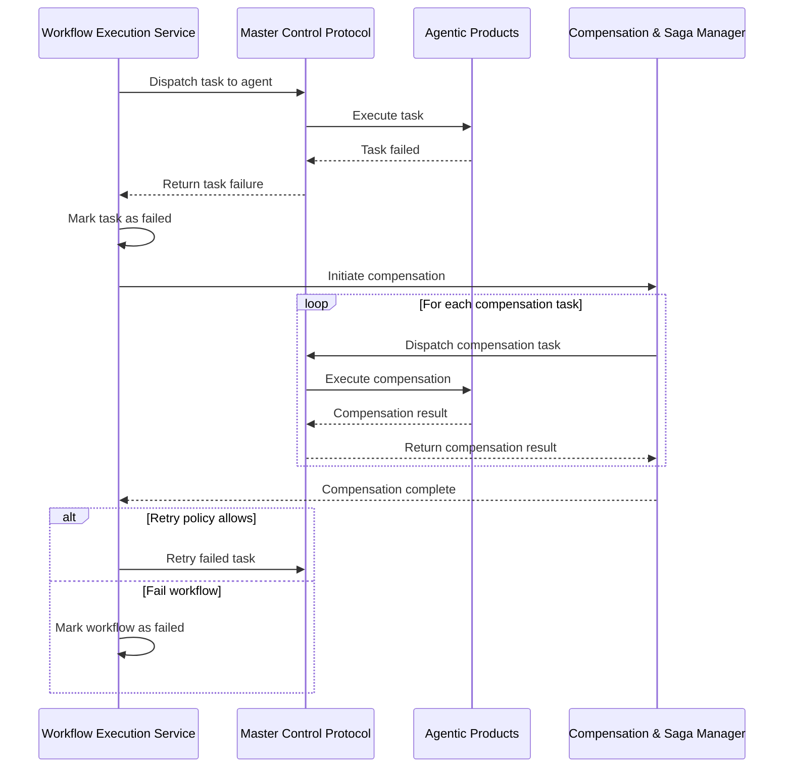

## 7. State Management

### 7.1 Workflow State Architecture

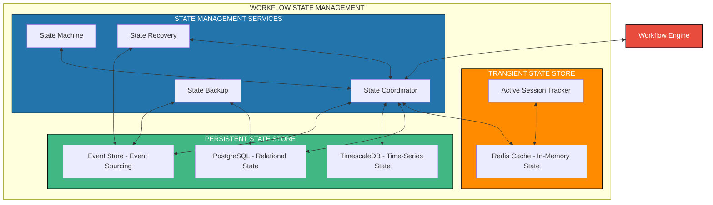

### 7.2 State Management Patterns

The Dynamic Workflow Engine implements multiple state management patterns to ensure reliability and consistency:

1. **Event Sourcing**: All state changes are recorded as immutable events
   - Benefits: Complete audit trail, reliable replay capability
   - Implementation: EventStoreDB, Apache Kafka with compacted topics

2. **Command Query Responsibility Segregation (CQRS)**:
   - Command side: Event-based state changes
   - Query side: Optimized read models
   - Implementation: Separate write and read databases

3. **Saga Pattern**: Coordinating distributed transactions across services
   - Orchestration approach: Central coordinator manages the saga
   - Choreography approach: Events trigger next steps
   - Implementation: Temporal.io workflows, custom saga coordinator

4. **State Machine**: Explicit representation of workflow states and transitions
   - Implementation: State machine frameworks, rules engines

### 7.3 Consistency Models

The Dynamic Workflow Engine employs different consistency models depending on the state component:

1. **Strong Consistency**: Used for critical workflow state transitions
   - Implementation: PostgreSQL with ACID transactions

2. **Eventual Consistency**: Used for distributed, non-critical state
   - Implementation: Event sourcing with asynchronous projections

3. **Causal Consistency**: Used for related state changes
   - Implementation: Vector clocks, causal ordering

## 8. Error Handling

### 8.1 Error Classification

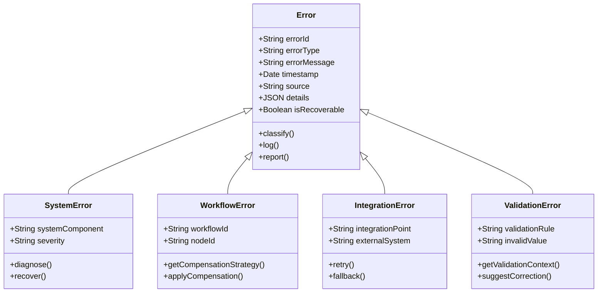

### 8.2 Error Handling Strategy

The Dynamic Workflow Engine implements a comprehensive error handling strategy:

1. **Detection**: Multiple mechanisms to detect errors
   - Exception handling in code
   - Timeout detection for long-running operations
   - Health checks and heartbeats for services
   - Validation checks for data integrity

2. **Classification**: Categorizing errors for appropriate handling
   - Transient vs. Persistent errors
   - System vs. Business errors
   - Recoverable vs. Non-recoverable errors

3. **Recovery**: Strategies for recovering from errors
   - Retry with exponential backoff
   - Circuit breaker pattern
   - Fallback mechanisms
   - Compensation transactions

4. **Reporting**: Communicating errors to relevant parties
   - Structured error logging
   - Error notification and alerting
   - Error dashboards
   - User-friendly error messages

### 8.3 Circuit Breaker Pattern

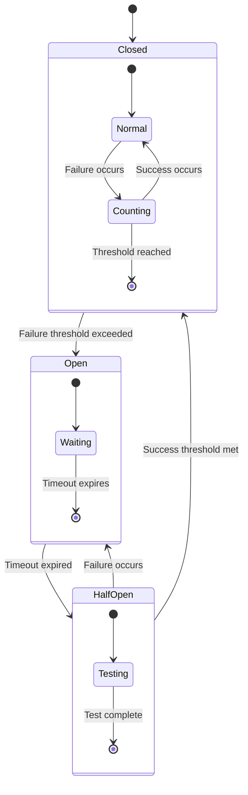

## 9. Scalability Considerations

### 9.1 Scalability Architecture

```mermaid
flowchart TD
    subgraph SC["SCALABILITY COMPONENTS"]
        subgraph HSM["HORIZONTAL SCALING MECHANISMS"]
            SPOD["Service Pod Replication"]
            WREP["Worker Replication"]
            PSHR["Partition Sharding"]
        end
        
        subgraph LBM["LOAD BALANCING MECHANISMS"]
            INGR["Ingress Controllers"]
            SRVM["Service Mesh Routing"]
            CBAL["Client-side Balancing"]
        end
        
        subgraph DBS["DATABASE SCALING"]
            RDBS["Relational DB Scaling"]
            RDSP["Read Replicas"]
            DBSH["Database Sharding"]
        end
        
        subgraph CAM["CACHING & MEMORY"]
            RCAC["Redis Caching"]
            DCAC["Distributed Caching"]
            LCAC["Local Caching"]
        end
    end
    
    SPOD --> INGR
    WREP --> SRVM
    WREP --> CBAL
    PSHR --> DBSH
    
    INGR --> API["API Gateway"]
    SRVM --> SVC["Microservices"]
    CBAL --> WRK["Workers"]
    
    RDBS --> PDB["Primary Database"]
    RDSP --> RDB["Read Databases"]
    DBSH --> SDB["Shard Databases"]
    
    RCAC --> RC["Redis Cluster"]
    DCAC --> DC["Distributed Cache"]
    LCAC --> LC["Local Cache"]
    
    classDef horizontal fill:#41b883,stroke:#000,stroke-width:1px,color:#fff
    classDef loadbalance fill:#ff8c00,stroke:#000,stroke-width:1px,color:#fff
    classDef dbscale fill:#2374ab,stroke:#000,stroke-width:1px,color:#fff
    classDef cache fill:#8e44ad,stroke:#000,stroke-width:1px,color:#fff
    classDef external fill:#e74c3c,stroke:#000,stroke-width:1px,color:#fff
    
    class HSM horizontal
    class LBM loadbalance
    class DBS dbscale
    class CAM cache
    class API,SVC,WRK,PDB,RDB,SDB,RC,DC,LC external
```

### 9.2 Scalability Strategies

#### 9.2.1 Workflow Definition Service Scaling
- Stateless service with horizontal scaling
- Cache workflow definitions in distributed cache
- Read replicas for database access

#### 9.2.2 Workflow Execution Service Scaling
- Partitioning by workflow type/domain
- Worker pool scaling based on workload
- Sticky sessions for workflow instances

#### 9.2.3 Database Scaling
- Vertical scaling for write-heavy operations
- Read replicas for read-heavy operations
- Time-based partitioning for historical data
- Tenant-based sharding for multi-tenant deployments

#### 9.2.4 Caching Strategy
- Multi-level caching approach
- Hot workflow definitions in memory
- Active workflow instances in Redis
- Cache invalidation through events

## 10. Security Considerations

### 10.1 Security Architecture

```mermaid
flowchart TD
    subgraph SA["SECURITY ARCHITECTURE"]
        subgraph AAA["AUTHENTICATION & AUTHORIZATION"]
            IDPS["Identity Provider Service"]
            OAUT["OAuth 2.0/OIDC Implementation"]
            RBAC["Role-Based Access Control"]
            ABAC["Attribute-Based Access Control"]
        end
        
        subgraph DPS["DATA PROTECTION"]
            ENCT["Encryption at Rest"]
            ENTR["Encryption in Transit"]
            TKEY["Tenant Key Management"]
            MSKG["Data Masking & Tokenization"]
        end
        
        subgraph SECOPS["SECURITY OPERATIONS"]
            SCAN["Vulnerability Scanning"]
            SAST["Static Analysis"]
            DAST["Dynamic Analysis"]
            AUDIT["Audit Logging"]
        end
        
        subgraph NETSEC["NETWORK SECURITY"]
            NSEG["Network Segmentation"]
            MTLS["Mutual TLS"]
            WAFT["Web Application Firewall"]
            DDOS["DDoS Protection"]
        end
    end
    
    USER["Users & Systems"] --> IDPS
    IDPS --> OAUT
    OAUT --> RBAC
    OAUT --> ABAC
    
    APP["Application Layer"] --> ENCT
    APP --> ENTR
    APP --> TKEY
    APP --> MSKG
    
    CI["CI/CD Pipeline"] --> SCAN
    CI --> SAST
    APP --> DAST
    APP --> AUDIT
    
    NET["Network Layer"] --> NSEG
    NET --> MTLS
    NET --> WAFT
    NET --> DDOS
    
    classDef auth fill:#41b883,stroke:#000,stroke-width:1px,color:#fff
    classDef data fill:#ff8c00,stroke:#000,stroke-width:1px,color:#fff
    classDef ops fill:#2374ab,stroke:#000,stroke-width:1px,color:#fff
    classDef net fill:#8e44ad,stroke:#000,stroke-width:1px,color:#fff
    classDef external fill:#e74c3c,stroke:#000,stroke-width:1px,color:#fff
    
    class AAA auth
    class DPS data
    class SECOPS ops
    class NETSEC net
    class USER,APP,CI,NET external
```

### 10.2 Security Controls Implementation

| Security Domain | Control | Implementation |
|-----------------|---------|----------------|
| Authentication | Identity Federation | Integration with enterprise IdP (Okta, Azure AD) |
| Authentication | Multi-factor Authentication | TOTP, WebAuthn, Push notifications |
| Authorization | Role-Based Access Control | Role definitions, permission matrices |
| Authorization | Attribute-Based Access Control | Dynamic policy evaluation engine |
| Data Protection | Encryption at Rest | AES-256 encryption, NIST-compliant key management |
| Data Protection | Encryption in Transit | TLS 1.3, Perfect Forward Secrecy |
| Data Protection | Tenant Isolation | Data partitioning, encryption with tenant keys |
| Network Security | Segmentation | VPC/subnet isolation, security groups |
| Network Security | API Protection | API gateway, request validation, rate limiting |
| Audit & Compliance | Comprehensive Logging | Structured logging, tamper-evident logs |
| Audit & Compliance | Activity Monitoring | Behavioral analysis, anomaly detection |

### 10.3 Workflow-Specific Security Considerations

1. **Workflow Definition Security**:
   - Signed workflow definitions
   - Approval workflows for sensitive operations
   - Version control and auditing

2. **Workflow Execution Security**:
   - Least privilege execution
   - Context-based authorization
   - Task isolation

3. **Integration Security**:
   - Secure credential management
   - Connection pooling
   - API key rotation

4. **Data Flow Security**:
   - Data classification
   - Data minimization
   - Data lineage tracking

## 11. Testing Strategy

### 11.1 Testing Architecture

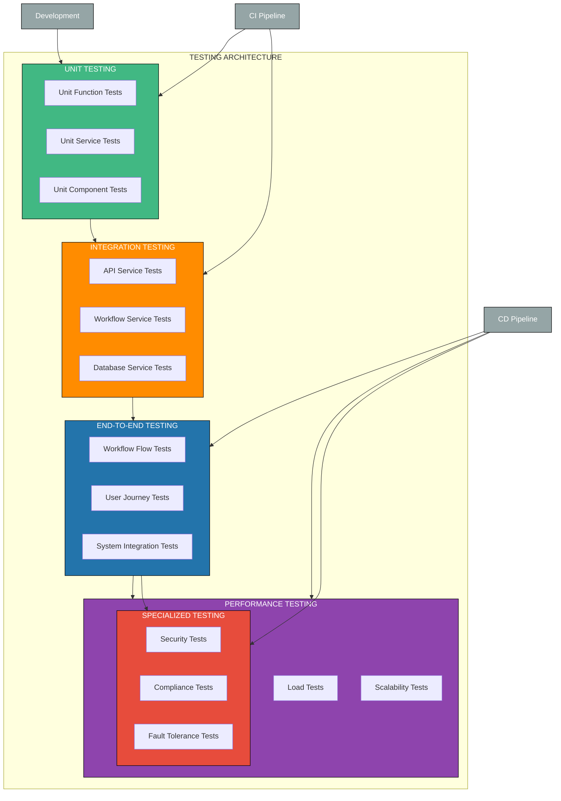

### 11.2 Test Types and Frameworks

| Test Type | Scope | Frameworks & Tools | CI/CD Stage |
|-----------|-------|-------------------|-------------|
| Unit Tests | Individual functions, classes, components | JUnit, pytest, Jest, Mocha | Build |
| Integration Tests | Service interactions, API contracts | REST Assured, Pact, Postman | Build |
| Workflow Tests | Workflow definitions, execution paths | Custom workflow test framework | Integration |
| Database Tests | Data access, migrations, schemas | Flyway, Liquibase, TestContainers | Integration |
| End-to-End Tests | Complete user flows, system integration | Cypress, Playwright, Selenium | Deployment |
| Performance Tests | Load, stress, scalability | JMeter, Gatling, k6 | Post-Deployment |
| Security Tests | Vulnerabilities, compliance | OWASP ZAP, SonarQube, Checkmarx | Post-Deployment |
| Chaos Tests | Fault tolerance, resilience | Chaos Monkey, Gremlin | Post-Deployment |

### 11.3 Workflow Engine Testing Strategy

1. **Workflow Definition Testing**:
   - Syntax validation
   - Semantic validation
   - Version compatibility

2. **Workflow Execution Testing**:
   - Path coverage
   - Condition evaluation
   - State transitions

3. **Concurrency Testing**:
   - Parallel workflow execution
   - Resource contention
   - Race conditions

4. **Integration Testing**:
   - Agent interaction
   - External system integration
   - Error handling

5. **Performance Testing**:
   - Workflow throughput
   - Execution latency
   - Resource utilization

## 12. Implementation Milestones

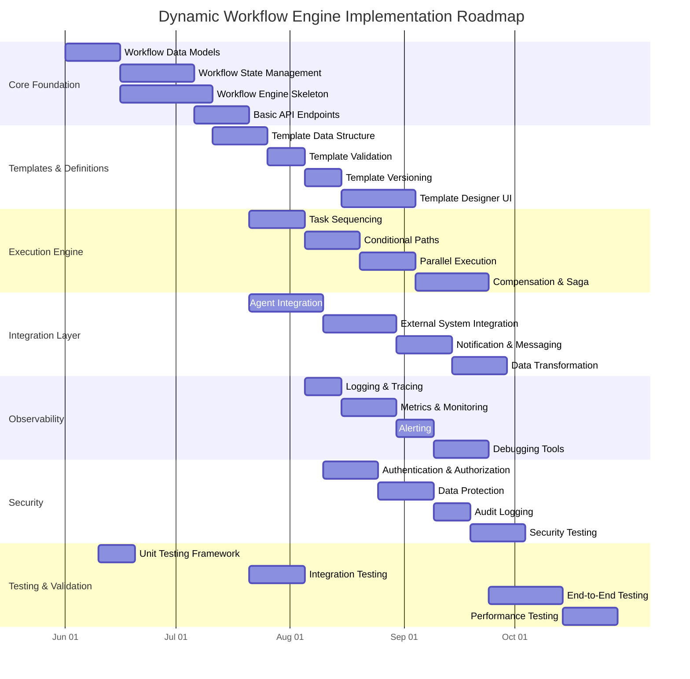

### 12.1 Implementation Dependencies

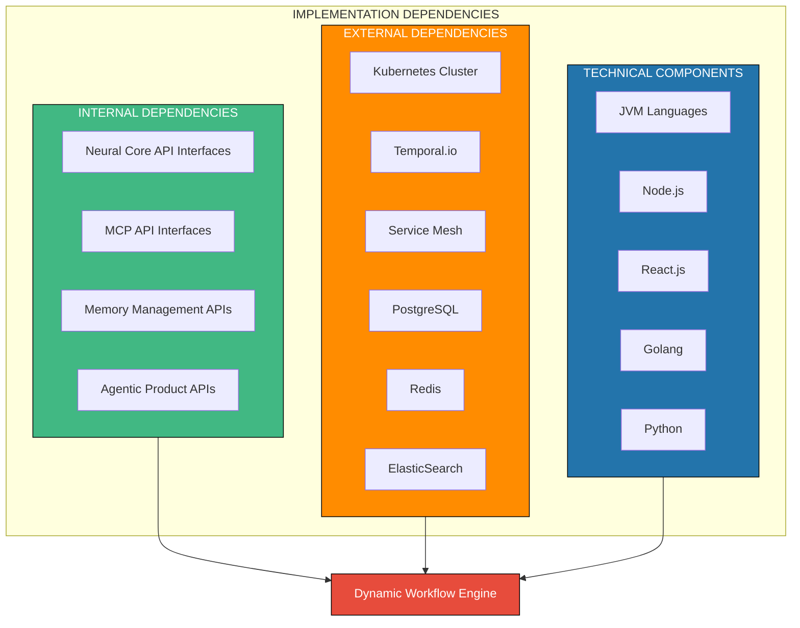

### 12.2 Phased Implementation Approach

#### Phase 1: Core Foundation (Months 1-2)
- Basic workflow data models
- Workflow state persistence
- Simple workflow execution
- Core API interfaces

#### Phase 2: Workflow Definition & Execution (Months 3-4)
- Workflow template management
- Conditional execution paths
- Parallel task execution
- Basic error handling

#### Phase 3: Integration & Extensions (Months 5-6)
- Agent integration adapters
- External system adapters
- Notification systems
- Advanced error handling

#### Phase 4: Advanced Features (Months 7-8)
- Workflow designer UI
- Advanced monitoring
- Performance optimization
- Production hardening

### 12.3 Critical Path Items

1. **Workflow state management**: Foundation for reliable execution
2. **Integration with MCP**: Required for agent task execution
3. **Template versioning**: Essential for production deployment
4. **Error handling & compensation**: Critical for production reliability

## Appendix A: Glossary

| Term | Definition |
|------|------------|
| Workflow | A defined sequence of steps to accomplish a process |
| Workflow Definition | Template specifying the structure and logic of a workflow |
| Workflow Instance | A running instance of a workflow definition |
| Task | An individual unit of work within a workflow |
| Transition | Movement from one workflow state to another |
| Condition | A logical expression that determines workflow path |
| Compensation | Actions taken to undo or correct previous tasks |
| Saga | Pattern for managing distributed transactions |
| MCP | Master Control Protocol, the orchestration layer |
| Agent | A specialized component that executes specific tasks |

## Appendix B: References

1. Workflow Management Coalition Specifications
2. BPMN 2.0 Specification
3. Temporal.io Documentation
4. Camunda Platform Documentation
5. Kubernetes Operator Pattern
6. Event Sourcing and CQRS Patterns
7. Saga Pattern Implementation Approaches
```

You can save this content as a markdown file (e.g., `dynamic-workflow-engine-tdd.md`) and it will be fully compatible with GitHub's rendering, including all the Mermaid diagrams which GitHub natively supports.
